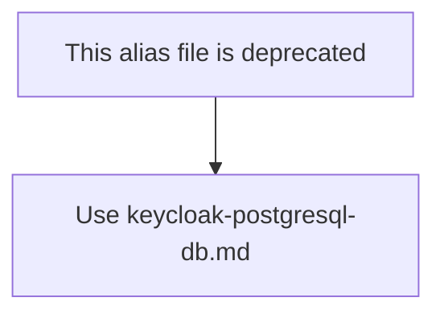

# Keycloak Database Schema (Compatibility Alias)

This file is kept for backward compatibility.

- Canonical file: [keycloak-postgresql-db.md](./keycloak-postgresql-db.md)
- Scope: Keycloak internal PostgreSQL schema only
- Authority: Do not treat this alias file as the source of truth

For current architecture rules, use:

1. [neo4j-ems-db.md](./neo4j-ems-db.md)
2. [keycloak-postgresql-db.md](./keycloak-postgresql-db.md)

## ERD (Mermaid)

