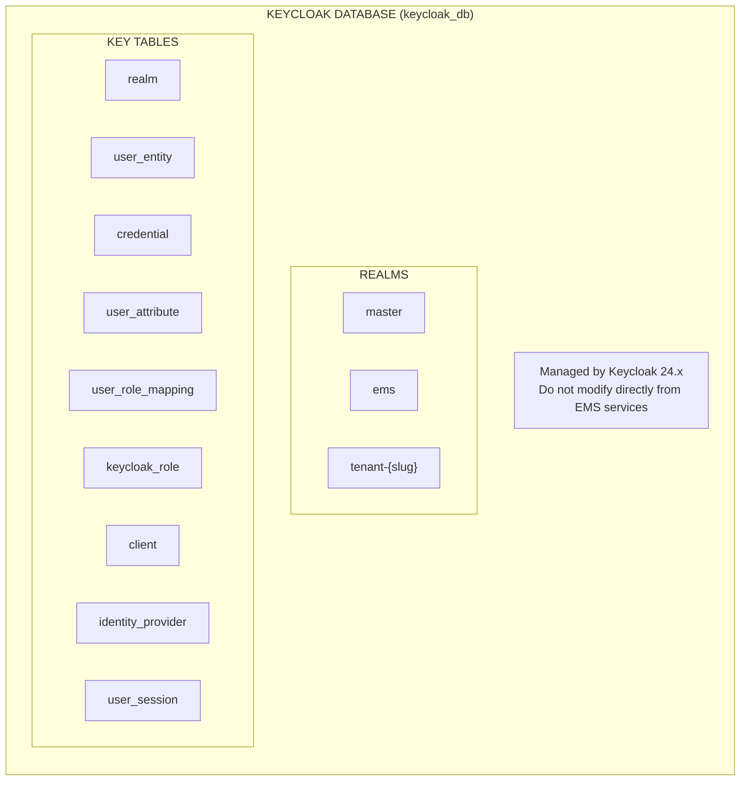
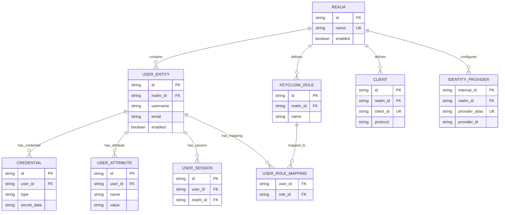

# Keycloak PostgreSQL Database Schema

## Status

- **Authority level:** Canonical database schema for Keycloak internal persistence
- **Database:** `keycloak_db`
- **Engine:** PostgreSQL 16+
- **Ownership:** Keycloak platform operations
- **Rule:** EMS services must not write directly to this schema

## Purpose

This file documents the Keycloak-internal relational model used for identity federation and token/session persistence.

- This database is Keycloak-managed.
- EMS application domain data is not persisted here.
- EMS application data is documented in [neo4j-ems-db.md](./neo4j-ems-db.md).

## Topology

## ERD (Mermaid)

## Integration Contract with EMS

EMS integrations are API-based through Keycloak and auth-facade:

- Keycloak Admin REST API
- Token endpoint
- UserInfo endpoint
- Event-driven sync into EMS Neo4j user graph

Direct SQL reads/writes from EMS services are not part of the standard.

## Operational Rules

- Backups and restore procedures are managed as Keycloak platform operations.
- Schema evolution follows Keycloak version upgrades, not EMS migration scripts.
- Access is restricted to Keycloak runtime and approved platform administrators.

---

**Last Updated:** 2026-02-27
