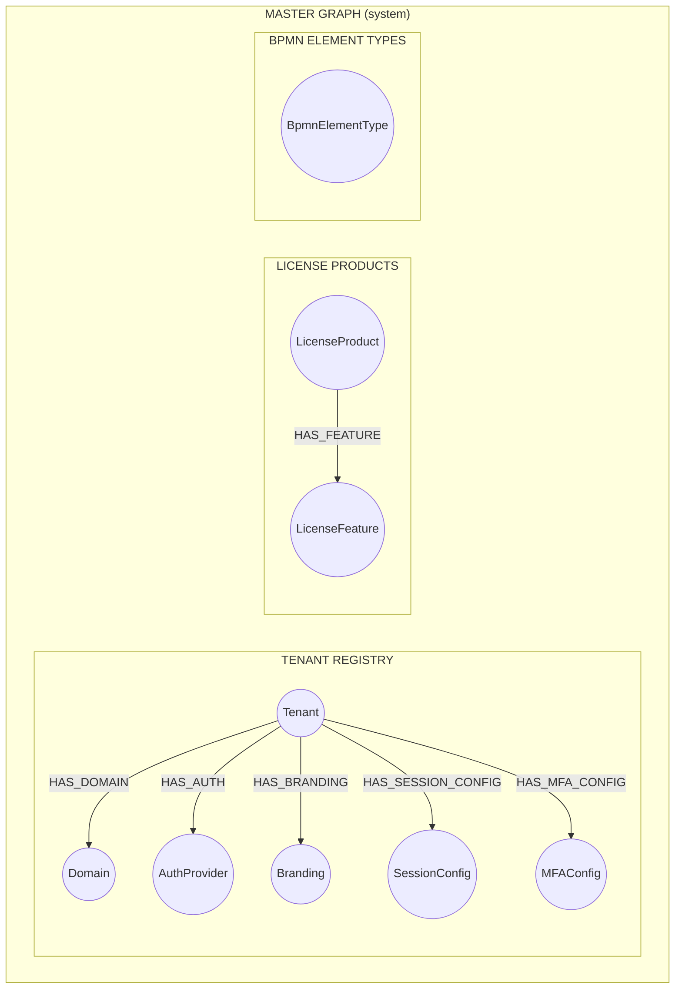
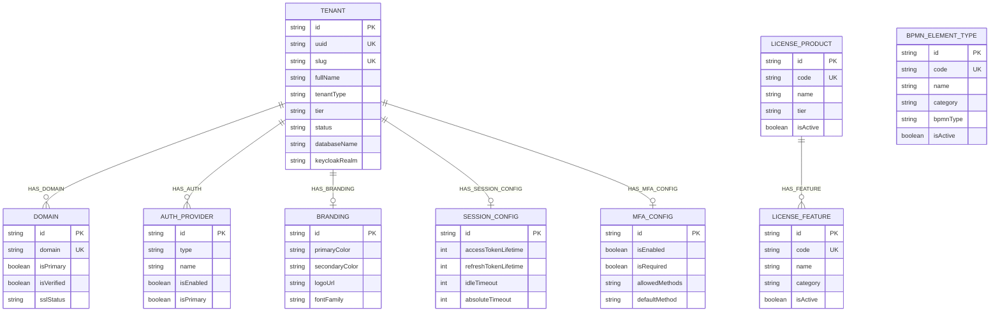
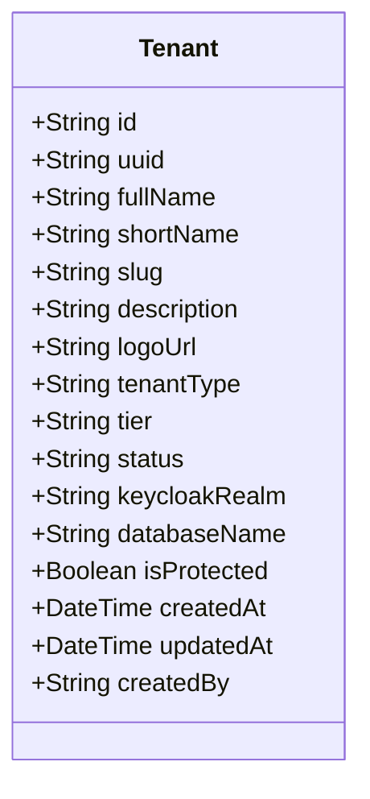
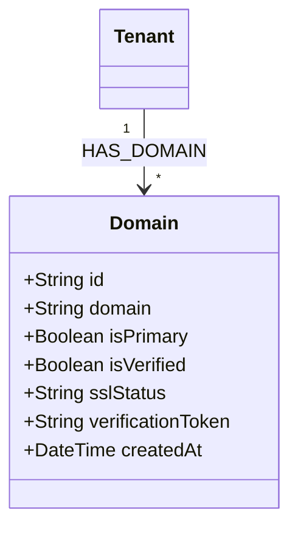
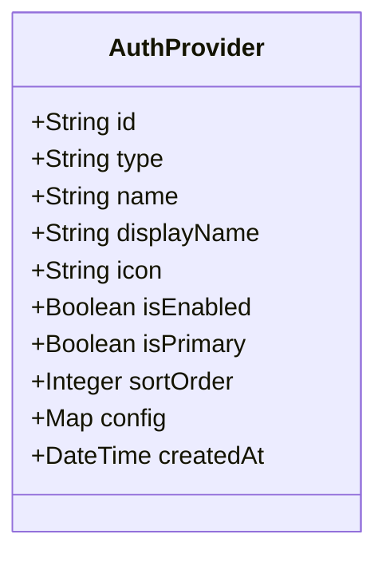
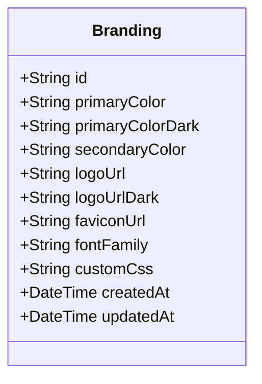
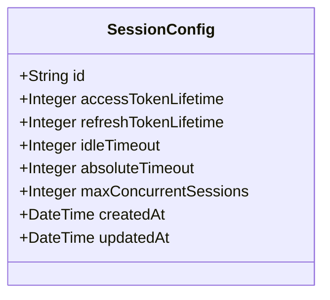
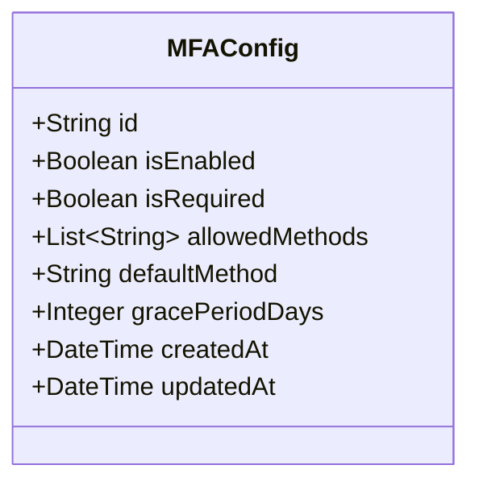
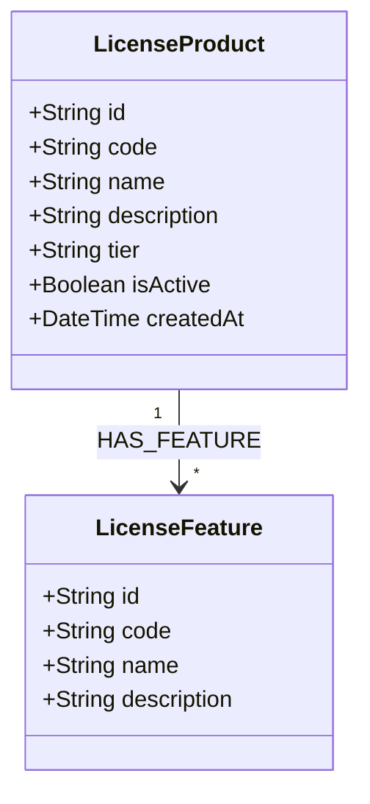
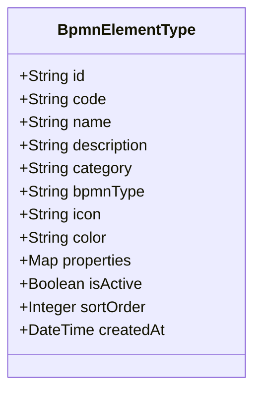

# Master Graph Schema

> Legacy focused view. The canonical per-database source is [neo4j-ems-db.md](./neo4j-ems-db.md).

The master graph (database: `system`) contains tenant registry information and system-wide configurations. Each tenant's actual data resides in their own dedicated graph database.

## Overview



## ERD (Mermaid)



## Node Definitions

### Tenant

Core tenant registry node with database routing information.



**Properties:**

| Property | Type | Constraints | Description |
|----------|------|-------------|-------------|
| id | String | Required, Unique | Tenant identifier (e.g., "tenant-abc") |
| uuid | String | Required, Unique | System-generated UUID |
| fullName | String | Required | Full organization name |
| shortName | String | Required | Short display name |
| slug | String | Required, Unique | URL-safe identifier |
| description | String | | Organization description |
| logoUrl | String | | Logo URL |
| tenantType | String | Required | MASTER, DOMINANT, REGULAR |
| tier | String | Required | FREE, STANDARD, PROFESSIONAL, ENTERPRISE |
| status | String | Required | ACTIVE, LOCKED, SUSPENDED, PENDING |
| keycloakRealm | String | | Keycloak realm name |
| databaseName | String | Required | Neo4j database name (tenant_{slug}) |
| isProtected | Boolean | | Cannot be deleted if true |
| createdAt | DateTime | Required | |
| updatedAt | DateTime | Required | |
| createdBy | String | | User who created tenant |

**Constraints:**
```cypher
CREATE CONSTRAINT tenant_id FOR (t:Tenant) REQUIRE t.id IS UNIQUE;
CREATE CONSTRAINT tenant_slug FOR (t:Tenant) REQUIRE t.slug IS UNIQUE;
CREATE CONSTRAINT tenant_uuid FOR (t:Tenant) REQUIRE t.uuid IS UNIQUE;
```

### Domain

Custom domains per tenant for multi-domain support.



**Relationship:** `(:Tenant)-[:HAS_DOMAIN]->(:Domain)`

### AuthProvider

SSO and authentication provider configurations per tenant.



**Types:** LOCAL, AZURE_AD, SAML, OIDC, LDAP, UAEPASS, GOOGLE

**Relationship:** `(:Tenant)-[:HAS_AUTH]->(:AuthProvider)`

### Branding

UI customization per tenant.



**Relationship:** `(:Tenant)-[:HAS_BRANDING]->(:Branding)`

### SessionConfig

Session and token configuration per tenant.



**Relationship:** `(:Tenant)-[:HAS_SESSION_CONFIG]->(:SessionConfig)`

### MFAConfig

MFA configuration per tenant.



**Allowed Methods:** TOTP, SMS, EMAIL

**Relationship:** `(:Tenant)-[:HAS_MFA_CONFIG]->(:MFAConfig)`

### LicenseProduct

System-wide license product catalog.



**Constraints:**
```cypher
CREATE CONSTRAINT license_product_code FOR (lp:LicenseProduct) REQUIRE lp.code IS UNIQUE;
```

### BpmnElementType

System-wide BPMN element type definitions.



**Categories:** EVENT, TASK, GATEWAY, SUBPROCESS, DATA, ARTIFACT

**Constraints:**
```cypher
CREATE CONSTRAINT bpmn_element_code FOR (b:BpmnElementType) REQUIRE b.code IS UNIQUE;
```

## Sample Cypher Queries

### Get tenant with all configurations

```cypher
MATCH (t:Tenant {slug: $slug})
OPTIONAL MATCH (t)-[:HAS_DOMAIN]->(d:Domain)
OPTIONAL MATCH (t)-[:HAS_BRANDING]->(b:Branding)
OPTIONAL MATCH (t)-[:HAS_AUTH]->(a:AuthProvider)
RETURN t, collect(d) as domains, b, collect(a) as authProviders
```

### Get active license products with features

```cypher
MATCH (lp:LicenseProduct {isActive: true})-[:HAS_FEATURE]->(lf:LicenseFeature)
RETURN lp, collect(lf) as features
ORDER BY lp.tier
```

---

**Database:** Neo4j 5.x (database: `system`)
**Last Updated:** 2026-02-24
