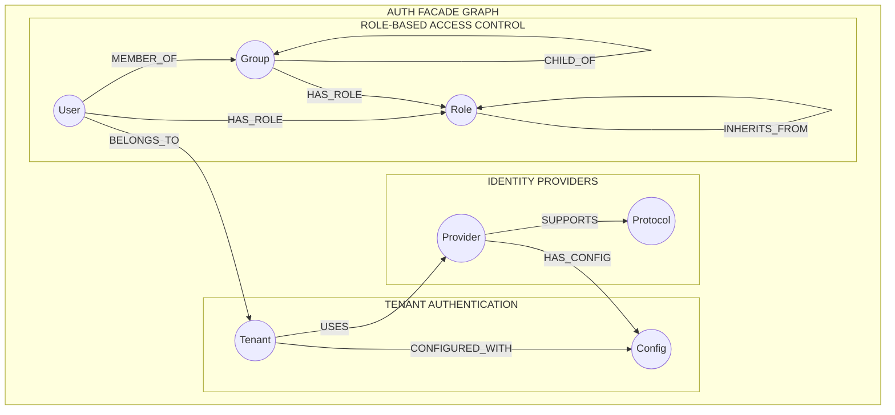
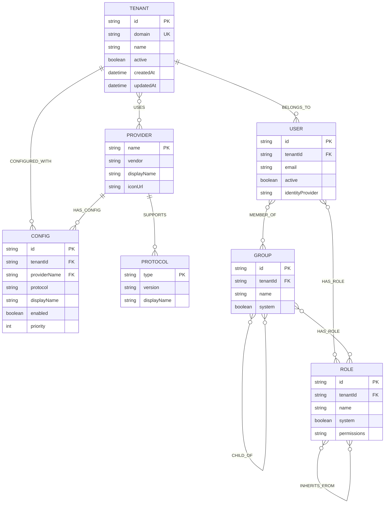
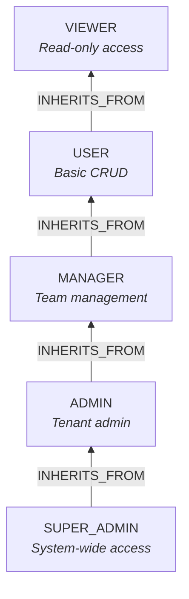

# Neo4j Auth Graph Schema

> Legacy focused view. The canonical per-database source is [neo4j-ems-db.md](./neo4j-ems-db.md).

The Auth Facade service uses Neo4j as its **sole database** for identity provider configurations, graph-based RBAC, and tenant authentication settings. This document defines the complete graph schema for the authentication subsystem.

## Overview



## ERD (Mermaid)



## Supported Identity Providers

| Provider | Vendor | Protocols | Description |
|----------|--------|-----------|-------------|
| KEYCLOAK | Red Hat | OIDC, SAML | Primary self-hosted IdP |
| AUTH0 | Okta | OIDC | Cloud identity platform |
| OKTA | Okta | OIDC | Enterprise identity provider |
| AZURE_AD | Microsoft | OIDC | Microsoft Entra ID (Azure AD) |
| GOOGLE | Google | OIDC | Google Workspace/Consumer accounts |
| MICROSOFT | Microsoft | OIDC | Consumer Microsoft accounts |
| GITHUB | Microsoft | OAuth2 | Developer authentication |
| UAE_PASS | UAE Government | OIDC | UAE national digital identity |
| IBM_IAM | IBM | OIDC | IBM Cloud Identity |
| SAML_GENERIC | Generic | SAML | Any SAML 2.0 provider |
| LDAP_GENERIC | Generic | LDAP | Active Directory / LDAP servers |

## Supported Protocols

| Protocol | Version | Description |
|----------|---------|-------------|
| OIDC | 1.0 | OpenID Connect - Modern standard built on OAuth 2.0 |
| SAML | 2.0 | Security Assertion Markup Language - Enterprise SSO |
| LDAP | 3 | Lightweight Directory Access Protocol - Directory services |
| OAUTH2 | 2.0 | OAuth 2.0 - Authorization framework for social logins |

---

## Node Definitions

### Tenant

Core tenant node representing an organization with authentication configurations.

```cypher
(:Tenant {
    id: String,              // Unique tenant identifier (e.g., "acme-corp")
    domain: String,          // Primary domain for tenant resolution (e.g., "acme.com")
    name: String,            // Display name of the tenant
    active: Boolean,         // Whether tenant is active
    createdAt: DateTime,     // Creation timestamp
    updatedAt: DateTime      // Last update timestamp
})
```

**Relationships:**
- `(Tenant)-[:USES]->(Provider)` - Links tenant to enabled identity providers
- `(Tenant)-[:CONFIGURED_WITH]->(Config)` - Links tenant to provider configurations

**Constraints:**
```cypher
CREATE CONSTRAINT tenant_id IF NOT EXISTS
FOR (t:Tenant) REQUIRE t.id IS UNIQUE;

CREATE CONSTRAINT tenant_domain IF NOT EXISTS
FOR (t:Tenant) REQUIRE t.domain IS UNIQUE;
```

**Indexes:**
```cypher
CREATE INDEX tenant_active IF NOT EXISTS
FOR (t:Tenant) ON (t.active);
```

---

### Provider

Identity provider definition node (shared across tenants).

```cypher
(:Provider {
    name: String,            // Unique provider identifier (e.g., "KEYCLOAK", "AUTH0")
    vendor: String,          // Provider vendor (e.g., "Red Hat", "Okta")
    displayName: String,     // UI display name
    iconUrl: String,         // Provider icon URL
    description: String      // Provider description
})
```

**Relationships:**
- `(Provider)-[:SUPPORTS]->(Protocol)` - Protocols supported by provider
- `(Provider)-[:HAS_CONFIG]->(Config)` - Configurations using this provider

**Constraints:**
```cypher
CREATE CONSTRAINT provider_name IF NOT EXISTS
FOR (p:Provider) REQUIRE p.name IS UNIQUE;
```

---

### Protocol

Authentication protocol definition node.

```cypher
(:Protocol {
    type: String,            // Protocol type (OIDC, SAML, LDAP, OAUTH2)
    version: String,         // Protocol version (e.g., "1.0", "2.0")
    displayName: String,     // UI display name
    description: String      // Protocol description
})
```

**Constraints:**
```cypher
CREATE CONSTRAINT protocol_type IF NOT EXISTS
FOR (p:Protocol) REQUIRE p.type IS UNIQUE;
```

---

### Config

Tenant-specific identity provider configuration node. Contains all settings needed to connect to an identity provider.

```cypher
(:Config {
    // === Identity ===
    id: String,                      // UUID - unique configuration ID
    tenantId: String,                // Denormalized tenant reference
    providerName: String,            // Denormalized provider reference
    displayName: String,             // Configuration display name
    protocol: String,                // Protocol type (OIDC, SAML, LDAP, OAUTH2)

    // === OIDC/OAuth2 Settings ===
    clientId: String,                // OAuth2 client ID
    clientSecretEncrypted: String,   // Jasypt-encrypted client secret
    discoveryUrl: String,            // OIDC discovery URL (/.well-known/openid-configuration)
    authorizationUrl: String,        // Authorization endpoint
    tokenUrl: String,                // Token endpoint
    userInfoUrl: String,             // User info endpoint
    jwksUrl: String,                 // JWKS URL for token validation
    issuerUrl: String,               // Token issuer URL
    scopes: List<String>,            // Requested OAuth scopes

    // === SAML Settings ===
    metadataUrl: String,             // SAML IdP metadata URL
    entityId: String,                // SAML SP entity ID
    signingCertificate: String,      // SAML signing certificate (PEM)

    // === LDAP Settings ===
    serverUrl: String,               // LDAP server URL (ldap://hostname)
    port: Integer,                   // LDAP port (389, 636 for LDAPS)
    bindDn: String,                  // LDAP bind DN
    bindPasswordEncrypted: String,   // Jasypt-encrypted bind password
    userSearchBase: String,          // LDAP user search base DN
    userSearchFilter: String,        // LDAP user search filter

    // === Common Settings ===
    idpHint: String,                 // Keycloak kc_idp_hint value
    enabled: Boolean,                // Whether configuration is active
    priority: Integer,               // Display priority (lower = higher)
    trustEmail: Boolean,             // Trust email from provider
    storeToken: Boolean,             // Store tokens from provider
    linkExistingAccounts: Boolean,   // Auto-link accounts by email

    // === Timestamps ===
    createdAt: DateTime,
    updatedAt: DateTime
})
```

**Relationships:**
- `(Tenant)-[:CONFIGURED_WITH]->(Config)` - Tenant owns this configuration
- `(Provider)-[:HAS_CONFIG]->(Config)` - Configuration is for this provider

**Constraints:**
```cypher
CREATE CONSTRAINT config_id IF NOT EXISTS
FOR (c:Config) REQUIRE c.id IS UNIQUE;
```

**Indexes:**
```cypher
CREATE INDEX config_tenant IF NOT EXISTS
FOR (c:Config) ON (c.tenantId);

CREATE INDEX config_provider IF NOT EXISTS
FOR (c:Config) ON (c.providerName);

CREATE INDEX config_enabled IF NOT EXISTS
FOR (c:Config) ON (c.enabled);
```

---

### User

User node for graph-based RBAC with identity provider federation.

```cypher
(:User {
    id: String,                  // UUID - unique user ID
    email: String,               // User email address
    firstName: String,           // First name
    lastName: String,            // Last name
    tenantId: String,            // Tenant this user belongs to
    active: Boolean,             // Whether user is active
    emailVerified: Boolean,      // Email verification status
    externalId: String,          // External IdP user ID (if federated)
    identityProvider: String,    // IdP that authenticated this user
    createdAt: DateTime,
    updatedAt: DateTime,
    lastLoginAt: DateTime        // Last login timestamp
})
```

**Relationships:**
- `(User)-[:MEMBER_OF]->(Group)` - Group memberships
- `(User)-[:HAS_ROLE]->(Role)` - Direct role assignments
- `(User)-[:BELONGS_TO]->(Tenant)` - Tenant membership

**Constraints:**
```cypher
CREATE CONSTRAINT user_id IF NOT EXISTS
FOR (u:User) REQUIRE u.id IS UNIQUE;
```

**Indexes:**
```cypher
CREATE INDEX user_email IF NOT EXISTS
FOR (u:User) ON (u.email);

CREATE INDEX user_tenant IF NOT EXISTS
FOR (u:User) ON (u.tenantId);

CREATE INDEX user_external IF NOT EXISTS
FOR (u:User) ON (u.externalId);

CREATE INDEX user_email_tenant IF NOT EXISTS
FOR (u:User) ON (u.email, u.tenantId);
```

---

### Group

Group node for aggregating users with shared roles.

```cypher
(:Group {
    id: String,              // UUID - unique group ID
    name: String,            // Group name (unique per tenant)
    displayName: String,     // UI display name
    description: String,     // Group description
    tenantId: String,        // Tenant this group belongs to
    systemGroup: Boolean,    // System group (cannot be deleted)
    createdAt: DateTime,
    updatedAt: DateTime
})
```

**Relationships:**
- `(User)-[:MEMBER_OF]->(Group)` - Users in this group
- `(Group)-[:HAS_ROLE]->(Role)` - Roles assigned to this group
- `(Group)-[:CHILD_OF]->(Group)` - Parent group for nested hierarchies

**Constraints:**
```cypher
CREATE CONSTRAINT group_id IF NOT EXISTS
FOR (g:Group) REQUIRE g.id IS UNIQUE;
```

**Indexes:**
```cypher
CREATE INDEX group_name IF NOT EXISTS
FOR (g:Group) ON (g.name);

CREATE INDEX group_tenant IF NOT EXISTS
FOR (g:Group) ON (g.tenantId);

CREATE INDEX group_name_tenant IF NOT EXISTS
FOR (g:Group) ON (g.name, g.tenantId);
```

---

### Role

Role node for RBAC with inheritance support.

```cypher
(:Role {
    name: String,            // Unique role name (e.g., "ADMIN", "USER")
    displayName: String,     // UI display name
    description: String,     // Role description
    tenantId: String,        // Tenant ID (null for global roles)
    systemRole: Boolean,     // System role (cannot be deleted)
    createdAt: DateTime,
    updatedAt: DateTime
})
```

**Relationships:**
- `(Role)-[:INHERITS_FROM]->(Role)` - Role inheritance (transitive)
- `(User)-[:HAS_ROLE]->(Role)` - Direct user assignments
- `(Group)-[:HAS_ROLE]->(Role)` - Group role assignments

**Constraints:**
```cypher
CREATE CONSTRAINT role_name IF NOT EXISTS
FOR (r:Role) REQUIRE r.name IS UNIQUE;
```

**Indexes:**
```cypher
CREATE INDEX role_tenant IF NOT EXISTS
FOR (r:Role) ON (r.tenantId);

CREATE INDEX role_system IF NOT EXISTS
FOR (r:Role) ON (r.systemRole);
```

---

## Relationship Definitions

### Provider Configuration Relationships

```cypher
// Tenant uses a provider
(Tenant)-[:USES]->(Provider)

// Provider supports a protocol
(Provider)-[:SUPPORTS]->(Protocol)

// Tenant has a configuration
(Tenant)-[:CONFIGURED_WITH]->(Config)

// Provider has a configuration
(Provider)-[:HAS_CONFIG]->(Config)
```

### RBAC Relationships

```cypher
// User belongs to a tenant
(User)-[:BELONGS_TO]->(Tenant)

// User is member of a group
(User)-[:MEMBER_OF]->(Group)

// User has a direct role
(User)-[:HAS_ROLE]->(Role)

// Group has a role (inherited by members)
(Group)-[:HAS_ROLE]->(Role)

// Group is child of another group (nested groups)
(Group)-[:CHILD_OF]->(Group)

// Role inherits from another role (transitive)
(Role)-[:INHERITS_FROM]->(Role)
```

---

## Cypher Queries for Repository

### Find Provider Config for Tenant

Retrieves the active configuration for a specific provider within a tenant.

```cypher
MATCH (t:Tenant {id: $tenantId})-[:USES]->(p:Provider {name: $providerName})
MATCH (p)-[:SUPPORTS]->(proto:Protocol)
MATCH (t)-[:CONFIGURED_WITH]->(c:Config)<-[:HAS_CONFIG]-(p)
WHERE c.enabled = true
RETURN c, proto.type AS protocol, proto.version AS protocolVersion
```

### Find All Enabled Configs for Tenant

Lists all enabled provider configurations for a tenant, sorted by priority.

```cypher
MATCH (t:Tenant {id: $tenantId})-[:CONFIGURED_WITH]->(c:Config)
WHERE c.enabled = true
MATCH (p:Provider)-[:HAS_CONFIG]->(c)
MATCH (p)-[:SUPPORTS]->(proto:Protocol)
WHERE proto.type = c.protocol
RETURN c, p.displayName AS providerDisplayName, p.iconUrl AS providerIcon, proto
ORDER BY c.priority ASC
```

### Deep Role Lookup with Inheritance

Performs a deep role lookup traversing group memberships and role inheritance.

```cypher
// Find all effective roles for a user
MATCH (u:User {email: $email})-[:MEMBER_OF*0..]->(groupOrUser)
MATCH (groupOrUser)-[:HAS_ROLE]->(rootRole:Role)
MATCH (rootRole)-[:INHERITS_FROM*0..]->(effectiveRole:Role)
RETURN DISTINCT effectiveRole.name
```

### Deep Role Lookup for Tenant

Restricts role lookup to tenant-specific and global roles.

```cypher
MATCH (u:User {email: $email, tenantId: $tenantId})-[:MEMBER_OF*0..]->(groupOrUser)
MATCH (groupOrUser)-[:HAS_ROLE]->(rootRole:Role)
WHERE rootRole.tenantId = $tenantId OR rootRole.tenantId IS NULL
MATCH (rootRole)-[:INHERITS_FROM*0..]->(effectiveRole:Role)
RETURN DISTINCT effectiveRole.name
```

### Find User with Groups and Roles

Retrieves a user with their complete group membership and role assignments.

```cypher
MATCH (u:User {id: $userId})
OPTIONAL MATCH (u)-[:MEMBER_OF]->(g:Group)
OPTIONAL MATCH (u)-[:HAS_ROLE]->(dr:Role)
OPTIONAL MATCH (g)-[:HAS_ROLE]->(gr:Role)
RETURN u,
       collect(DISTINCT g) AS groups,
       collect(DISTINCT dr) AS directRoles,
       collect(DISTINCT gr) AS groupRoles
```

### Create Provider Configuration

Creates a new provider configuration for a tenant.

```cypher
MATCH (t:Tenant {id: $tenantId})
MATCH (p:Provider {name: $providerName})
MERGE (t)-[:USES]->(p)
CREATE (c:Config $configProps)
CREATE (t)-[:CONFIGURED_WITH]->(c)
CREATE (p)-[:HAS_CONFIG]->(c)
RETURN c
```

### Update Provider Configuration

Updates an existing configuration.

```cypher
MATCH (c:Config {id: $configId})
SET c += $configProps,
    c.updatedAt = datetime()
RETURN c
```

### Delete Provider Configuration

Removes a configuration and its relationships.

```cypher
MATCH (t:Tenant {id: $tenantId})-[:CONFIGURED_WITH]->(c:Config {id: $configId})
DETACH DELETE c
```

### Find Tenant by Domain

Resolves a tenant from a request domain.

```cypher
MATCH (t:Tenant {domain: $domain})
WHERE t.active = true
RETURN t
```

### Check User Has Role

Checks if a user has a specific role (directly or inherited).

```cypher
MATCH (u:User {email: $email})-[:MEMBER_OF*0..]->(groupOrUser)
MATCH (groupOrUser)-[:HAS_ROLE]->(rootRole:Role)
MATCH (rootRole)-[:INHERITS_FROM*0..]->(effectiveRole:Role {name: $roleName})
RETURN count(*) > 0 AS hasRole
```

### Get Role Hierarchy

Retrieves the complete role inheritance tree.

```cypher
MATCH (r:Role)-[:INHERITS_FROM*0..]->(parent:Role)
WHERE r.systemRole = true
RETURN r.name AS role, collect(DISTINCT parent.name) AS inheritsFrom
ORDER BY r.name
```

---

## Initialization Script

Seed data script for initial database setup.

```cypher
// ==============================================================================
// V001__create_auth_graph_constraints.cypher
// Creates constraints and indexes for auth graph
// ==============================================================================

// Tenant constraints
CREATE CONSTRAINT tenant_id IF NOT EXISTS
FOR (t:Tenant) REQUIRE t.id IS UNIQUE;

CREATE CONSTRAINT tenant_domain IF NOT EXISTS
FOR (t:Tenant) REQUIRE t.domain IS UNIQUE;

// Provider constraints
CREATE CONSTRAINT provider_name IF NOT EXISTS
FOR (p:Provider) REQUIRE p.name IS UNIQUE;

// Protocol constraints
CREATE CONSTRAINT protocol_type IF NOT EXISTS
FOR (proto:Protocol) REQUIRE proto.type IS UNIQUE;

// Config constraints
CREATE CONSTRAINT config_id IF NOT EXISTS
FOR (c:Config) REQUIRE c.id IS UNIQUE;

// User constraints
CREATE CONSTRAINT user_id IF NOT EXISTS
FOR (u:User) REQUIRE u.id IS UNIQUE;

// Group constraints
CREATE CONSTRAINT group_id IF NOT EXISTS
FOR (g:Group) REQUIRE g.id IS UNIQUE;

// Role constraints
CREATE CONSTRAINT role_name IF NOT EXISTS
FOR (r:Role) REQUIRE r.name IS UNIQUE;

// Indexes for query performance
CREATE INDEX config_tenant IF NOT EXISTS FOR (c:Config) ON (c.tenantId);
CREATE INDEX config_enabled IF NOT EXISTS FOR (c:Config) ON (c.enabled);
CREATE INDEX user_email IF NOT EXISTS FOR (u:User) ON (u.email);
CREATE INDEX user_tenant IF NOT EXISTS FOR (u:User) ON (u.tenantId);
CREATE INDEX user_email_tenant IF NOT EXISTS FOR (u:User) ON (u.email, u.tenantId);
CREATE INDEX group_tenant IF NOT EXISTS FOR (g:Group) ON (g.tenantId);
CREATE INDEX role_tenant IF NOT EXISTS FOR (r:Role) ON (r.tenantId);
```

```cypher
// ==============================================================================
// V002__create_protocols.cypher
// Creates standard authentication protocols
// ==============================================================================

MERGE (oidc:Protocol {type: 'OIDC'})
SET oidc.version = '1.0',
    oidc.displayName = 'OpenID Connect',
    oidc.description = 'Modern authentication standard built on OAuth 2.0';

MERGE (saml:Protocol {type: 'SAML'})
SET saml.version = '2.0',
    saml.displayName = 'SAML 2.0',
    saml.description = 'Security Assertion Markup Language for enterprise SSO';

MERGE (ldap:Protocol {type: 'LDAP'})
SET ldap.version = '3',
    ldap.displayName = 'LDAP v3',
    ldap.description = 'Lightweight Directory Access Protocol for directory services';

MERGE (oauth2:Protocol {type: 'OAUTH2'})
SET oauth2.version = '2.0',
    oauth2.displayName = 'OAuth 2.0',
    oauth2.description = 'Authorization framework for social and third-party logins';
```

```cypher
// ==============================================================================
// V003__create_providers.cypher
// Creates supported identity providers
// ==============================================================================

// Keycloak - Primary self-hosted IdP
MERGE (p:Provider {name: 'KEYCLOAK'})
SET p.vendor = 'Red Hat',
    p.displayName = 'Keycloak',
    p.iconUrl = '/assets/icons/providers/keycloak.svg',
    p.description = 'Self-hosted open-source identity and access management';

MERGE (p)-[:SUPPORTS]->(:Protocol {type: 'OIDC'});
MERGE (p)-[:SUPPORTS]->(:Protocol {type: 'SAML'});

// Auth0 - Cloud identity platform
MERGE (p:Provider {name: 'AUTH0'})
SET p.vendor = 'Okta',
    p.displayName = 'Auth0',
    p.iconUrl = '/assets/icons/providers/auth0.svg',
    p.description = 'Cloud-native identity platform by Okta';

MERGE (p)-[:SUPPORTS]->(:Protocol {type: 'OIDC'});

// Okta - Enterprise identity
MERGE (p:Provider {name: 'OKTA'})
SET p.vendor = 'Okta',
    p.displayName = 'Okta',
    p.iconUrl = '/assets/icons/providers/okta.svg',
    p.description = 'Enterprise identity and access management';

MERGE (p)-[:SUPPORTS]->(:Protocol {type: 'OIDC'});

// Azure AD - Microsoft Entra ID
MERGE (p:Provider {name: 'AZURE_AD'})
SET p.vendor = 'Microsoft',
    p.displayName = 'Microsoft Entra ID',
    p.iconUrl = '/assets/icons/providers/azure-ad.svg',
    p.description = 'Microsoft cloud identity and access management';

MERGE (p)-[:SUPPORTS]->(:Protocol {type: 'OIDC'});

// Google - Google Identity
MERGE (p:Provider {name: 'GOOGLE'})
SET p.vendor = 'Google',
    p.displayName = 'Google',
    p.iconUrl = '/assets/icons/providers/google.svg',
    p.description = 'Google Workspace and consumer account authentication';

MERGE (p)-[:SUPPORTS]->(:Protocol {type: 'OIDC'});

// Microsoft - Consumer accounts
MERGE (p:Provider {name: 'MICROSOFT'})
SET p.vendor = 'Microsoft',
    p.displayName = 'Microsoft Account',
    p.iconUrl = '/assets/icons/providers/microsoft.svg',
    p.description = 'Consumer Microsoft account authentication';

MERGE (p)-[:SUPPORTS]->(:Protocol {type: 'OIDC'});

// GitHub - Developer authentication
MERGE (p:Provider {name: 'GITHUB'})
SET p.vendor = 'Microsoft',
    p.displayName = 'GitHub',
    p.iconUrl = '/assets/icons/providers/github.svg',
    p.description = 'Developer-focused OAuth authentication';

MERGE (p)-[:SUPPORTS]->(:Protocol {type: 'OAUTH2'});

// UAE Pass - UAE Government digital identity
MERGE (p:Provider {name: 'UAE_PASS'})
SET p.vendor = 'UAE Government',
    p.displayName = 'UAE Pass',
    p.iconUrl = '/assets/icons/providers/uae-pass.svg',
    p.description = 'UAE national digital identity platform';

MERGE (p)-[:SUPPORTS]->(:Protocol {type: 'OIDC'});

// IBM IAM - IBM Cloud Identity
MERGE (p:Provider {name: 'IBM_IAM'})
SET p.vendor = 'IBM',
    p.displayName = 'IBM Cloud Identity',
    p.iconUrl = '/assets/icons/providers/ibm.svg',
    p.description = 'IBM Cloud Identity and Access Management';

MERGE (p)-[:SUPPORTS]->(:Protocol {type: 'OIDC'});

// Generic SAML
MERGE (p:Provider {name: 'SAML_GENERIC'})
SET p.vendor = 'Generic',
    p.displayName = 'SAML Provider',
    p.iconUrl = '/assets/icons/providers/saml.svg',
    p.description = 'Generic SAML 2.0 identity provider';

MERGE (p)-[:SUPPORTS]->(:Protocol {type: 'SAML'});

// Generic LDAP
MERGE (p:Provider {name: 'LDAP_GENERIC'})
SET p.vendor = 'Generic',
    p.displayName = 'LDAP / Active Directory',
    p.iconUrl = '/assets/icons/providers/ldap.svg',
    p.description = 'LDAP or Active Directory server';

MERGE (p)-[:SUPPORTS]->(:Protocol {type: 'LDAP'});
```

```cypher
// ==============================================================================
// V004__create_default_roles.cypher
// Creates default role hierarchy
// ==============================================================================

// Create base roles (system roles)
MERGE (viewer:Role {name: 'VIEWER'})
SET viewer.displayName = 'Viewer',
    viewer.description = 'Read-only access to resources',
    viewer.tenantId = null,
    viewer.systemRole = true,
    viewer.createdAt = datetime(),
    viewer.updatedAt = datetime();

MERGE (user:Role {name: 'USER'})
SET user.displayName = 'User',
    user.description = 'Standard user with basic CRUD operations',
    user.tenantId = null,
    user.systemRole = true,
    user.createdAt = datetime(),
    user.updatedAt = datetime();

MERGE (manager:Role {name: 'MANAGER'})
SET manager.displayName = 'Manager',
    manager.description = 'Team management and reporting access',
    manager.tenantId = null,
    manager.systemRole = true,
    manager.createdAt = datetime(),
    manager.updatedAt = datetime();

MERGE (admin:Role {name: 'ADMIN'})
SET admin.displayName = 'Administrator',
    admin.description = 'Full administrative access within tenant',
    admin.tenantId = null,
    admin.systemRole = true,
    admin.createdAt = datetime(),
    admin.updatedAt = datetime();

MERGE (superAdmin:Role {name: 'SUPER_ADMIN'})
SET superAdmin.displayName = 'Super Administrator',
    superAdmin.description = 'Full system access across all tenants',
    superAdmin.tenantId = null,
    superAdmin.systemRole = true,
    superAdmin.createdAt = datetime(),
    superAdmin.updatedAt = datetime();

// Create role inheritance hierarchy
// SUPER_ADMIN -> ADMIN -> MANAGER -> USER -> VIEWER

MERGE (user)-[:INHERITS_FROM]->(viewer);
MERGE (manager)-[:INHERITS_FROM]->(user);
MERGE (admin)-[:INHERITS_FROM]->(manager);
MERGE (superAdmin)-[:INHERITS_FROM]->(admin);
```

```cypher
// ==============================================================================
// V005__create_master_tenant.cypher
// Creates the master tenant with Keycloak configuration
// ==============================================================================

// Create master tenant
MERGE (t:Tenant {id: 'master'})
SET t.domain = 'localhost',
    t.name = 'Master Tenant',
    t.active = true,
    t.createdAt = datetime(),
    t.updatedAt = datetime();

// Link master tenant to Keycloak provider
MATCH (p:Provider {name: 'KEYCLOAK'})
MERGE (t)-[:USES]->(p);

// Create default Keycloak config for master tenant
CREATE (c:Config {
    id: randomUUID(),
    tenantId: 'master',
    providerName: 'KEYCLOAK',
    displayName: 'Master Keycloak',
    protocol: 'OIDC',
    clientId: 'ems-client',
    clientSecretEncrypted: 'ENC(configure-via-env)',
    discoveryUrl: 'http://localhost:8180/realms/master/.well-known/openid-configuration',
    authorizationUrl: 'http://localhost:8180/realms/master/protocol/openid-connect/auth',
    tokenUrl: 'http://localhost:8180/realms/master/protocol/openid-connect/token',
    userInfoUrl: 'http://localhost:8180/realms/master/protocol/openid-connect/userinfo',
    jwksUrl: 'http://localhost:8180/realms/master/protocol/openid-connect/certs',
    issuerUrl: 'http://localhost:8180/realms/master',
    scopes: ['openid', 'profile', 'email'],
    enabled: true,
    priority: 1,
    trustEmail: true,
    storeToken: false,
    linkExistingAccounts: true,
    createdAt: datetime(),
    updatedAt: datetime()
});

MERGE (t)-[:CONFIGURED_WITH]->(c);

MATCH (p:Provider {name: 'KEYCLOAK'})
MERGE (p)-[:HAS_CONFIG]->(c);
```

```cypher
// ==============================================================================
// V006__create_default_groups.cypher
// Creates default system groups
// ==============================================================================

// Administrators group
MERGE (g:Group {id: 'system-administrators'})
SET g.name = 'Administrators',
    g.displayName = 'System Administrators',
    g.description = 'System administrators with full access',
    g.tenantId = null,
    g.systemGroup = true,
    g.createdAt = datetime(),
    g.updatedAt = datetime();

MATCH (r:Role {name: 'ADMIN'})
MERGE (g)-[:HAS_ROLE]->(r);

// Users group
MERGE (g:Group {id: 'system-users'})
SET g.name = 'Users',
    g.displayName = 'Standard Users',
    g.description = 'Default group for all users',
    g.tenantId = null,
    g.systemGroup = true,
    g.createdAt = datetime(),
    g.updatedAt = datetime();

MATCH (r:Role {name: 'USER'})
MERGE (g)-[:HAS_ROLE]->(r);

// Viewers group
MERGE (g:Group {id: 'system-viewers'})
SET g.name = 'Viewers',
    g.displayName = 'Read-Only Users',
    g.description = 'Users with read-only access',
    g.tenantId = null,
    g.systemGroup = true,
    g.createdAt = datetime(),
    g.updatedAt = datetime();

MATCH (r:Role {name: 'VIEWER'})
MERGE (g)-[:HAS_ROLE]->(r);
```

---

## Indexes and Constraints Summary

### Constraints (Uniqueness)

| Node | Property | Constraint Name |
|------|----------|-----------------|
| Tenant | id | tenant_id |
| Tenant | domain | tenant_domain |
| Provider | name | provider_name |
| Protocol | type | protocol_type |
| Config | id | config_id |
| User | id | user_id |
| Group | id | group_id |
| Role | name | role_name |

### Indexes (Query Performance)

| Node | Property/Properties | Index Name | Purpose |
|------|---------------------|------------|---------|
| Tenant | active | tenant_active | Filter active tenants |
| Config | tenantId | config_tenant | Lookup configs by tenant |
| Config | enabled | config_enabled | Filter enabled configs |
| Config | providerName | config_provider | Lookup configs by provider |
| User | email | user_email | Lookup user by email |
| User | tenantId | user_tenant | Filter users by tenant |
| User | externalId | user_external | Federated user lookup |
| User | (email, tenantId) | user_email_tenant | Composite lookup |
| Group | name | group_name | Lookup group by name |
| Group | tenantId | group_tenant | Filter groups by tenant |
| Group | (name, tenantId) | group_name_tenant | Composite lookup |
| Role | tenantId | role_tenant | Filter roles by tenant |
| Role | systemRole | role_system | Filter system roles |

---

## Role Hierarchy Diagram



**Effective Permissions by Role:**

| Role | Effective Roles |
|------|-----------------|
| VIEWER | VIEWER |
| USER | USER, VIEWER |
| MANAGER | MANAGER, USER, VIEWER |
| ADMIN | ADMIN, MANAGER, USER, VIEWER |
| SUPER_ADMIN | SUPER_ADMIN, ADMIN, MANAGER, USER, VIEWER |

---

## Security Considerations

### Encrypted Properties

The following properties contain sensitive data and are encrypted using Jasypt:

- `Config.clientSecretEncrypted` - OAuth2/OIDC client secret
- `Config.bindPasswordEncrypted` - LDAP bind password
- `Config.signingCertificate` - SAML signing certificate (optional encryption)

### Encryption Configuration

```yaml
# application.yml
jasypt:
  encryptor:
    algorithm: PBEWITHHMACSHA512ANDAES_256
    iv-generator-classname: org.jasypt.iv.RandomIvGenerator
    salt-generator-classname: org.jasypt.salt.RandomSaltGenerator
```

### Credential Handling

1. **Never store plaintext secrets** - All secrets must be Jasypt-encrypted
2. **Use environment variables** - Master encryption password from environment
3. **Rotate secrets regularly** - Support for secret rotation without downtime
4. **Audit secret access** - Log all decryption operations

---

## Migration File Naming

All migrations follow the format: `V{version}__{description}.cypher`

| Version | File | Description |
|---------|------|-------------|
| V001 | V001__create_auth_graph_constraints.cypher | Constraints and indexes |
| V002 | V002__create_protocols.cypher | Authentication protocols |
| V003 | V003__create_providers.cypher | Identity providers |
| V004 | V004__create_default_roles.cypher | Role hierarchy |
| V005 | V005__create_master_tenant.cypher | Master tenant setup |
| V006 | V006__create_default_groups.cypher | System groups |

---

## Related Documentation

- [Neo4j EMS Database](./neo4j-ems-db.md) - Canonical EMS application database model
- [Keycloak PostgreSQL DB](./keycloak-postgresql-db.md) - Canonical Keycloak internal schema
- [Master Graph Schema](./master-graph.md) - Legacy tenant/system focused view
- [Tenant Graph Schema](./tenant-graph.md) - Legacy tenant-operations focused view

---

**Database:** Neo4j 5.x
**Migration Tool:** Neo4j Migrations
**Last Updated:** 2026-02-25
