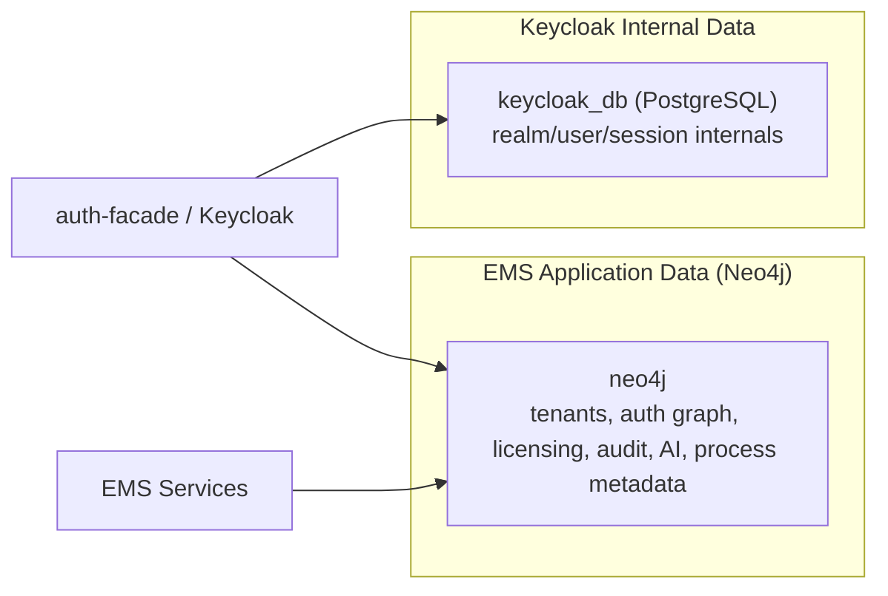
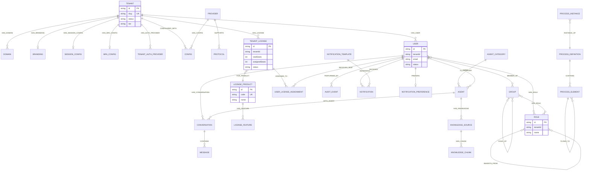

# EMS Neo4j Database Schema

## Status

- **Authority level:** Canonical database schema for EMS application data
- **Database:** `neo4j` (single EMS application database)
- **Engine:** Neo4j 5.x
- **Ownership:** EMS platform teams
- **Supersedes (as authority):** `master-graph.md`, `tenant-graph.md`, `neo4j-auth-graph-schema.md`, `graph-per-tenant-schema.md`

## Purpose

This file is the single authoritative data-model definition for EMS application persistence.

- All EMS domain data is modeled in Neo4j.
- Keycloak internal identity persistence remains outside EMS and is documented separately in [keycloak-postgresql-db.md](./keycloak-postgresql-db.md).
- Legacy split schema files remain available as implementation views, but this file is the standard.

## Database Boundary



## Canonical Graph Domains

| Domain | Core Nodes | Notes |
|---|---|---|
| Tenant Management | `Tenant`, `Domain`, `Branding`, `SessionConfig`, `MFAConfig`, `TenantAuthProvider` | Tenant identity, routing, and security posture |
| Authentication & RBAC | `Provider`, `Protocol`, `Config`, `User`, `Group`, `Role` | Multi-provider auth and role inheritance |
| Licensing | `LicenseProduct`, `LicenseFeature`, `TenantLicense`, `UserLicenseAssignment` | Feature and seat enforcement model |
| Operations | `AuditEvent`, `Notification`, `NotificationTemplate`, `NotificationPreference` | Observability and communication |
| AI | `Agent`, `AgentCategory`, `Conversation`, `Message`, `KnowledgeSource`, `KnowledgeChunk` | AI and RAG metadata |
| Process | `ProcessDefinition`, `ProcessElement`, `ProcessInstance` | BPMN orchestration metadata |

## Consolidated ERD (Mermaid)



## Tenancy and Isolation Standard

- Tenant isolation is enforced by tenant-scoped graph ownership and service-layer tenancy controls.
- Every tenant-owned node must carry `tenantId` and remain reachable from its owning `Tenant`.
- Cross-tenant relationships are forbidden for domain data.
- Master/system nodes (for example provider catalog and protocol catalog) are global read-mostly reference nodes.

## Constraints and Index Baseline

```cypher
CREATE CONSTRAINT tenant_id IF NOT EXISTS
FOR (t:Tenant) REQUIRE t.id IS UNIQUE;

CREATE CONSTRAINT tenant_slug IF NOT EXISTS
FOR (t:Tenant) REQUIRE t.slug IS UNIQUE;

CREATE CONSTRAINT user_id IF NOT EXISTS
FOR (u:User) REQUIRE u.id IS UNIQUE;

CREATE CONSTRAINT role_key IF NOT EXISTS
FOR (r:Role) REQUIRE (r.tenantId, r.name) IS UNIQUE;

CREATE CONSTRAINT license_product_code IF NOT EXISTS
FOR (p:LicenseProduct) REQUIRE p.code IS UNIQUE;

CREATE INDEX user_email IF NOT EXISTS
FOR (u:User) ON (u.email);

CREATE INDEX audit_timestamp IF NOT EXISTS
FOR (a:AuditEvent) ON (a.timestamp);
```

## Migration Standard

- Migration tool: Neo4j Migrations.
- Path: `backend/*/src/main/resources/neo4j/migrations/`.
- Naming: `V{number}__{description}.cypher`.
- Migrations must be additive and backward compatible where possible.

## Legacy View Mapping

These files are still useful for focused reading, but they are no longer the source of truth:

- [master-graph.md](./master-graph.md) - tenant registry focused view
- [tenant-graph.md](./tenant-graph.md) - tenant-domain operational view
- [neo4j-auth-graph-schema.md](./neo4j-auth-graph-schema.md) - auth and RBAC focused view
- [graph-per-tenant-schema.md](./graph-per-tenant-schema.md) - historical tenancy strategy notes
- [provider-config-extensions.md](./provider-config-extensions.md) - provider-specific config field catalog

---

**Last Updated:** 2026-02-27
