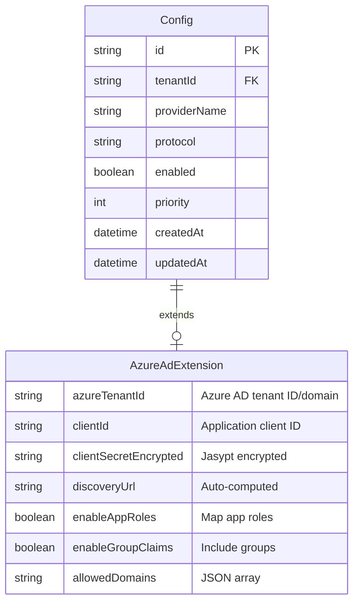
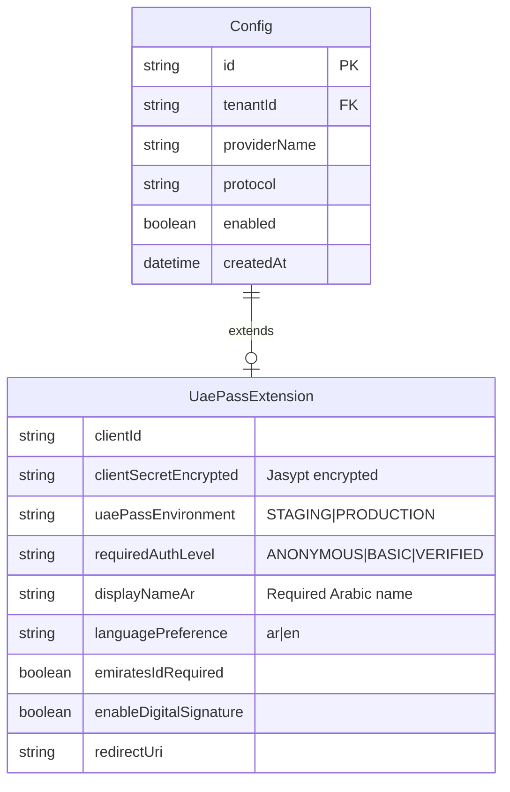
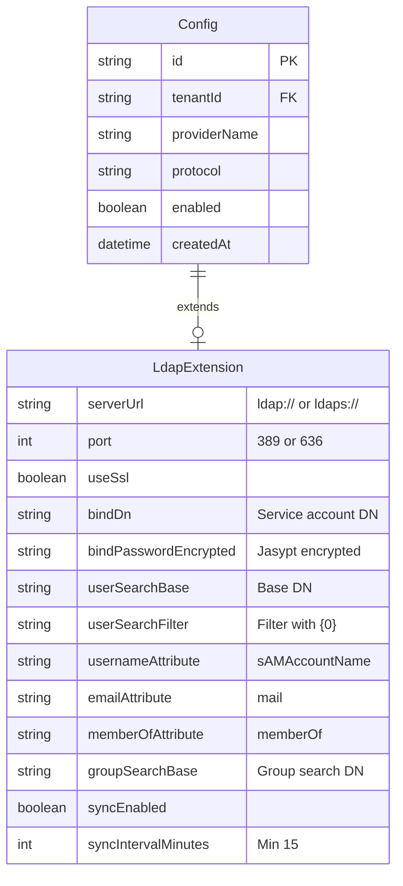
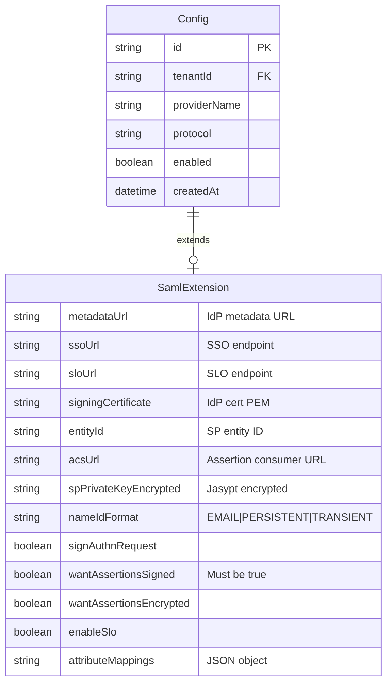
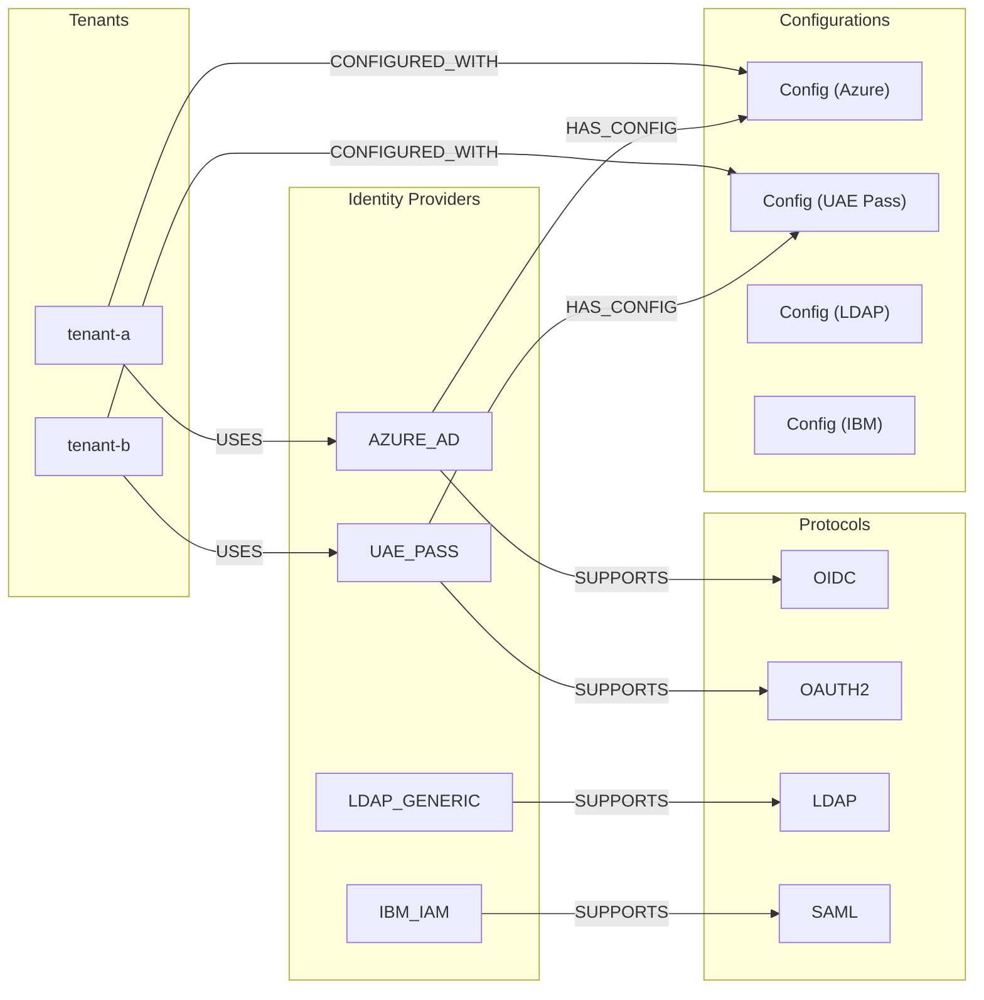

# Provider Configuration Extensions - Data Model

> Legacy focused extension catalog. Canonical per-database authority is [neo4j-ems-db.md](./neo4j-ems-db.md).

> **Document Type:** Data Model Specification
> **Owner:** Solution Architect
> **Status:** Draft
> **Created:** 2026-02-25
> **Related:** [neo4j-ems-db.md](./neo4j-ems-db.md), [neo4j-auth-graph-schema.md](./neo4j-auth-graph-schema.md)

---

## Overview

This document defines the extended configuration schema for multi-provider authentication. It extends the base `ConfigNode` defined in [neo4j-ems-db.md](./neo4j-ems-db.md) with provider-specific properties.

All extension sections include Mermaid-compatible `erDiagram` blocks. These ERDs are scoped to the EMS Neo4j application database and should be read together with the canonical ERD in [neo4j-ems-db.md](./neo4j-ems-db.md).

---

## Provider Configuration Schema

### Base ConfigNode (Existing)

```cypher
(:Config {
    // Core identity
    id: String,                      -- UUID
    tenantId: String,                -- Tenant reference
    providerName: String,            -- Provider type (AZURE_AD, UAE_PASS, etc.)
    displayName: String,             -- UI display name
    protocol: String,                -- OIDC, SAML, LDAP, OAUTH2

    // Common settings
    enabled: Boolean,                -- Active status
    priority: Integer,               -- Display order
    trustEmail: Boolean,             -- Trust provider's email verification
    linkExistingAccounts: Boolean,   -- Auto-link by email

    // Timestamps
    createdAt: DateTime,
    updatedAt: DateTime
})
```

---

## Azure AD Configuration

### Neo4j Schema

```cypher
(:Config {
    // Base properties
    providerName: 'AZURE_AD',
    protocol: 'OIDC',

    // Azure AD specific
    azureTenantId: String,           -- Azure AD tenant ID (GUID or domain)
    clientId: String,                -- Application (client) ID
    clientSecretEncrypted: String,   -- Client secret (Jasypt encrypted)

    // Auto-discovered from OIDC metadata
    discoveryUrl: String,            -- Computed: https://login.microsoftonline.com/{tenantId}/v2.0/.well-known/openid-configuration
    authorizationUrl: String,        -- From discovery
    tokenUrl: String,                -- From discovery
    userInfoUrl: String,             -- From discovery
    jwksUrl: String,                 -- From discovery
    issuerUrl: String,               -- From discovery

    // Feature flags
    enableAppRoles: Boolean,         -- Map Azure AD app roles to EMS roles
    enableGroupClaims: Boolean,      -- Include group memberships
    groupAttributeName: String,      -- Custom group claim attribute

    // Restrictions
    allowedDomains: List<String>,    -- Restrict by email domain

    // OAuth scopes
    scopes: List<String>             -- Default: ['openid', 'profile', 'email']
})
```

### ERD (Mermaid)



### Validation Rules

| Field | Rule | Error Code |
|-------|------|------------|
| azureTenantId | Required, GUID or *.onmicrosoft.com | AZURE_INVALID_TENANT |
| clientId | Required, 36-char GUID | AZURE_INVALID_CLIENT_ID |
| clientSecret | Required, min 8 chars | AZURE_MISSING_SECRET |
| allowedDomains | Each must be valid DNS | AZURE_INVALID_DOMAIN |

### Example Data

```cypher
CREATE (c:Config {
    id: randomUUID(),
    tenantId: 'acme-corp',
    providerName: 'AZURE_AD',
    displayName: 'Microsoft 365 SSO',
    protocol: 'OIDC',
    azureTenantId: 'contoso.onmicrosoft.com',
    clientId: '12345678-1234-1234-1234-123456789abc',
    clientSecretEncrypted: 'ENC(encrypted-value)',
    discoveryUrl: 'https://login.microsoftonline.com/contoso.onmicrosoft.com/v2.0/.well-known/openid-configuration',
    enableAppRoles: true,
    enableGroupClaims: true,
    allowedDomains: ['contoso.com', 'fabrikam.com'],
    scopes: ['openid', 'profile', 'email', 'offline_access'],
    enabled: true,
    priority: 1,
    trustEmail: true,
    linkExistingAccounts: true,
    createdAt: datetime(),
    updatedAt: datetime()
});
```

---

## UAE Pass Configuration

### Neo4j Schema

```cypher
(:Config {
    // Base properties
    providerName: 'UAE_PASS',
    protocol: 'OAUTH2',

    // UAE Pass specific
    clientId: String,                    -- UAE Pass client ID
    clientSecretEncrypted: String,       -- Client secret (Jasypt encrypted)
    uaePassEnvironment: String,          -- 'STAGING' or 'PRODUCTION'
    requiredAuthLevel: String,           -- 'ANONYMOUS', 'BASIC', 'VERIFIED'

    // Computed URLs based on environment
    authorizationUrl: String,            -- https://{env}-id.uaepass.ae/idshub/authorize
    tokenUrl: String,                    -- https://{env}-id.uaepass.ae/idshub/token
    userInfoUrl: String,                 -- https://{env}-id.uaepass.ae/idshub/userinfo

    // Arabic support (required)
    displayNameAr: String,               -- Arabic display name (mandatory)
    languagePreference: String,          -- 'ar' or 'en'

    // Emirates ID
    emiratesIdRequired: Boolean,         -- Require Emirates ID linkage

    // Digital signature (optional)
    enableDigitalSignature: Boolean,     -- Enable PKI signing services

    // Redirect
    redirectUri: String                  -- OAuth callback URI
})
```

### ERD (Mermaid)



### UAE Pass Environments

| Environment | Base URL |
|-------------|----------|
| STAGING | `https://stg-id.uaepass.ae/idshub` |
| PRODUCTION | `https://id.uaepass.ae/idshub` |

### Authentication Levels

| Level | ACR Value | Description |
|-------|-----------|-------------|
| ANONYMOUS | `urn:safelayer:tws:policies:authentication:level:anonymous` | No identity verification |
| BASIC | `urn:safelayer:tws:policies:authentication:level:low` | Email/mobile verified |
| VERIFIED | `urn:safelayer:tws:policies:authentication:level:substantial` | Emirates ID verified |

### Validation Rules

| Field | Rule | Error Code |
|-------|------|------------|
| clientId | Required, max 64 chars | UAE_MISSING_CLIENT |
| clientSecret | Required | UAE_MISSING_SECRET |
| uaePassEnvironment | Required, STAGING or PRODUCTION | UAE_INVALID_ENV |
| requiredAuthLevel | Required for government tenants | UAE_MISSING_AUTH_LEVEL |
| displayNameAr | Required, valid Arabic text | UAE_MISSING_ARABIC_NAME |

### Example Data

```cypher
CREATE (c:Config {
    id: randomUUID(),
    tenantId: 'uae-gov-entity',
    providerName: 'UAE_PASS',
    displayName: 'UAE Pass',
    displayNameAr: 'الهوية الرقمية',
    protocol: 'OAUTH2',
    clientId: 'uae-pass-client-123',
    clientSecretEncrypted: 'ENC(encrypted-value)',
    uaePassEnvironment: 'PRODUCTION',
    requiredAuthLevel: 'VERIFIED',
    authorizationUrl: 'https://id.uaepass.ae/idshub/authorize',
    tokenUrl: 'https://id.uaepass.ae/idshub/token',
    userInfoUrl: 'https://id.uaepass.ae/idshub/userinfo',
    languagePreference: 'ar',
    emiratesIdRequired: true,
    enableDigitalSignature: false,
    redirectUri: 'https://ems.example.com/auth/callback/uaepass',
    enabled: true,
    priority: 1,
    trustEmail: true,
    linkExistingAccounts: true,
    createdAt: datetime(),
    updatedAt: datetime()
});
```

---

## LDAP/Active Directory Configuration

### Neo4j Schema

```cypher
(:Config {
    // Base properties
    providerName: 'LDAP_GENERIC',
    protocol: 'LDAP',

    // Connection
    serverUrl: String,                   -- ldap:// or ldaps:// URL
    port: Integer,                       -- 389 (LDAP) or 636 (LDAPS)
    useSsl: Boolean,                     -- Enable SSL/TLS
    connectionTimeout: Integer,          -- Connection timeout (ms)
    readTimeout: Integer,                -- Read timeout (ms)

    // Bind credentials
    bindDn: String,                      -- Service account DN
    bindPasswordEncrypted: String,       -- Bind password (Jasypt encrypted)

    // User search
    userSearchBase: String,              -- Base DN for user searches
    userSearchFilter: String,            -- LDAP filter with {0} placeholder
    userObjectClass: String,             -- User object class (default: person)

    // Attribute mapping
    usernameAttribute: String,           -- Username attr (default: sAMAccountName)
    emailAttribute: String,              -- Email attr (default: mail)
    firstNameAttribute: String,          -- First name attr (default: givenName)
    lastNameAttribute: String,           -- Last name attr (default: sn)
    memberOfAttribute: String,           -- Group membership attr (default: memberOf)

    // Group search
    groupSearchBase: String,             -- Base DN for group searches
    groupSearchFilter: String,           -- Group lookup filter
    resolveNestedGroups: Boolean,        -- Resolve nested groups (up to 5 levels)

    // Sync
    syncEnabled: Boolean,                -- Enable periodic user sync
    syncIntervalMinutes: Integer         -- Sync interval (min 15 minutes)
})
```

### ERD (Mermaid)



### Common LDAP Filters

| Use Case | Filter |
|----------|--------|
| By sAMAccountName | `(sAMAccountName={0})` |
| By UPN | `(userPrincipalName={0})` |
| By email | `(mail={0})` |
| By sAMAccountName or UPN | `(\|(sAMAccountName={0})(userPrincipalName={0}))` |
| Active users only | `(&(sAMAccountName={0})(!(userAccountControl:1.2.840.113556.1.4.803:=2)))` |

### Validation Rules

| Field | Rule | Error Code |
|-------|------|------------|
| serverUrl | Required, valid ldap:// or ldaps:// URL | LDAP_INVALID_URL |
| port | Required, 1-65535 | LDAP_INVALID_PORT |
| bindDn | Required, valid DN format | LDAP_INVALID_BIND_DN |
| bindPassword | Required | LDAP_MISSING_PASSWORD |
| userSearchBase | Required, valid DN | LDAP_INVALID_SEARCH_BASE |
| userSearchFilter | Required, contains {0} | LDAP_INVALID_FILTER |
| syncIntervalMinutes | If syncEnabled, min 15 | LDAP_INVALID_SYNC_INTERVAL |

### Example Data

```cypher
CREATE (c:Config {
    id: randomUUID(),
    tenantId: 'enterprise-corp',
    providerName: 'LDAP_GENERIC',
    displayName: 'Corporate Active Directory',
    protocol: 'LDAP',
    serverUrl: 'ldaps://ad.enterprise.com',
    port: 636,
    useSsl: true,
    connectionTimeout: 5000,
    readTimeout: 10000,
    bindDn: 'cn=svc-ems,ou=service,dc=enterprise,dc=com',
    bindPasswordEncrypted: 'ENC(encrypted-value)',
    userSearchBase: 'ou=users,dc=enterprise,dc=com',
    userSearchFilter: '(sAMAccountName={0})',
    userObjectClass: 'person',
    usernameAttribute: 'sAMAccountName',
    emailAttribute: 'mail',
    firstNameAttribute: 'givenName',
    lastNameAttribute: 'sn',
    memberOfAttribute: 'memberOf',
    groupSearchBase: 'ou=groups,dc=enterprise,dc=com',
    groupSearchFilter: '(member={0})',
    resolveNestedGroups: true,
    syncEnabled: true,
    syncIntervalMinutes: 60,
    enabled: true,
    priority: 1,
    trustEmail: true,
    linkExistingAccounts: true,
    createdAt: datetime(),
    updatedAt: datetime()
});
```

---

## IBM IAM (SAML 2.0) Configuration

### Neo4j Schema

```cypher
(:Config {
    // Base properties
    providerName: 'IBM_IAM',
    protocol: 'SAML',

    // IdP metadata
    metadataUrl: String,                 -- SAML IdP metadata URL
    ssoUrl: String,                      -- Single Sign-On URL (from metadata)
    sloUrl: String,                      -- Single Logout URL (from metadata)
    signingCertificate: String,          -- IdP signing certificate (PEM)

    // SP configuration
    entityId: String,                    -- SP entity ID (unique per tenant)
    acsUrl: String,                      -- Assertion Consumer Service URL
    spCertificate: String,               -- SP signing certificate (PEM)
    spPrivateKeyEncrypted: String,       -- SP private key (Jasypt encrypted)

    // SAML options
    nameIdFormat: String,                -- NameID format: EMAIL, PERSISTENT, TRANSIENT
    signAuthnRequest: Boolean,           -- Sign AuthnRequest
    wantAssertionsSigned: Boolean,       -- Require signed assertions (must be true)
    wantAssertionsEncrypted: Boolean,    -- Require encrypted assertions
    enableSlo: Boolean,                  -- Enable Single Logout

    // Attribute mappings
    attributeMappings: String            -- JSON: {"email": "uri:claim:email", ...}
})
```

### ERD (Mermaid)



### NameID Formats

| Format | URI | Use Case |
|--------|-----|----------|
| EMAIL | `urn:oasis:names:tc:SAML:1.1:nameid-format:emailAddress` | Email as identifier |
| PERSISTENT | `urn:oasis:names:tc:SAML:2.0:nameid-format:persistent` | Stable ID across sessions |
| TRANSIENT | `urn:oasis:names:tc:SAML:2.0:nameid-format:transient` | One-time session ID |

### Validation Rules

| Field | Rule | Error Code |
|-------|------|------------|
| entityId | Required, valid URI | SAML_INVALID_ENTITY_ID |
| ssoUrl | Required if no metadataUrl | SAML_MISSING_SSO |
| signingCertificate | Required, valid X.509 PEM | SAML_INVALID_CERT |
| wantAssertionsSigned | Must be true for production | SAML_ASSERTIONS_NOT_SIGNED |
| attributeMappings | Valid JSON object | SAML_INVALID_MAPPINGS |

### Example Data

```cypher
CREATE (c:Config {
    id: randomUUID(),
    tenantId: 'ibm-customer',
    providerName: 'IBM_IAM',
    displayName: 'IBM Security Verify',
    protocol: 'SAML',
    metadataUrl: 'https://ibm-verify.example.com/saml/metadata',
    ssoUrl: 'https://ibm-verify.example.com/saml/sso',
    sloUrl: 'https://ibm-verify.example.com/saml/slo',
    signingCertificate: '-----BEGIN CERTIFICATE-----\nMIIC...\n-----END CERTIFICATE-----',
    entityId: 'https://ems.example.com/saml/sp/ibm-customer',
    acsUrl: 'https://ems.example.com/auth/saml/acs',
    spPrivateKeyEncrypted: 'ENC(encrypted-value)',
    nameIdFormat: 'EMAIL',
    signAuthnRequest: true,
    wantAssertionsSigned: true,
    wantAssertionsEncrypted: false,
    enableSlo: true,
    attributeMappings: '{"email":"http://schemas.xmlsoap.org/claims/EmailAddress","groups":"http://schemas.xmlsoap.org/claims/Group"}',
    enabled: true,
    priority: 1,
    trustEmail: true,
    linkExistingAccounts: true,
    createdAt: datetime(),
    updatedAt: datetime()
});
```

---

## Neo4j Migration Script

```cypher
// V007__extend_config_node_properties.cypher
// Extends ConfigNode with provider-specific properties

// No schema changes needed - Neo4j is schema-less
// This migration adds indexes for new properties

// Index for Azure AD tenant lookup
CREATE INDEX config_azure_tenant IF NOT EXISTS
FOR (c:Config) ON (c.azureTenantId);

// Index for UAE Pass environment
CREATE INDEX config_uaepass_env IF NOT EXISTS
FOR (c:Config) ON (c.uaePassEnvironment);

// Index for LDAP server URL
CREATE INDEX config_ldap_server IF NOT EXISTS
FOR (c:Config) ON (c.serverUrl);

// Index for SAML entity ID (must be unique)
CREATE CONSTRAINT config_saml_entity_id IF NOT EXISTS
FOR (c:Config) REQUIRE c.entityId IS UNIQUE;

// Add new providers to Provider nodes
MERGE (p:Provider {name: 'AZURE_AD'})
SET p.vendor = 'Microsoft',
    p.displayName = 'Microsoft Entra ID',
    p.iconUrl = '/assets/icons/providers/azure-ad.svg',
    p.description = 'Microsoft cloud identity and access management';

WITH p
MATCH (proto:Protocol {type: 'OIDC'})
MERGE (p)-[:SUPPORTS]->(proto);

MERGE (p:Provider {name: 'UAE_PASS'})
SET p.vendor = 'UAE Government',
    p.displayName = 'UAE Pass',
    p.iconUrl = '/assets/icons/providers/uae-pass.svg',
    p.description = 'UAE national digital identity platform';

WITH p
MATCH (proto:Protocol {type: 'OAUTH2'})
MERGE (p)-[:SUPPORTS]->(proto);

MERGE (p:Provider {name: 'IBM_IAM'})
SET p.vendor = 'IBM',
    p.displayName = 'IBM Security Verify',
    p.iconUrl = '/assets/icons/providers/ibm.svg',
    p.description = 'IBM enterprise identity and access management';

WITH p
MATCH (proto:Protocol {type: 'SAML'})
MERGE (p)-[:SUPPORTS]->(proto);

// LDAP_GENERIC should already exist, verify
MERGE (p:Provider {name: 'LDAP_GENERIC'})
SET p.vendor = 'Generic',
    p.displayName = 'LDAP / Active Directory',
    p.iconUrl = '/assets/icons/providers/ldap.svg',
    p.description = 'LDAP or Active Directory server';

WITH p
MATCH (proto:Protocol {type: 'LDAP'})
MERGE (p)-[:SUPPORTS]->(proto);
```

---

## Relationship Summary



---

## Document History

| Version | Date | Author | Changes |
|---------|------|--------|---------|
| 1.0.0 | 2026-02-25 | SA Agent | Initial draft |

---

**Owner:** Solution Architect
**For DBA:** Execute migration V007 after review
