# Super Agent Platform -- Business Domain Model

**Document:** super-agent-domain-model.md
**Version:** 1.0.0
**Date:** 2026-03-08
**Status:** [PLANNED] -- Business domain model for the Super Agent platform. No implementation exists.
**Owner:** BA Agent
**Classification:** All entities and relationships described in this document are planned capabilities. This model feeds the SA Agent for canonical data model creation and the DBA Agent for physical schema design.

**References:**
| Source | Document | Sections |
|--------|----------|----------|
| PRD | 01-PRD-AI-Agent-Platform.md | 1.5, 2.1-2.4, 3.1-3.7, 7.1-7.6, 8 |
| Benchmarking Study | 11-Super-Agent-Benchmarking-Study.md | 3-11 |
| BA Domain Mapping | BA-Domain-Skills-Tools-Mapping.md | 1-8 |
| Design Plan | iterative-pondering-rabin.md | All 16 design decisions |

**Changelog:**
| Version | Date | Changes |
|---------|------|---------|
| 1.0.0 | 2026-03-08 | Initial business domain model covering all 16 design decision areas |

---

## 1. Entity Catalog

### 1.1 Summary Table

| # | Entity Name | Aggregate | Tenant Scope | Description | Lifecycle States |
|---|-------------|-----------|-------------|-------------|-----------------|
| 1 | SuperAgent | Agent Hierarchy | Tenant-Scoped | The tenant's organizational brain; top-level orchestrator | Active, Suspended, Decommissioned |
| 2 | SubOrchestrator | Agent Hierarchy | Tenant-Scoped | Domain-expert coordinator (EA, Performance, GRC, KM, Service Design) | Active, Suspended, Decommissioned |
| 3 | Worker | Agent Hierarchy | Tenant-Scoped | Capability executor (Data Query, Calculation, Report, Analysis, Notification) | Active, Suspended, Decommissioned |
| 4 | AgentMaturityProfile | Agent Maturity | Tenant-Scoped | Tracks a specific agent's maturity level and ATS score within a tenant | Coaching, CoPilot, Pilot, Graduate |
| 5 | ATSDimension | Agent Maturity | Global | Defines one of the five ATS scoring dimensions (Identity, Competence, Reliability, Compliance, Alignment) | N/A (reference data) |
| 6 | ATSScoreHistory | Agent Maturity | Tenant-Scoped | Historical record of an agent's ATS dimension scores over time | N/A (append-only) |
| 7 | Skill | Skills and Knowledge | Hybrid | Reusable domain knowledge package composing an agent's "Way of Thinking" | Draft, Published, Deprecated, Retired |
| 8 | SkillTemplate | Skills and Knowledge | Hybrid | Reusable skill definition seeded by the platform or created by tenants | Draft, Published, Deprecated, Retired |
| 9 | KnowledgeScope | Skills and Knowledge | Tenant-Scoped | Defines what knowledge collections a skill or agent can access | Active, Inactive |
| 10 | DomainFramework | Skills and Knowledge | Global | Reference to a professional framework (TOGAF, EFQM, ISO 31000, BSC, ITIL, COBIT) | N/A (reference data) |
| 11 | Tool | Tools and Execution | Hybrid | Reusable execution primitive composing an agent's "Way of Working" | Registered, Active, Deprecated, Retired |
| 12 | ToolRiskLevel | Tools and Execution | Global | Classification of a tool's risk (LOW, MEDIUM, HIGH, CRITICAL) | N/A (reference data) |
| 13 | ToolAuthorization | Tools and Execution | Tenant-Scoped | Maps which tools a worker can use at its current maturity level | Active, Revoked |
| 14 | WorkerDraft | Sandbox and Drafts | Tenant-Scoped | Sandboxed output produced by a worker during task execution | Draft, UnderReview, Approved, Rejected, Committed, Expired |
| 15 | DraftReview | Sandbox and Drafts | Tenant-Scoped | A review action performed on a worker draft | N/A (event record) |
| 16 | DraftVersion | Sandbox and Drafts | Tenant-Scoped | Version history entry for a draft that has been revised | N/A (append-only) |
| 17 | EventTrigger | Events and Triggers | Tenant-Scoped | Configuration for what starts an agent action | Active, Paused, Disabled |
| 18 | EventSchedule | Events and Triggers | Tenant-Scoped | Time-based trigger configuration (cron expression, recurrence) | Active, Paused, Disabled |
| 19 | EventSource | Events and Triggers | Tenant-Scoped | External system integration point for event ingestion | Connected, Disconnected, Error |
| 20 | ApprovalCheckpoint | HITL | Tenant-Scoped | A point in an agent workflow where human input is required | Pending, Completed, Expired, Escalated |
| 21 | ApprovalDecision | HITL | Tenant-Scoped | Human's response to an approval checkpoint | N/A (event record) |
| 22 | EscalationRule | HITL | Tenant-Scoped | Configuration defining when and how to escalate to a human | Active, Inactive |
| 23 | EthicsPolicy | Ethics and Governance | Global | Platform baseline ethical rule (immutable, cannot be overridden) | Active (always) |
| 24 | ConductPolicy | Ethics and Governance | Tenant-Scoped | Tenant-configurable behavioral rule extending the ethics baseline | Active, Inactive, Archived |
| 25 | PolicyViolation | Ethics and Governance | Tenant-Scoped | Detected breach of an ethics or conduct policy | Open, Investigating, Resolved, Dismissed |
| 26 | ExecutionTrace | Audit | Tenant-Scoped | Full record of an agent's execution for a single task invocation | Complete, Partial (on error) |
| 27 | TraceStep | Audit | Tenant-Scoped | Individual step within an execution trace | N/A (append-only) |
| 28 | TenantSuperAgentClone | Cross-Tenant | Tenant-Scoped | Records the clone relationship from platform template to tenant instance | N/A (creation record) |
| 29 | BenchmarkMetric | Cross-Tenant | Shared (Anonymized) | Anonymized performance metric contributed to the shared benchmark pool | N/A (append-only) |
| 30 | BenchmarkComparison | Cross-Tenant | Tenant-Scoped | Result of a tenant's comparison against anonymized cross-tenant benchmarks | N/A (computed result) |
| 31 | UserContextSnapshot | User Context | Tenant-Scoped | Cached user context assembled at session start (role, permissions, department, portfolios) | Active, Expired |
| 32 | UserRole | User Context | Tenant-Scoped | RBAC/ABAC role definition governing what the user's agents can access | Active, Inactive |
| 33 | PortfolioAssignment | User Context | Tenant-Scoped | Association between a user and the organizational portfolios they manage | Active, Inactive |
| 34 | PromptBlock | Dynamic Prompts | Hybrid | Modular, database-stored building block for dynamic system prompt composition | Active, Inactive, Archived |
| 35 | PromptComposition | Dynamic Prompts | Tenant-Scoped | Record of which prompt blocks were assembled for a specific agent invocation | N/A (append-only, linked to ExecutionTrace) |

---

### 1.2 Tenant Scope Legend

| Scope | Meaning |
|-------|---------|
| **Global** | Shared across all tenants; managed by platform administrators; cannot be modified by tenants |
| **Tenant-Scoped** | Isolated per tenant; each tenant has its own independent copy; no cross-tenant visibility |
| **Hybrid** | Platform provides global seed/template; tenant can create additional instances or override within tenant scope |
| **Shared (Anonymized)** | Cross-tenant data with all identifying information removed; only aggregated metrics; minimum cohort size enforced |

---

## 2. Entity Relationship Diagram

### 2.1 Core Agent Hierarchy

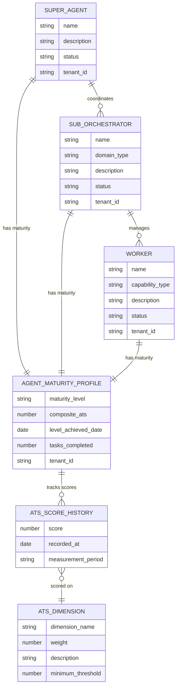
```mermaid
erDiagram
    SUPER_AGENT ||--o{ SUB_ORCHESTRATOR : "coordinates"
    SUB_ORCHESTRATOR ||--o{ WORKER : "manages"
    SUPER_AGENT ||--|| AGENT_MATURITY_PROFILE : "has maturity"
    SUB_ORCHESTRATOR ||--|| AGENT_MATURITY_PROFILE : "has maturity"
    WORKER ||--|| AGENT_MATURITY_PROFILE : "has maturity"
    AGENT_MATURITY_PROFILE ||--o{ ATS_SCORE_HISTORY : "tracks scores"
    ATS_SCORE_HISTORY }o--|| ATS_DIMENSION : "scored on"

    SUPER_AGENT {
        string name
        string description
        string status
        string tenant_id
    }
    SUB_ORCHESTRATOR {
        string name
        string domain_type
        string description
        string status
        string tenant_id
    }
    WORKER {
        string name
        string capability_type
        string description
        string status
        string tenant_id
    }
    AGENT_MATURITY_PROFILE {
        string maturity_level
        number composite_ats
        date level_achieved_date
        number tasks_completed
        string tenant_id
    }
    ATS_DIMENSION {
        string dimension_name
        number weight
        string description
        number minimum_threshold
    }
    ATS_SCORE_HISTORY {
        number score
        date recorded_at
        string measurement_period
    }
```

### 2.2 Skills and Knowledge

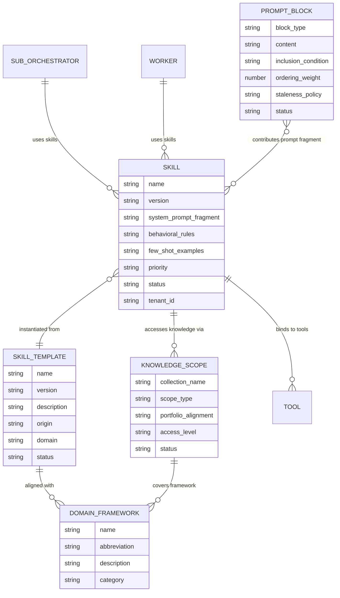
```mermaid
erDiagram
    SUB_ORCHESTRATOR ||--o{ SKILL : "uses skills"
    WORKER ||--o{ SKILL : "uses skills"
    SKILL }o--|| SKILL_TEMPLATE : "instantiated from"
    SKILL ||--o{ KNOWLEDGE_SCOPE : "accesses knowledge via"
    SKILL ||--o{ TOOL : "binds to tools"
    SKILL_TEMPLATE ||--o{ DOMAIN_FRAMEWORK : "aligned with"
    KNOWLEDGE_SCOPE ||--o{ DOMAIN_FRAMEWORK : "covers framework"
    PROMPT_BLOCK }o--o{ SKILL : "contributes prompt fragment"

    SKILL {
        string name
        string version
        string system_prompt_fragment
        string behavioral_rules
        string few_shot_examples
        string priority
        string status
        string tenant_id
    }
    SKILL_TEMPLATE {
        string name
        string version
        string description
        string origin
        string domain
        string status
    }
    KNOWLEDGE_SCOPE {
        string collection_name
        string scope_type
        string portfolio_alignment
        string access_level
        string status
    }
    DOMAIN_FRAMEWORK {
        string name
        string abbreviation
        string description
        string category
    }
    PROMPT_BLOCK {
        string block_type
        string content
        string inclusion_condition
        number ordering_weight
        string staleness_policy
        string status
    }
```

### 2.3 Tools and Execution

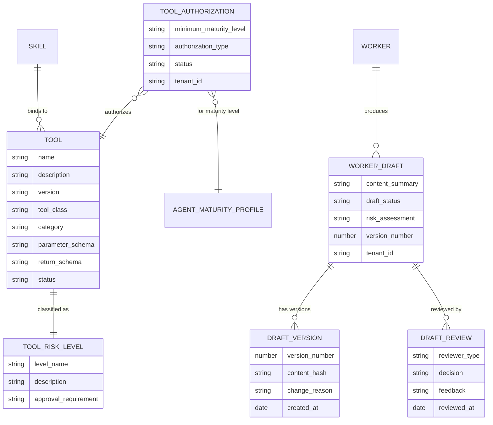
```mermaid
erDiagram
    SKILL ||--o{ TOOL : "binds to"
    TOOL ||--|| TOOL_RISK_LEVEL : "classified as"
    TOOL_AUTHORIZATION }o--|| TOOL : "authorizes"
    TOOL_AUTHORIZATION }o--|| AGENT_MATURITY_PROFILE : "for maturity level"
    WORKER ||--o{ WORKER_DRAFT : "produces"
    WORKER_DRAFT ||--o{ DRAFT_VERSION : "has versions"
    WORKER_DRAFT ||--o{ DRAFT_REVIEW : "reviewed by"

    TOOL {
        string name
        string description
        string version
        string tool_class
        string category
        string parameter_schema
        string return_schema
        string status
    }
    TOOL_RISK_LEVEL {
        string level_name
        string description
        string approval_requirement
    }
    TOOL_AUTHORIZATION {
        string minimum_maturity_level
        string authorization_type
        string status
        string tenant_id
    }
    WORKER_DRAFT {
        string content_summary
        string draft_status
        string risk_assessment
        number version_number
        string tenant_id
    }
    DRAFT_VERSION {
        number version_number
        string content_hash
        string change_reason
        date created_at
    }
    DRAFT_REVIEW {
        string reviewer_type
        string decision
        string feedback
        date reviewed_at
    }
```

### 2.4 Events and Triggers

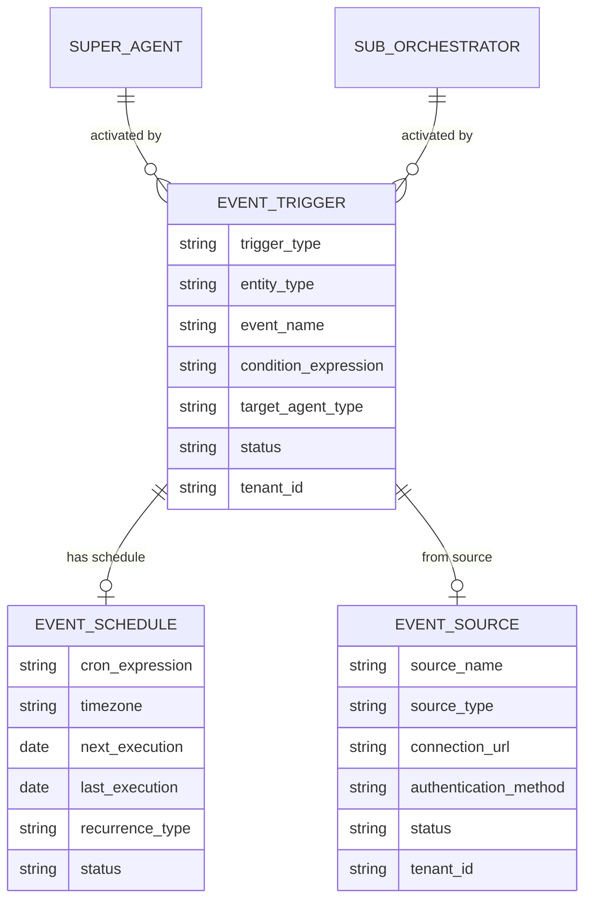
```mermaid
erDiagram
    SUPER_AGENT ||--o{ EVENT_TRIGGER : "activated by"
    SUB_ORCHESTRATOR ||--o{ EVENT_TRIGGER : "activated by"
    EVENT_TRIGGER ||--o| EVENT_SCHEDULE : "has schedule"
    EVENT_TRIGGER ||--o| EVENT_SOURCE : "from source"

    EVENT_TRIGGER {
        string trigger_type
        string entity_type
        string event_name
        string condition_expression
        string target_agent_type
        string status
        string tenant_id
    }
    EVENT_SCHEDULE {
        string cron_expression
        string timezone
        date next_execution
        date last_execution
        string recurrence_type
        string status
    }
    EVENT_SOURCE {
        string source_name
        string source_type
        string connection_url
        string authentication_method
        string status
        string tenant_id
    }
```

### 2.5 HITL (Human-in-the-Loop)

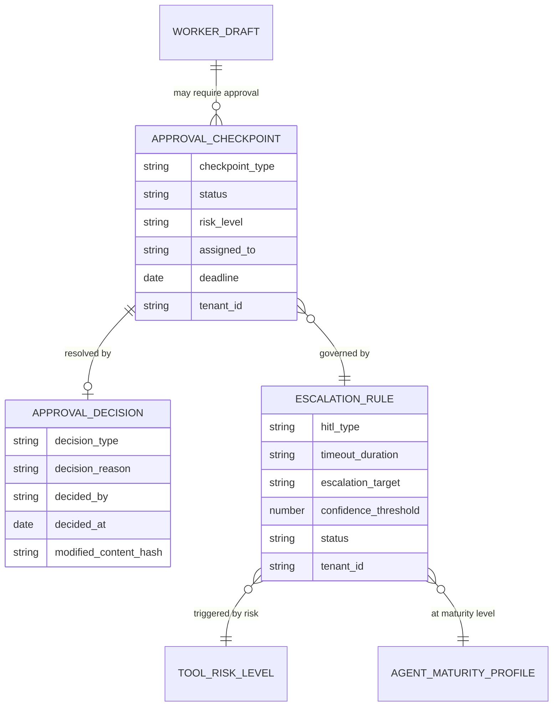
```mermaid
erDiagram
    WORKER_DRAFT ||--o{ APPROVAL_CHECKPOINT : "may require approval"
    APPROVAL_CHECKPOINT ||--o| APPROVAL_DECISION : "resolved by"
    ESCALATION_RULE }o--|| TOOL_RISK_LEVEL : "triggered by risk"
    ESCALATION_RULE }o--|| AGENT_MATURITY_PROFILE : "at maturity level"
    APPROVAL_CHECKPOINT }o--|| ESCALATION_RULE : "governed by"

    APPROVAL_CHECKPOINT {
        string checkpoint_type
        string status
        string risk_level
        string assigned_to
        date deadline
        string tenant_id
    }
    APPROVAL_DECISION {
        string decision_type
        string decision_reason
        string decided_by
        date decided_at
        string modified_content_hash
    }
    ESCALATION_RULE {
        string hitl_type
        string timeout_duration
        string escalation_target
        number confidence_threshold
        string status
        string tenant_id
    }
```

### 2.6 Ethics, Governance, and Audit

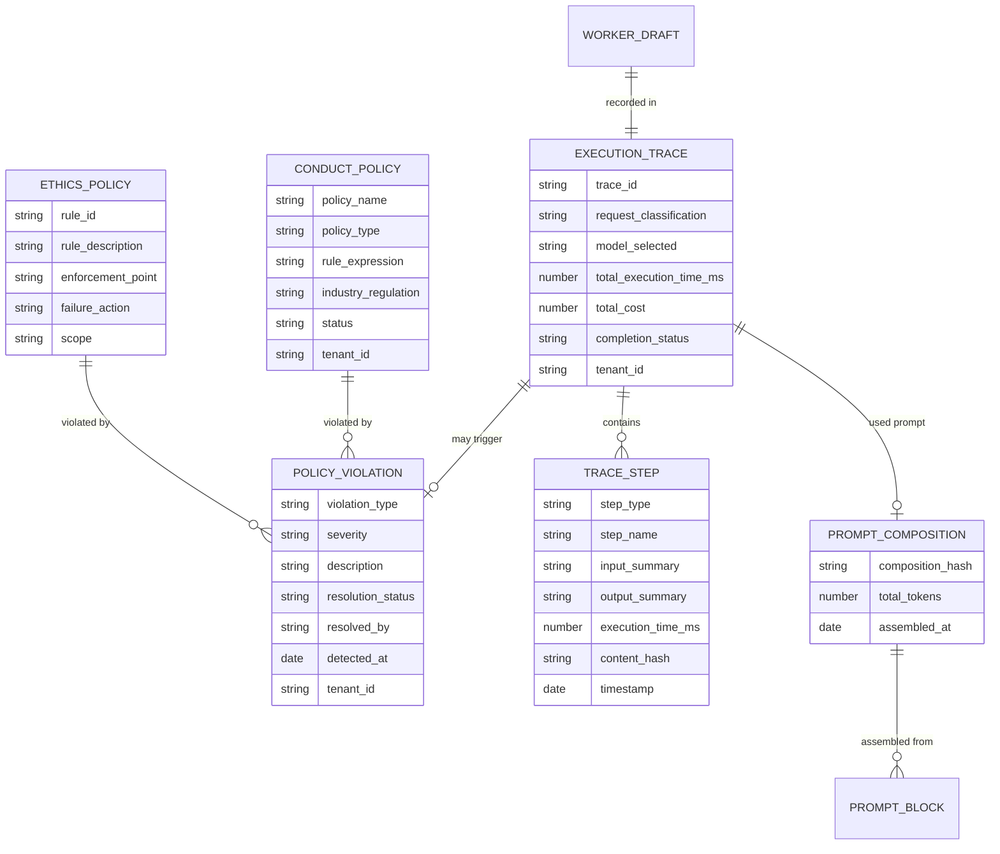
```mermaid
erDiagram
    ETHICS_POLICY ||--o{ POLICY_VIOLATION : "violated by"
    CONDUCT_POLICY ||--o{ POLICY_VIOLATION : "violated by"
    EXECUTION_TRACE ||--o{ TRACE_STEP : "contains"
    EXECUTION_TRACE ||--o| POLICY_VIOLATION : "may trigger"
    EXECUTION_TRACE ||--o| PROMPT_COMPOSITION : "used prompt"
    PROMPT_COMPOSITION ||--o{ PROMPT_BLOCK : "assembled from"
    WORKER_DRAFT ||--|| EXECUTION_TRACE : "recorded in"

    ETHICS_POLICY {
        string rule_id
        string rule_description
        string enforcement_point
        string failure_action
        string scope
    }
    CONDUCT_POLICY {
        string policy_name
        string policy_type
        string rule_expression
        string industry_regulation
        string status
        string tenant_id
    }
    POLICY_VIOLATION {
        string violation_type
        string severity
        string description
        string resolution_status
        string resolved_by
        date detected_at
        string tenant_id
    }
    EXECUTION_TRACE {
        string trace_id
        string request_classification
        string model_selected
        number total_execution_time_ms
        number total_cost
        string completion_status
        string tenant_id
    }
    TRACE_STEP {
        string step_type
        string step_name
        string input_summary
        string output_summary
        number execution_time_ms
        string content_hash
        date timestamp
    }
    PROMPT_COMPOSITION {
        string composition_hash
        number total_tokens
        date assembled_at
    }
```

### 2.7 Cross-Tenant and User Context

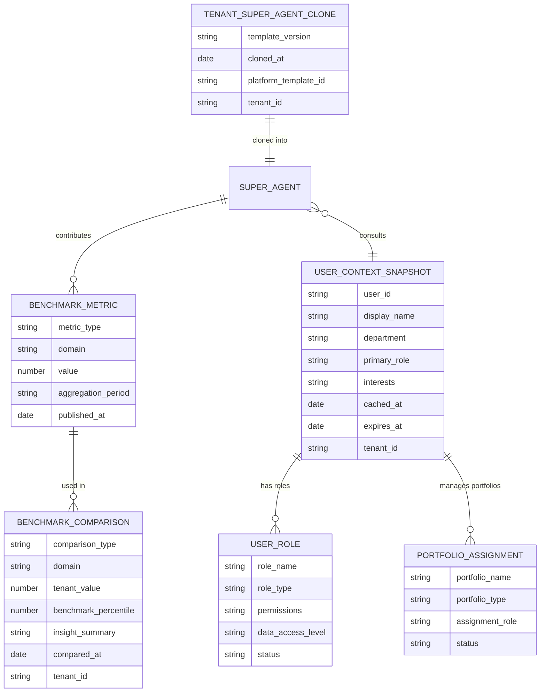
```mermaid
erDiagram
    TENANT_SUPER_AGENT_CLONE ||--|| SUPER_AGENT : "cloned into"
    SUPER_AGENT ||--o{ BENCHMARK_METRIC : "contributes"
    BENCHMARK_METRIC ||--o{ BENCHMARK_COMPARISON : "used in"
    USER_CONTEXT_SNAPSHOT ||--o{ USER_ROLE : "has roles"
    USER_CONTEXT_SNAPSHOT ||--o{ PORTFOLIO_ASSIGNMENT : "manages portfolios"
    SUPER_AGENT }o--|| USER_CONTEXT_SNAPSHOT : "consults"

    TENANT_SUPER_AGENT_CLONE {
        string template_version
        date cloned_at
        string platform_template_id
        string tenant_id
    }
    BENCHMARK_METRIC {
        string metric_type
        string domain
        number value
        string aggregation_period
        date published_at
    }
    BENCHMARK_COMPARISON {
        string comparison_type
        string domain
        number tenant_value
        number benchmark_percentile
        string insight_summary
        date compared_at
        string tenant_id
    }
    USER_CONTEXT_SNAPSHOT {
        string user_id
        string display_name
        string department
        string primary_role
        string interests
        date cached_at
        date expires_at
        string tenant_id
    }
    USER_ROLE {
        string role_name
        string role_type
        string permissions
        string data_access_level
        string status
    }
    PORTFOLIO_ASSIGNMENT {
        string portfolio_name
        string portfolio_type
        string assignment_role
        string status
    }
```

### 2.8 Full Domain Overview (Simplified)

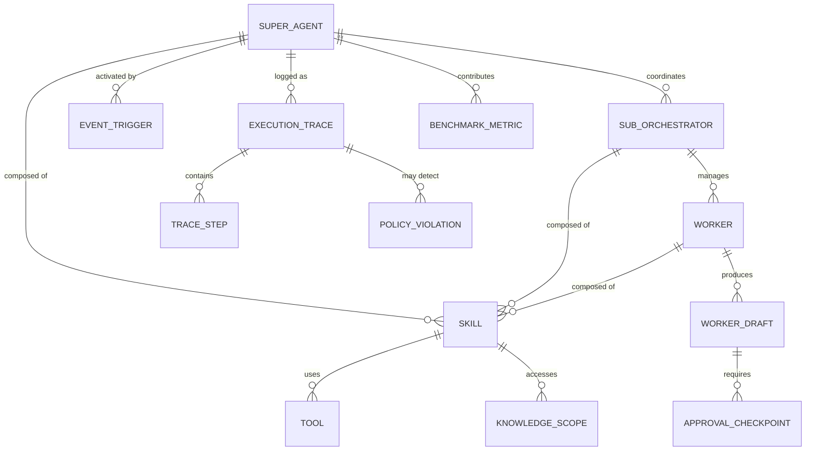
```mermaid
erDiagram
    SUPER_AGENT ||--o{ SUB_ORCHESTRATOR : "coordinates"
    SUB_ORCHESTRATOR ||--o{ WORKER : "manages"

    SUPER_AGENT ||--o{ SKILL : "composed of"
    SUB_ORCHESTRATOR ||--o{ SKILL : "composed of"
    WORKER ||--o{ SKILL : "composed of"

    SKILL ||--o{ TOOL : "uses"
    SKILL ||--o{ KNOWLEDGE_SCOPE : "accesses"

    WORKER ||--o{ WORKER_DRAFT : "produces"
    WORKER_DRAFT ||--o{ APPROVAL_CHECKPOINT : "requires"

    SUPER_AGENT ||--o{ EVENT_TRIGGER : "activated by"
    SUPER_AGENT ||--o{ EXECUTION_TRACE : "logged as"

    EXECUTION_TRACE ||--o{ TRACE_STEP : "contains"
    EXECUTION_TRACE ||--o{ POLICY_VIOLATION : "may detect"

    SUPER_AGENT ||--o{ BENCHMARK_METRIC : "contributes"
```

---

## 3. Business Rules

### 3.1 Agent Hierarchy Rules

| Rule ID | Rule | Entities Affected | Priority |
|---------|------|-------------------|----------|
| BR-001 | Each tenant has exactly one SuperAgent. The SuperAgent is created when the tenant is onboarded and cannot be duplicated. | SuperAgent | Must Have |
| BR-002 | A SuperAgent coordinates one or more SubOrchestrators. The platform seeds five default SubOrchestrators (EA, Performance, GRC, KM, Service Design) on tenant creation. Tenants may add custom SubOrchestrators. | SuperAgent, SubOrchestrator | Must Have |
| BR-003 | Each SubOrchestrator manages one or more Workers. Workers are typed by capability (Data Query, Calculation, Report, Analysis, Notification). A SubOrchestrator may have multiple workers of the same type. | SubOrchestrator, Worker | Must Have |
| BR-004 | Workers are shared by capability type, not by domain. A "Data Query Worker" can serve any SubOrchestrator that needs data querying. Worker assignment is dynamic at task routing time. | Worker, SubOrchestrator | Should Have |
| BR-005 | Suspending a SubOrchestrator suspends all Workers managed by it. Suspending the SuperAgent suspends all SubOrchestrators and Workers. | SuperAgent, SubOrchestrator, Worker | Must Have |
| BR-006 | A decommissioned agent cannot be reactivated. A new agent must be created instead. All execution traces and drafts are retained for audit purposes. | SuperAgent, SubOrchestrator, Worker | Must Have |

### 3.2 Agent Maturity Rules

| Rule ID | Rule | Entities Affected | Priority |
|---------|------|-------------------|----------|
| BR-010 | Every agent (SuperAgent, SubOrchestrator, Worker) has exactly one AgentMaturityProfile. The profile is created when the agent is created and starts at Coaching level. | AgentMaturityProfile | Must Have |
| BR-011 | The ATS (Agent Trust Score) is computed as a weighted average of five dimensions: Identity (20%), Competence (25%), Reliability (25%), Compliance (15%), Alignment (15%). Each dimension is scored 0-100. | AgentMaturityProfile, ATSDimension | Must Have |
| BR-012 | Promotion to a higher maturity level requires: (a) the composite ATS exceeds the level threshold, (b) each individual dimension meets its minimum threshold, and (c) the agent has sustained the required score for a configurable period (default: 30 days with a minimum of 100 completed tasks). | AgentMaturityProfile, ATSScoreHistory | Must Have |
| BR-013 | Demotion is immediate when: (a) the composite ATS drops below the current level threshold, (b) a critical compliance violation is detected, or (c) a human administrator manually demotes the agent. Demotion does not require a sustained period. | AgentMaturityProfile, PolicyViolation | Must Have |
| BR-014 | ATS maturity level thresholds: Coaching (0-39), CoPilot (40-64), Pilot (65-84), Graduate (85-100). | AgentMaturityProfile | Must Have |
| BR-015 | New agents and newly cloned agents always start at Coaching level. ATS scores are not inherited from templates or source clones. Trust must be earned through operational history. | AgentMaturityProfile, TenantSuperAgentClone | Must Have |
| BR-016 | ATS scores are per-tenant. The same agent configuration may have different ATS scores and maturity levels across different tenants based on their respective operational histories. | AgentMaturityProfile | Must Have |
| BR-017 | A SubOrchestrator's effective maturity for review authority purposes is the minimum of its managed Workers' maturity levels. A SubOrchestrator with one Coaching worker cannot auto-approve that worker's outputs. | AgentMaturityProfile, SubOrchestrator, Worker | Should Have |

### 3.3 Skill and Knowledge Rules

| Rule ID | Rule | Entities Affected | Priority |
|---------|------|-------------------|----------|
| BR-020 | Skills are independently versioned using semantic versioning. An agent pins to a specific skill version. Updating a skill does not automatically propagate to agents using the previous version. | Skill | Must Have |
| BR-021 | Skills are the primary composition primitive. An agent's capabilities are defined by the skills assigned to it. Skills combine a system prompt fragment, behavioral rules, tool bindings, knowledge scopes, and few-shot examples. | Skill | Must Have |
| BR-022 | The platform seeds skill templates from the 32 agent configurations documented in Document 08. Tenants can create additional skills from scratch or by forking existing skill templates. | Skill, SkillTemplate | Must Have |
| BR-023 | A skill must be bound to at least one tool. A skill with no tool bindings cannot be activated. | Skill, Tool | Must Have |
| BR-024 | Knowledge scopes define which vector store collections, document repositories, or framework reference libraries a skill can access during RAG retrieval. Knowledge scopes are filtered by the user's role at retrieval time (post-retrieval authorization). | KnowledgeScope, UserRole | Must Have |
| BR-025 | Knowledge scopes are aligned with portfolio types and domain frameworks. A skill activated in the "strategic planning" portfolio context retrieves from strategy-aligned knowledge collections. | KnowledgeScope, DomainFramework, PortfolioAssignment | Should Have |
| BR-026 | A deprecated skill cannot be assigned to new agents but remains functional for agents already using it. A retired skill is forcibly removed from all agent bindings. | Skill | Should Have |
| BR-027 | The platform supports seven domain framework families: TOGAF (EA), EFQM (Quality), ISO 31000 (Risk), BSC (Performance), ITIL (Service), COBIT (Governance), and custom tenant-defined frameworks. | DomainFramework | Must Have |

### 3.4 Tool Rules

| Rule ID | Rule | Entities Affected | Priority |
|---------|------|-------------------|----------|
| BR-030 | Tools are independently versioned. Agents and skills can pin to specific tool versions. | Tool | Must Have |
| BR-031 | Every tool is classified with a risk level: LOW (read-only data access), MEDIUM (internal data writes, notifications), HIGH (external system mutations, financial transactions), CRITICAL (bulk operations, destructive actions, cross-system changes). | Tool, ToolRiskLevel | Must Have |
| BR-032 | Tool authorization is maturity-dependent. Coaching agents can only use LOW-risk tools. CoPilot agents can use LOW and MEDIUM tools (MEDIUM with sandbox). Pilot agents can use LOW, MEDIUM, and HIGH tools (HIGH with approval). Graduate agents can use all tools (CRITICAL with audit trail only). | ToolAuthorization, AgentMaturityProfile, ToolRiskLevel | Must Have |
| BR-033 | Tools are classified as either READ_TOOL (no side effects) or WRITE_TOOL (mutates state). The pipeline restricts WRITE_TOOLs in early request pipeline steps to prevent unintended mutations. | Tool | Must Have |
| BR-034 | Tenants can whitelist or blacklist tools. A blacklisted tool is unavailable to all agents within the tenant regardless of maturity level. | Tool, ToolAuthorization | Should Have |
| BR-035 | Tool usage is audited. Every tool invocation records: tool name, input parameters (hashed for sensitive data), output summary, execution time, success/failure, and the agent that invoked it. | Tool, TraceStep | Must Have |

### 3.5 Sandbox and Draft Rules

| Rule ID | Rule | Entities Affected | Priority |
|---------|------|-------------------|----------|
| BR-040 | All worker outputs are produced as drafts in an isolated sandbox. No worker output directly modifies production data or systems. | WorkerDraft, Worker | Must Have |
| BR-041 | Draft lifecycle: Draft (created by worker) -> UnderReview (submitted for review) -> Approved (review passed) -> Committed (applied to production) OR Rejected (review failed, returned to worker with feedback). | WorkerDraft | Must Have |
| BR-042 | Review authority is maturity-dependent: Coaching worker drafts require human review. CoPilot worker drafts are reviewed by the SubOrchestrator; high-risk items escalated to human. Pilot worker drafts are spot-checked by SubOrchestrator. Graduate worker drafts are auto-committed with audit trail only. | WorkerDraft, DraftReview, AgentMaturityProfile | Must Have |
| BR-043 | A draft may be revised multiple times before approval. Each revision creates a new DraftVersion with the content hash and change reason. The full version history is retained. | WorkerDraft, DraftVersion | Must Have |
| BR-044 | Drafts that are not reviewed within a configurable timeout period (default: 72 hours) are automatically escalated to the next reviewer in the escalation chain or expired if no reviewer is available. | WorkerDraft, EscalationRule | Should Have |
| BR-045 | A committed draft cannot be uncommitted. If the committed output needs to be reversed, a new compensating action must be initiated as a separate task. | WorkerDraft | Must Have |

### 3.6 Event and Trigger Rules

| Rule ID | Rule | Entities Affected | Priority |
|---------|------|-------------------|----------|
| BR-050 | Four types of event triggers are supported: entity lifecycle (CRUD on business objects), time-based (cron schedules), external system (webhooks, integration events), and user workflow (application-level events). | EventTrigger | Must Have |
| BR-051 | Each event trigger targets a specific agent (SuperAgent or SubOrchestrator). The targeted agent receives the event context and decides how to process it. | EventTrigger, SuperAgent, SubOrchestrator | Must Have |
| BR-052 | Time-based triggers use cron expressions with timezone awareness. Each tenant configures its own timezone. Scheduled triggers execute within a configurable window (not guaranteed to the exact second). | EventSchedule | Must Have |
| BR-053 | External event sources must be authenticated. Supported authentication methods: HMAC signatures, OAuth tokens, API keys. Unauthenticated events are rejected and logged as security incidents. | EventSource | Must Have |
| BR-054 | A paused trigger retains its configuration but does not fire. A disabled trigger is permanently deactivated and must be recreated if needed. | EventTrigger | Should Have |
| BR-055 | Composite events (multiple conditions combined) can trigger agent actions. Example: "If three or more high-severity risks are created in the same business unit within 30 days, trigger a comprehensive risk review." | EventTrigger | Could Have |

### 3.7 HITL Rules

| Rule ID | Rule | Entities Affected | Priority |
|---------|------|-------------------|----------|
| BR-060 | The HITL type for each action is determined by a risk-level-times-maturity-level matrix. The matrix maps four HITL types: None (audit trail only), Confirmation (binary yes/no), Review (feedback and modification), Takeover (full return of control to human). | ApprovalCheckpoint, EscalationRule | Must Have |
| BR-061 | HITL type defaults by risk and maturity: LOW risk + Graduate/Pilot = None. LOW risk + CoPilot/Coaching = Confirmation. MEDIUM risk + Graduate = None. MEDIUM risk + Pilot = Confirmation. MEDIUM risk + CoPilot = Review. MEDIUM risk + Coaching = Takeover. HIGH risk + Graduate = Confirmation. HIGH risk + Pilot = Review. HIGH risk + CoPilot/Coaching = Takeover. CRITICAL risk + all levels = Takeover. | ApprovalCheckpoint, EscalationRule, ToolRiskLevel, AgentMaturityProfile | Must Have |
| BR-062 | Each approval checkpoint has a configurable timeout. Default timeouts: Confirmation = 4 hours, Review = 48 hours, Takeover = no timeout (human owns completion). Tenants can override these defaults. | ApprovalCheckpoint | Must Have |
| BR-063 | When a timeout is reached, the system escalates to the next reviewer in the chain: first to the SubOrchestrator (if capable), then to the tenant administrator, then to the platform support team. | ApprovalCheckpoint, EscalationRule | Must Have |
| BR-064 | An approval decision records: who decided, what they decided (approve, reject, escalate, takeover), when they decided, and their reasoning. All decisions are part of the immutable audit trail. | ApprovalDecision, ExecutionTrace | Must Have |
| BR-065 | Confidence scoring supplements the risk-maturity matrix. If an agent reports low confidence (below a configurable threshold) for any action, the action is escalated to human review regardless of the risk-maturity matrix result. | ApprovalCheckpoint, EscalationRule | Should Have |

### 3.8 Ethics and Governance Rules

| Rule ID | Rule | Entities Affected | Priority |
|---------|------|-------------------|----------|
| BR-070 | Platform ethics policies are immutable. They cannot be disabled, modified, or overridden by any tenant, user, or administrator. They are enforced at the pipeline level for all agent executions across all tenants. | EthicsPolicy | Must Have |
| BR-071 | Seven platform baseline ethics rules are defined: (ETH-001) No PII to cloud LLMs without sanitization, (ETH-002) No cross-tenant data access, (ETH-003) All decisions logged in immutable audit trail, (ETH-004) Users informed they interact with AI, (ETH-005) No harmful content generation, (ETH-006) Bias detection on outputs affecting individuals, (ETH-007) Decision explanations available for all outputs. | EthicsPolicy | Must Have |
| BR-072 | Tenant conduct policies extend the ethics baseline. They can add restrictions (tighten) but never relax the baseline. A tenant cannot create a conduct policy that permits cross-tenant data access. | ConductPolicy, EthicsPolicy | Must Have |
| BR-073 | Conduct policies support industry-specific regulations: HIPAA (healthcare), SOX (financial), FERPA (education), FISMA (government), and custom tenant-defined regulations. | ConductPolicy | Must Have |
| BR-074 | Conduct policies are enforced at three points: pre-execution (before the agent invokes a tool or LLM), post-execution (after the agent produces output), and continuous monitoring (pattern detection across execution traces). | ConductPolicy, ExecutionTrace | Must Have |
| BR-075 | A policy violation records: the violated policy, the severity (info, warning, critical), the description of the breach, the execution trace where it occurred, and the resolution status. Critical violations trigger immediate agent demotion to Coaching level. | PolicyViolation, AgentMaturityProfile | Must Have |
| BR-076 | Conduct policy changes are versioned and audited. The history of all policy modifications (create, update, deactivate) is retained. Policy changes take effect on the next agent invocation without requiring platform restart. | ConductPolicy | Must Have |

### 3.9 Audit Rules

| Rule ID | Rule | Entities Affected | Priority |
|---------|------|-------------------|----------|
| BR-080 | Every agent invocation produces exactly one ExecutionTrace. The trace is created at request intake and closed at response delivery. If the execution fails, the trace is marked Partial. | ExecutionTrace | Must Have |
| BR-081 | An execution trace contains: request metadata (trace_id, tenant_id, user_id, timestamp, classification), prompt composition (system_prompt_hash, context_documents_used, skills_resolved), model routing (model_selected, complexity_score, routing_rationale), tool invocations, draft lifecycle, human interactions, and response metadata. | ExecutionTrace, TraceStep | Must Have |
| BR-082 | Execution traces are append-only. No UPDATE or DELETE operations are permitted on trace records. Traces are tamper-evident through cryptographic content hashing. | ExecutionTrace, TraceStep | Must Have |
| BR-083 | Trace step types include: request_received, prompt_composed, model_selected, task_decomposed, tool_invoked, tool_result, draft_produced, draft_reviewed, human_decision, response_delivered, error_occurred, policy_checked. | TraceStep | Must Have |
| BR-084 | Execution traces must be retained for the longer of: (a) the tenant's configured retention period, (b) the regulatory minimum (EU AI Act Article 12: system lifecycle, GDPR: statute of limitations, SOC 2: 3-7 years). | ExecutionTrace | Must Have |
| BR-085 | When a right-to-erasure (GDPR Article 17) request is received, personal data in execution traces is anonymized (names, emails, identifiers replaced with irreversible tokens) but the structural integrity of the trace is preserved. | ExecutionTrace, TraceStep | Must Have |

### 3.10 Cross-Tenant Rules

| Rule ID | Rule | Entities Affected | Priority |
|---------|------|-------------------|----------|
| BR-090 | When a new tenant is onboarded, the platform creates a new isolated data environment cloned from the platform template. The clone includes: default agent configurations, default ethics policies, default skill and tool configurations, and empty knowledge indexes. | TenantSuperAgentClone, SuperAgent | Must Have |
| BR-091 | After cloning, the tenant's SuperAgent is fully independent. Changes to the platform template do not propagate to existing tenants. This is a shared-nothing model after creation. | TenantSuperAgentClone | Must Have |
| BR-092 | Cross-tenant benchmarking is opt-in. Tenants must explicitly consent to contribute anonymized metrics to the shared benchmark pool. | BenchmarkMetric | Must Have |
| BR-093 | Anonymization pipeline: (a) metric extracted from tenant execution data, (b) all tenant/user identifiers stripped, (c) only numeric performance values retained (latency, accuracy, cost), (d) k-anonymity enforced (metric suppressed if fewer than 5 tenants contribute data for that metric type), (e) published to shared benchmark pool as aggregated percentiles. | BenchmarkMetric | Must Have |
| BR-094 | A benchmark comparison shows a tenant's metric value against anonymized cross-tenant percentiles. The tenant can see "Your average response time is in the 75th percentile" but cannot identify any other specific tenant's values. | BenchmarkComparison | Must Have |
| BR-095 | Benchmark metrics cover: agent response latency, task completion accuracy, tool usage patterns (anonymized), maturity progression rate, HITL intervention rate, and domain coverage breadth. | BenchmarkMetric | Should Have |

### 3.11 User Context Rules

| Rule ID | Rule | Entities Affected | Priority |
|---------|------|-------------------|----------|
| BR-100 | At the start of each user session with the SuperAgent, the system queries the user-service to retrieve the user's current context: role, permissions, department, portfolios, and interests. This context is cached for the session duration. | UserContextSnapshot | Must Have |
| BR-101 | User context is cached in Valkey with a session-scoped TTL. The cache is invalidated when the user's session ends or when an administrator modifies the user's role or permissions. | UserContextSnapshot | Must Have |
| BR-102 | The user's role determines which knowledge the agent can access on their behalf (post-retrieval authorization). A user cannot receive knowledge above their data access clearance level, even if the knowledge is semantically relevant to their query. | UserRole, KnowledgeScope | Must Have |
| BR-103 | Portfolio assignments determine which organizational contexts the user operates in. The SuperAgent tailors its behavior (skill activation, knowledge retrieval, domain framework selection) based on the user's active portfolio. | PortfolioAssignment | Should Have |
| BR-104 | The dynamic system prompt is composed at runtime from modular blocks: identity block (agent configuration) + user context block (cached user profile) + role privileges block (RBAC/ABAC) + domain knowledge block (RAG results) + active skills block + tool declarations block + ethics baseline block + tenant conduct block + task instruction block. | PromptBlock, PromptComposition, UserContextSnapshot | Must Have |

### 3.12 Dynamic Prompt Rules

| Rule ID | Rule | Entities Affected | Priority |
|---------|------|-------------------|----------|
| BR-110 | System prompts are not static templates. They are dynamically assembled at runtime from modular prompt blocks stored in the database. Each block has a type, content, inclusion condition, ordering weight, and staleness policy. | PromptBlock | Must Have |
| BR-111 | Prompt block types: Identity (always included, stable), Domain Knowledge (included when domain matches task, stable), User Context (always included, session-scoped), Role Privileges (always included, session-scoped), Active Skills (included when skill matches task, stable), Tool Declarations (included when tools are relevant, stable), Ethics Baseline (always included, immutable), Ethics Extensions (always included, tenant-admin-scoped), Task Instruction (per task, ephemeral). | PromptBlock | Must Have |
| BR-112 | Every prompt composition is recorded as part of the execution trace. The record includes the composition hash, the list of blocks used, and the total token count. This supports the "right to explanation" requirement. | PromptComposition, ExecutionTrace | Must Have |
| BR-113 | Prompt blocks are tenant-scoped for tenant-created blocks and global for platform-provided blocks. A tenant can add custom prompt blocks but cannot modify platform-provided blocks. | PromptBlock | Must Have |

---

## 4. Entity Lifecycle State Machines

### 4.1 Agent Lifecycle (SuperAgent, SubOrchestrator, Worker)

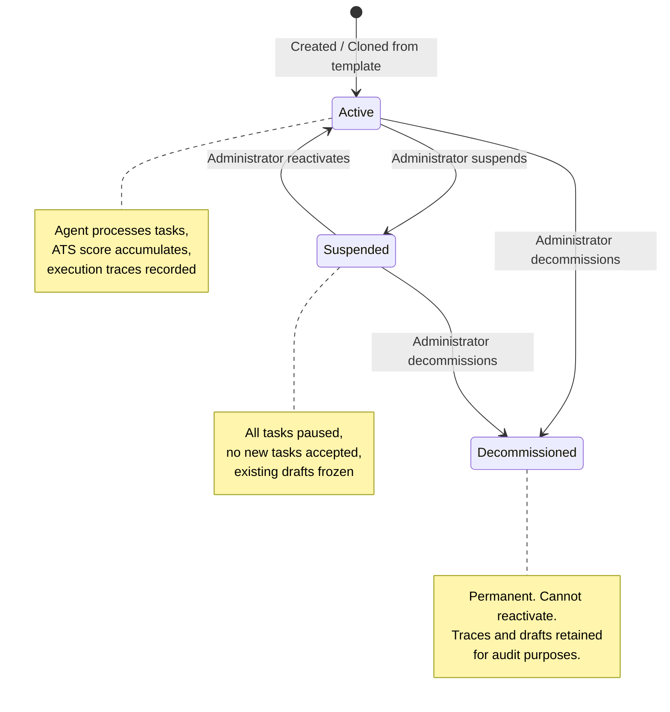
```mermaid
stateDiagram-v2
    [*] --> Active : Created / Cloned from template
    Active --> Suspended : Administrator suspends
    Suspended --> Active : Administrator reactivates
    Active --> Decommissioned : Administrator decommissions
    Suspended --> Decommissioned : Administrator decommissions

    note right of Active
        Agent processes tasks,
        ATS score accumulates,
        execution traces recorded
    end note
    note right of Suspended
        All tasks paused,
        no new tasks accepted,
        existing drafts frozen
    end note
    note right of Decommissioned
        Permanent. Cannot reactivate.
        Traces and drafts retained
        for audit purposes.
    end note
```

### 4.2 Agent Maturity Progression

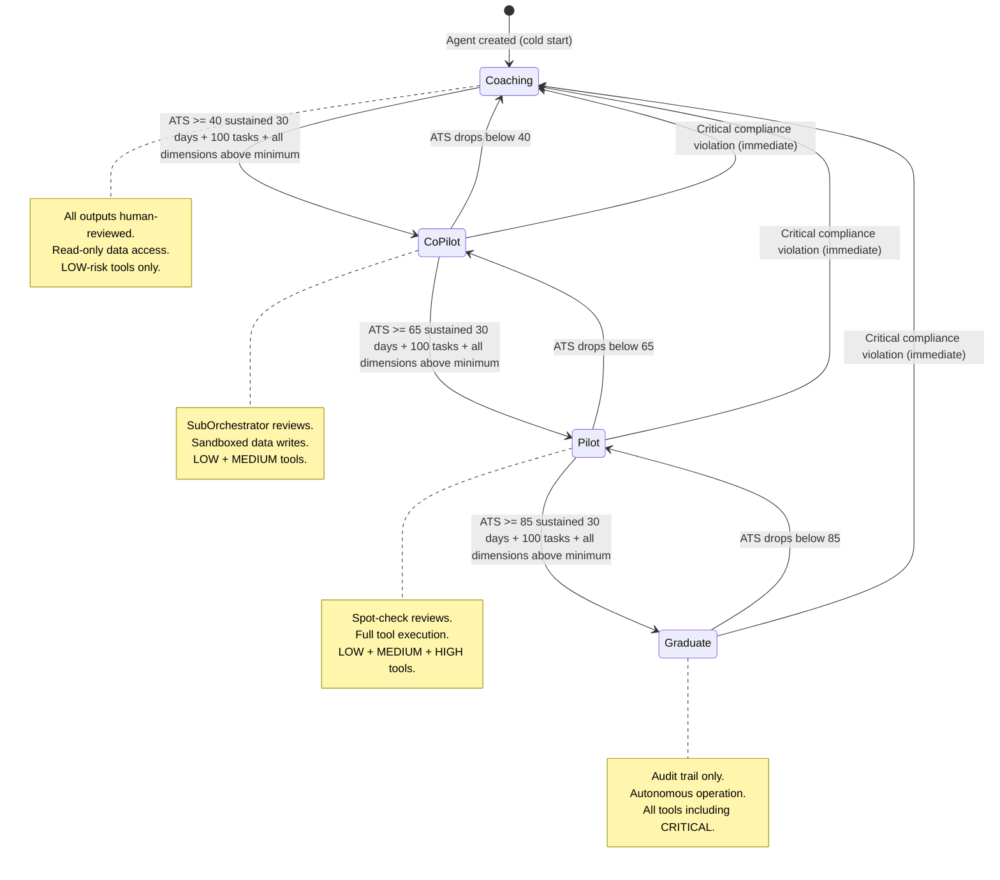
```mermaid
stateDiagram-v2
    [*] --> Coaching : Agent created (cold start)
    Coaching --> CoPilot : ATS >= 40 sustained 30 days + 100 tasks + all dimensions above minimum
    CoPilot --> Pilot : ATS >= 65 sustained 30 days + 100 tasks + all dimensions above minimum
    Pilot --> Graduate : ATS >= 85 sustained 30 days + 100 tasks + all dimensions above minimum

    Graduate --> Pilot : ATS drops below 85
    Pilot --> CoPilot : ATS drops below 65
    CoPilot --> Coaching : ATS drops below 40

    Graduate --> Coaching : Critical compliance violation (immediate)
    Pilot --> Coaching : Critical compliance violation (immediate)
    CoPilot --> Coaching : Critical compliance violation (immediate)

    note right of Coaching
        All outputs human-reviewed.
        Read-only data access.
        LOW-risk tools only.
    end note
    note right of CoPilot
        SubOrchestrator reviews.
        Sandboxed data writes.
        LOW + MEDIUM tools.
    end note
    note right of Pilot
        Spot-check reviews.
        Full tool execution.
        LOW + MEDIUM + HIGH tools.
    end note
    note right of Graduate
        Audit trail only.
        Autonomous operation.
        All tools including CRITICAL.
    end note
```

### 4.3 Worker Draft Lifecycle

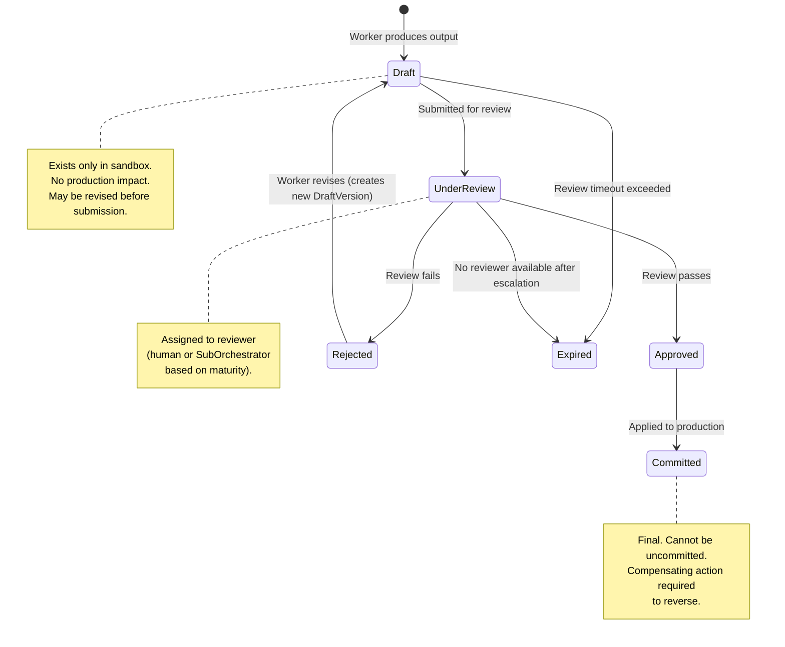
```mermaid
stateDiagram-v2
    [*] --> Draft : Worker produces output
    Draft --> UnderReview : Submitted for review
    UnderReview --> Approved : Review passes
    UnderReview --> Rejected : Review fails
    Rejected --> Draft : Worker revises (creates new DraftVersion)
    Approved --> Committed : Applied to production
    Draft --> Expired : Review timeout exceeded
    UnderReview --> Expired : No reviewer available after escalation

    note right of Draft
        Exists only in sandbox.
        No production impact.
        May be revised before submission.
    end note
    note right of UnderReview
        Assigned to reviewer
        (human or SubOrchestrator
        based on maturity).
    end note
    note right of Committed
        Final. Cannot be uncommitted.
        Compensating action required
        to reverse.
    end note
```

### 4.4 Approval Checkpoint Lifecycle

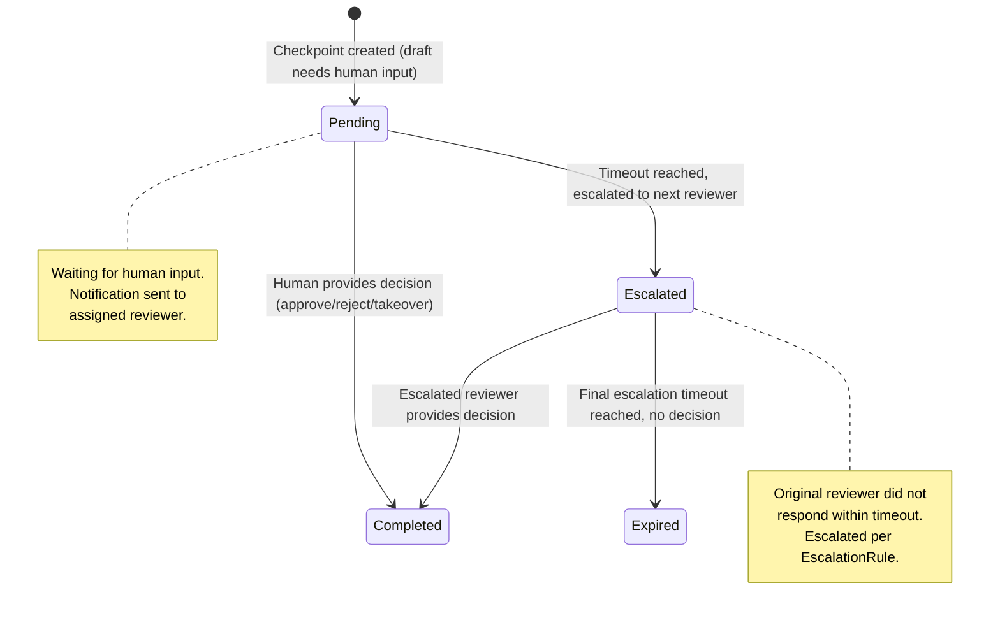
```mermaid
stateDiagram-v2
    [*] --> Pending : Checkpoint created (draft needs human input)
    Pending --> Completed : Human provides decision (approve/reject/takeover)
    Pending --> Escalated : Timeout reached, escalated to next reviewer
    Escalated --> Completed : Escalated reviewer provides decision
    Escalated --> Expired : Final escalation timeout reached, no decision

    note right of Pending
        Waiting for human input.
        Notification sent to
        assigned reviewer.
    end note
    note right of Escalated
        Original reviewer did not
        respond within timeout.
        Escalated per EscalationRule.
    end note
```

### 4.5 Skill Lifecycle

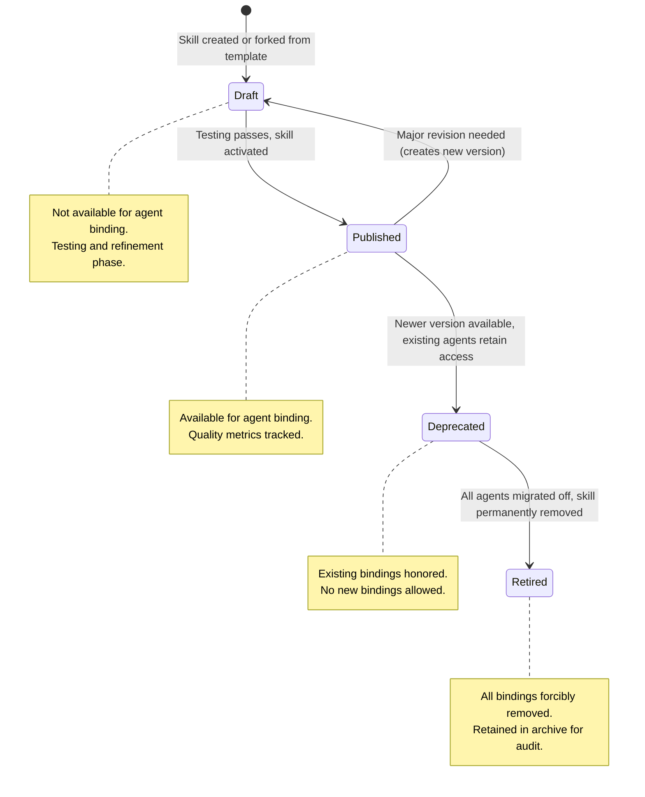
```mermaid
stateDiagram-v2
    [*] --> Draft : Skill created or forked from template
    Draft --> Published : Testing passes, skill activated
    Published --> Deprecated : Newer version available, existing agents retain access
    Deprecated --> Retired : All agents migrated off, skill permanently removed
    Published --> Draft : Major revision needed (creates new version)

    note right of Draft
        Not available for agent binding.
        Testing and refinement phase.
    end note
    note right of Published
        Available for agent binding.
        Quality metrics tracked.
    end note
    note right of Deprecated
        Existing bindings honored.
        No new bindings allowed.
    end note
    note right of Retired
        All bindings forcibly removed.
        Retained in archive for audit.
    end note
```

### 4.6 Tool Lifecycle

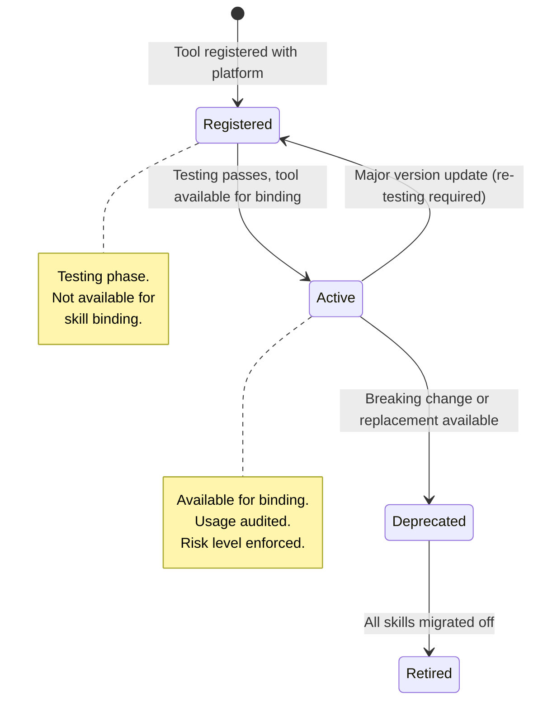
```mermaid
stateDiagram-v2
    [*] --> Registered : Tool registered with platform
    Registered --> Active : Testing passes, tool available for binding
    Active --> Deprecated : Breaking change or replacement available
    Deprecated --> Retired : All skills migrated off
    Active --> Registered : Major version update (re-testing required)

    note right of Registered
        Testing phase.
        Not available for
        skill binding.
    end note
    note right of Active
        Available for binding.
        Usage audited.
        Risk level enforced.
    end note
```

### 4.7 Conduct Policy Lifecycle

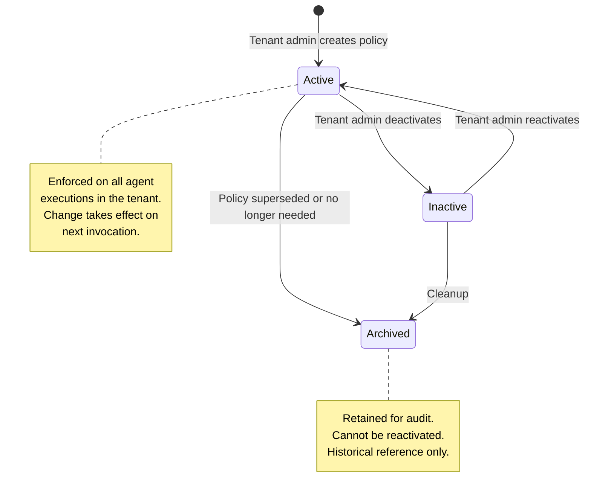
```mermaid
stateDiagram-v2
    [*] --> Active : Tenant admin creates policy
    Active --> Inactive : Tenant admin deactivates
    Inactive --> Active : Tenant admin reactivates
    Active --> Archived : Policy superseded or no longer needed
    Inactive --> Archived : Cleanup

    note right of Active
        Enforced on all agent
        executions in the tenant.
        Change takes effect on
        next invocation.
    end note
    note right of Archived
        Retained for audit.
        Cannot be reactivated.
        Historical reference only.
    end note
```

### 4.8 Policy Violation Lifecycle

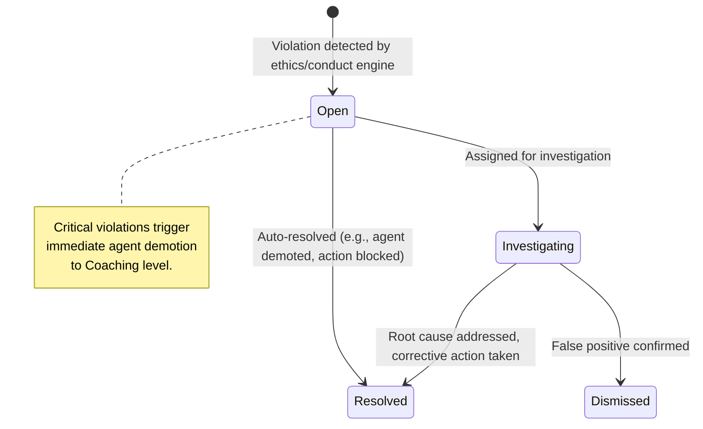
```mermaid
stateDiagram-v2
    [*] --> Open : Violation detected by ethics/conduct engine
    Open --> Investigating : Assigned for investigation
    Investigating --> Resolved : Root cause addressed, corrective action taken
    Investigating --> Dismissed : False positive confirmed
    Open --> Resolved : Auto-resolved (e.g., agent demoted, action blocked)

    note right of Open
        Critical violations trigger
        immediate agent demotion
        to Coaching level.
    end note
```

### 4.9 Event Trigger Lifecycle

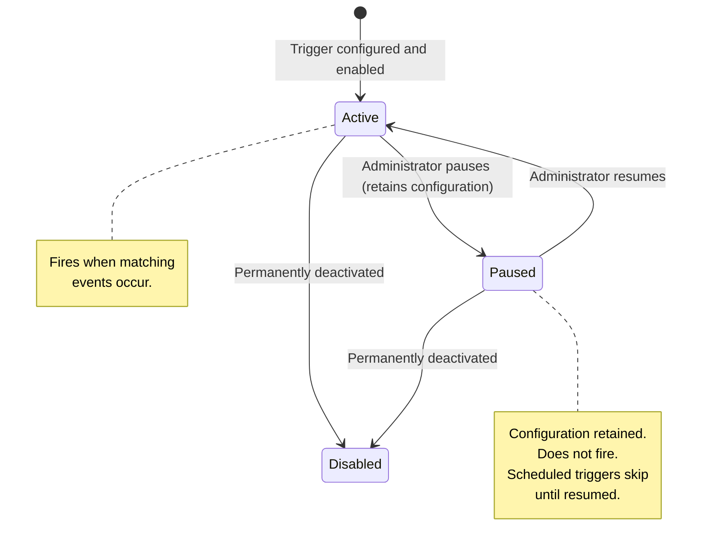
```mermaid
stateDiagram-v2
    [*] --> Active : Trigger configured and enabled
    Active --> Paused : Administrator pauses (retains configuration)
    Paused --> Active : Administrator resumes
    Active --> Disabled : Permanently deactivated
    Paused --> Disabled : Permanently deactivated

    note right of Active
        Fires when matching
        events occur.
    end note
    note right of Paused
        Configuration retained.
        Does not fire.
        Scheduled triggers skip
        until resumed.
    end note
```

---

## 5. Domain Aggregates

### 5.1 Aggregate Map

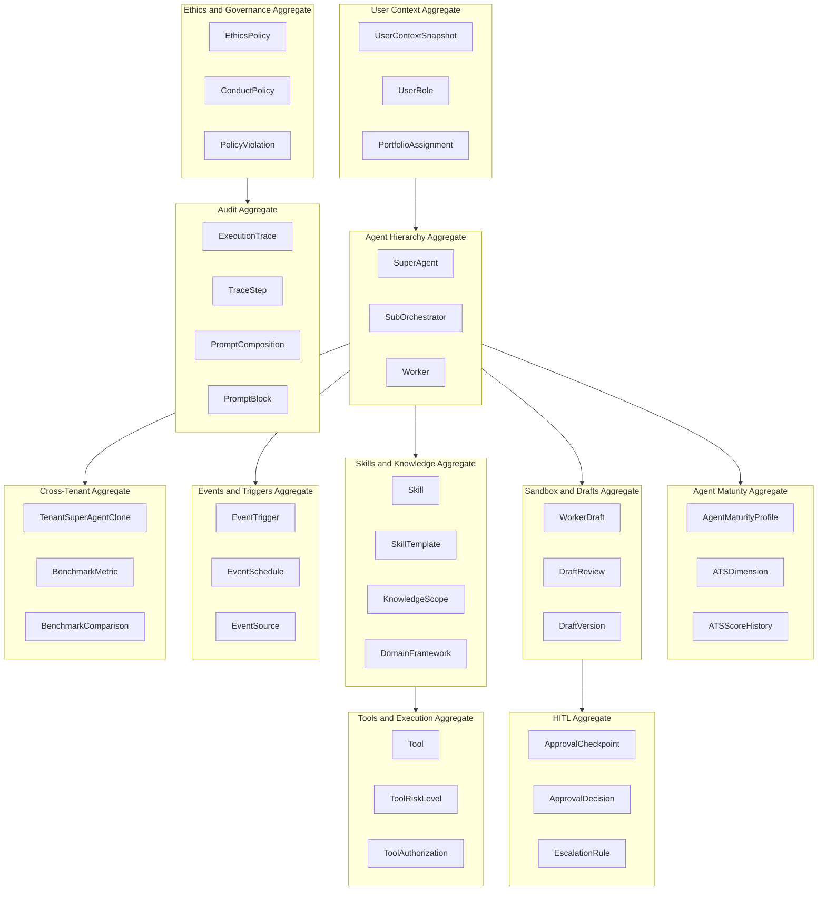
```mermaid
graph TD
    subgraph AG1["Agent Hierarchy Aggregate"]
        SA[SuperAgent]
        SO[SubOrchestrator]
        WK[Worker]
    end

    subgraph AG2["Agent Maturity Aggregate"]
        AMP[AgentMaturityProfile]
        ATSD[ATSDimension]
        ATSH[ATSScoreHistory]
    end

    subgraph AG3["Skills and Knowledge Aggregate"]
        SK[Skill]
        SKT[SkillTemplate]
        KS[KnowledgeScope]
        DF[DomainFramework]
    end

    subgraph AG4["Tools and Execution Aggregate"]
        TL[Tool]
        TRL[ToolRiskLevel]
        TA[ToolAuthorization]
    end

    subgraph AG5["Sandbox and Drafts Aggregate"]
        WD[WorkerDraft]
        DR[DraftReview]
        DV[DraftVersion]
    end

    subgraph AG6["Events and Triggers Aggregate"]
        ET[EventTrigger]
        ES[EventSchedule]
        ESR[EventSource]
    end

    subgraph AG7["HITL Aggregate"]
        AC[ApprovalCheckpoint]
        AD[ApprovalDecision]
        ER[EscalationRule]
    end

    subgraph AG8["Ethics and Governance Aggregate"]
        EP[EthicsPolicy]
        CP[ConductPolicy]
        PV[PolicyViolation]
    end

    subgraph AG9["Audit Aggregate"]
        EXT[ExecutionTrace]
        TS[TraceStep]
        PC[PromptComposition]
        PB[PromptBlock]
    end

    subgraph AG10["Cross-Tenant Aggregate"]
        TSAC[TenantSuperAgentClone]
        BM[BenchmarkMetric]
        BC[BenchmarkComparison]
    end

    subgraph AG11["User Context Aggregate"]
        UCS[UserContextSnapshot]
        UR[UserRole]
        PA[PortfolioAssignment]
    end

    AG1 --> AG2
    AG1 --> AG3
    AG3 --> AG4
    AG1 --> AG5
    AG1 --> AG6
    AG5 --> AG7
    AG8 --> AG9
    AG1 --> AG10
    AG11 --> AG1
```

### 5.2 Aggregate Details

| Aggregate | Root Entity | Bounded Context | Consistency Boundary | Tenant Scope |
|-----------|------------|-----------------|---------------------|-------------|
| **Agent Hierarchy** | SuperAgent | Agent Management | SuperAgent + SubOrchestrators + Workers created/suspended/decommissioned together | Tenant-Scoped |
| **Agent Maturity** | AgentMaturityProfile | Trust and Autonomy | ATS scores computed, maturity transitions executed, demotion enforced atomically | Tenant-Scoped |
| **Skills and Knowledge** | Skill | Capability Composition | Skill + tool bindings + knowledge scopes versioned together | Hybrid |
| **Tools and Execution** | Tool | Tool Registry | Tool + risk level + authorization rules managed together | Hybrid |
| **Sandbox and Drafts** | WorkerDraft | Draft Management | Draft + versions + reviews tracked together | Tenant-Scoped |
| **Events and Triggers** | EventTrigger | Event Processing | Trigger + schedule + source configured together | Tenant-Scoped |
| **HITL** | ApprovalCheckpoint | Human Oversight | Checkpoint + decision + escalation managed together | Tenant-Scoped |
| **Ethics and Governance** | EthicsPolicy / ConductPolicy | Policy Enforcement | Platform policies immutable; tenant policies versioned together | Global + Tenant-Scoped |
| **Audit** | ExecutionTrace | Compliance and Traceability | Trace + steps + prompt composition append-only together | Tenant-Scoped |
| **Cross-Tenant** | BenchmarkMetric | Anonymized Intelligence | Anonymized metrics collected and aggregated together | Shared (Anonymized) |
| **User Context** | UserContextSnapshot | Session Management | User profile + roles + portfolios cached together for session duration | Tenant-Scoped |

### 5.3 Inter-Aggregate Relationships

| From Aggregate | To Aggregate | Relationship Type | Description |
|---------------|-------------|-------------------|-------------|
| Agent Hierarchy | Agent Maturity | Reference | Each agent references its maturity profile |
| Agent Hierarchy | Skills and Knowledge | Association | Agents are composed of skills |
| Skills and Knowledge | Tools and Execution | Association | Skills bind to tools |
| Agent Hierarchy | Sandbox and Drafts | Ownership | Workers produce drafts |
| Agent Hierarchy | Events and Triggers | Association | Events activate agents |
| Sandbox and Drafts | HITL | Triggering | Drafts trigger approval checkpoints based on risk and maturity |
| Ethics and Governance | Audit | Enforcement | Policy checks generate trace steps; violations create records |
| Agent Maturity | Ethics and Governance | Enforcement | Critical policy violations trigger demotion |
| Tools and Execution | HITL | Triggering | Tool risk level determines HITL type |
| User Context | Agent Hierarchy | Consultation | SuperAgent queries user context for prompt composition |
| Agent Hierarchy | Cross-Tenant | Origin | SuperAgent is cloned from platform template |
| Agent Maturity | Cross-Tenant | Contribution | ATS metrics contribute to anonymized benchmarks |
| Audit | User Context | Recording | Execution traces record the user context used |

---

## 6. Cross-References

### 6.1 Traceability to PRD (01-PRD-AI-Agent-Platform.md)

| Domain Model Entity/Aggregate | PRD Section | PRD Requirement |
|------------------------------|-------------|-----------------|
| SuperAgent, SubOrchestrator, Worker | 2.1, 2.2, 3.2 | Platform layers, Agent Architecture, hierarchical orchestration |
| Skill, SkillTemplate, KnowledgeScope | 3.5 | Skills Framework (definition, assignment, lifecycle, examples) |
| Tool, ToolRiskLevel, ToolAuthorization | 3.4 | Tool System (categories, lifecycle, composition, dynamic creation) |
| WorkerDraft, DraftReview, DraftVersion | 3.6, 3.1 (Step 5) | Validation Layer, sandbox execution, approval workflows |
| AgentMaturityProfile, ATSDimension | 1.5, 2.1 | Agent Builder vision, progressive autonomy |
| EventTrigger, EventSchedule, EventSource | 3.1 (Step 1) | Request pipeline intake, event-triggered entry points |
| ApprovalCheckpoint, ApprovalDecision, EscalationRule | 3.4.3 (HITL), 3.6 | Human-in-the-loop tool pattern, approval workflows |
| EthicsPolicy, ConductPolicy, PolicyViolation | 7.1-7.6 | Data sovereignty, multi-tenancy, RBAC, security |
| ExecutionTrace, TraceStep | 3.1 (Step 7), 3.7 | Record step, trace logging |
| TenantSuperAgentClone, BenchmarkMetric | 7.2 | Multi-tenancy, cross-tenant benchmarking |
| UserContextSnapshot, UserRole, PortfolioAssignment | 3.1 (Step 2-3), 7.6 | Retrieve step, plan step, RBAC |
| PromptBlock, PromptComposition | 3.1 (Steps 2-3), 3.5.1 | Prompt composition, skill system prompts |

### 6.2 Traceability to Benchmarking Study (11-Super-Agent-Benchmarking-Study.md)

| Domain Model Entity/Aggregate | Study Section | Research Finding |
|------------------------------|---------------|-----------------|
| SuperAgent, SubOrchestrator, Worker | 3.1, 3.4, 3.6 | Hierarchical orchestration validated by Azure AI Foundry, LangGraph, CrewAI |
| AgentMaturityProfile, ATSDimension, ATSScoreHistory | 4.1-4.7 | ATS framework from trust economy research; 4-level progression validated |
| EventTrigger, EventSchedule, EventSource | 5.1-5.7 | EDA as "nervous system" (Confluent); four trigger types; Kafka event bus |
| ApprovalCheckpoint, ApprovalDecision, EscalationRule | 6.1-6.7 | Risk-times-maturity HITL matrix; four interaction types; smart escalation |
| KnowledgeScope, PromptBlock, PromptComposition | 7.1-7.7 | Adaptive RAG, context engineering, dynamic prompt composition from modular blocks |
| TenantSuperAgentClone, BenchmarkMetric, BenchmarkComparison | 8.1-8.7 | Schema-per-tenant isolation; anonymized benchmarking; k-anonymity |
| EthicsPolicy, ConductPolicy, PolicyViolation | 9.1-9.8 | EU AI Act Article 12, GDPR Article 22, platform vs tenant ethics layers |
| ToolAuthorization, ToolRiskLevel | 10.3 | Tool authorization per maturity level; agent-to-agent authentication |
| WorkerDraft, DraftReview, DraftVersion | 11.1-11.5 | Worker sandbox lifecycle; maturity-dependent review authority |

### 6.3 Traceability to BA Domain Mapping (BA-Domain-Skills-Tools-Mapping.md)

| Domain Model Entity | BA Mapping Section | Coverage |
|--------------------|-------------------|----------|
| Skill (all 48 skills) | Section 3 | 7 domains mapped: D1 Business Architecture, D2 Performance, D3 TOGAF, D4 Service Design, D5 EFQM, D6 KM, D7 GRC |
| Tool (all 54 tools) | Section 4 | 6 tool categories: Data Access, Content Generation, Analysis, Integration, Collaboration, Lookup/Reference |
| KnowledgeScope (8 collections) | Section 6.3 | Knowledge scope gaps: togaf_reference, efqm_model, risk_frameworks, itil_service_design, capability_patterns, bsc_reference, km_frameworks, governance_standards |
| DomainFramework (7 frameworks) | Section 2 | TOGAF, EFQM, ISO 31000, BSC, ITIL, COBIT, custom |
| SkillTemplate (32 existing + gaps) | Section 7 | 32 existing profiles cover 32% of needed skills; 20 skill gaps identified |

### 6.4 Traceability to Design Plan Decisions

| Decision # | Decision | Primary Entities |
|-----------|----------|-----------------|
| 1 | Super Agent -> Sub-Orchestrators -> Workers | SuperAgent, SubOrchestrator, Worker |
| 2 | Hybrid domain-expert + capability workers | SubOrchestrator (Way of Thinking), Worker (Way of Working), Skill |
| 3 | Coaching -> CoPilot -> Pilot -> Graduate with ATS | AgentMaturityProfile, ATSDimension, ATSScoreHistory |
| 4 | Workers produce drafts in sandbox; review = maturity-dependent | WorkerDraft, DraftReview, DraftVersion |
| 5 | Risk x Maturity approval matrix | ApprovalCheckpoint, EscalationRule, ToolRiskLevel |
| 6 | Four event trigger types | EventTrigger, EventSchedule, EventSource |
| 7 | Platform baseline (immutable) + tenant extensions | EthicsPolicy, ConductPolicy |
| 8 | Schema-per-tenant; anonymized shared benchmark schema | TenantSuperAgentClone, BenchmarkMetric |
| 9 | Runtime user context query + Valkey cache | UserContextSnapshot |
| 10 | Full execution trace | ExecutionTrace, TraceStep |
| 11 | Operating-model-aligned RAG | KnowledgeScope, DomainFramework |
| 12 | Dynamic prompt composition from modular blocks | PromptBlock, PromptComposition |
| 13 | Clone on setup -> independent management -> anonymized metrics | TenantSuperAgentClone, BenchmarkMetric, BenchmarkComparison |
| 14 | Full security stack | ToolAuthorization, EthicsPolicy, ConductPolicy, PolicyViolation |
| 15 | Hybrid embedded panel + full workspace | (UI concern -- not modeled as entities) |
| 16 | Full BA -> SA -> DBA agent chain | (Process concern -- this document is the BA deliverable) |

---

## 7. Glossary (Ubiquitous Language)

| Term | Definition | NOT |
|------|------------|-----|
| **Super Agent** | The tenant's top-level AI orchestrator; one per tenant; the "organizational brain" | Not a specific agent type or template |
| **Sub-Orchestrator** | A domain-expert AI coordinator that plans and decomposes tasks within its domain (e.g., EA, GRC) | Not a worker; does not execute tasks directly |
| **Worker** | A capability executor that performs a specific type of task (data query, calculation, report) | Not domain-specific; shared across domains by capability |
| **Way of Thinking** | The domain knowledge, frameworks, and analytical approaches that a Sub-Orchestrator brings (implemented as Skills) | Not a technical component; a composition concept |
| **Way of Working** | The execution capabilities and tools that a Worker uses to perform tasks (implemented as Tools) | Not domain knowledge; operational capability |
| **ATS (Agent Trust Score)** | A composite 0-100 score measuring an agent's trustworthiness across five dimensions | Not a permission level; inputs to the maturity level |
| **Maturity Level** | One of four progressive autonomy levels (Coaching, CoPilot, Pilot, Graduate) governing review requirements and tool access | Not the ATS score itself; determined by the ATS score |
| **Skill** | A reusable "expertise package" combining a prompt fragment, tools, knowledge scopes, and behavioral rules | Not a tool; higher-level abstraction that uses tools |
| **Tool** | An atomic execution primitive that performs a specific action (run SQL, create chart, send notification) | Not a skill; lower-level than a skill |
| **Worker Draft** | A sandboxed output from a worker that has not yet been committed to production | Not a final result; requires review before committing |
| **Approval Checkpoint** | A point in a workflow where human input is required before proceeding | Not an automatic gate; requires explicit human response |
| **Ethics Policy** | A platform-level immutable rule governing agent behavior (e.g., no PII to cloud without sanitization) | Not configurable by tenants; platform baseline |
| **Conduct Policy** | A tenant-configurable behavioral rule extending the ethics baseline (e.g., HIPAA constraints) | Not a platform rule; can be added by tenant admins |
| **Execution Trace** | The complete, immutable audit record of a single agent invocation from intake to response | Not a log file; a structured, append-only record |
| **Benchmark Metric** | An anonymized performance metric contributed to the shared cross-tenant benchmark pool | Not tenant-identifiable; anonymized and aggregated |
| **Prompt Block** | A modular, database-stored building block used to compose dynamic system prompts at runtime | Not a static template; dynamically assembled |
| **Knowledge Scope** | The definition of which knowledge collections a skill or agent can access during RAG retrieval | Not the knowledge itself; a pointer to knowledge sources |
| **Domain Framework** | A professional methodology or standard (TOGAF, EFQM, ISO 31000, BSC, ITIL, COBIT) | Not a software framework; a business methodology |
| **Portfolio** | An organizational grouping of responsibilities and focus areas that a user manages | Not a financial portfolio; organizational scope |

---

## 8. Open Questions for Stakeholder Validation

| # | Question | Context | Impact if Unanswered |
|---|---------|---------|---------------------|
| Q1 | Should Workers be globally shared across SubOrchestrators or locally scoped per SubOrchestrator? | BR-004 suggests shared by capability. Some tenants may prefer dedicated workers per domain for data isolation. | Affects Worker-SubOrchestrator cardinality and scheduling complexity |
| Q2 | What is the minimum number of tasks required before promotion consideration? | BR-012 defaults to 100 tasks. Some domains (e.g., EFQM assessments) may have low task volumes. | Low-volume domains may never promote agents if threshold is too high |
| Q3 | Should the platform support tenant-defined ATS dimension weights? | BR-011 defines fixed weights. Some tenants may weight Compliance higher than Competence. | Affects ATS computation engine flexibility |
| Q4 | How should cross-domain tasks be attributed for ATS scoring? | When a task spans multiple SubOrchestrators (e.g., "How does technology maturity affect compliance risk?"), which agents get the task completion credit? | Affects accuracy of individual agent ATS scores |
| Q5 | Should conduct policies support conditional activation (active only during specific time windows or for specific user roles)? | BR-073 describes industry-specific rules. Some rules may apply only during audit periods or for specific departments. | Affects conduct policy engine complexity |
| Q6 | What is the maximum allowed prompt composition size (in tokens)? | BR-110 describes dynamic assembly from blocks. Unconstrained assembly could exceed model context windows. | Could cause model errors or degraded performance |

---

## 9. Next Steps in the Agent Chain

This business domain model is the first step in the mandatory BA -> SA -> DBA -> DEV chain.

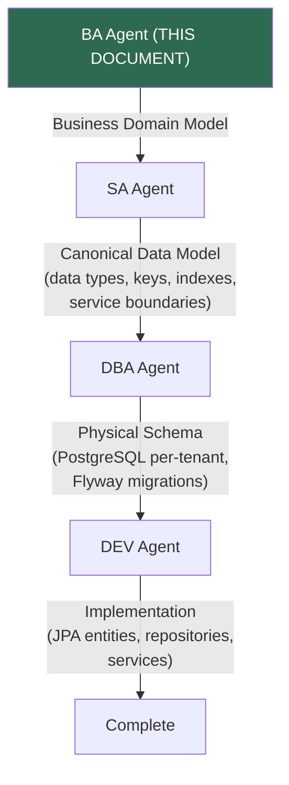
```mermaid
graph TD
    A["BA Agent (THIS DOCUMENT)"] -->|Business Domain Model| B["SA Agent"]
    B -->|"Canonical Data Model<br/>(data types, keys, indexes,<br/>service boundaries)"| C["DBA Agent"]
    C -->|"Physical Schema<br/>(PostgreSQL per-tenant,<br/>Flyway migrations)"| D["DEV Agent"]
    D -->|"Implementation<br/>(JPA entities, repositories,<br/>services)"| E["Complete"]

    style A fill:#2d6a4f,color:#ffffff
```

**SA Agent inputs from this document:**

1. **35 business entities** to transform into technical data model with data types, primary keys, foreign keys, and indexes
2. **112 business rules** to encode as constraints, validations, and service logic
3. **11 aggregates** to map to service boundaries and transaction scopes
4. **9 state machines** to implement as status enums and transition logic
5. **Tenant scope annotations** to implement as schema-per-tenant isolation
6. **Cross-tenant anonymization pipeline** to design as a separate service with privacy controls
