# Tenant Graph Schema

> Legacy focused view. The canonical per-database source is [neo4j-ems-db.md](./neo4j-ems-db.md).

Each tenant has a dedicated Neo4j database (e.g., `tenant_acme`) containing all tenant-specific data. This provides complete data isolation between tenants.

## Overview

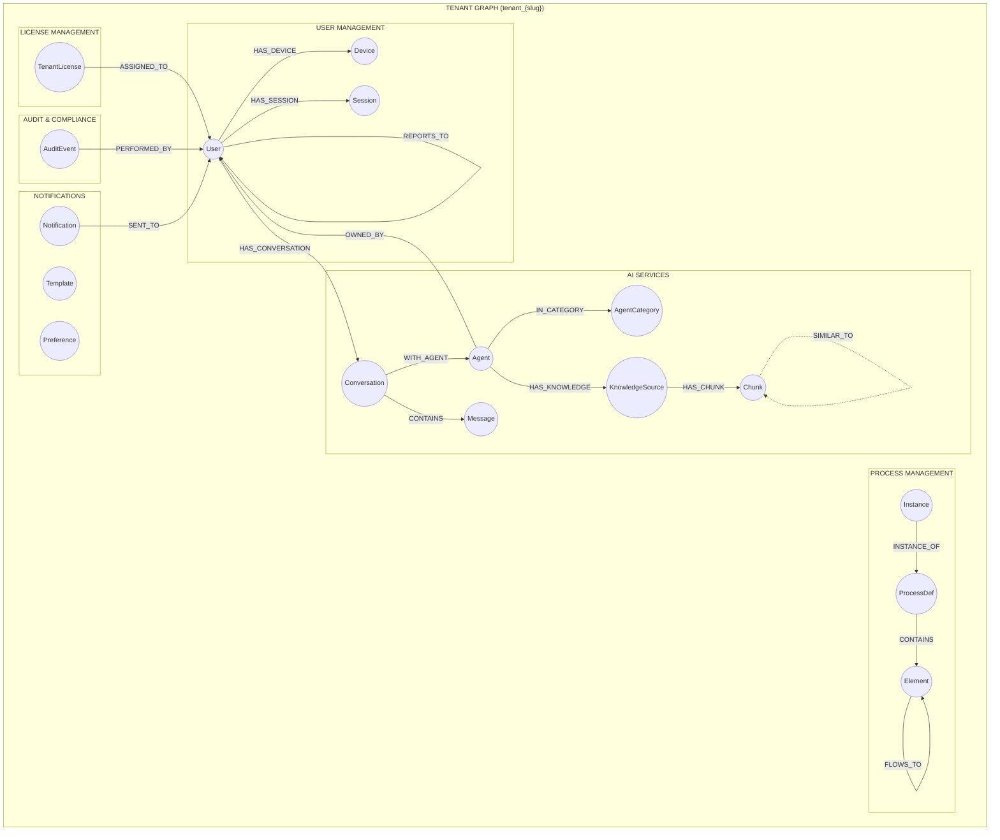

## ERD (Mermaid)

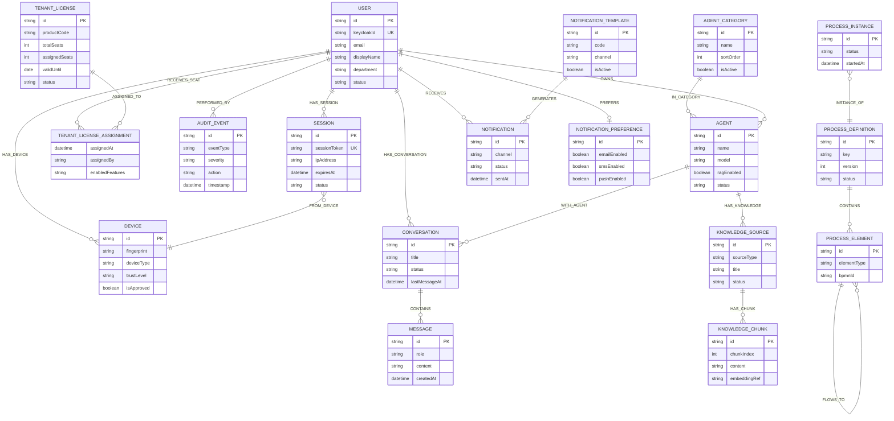

## Node Definitions

### User Management

#### User

Extended user profile information (synced with Keycloak).

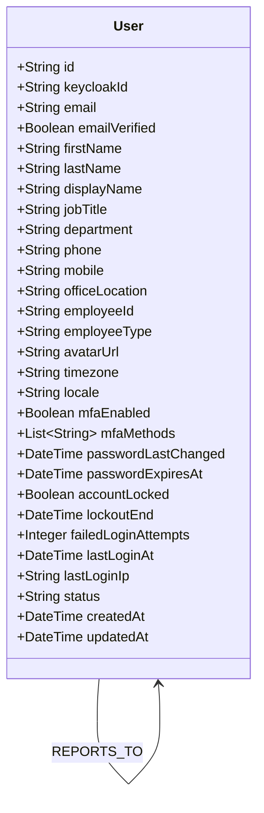

**Relationships:**
- `(:User)-[:REPORTS_TO]->(:User)` - Manager relationship
- `(:User)-[:MEMBER_OF]->(:Department)` - Department membership

**Constraints:**
```cypher
CREATE CONSTRAINT user_id FOR (u:User) REQUIRE u.id IS UNIQUE;
CREATE CONSTRAINT user_keycloak FOR (u:User) REQUIRE u.keycloakId IS UNIQUE;
CREATE INDEX user_email FOR (u:User) ON (u.email);
```

#### Device

Registered user devices for security and trust management.

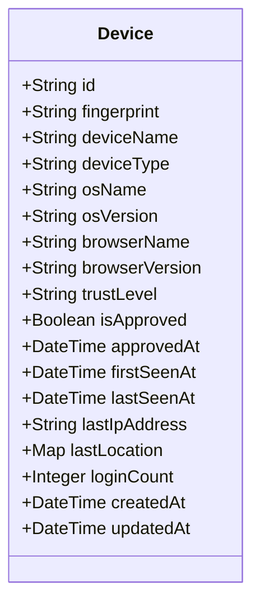

**Device Types:** DESKTOP, MOBILE, TABLET, OTHER
**Trust Levels:** UNKNOWN, UNTRUSTED, TRUSTED, VERIFIED

**Relationship:** `(:User)-[:HAS_DEVICE]->(:Device)`

#### Session

Active user sessions.

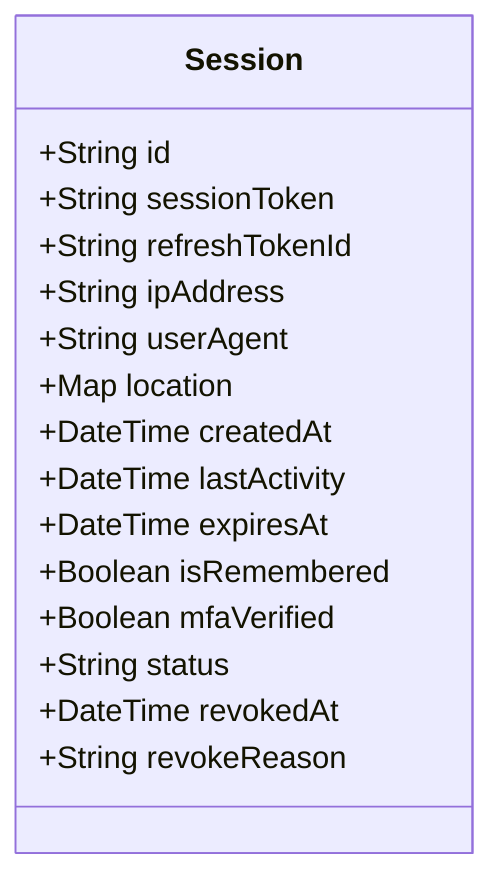

**Status:** ACTIVE, EXPIRED, REVOKED

**Relationships:**
- `(:User)-[:HAS_SESSION]->(:Session)`
- `(:Session)-[:FROM_DEVICE]->(:Device)`

### License Management

#### TenantLicense

Tenant's active license subscriptions.

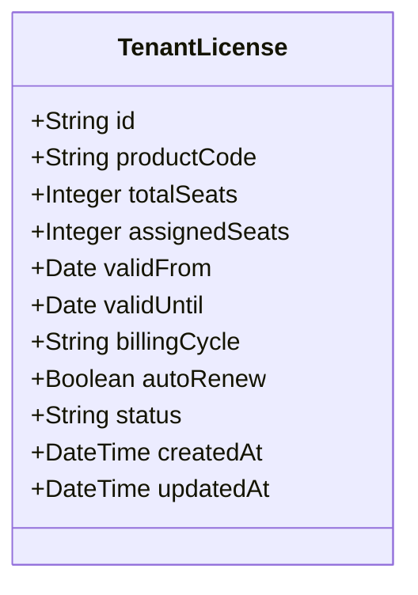

**Status:** ACTIVE, EXPIRED, SUSPENDED, CANCELLED

**Relationship:**
```cypher
(:TenantLicense)-[:ASSIGNED_TO {
    assignedAt: DateTime,
    assignedBy: String,
    enabledFeatures: [String],
    disabledFeatures: [String]
}]->(:User)
```

### Audit & Compliance

#### AuditEvent

Immutable audit trail for compliance and security.

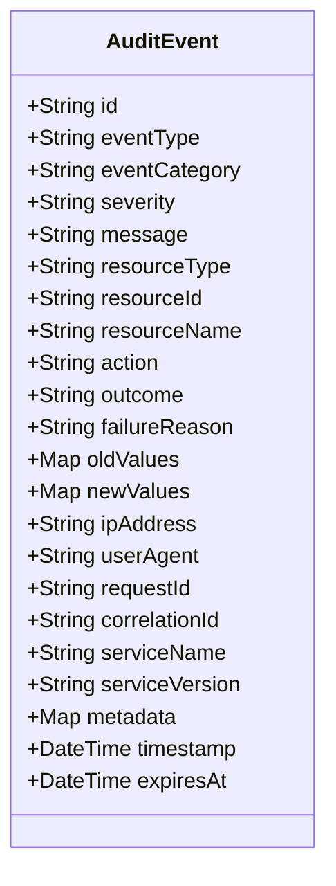

**Categories:** AUTH, DATA, ADMIN
**Severity:** INFO, WARNING, ERROR, CRITICAL
**Actions:** CREATE, READ, UPDATE, DELETE
**Outcome:** SUCCESS, FAILURE

**Relationships:**
- `(:AuditEvent)-[:PERFORMED_BY]->(:User)`
- `(:AuditEvent)-[:AFFECTED]->(:Resource)` - Generic resource relationship

### AI Services

#### Agent & Knowledge Graph

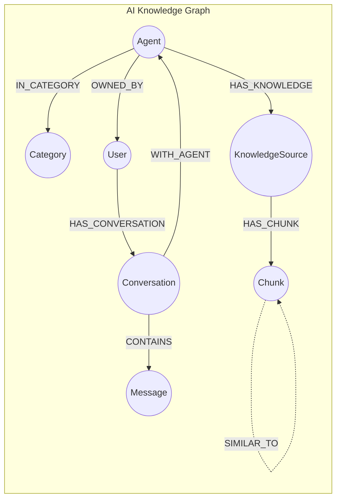

#### Agent

AI agent configurations.

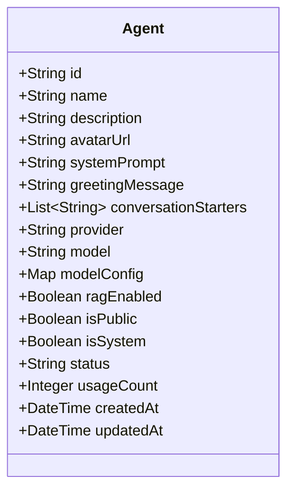

**Providers:** OPENAI, ANTHROPIC, GEMINI, OLLAMA
**Status:** ACTIVE, INACTIVE, DELETED

#### Conversation & Messages

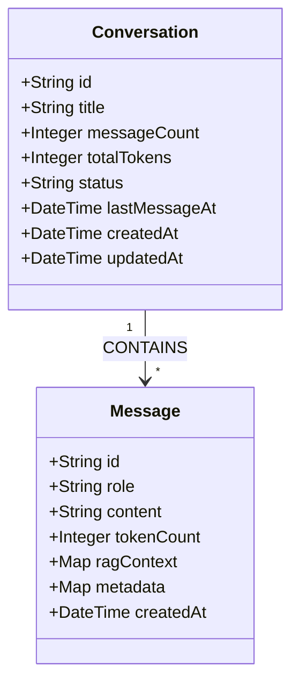

**Message Roles:** USER, ASSISTANT, SYSTEM

#### KnowledgeSource & Chunks

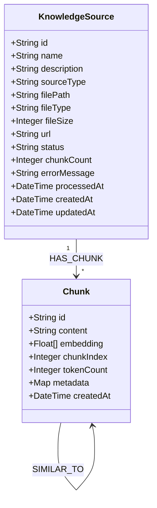

**Source Types:** FILE, URL, TEXT
**File Types:** PDF, TXT, MD, CSV, DOCX
**Status:** PENDING, PROCESSING, COMPLETED, FAILED

**Vector Index:**
```cypher
CREATE VECTOR INDEX chunk_embedding FOR (c:Chunk) ON (c.embedding)
OPTIONS {indexConfig: {`vector.dimensions`: 1536, `vector.similarity_function`: 'cosine'}}
```

### Process Management

#### Process Flow

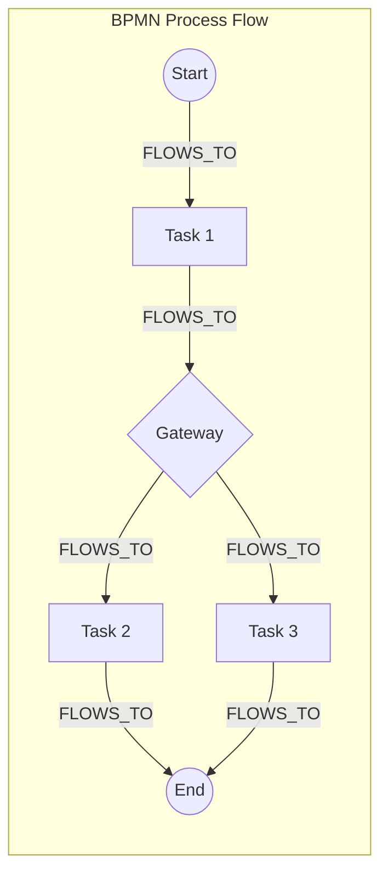

#### ProcessDefinition

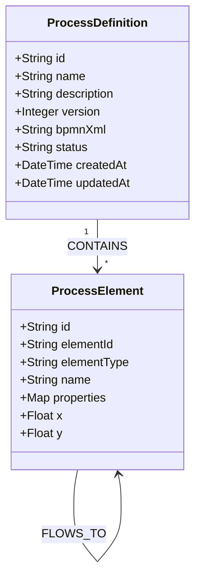

**Status:** DRAFT, PUBLISHED, ARCHIVED

#### ProcessInstance

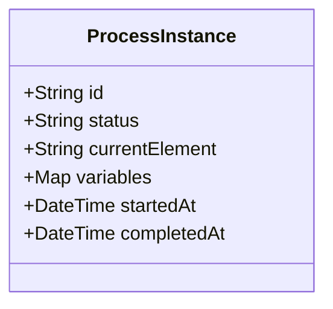

**Status:** RUNNING, COMPLETED, CANCELLED, FAILED

### Notifications

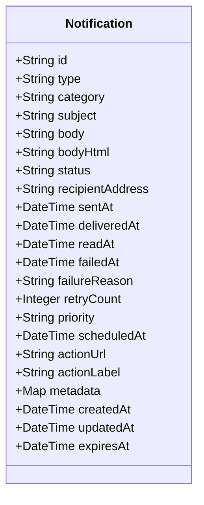

**Types:** EMAIL, PUSH, IN_APP, SMS
**Categories:** SYSTEM, MARKETING, TRANSACTIONAL, ALERT
**Status:** PENDING, SENT, DELIVERED, FAILED, READ
**Priority:** LOW, NORMAL, HIGH, URGENT

---

## Isolation Model

Each tenant graph is completely isolated:

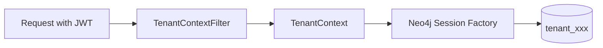

- No cross-tenant queries possible
- Physical graph separation
- Independent backup/restore
- Per-tenant connection routing

### Connection Routing

```java
// Tenant-aware Neo4j session
public Session getSession() {
    String tenantId = TenantContext.getCurrentTenant();
    String database = "tenant_" + tenantId;
    return driver.session(SessionConfig.forDatabase(database));
}
```

---

**Database:** Neo4j 5.x with vector index support
**Last Updated:** 2026-02-24
