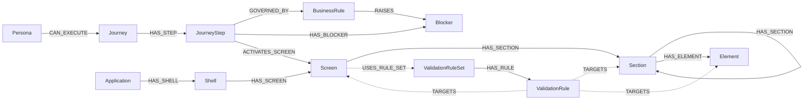

# System Graph Model

## 01 Purpose

This document defines the system object definition graph that will be used as the template for later instance creation.

It defines:

1. the system object definition graph model
2. the list of system object definitions
3. the shared definition attributes
4. the object-specific definition attributes
5. the naming and coding conventions for object instances
6. the relationship matrix between definition objects
7. the structural modeling rules for `Application`, `Shell`, `Screen`, `Section`, and `Element`

The actual instance graph is not modeled here. This document defines the canonical definition layer and the conventions that later instance records must follow.

#### 01.01 UI Component Asset And Instance Implementation Note

For frontend implementation support, UI component assets and UI component instances may be persisted in Neo4j as an implementation extension layer.

- a UI component asset is the reusable definition-layer rendering asset, such as a PrimeNG `Accordion`
- a UI component instance is the configured usage of that asset placed in a target `Element`
- UI component instances are implementation-support records and must not replace the canonical business object families in this document
- configurator resolution should be based on stable asset metadata such as `asset_provider`, `asset_type`, and `asset_name`
- when this implementation extension is persisted, the structural linkage is `Element -> HAS_COMPONENT -> Component Instance` and `Component Instance -> INSTANCE_OF -> UI Component Asset`
- visual background, color, image, and pattern settings remain configuration of a `Shell` or `Section`; they are not component assets unless they are implemented as a reusable renderer with behavior

#### 01.02 Preview Implementation And Promotion Rule

The previewer must be treated as a real frontend implementation staging area, not as a disposable mockup surface.

- each preview screen should be implemented in the currently approved target stack
- when the target stack is Angular, each preview screen should exist as its own Angular implementation unit with separate `.ts`, `.html`, and `.scss`
- if the target stack later changes, for example to React and Tailwind, the preview implementation must follow that stack instead of keeping Angular-specific structure
- the preview implementation should be production-oriented and transferable, not preview-only throwaway code
- once a screen is approved, the intended promotion step should be close to copying the screen folder into its final EMSIST frontend location and applying only outer-shell integration changes

Promotion rule:

- the approved screen folder code must move as-is
- only outer-shell integration is allowed to change after approval
- redesign, rewrite, or markup restyling after approval is not allowed

Typical integration-layer changes that may still be required after promotion:

- route registration
- module or import wiring
- app-level layout hooks
- real service endpoints
- auth or guards
- shared theme or token imports
- asset paths
- state store wiring
- feature flags or environment configuration

Interpretation:

- the promotion risk is not the approved screen folder itself
- the promotion risk is the surrounding app context and integration layer

## 02 System Object Definition Graph

### 02.01 Graph Model

### 02.02 Object Definitions List

| Object | Description |
|--------|-------------|
| `Persona` | The canonical business actor, user role, or operational role that initiates, performs, owns, or is allowed to execute one or more journeys in the system. A persona represents who is acting from the business point of view. |
| `Journey` | The canonical business flow, goal, or outcome-oriented path that a persona performs in order to achieve something meaningful in the product. A journey represents why the interaction is happening. |
| `JourneyStep` | The canonical ordered step within a journey that sequences the flow and activates the relevant screen. A journey step represents which ordered step in the journey is currently active and whether that step executes as a mandatory or conditional part of the journey. |
| `BusinessRule` | The canonical business rule that governs whether a journey step executes, executes conditionally, is skipped, or is diverted. A business rule belongs to the journey-flow layer and must not be used to model screen or UI state. |
| `Blocker` | The canonical blocking condition, constraint, or failure gate associated to one or more journey steps. A blocker describes why a journey step cannot execute, cannot complete, or must divert to a blocked outcome until the blocker is resolved. |
| `Application` | The canonical top-level frontend application object that owns one or more shells and carries the top shared presentation hierarchy for the system. An application contains shells only. |
| `Shell` | The canonical outer frontend host context that owns one or more screens and provides the top structural region in which approved screens land. A shell contains screens only. |
| `Screen` | The canonical implementation-facing content context that realizes a screen experience inside a shell, such as a login screen, MFA screen, overlay screen, or product screen. A screen owns sections and uses a screen-level validation-rule set. |
| `Section` | The canonical structural grouping object used to organize layout, steps, blocks, support regions, message regions, field regions, or other logical UI areas inside a screen or another section. |
| `Element` | The canonical terminal visible or interactive UI object rendered inside a section, such as a title, subtitle, message, input, button, checkbox, icon renderer, or status banner. An element is always a leaf in the graph. |
| `ValidationRuleSet` | The canonical screen-scoped rule-set definition that groups validation rules for an active screen. The rule set is the requirements/configuration object that later runtime services evaluate for actions such as `show`, `hide`, `enable`, `disable`, `set_value`, `set_text`, and `transition`. |
| `ValidationRule` | The canonical declarative rule node that describes a condition, priority, and action to apply to a target screen, section, or element. A validation rule is owned by a validation-rule set. |

### 02.03 Shared Definition Attributes

Every definition object should carry these shared attributes.

| Attribute | Type | Description | Accept Null |
|-----------|------|-------------|-------------|
| `name` | `string` | Business or structural name of the definition object. | `false` |
| `description` | `text` | Meaning and semantic intent of the definition object. | `false` |
| `id` | `UUID` | Immutable unique identifier of the definition object. Must use the standard UUID mask `8-4-4-4-12` hexadecimal characters, for example `550e8400-e29b-41d4-a716-446655440000`. | `false` |
| `hierarchy_code` | `string` | Business or structural hierarchy identifier of the definition object. | `false` |
| `status` | `enum` | Lifecycle state of the definition object. Recommended values: `active`, `planned`, `hold`, `retired`. | `false` |
| `domain` | `enum` | Owning implementation or business domain of the object. Recommended values: `business`, `frontend`, `backend`. | `false` |

Notes:

- these are the shared attributes for all system objects
- `id` is the immutable system-level identifier and must be stored as a UUID value
- `hierarchy_code` is the human-readable graph identity
- `domain` is used to distinguish whether the selected object is business-facing, frontend-facing, or backend-facing for fact-sheet rendering and delivery alignment

### 02.04 Object-Specific Definition Attributes

Object-specific attributes should be added as required.

| Object | Attribute | Type | Description | Accept Null |
|--------|-----------|------|-------------|-------------|
| `JourneyStep` | `step_order` | `integer` | Ordered step sequence within the journey. | `false` |
| `JourneyStep` | `execution_method` | `enum` | Recommended values: `mandatory`, `conditional`. `mandatory` means the step always executes in the normal journey path. `conditional` means the step executes only when its entry condition is satisfied. | `false` |
| `BusinessRule` | `rule_scope` | `enum` | Recommended values: `journey`, `journey_step`. | `false` |
| `BusinessRule` | `condition_expression` | `text` | Declarative business condition that controls whether the journey step executes, is skipped, or diverts. | `false` |
| `BusinessRule` | `execution_effect` | `enum` | Recommended values: `allow_step`, `require_step`, `skip_step`, `raise_blocker`, `redirect_outcome`. | `false` |
| `Blocker` | `blocker_type` | `enum` | Recommended values: `business`, `access`, `policy`, `data`, `technical`. | `false` |
| `Blocker` | `blocking_effect` | `enum` | Recommended values: `prevent_execution`, `prevent_completion`, `redirect_outcome`. | `false` |
| `Shell` | `background_type` | `enum` | Optional shell backdrop mode such as `color`, `image`, `pattern`, or `color_pattern`. Purely visual outer background settings are configuration of the shell and must not be modeled as structural `Section` or `Element` instances. | `true` |
| `Shell` | `background_color_style` | `string` | Optional token reference or CSS style expression used by the approved frontend implementation for the shell background color layer. | `true` |
| `Shell` | `background_pattern_key` | `string` | Optional named pattern asset or pattern identifier used by the shell background. | `true` |
| `Shell` | `background_pattern_opacity` | `decimal` | Optional opacity for the configured shell background pattern layer. | `true` |
| `Shell` | `background_image_path` | `string` | Optional image asset path for shell background imagery. | `true` |
| `Section` | `section_type` | `enum` | Structural type such as `section`, `step`, `message`, `field`, `panel`, or `support`. | `false` |
| `Section` | `repeatable` | `boolean` | Whether the section is a repeatable pattern such as `Auth Provider Section [0..n]`. | `false` |
| `Section` | `render_mode` | `enum` | Recommended values: `static`, `conditional`. | `false` |
| `Section` | `default_state` | `enum` | Recommended values: `visible`, `hidden`, `disabled`. | `false` |
| `Section` | `control_source` | `enum` | Recommended values: `none`, `validation_rule_set`. | `false` |
| `Element` | `element_type` | `enum` | UI-element type such as `title`, `subtitle`, `message`, `input`, `button`, `checkbox`, `icon`, or `banner`. | `false` |
| `Element` | `render_mode` | `enum` | Recommended values: `static`, `conditional`. | `false` |
| `Element` | `default_state` | `enum` | Recommended values: `visible`, `hidden`, `disabled`. | `false` |
| `Element` | `control_source` | `enum` | Recommended values: `none`, `validation_rule_set`. | `false` |
| `Element` | `semantic_level` | `enum` | Semantic heading level such as `H1`, `H2`, or `none`. | `true` |
| `ValidationRuleSet` | `rule_set_type` | `enum` | Recommended value: `screen_runtime`. | `false` |
| `ValidationRuleSet` | `rule_set_scope` | `enum` | Recommended value: `screen`. | `false` |
| `ValidationRule` | `condition_expression` | `text` | Declarative condition evaluated by the rule-set runtime. | `false` |
| `ValidationRule` | `action_type` | `enum` | Recommended values: `show`, `hide`, `enable`, `disable`, `set_value`, `set_text`, `transition`. | `false` |
| `ValidationRule` | `action_value` | `text` | Optional value payload for actions such as `set_value`, `set_text`, or `transition`. | `true` |
| `ValidationRule` | `priority` | `integer` | Explicit rule-precedence order. | `false` |
| `ValidationRule` | `stop_processing` | `boolean` | Whether evaluation should stop after this rule succeeds. | `false` |

Attribute interpretation rules:

- `execution_method = mandatory`
  - the journey step always executes in the normal journey path
- `execution_method = conditional`
  - the journey step executes only when a prerequisite, branch condition, or runtime decision allows it
- `BusinessRule`
  - governs journey-flow behavior only and must not be used to describe screen or UI rendering state
- `Blocker`
  - explains why a step cannot proceed or why execution diverts to a blocked outcome
- `render_mode = static`
  - the object is structurally part of the realized UI and is not controlled by the validation-rule set
- `render_mode = conditional`
  - the object exists in the structure but its rendered presence or state is controlled by the validation-rule set
- `control_source = none`
  - no runtime rule currently controls the object
- `control_source = validation_rule_set`
  - the screen runtime may apply `show`, `hide`, `enable`, `disable`, `set_value`, `set_text`, or `transition`

### 02.05 Instance Naming And Coding Convention

Each object instance must use the shared attributes `name` and `hierarchy_code`. The value of each attribute should follow the business or structural convention of the object being instantiated.

| Object | `name` convention | `hierarchy_code` convention | Example `name` | Example `hierarchy_code` |
|--------|-------------------|-----------------------------|----------------|---------------------------|
| `Persona` | Use the persona business name or role name. | Use the persona-level code format. | `Admin` | `P001` |
| `Journey` | Use the action-oriented business journey name. | Extend the persona code with the journey segment. | `View Available Auth Providers` | `P001.J001` |
| `JourneyStep` | Use the ordered journey step name expressed as a workflow action. | Extend the journey code with the step segment. | `Open Login Screen` | `P001.J001.ST001` |
| `BusinessRule` | Use the business rule name expressed as condition plus flow intent. | Extend the journey-step code with the business-rule segment. | `MFA Required After Primary Authentication` | `P001.J001.ST006.BR001` |
| `Blocker` | Use the blocker name expressed as a blocking condition or blocked outcome. | Extend the journey-step code with the blocker segment. | `No Authentication Methods` | `P001.J001.ST003.B001` |
| `Application` | Use the exact application artifact or approved application name. | Use the application-level business code format. | `ObjectsLogic` | `APP01` |
| `Shell` | Use the exact frontend shell artifact name when the shell comes from implementation. | Use the shell-level business code format. | `login-shell` | `SHL01` |
| `Screen` | Use the screen context name. | Extend the shell code with the screen segment. | `Login Screen` | `SHL01.SCN01` |
| `Section` | Use the structural region name ending with `Section` where applicable. | Extend the screen or parent-section code with the section segment. | `Provider Selection Section` | `SHL01.SCN01.SEC12` |
| `Element` | Use the visible or interactive element name. | Extend the parent-section code with the element segment. | `Sign In Action` | `SHL01.SCN01.SEC12.ELT04` |
| `ValidationRuleSet` | Use the screen-scoped rule-set name. | Extend the screen code with the rule-set segment. | `Login Screen Rule Set` | `SHL01.SCN01.VRS01` |
| `ValidationRule` | Use the rule name expressed as condition plus action intent. | Extend the rule-set code with the rule segment. | `No Auth Providers Show Message` | `SHL01.SCN01.VRS01.R001` |

Notes:

- the attribute name remains `name` for every object instance
- the attribute name remains `hierarchy_code` for every object instance
- the object changes the value convention, not the attribute names
- `hierarchy_code` is family-scoped and does not need to form one single linear path across reusable object families
- current frontend baseline application and shell instances are:
  - `APP01 = ObjectsLogic`
  - `SHL01 = login-shell`
  - `SHL02 = app-shell-layout`
- current first tenant-management parking onboarding slice is:
  - `SHL02.SCN02 = View Tenant List`
  - implementation source: `_parking/tenant-list`
  - business source: `G01.02.01.01 View Tenant List`

### 02.06 Definition Relationship Matrix

Cardinality is expressed as `from : to`.

| From Node | Relationship Name | To Node | Cardinality |
|-----------|-------------------|---------|-------------|
| `Persona` | `CAN_EXECUTE` | `Journey` | `N:N` |
| `Journey` | `HAS_STEP` | `JourneyStep` | `1:N` |
| `JourneyStep` | `GOVERNED_BY` | `BusinessRule` | `N:N` |
| `JourneyStep` | `HAS_BLOCKER` | `Blocker` | `N:N` |
| `BusinessRule` | `RAISES` | `Blocker` | `N:N` |
| `JourneyStep` | `ACTIVATES_SCREEN` | `Screen` | `N:1` |
| `Application` | `HAS_SHELL` | `Shell` | `1:N` |
| `Shell` | `HAS_SCREEN` | `Screen` | `1:N` |
| `Screen` | `HAS_SECTION` | `Section` | `1:N` |
| `Section` | `HAS_SECTION` | `Section` | `1:N` |
| `Section` | `HAS_ELEMENT` | `Element` | `1:N` |
| `Screen` | `USES_RULE_SET` | `ValidationRuleSet` | `1:1` |
| `ValidationRuleSet` | `HAS_RULE` | `ValidationRule` | `1:N` |
| `ValidationRule` | `TARGETS` | `Screen` | `N:N` |
| `ValidationRule` | `TARGETS` | `Section` | `N:N` |
| `ValidationRule` | `TARGETS` | `Element` | `N:N` |

When a relationship needs properties, keep them explicit:

- `sequence`
- `required`
- `condition`
- `priority`
- `notes`

### 02.07 Structural Modeling Rules

- an `Application` is the top structural object in the UI structure and an application may contain shells only
- a `Shell` may contain screens only and must belong to exactly one application
- a `Screen` may contain sections only
- a `Section` is structural and may contain child sections or elements
- an `Element` is terminal and must always remain a leaf
- a section must not mix child sections and elements at the same level
- a non-repeatable section that contains only one child section should be flattened
- repeatable sections are valid when the pattern itself is meaningful to implementation
- every visible structural region in the preview should have a place in the graph
- every visible business UI element in the preview should have a place in the graph
- semantic heading levels belong to `Element`, not to `Section`
- `show`, `hide`, `enable`, `disable`, `set_value`, `set_text`, and `transition` are runtime actions executed by the screen validation-rule set, not structural relationships

## 03 Appendixes

### 03.01 Current To Future Mapping

#### 03.01.01 Current Objects Vs Future Objects

| Current object definition | Current source | Future object definition | Mapping note |
|---------------------------|----------------|--------------------------|--------------|
| `Screen` | `backend/design-hub-service/src/main/resources/data/seed.cypher` | `Screen`, `Section`, `Element` | Current screen identity is decomposed into screen structure, section structure, and terminal elements. |
| `Touchpoint` | `backend/design-hub-service/src/main/resources/data/seed.cypher` | Not carried as a first-class object in the current future baseline | Current touchpoint meaning is represented through `JourneyStep -> ACTIVATES_SCREEN` plus screen-scoped validation-rule targeting, not as a standalone future object. |
| `Interaction` | `backend/design-hub-service/src/main/resources/data/seed.cypher` | `ValidationRule` | Current interaction behavior is normalized into explicit declarative validation rules. |
| `Journey` | `backend/design-hub-service/src/main/resources/data/seed.cypher` | `Journey` | Current journey object remains a first-class object in the future model. |
| `JourneyStep` | `backend/design-hub-service/src/main/resources/data/seed.cypher` | `JourneyStep` | Current journey-step object remains a first-class object in the future model. |
| Not explicit as a current object | Current business-step execution conditions are implicit in BPMN gateways, journey prose, and edge-case logic | `BusinessRule` | Future model promotes business rule into a first-class object definition that governs whether a journey step executes. |
| Not explicit as a current object | Current blocking conditions exist only as implicit branch logic, outcome messaging, or BPMN decision paths | `Blocker` | Future model promotes blocker into a first-class object definition attached to journey steps. |
| Not explicit as a current object | Current graph uses `personaId` as an embedded identity pattern, not as an object | `Persona` | Future model promotes persona into a first-class object definition. |
| Not explicit as a current object | Current screen is realized in implementation files, not modeled as a graph object | `Screen` | Future model promotes screen into a first-class object definition. |
| Not explicit as a current object | Current HTML structure is not modeled as graph objects | `Section` | Future model promotes section into a first-class structural object definition. |
| Not explicit as a current object | Current rendered controls are not modeled as graph objects | `Element` | Future model promotes terminal UI elements into first-class structural object definitions. |
| Not explicit as a current object | Current runtime validation behavior is implicit in frontend logic | `ValidationRuleSet` | Future model promotes the screen-scoped validation rule set into a first-class object definition. |
| Not explicit as a current object | Current validation and visibility behavior is implicit in frontend logic | `ValidationRule` | Future model promotes declarative validation rules into first-class object definitions. |

#### 03.01.02 Current Attributes Vs Future Attributes

| Current attribute or identity pattern | Current source | Future attribute or identity pattern | Mapping note |
|---------------------------------------|----------------|--------------------------------------|--------------|
| `journeyId` | `backend/design-hub-service/src/main/resources/data/seed.cypher` | `Journey.name`, `Journey.description`, `Journey.id`, `Journey.hierarchy_code`, `Journey.status` | Current journey identity is normalized into the future shared object attributes. |
| `personaId` on current journey records | Current design-studio graph pattern | `Persona` object plus `Persona -> CAN_EXECUTE -> Journey` | Current embedded persona reference becomes an explicit future object relationship. |
| Current implicit mandatory versus conditional step behavior in BPMN, gateways, and journey prose | BPMN models and requirement artifacts | `JourneyStep.execution_method` | Step execution behavior becomes explicit canonical metadata instead of remaining implicit in the process flow only. |
| Current implicit business-step entry conditions and branch logic | BPMN models and requirement artifacts | `BusinessRule.rule_scope`, `BusinessRule.condition_expression`, `BusinessRule.execution_effect` | Step-governing business conditions become explicit canonical rule metadata instead of remaining implicit in journey prose and BPMN gateways only. |
| Current implicit blocking conditions, blocked outcomes, and edge-case branches | BPMN models, requirement artifacts, and rule notes | `Blocker.blocker_type`, `Blocker.blocking_effect` | Blocking constraints become explicit canonical metadata instead of being scattered across gateways, messages, and notes. |
| Current screen realization in code | `frontend/src/app/features/auth/login.page.html`, `frontend/src/app/layout/shell-layout/shell-layout.component.ts`, `frontend/src/app/features/administration/sections/master-definitions/master-definitions-section.component.ts` | `Screen`, shared attributes | Current concrete screen implementations become explicit future screen objects with shared and screen-specific attributes. |
| Current DOM structure and inspect targets | `frontend/src/app/features/auth/login.page.html`, `Documentation/.Requirements/.../02-Proposed-UI-Sketch.html` | `Section`, `Element`, shared attributes | Current structural regions and rendered elements become explicit future graph nodes. Preview and inspect wiring must remain frontend-local implementation metadata, not canonical graph attributes. |
| Current implicit UI state defaults | Frontend rendering logic | `Section.render_mode`, `Section.default_state`, `Section.control_source`, `Element.render_mode`, `Element.default_state`, `Element.control_source` | Runtime-ready baseline state becomes explicit metadata rather than hidden implementation behavior. |
| Current implicit rule logic | Frontend rendering logic | `ValidationRule.condition_expression`, `ValidationRule.action_type`, `ValidationRule.action_value`, `ValidationRule.priority`, `ValidationRule.stop_processing` | Validation and state-change behavior becomes explicit declarative rule metadata. |

#### 03.01.03 Current Relations Vs Future Relations

| Current relation | Current source | Future relation | Mapping note |
|------------------|----------------|-----------------|--------------|
| `HAS_STEP` | `backend/design-hub-service/src/main/resources/data/seed.cypher` | `Journey -> HAS_STEP -> JourneyStep` | Step sequencing remains conceptually the same in the future model. |
| Current step-governing branch and prerequisite logic | BPMN models and requirement artifacts | `JourneyStep -> GOVERNED_BY -> BusinessRule` | Business conditions that decide step execution become explicit graph relations instead of remaining implicit in process flow only. |
| Current blocking and failure branches in process models and screen notes | BPMN models and requirement artifacts | `JourneyStep -> HAS_BLOCKER -> Blocker` | Blocking conditions become explicit first-class graph relations attached to the affected journey steps. |
| Current blocker-producing business conditions | BPMN models and requirement artifacts | `BusinessRule -> RAISES -> Blocker` | Business rules can now explicitly raise one or more blockers when their conditions fail or divert execution. |
| Current screen activation in implementation | `frontend/src/app/features/auth/login.page.ts`, `Documentation/.Requirements/.../02-Proposed-UI-Sketch.html` | `JourneyStep -> ACTIVATES_SCREEN -> Screen`, `Screen -> USES_RULE_SET -> ValidationRuleSet`, `ValidationRule -> TARGETS -> Section|Element` | Flow activation is normalized from implicit screen routing into explicit screen activation plus screen-scoped rule targeting of sections and elements. |
| Current DOM parent-child structure | Frontend templates and HTML artifacts | `Application -> HAS_SHELL -> Shell`, `Shell -> HAS_SCREEN -> Screen`, `Screen -> HAS_SECTION -> Section`, `Section -> HAS_SECTION -> Section`, `Section -> HAS_ELEMENT -> Element` | Current implementation structure becomes a first-class graph structure. |
| Current validation and visibility logic | Frontend rendering logic | `Screen -> USES_RULE_SET -> ValidationRuleSet`, `ValidationRuleSet -> HAS_RULE -> ValidationRule`, `ValidationRule -> TARGETS -> Screen|Section|Element` | Runtime UI-state behavior becomes explicit, declarative, and screen-scoped. |

### 03.02 References

#### 03.02.01 Design-Studio And Implementation References

- `Documentation/prototypes/screen-flow-playground.html`
- `backend/design-hub-service/src/main/resources/data/seed.cypher`
- `frontend/src/app/features/auth/login.page.html`
- `frontend/src/app/layout/shell-layout/shell-layout.component.ts`
- `frontend/src/app/features/administration/sections/master-definitions/master-definitions-section.component.ts`
- `Documentation/.Requirements/G01. Business Architecture/G01.01 Access to System Services/G01.01.01 Login Scenarios/02-Proposed-UI-Sketch.html`

#### 03.02.02 G01 Package References

- `Documentation/.Requirements/G01. Business Architecture/README.md`
- `Documentation/.Requirements/G01. Business Architecture/G01.01 Access to System Services`
- `Documentation/.Requirements/G01. Business Architecture/G01.02 Settings Shell`
- `Documentation/.Requirements/G01. Business Architecture/G01.03 Tenant Fact Sheet`

### 03.03 Notes And Cautions

#### 03.03.01 Explicit Non-Scope Statement

This system graph:

- does **not** use `backend/definition-service`
- does **not** reuse the `definition-service` graph model
- does **not** depend on `ObjectType`, `AttributeType`, or any relationships from that service
- does **not** share persistence assumptions with any graph associated with that service

For this document, any mention of a system graph means the system-graph definition layer inside design studio, not the backend `definition-service`.

#### 03.03.02 Modeling Cautions

- this model intentionally drops `Touchpoint`, `Variant`, and `Surface` as first-class future objects in this baseline
- `JourneyStep` is the flow bridge between business journey intent and structural screen activation
- `BusinessRule` governs whether a step executes and `Blocker` explains why a step is blocked or diverted
- `Blocker` captures why a journey step is blocked or diverted, but it does not replace screen-level validation rules
- `Screen`, `Section`, and `Element` describe implementation structure
- `ValidationRuleSet` and `ValidationRule` describe runtime decision behavior
- `BusinessRule` and `ValidationRule` are intentionally different object families and must not be merged
- structure and runtime behavior must remain separate concerns
- a screen validation-rule set may change runtime state, but it must not redefine structure
