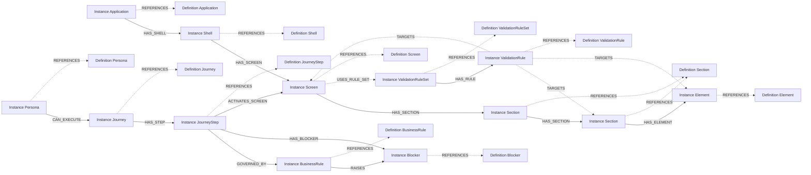

# System Graph Action Plan

## 01 Purpose

This document defines the execution plan for implementing the system graph on the existing Neo4j database server.

The target end state is:

1. create one Neo4j user database that stores the system graph
2. create the definition graph in that database
3. document the instance inventories for each object family
4. create the instance graph in that database
5. validate both graph layers
6. view the graph in Neo4j Browser

## 02 Target Deployment Model

The agreed implementation model is:

- one Neo4j database server already exists
- one Neo4j user database will be created for the system graph
- two logical graph layers will exist inside that database:
  - definition graph
  - instance graph

The built-in Neo4j `system` database is not the target for business graph storage.

### 02.01 Preview Implementation Reference

When preview screens are used as the implementation-staging source for the frontend, follow the preview implementation and promotion rule defined in:

- [00-System-Graph-Model.md](./00-System-Graph-Model.md), section `01.02 Preview Implementation And Promotion Rule`

Interpretation:

- approved preview screens should be implemented as real stack-specific frontend units
- approved screen folders should move as-is into the target EMSIST frontend location
- only outer-shell integration such as routing, imports, and app wiring may change after approval
- traceability should remain metadata-driven and must not depend on reading global style files
- current frontend application and shell baseline for the seeded graph is:
  - `APP01 = ObjectsLogic`
- current frontend shell baseline for the seeded graph is:
  - `SHL01 = login-shell`
  - `SHL02 = app-shell-layout`

### 02.02 Current Parking Onboarding Slice

The current tenant-management onboarding must proceed one screen at a time from `_parking`, normalized into the current system-graph metamodel.

Current agreed mapping:

- real authenticated shell instance remains:
  - `SHL02 = app-shell-layout`
- first tenant-management screen onboarded from parking is:
  - `SHL02.SCN02 = View Tenant List`
- implementation source for that screen is:
  - `frontend/src/app/_parking/tenant-list`
- business source for that screen is:
  - `G01.02.01.01 View Tenant List`

Interpretation:

- do not invent a separate shell instance when Angular does not provide one
- keep shell instances aligned to real Angular shell artifact names
- use `_parking` as the frontend implementation source for screen structure and preview rendering
- use `G01` as the business-intent source for screen naming, purpose, and scope

## 03 Workstreams

The plan is split into two action plans:

1. Definition Graph Action Plan
2. Instance Graph Action Plan

The definition graph must be completed first. The instance graph and its supporting instance inventories are derived after the definition graph is stable.

## 04 Definition Graph Action Plan

### 04.01 Task List

| Task ID | Task | Deliverable | Success Criteria | Closure Tests |
|---------|------|-------------|------------------|---------------|
| `DG-01` | Connect to the Neo4j database server with database-administration access. | Verified administrative connection method. | The team can open an admin session and execute database-administration commands. | Run a basic administration command successfully, such as listing databases or switching to the admin context used for database creation. |
| `DG-02` | Create the Neo4j user database for the system graph. | `01-create-system-graph-database.cypher` | The system graph database exists and is online on the server. | Execute the create-database Cypher. Confirm the new database appears in the database list and reports `online`. |
| `DG-03` | Define the logical label strategy for the definition layer. | Label and naming convention specification. | Every definition object has an agreed label pattern and the pattern does not conflict with the instance layer. | Review and approve the label map, for example `:Definition:Persona`, `:Definition:Journey`, `:Definition:JourneyStep`, `:Definition:BusinessRule`, `:Definition:Blocker`, `:Definition:Application`, `:Definition:Shell`, `:Definition:Screen`, `:Definition:Section`, `:Definition:Element`, `:Definition:ValidationRuleSet`, `:Definition:ValidationRule`. |
| `DG-04` | Normalize current objects into future definition objects. | Current-to-future object normalization table. | Every current object is classified as carry-over, decompose-and-remap, promote-to-object, or exclude-from-baseline. | Verify all current objects from the existing implementation baseline are accounted for: `Screen`, `Touchpoint`, `Interaction`, `Journey`, `JourneyStep`, plus implicit `Persona`, `BusinessRule`, `Blocker`, `Application`, `Shell`, `Screen`, `Section`, `Element`, `ValidationRuleSet`, and `ValidationRule`. Confirm `Touchpoint`, `Variant`, and `Surface` are not first-class future baseline objects in the merged model. |
| `DG-05` | Normalize shared and object-specific definition attributes. | Shared and object-specific definition attribute contract. | The shared definition attributes and required object-specific attributes are sealed and applied consistently to all definition objects. | Confirm the shared attribute set is exactly: `name`, `description`, `id`, `hierarchy_code`, `status`, `domain`. Confirm the required object-specific set covers at minimum: `step_order`, `execution_method`, `rule_scope`, `condition_expression`, `execution_effect`, `blocker_type`, `blocking_effect`, `section_type`, `repeatable`, `render_mode`, `default_state`, `control_source`, `element_type`, `semantic_level`, `rule_set_type`, `rule_set_scope`, `action_type`, `action_value`, `priority`, `stop_processing`. Confirm preview-only wiring such as DOM refs and render ordering remains outside the canonical graph as frontend-local implementation metadata. Confirm legacy IDs such as `touchpointId`, `variantId`, `surfaceId`, `journeyId`, and `personaId` are treated only as mapping references where needed. |
| `DG-06` | Normalize definition relationships and structural modeling rules. | Sealed definition relationship matrix and structural-rule contract. | Every allowed definition relationship has source object, target object, direction, and cardinality, and the structural rules for shells, screens, sections, and elements are sealed. | Confirm the matrix covers at minimum: `Persona -> CAN_EXECUTE -> Journey`, `Journey -> HAS_STEP -> JourneyStep`, `JourneyStep -> GOVERNED_BY -> BusinessRule`, `JourneyStep -> HAS_BLOCKER -> Blocker`, `BusinessRule -> RAISES -> Blocker`, `JourneyStep -> ACTIVATES_SCREEN -> Screen`, `Application -> HAS_SHELL -> Shell`, `Shell -> HAS_SCREEN -> Screen`, `Screen -> HAS_SECTION -> Section`, `Section -> HAS_SECTION -> Section`, `Section -> HAS_ELEMENT -> Element`, `Screen -> USES_RULE_SET -> ValidationRuleSet`, `ValidationRuleSet -> HAS_RULE -> ValidationRule`, and `ValidationRule -> TARGETS -> Screen|Section|Element`. Confirm the structural rules are sealed, including: application contains shells only, shell contains screens only, screen contains sections only, element is a leaf, section must not mix child sections and elements at the same level, and non-repeatable single-child sections should be flattened. |
| `DG-07` | Create the definition schema Cypher. | `02-definition-graph-schema.cypher` | Constraints and indexes exist for the definition layer. | Execute the schema Cypher successfully. Confirm required constraints and indexes exist for definition labels and key properties such as `id` and `hierarchy_code`. |
| `DG-08` | Create the definition data Cypher. | `03-definition-graph-data.cypher` | Canonical definition nodes and relationships can be loaded into the system graph database. | Execute the definition data Cypher successfully. Confirm sample or initial canonical nodes exist for all required object families: `Persona`, `Journey`, `JourneyStep`, `BusinessRule`, `Blocker`, `Application`, `Shell`, `Screen`, `Section`, `Element`, `ValidationRuleSet`, and `ValidationRule`. |
| `DG-09` | Validate the loaded definition graph. | `06-validation-queries.cypher` definition section. | The definition graph is internally valid and queryable. | Run validation queries that confirm: no duplicate `id`, no duplicate `hierarchy_code` where uniqueness is required, no missing required relationships, no orphan definitions for required baseline objects, no `Application` without shells where shells are required, no `Shell` without screens where screens are required, no `Screen` without sections where sections are required, and no `Element` with illegal outgoing structural child relationships. |
| `DG-10` | View the definition graph in Neo4j Browser. | `07-browser-view-queries.cypher` definition section. | The definition graph can be rendered clearly in Neo4j Browser. | Execute a Browser query that returns the definition graph with labels and relationships visible and understandable by the architecture team. |

### 04.02 Definition Graph Closure Criteria

The definition graph plan is closed only when:

1. the system graph database exists and is online
2. definition schema Cypher executes without error
3. definition data Cypher executes without error
4. all required definition objects exist
5. all sealed definition relationships exist
6. the structural modeling rules for `Shell`, `Screen`, `Section`, and `Element` are reflected in the definition-layer contract and validation queries
7. Neo4j Browser can render the definition graph correctly

## 05 Instance Graph Action Plan

### 05.01 Target Instance Graph Shape

The instance graph must realize the same merged object model as the definition graph, but with source-scoped instance records that reference their canonical definitions.

Required interpretation:

- every instance family from `Application` toward `Element`, alongside `Persona`, `Journey`, `BusinessRule`, `Blocker`, `ValidationRuleSet`, and `ValidationRule`, must be documented in an instance inventory before or alongside graph loading
- every instance node must reference exactly one canonical definition node of the correct object family
- the instance layer must preserve the structural modeling rules that apply to `Shell`, `Screen`, `Section`, and `Element`

### 05.02 Task List

| Task ID | Task | Deliverable | Success Criteria | Closure Tests |
|---------|------|-------------|------------------|---------------|
| `IG-01` | Define the logical label strategy for the instance layer. | Label and naming convention specification. | Every instance object has an agreed label pattern that is separated from the definition layer. | Review and approve the label map, for example `:Instance:Application`, `:Instance:Persona`, `:Instance:Journey`, `:Instance:JourneyStep`, `:Instance:BusinessRule`, `:Instance:Blocker`, `:Instance:Shell`, `:Instance:Screen`, `:Instance:Section`, `:Instance:Element`, `:Instance:ValidationRuleSet`, `:Instance:ValidationRule`. |
| `IG-02` | Define the instance reference model back to definitions. | Instance-to-definition reference rule. | Every instance object can reference exactly the intended definition object. | Confirm the reference rule is sealed, for example `(:Instance)-[:REFERENCES]->(:Definition)`, and confirm each instance type knows which definition type it may reference. |
| `IG-03` | Normalize instance-specific attributes and instance inventory fields. | Instance attribute contract and instance inventory field specification. | Instance attributes are separated cleanly from definition attributes and include only approved traceability, source, sequencing, and inventory fields. | Confirm instance records inherit the shared canonical attributes `name`, `description`, `id`, `hierarchy_code`, `status`, `domain`, and add only approved traceability and source attributes such as `local_code`, `source_artifact_code`, `source_artifact_path`, `source_section`, `sequence`, and other object-family-specific source references where required. Confirm the inventory field set can document every instance from `Application` down to `Element`, plus `Persona`, `Journey`, `BusinessRule`, `Blocker`, `ValidationRuleSet`, and `ValidationRule`. Confirm purely visual outer background settings are stored as `Shell` configuration attributes and are not loaded as structural `Section` or `Element` instance nodes. |
| `IG-04` | Define the source extraction rules and inventory templates for instance creation from requirements artifacts. | Source-to-instance extraction rules and instance inventory template. | Every instance node can be derived from requirement artifacts in a repeatable way and documented in a consistent inventory format. | Verify extraction rules and template columns exist for applications, personas, journeys, journey steps, business rules, blockers, shells, screens, sections, elements, validation-rule sets, and validation rules from the `G01. Business Architecture` package. Confirm legacy touchpoint or variant language is treated only as traceability input when present in historical artifacts. |
| `IG-05` | Create the instance inventory lists for each object family. | Instance inventory documents or tables for `Application`, `Persona`, `Journey`, `JourneyStep`, `BusinessRule`, `Blocker`, `Shell`, `Screen`, `Section`, `Element`, `ValidationRuleSet`, and `ValidationRule`. | Every instance family has a documented inventory that can be traced to the selected G01 source artifacts before or alongside graph loading. | Confirm the inventory lists exist, are source-scoped, and cover every required object family from `Application` toward `Element`, alongside the persona, journey, business-rule, blocker, validation-rule-set, and validation-rule instances. Confirm each inventory record can map to one intended canonical definition. |
| `IG-06` | Create the instance schema Cypher. | `04-instance-graph-schema.cypher` | Constraints and indexes exist for the instance layer and for instance-to-definition references. | Execute the schema Cypher successfully. Confirm required constraints and indexes exist for instance labels and key properties such as `id`, `hierarchy_code`, and any approved local traceability keys. |
| `IG-07` | Create the instance data Cypher. | `05-instance-graph-data.cypher` | Source-scoped instance nodes and relationships can be loaded into the system graph database. | Execute the instance data Cypher successfully. Confirm sample or initial instance nodes exist for all required object families derived from the selected G01 artifacts: `Application`, `Persona`, `Journey`, `JourneyStep`, `BusinessRule`, `Blocker`, `Shell`, `Screen`, `Section`, `Element`, `ValidationRuleSet`, and `ValidationRule`. Confirm the loaded population matches the approved instance inventory lists. |
| `IG-08` | Create instance-to-instance relationships. | Instance relationship section in `05-instance-graph-data.cypher`. | Instance relationships reflect source-scoped business usage without redefining the canonical definition model. | Confirm required instance relationships exist for the selected artifacts and align to the approved relationship structure, including at minimum: `Application -> HAS_SHELL -> Shell`, `Journey -> HAS_STEP -> JourneyStep`, `JourneyStep -> GOVERNED_BY -> BusinessRule`, `JourneyStep -> HAS_BLOCKER -> Blocker`, `BusinessRule -> RAISES -> Blocker`, `JourneyStep -> ACTIVATES_SCREEN -> Screen`, `Shell -> HAS_SCREEN -> Screen`, `Screen -> HAS_SECTION -> Section`, `Section -> HAS_SECTION -> Section`, `Section -> HAS_ELEMENT -> Element`, `Screen -> USES_RULE_SET -> ValidationRuleSet`, `ValidationRuleSet -> HAS_RULE -> ValidationRule`, and `ValidationRule -> TARGETS -> Screen|Section|Element`. |
| `IG-09` | Validate instance-to-definition references. | `06-validation-queries.cypher` instance section. | Every instance references the correct definition and no orphan instance remains. | Run validation queries that confirm: every instance has exactly one definition reference where required, no orphan instances exist, and no definition reference points to the wrong object family. |
| `IG-10` | Validate the loaded instance graph and inventory alignment. | Validation report. | The instance graph is internally valid, traceable back to definitions, and reconciled with the documented instance inventories. | Run validation queries that confirm: no duplicate instance `id`, no invalid local-code collisions within the same artifact scope, no missing required source metadata, no broken instance relationships, no structural violations such as an instance `Shell` directly owning instance `Element` nodes or an instance `Screen` directly owning instance `Element` nodes, and no discrepancy between the approved inventory lists and the loaded instance population. |
| `IG-11` | View the combined graph in Neo4j Browser. | `07-browser-view-queries.cypher` combined section. | Definition and instance layers can be visualized together in Neo4j Browser. | Execute Browser queries that render: definition-only, instance-only, and `Instance -> REFERENCES -> Definition` traceability views. |

### 05.03 Instance Graph Closure Criteria

The instance graph plan is closed only when:

1. instance schema Cypher executes without error
2. instance data Cypher executes without error
3. the instance inventory lists exist for every required object family
4. every required instance references its correct definition
5. source-specific local codes are traceable to canonical definitions
6. the approved inventory lists reconcile with the loaded instance population
7. Neo4j Browser can render the traceability view correctly

## 06 Required Cypher Deliverables

The minimum Cypher deliverables are:

1. `01-create-system-graph-database.cypher`
2. `02-definition-graph-schema.cypher`
3. `03-definition-graph-data.cypher`
4. `04-instance-graph-schema.cypher`
5. `05-instance-graph-data.cypher`
6. `06-validation-queries.cypher`
7. `07-browser-view-queries.cypher`

## 07 Final Closure Tests

The full plan is closed only when all of the following tests pass:

1. the Neo4j server contains the system graph user database and it is online
2. the definition graph schema and data scripts execute successfully
3. the instance graph schema and data scripts execute successfully
4. definition objects can be queried independently
5. instance objects can be queried independently
6. instance inventories exist for every required object family from `Application` toward `Element`, alongside `Persona`, `Journey`, `BusinessRule`, `Blocker`, `ValidationRuleSet`, and `ValidationRule`
7. instance objects can traverse to their definitions through the approved reference relationship
8. no orphan definitions exist for the required seeded baseline
9. no orphan instances exist in the loaded artifact scope
10. Neo4j Browser can render:
   - definition graph view
   - instance graph view
   - definition-instance traceability view

## 08 Recommended Execution Order

1. `DG-01` to `DG-10`
2. `IG-01` to `IG-11`
3. `07 Final Closure Tests`
