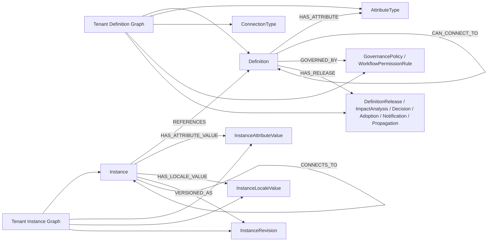

# Tenant Manager Neo4j Database

**Track:** R02. TENANT MANAGEMENT  
**Technology:** Neo4j  
**Status:** MVP Review Ready  
**Supports:** `G01.03.09 Manage Tenant Master Definitions`

---

## 1. Purpose

This document defines the **tenant-specific Neo4j graph model** provisioned for one tenant after tenant creation.

It contains the tenant definition graph and the tenant instance graph used by the tenant studio workspace and master-definitions management.

Operational CRUD, review, release orchestration, notification, and propagation support around these graphs is modeled in `Tenant Manager PostgreSQL Database.md`.

## 2. Mermaid Review Model

This diagram is the compressed review view of the tenant graph model.

### 2.1 Graph Relationship View

---

## 3. Tenant Definition Graph Data Model

The tenant definition graph is the graph model for tenant-scoped master definitions.

It is the graph behind the tenant `Studio` workspace and `Manage Tenant Master Definitions`.

### 3.1 Definition Graph Node Families

| Node Family | Purpose | Key properties |
|-------------|---------|----------------|
| `Definition` | Canonical tenant definition record | `uuid`, `name`, `definition_key`, `description`, `status`, `code` |
| `AttributeType` | Reusable attribute definition | `uuid`, `attribute_key`, `name`, `data_type`, `required`, `group` |
| `ConnectionType` | Reusable definition-to-definition relationship rule | `uuid`, `active_name`, `passive_name`, `cardinality`, `direction` |
| `GovernancePolicy` | Governance and workflow settings for a definition | `uuid`, `workflow_name`, `approval_mode`, `mandate_flag`, `override_policy` |
| `WorkflowPermissionRule` | Governance participant, permission, and decision matrix row | `uuid`, `participant_scope`, `operation_key`, `decision_action`, `permission_mode` |
| `MaturityProfile` | Maturity scoring configuration | `uuid`, `completeness_weight`, `compliance_weight`, `relationship_weight`, `freshness_weight`, `score` |
| `DefinitionLocaleValue` | Localized values for a definition | `locale_code`, `label`, `description`, `help_text` |
| `DefinitionRelease` | Released version/package of one or more definitions | `release_id`, `version_label`, `status`, `published_at`, `release_notes` |
| `ImpactAnalysisSnapshot` | Stored impact-analysis result for a pending or published release | `analysis_id`, `summary`, `conflict_count`, `affected_definition_count`, `affected_instance_count`, `severity` |
| `ReleaseDecision` | Explicit publish, accept, reject, or defer decision record | `decision_id`, `decision_type`, `reason`, `decided_at`, `decided_by` |
| `ReleaseAdoptionState` | Tenant adoption and review state for a release | `adoption_id`, `tenant_scope`, `adoption_status`, `review_due_at`, `last_changed_at` |
| `ReleaseNotification` | Notification entry for a release | `notification_id`, `release_id`, `read_status`, `created_at` |
| `PropagationPackage` | Master-to-child propagation package | `batch_id`, `target_scope`, `mandate_flag`, `override_policy`, `status` |

#### 3.1.1 Definition Graph Node Contracts

| Node Family | Node Grain | Main Uniqueness / Alternate Key | Main Write Pattern | Main Read Pattern |
|-------------|------------|---------------------------------|--------------------|-------------------|
| `Definition` | One canonical definition object | `definition_key` and business `code` | Create/update through studio definition management | Definition list, fact sheet, release impact analysis |
| `AttributeType` | One reusable attribute design | `attribute_key` within the tenant definition workspace | Create/update as part of attribute design | Definition attribute tab, form generation |
| `ConnectionType` | One reusable edge rule | (`active_name`, `passive_name`, `direction`) within the workspace | Create/update when connection rules change | Connection designer, instance validation |
| `GovernancePolicy` | One governance rule set | Policy name or workflow key | Create/update by governance administrators | Governance review, publish/release gating |
| `WorkflowPermissionRule` | One permission rule in one governance workflow | (`workflow_name`, `participant_scope`, `operation_key`, `decision_action`) | Create/update when workflow settings change | Governance workflow settings, permission matrix review |
| `MaturityProfile` | One scoring profile | Profile name or scoring profile key | Create/update by maturity governance | Maturity dashboard, scoring runs |
| `DefinitionLocaleValue` | One localized value for one definition and locale | (`definition_uuid`, `locale_code`) | Insert/update during locale editing | Locale tab, localized rendering |
| `DefinitionRelease` | One release snapshot or version package | `version_label` within the release stream | Append per release action; update state during approval/publish | Release dashboard, release history |
| `ImpactAnalysisSnapshot` | One impact-analysis run for one release candidate or release | `analysis_id` | Append per impact-analysis execution | Impact-analysis dialog, release review |
| `ReleaseDecision` | One explicit decision action on one release | `decision_id` | Append per publish, accept, reject, or defer action | Release action dialog, decision audit |
| `ReleaseAdoptionState` | One tenant adoption state for one release | (`release_id`, `tenant_scope`) | Insert/update when tenant review state changes | Release dashboard, adoption tracker |
| `ReleaseNotification` | One release notification event | `notification_id` | Append on release emission | Notification center, unread counters |
| `PropagationPackage` | One release propagation batch | `batch_id` | Append per propagation action; update as it progresses | Propagation wizard, propagation monitoring |

### 3.2 Definition Graph Relationships

| From Node | Relationship | To Node | Cardinality | Meaning |
|-----------|--------------|---------|-------------|---------|
| `Definition` | `HAS_ATTRIBUTE` | `AttributeType` | `1:N` | Definition uses one or more attribute types |
| `Definition` | `CAN_CONNECT_TO` | `Definition` | `N:N` | Definition can connect to another definition |
| `Definition` | `GOVERNED_BY` | `GovernancePolicy` | `N:1` | Definition follows one governance policy |
| `GovernancePolicy` | `HAS_PERMISSION_RULE` | `WorkflowPermissionRule` | `1:N` | Governance policy declares workflow participants and permissions |
| `Definition` | `SCORED_BY` | `MaturityProfile` | `N:1` | Definition uses one maturity profile |
| `Definition` | `HAS_LOCALE_VALUE` | `DefinitionLocaleValue` | `1:N` | Definition has locale-specific values |
| `Definition` | `HAS_RELEASE` | `DefinitionRelease` | `1:N` | Definition participates in one or more releases |
| `DefinitionRelease` | `HAS_IMPACT_ANALYSIS` | `ImpactAnalysisSnapshot` | `0:N` | Release may have one or more impact-analysis runs |
| `DefinitionRelease` | `HAS_DECISION` | `ReleaseDecision` | `0:N` | Release collects publish/review decisions |
| `DefinitionRelease` | `HAS_ADOPTION_STATE` | `ReleaseAdoptionState` | `0:N` | Release tracks tenant adoption and review status |
| `DefinitionRelease` | `EMITS` | `ReleaseNotification` | `1:N` | Release produces notifications |
| `DefinitionRelease` | `PROPAGATES_AS` | `PropagationPackage` | `0:N` | Release may be propagated to child tenants |

Notes:

- `ConnectionType` is modeled as relationship metadata for definition-to-definition edges.
- impact analysis and release review are derived from traversing `Definition`, `DefinitionRelease`, and downstream instance references.

#### 3.2.1 Definition Relationship Contracts

| Relationship | Relationship Grain | Validation Rule | Used By |
|--------------|--------------------|-----------------|---------|
| `HAS_ATTRIBUTE` | One edge from a definition to one attribute type | Attribute key must be valid for the parent definition | Attributes tab, instance form generation |
| `CAN_CONNECT_TO` | One allowed connection rule between two definitions | Direction and cardinality must match the declared connection type | Connections tab, instance graph validation |
| `GOVERNED_BY` | One governance-policy binding | Exactly one active governance policy should apply at a time | Governance tab, release workflow |
| `HAS_PERMISSION_RULE` | One workflow-permission edge from a governance policy to one permission rule | Participant scope and operation key must be valid within the policy | Governance workflow settings, permission matrix |
| `SCORED_BY` | One maturity-profile binding | One active maturity profile should be in effect | Maturity scoring and dashboard |
| `HAS_LOCALE_VALUE` | One localized value edge per locale | At most one active locale node per definition and locale | Locale management |
| `HAS_RELEASE` | One release membership edge | Released snapshot must reference an existing definition revision set | Release dashboard, impact analysis |
| `HAS_IMPACT_ANALYSIS` | One impact-analysis edge | Impact analysis must reference an existing release candidate or release | Impact-analysis dialog, release review |
| `HAS_DECISION` | One decision edge | Decision type must be valid for the release state and capture actor and time | Publish / accept / reject / defer actions |
| `HAS_ADOPTION_STATE` | One tenant-adoption edge | One active adoption state per tenant scope and release | Release dashboard, adoption tracker |
| `EMITS` | One notification emitted by a release | Notification cannot exist without parent release | Notification center |
| `PROPAGATES_AS` | One propagation batch created from a release | Propagation package must reference exactly one release | Propagation wizard and downstream sync |

---

## 4. Tenant Instance Graph Data Model

The tenant instance graph is the graph model for tenant-scoped instances created from tenant definitions.

### 4.1 Instance Graph Node Families

| Node Family | Purpose | Key properties |
|-------------|---------|----------------|
| `Instance` | Concrete tenant instance created from a definition | `uuid`, `name`, `status`, `definition_uuid`, `created_at`, `updated_at` |
| `InstanceAttributeValue` | Typed value attached to an instance attribute | `attribute_uuid`, `value_type`, `value_text`, `value_number`, `value_boolean`, `value_date` |
| `InstanceLocaleValue` | Localized display values for an instance | `locale_code`, `label`, `description` |
| `InstanceRevision` | Revision/snapshot of an instance | `revision_id`, `change_summary`, `effective_at`, `release_ref` |

#### 4.1.1 Instance Graph Node Contracts

| Node Family | Node Grain | Main Uniqueness / Alternate Key | Main Write Pattern | Main Read Pattern |
|-------------|------------|---------------------------------|--------------------|-------------------|
| `Instance` | One tenant object instance | `uuid`; business uniqueness depends on the referenced definition rules | Create/update/archive through tenant operational workspace | Instance list, instance fact sheet, impact analysis |
| `InstanceAttributeValue` | One effective value of one instance attribute | (`instance_uuid`, `attribute_uuid`) for current effective values | Insert/update as instance attributes change | Instance detail, validation, reporting |
| `InstanceLocaleValue` | One localized display value of one instance in one locale | (`instance_uuid`, `locale_code`) | Insert/update during locale editing | Localized instance display |
| `InstanceRevision` | One saved revision or version event of one instance | `revision_id`; optionally sequence by instance | Append per revision action | Revision history, rollback/review |

### 4.2 Instance Graph Relationships

| From Node | Relationship | To Node | Cardinality | Meaning |
|-----------|--------------|---------|-------------|---------|
| `Instance` | `REFERENCES` | `Definition` | `N:1` | Instance is created from one definition |
| `Instance` | `HAS_ATTRIBUTE_VALUE` | `InstanceAttributeValue` | `1:N` | Instance carries attribute values |
| `Instance` | `CONNECTS_TO` | `Instance` | `N:N` | Instance links to other instances using allowed connection rules |
| `Instance` | `HAS_LOCALE_VALUE` | `InstanceLocaleValue` | `1:N` | Instance has localized display values |
| `Instance` | `VERSIONED_AS` | `InstanceRevision` | `1:N` | Instance keeps revision history |

Notes:

- the instance graph depends on the definition graph; instances are not created without a referenced definition
- release impact on instances is derived from `Instance -> REFERENCES -> Definition` traversals
- the tenant instance graph is tenant-local; it does not carry the platform tenant registry record

#### 4.2.1 Instance Relationship Contracts

| Relationship | Relationship Grain | Validation Rule | Used By |
|--------------|--------------------|-----------------|---------|
| `REFERENCES` | One edge from an instance to one definition | Every instance must reference exactly one definition | Instance creation, release impact analysis |
| `HAS_ATTRIBUTE_VALUE` | One edge from an instance to one attribute-value node | Attribute node must map to an attribute allowed by the referenced definition | Instance detail, validation, reporting |
| `CONNECTS_TO` | One business connection between two instances | Connection must be permitted by the referenced definition connection rules | Instance workspace, graph traversal |
| `HAS_LOCALE_VALUE` | One edge from an instance to one locale-value node | Locale must be active in the tenant locale set | Localized runtime display |
| `VERSIONED_AS` | One edge from an instance to one revision node | Revision cannot exist without parent instance | Revision history, rollback and audit |

---

## 5. MVP Final Review Traceability

| G01.03 area | Backing model in this document | MVP review status |
|-------------|--------------------------------|-------------------|
| `G01.03.09 Manage Tenant Master Definitions` | Sections `3` and `4`, including governance workflow rules, release decisions, impact analysis, adoption tracking, notifications, propagation, and instance traceability | `Ready` |

Notes:

- `G01.03.06 Manage Tenant Agents` is intentionally excluded from the MVP final-review baseline
- tenant operational relational data is defined in `Tenant Manager PostgreSQL Database.md`
