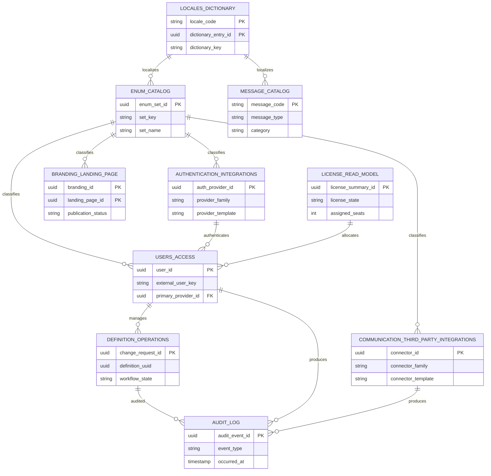
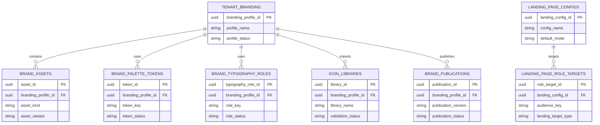
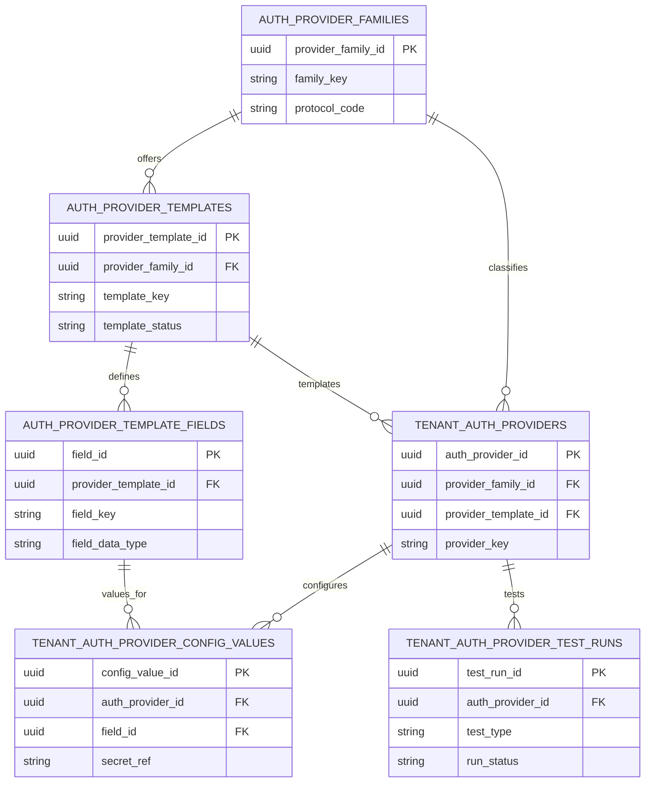
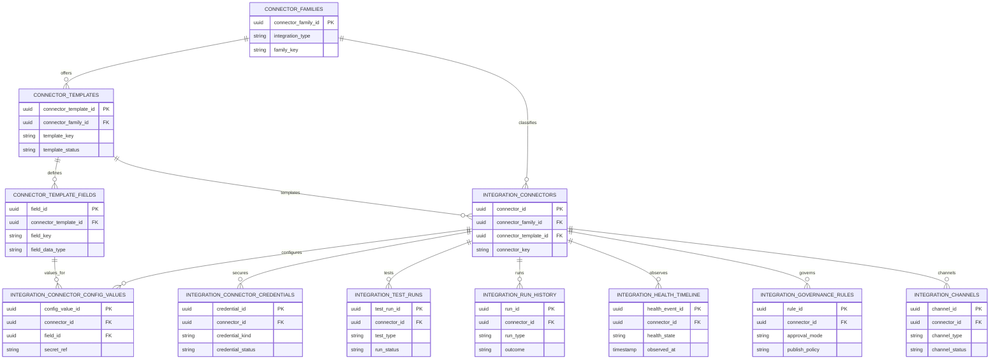
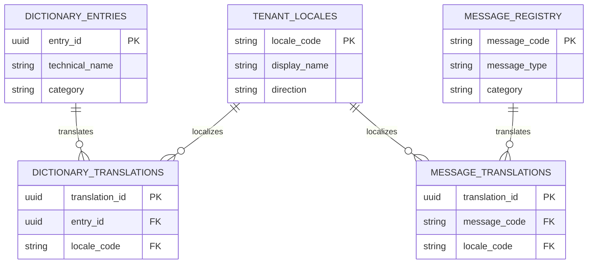
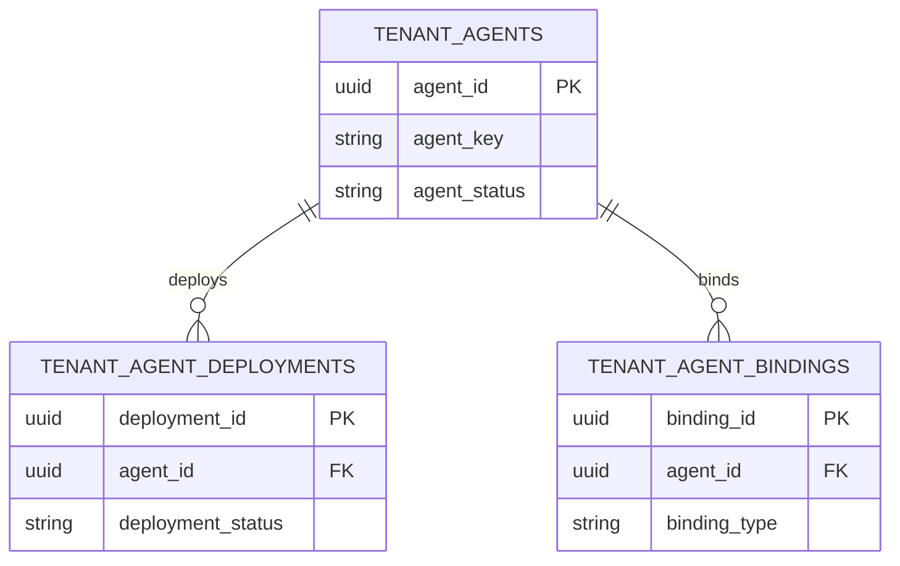
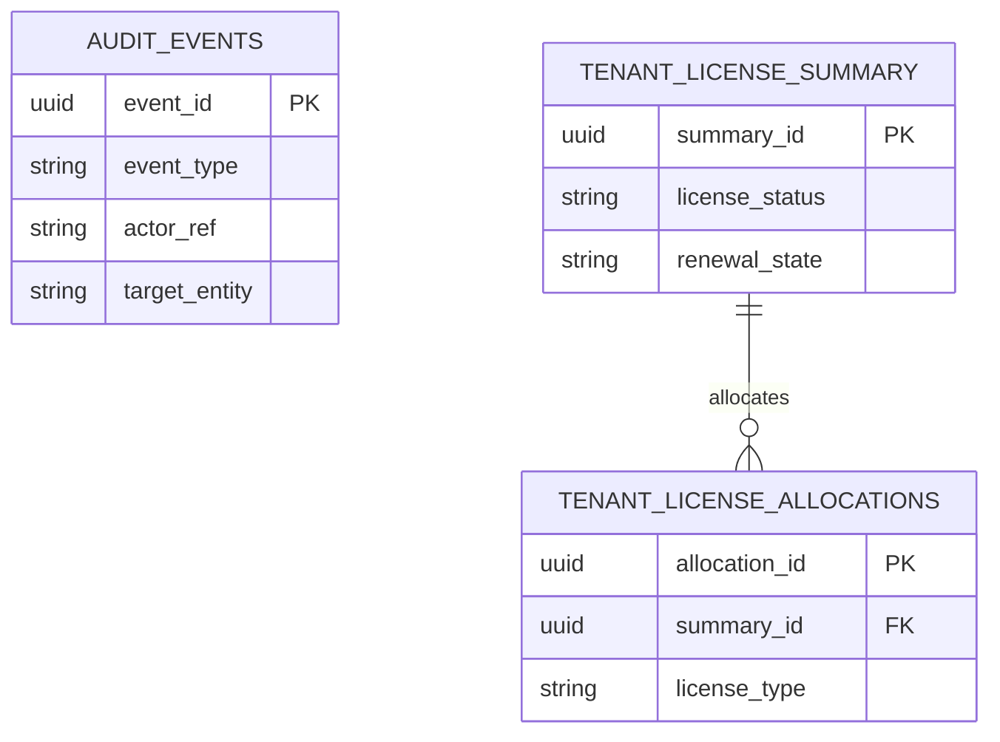

# Tenant Manager PostgreSQL Database

**Track:** R02. TENANT MANAGEMENT  
**Technology:** PostgreSQL  
**Status:** MVP Review Ready  
**Supports:** `G01.03 Tenant Fact Sheet`

---

## 1. Purpose

This document defines the **tenant-specific PostgreSQL data model** provisioned for one tenant after tenant creation.

It is the relational part of the tenant manager scope and backs the tenant fact-sheet areas that persist structured tenant data and read models.

## 2. Mermaid ERD Review Model

This section provides both Mermaid ERD views:

- summary ERD for subject-area review
- detailed ERD for table-level review

### 2.1 Summary ERD

### 2.2 Detailed ERD

The detailed ERD is split into domain views so the full model remains reviewable. Together, these diagrams cover all persisted PostgreSQL tables in this document.

#### 2.2.1 Shared Catalog and Users Access ERD

```mermaid
erDiagram
    ENUM_SETS {
        uuid enum_set_id PK
        string set_key
        string set_name
    }
    ENUM_VALUES {
        uuid enum_value_id PK
        uuid enum_set_id FK
        int value_code
        string technical_name
    }
    ENUM_VALUE_TRANSLATIONS {
        uuid translation_id PK
        uuid enum_value_id FK
        string locale_code FK
    }
    TENANT_LOCALES {
        string locale_code PK
        string display_name
        string direction
    }
    TENANT_USERS {
        uuid user_id PK
        string external_user_key
        string primary_email
        uuid primary_provider_id FK
    }
    TENANT_USER_SESSIONS {
        uuid session_id PK
        uuid user_id FK
        string session_status
    }
    TENANT_USER_AUTH_LINKS {
        uuid auth_link_id PK
        uuid user_id FK
        uuid auth_provider_id FK
        string link_status
    }
    TENANT_USER_ROLE_ASSIGNMENTS {
        uuid assignment_id PK
        uuid user_id FK
        string role_code
        string assignment_status
    }
    TENANT_GROUPS {
        uuid group_id PK
        string group_key
        string group_status
    }
    TENANT_GROUP_MEMBERSHIPS {
        uuid membership_id PK
        uuid group_id FK
        uuid user_id FK
        string membership_status
    }
    TENANT_SESSION_CONFIG {
        uuid session_config_id PK
        string idle_timeout_minutes
        string max_session_minutes
    }
    TENANT_MFA_CONFIG {
        uuid mfa_config_id PK
        string enforcement_mode
        string default_method
    }
    ORGANIZATION_UNITS {
        uuid unit_id PK
        string unit_key
        string unit_type
    }
    USER_ORGANIZATION_ASSIGNMENTS {
        uuid assignment_id PK
        uuid user_id FK
        uuid unit_id FK
        string job_title
    }
    USER_REPORTING_LINES {
        uuid reporting_line_id PK
        uuid user_id FK
        uuid manager_user_id FK
        string relationship_type
    }
    TENANT_GROUP_ACCESS_SCOPES {
        uuid access_scope_id PK
        uuid group_id FK
        string scope_ref
        string access_mode
    }
    TENANT_USER_ACCESS_ALLOW_RULES {
        uuid allow_rule_id PK
        uuid user_id FK
        string scope_ref
        string rule_status
    }
    TENANT_USER_ACCESS_BLOCK_RULES {
        uuid block_rule_id PK
        uuid user_id FK
        string scope_ref
        string rule_status
    }
    TENANT_USER_EFFECTIVE_ACCESS_SNAPSHOTS {
        uuid snapshot_id PK
        uuid user_id FK
        string access_summary
        timestamp calculated_at
    }
    TENANT_AUTH_PROVIDERS {
        uuid auth_provider_id PK
        string provider_key
        string provider_status
    }

    ENUM_SETS ||--o{ ENUM_VALUES : contains
    ENUM_VALUES ||--o{ ENUM_VALUE_TRANSLATIONS : localizes
    TENANT_LOCALES ||--o{ ENUM_VALUE_TRANSLATIONS : enables

    TENANT_USERS ||--o{ TENANT_USER_SESSIONS : has
    TENANT_USERS ||--o{ TENANT_USER_AUTH_LINKS : has
    TENANT_AUTH_PROVIDERS ||--o{ TENANT_USER_AUTH_LINKS : authenticates
    TENANT_USERS ||--o{ TENANT_USER_ROLE_ASSIGNMENTS : receives
    TENANT_GROUPS ||--o{ TENANT_GROUP_MEMBERSHIPS : has
    TENANT_USERS ||--o{ TENANT_GROUP_MEMBERSHIPS : joins
    ORGANIZATION_UNITS ||--o{ USER_ORGANIZATION_ASSIGNMENTS : groups
    TENANT_USERS ||--o{ USER_ORGANIZATION_ASSIGNMENTS : belongs_to
    TENANT_USERS ||--o{ USER_REPORTING_LINES : reports_as_user
    TENANT_USERS ||--o{ USER_REPORTING_LINES : reports_to_manager
    TENANT_GROUPS ||--o{ TENANT_GROUP_ACCESS_SCOPES : grants
    TENANT_USERS ||--o{ TENANT_USER_ACCESS_ALLOW_RULES : allows
    TENANT_USERS ||--o{ TENANT_USER_ACCESS_BLOCK_RULES : blocks
    TENANT_USERS ||--o{ TENANT_USER_EFFECTIVE_ACCESS_SNAPSHOTS : snapshots
```

#### 2.2.2 Branding and Landing Page ERD

#### 2.2.3 Authentication Integrations ERD

#### 2.2.4 Communication and Third-Party Integrations ERD

#### 2.2.5 Dictionary and Messages ERD

#### 2.2.6 Definition Management Operational ERD

```mermaid
erDiagram
    DEFINITION_CATALOG_PROJECTION {
        uuid projection_id PK
        uuid definition_uuid
        string definition_key
        string definition_status
    }
    DEFINITION_DRAFT_SESSIONS {
        uuid draft_session_id PK
        uuid definition_uuid
        uuid opened_by FK
        string session_status
    }
    DEFINITION_CHANGE_REQUESTS {
        uuid change_request_id PK
        uuid definition_uuid
        uuid draft_session_id FK
        string request_type
        string request_status
    }
    DEFINITION_ATTRIBUTE_DRAFT_ROWS {
        uuid attribute_draft_id PK
        uuid change_request_id FK
        string attribute_key
        string operation_type
    }
    DEFINITION_CONNECTION_DRAFT_ROWS {
        uuid connection_draft_id PK
        uuid change_request_id FK
        string connection_key
        string operation_type
    }
    DEFINITION_LOCALE_WORK_ITEMS {
        uuid locale_work_item_id PK
        uuid definition_uuid
        string locale_code FK
        string work_status
    }
    DEFINITION_MATURITY_SNAPSHOTS {
        uuid snapshot_id PK
        uuid definition_uuid
        numeric overall_score
        string snapshot_status
    }
    DEFINITION_PERMISSION_MATRIX_PROJECTIONS {
        uuid permission_projection_id PK
        uuid definition_uuid
        string participant_scope
        string operation_key
    }
    DEFINITION_REVIEW_TASKS {
        uuid review_task_id PK
        uuid change_request_id FK
        uuid definition_uuid
        string task_status
    }
    DEFINITION_RELEASE_BATCHES {
        uuid release_batch_id PK
        string release_id
        string release_status
    }
    DEFINITION_IMPACT_ANALYSIS_RUNS {
        uuid impact_run_id PK
        uuid release_batch_id FK
        string run_status
    }
    DEFINITION_PROPAGATION_JOBS {
        uuid propagation_job_id PK
        uuid release_batch_id FK
        string job_status
    }
    DEFINITION_NOTIFICATION_EVENTS {
        uuid notification_event_id PK
        uuid release_batch_id FK
        string notification_type
        string notification_status
    }

    DEFINITION_CATALOG_PROJECTION ||--o{ DEFINITION_DRAFT_SESSIONS : edits
    DEFINITION_CATALOG_PROJECTION ||--o{ DEFINITION_CHANGE_REQUESTS : changes
    DEFINITION_CHANGE_REQUESTS ||--o{ DEFINITION_ATTRIBUTE_DRAFT_ROWS : drafts
    DEFINITION_CHANGE_REQUESTS ||--o{ DEFINITION_CONNECTION_DRAFT_ROWS : drafts
    DEFINITION_CATALOG_PROJECTION ||--o{ DEFINITION_LOCALE_WORK_ITEMS : localizes
    DEFINITION_CATALOG_PROJECTION ||--o{ DEFINITION_MATURITY_SNAPSHOTS : scores
    DEFINITION_CATALOG_PROJECTION ||--o{ DEFINITION_PERMISSION_MATRIX_PROJECTIONS : authorizes
    DEFINITION_CATALOG_PROJECTION ||--o{ DEFINITION_REVIEW_TASKS : reviews
    DEFINITION_CATALOG_PROJECTION ||--o{ DEFINITION_RELEASE_BATCHES : releases
    DEFINITION_RELEASE_BATCHES ||--o{ DEFINITION_IMPACT_ANALYSIS_RUNS : analyzes
    DEFINITION_RELEASE_BATCHES ||--o{ DEFINITION_PROPAGATION_JOBS : propagates
    DEFINITION_RELEASE_BATCHES ||--o{ DEFINITION_NOTIFICATION_EVENTS : notifies
```

#### 2.2.7 Agents ERD

#### 2.2.8 Audit and License Read-Model ERD

---

## 3. Tenant PostgreSQL Database Data Model

The tenant PostgreSQL database holds the tenant-scoped relational data model.

It does not store the platform tenant registry record.

### 3.1 Logical Subject Areas

| Subject Area | Logical Tables | Purpose | Requirement / code alignment |
|--------------|----------------|---------|------------------------------|
| Shared enum catalog | `enum_sets`, `enum_values`, `enum_value_translations` | Reusable multilingual catalog for business-facing coded values such as statuses, types, modes, and lifecycle states | Cross-cutting support for translated requirement values across tenant modules |
| Users and access | `tenant_users`, `tenant_user_sessions`, `tenant_user_auth_links`, `tenant_user_role_assignments`, `tenant_groups`, `tenant_group_memberships`, `tenant_session_config`, `tenant_mfa_config`, `organization_units`, `user_organization_assignments`, `user_reporting_lines`, `tenant_group_access_scopes`, `tenant_user_access_allow_rules`, `tenant_user_access_block_rules`, `tenant_user_effective_access_snapshots` | Tenant user directory, sessions, auth provenance, roles, groups, organization context, and tenant access configuration | `G01.03.02 Manage Tenant Users` |
| Branding and landing page | `tenant_branding`, `brand_assets`, `brand_palette_tokens`, `brand_typography_roles`, `icon_libraries`, `brand_publications`, `landing_page_configs`, `landing_page_role_targets` | Tenant branding workspace, publish history, and landing-page configuration | `G01.03.03 Manage Tenant Branding`, `G01.03.10 Manage Tenant Landing Page`; current code already has `tenant_branding` |
| Integrations by type | `auth_provider_families`, `auth_provider_templates`, `auth_provider_template_fields`, `tenant_auth_providers`, `tenant_auth_provider_config_values`, `tenant_auth_provider_test_runs`, `connector_families`, `connector_templates`, `connector_template_fields`, `integration_connectors`, `integration_connector_config_values`, `integration_connector_credentials`, `integration_test_runs`, `integration_run_history`, `integration_health_timeline`, `integration_governance_rules`, `integration_channels` | One integrations domain split by business type: `Authentication`, `Communication`, and `Third Party`. Authentication integrations drive login-provider availability and sign-in policy. Communication and third-party integrations drive connector CRUD, testing, publish, runtime, and governance. | `G01.01.01 Login Scenarios`, `G01.03.04 Manage Tenant Integrations` |
| Dictionary and localization | `tenant_locales`, `dictionary_entries`, `dictionary_translations` | Active tenant locales and tenant dictionary values | `G01.03.05 Manage Tenant Dictionary`; current code already has `tenant_locales` |
| Messages | `message_registry`, `message_translations` | Tenant-visible message object catalog with English defaults and localized translations | Tenant-facing message flows; current code already has `message_registry` and `message_translation` |
| Definition management operations | `definition_catalog_projection`, `definition_draft_sessions`, `definition_change_requests`, `definition_attribute_draft_rows`, `definition_connection_draft_rows`, `definition_locale_work_items`, `definition_maturity_snapshots`, `definition_permission_matrix_projections`, `definition_review_tasks`, `definition_release_batches`, `definition_impact_analysis_runs`, `definition_propagation_jobs`, `definition_notification_events` | Operational PostgreSQL support for definition CRUD, review, release, locale work, maturity review, notifications, and propagation around the authoritative Neo4j definition graph | `G01.03.09 Manage Tenant Master Definitions` operational shell support |
| Agents | `tenant_agents`, `tenant_agent_deployments`, `tenant_agent_bindings` | Reserved future tenant-agent inventory, deployment state, and bindings | `G01.03.06 Manage Tenant Agents` is not sealed yet; excluded from MVP final review |
| Audit log | `audit_events` | Append-only audit event stream for tenant activity | `G01.03.07 View Tenant Audit Log` |
| Tenant license read model | `tenant_license_summary`, `tenant_license_allocations` | Tenant-facing summary of license assignment and seat allocation | `License Tab`; read model only, not licensing authority |

Notes:

- `Health Checks` is excluded from the persisted PostgreSQL data model because it is read at runtime from services.
- Existing code alignment is used as evidence where tables already exist, but this section defines the target tenant-scoped data model rather than only the current implementation.
- Because this is a per-tenant PostgreSQL database, tenant context is provided by the database boundary. The target model should not repeat `tenant_id` or `tenant_uuid` on every tenant-local table unless there is a specific interoperability reason.

### 3.1.1 Shared Enum Modeling Rule

Any business-facing coded value that must be translated in the product, exports, or user-facing reports must not be treated as a plain free-text `VARCHAR` or as a database-native enum type.

Use this rule:

- the business row stores a stable enum reference
- the enum catalog stores:
  - machine-friendly numeric code such as `0`, `1`, `2`, `3`
  - stable technical name such as `ACTIVE`, `SUSPENDED`, `ARCHIVED`
  - translated display values and descriptions per locale
- localized text is resolved from the enum catalog, not duplicated across business tables

Current `VARCHAR` fields in the sections below that represent business-facing statuses, types, modes, lifecycle states, or approval states should be treated as draft placeholders until they are normalized to enum references.

Technical-only codes that never need localization may remain technical strings when they are explicitly documented as technical.

### 3.1.2 Shared Enum Catalog Tables

#### 3.1.2.1 `enum_sets`

| Column | Type | Key / Rule | Purpose |
|--------|------|------------|---------|
| `enum_set_id` | `UUID` | PK | Enum-set identifier |
| `set_key` | `VARCHAR(100)` | UNIQUE NOT NULL | Stable technical key such as `tenant_status` |
| `set_name` | `VARCHAR(255)` | NOT NULL | Human-readable enum-set name |
| `set_description` | `TEXT` | NULL | Description of the business meaning of the enum family |
| `active_flag` | `BOOLEAN` | NOT NULL | Active enum-set indicator |
| `created_at` | `TIMESTAMPTZ` | NOT NULL | Creation timestamp |
| `updated_at` | `TIMESTAMPTZ` | NOT NULL | Update timestamp |

#### 3.1.2.2 `enum_values`

| Column | Type | Key / Rule | Purpose |
|--------|------|------------|---------|
| `enum_value_id` | `UUID` | PK | Enum-value identifier |
| `enum_set_id` | `UUID` | FK -> `enum_sets.enum_set_id` | Parent enum set |
| `value_code` | `INTEGER` | NOT NULL | Stable numeric code such as `0`, `1`, `2`, `3` |
| `technical_name` | `VARCHAR(100)` | NOT NULL | Stable technical value such as `ACTIVE` |
| `sort_order` | `INTEGER` | NOT NULL | Display ordering |
| `active_flag` | `BOOLEAN` | NOT NULL | Active-value indicator |
| `default_flag` | `BOOLEAN` | NOT NULL DEFAULT `false` | Default value flag when one exists |
| `created_at` | `TIMESTAMPTZ` | NOT NULL | Creation timestamp |
| `updated_at` | `TIMESTAMPTZ` | NOT NULL | Update timestamp |

#### 3.1.2.3 `enum_value_translations`

| Column | Type | Key / Rule | Purpose |
|--------|------|------------|---------|
| `translation_id` | `UUID` | PK | Translation identifier |
| `enum_value_id` | `UUID` | FK -> `enum_values.enum_value_id` | Parent enum value |
| `locale_code` | `VARCHAR(10)` | FK -> `tenant_locales.locale_code` | Target locale |
| `display_name` | `VARCHAR(255)` | NOT NULL | Localized display name |
| `description` | `TEXT` | NULL | Localized description |
| `help_text` | `TEXT` | NULL | Localized help text when required |
| `updated_at` | `TIMESTAMPTZ` | NOT NULL | Update timestamp |

Key relationships:

- `enum_sets` has many `enum_values`
- `enum_values` has many `enum_value_translations`
- business tables should reference `enum_values` rather than duplicating localized labels

### 3.2 Users and Access Tables

Enum impact:

- the following current string fields should be normalized to enum references because they are business-facing and may require localization:
  - `tenant_users.user_status`
  - `tenant_users.licensed_type`
  - `tenant_user_sessions.session_status`
  - `tenant_user_auth_links.link_status`
  - `tenant_user_auth_links.provider_status`
  - `tenant_user_role_assignments.assignment_status`
  - `tenant_groups.group_status`
  - `tenant_group_memberships.membership_status`
  - `tenant_mfa_config.default_method`
  - `organization_units.unit_type`
  - `organization_units.unit_status`
  - `user_reporting_lines.relationship_type`
  - `tenant_group_access_scopes.access_mode`
  - `tenant_group_access_scopes.grant_status`
  - `tenant_user_access_allow_rules.access_mode`
  - `tenant_user_access_allow_rules.rule_status`
  - `tenant_user_access_block_rules.access_mode`
  - `tenant_user_access_block_rules.rule_status`
- technical references such as `role_code` and `scope_ref` remain technical until separately normalized by their own catalogs

#### 3.2.1 `tenant_users`

| Column | Type | Key / Rule | Purpose |
|--------|------|------------|---------|
| `user_id` | `UUID` | PK | Internal tenant user identifier |
| `external_user_key` | `VARCHAR(255)` | UNIQUE NULL | User key from the external identity source when present |
| `display_name` | `VARCHAR(255)` | NOT NULL | User-facing name |
| `primary_email` | `VARCHAR(255)` | NOT NULL | Primary email address |
| `user_status` | `VARCHAR(30)` | NOT NULL | Current user state inside the tenant |
| `licensed_type` | `VARCHAR(20)` | NOT NULL | Tenant-scoped license type such as `ADMIN`, `USER`, or `VIEWER` |
| `primary_provider_id` | `UUID` | FK -> `tenant_auth_providers.auth_provider_id`, NULL | Primary authentication-integration link |
| `job_title` | `VARCHAR(255)` | NULL | Current user title or role label shown in summaries |
| `avatar_ref` | `TEXT` | NULL | Avatar or profile-image reference |
| `last_login_at` | `TIMESTAMPTZ` | NULL | Last successful login |
| `last_activity_at` | `TIMESTAMPTZ` | NULL | Last observed tenant activity |
| `created_at` | `TIMESTAMPTZ` | NOT NULL | Row creation timestamp |
| `updated_at` | `TIMESTAMPTZ` | NOT NULL | Row update timestamp |

#### 3.2.2 `tenant_user_sessions`

| Column | Type | Key / Rule | Purpose |
|--------|------|------------|---------|
| `session_id` | `UUID` | PK | Session identifier |
| `user_id` | `UUID` | FK -> `tenant_users.user_id` | Parent user |
| `provider_session_key` | `VARCHAR(255)` | NULL | External provider session identifier |
| `client_name` | `VARCHAR(100)` | NULL | Client or application name |
| `device_summary` | `TEXT` | NULL | Device/browser summary |
| `session_status` | `VARCHAR(20)` | NOT NULL | Session state such as active, expired, revoked |
| `issued_at` | `TIMESTAMPTZ` | NOT NULL | Session issue timestamp |
| `expires_at` | `TIMESTAMPTZ` | NOT NULL | Session expiry timestamp |
| `revoked_at` | `TIMESTAMPTZ` | NULL | Revocation timestamp |

#### 3.2.3 `tenant_user_auth_links`

| Column | Type | Key / Rule | Purpose |
|--------|------|------------|---------|
| `link_id` | `UUID` | PK | Auth-link identifier |
| `user_id` | `UUID` | FK -> `tenant_users.user_id` | Parent user |
| `auth_provider_id` | `UUID` | FK -> `tenant_auth_providers.auth_provider_id` | Linked authentication integration |
| `provider_user_key` | `VARCHAR(255)` | NOT NULL | Provider-specific user key |
| `provider_username` | `VARCHAR(255)` | NULL | Provider-facing username or login name |
| `link_status` | `VARCHAR(20)` | NOT NULL | Link state |
| `provider_status` | `VARCHAR(20)` | NULL | Current provider-side state when known |
| `is_primary` | `BOOLEAN` | NOT NULL DEFAULT `false` | Primary-provider flag |
| `profile_snapshot_json` | `JSONB` | NULL | Imported provider profile snapshot used by the fact-sheet overview |
| `provider_metadata_json` | `JSONB` | NULL | Provider-specific identity references and metadata |
| `linked_at` | `TIMESTAMPTZ` | NOT NULL | Link creation timestamp |
| `last_sync_at` | `TIMESTAMPTZ` | NULL | Last provider-profile synchronization timestamp |
| `updated_at` | `TIMESTAMPTZ` | NOT NULL | Link update timestamp |

#### 3.2.4 `tenant_user_role_assignments`

| Column | Type | Key / Rule | Purpose |
|--------|------|------------|---------|
| `assignment_id` | `UUID` | PK | Role-assignment identifier |
| `user_id` | `UUID` | FK -> `tenant_users.user_id` | Parent user |
| `role_code` | `VARCHAR(100)` | NOT NULL | Assigned role |
| `scope_type` | `VARCHAR(30)` | NOT NULL | Assignment scope type |
| `scope_ref` | `VARCHAR(255)` | NULL | Scope reference when role is constrained |
| `assignment_status` | `VARCHAR(20)` | NOT NULL | Assignment state |
| `assigned_at` | `TIMESTAMPTZ` | NOT NULL | Assignment timestamp |
| `assigned_by` | `UUID` | NULL | Actor who assigned the role |

#### 3.2.5 `tenant_groups`

| Column | Type | Key / Rule | Purpose |
|--------|------|------------|---------|
| `group_id` | `UUID` | PK | Group identifier |
| `group_name` | `VARCHAR(255)` | UNIQUE NOT NULL | Group business name |
| `description` | `TEXT` | NULL | Group description |
| `group_status` | `VARCHAR(20)` | NOT NULL | Group state |
| `created_at` | `TIMESTAMPTZ` | NOT NULL | Creation timestamp |
| `updated_at` | `TIMESTAMPTZ` | NOT NULL | Update timestamp |

#### 3.2.6 `tenant_group_memberships`

| Column | Type | Key / Rule | Purpose |
|--------|------|------------|---------|
| `membership_id` | `UUID` | PK | Membership identifier |
| `group_id` | `UUID` | FK -> `tenant_groups.group_id` | Parent group |
| `user_id` | `UUID` | FK -> `tenant_users.user_id` | Member user |
| `membership_status` | `VARCHAR(20)` | NOT NULL | Membership state |
| `joined_at` | `TIMESTAMPTZ` | NOT NULL | Join timestamp |
| `left_at` | `TIMESTAMPTZ` | NULL | Leave timestamp |

#### 3.2.7 Authentication Integration Reference

`tenant_users.primary_provider_id` and `tenant_user_auth_links.auth_provider_id` reference the authentication integrations defined in section `3.4 Integrations-by-Type Tables`.

#### 3.2.8 `tenant_session_config`

| Column | Type | Key / Rule | Purpose |
|--------|------|------------|---------|
| `session_config_id` | `UUID` | PK | Session-config row identifier |
| `access_token_lifetime_min` | `INTEGER` | NOT NULL | Access-token lifetime in minutes |
| `refresh_token_lifetime_min` | `INTEGER` | NOT NULL | Refresh-token lifetime in minutes |
| `idle_timeout_min` | `INTEGER` | NOT NULL | Idle timeout in minutes |
| `absolute_timeout_min` | `INTEGER` | NOT NULL | Absolute timeout in minutes |
| `max_concurrent_sessions` | `INTEGER` | NOT NULL | Concurrent session limit |
| `updated_at` | `TIMESTAMPTZ` | NOT NULL | Update timestamp |

#### 3.2.9 `tenant_mfa_config`

| Column | Type | Key / Rule | Purpose |
|--------|------|------------|---------|
| `mfa_config_id` | `UUID` | PK | MFA-config row identifier |
| `enabled_flag` | `BOOLEAN` | NOT NULL | MFA enablement |
| `required_flag` | `BOOLEAN` | NOT NULL | MFA requirement state |
| `allowed_methods` | `JSONB` or `TEXT[]` | NOT NULL | Allowed MFA methods |
| `default_method` | `VARCHAR(20)` | NULL | Default MFA method |
| `grace_period_days` | `INTEGER` | NOT NULL | Grace period before MFA becomes mandatory |
| `updated_at` | `TIMESTAMPTZ` | NOT NULL | Update timestamp |

#### 3.2.10 `organization_units`

| Column | Type | Key / Rule | Purpose |
|--------|------|------------|---------|
| `organization_unit_id` | `UUID` | PK | Organization-unit identifier |
| `unit_key` | `VARCHAR(255)` | UNIQUE NOT NULL | Technical organization-unit key |
| `unit_name` | `VARCHAR(255)` | NOT NULL | Business organization name |
| `parent_unit_id` | `UUID` | FK -> `organization_units.organization_unit_id`, NULL | Parent unit in the hierarchy |
| `unit_type` | `VARCHAR(50)` | NULL | Department, division, cost center, or similar organization type |
| `manager_user_id` | `UUID` | FK -> `tenant_users.user_id`, NULL | User currently managing the unit |
| `unit_status` | `VARCHAR(20)` | NOT NULL | Unit lifecycle state |
| `created_at` | `TIMESTAMPTZ` | NOT NULL | Creation timestamp |
| `updated_at` | `TIMESTAMPTZ` | NOT NULL | Update timestamp |

#### 3.2.11 `user_organization_assignments`

| Column | Type | Key / Rule | Purpose |
|--------|------|------------|---------|
| `assignment_id` | `UUID` | PK | Organization-assignment identifier |
| `user_id` | `UUID` | FK -> `tenant_users.user_id` | Assigned user |
| `organization_unit_id` | `UUID` | FK -> `organization_units.organization_unit_id` | Assigned organization unit |
| `assignment_role` | `VARCHAR(100)` | NULL | Role of the user within that unit |
| `is_primary` | `BOOLEAN` | NOT NULL DEFAULT `false` | Primary organization-context flag |
| `assignment_status` | `VARCHAR(20)` | NOT NULL | Assignment state |
| `effective_from` | `TIMESTAMPTZ` | NULL | Effective-start timestamp |
| `effective_to` | `TIMESTAMPTZ` | NULL | Effective-end timestamp |

#### 3.2.12 `user_reporting_lines`

| Column | Type | Key / Rule | Purpose |
|--------|------|------------|---------|
| `reporting_line_id` | `UUID` | PK | Reporting-line identifier |
| `user_id` | `UUID` | FK -> `tenant_users.user_id` | Reporting user |
| `manager_user_id` | `UUID` | FK -> `tenant_users.user_id` | Direct manager |
| `relationship_type` | `VARCHAR(50)` | NOT NULL | Direct, dotted-line, delegate, or similar reporting relationship |
| `line_status` | `VARCHAR(20)` | NOT NULL | Relationship state |
| `effective_from` | `TIMESTAMPTZ` | NULL | Effective-start timestamp |
| `effective_to` | `TIMESTAMPTZ` | NULL | Effective-end timestamp |

#### 3.2.13 `tenant_group_access_scopes`

| Column | Type | Key / Rule | Purpose |
|--------|------|------------|---------|
| `scope_grant_id` | `UUID` | PK | Group-scope grant identifier |
| `group_id` | `UUID` | FK -> `tenant_groups.group_id` | Parent group |
| `scope_type` | `VARCHAR(30)` | NOT NULL | Granted scope type |
| `scope_ref` | `VARCHAR(255)` | NOT NULL | Granted scope reference |
| `access_mode` | `VARCHAR(20)` | NOT NULL | Read, write, admin, execute, etc. |
| `grant_status` | `VARCHAR(20)` | NOT NULL | Grant state |
| `granted_at` | `TIMESTAMPTZ` | NOT NULL | Grant timestamp |

#### 3.2.14 `tenant_user_access_allow_rules`

| Column | Type | Key / Rule | Purpose |
|--------|------|------------|---------|
| `allow_rule_id` | `UUID` | PK | Allow-rule identifier |
| `user_id` | `UUID` | FK -> `tenant_users.user_id` | Target user |
| `scope_type` | `VARCHAR(30)` | NOT NULL | Allow-list scope type |
| `scope_ref` | `VARCHAR(255)` | NOT NULL | Allow-list scope reference |
| `access_mode` | `VARCHAR(20)` | NOT NULL | Allowed access mode |
| `rule_status` | `VARCHAR(20)` | NOT NULL | Rule state |
| `effective_from` | `TIMESTAMPTZ` | NULL | Effective-start timestamp |
| `effective_to` | `TIMESTAMPTZ` | NULL | Effective-end timestamp |

#### 3.2.15 `tenant_user_access_block_rules`

| Column | Type | Key / Rule | Purpose |
|--------|------|------------|---------|
| `block_rule_id` | `UUID` | PK | Block-rule identifier |
| `user_id` | `UUID` | FK -> `tenant_users.user_id` | Target user |
| `scope_type` | `VARCHAR(30)` | NOT NULL | Block-list scope type |
| `scope_ref` | `VARCHAR(255)` | NOT NULL | Block-list scope reference |
| `access_mode` | `VARCHAR(20)` | NOT NULL | Blocked access mode |
| `rule_status` | `VARCHAR(20)` | NOT NULL | Rule state |
| `effective_from` | `TIMESTAMPTZ` | NULL | Effective-start timestamp |
| `effective_to` | `TIMESTAMPTZ` | NULL | Effective-end timestamp |

#### 3.2.16 `tenant_user_effective_access_snapshots`

| Column | Type | Key / Rule | Purpose |
|--------|------|------------|---------|
| `snapshot_id` | `UUID` | PK | Effective-access snapshot identifier |
| `user_id` | `UUID` | FK -> `tenant_users.user_id` | Target user |
| `computed_at` | `TIMESTAMPTZ` | NOT NULL | Computation timestamp |
| `licensed_type` | `VARCHAR(20)` | NOT NULL | Effective licensed type at snapshot time |
| `granted_scopes_json` | `JSONB` | NOT NULL | Effective granted scopes after inheritance and rules |
| `blocked_scopes_json` | `JSONB` | NOT NULL | Effective blocked scopes after inheritance and rules |
| `source_summary_json` | `JSONB` | NOT NULL | Summary of roles, groups, and rule sources that produced the result |
| `is_current` | `BOOLEAN` | NOT NULL DEFAULT `true` | Current-effective-snapshot flag |

Key relationships:

- `tenant_users` has many `tenant_user_sessions`
- `tenant_users` has many `tenant_user_auth_links`
- `tenant_users` has many `tenant_user_role_assignments`
- `tenant_users` has many `tenant_group_memberships`
- `tenant_users` may belong to many `organization_units` through `user_organization_assignments`
- `tenant_users` may have one or more `user_reporting_lines`
- `tenant_groups` may expose access through `tenant_group_access_scopes`
- `tenant_users` may have many `tenant_user_access_allow_rules`
- `tenant_users` may have many `tenant_user_access_block_rules`
- `tenant_users` may have many `tenant_user_effective_access_snapshots`
- `tenant_groups` has many `tenant_group_memberships`
- `tenant_user_auth_links` references the authentication integrations defined in section `3.4`

#### 3.2.17 Users and Access Table Contracts

| Table | Record Grain | Main Uniqueness / Alternate Key | Main Write Pattern | Main Read Pattern |
|-------|--------------|---------------------------------|--------------------|-------------------|
| `tenant_users` | One row per tenant user | `external_user_key` when available; `primary_email` should be unique for active users | Created on invite/provision/import; updated on profile and status changes | User list, fact sheet, user search, license assignment checks |
| `tenant_user_sessions` | One row per issued session | `provider_session_key` when supplied by the runtime | Insert on issue; update on revoke/expire | User session tab, session monitoring, forced sign-out |
| `tenant_user_auth_links` | One row per user-provider identity link | (`user_id`, `auth_provider_id`, `provider_user_key`) | Insert on link; update on relink, provider sync, or provider drift | User identity fact sheet, authentication-integration troubleshooting, overview profile provenance |
| `tenant_user_role_assignments` | One row per role assignment within a scope | (`user_id`, `role_code`, `scope_type`, `scope_ref`) for active rows | Insert/revoke when access changes | Roles and access review, entitlement audit |
| `tenant_groups` | One row per tenant group | `group_name` | Insert/update on group management | Group list, group detail, assignment workflows |
| `tenant_group_memberships` | One row per user-group membership episode | (`group_id`, `user_id`) for active rows | Insert on join; close on leave | Group membership review, downstream access projection |
| `tenant_session_config` | One row for the tenant session policy | Singleton row per tenant database | Update-in-place on policy change | Security settings, session enforcement |
| `tenant_mfa_config` | One row for the tenant MFA policy | Singleton row per tenant database | Update-in-place on MFA policy change | MFA settings, enforcement checks |
| `organization_units` | One organization node in the tenant hierarchy | `unit_key` | Insert/update when organization structure changes | Organization tab, hierarchy rendering |
| `user_organization_assignments` | One user-to-organization assignment episode | (`user_id`, `organization_unit_id`) for active rows | Insert/update on organization placement changes | Organization tab, org-context filters |
| `user_reporting_lines` | One reporting relationship | (`user_id`, `manager_user_id`, `relationship_type`) for active rows | Insert/update when reporting lines change | Organization tab, reporting-line rendering |
| `tenant_group_access_scopes` | One group-derived scope grant | (`group_id`, `scope_type`, `scope_ref`, `access_mode`) for active rows | Insert/update on group access design changes | Roles & Access tab, effective-access computation |
| `tenant_user_access_allow_rules` | One explicit allow-list rule | (`user_id`, `scope_type`, `scope_ref`, `access_mode`) for active rows | Insert/update on exception handling | Roles & Access tab, effective-access computation |
| `tenant_user_access_block_rules` | One explicit block-list rule | (`user_id`, `scope_type`, `scope_ref`, `access_mode`) for active rows | Insert/update on restriction handling | Roles & Access tab, effective-access computation |
| `tenant_user_effective_access_snapshots` | One computed effective-access result set | One current snapshot per user at a time | Recomputed after changes to roles, groups, or rules | Roles & Access summary, fast read model |

### 3.3 Branding and Landing Page Tables

Enum impact:

- the following current string fields should be normalized to enum references where they are shown to users or managed as controlled business values:
  - `tenant_branding.branding_status`
  - `brand_assets.asset_kind`
  - `brand_assets.asset_variant`
  - `brand_assets.validation_status`
  - `brand_palette_tokens.token_role`
  - `brand_palette_tokens.token_status`
  - `brand_typography_roles.role_status`
  - `icon_libraries.source_type`
  - `icon_libraries.validation_status`
  - `brand_publications.publication_status`
  - `landing_page_configs.default_mode`
  - `landing_page_role_targets.landing_target_type`
- technical references such as `token_key`, `role_key`, and `landing_target_ref` remain technical identifiers

#### 3.3.1 `tenant_branding`

| Column | Type | Key / Rule | Purpose |
|--------|------|------------|---------|
| `branding_profile_id` | `UUID` | PK | Branding profile identifier |
| `branding_status` | `VARCHAR(20)` | NOT NULL | Draft / active / archived branding state |
| `primary_color` | `VARCHAR(20)` | NOT NULL | Primary brand color |
| `primary_color_dark` | `VARCHAR(20)` | NULL | Dark primary variant |
| `secondary_color` | `VARCHAR(20)` | NULL | Secondary brand color |
| `surface_color` | `VARCHAR(20)` | NULL | Base surface color |
| `text_color` | `VARCHAR(20)` | NULL | Base text color |
| `font_family` | `TEXT` | NULL | Active brand font family |
| `custom_css` | `TEXT` | NULL | Advanced CSS override |
| `updated_at` | `TIMESTAMPTZ` | NOT NULL | Update timestamp |

#### 3.3.2 `brand_assets`

| Column | Type | Key / Rule | Purpose |
|--------|------|------------|---------|
| `asset_id` | `UUID` | PK | Asset identifier |
| `branding_profile_id` | `UUID` | FK -> `tenant_branding.branding_profile_id` | Parent branding profile |
| `asset_kind` | `VARCHAR(50)` | NOT NULL | Asset class such as logo, background, favicon |
| `asset_variant` | `VARCHAR(50)` | NULL | Light/dark/default variant |
| `storage_ref` | `TEXT` | NOT NULL | Asset storage reference |
| `mime_type` | `VARCHAR(100)` | NOT NULL | File type |
| `validation_status` | `VARCHAR(20)` | NOT NULL | Validation state |
| `published_flag` | `BOOLEAN` | NOT NULL | Active/published indicator |
| `created_at` | `TIMESTAMPTZ` | NOT NULL | Creation timestamp |

#### 3.3.3 `brand_palette_tokens`

| Column | Type | Key / Rule | Purpose |
|--------|------|------------|---------|
| `token_id` | `UUID` | PK | Token row identifier |
| `branding_profile_id` | `UUID` | FK -> `tenant_branding.branding_profile_id` | Parent branding profile |
| `token_key` | `VARCHAR(100)` | NOT NULL | Token technical key |
| `token_role` | `VARCHAR(50)` | NOT NULL | Semantic token role |
| `token_value` | `VARCHAR(20)` | NOT NULL | Token value |
| `source_pack` | `VARCHAR(100)` | NULL | Source palette pack |
| `token_status` | `VARCHAR(20)` | NOT NULL | Token state |

#### 3.3.4 `brand_typography_roles`

| Column | Type | Key / Rule | Purpose |
|--------|------|------------|---------|
| `typography_role_id` | `UUID` | PK | Typography role row identifier |
| `branding_profile_id` | `UUID` | FK -> `tenant_branding.branding_profile_id` | Parent branding profile |
| `role_key` | `VARCHAR(100)` | NOT NULL | UI typography role key |
| `font_family` | `TEXT` | NOT NULL | Assigned font family |
| `font_color` | `VARCHAR(20)` | NULL | Assigned font color |
| `font_weight` | `VARCHAR(20)` | NULL | Assigned font weight/style |
| `role_status` | `VARCHAR(20)` | NOT NULL | Role state |

#### 3.3.5 `icon_libraries`

| Column | Type | Key / Rule | Purpose |
|--------|------|------------|---------|
| `library_id` | `UUID` | PK | Icon-library identifier |
| `branding_profile_id` | `UUID` | FK -> `tenant_branding.branding_profile_id` | Parent branding profile |
| `library_name` | `VARCHAR(255)` | NOT NULL | Library name |
| `source_type` | `VARCHAR(50)` | NOT NULL | Uploaded, imported, seeded, etc. |
| `package_ref` | `TEXT` | NOT NULL | Package or storage reference |
| `validation_status` | `VARCHAR(20)` | NOT NULL | Validation/import status |
| `active_flag` | `BOOLEAN` | NOT NULL | Active library indicator |
| `created_at` | `TIMESTAMPTZ` | NOT NULL | Creation timestamp |

#### 3.3.6 `brand_publications`

| Column | Type | Key / Rule | Purpose |
|--------|------|------------|---------|
| `publication_id` | `UUID` | PK | Publication identifier |
| `branding_profile_id` | `UUID` | FK -> `tenant_branding.branding_profile_id` | Parent branding profile |
| `publication_version` | `VARCHAR(50)` | NOT NULL | Published version label |
| `publication_status` | `VARCHAR(20)` | NOT NULL | Draft, published, rolled-back, etc. |
| `published_at` | `TIMESTAMPTZ` | NULL | Publication timestamp |
| `published_by` | `UUID` | NULL | Publishing actor |
| `rollback_of_publication_id` | `UUID` | NULL | Self-reference to rolled-back publication |
| `publication_notes` | `TEXT` | NULL | Publish or rollback notes |

#### 3.3.7 `landing_page_configs`

| Column | Type | Key / Rule | Purpose |
|--------|------|------------|---------|
| `landing_config_id` | `UUID` | PK | Landing-config identifier |
| `config_name` | `VARCHAR(255)` | NOT NULL | Configuration name |
| `default_mode` | `VARCHAR(50)` | NOT NULL | Default landing behavior |
| `published_flag` | `BOOLEAN` | NOT NULL | Published state |
| `updated_at` | `TIMESTAMPTZ` | NOT NULL | Update timestamp |

#### 3.3.8 `landing_page_role_targets`

| Column | Type | Key / Rule | Purpose |
|--------|------|------------|---------|
| `role_target_id` | `UUID` | PK | Role-target identifier |
| `landing_config_id` | `UUID` | FK -> `landing_page_configs.landing_config_id` | Parent landing configuration |
| `audience_key` | `VARCHAR(100)` | NOT NULL | Role or audience key |
| `landing_target_type` | `VARCHAR(50)` | NOT NULL | Target type such as page, dashboard, route |
| `landing_target_ref` | `VARCHAR(255)` | NOT NULL | Target reference |
| `sort_order` | `INTEGER` | NOT NULL | Display/evaluation order |
| `active_flag` | `BOOLEAN` | NOT NULL | Active target indicator |

Key relationships:

- `tenant_branding` has many `brand_assets`
- `tenant_branding` has many `brand_palette_tokens`
- `tenant_branding` has many `brand_typography_roles`
- `tenant_branding` has many `icon_libraries`
- `tenant_branding` has many `brand_publications`
- `landing_page_configs` has many `landing_page_role_targets`

#### 3.3.9 Branding and Landing Page Table Contracts

| Table | Record Grain | Main Uniqueness / Alternate Key | Main Write Pattern | Main Read Pattern |
|-------|--------------|---------------------------------|--------------------|-------------------|
| `tenant_branding` | One branding workspace profile | One active branding profile per tenant at a time | Update-in-place while editing; versioned by publication rows | Branding workspace, preview rendering |
| `brand_assets` | One uploaded or imported brand asset | (`branding_profile_id`, `asset_kind`, `asset_variant`) for active published rows | Insert on upload; supersede on replacement | Logo and imagery rendering, asset pickers |
| `brand_palette_tokens` | One semantic palette token value | (`branding_profile_id`, `token_key`) | Insert/update during palette editing | Theme generation, preview rendering, publish diff |
| `brand_typography_roles` | One typography role assignment | (`branding_profile_id`, `role_key`) | Insert/update during typography editing | Typography preview, runtime theme composition |
| `icon_libraries` | One icon source package or library | (`branding_profile_id`, `library_name`) | Insert on upload/import; update validation state | Icon picker, branding review |
| `brand_publications` | One publish or rollback event | `publication_version` within the branding profile | Append-only publication history | Publish history, rollback audit, active version lookup |
| `landing_page_configs` | One tenant landing-page configuration set | `config_name`; one published row at a time | Update draft, then publish | Landing page settings, preview, active landing routing |
| `landing_page_role_targets` | One audience-to-target mapping | (`landing_config_id`, `audience_key`, `landing_target_ref`) | Insert/update on landing-page audience rules | Role-based landing resolution |

### 3.4 Integrations-by-Type Tables

The tenant `Integrations` tab manages one integration inventory split by business type:

- `Authentication`
- `Communication`
- `Third Party`

Authentication integrations are still modeled as their own persisted subtype because they must drive:

- the login provider list exposed by `GET /api/v1/auth/providers`
- the provider identities referenced by `tenant_user_auth_links`
- sign-in enablement, ordering, and primary-login behavior

Communication and third-party integrations are modeled as connector registrations because they drive:

- connector CRUD
- fact-sheet review
- type-specific configuration
- testing
- publish lifecycle
- runtime history
- governance and channels

Enum impact:

- the following current string fields should be normalized to enum references where they represent controlled business-facing values:
  - `auth_provider_families.family_status`
  - `auth_provider_templates.template_status`
  - `tenant_auth_providers.integration_type`
  - `tenant_auth_providers.provider_status`
  - `tenant_auth_providers.publish_status`
  - `tenant_auth_provider_test_runs.test_type`
  - `tenant_auth_provider_test_runs.run_status`
  - `connector_families.integration_type`
  - `connector_families.family_status`
  - `connector_templates.template_status`
  - `integration_connectors.integration_type`
  - `integration_connectors.connector_status`
  - `integration_connectors.publish_status`
  - `integration_connector_credentials.credential_kind`
  - `integration_connector_credentials.credential_status`
  - `integration_test_runs.test_type`
  - `integration_test_runs.run_status`
  - `integration_run_history.run_type`
  - `integration_run_history.outcome`
  - `integration_health_timeline.health_state`
  - `integration_governance_rules.approval_mode`
  - `integration_governance_rules.publish_policy`
  - `integration_governance_rules.governance_status`
  - `integration_channels.channel_type`
  - `integration_channels.governance_state`
  - `integration_channels.channel_status`
- endpoint references, secret references, validation-rule references, and correlation identifiers remain technical fields

#### 3.4.1 `auth_provider_families`

| Column | Type | Key / Rule | Purpose |
|--------|------|------------|---------|
| `provider_family_id` | `UUID` | PK | Authentication-family identifier |
| `integration_type` | `VARCHAR(30)` | NOT NULL | Fixed business type `Authentication` |
| `family_key` | `VARCHAR(100)` | UNIQUE NOT NULL | Stable family key such as `LDAP`, `OIDC`, `SAML`, `OAUTH2` |
| `family_name` | `VARCHAR(255)` | NOT NULL | Human-readable family name |
| `protocol_code` | `VARCHAR(50)` | NOT NULL | Underlying protocol code used by backend logic |
| `family_status` | `VARCHAR(20)` | NOT NULL | Family availability state |
| `sort_order` | `INTEGER` | NOT NULL | Selection ordering |
| `active_flag` | `BOOLEAN` | NOT NULL | Family is available for tenant use |

#### 3.4.2 `auth_provider_templates`

| Column | Type | Key / Rule | Purpose |
|--------|------|------------|---------|
| `provider_template_id` | `UUID` | PK | Provider-template identifier |
| `provider_family_id` | `UUID` | FK -> `auth_provider_families.provider_family_id` | Parent family |
| `template_key` | `VARCHAR(100)` | UNIQUE NOT NULL | Stable template key such as `AZURE_AD`, `GOOGLE`, `MICROSOFT`, `KEYCLOAK` |
| `template_name` | `VARCHAR(255)` | NOT NULL | Business template name |
| `product_name` | `VARCHAR(255)` | NULL | Product/vendor label when applicable |
| `icon_ref` | `VARCHAR(100)` | NULL | Default icon reference |
| `default_flag` | `BOOLEAN` | NOT NULL DEFAULT `false` | Default template indicator within the family |
| `template_status` | `VARCHAR(20)` | NOT NULL | Template lifecycle state |

#### 3.4.3 `auth_provider_template_fields`

| Column | Type | Key / Rule | Purpose |
|--------|------|------------|---------|
| `field_id` | `UUID` | PK | Template-field identifier |
| `provider_template_id` | `UUID` | FK -> `auth_provider_templates.provider_template_id` | Parent template |
| `field_key` | `VARCHAR(100)` | NOT NULL | Stable technical field key |
| `field_label` | `VARCHAR(255)` | NOT NULL | User-facing field label |
| `field_data_type` | `VARCHAR(50)` | NOT NULL | Data type such as text, url, secret, boolean |
| `required_flag` | `BOOLEAN` | NOT NULL | Required-field indicator |
| `secret_flag` | `BOOLEAN` | NOT NULL | Secret-storage indicator |
| `sort_order` | `INTEGER` | NOT NULL | Form ordering |
| `validation_rule_ref` | `VARCHAR(255)` | NULL | Validation-rule reference |

#### 3.4.4 `tenant_auth_providers`

| Column | Type | Key / Rule | Purpose |
|--------|------|------------|---------|
| `auth_provider_id` | `UUID` | PK | Tenant authentication-integration identifier |
| `integration_type` | `VARCHAR(30)` | NOT NULL | Fixed business type `Authentication` |
| `provider_family_id` | `UUID` | FK -> `auth_provider_families.provider_family_id` | Selected provider family |
| `provider_template_id` | `UUID` | FK -> `auth_provider_templates.provider_template_id`, NULL | Selected provider template/product |
| `provider_key` | `VARCHAR(255)` | UNIQUE NOT NULL | Technical provider key |
| `provider_name` | `VARCHAR(255)` | NOT NULL | Business/provider name |
| `display_name` | `VARCHAR(100)` | NULL | User-facing provider label shown in login and admin UI |
| `icon_ref` | `VARCHAR(100)` | NULL | Icon reference |
| `provider_status` | `VARCHAR(30)` | NOT NULL | Draft, configured, published, archived, etc. |
| `publish_status` | `VARCHAR(30)` | NOT NULL | Publish readiness or blocked state |
| `enabled_flag` | `BOOLEAN` | NOT NULL | Provider is enabled for tenant use |
| `primary_login_flag` | `BOOLEAN` | NOT NULL | Primary login-provider flag |
| `sort_order` | `INTEGER` | NOT NULL | Display ordering for login and admin UI |
| `created_at` | `TIMESTAMPTZ` | NOT NULL | Creation timestamp |
| `updated_at` | `TIMESTAMPTZ` | NOT NULL | Update timestamp |

#### 3.4.5 `tenant_auth_provider_config_values`

| Column | Type | Key / Rule | Purpose |
|--------|------|------------|---------|
| `config_value_id` | `UUID` | PK | Provider-config value identifier |
| `auth_provider_id` | `UUID` | FK -> `tenant_auth_providers.auth_provider_id` | Parent authentication integration |
| `field_id` | `UUID` | FK -> `auth_provider_template_fields.field_id` | Configured field definition |
| `value_text` | `TEXT` | NULL | Non-secret scalar value |
| `value_json` | `JSONB` | NULL | Structured configuration value |
| `secret_ref` | `TEXT` | NULL | Secret-manager reference for sensitive values |
| `updated_at` | `TIMESTAMPTZ` | NOT NULL | Update timestamp |

#### 3.4.6 `tenant_auth_provider_test_runs`

| Column | Type | Key / Rule | Purpose |
|--------|------|------------|---------|
| `test_run_id` | `UUID` | PK | Authentication-provider test identifier |
| `auth_provider_id` | `UUID` | FK -> `tenant_auth_providers.auth_provider_id` | Parent authentication integration |
| `test_type` | `VARCHAR(50)` | NOT NULL | Discovery, bind, metadata, callback, or similar test type |
| `run_status` | `VARCHAR(20)` | NOT NULL | Success, failure, blocked, unsupported |
| `started_at` | `TIMESTAMPTZ` | NOT NULL | Test start timestamp |
| `finished_at` | `TIMESTAMPTZ` | NULL | Test completion timestamp |
| `result_summary` | `TEXT` | NULL | Human-readable result summary |
| `error_code` | `VARCHAR(50)` | NULL | Failure code when applicable |

#### 3.4.7 `connector_families`

| Column | Type | Key / Rule | Purpose |
|--------|------|------------|---------|
| `connector_family_id` | `UUID` | PK | Connector-family identifier |
| `integration_type` | `VARCHAR(30)` | NOT NULL | Business type such as `Communication` or `Third Party` |
| `family_key` | `VARCHAR(100)` | UNIQUE NOT NULL | Stable family key such as `SMTP`, `PUSH`, `SCIM`, `MCP` |
| `family_name` | `VARCHAR(255)` | NOT NULL | Human-readable family name |
| `family_status` | `VARCHAR(20)` | NOT NULL | Family availability state |
| `sort_order` | `INTEGER` | NOT NULL | Selection ordering |
| `active_flag` | `BOOLEAN` | NOT NULL | Family is available for tenant use |

#### 3.4.8 `connector_templates`

| Column | Type | Key / Rule | Purpose |
|--------|------|------------|---------|
| `connector_template_id` | `UUID` | PK | Connector-template identifier |
| `connector_family_id` | `UUID` | FK -> `connector_families.connector_family_id` | Parent family |
| `template_key` | `VARCHAR(100)` | UNIQUE NOT NULL | Stable template key |
| `template_name` | `VARCHAR(255)` | NOT NULL | Template business name |
| `product_name` | `VARCHAR(255)` | NULL | Product/vendor label when applicable |
| `icon_ref` | `VARCHAR(100)` | NULL | Default icon reference |
| `default_flag` | `BOOLEAN` | NOT NULL DEFAULT `false` | Default-template indicator within the family |
| `template_status` | `VARCHAR(20)` | NOT NULL | Template lifecycle state |

#### 3.4.9 `connector_template_fields`

| Column | Type | Key / Rule | Purpose |
|--------|------|------------|---------|
| `field_id` | `UUID` | PK | Template-field identifier |
| `connector_template_id` | `UUID` | FK -> `connector_templates.connector_template_id` | Parent template |
| `field_key` | `VARCHAR(100)` | NOT NULL | Stable technical field key |
| `field_label` | `VARCHAR(255)` | NOT NULL | User-facing field label |
| `field_data_type` | `VARCHAR(50)` | NOT NULL | Data type such as text, url, secret, boolean |
| `required_flag` | `BOOLEAN` | NOT NULL | Required-field indicator |
| `secret_flag` | `BOOLEAN` | NOT NULL | Secret-storage indicator |
| `sort_order` | `INTEGER` | NOT NULL | Form ordering |
| `validation_rule_ref` | `VARCHAR(255)` | NULL | Validation-rule reference |

#### 3.4.10 `integration_connectors`

| Column | Type | Key / Rule | Purpose |
|--------|------|------------|---------|
| `connector_id` | `UUID` | PK | Connector identifier |
| `integration_type` | `VARCHAR(30)` | NOT NULL | Business type such as `Communication` or `Third Party` |
| `connector_family_id` | `UUID` | FK -> `connector_families.connector_family_id` | Selected connector family |
| `connector_template_id` | `UUID` | FK -> `connector_templates.connector_template_id`, NULL | Selected connector template |
| `connector_key` | `VARCHAR(255)` | UNIQUE NOT NULL | Connector technical key |
| `connector_name` | `VARCHAR(255)` | NOT NULL | Connector business name |
| `connector_status` | `VARCHAR(30)` | NOT NULL | Draft, configured, published, archived, etc. |
| `publish_status` | `VARCHAR(30)` | NOT NULL | Publish readiness or blocked state |
| `endpoint_ref` | `TEXT` | NULL | Endpoint metadata reference |
| `owner_ref` | `VARCHAR(255)` | NULL | Ownership or managing team reference |
| `created_at` | `TIMESTAMPTZ` | NOT NULL | Creation timestamp |
| `updated_at` | `TIMESTAMPTZ` | NOT NULL | Update timestamp |

#### 3.4.11 `integration_connector_config_values`

| Column | Type | Key / Rule | Purpose |
|--------|------|------------|---------|
| `config_value_id` | `UUID` | PK | Connector-config value identifier |
| `connector_id` | `UUID` | FK -> `integration_connectors.connector_id` | Parent connector |
| `field_id` | `UUID` | FK -> `connector_template_fields.field_id` | Configured field definition |
| `value_text` | `TEXT` | NULL | Non-secret scalar value |
| `value_json` | `JSONB` | NULL | Structured configuration value |
| `secret_ref` | `TEXT` | NULL | Secret-manager reference for sensitive values |
| `updated_at` | `TIMESTAMPTZ` | NOT NULL | Update timestamp |

#### 3.4.12 `integration_connector_credentials`

| Column | Type | Key / Rule | Purpose |
|--------|------|------------|---------|
| `credential_id` | `UUID` | PK | Credential record identifier |
| `connector_id` | `UUID` | FK -> `integration_connectors.connector_id` | Parent connector |
| `credential_kind` | `VARCHAR(50)` | NOT NULL | Basic auth, API key, OAuth, certificate, etc. |
| `secret_ref` | `TEXT` | NOT NULL | Secret manager or vault reference |
| `rotation_policy` | `VARCHAR(50)` | NULL | Rotation policy reference |
| `credential_status` | `VARCHAR(20)` | NOT NULL | Active, expired, revoked, etc. |
| `last_rotated_at` | `TIMESTAMPTZ` | NULL | Last rotation timestamp |

#### 3.4.13 `integration_test_runs`

| Column | Type | Key / Rule | Purpose |
|--------|------|------------|---------|
| `test_run_id` | `UUID` | PK | Test-run identifier |
| `connector_id` | `UUID` | FK -> `integration_connectors.connector_id` | Parent connector |
| `test_type` | `VARCHAR(50)` | NOT NULL | Connectivity, auth, schema, safe-read, delivery, or similar test type |
| `run_status` | `VARCHAR(20)` | NOT NULL | Success, failure, blocked, unsupported |
| `started_at` | `TIMESTAMPTZ` | NOT NULL | Test start timestamp |
| `finished_at` | `TIMESTAMPTZ` | NULL | Test completion timestamp |
| `result_summary` | `TEXT` | NULL | Human-readable result summary |
| `error_code` | `VARCHAR(50)` | NULL | Failure code when applicable |

#### 3.4.14 `integration_run_history`

| Column | Type | Key / Rule | Purpose |
|--------|------|------------|---------|
| `run_id` | `UUID` | PK | Run-history identifier |
| `connector_id` | `UUID` | FK -> `integration_connectors.connector_id` | Parent connector |
| `run_type` | `VARCHAR(50)` | NOT NULL | Runtime operation type |
| `outcome` | `VARCHAR(20)` | NOT NULL | Runtime outcome |
| `duration_ms` | `BIGINT` | NULL | Duration in milliseconds |
| `started_at` | `TIMESTAMPTZ` | NOT NULL | Run start timestamp |
| `finished_at` | `TIMESTAMPTZ` | NULL | Run completion timestamp |
| `correlation_id` | `VARCHAR(255)` | NULL | Correlation/trace identifier |

#### 3.4.15 `integration_health_timeline`

| Column | Type | Key / Rule | Purpose |
|--------|------|------------|---------|
| `health_event_id` | `UUID` | PK | Health-event identifier |
| `connector_id` | `UUID` | FK -> `integration_connectors.connector_id` | Parent connector |
| `health_state` | `VARCHAR(20)` | NOT NULL | Healthy, degraded, failed, etc. |
| `issue_code` | `VARCHAR(50)` | NULL | Warning or error code |
| `observed_at` | `TIMESTAMPTZ` | NOT NULL | Observation timestamp |
| `summary` | `TEXT` | NULL | Event summary |

#### 3.4.16 `integration_governance_rules`

| Column | Type | Key / Rule | Purpose |
|--------|------|------------|---------|
| `rule_id` | `UUID` | PK | Governance-rule identifier |
| `connector_id` | `UUID` | FK -> `integration_connectors.connector_id` | Parent connector |
| `approval_mode` | `VARCHAR(50)` | NOT NULL | Approval mode |
| `publish_policy` | `VARCHAR(50)` | NOT NULL | Publish policy |
| `governance_status` | `VARCHAR(20)` | NOT NULL | Current governance state |
| `effective_from` | `TIMESTAMPTZ` | NULL | Rule start timestamp |
| `effective_to` | `TIMESTAMPTZ` | NULL | Rule end timestamp |

#### 3.4.17 `integration_channels`

| Column | Type | Key / Rule | Purpose |
|--------|------|------------|---------|
| `channel_id` | `UUID` | PK | Channel identifier |
| `connector_id` | `UUID` | FK -> `integration_connectors.connector_id`, NULL | Optional parent connector |
| `channel_type` | `VARCHAR(50)` | NOT NULL | Channel kind such as MCP or agent-to-agent |
| `source_ref` | `VARCHAR(255)` | NOT NULL | Source reference |
| `target_ref` | `VARCHAR(255)` | NOT NULL | Target reference |
| `governance_state` | `VARCHAR(20)` | NOT NULL | Governance state |
| `channel_status` | `VARCHAR(20)` | NOT NULL | Channel status |

Key relationships:

- `auth_provider_families` has many `auth_provider_templates`
- `auth_provider_templates` has many `auth_provider_template_fields`
- `tenant_auth_providers` belongs to one `auth_provider_families` row
- `tenant_auth_providers` may belong to one `auth_provider_templates` row
- `tenant_auth_providers` has many `tenant_auth_provider_config_values`
- `tenant_auth_providers` has many `tenant_auth_provider_test_runs`
- `tenant_user_auth_links` references `tenant_auth_providers`
- `connector_families` has many `connector_templates`
- `connector_templates` has many `connector_template_fields`
- `integration_connectors` belongs to one `connector_families` row
- `integration_connectors` may belong to one `connector_templates` row
- `integration_connectors` has many `integration_connector_config_values`
- `integration_connectors` has many `integration_connector_credentials`
- `integration_connectors` has many `integration_test_runs`
- `integration_connectors` has many `integration_run_history`
- `integration_connectors` has many `integration_health_timeline`
- `integration_connectors` has many `integration_governance_rules`
- `integration_connectors` may have many `integration_channels`

#### 3.4.18 Integrations-by-Type Table Contracts

| Table | Record Grain | Main Uniqueness / Alternate Key | Main Write Pattern | Main Read Pattern |
|-------|--------------|---------------------------------|--------------------|-------------------|
| `auth_provider_families` | One authentication family | `family_key` | Seed and retire by product architecture | Type/family selector in `Authentication` integrations |
| `auth_provider_templates` | One provider product/template within one authentication family | `template_key` | Seed and update by product architecture | Template selection for Azure AD, Google, Microsoft, Keycloak, etc. |
| `auth_provider_template_fields` | One configurable field in one provider template | (`provider_template_id`, `field_key`) | Seed and update as configuration contracts evolve | Family-specific create/update forms |
| `tenant_auth_providers` | One tenant `Authentication` integration registration | `provider_key`; one active `primary_login_flag = true` at a time | Insert on authentication-integration creation; update through setup/publish lifecycle | Integrations tab, login provider list, user auth provenance |
| `tenant_auth_provider_config_values` | One configured field value for one tenant authentication integration | (`auth_provider_id`, `field_id`) | Insert/update on configuration change | Create/update form hydration, backend auth runtime composition |
| `tenant_auth_provider_test_runs` | One explicit authentication-integration test execution | No natural unique key; append-only history | Insert per test run; optionally update finish data | Authentication test review, publish gating |
| `connector_families` | One connector family for `Communication` or `Third Party` | `family_key` | Seed and retire by product architecture | Type/family selector in Integrations tab |
| `connector_templates` | One connector product/template within one family | `template_key` | Seed and update by product architecture | Template selection for SMTP, Push, SCIM, MCP, and other third-party connectors |
| `connector_template_fields` | One configurable field in one connector template | (`connector_template_id`, `field_key`) | Seed and update as configuration contracts evolve | Family-specific create/update forms |
| `integration_connectors` | One tenant `Communication` or `Third Party` connector registration | `connector_key` | Insert on connector creation; update through setup/publish lifecycle | Connector list, fact sheet, governance review |
| `integration_connector_config_values` | One configured field value for one connector | (`connector_id`, `field_id`) | Insert/update on configuration change | Create/update form hydration, backend runtime composition |
| `integration_connector_credentials` | One credential binding for one connector | (`connector_id`, `credential_kind`, `secret_ref`) | Insert/rotate/revoke on credential changes | Connector security review, runtime secret resolution |
| `integration_test_runs` | One explicit connector test execution | No natural unique key; append-only history | Insert per test run; optionally update finish data | Test history, fact sheet diagnostics |
| `integration_run_history` | One operational execution event | No natural unique key; append-only history | Insert per runtime execution | Operational history, performance review |
| `integration_health_timeline` | One observed health event | No natural unique key; append-only timeline | Insert on health-state change or observation | Health trend charts, last known state |
| `integration_governance_rules` | One effective governance rule set | One active effective rule row per connector | Insert/update on governance changes | Approval policy review, publish gating |
| `integration_channels` | One declared integration channel | (`channel_type`, `source_ref`, `target_ref`) within a connector or tenant scope | Insert/update on channel design changes | Channel inventory, governance review |

### 3.5 Dictionary and Messages Tables

Enum impact:

- the following current string fields should be normalized to enum references where they are controlled business-facing values:
  - `tenant_locales.direction`
  - `dictionary_entries.category`
  - `dictionary_entries.entry_status`
  - `dictionary_translations.translation_status`
  - `message_registry.message_type`
  - `message_registry.category`
- message codes, locale codes, and technical names remain technical identifiers

#### 3.5.1 `tenant_locales`

| Column | Type | Key / Rule | Purpose |
|--------|------|------------|---------|
| `locale_code` | `VARCHAR(10)` | PK | Active locale code |
| `display_name` | `VARCHAR(100)` | NOT NULL | Locale display name |
| `direction` | `VARCHAR(10)` | NOT NULL | `LTR` or `RTL` |
| `active_flag` | `BOOLEAN` | NOT NULL | Active-locale indicator |
| `created_at` | `TIMESTAMPTZ` | NOT NULL | Creation timestamp |

#### 3.5.2 `dictionary_entries`

| Column | Type | Key / Rule | Purpose |
|--------|------|------------|---------|
| `entry_id` | `UUID` | PK | Dictionary-entry identifier |
| `technical_name` | `VARCHAR(255)` | UNIQUE NOT NULL | Entry technical key |
| `default_value_en` | `TEXT` | NOT NULL | Default English value |
| `category` | `VARCHAR(100)` | NULL | Entry category |
| `entry_status` | `VARCHAR(20)` | NOT NULL | Entry state |
| `updated_at` | `TIMESTAMPTZ` | NOT NULL | Update timestamp |

#### 3.5.3 `dictionary_translations`

| Column | Type | Key / Rule | Purpose |
|--------|------|------------|---------|
| `translation_id` | `UUID` | PK | Translation identifier |
| `entry_id` | `UUID` | FK -> `dictionary_entries.entry_id` | Parent entry |
| `locale_code` | `VARCHAR(10)` | FK -> `tenant_locales.locale_code` | Target locale |
| `localized_value` | `TEXT` | NOT NULL | Localized value |
| `translation_status` | `VARCHAR(20)` | NOT NULL | Translation state |
| `updated_at` | `TIMESTAMPTZ` | NOT NULL | Update timestamp |

#### 3.5.4 `message_registry`

| Column | Type | Key / Rule | Purpose |
|--------|------|------------|---------|
| `message_code` | `VARCHAR(20)` | PK | Message code |
| `message_type` | `CHAR(1)` | NOT NULL | Message type/class |
| `category` | `VARCHAR(50)` | NOT NULL | Message category |
| `default_title_en` | `VARCHAR(255)` | NOT NULL | Default English title |
| `default_detail_en` | `TEXT` | NULL | Default English detail text |
| `updated_at` | `TIMESTAMPTZ` | NOT NULL | Update timestamp |

#### 3.5.5 `message_translations`

| Column | Type | Key / Rule | Purpose |
|--------|------|------------|---------|
| `translation_id` | `UUID` | PK | Translation identifier |
| `message_code` | `VARCHAR(20)` | FK -> `message_registry.message_code` | Parent message |
| `locale_code` | `VARCHAR(10)` | FK -> `tenant_locales.locale_code` | Target locale |
| `title` | `VARCHAR(255)` | NOT NULL | Localized title |
| `detail` | `TEXT` | NULL | Localized detail |
| `updated_at` | `TIMESTAMPTZ` | NOT NULL | Update timestamp |

Key relationships:

- `dictionary_entries` has many `dictionary_translations`
- `tenant_locales` constrains which locale values are active for dictionary and message presentation
- `message_registry` has many `message_translations`

#### 3.5.6 Dictionary and Messages Table Contracts

| Table | Record Grain | Main Uniqueness / Alternate Key | Main Write Pattern | Main Read Pattern |
|-------|--------------|---------------------------------|--------------------|-------------------|
| `tenant_locales` | One locale enabled for the tenant | `locale_code` | Insert/activate/deactivate by tenant locale administration | Locale pickers, translation filters, runtime locale validation |
| `dictionary_entries` | One tenant dictionary concept | `technical_name` | Insert/update during dictionary maintenance | Dictionary list, entry detail, lookup by technical name |
| `dictionary_translations` | One localized value for one dictionary entry | (`entry_id`, `locale_code`) | Insert/update when translating | Dictionary entry detail, localized runtime lookup |
| `message_registry` | One message object visible to the tenant | `message_code` | Seeded or synchronized; updated when the message catalog changes | Message list, message detail, English fallback rendering |
| `message_translations` | One localized message for one locale | (`message_code`, `locale_code`) | Insert/update when translating | Localized runtime message lookup, message translation detail |

### 3.6 Definition Management Operational Tables

This section defines the PostgreSQL operational layer for `G01.03.09 Manage Tenant Master Definitions`.

Authoritative definition and instance data remain in Neo4j. PostgreSQL does not duplicate Neo4j as a second definition truth source. Instead, PostgreSQL stores the operational support required by the shell, touchpoints, and variants used to manage those definitions.

Use this separation:

- Neo4j stores the tenant definition graph and tenant instance graph
- PostgreSQL stores list projections, draft workflow state, review tasks, release orchestration, notifications, and operational jobs around those graphs

Enum impact:

- the following current string fields should be normalized to enum references where they are controlled business-facing workflow values:
  - `definition_catalog_projection.definition_status`
  - `definition_catalog_projection.lifecycle_stage`
  - `definition_draft_sessions.draft_scope`
  - `definition_draft_sessions.session_status`
  - `definition_change_requests.request_type`
  - `definition_change_requests.request_status`
  - `definition_attribute_draft_rows.operation_type`
  - `definition_connection_draft_rows.operation_type`
  - `definition_locale_work_items.work_status`
  - `definition_maturity_snapshots.snapshot_status`
  - `definition_permission_matrix_projections.participant_scope`
  - `definition_permission_matrix_projections.permission_mode`
  - `definition_review_tasks.task_status`
  - `definition_review_tasks.decision_required`
  - `definition_release_batches.release_status`
  - `definition_impact_analysis_runs.run_status`
  - `definition_propagation_jobs.job_status`
  - `definition_notification_events.notification_type`
  - `definition_notification_events.notification_status`
- definition UUIDs, release IDs, operation keys, and locale codes remain technical identifiers

#### 3.6.1 `definition_catalog_projection`

| Column | Type | Key / Rule | Purpose |
|--------|------|------------|---------|
| `projection_id` | `UUID` | PK | Projection-row identifier |
| `definition_uuid` | `UUID` | UNIQUE NOT NULL | Authoritative Neo4j definition identifier |
| `definition_key` | `VARCHAR(255)` | UNIQUE NOT NULL | Stable business definition key |
| `code` | `VARCHAR(100)` | NOT NULL | Business code shown in lists and fact sheets |
| `name` | `VARCHAR(255)` | NOT NULL | Current definition name |
| `definition_status` | `VARCHAR(30)` | NOT NULL | Current operational status shown in the studio shell |
| `lifecycle_stage` | `VARCHAR(30)` | NOT NULL | Draft, review, published, archived, or similar stage |
| `governance_policy_key` | `VARCHAR(255)` | NULL | Current governance policy reference |
| `maturity_score` | `NUMERIC(5,2)` | NULL | Latest maturity score projection |
| `last_release_id` | `VARCHAR(100)` | NULL | Last associated release reference |
| `updated_at` | `TIMESTAMPTZ` | NOT NULL | Projection refresh timestamp |

#### 3.6.2 `definition_draft_sessions`

| Column | Type | Key / Rule | Purpose |
|--------|------|------------|---------|
| `draft_session_id` | `UUID` | PK | Draft-session identifier |
| `definition_uuid` | `UUID` | NOT NULL | Target definition identifier in Neo4j |
| `draft_scope` | `VARCHAR(30)` | NOT NULL | General, attributes, connections, locale, governance, or similar editing scope |
| `opened_by` | `UUID` | FK -> `tenant_users.user_id`, NULL | Editing actor |
| `session_status` | `VARCHAR(20)` | NOT NULL | Draft session state |
| `locked_flag` | `BOOLEAN` | NOT NULL | Edit lock indicator |
| `opened_at` | `TIMESTAMPTZ` | NOT NULL | Session open timestamp |
| `expires_at` | `TIMESTAMPTZ` | NULL | Lock/session expiry timestamp |

#### 3.6.3 `definition_change_requests`

| Column | Type | Key / Rule | Purpose |
|--------|------|------------|---------|
| `change_request_id` | `UUID` | PK | Change-request identifier |
| `definition_uuid` | `UUID` | NOT NULL | Target definition identifier in Neo4j |
| `draft_session_id` | `UUID` | FK -> `definition_draft_sessions.draft_session_id`, NULL | Source draft session |
| `request_type` | `VARCHAR(30)` | NOT NULL | Create, update, retire, restore, locale update, or similar request type |
| `request_status` | `VARCHAR(30)` | NOT NULL | Draft, submitted, in review, approved, rejected, deferred, or similar state |
| `summary` | `TEXT` | NULL | Human-readable change summary |
| `submitted_by` | `UUID` | FK -> `tenant_users.user_id`, NULL | Submitting actor |
| `submitted_at` | `TIMESTAMPTZ` | NULL | Submission timestamp |
| `closed_at` | `TIMESTAMPTZ` | NULL | Finalization timestamp |

#### 3.6.4 `definition_attribute_draft_rows`

| Column | Type | Key / Rule | Purpose |
|--------|------|------------|---------|
| `attribute_draft_id` | `UUID` | PK | Attribute-draft row identifier |
| `change_request_id` | `UUID` | FK -> `definition_change_requests.change_request_id` | Parent change request |
| `attribute_key` | `VARCHAR(100)` | NOT NULL | Target attribute key |
| `operation_type` | `VARCHAR(20)` | NOT NULL | Add, update, remove, reorder, or similar operation |
| `payload_json` | `JSONB` | NOT NULL | Draft attribute payload |
| `sort_order` | `INTEGER` | NOT NULL | Draft form/order position |

#### 3.6.5 `definition_connection_draft_rows`

| Column | Type | Key / Rule | Purpose |
|--------|------|------------|---------|
| `connection_draft_id` | `UUID` | PK | Connection-draft row identifier |
| `change_request_id` | `UUID` | FK -> `definition_change_requests.change_request_id` | Parent change request |
| `connection_key` | `VARCHAR(100)` | NOT NULL | Target connection key |
| `operation_type` | `VARCHAR(20)` | NOT NULL | Add, update, remove, or similar operation |
| `payload_json` | `JSONB` | NOT NULL | Draft connection payload |
| `sort_order` | `INTEGER` | NOT NULL | Draft form/order position |

#### 3.6.6 `definition_locale_work_items`

| Column | Type | Key / Rule | Purpose |
|--------|------|------------|---------|
| `locale_work_item_id` | `UUID` | PK | Locale-work-item identifier |
| `definition_uuid` | `UUID` | NOT NULL | Target definition identifier in Neo4j |
| `locale_code` | `VARCHAR(10)` | FK -> `tenant_locales.locale_code` | Target locale |
| `work_status` | `VARCHAR(20)` | NOT NULL | Locale work state |
| `assigned_to` | `UUID` | FK -> `tenant_users.user_id`, NULL | Assigned translation/review actor |
| `due_at` | `TIMESTAMPTZ` | NULL | Due timestamp |
| `updated_at` | `TIMESTAMPTZ` | NOT NULL | Update timestamp |

#### 3.6.7 `definition_maturity_snapshots`

| Column | Type | Key / Rule | Purpose |
|--------|------|------------|---------|
| `snapshot_id` | `UUID` | PK | Maturity-snapshot identifier |
| `definition_uuid` | `UUID` | NOT NULL | Target definition identifier in Neo4j |
| `completeness_score` | `NUMERIC(5,2)` | NULL | Completeness contribution |
| `compliance_score` | `NUMERIC(5,2)` | NULL | Compliance contribution |
| `relationship_score` | `NUMERIC(5,2)` | NULL | Relationship contribution |
| `overall_score` | `NUMERIC(5,2)` | NULL | Overall maturity score |
| `snapshot_status` | `VARCHAR(20)` | NOT NULL | Snapshot calculation/review state |
| `calculated_at` | `TIMESTAMPTZ` | NOT NULL | Calculation timestamp |

#### 3.6.8 `definition_permission_matrix_projections`

| Column | Type | Key / Rule | Purpose |
|--------|------|------------|---------|
| `permission_projection_id` | `UUID` | PK | Permission-projection identifier |
| `definition_uuid` | `UUID` | NOT NULL | Target definition identifier in Neo4j |
| `participant_scope` | `VARCHAR(50)` | NOT NULL | Participant class shown in the permission matrix |
| `operation_key` | `VARCHAR(100)` | NOT NULL | Operation being authorized |
| `decision_action` | `VARCHAR(50)` | NULL | Decision action when workflow decisioning applies |
| `permission_mode` | `VARCHAR(30)` | NOT NULL | Allow, review, block, mandate, or similar mode |
| `updated_at` | `TIMESTAMPTZ` | NOT NULL | Projection refresh timestamp |

#### 3.6.9 `definition_review_tasks`

| Column | Type | Key / Rule | Purpose |
|--------|------|------------|---------|
| `review_task_id` | `UUID` | PK | Review-task identifier |
| `change_request_id` | `UUID` | FK -> `definition_change_requests.change_request_id` | Parent change request |
| `definition_uuid` | `UUID` | NOT NULL | Target definition identifier in Neo4j |
| `task_status` | `VARCHAR(20)` | NOT NULL | Pending, in review, approved, rejected, deferred, or similar state |
| `assignee_user_id` | `UUID` | FK -> `tenant_users.user_id`, NULL | Assigned reviewer |
| `decision_required` | `VARCHAR(50)` | NOT NULL | Accept, reject, defer, or similar required decision |
| `due_at` | `TIMESTAMPTZ` | NULL | Review due timestamp |
| `updated_at` | `TIMESTAMPTZ` | NOT NULL | Update timestamp |

#### 3.6.10 `definition_release_batches`

| Column | Type | Key / Rule | Purpose |
|--------|------|------------|---------|
| `release_batch_id` | `UUID` | PK | Release-batch identifier |
| `release_id` | `VARCHAR(100)` | UNIQUE NOT NULL | Authoritative Neo4j release reference |
| `batch_name` | `VARCHAR(255)` | NOT NULL | Operational release batch name |
| `release_status` | `VARCHAR(30)` | NOT NULL | Draft, reviewing, approved, published, failed, or similar state |
| `submitted_by` | `UUID` | FK -> `tenant_users.user_id`, NULL | Submitting actor |
| `submitted_at` | `TIMESTAMPTZ` | NOT NULL | Submission timestamp |
| `published_at` | `TIMESTAMPTZ` | NULL | Publication timestamp |

#### 3.6.11 `definition_impact_analysis_runs`

| Column | Type | Key / Rule | Purpose |
|--------|------|------------|---------|
| `impact_run_id` | `UUID` | PK | Impact-analysis run identifier |
| `release_batch_id` | `UUID` | FK -> `definition_release_batches.release_batch_id` | Parent release batch |
| `analysis_ref` | `VARCHAR(100)` | NULL | Authoritative Neo4j impact-analysis reference |
| `run_status` | `VARCHAR(20)` | NOT NULL | Queued, running, completed, failed, or similar state |
| `affected_definition_count` | `INTEGER` | NULL | Affected definitions count |
| `affected_instance_count` | `INTEGER` | NULL | Affected instances count |
| `executed_at` | `TIMESTAMPTZ` | NOT NULL | Execution timestamp |

#### 3.6.12 `definition_propagation_jobs`

| Column | Type | Key / Rule | Purpose |
|--------|------|------------|---------|
| `propagation_job_id` | `UUID` | PK | Propagation-job identifier |
| `release_batch_id` | `UUID` | FK -> `definition_release_batches.release_batch_id` | Parent release batch |
| `target_scope` | `VARCHAR(255)` | NOT NULL | Target tenant or child-tenant scope |
| `job_status` | `VARCHAR(20)` | NOT NULL | Queued, running, completed, failed, or similar state |
| `started_at` | `TIMESTAMPTZ` | NULL | Start timestamp |
| `finished_at` | `TIMESTAMPTZ` | NULL | Finish timestamp |
| `result_summary` | `TEXT` | NULL | Human-readable result summary |

#### 3.6.13 `definition_notification_events`

| Column | Type | Key / Rule | Purpose |
|--------|------|------------|---------|
| `notification_event_id` | `UUID` | PK | Notification-event identifier |
| `release_batch_id` | `UUID` | FK -> `definition_release_batches.release_batch_id`, NULL | Optional parent release batch |
| `definition_uuid` | `UUID` | NULL | Optional target definition identifier |
| `notification_type` | `VARCHAR(50)` | NOT NULL | Release, review, propagation, maturity, locale, or similar event type |
| `notification_status` | `VARCHAR(20)` | NOT NULL | New, read, dismissed, or similar state |
| `recipient_scope` | `VARCHAR(50)` | NOT NULL | Intended recipient audience or scope |
| `created_at` | `TIMESTAMPTZ` | NOT NULL | Creation timestamp |

Key relationships:

- `definition_catalog_projection` has many `definition_draft_sessions`
- `definition_catalog_projection` has many `definition_change_requests`
- `definition_change_requests` has many `definition_attribute_draft_rows`
- `definition_change_requests` has many `definition_connection_draft_rows`
- `definition_catalog_projection` has many `definition_locale_work_items`
- `definition_catalog_projection` has many `definition_maturity_snapshots`
- `definition_catalog_projection` has many `definition_permission_matrix_projections`
- `definition_catalog_projection` has many `definition_review_tasks`
- `definition_catalog_projection` has many `definition_release_batches`
- `definition_release_batches` has many `definition_impact_analysis_runs`
- `definition_release_batches` has many `definition_propagation_jobs`
- `definition_release_batches` may have many `definition_notification_events`

#### 3.6.14 Definition Management Operational Table Contracts

| Table | Record Grain | Main Uniqueness / Alternate Key | Main Write Pattern | Main Read Pattern |
|-------|--------------|---------------------------------|--------------------|-------------------|
| `definition_catalog_projection` | One operational list/fact-sheet projection per authoritative definition | `definition_uuid`, `definition_key` | Refreshed from Neo4j after authoritative changes | Definitions list, fact sheet, search and filter |
| `definition_draft_sessions` | One editing session over one definition and scope | One active lock per (`definition_uuid`, `draft_scope`) when locking is enforced | Insert on edit start; update on lock refresh or close | Edit shell state, lock state, draft resume |
| `definition_change_requests` | One operational change envelope around one definition | No natural alternate key beyond workflow state and target definition | Insert on draft submission; update through review lifecycle | Action dialogs, review queues, decision history |
| `definition_attribute_draft_rows` | One drafted attribute change row | (`change_request_id`, `attribute_key`, `operation_type`) | Insert/update inside change drafting | Attributes tab, review diff, release review |
| `definition_connection_draft_rows` | One drafted connection change row | (`change_request_id`, `connection_key`, `operation_type`) | Insert/update inside change drafting | Connections tab, review diff, release review |
| `definition_locale_work_items` | One locale-management work item for one definition and locale | (`definition_uuid`, `locale_code`) for active work | Insert/update during locale workflows | Locale management screen, translation queue |
| `definition_maturity_snapshots` | One operational maturity-scoring snapshot | No natural alternate key beyond (`definition_uuid`, `calculated_at`) | Append per scoring run | Maturity dashboard, trend review |
| `definition_permission_matrix_projections` | One permission-matrix row for one definition and operation | (`definition_uuid`, `participant_scope`, `operation_key`, `decision_action`) | Refreshed from authoritative governance rules | Governance workflow settings, permission matrix |
| `definition_review_tasks` | One review task for one change request | (`change_request_id`, `assignee_user_id`, `decision_required`) for active tasks | Insert on submission; update through review lifecycle | Review inbox, accept/reject/defer actions |
| `definition_release_batches` | One operational release orchestration record | `release_id` | Insert on release submission; update through publish lifecycle | Release dashboard, adoption tracker, publish review |
| `definition_impact_analysis_runs` | One impact-analysis execution attached to one release batch | No natural unique key beyond execution identity | Append per analysis run | Impact-analysis dialog, release review |
| `definition_propagation_jobs` | One propagation job for one release batch and target scope | (`release_batch_id`, `target_scope`) for active jobs | Insert/update as propagation proceeds | Propagation wizard, propagation monitoring |
| `definition_notification_events` | One operational notification feed row | No natural alternate key beyond event identity | Append on release/review/propagation events | Notification dropdown, unread queue |

### 3.7 Agents Tables

Enum impact:

- the following current string fields should be normalized to enum references where they represent controlled business-facing states:
  - `tenant_agents.agent_status`
  - `tenant_agents.runtime_type`
  - `tenant_agent_deployments.environment`
  - `tenant_agent_deployments.deployment_status`
  - `tenant_agent_bindings.binding_type`
- agent keys and target references remain technical identifiers

#### 3.7.1 `tenant_agents`

| Column | Type | Key / Rule | Purpose |
|--------|------|------------|---------|
| `agent_id` | `UUID` | PK | Agent identifier |
| `agent_key` | `VARCHAR(255)` | UNIQUE NOT NULL | Agent technical key |
| `agent_name` | `VARCHAR(255)` | NOT NULL | Agent business name |
| `agent_role` | `VARCHAR(100)` | NULL | Agent role/purpose |
| `agent_status` | `VARCHAR(20)` | NOT NULL | Agent state |
| `runtime_type` | `VARCHAR(50)` | NULL | Runtime type/platform |
| `model_ref` | `VARCHAR(255)` | NULL | Model/runtime reference |
| `updated_at` | `TIMESTAMPTZ` | NOT NULL | Update timestamp |

#### 3.7.2 `tenant_agent_deployments`

| Column | Type | Key / Rule | Purpose |
|--------|------|------------|---------|
| `deployment_id` | `UUID` | PK | Deployment identifier |
| `agent_id` | `UUID` | FK -> `tenant_agents.agent_id` | Parent agent |
| `deployment_version` | `VARCHAR(50)` | NOT NULL | Deployment version |
| `environment` | `VARCHAR(50)` | NOT NULL | Runtime environment |
| `deployment_status` | `VARCHAR(20)` | NOT NULL | Deployment state |
| `deployed_at` | `TIMESTAMPTZ` | NULL | Deployment timestamp |
| `retired_at` | `TIMESTAMPTZ` | NULL | Retirement timestamp |

#### 3.7.3 `tenant_agent_bindings`

| Column | Type | Key / Rule | Purpose |
|--------|------|------------|---------|
| `binding_id` | `UUID` | PK | Binding identifier |
| `agent_id` | `UUID` | FK -> `tenant_agents.agent_id` | Parent agent |
| `binding_type` | `VARCHAR(50)` | NOT NULL | Binding kind |
| `target_ref` | `VARCHAR(255)` | NOT NULL | Target reference |
| `active_flag` | `BOOLEAN` | NOT NULL | Active binding indicator |
| `created_at` | `TIMESTAMPTZ` | NOT NULL | Creation timestamp |

Key relationships:

- `tenant_agents` has many `tenant_agent_deployments`
- `tenant_agents` has many `tenant_agent_bindings`

#### 3.7.4 Agents Table Contracts

| Table | Record Grain | Main Uniqueness / Alternate Key | Main Write Pattern | Main Read Pattern |
|-------|--------------|---------------------------------|--------------------|-------------------|
| `tenant_agents` | One tenant agent definition | `agent_key` | Insert/update across design and lifecycle states | Agent list, agent fact sheet |
| `tenant_agent_deployments` | One deployment episode of one agent | (`agent_id`, `deployment_version`, `environment`) | Append deployment history; update active deployment state | Deployment history, environment status |
| `tenant_agent_bindings` | One active or historical binding between an agent and a target | (`agent_id`, `binding_type`, `target_ref`) for active rows | Insert/update on binding configuration | Agent usage map, target inventory |

### 3.8 Audit Log Tables

Enum impact:

- no immediate multilingual enum-catalog change is required here by default
- `event_type` and `target_entity` are treated as operational codes unless the product later requires localized business labels for them

#### 3.8.1 `audit_events`

| Column | Type | Key / Rule | Purpose |
|--------|------|------------|---------|
| `event_id` | `UUID` | PK | Audit-event identifier |
| `event_type` | `VARCHAR(100)` | NOT NULL | Event type |
| `actor_ref` | `VARCHAR(255)` | NULL | Actor reference |
| `target_entity` | `VARCHAR(100)` | NOT NULL | Target entity type |
| `target_id` | `VARCHAR(255)` | NOT NULL | Target entity identifier |
| `occurred_at` | `TIMESTAMPTZ` | NOT NULL | Event timestamp |
| `before_payload` | `JSONB` | NULL | Before-state payload |
| `after_payload` | `JSONB` | NULL | After-state payload |
| `correlation_id` | `VARCHAR(255)` | NULL | Correlation identifier |

Notes:

- `audit_events` should support reverse-chronological listing, filtering, and full payload diff review.
- export flows are derived from `audit_events`; they are not a separate business authority table.

#### 3.8.2 Audit Table Contract

| Table | Record Grain | Main Uniqueness / Alternate Key | Main Write Pattern | Main Read Pattern |
|-------|--------------|---------------------------------|--------------------|-------------------|
| `audit_events` | One immutable tenant activity event | `event_id`; `correlation_id` is reusable across many events | Append-only | Audit timeline, detail drill-down, export and forensic review |

### 3.9 Tenant License Read-Model Tables

Enum impact:

- the following current string fields should be normalized to enum references:
  - `tenant_license_summary.license_status`
  - `tenant_license_summary.renewal_state`
  - `tenant_license_allocations.license_type`
- these remain read-model values only; the licensing authority still resides outside this tenant manager model

#### 3.9.1 `tenant_license_summary`

| Column | Type | Key / Rule | Purpose |
|--------|------|------------|---------|
| `summary_id` | `UUID` | PK | License-summary identifier |
| `license_status` | `VARCHAR(20)` | NOT NULL | Tenant license state |
| `valid_from` | `DATE` | NULL | Valid-from date |
| `valid_until` | `DATE` | NULL | Valid-until date |
| `renewal_state` | `VARCHAR(20)` | NULL | Renewal state |
| `updated_at` | `TIMESTAMPTZ` | NOT NULL | Update timestamp |

#### 3.9.2 `tenant_license_allocations`

| Column | Type | Key / Rule | Purpose |
|--------|------|------------|---------|
| `allocation_id` | `UUID` | PK | Allocation row identifier |
| `summary_id` | `UUID` | FK -> `tenant_license_summary.summary_id` | Parent summary |
| `license_type` | `VARCHAR(20)` | NOT NULL | License type such as `Tenant`, `Admin`, `User`, `Viewer` |
| `allocated_seats` | `INTEGER` | NOT NULL | Allocated seat count |
| `assigned_seats` | `INTEGER` | NOT NULL | Assigned seat count |
| `available_seats` | `INTEGER` | NOT NULL | Available seat count |

Notes:

- These tables are tenant-facing read models only.
- The authoritative licensing contract remains outside this tenant manager PostgreSQL model.

#### 3.9.3 License Read-Model Table Contracts

| Table | Record Grain | Main Uniqueness / Alternate Key | Main Write Pattern | Main Read Pattern |
|-------|--------------|---------------------------------|--------------------|-------------------|
| `tenant_license_summary` | One current summary row for the tenant license state | Singleton row per tenant database | Refreshed from authoritative licensing workflow | Tenant fact sheet license tab, seat availability header |
| `tenant_license_allocations` | One seat-allocation row per license type | (`summary_id`, `license_type`) | Recomputed alongside summary refresh | License seat tables, role assignment pre-checks |

### 3.10 Health Checks Runtime Read Contract

`Health Checks` is part of the tenant fact-sheet experience, but it is not modeled here as a persisted PostgreSQL or Neo4j store.

The tenant manager scope relies on a runtime-read contract from the running services. That runtime contract must be sufficient to support the `G01.03.08 View Tenant Health Checks` touchpoint and variants.

#### 3.10.1 `HealthCheckCurrentState`

| Field | Type | Purpose |
|-------|------|---------|
| `check_key` | `string` | Stable technical identifier of the health check |
| `service_name` | `string` | Human-readable service or dependency name |
| `status` | `enum reference or technical code` | Current health state used to render healthy, degraded, or partial failure views |
| `summary` | `string` | Short user-facing description of the current state |
| `details` | `text` | Optional expanded diagnostic detail |
| `last_checked_at` | `timestamp` | Last successful observation time |
| `response_time_ms` | `integer` | Most recent measured response time when available |
| `availability_flag` | `boolean` | Fast indicator for reachable vs unreachable state |
| `source_ref` | `string` | Runtime source or endpoint reference |

#### 3.10.2 `HealthCheckHistoryPoint`

| Field | Type | Purpose |
|-------|------|---------|
| `check_key` | `string` | Parent health-check identifier |
| `observed_at` | `timestamp` | Observation timestamp |
| `status` | `enum reference or technical code` | Historical state at that point in time |
| `summary` | `string` | Historical summary |
| `duration_ms` | `integer` | Measured duration when available |

#### 3.10.3 Runtime-Read Rules

- the runtime contract must support:
  - initial loading
  - healthy dashboard
  - degraded dashboard
  - partial failure state
  - 24-hour history view
- the health tab must not be implemented as an empty persisted placeholder table in this tenant manager database
- if history retention is required later, it should be specified as a separate operational observability store rather than silently added to this tenant PostgreSQL model

---

## 4. MVP Final Review Traceability

| G01.03 area | Backing model in this document | MVP review status |
|-------------|--------------------------------|-------------------|
| `G01.03.01 View Tenant Fact Sheet` | Sections `2` and `3`, including users, branding, integrations, dictionary, messages, audit, license, and runtime health-read contract | `Ready` |
| `G01.03.02 Manage Tenant Users` | Section `3.2 Users and Access Tables` | `Ready` |
| `G01.03.03 Manage Tenant Branding` | Section `3.3 Branding and Landing Page Tables` rows `tenant_branding`, `brand_assets`, `brand_palette_tokens`, `brand_typography_roles`, `icon_libraries`, and `brand_publications` | `Ready` |
| `G01.03.04 Manage Tenant Integrations` | Section `3.4 Integrations-by-Type Tables` | `Ready` |
| `G01.03.05 Manage Tenant Dictionary` | Section `3.5 Dictionary and Messages Tables` plus shared enum catalog in `3.1.2` | `Ready` |
| `G01.03.07 View Tenant Audit Log` | Section `3.8 Audit Log Tables` | `Ready` |
| `G01.03.08 View Tenant Health Checks` | Section `3.10 Health Checks Runtime Read Contract` | `Ready` |
| `G01.03.09 Manage Tenant Master Definitions` | Section `3.6 Definition Management Operational Tables` provides the PostgreSQL operational layer for list, CRUD workflow, review, release orchestration, notifications, and propagation around authoritative Neo4j definitions | `Ready` |
| `G01.03.10 Manage Tenant Landing Page` | Section `3.3 Branding and Landing Page Tables` rows `landing_page_configs` and `landing_page_role_targets` | `Ready` |

Notes:

- `G01.03.06 Manage Tenant Agents` is intentionally excluded from the MVP final-review baseline
- the authoritative definition and instance data remain defined in `Tenant Manager Neo4j Database.md`
