# R02 Journey Maps

**Date:** 2026-03-23
**Status:** Draft -- pending user review
**How to review:** Add comments directly in this file or use PR review.
**Source:** Replaces `R02-journey-map.html` with reviewable Mermaid diagrams.
**Message codes:** See `R02-MESSAGE-CODE-REGISTRY.md` for full code definitions.

---

## Tenant Lifecycle State Machine

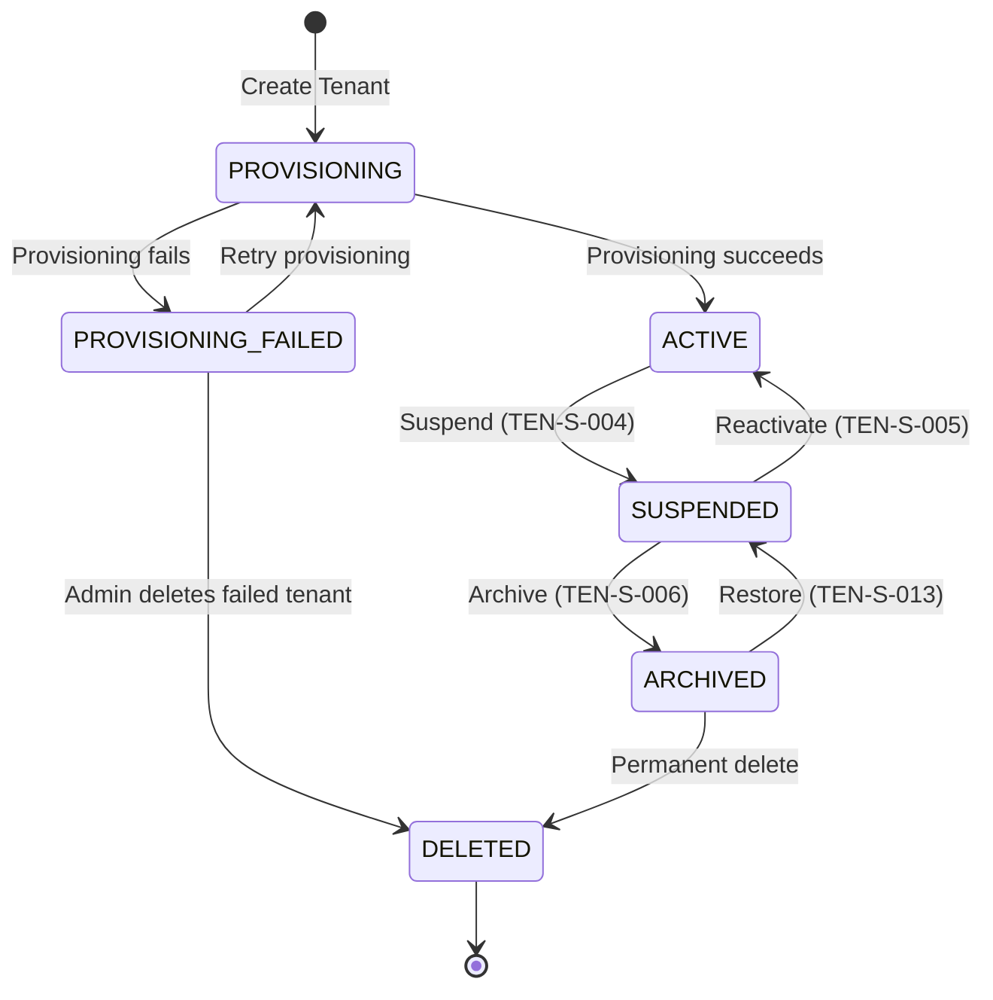
```mermaid
stateDiagram-v2
    [*] --> PROVISIONING : Create Tenant

    PROVISIONING --> ACTIVE : Provisioning succeeds
    PROVISIONING --> PROVISIONING_FAILED : Provisioning fails

    PROVISIONING_FAILED --> PROVISIONING : Retry provisioning
    PROVISIONING_FAILED --> DELETED : Admin deletes failed tenant

    ACTIVE --> SUSPENDED : Suspend (TEN-S-004)
    SUSPENDED --> ACTIVE : Reactivate (TEN-S-005)
    SUSPENDED --> ARCHIVED : Archive (TEN-S-006)

    ARCHIVED --> SUSPENDED : Restore (TEN-S-013)
    ARCHIVED --> DELETED : Permanent delete

    DELETED --> [*]
```

---

## Mermaid Style Classes

All diagrams below use these shared class definitions:

```
classDef happy fill:#428177,color:#fff,stroke:#054239
classDef alt fill:#988561,color:#fff,stroke:#5a4a2a
classDef fail fill:#6b1f2a,color:#fff,stroke:#4a151e
classDef neutral fill:#f2efe9,color:#3d3a3b,stroke:#e0ddda
```

---

## J01: Create Tenant

**Trigger:** ADMIN(MASTER) clicks "New Tenant" in tenant list
**Actor:** ADMIN in MASTER tenant
**Primary API:** `POST /api/tenants`
**Success:** TEN-S-001 (all green) or TEN-S-014 (active with warnings)
**Form:** Single form (no stepper/wizard). Slug auto-generated from name, not shown.
**Gate:** Tenant license must be available (TEN-E-020 blocks if not).

### Form Fields

| Field | Type | Validation |
|-------|------|-----------|
| Tenant Name | Text input | Required, 2-100 chars, no duplicates (TEN-E-022) |
| Domain | Text input | Required, valid format (TEN-E-009), no duplicates (TEN-E-010) |
| Tenant Admin Email | Email input | Required, valid email (TEN-E-016) |
| Admin Seats | Slider | 0–available, min 1 required (TEN-E-021) |
| User Seats | Slider | 0–available |
| Viewer Seats | Slider | 0–available |

Each slider shows: allocated value / available platform-wide / total platform-wide.
No Manager license — Manager is an RBAC feature assigned to a User-licensed person.

### Flow Diagram

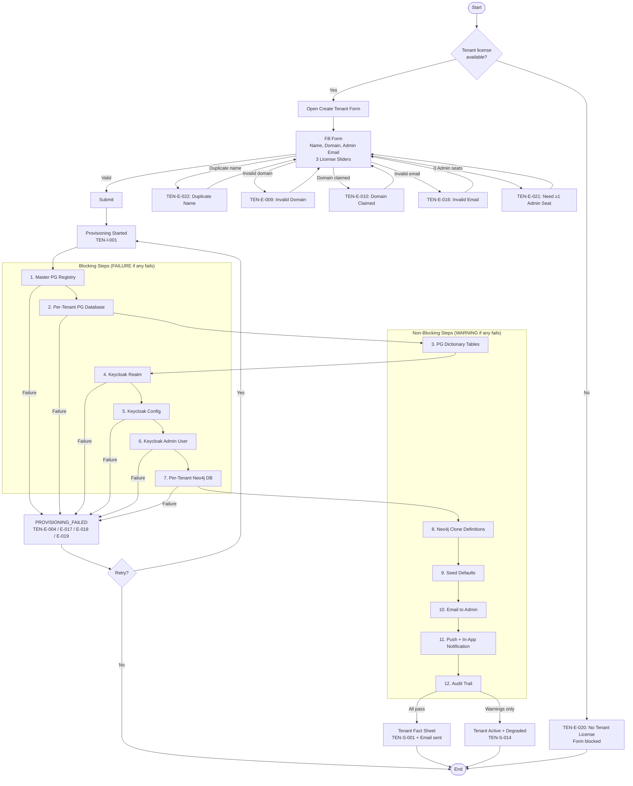
```mermaid
graph TD
    J01_START([Start]):::neutral --> J01_GATE{Tenant license<br/>available?}:::neutral
    J01_GATE -->|No| J01_BLOCKED[TEN-E-020: No Tenant License<br/>Form blocked]:::fail
    J01_GATE -->|Yes| J01_OPEN[Open Create Tenant Form]:::neutral

    J01_OPEN --> J01_FORM[Fill Form<br/>Name, Domain, Admin Email<br/>3 License Sliders]:::happy

    J01_FORM -->|Valid| J01_SUBMIT[Submit]:::happy
    J01_FORM -->|Duplicate name| J01_NAME_DUP[TEN-E-022: Duplicate Name]:::fail
    J01_FORM -->|Invalid domain| J01_DOM_ERR[TEN-E-009: Invalid Domain]:::fail
    J01_FORM -->|Domain claimed| J01_DOM_DUP[TEN-E-010: Domain Claimed]:::fail
    J01_FORM -->|Invalid email| J01_EMAIL_ERR[TEN-E-016: Invalid Email]:::fail
    J01_FORM -->|0 Admin seats| J01_NO_ADMIN[TEN-E-021: Need ≥1 Admin Seat]:::fail

    J01_NAME_DUP --> J01_FORM
    J01_DOM_ERR --> J01_FORM
    J01_DOM_DUP --> J01_FORM
    J01_EMAIL_ERR --> J01_FORM
    J01_NO_ADMIN --> J01_FORM

    J01_SUBMIT --> J01_PROV[Provisioning Started<br/>TEN-I-001]:::happy

    subgraph Blocking["Blocking Steps (FAILURE if any fails)"]
        J01_P1[1. Master PG Registry]:::neutral
        J01_P2[2. Per-Tenant PG Database]:::neutral
        J01_P4[4. Keycloak Realm]:::neutral
        J01_P5[5. Keycloak Config]:::neutral
        J01_P6[6. Keycloak Admin User]:::neutral
        J01_P7[7. Per-Tenant Neo4j DB]:::neutral
    end

    subgraph NonBlocking["Non-Blocking Steps (WARNING if any fails)"]
        J01_P3[3. PG Dictionary Tables]:::neutral
        J01_P8[8. Neo4j Clone Definitions]:::neutral
        J01_P9[9. Seed Defaults]:::neutral
        J01_P10[10. Email to Admin]:::neutral
        J01_P11[11. Push + In-App Notification]:::neutral
        J01_P12[12. Audit Trail]:::neutral
    end

    J01_PROV --> J01_P1
    J01_P1 --> J01_P2
    J01_P2 --> J01_P3
    J01_P3 --> J01_P4
    J01_P4 --> J01_P5
    J01_P5 --> J01_P6
    J01_P6 --> J01_P7
    J01_P7 --> J01_P8
    J01_P8 --> J01_P9
    J01_P9 --> J01_P10
    J01_P10 --> J01_P11
    J01_P11 --> J01_P12

    J01_P12 -->|All pass| J01_DONE[Tenant Fact Sheet<br/>TEN-S-001 + Email sent]:::happy
    J01_P12 -->|Warnings only| J01_WARN[Tenant Active + Degraded<br/>TEN-S-014]:::alt
    J01_P1 -->|Failure| J01_FAIL[PROVISIONING_FAILED<br/>TEN-E-004 / E-017 / E-018 / E-019]:::fail
    J01_P2 -->|Failure| J01_FAIL
    J01_P4 -->|Failure| J01_FAIL
    J01_P5 -->|Failure| J01_FAIL
    J01_P6 -->|Failure| J01_FAIL
    J01_P7 -->|Failure| J01_FAIL

    J01_FAIL --> J01_RETRY{Retry?}:::alt
    J01_RETRY -->|Yes| J01_PROV
    J01_RETRY -->|No| J01_END([End]):::neutral

    J01_DONE --> J01_END
    J01_WARN --> J01_END
    J01_BLOCKED --> J01_END
```

### J01 Step Detail

| # | Step | Severity | Description | API | Messages | Pre/Post Conditions |
|---|------|----------|-------------|-----|----------|---------------------|
| — | Tenant License Gate | GATE | Check tenant license availability before opening form | `GET /api/licenses/tenant-status` | TEN-E-020 | Pre: MASTER ADMIN. Post: Form opens or blocked. |
| — | Fill Form | — | Name, domain, admin email, 3 license sliders (Admin/User/Viewer seats) | — | — | Pre: Gate passed |
| — | Validate | — | Inline: no duplicate names/domains, valid email, ≥1 admin seat | `POST /api/tenants/validate` | TEN-E-022, TEN-E-009, TEN-E-010, TEN-E-016, TEN-E-021 | Post: All fields valid |
| — | Submit | — | Create tenant, start provisioning | `POST /api/tenants` | TEN-I-001 | Post: Tenant listed as PROVISIONING |
| 1 | Master PG Registry | **FAILURE** | INSERT tenant row in master PostgreSQL | Internal | TEN-I-007, TEN-E-017 | Post: Registry row exists |
| 2 | Per-Tenant PG Database | **FAILURE** | CREATE DATABASE `tenant_{slug}` + Flyway schema | Internal | TEN-I-007, TEN-E-017 | Post: Tenant DB accessible |
| 3 | PG Dictionary Tables | **WARNING** | INSERT default dictionary data (types, attributes) | Internal | TEN-I-007, TEN-W-008 | Post: Dictionary populated or warning |
| 4 | Keycloak Realm | **FAILURE** | Create realm `tenant-{slug}` | Internal | TEN-I-007, TEN-E-018 | Post: Realm exists |
| 5 | Keycloak Config | **FAILURE** | Configure auth flows, clients, role mappings | Internal | TEN-I-007, TEN-E-018 | Post: Realm fully configured |
| 6 | Keycloak Admin User | **FAILURE** | Create admin user from form email | Internal | TEN-I-007, TEN-E-019 | Post: Admin user can log in |
| 7 | Per-Tenant Neo4j DB | **FAILURE** | CREATE DATABASE `tenant_{slug}` | Internal | TEN-I-007, TEN-E-017 | Post: Graph DB ready |
| 8 | Neo4j Clone Definitions | **WARNING** | Clone object definition cypher from master | Internal | TEN-I-007, TEN-W-009 | Post: Definitions seeded or warning |
| 9 | Seed Defaults | **WARNING** | Branding, locales, notification templates | Internal | TEN-I-007, TEN-W-010 | Post: Defaults applied or warning |
| 10 | Email to Tenant Admin | **WARNING** | Welcome email with login instructions | Email Service | TEN-I-007, TEN-W-011 | Post: Email sent or warning |
| 11 | Push + In-App Notification | **WARNING** | Notify MASTER admin of result | Notification Service | TEN-I-007 | Post: Notification sent or silent fail |
| 12 | Audit Trail | **WARNING** | Record all provisioning steps + outcomes | Audit Service | TEN-I-007 | Post: Audit events persisted or warning |
| — | Activate | — | Set status ACTIVE, emit `tenant.created` event | Internal | TEN-S-001 or TEN-S-014 | Post: Tenant accessible |

### J01 Outcome Matrix

Two independent attributes are set on the Tenant node. Status = lifecycle position. Health = infrastructure state. They are NOT coupled — see PRD Section 12.0.

| Scenario | Status (lifecycle) | Health (infra) | Notification | Email |
|----------|--------------------|----------------|-------------|-------|
| All 12 steps pass | ACTIVE | HEALTHY | TEN-S-001 to MASTER admin | Welcome email to tenant admin |
| Blocking steps pass, some warnings | ACTIVE | DEGRADED | TEN-S-014 to MASTER admin | Welcome email (if step 10 passed) |
| Any blocking step fails | PROVISIONING_FAILED | _(not set)_ | Failure notification to MASTER admin | No email (admin user may not exist) |

---

## J02: View Tenant List

**Trigger:** Admin navigates to Administration > Tenant Manager
**Actor:** ADMIN (MASTER or tenant-scoped)
**Primary API:** `GET /api/tenants`

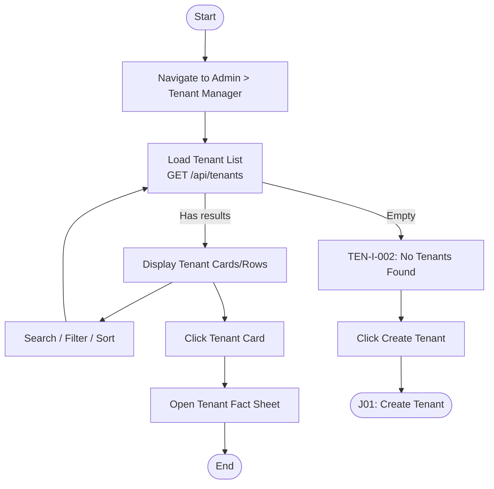
```mermaid
graph TD
    J02_START([Start]):::neutral --> J02_NAV[Navigate to Admin > Tenant Manager]:::neutral
    J02_NAV --> J02_LOAD[Load Tenant List<br/>GET /api/tenants]:::happy
    J02_LOAD -->|Has results| J02_DISPLAY[Display Tenant Cards/Rows]:::happy
    J02_LOAD -->|Empty| J02_EMPTY[TEN-I-002: No Tenants Found]:::alt

    J02_DISPLAY --> J02_SEARCH[Search / Filter / Sort]:::neutral
    J02_SEARCH --> J02_LOAD

    J02_DISPLAY --> J02_CLICK[Click Tenant Card]:::happy
    J02_CLICK --> J02_FACT[Open Tenant Fact Sheet]:::happy
    J02_FACT --> J02_END([End]):::neutral

    J02_EMPTY --> J02_CREATE[Click Create Tenant]:::alt
    J02_CREATE --> J02_WIZARD([J01: Create Tenant]):::neutral
```

### J02 Step Detail

| Step | Description | API | Screen | Messages | Pre/Post Conditions |
|------|-------------|-----|--------|----------|---------------------|
| Navigate | User navigates to Tenant Manager section | -- | Administration page | -- | Pre: Authenticated with admin role |
| Load List | Fetch paginated tenant list with current filters | `GET /api/tenants?search=&type=&status=&sort=&page=&size=` | Tenant List | -- | Pre: None. Post: List rendered |
| Display | Render tenant cards with name, slug, status badge, type | -- | Tenant List | -- | Pre: API returned results |
| Empty State | Show empty state illustration and CTA | -- | Tenant List | TEN-I-002 | Pre: API returned 0 results |
| Search/Filter | Filter by name/slug, type, status; sort by name/created | `GET /api/tenants?...` | Tenant List (filter bar) | -- | Post: List refreshed |
| Click Tenant | Navigate to fact sheet for selected tenant | -- | Tenant List | -- | Post: Navigates to J03 |

---

## J03: Open Tenant Fact Sheet

**Trigger:** Click tenant in list OR deep-link URL
**Actor:** ADMIN (MASTER or tenant-scoped with view permission)
**Primary API:** `GET /api/tenants/{id}`

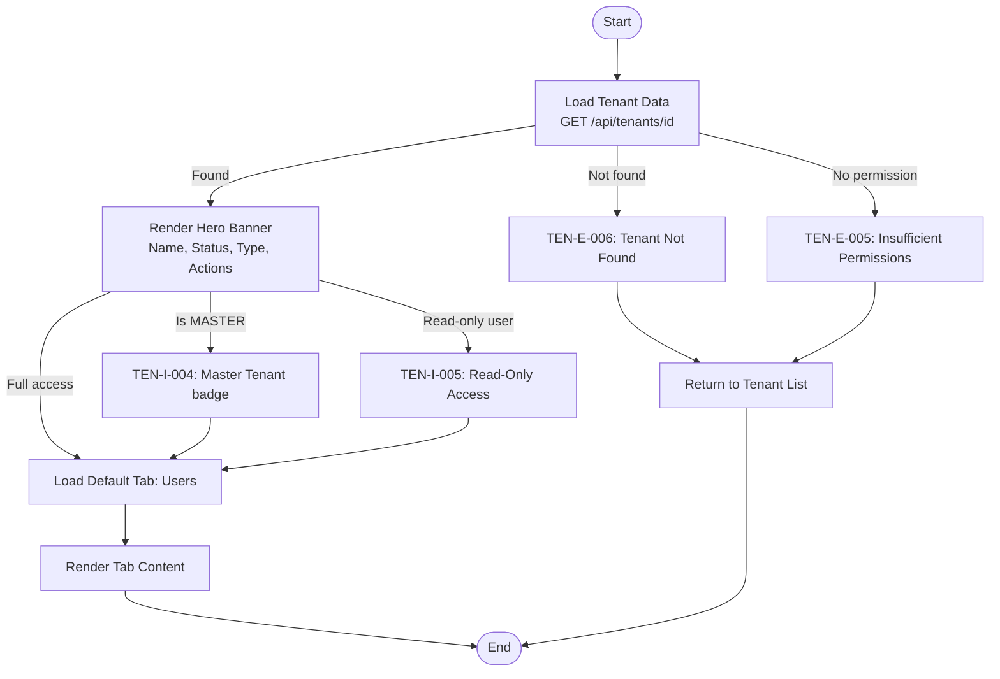
```mermaid
graph TD
    J03_START([Start]):::neutral --> J03_LOAD[Load Tenant Data<br/>GET /api/tenants/id]:::happy

    J03_LOAD -->|Found| J03_BANNER[Render Hero Banner<br/>Name, Status, Type, Actions]:::happy
    J03_LOAD -->|Not found| J03_404[TEN-E-006: Tenant Not Found]:::fail
    J03_LOAD -->|No permission| J03_403[TEN-E-005: Insufficient Permissions]:::fail

    J03_BANNER -->|Is MASTER| J03_MASTER[TEN-I-004: Master Tenant badge]:::alt
    J03_BANNER -->|Read-only user| J03_RO[TEN-I-005: Read-Only Access]:::alt
    J03_BANNER -->|Full access| J03_TABS[Load Default Tab: Users]:::happy

    J03_MASTER --> J03_TABS
    J03_RO --> J03_TABS

    J03_TABS --> J03_RENDER[Render Tab Content]:::happy
    J03_RENDER --> J03_END([End]):::neutral

    J03_404 --> J03_BACK[Return to Tenant List]:::neutral
    J03_403 --> J03_BACK
    J03_BACK --> J03_END
```

### J03 Step Detail

| Step | Description | API | Screen | Messages | Pre/Post Conditions |
|------|-------------|-----|--------|----------|---------------------|
| Load Tenant | Fetch tenant by ID or slug | `GET /api/tenants/{id}` | Loading spinner | TEN-E-006, TEN-E-005 | Pre: Valid tenant ID or slug |
| Render Banner | Display hero section with name, status badge, type, lifecycle actions | -- | Fact Sheet Banner | TEN-I-004, TEN-I-005 | Pre: Tenant loaded |
| Master Badge | Show master tenant info badge if applicable | -- | Fact Sheet Banner | TEN-I-004 | Pre: Tenant is MASTER |
| Read-Only | Show read-only indicator for restricted users | -- | Fact Sheet Banner | TEN-I-005 | Pre: User lacks edit permission |
| Load Tab | Load default tab (Users) content | Tab-specific API | Fact Sheet Tab area | TEN-I-003 (if empty) | Pre: Banner rendered |
| Not Found | Show 404 with link back to list | -- | Error page | TEN-E-006 | Pre: Tenant does not exist |
| No Permission | Show 403 with link back to list | -- | Error page | TEN-E-005 | Pre: User lacks view permission |

---

## J04: Edit Tenant Details

**Trigger:** Click "Edit" in Fact Sheet banner
**Actor:** ADMIN with edit permission on tenant
**Primary API:** `PATCH /api/tenants/{id}`

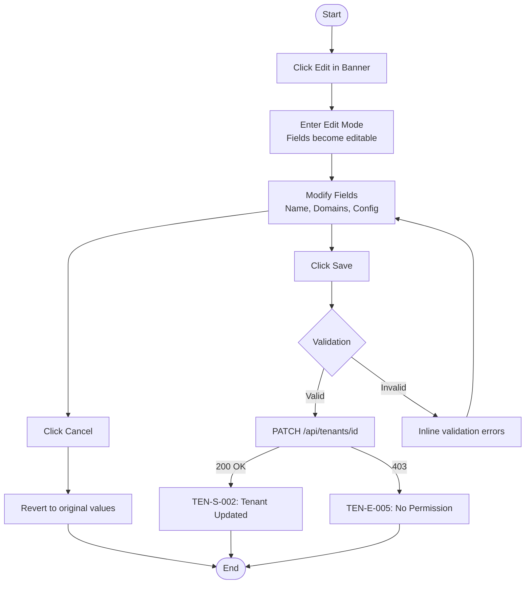
```mermaid
graph TD
    J04_START([Start]):::neutral --> J04_EDIT[Click Edit in Banner]:::neutral
    J04_EDIT --> J04_MODE[Enter Edit Mode<br/>Fields become editable]:::happy

    J04_MODE --> J04_MODIFY[Modify Fields<br/>Name, Domains, Config]:::happy

    J04_MODIFY --> J04_SAVE[Click Save]:::happy
    J04_MODIFY --> J04_CANCEL[Click Cancel]:::alt
    J04_CANCEL --> J04_REVERT[Revert to original values]:::alt
    J04_REVERT --> J04_END([End]):::neutral

    J04_SAVE --> J04_VALIDATE{Validation}:::neutral
    J04_VALIDATE -->|Valid| J04_API[PATCH /api/tenants/id]:::happy
    J04_VALIDATE -->|Invalid| J04_ERR[Inline validation errors]:::fail
    J04_ERR --> J04_MODIFY

    J04_API -->|200 OK| J04_SUCCESS[TEN-S-002: Tenant Updated]:::happy
    J04_API -->|403| J04_PERM[TEN-E-005: No Permission]:::fail

    J04_SUCCESS --> J04_END
    J04_PERM --> J04_END
```

### J04 Step Detail

| Step | Description | API | Screen | Messages | Pre/Post Conditions |
|------|-------------|-----|--------|----------|---------------------|
| Click Edit | Toggle banner fields to edit mode | -- | Fact Sheet Banner | -- | Pre: User has edit permission |
| Modify | User changes name, domains, locale, timezone | -- | Inline edit fields | -- | Pre: Edit mode active |
| Save | Submit changes to API | `PATCH /api/tenants/{id}` | Fact Sheet Banner | TEN-S-002, TEN-E-005 | Pre: At least one field changed |
| Cancel | Discard changes, return to view mode | -- | Fact Sheet Banner | -- | Pre: Edit mode active |
| Validation | Client-side field validation | -- | Inline errors | TEN-E-002, TEN-E-009, TEN-E-010 | Pre: Save clicked |

---

## J05: Activate Tenant

**Trigger:** Banner action on PROVISIONING or PROVISIONING_FAILED tenant
**Actor:** ADMIN in MASTER tenant
**Primary API:** `PATCH /api/tenants/{id}/lifecycle`

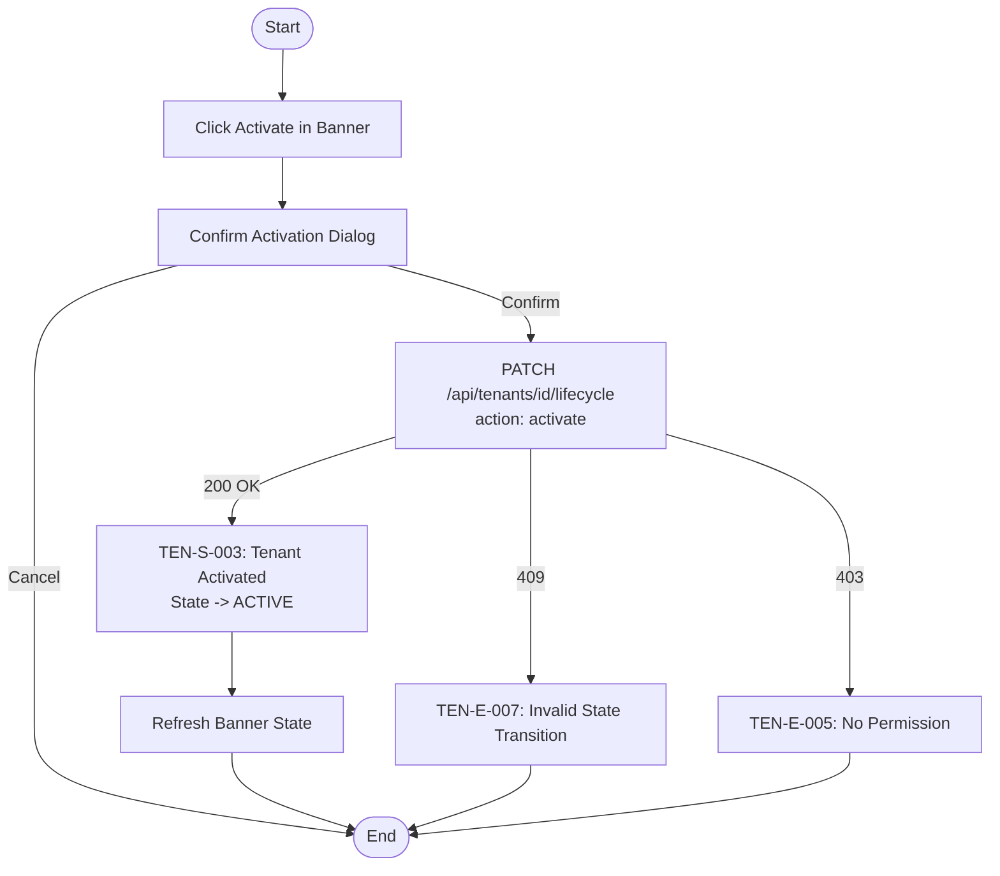
```mermaid
graph TD
    J05_START([Start]):::neutral --> J05_ACTION[Click Activate in Banner]:::neutral
    J05_ACTION --> J05_CONFIRM[Confirm Activation Dialog]:::happy
    J05_CONFIRM -->|Confirm| J05_API[PATCH /api/tenants/id/lifecycle<br/>action: activate]:::happy
    J05_CONFIRM -->|Cancel| J05_END([End]):::neutral

    J05_API -->|200 OK| J05_SUCCESS[TEN-S-003: Tenant Activated<br/>State -> ACTIVE]:::happy
    J05_API -->|409| J05_INVALID[TEN-E-007: Invalid State Transition]:::fail
    J05_API -->|403| J05_PERM[TEN-E-005: No Permission]:::fail

    J05_SUCCESS --> J05_REFRESH[Refresh Banner State]:::happy
    J05_REFRESH --> J05_END
    J05_INVALID --> J05_END
    J05_PERM --> J05_END
```

### J05 Step Detail

| Step | Description | API | Screen | Messages | Pre/Post Conditions |
|------|-------------|-----|--------|----------|---------------------|
| Click Activate | Admin clicks Activate action button | -- | Fact Sheet Banner | -- | Pre: Tenant in PROVISIONING or PROVISIONING_FAILED state |
| Confirm | Confirmation dialog shown | -- | Modal Dialog | -- | Pre: Action clicked |
| API Call | Send lifecycle transition request | `PATCH /api/tenants/{id}/lifecycle {action: "activate"}` | Loading state | -- | Pre: Confirmed |
| Success | Tenant state updated to ACTIVE | -- | Banner refreshes | TEN-S-003 | Post: State = ACTIVE |
| Invalid Transition | Current state does not allow activation | -- | Error toast | TEN-E-007 | Post: No state change |

---

## J06: Suspend Tenant

**Trigger:** Banner action on ACTIVE tenant
**Actor:** ADMIN in MASTER tenant
**Primary API:** `PATCH /api/tenants/{id}/lifecycle`

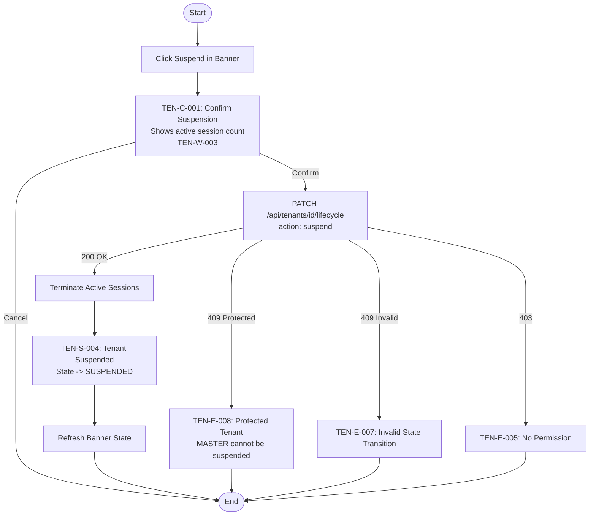
```mermaid
graph TD
    J06_START([Start]):::neutral --> J06_ACTION[Click Suspend in Banner]:::neutral
    J06_ACTION --> J06_WARN[TEN-C-001: Confirm Suspension<br/>Shows active session count<br/>TEN-W-003]:::alt
    J06_WARN -->|Confirm| J06_API[PATCH /api/tenants/id/lifecycle<br/>action: suspend]:::happy
    J06_WARN -->|Cancel| J06_END([End]):::neutral

    J06_API -->|200 OK| J06_KILL[Terminate Active Sessions]:::happy
    J06_KILL --> J06_SUCCESS[TEN-S-004: Tenant Suspended<br/>State -> SUSPENDED]:::happy
    J06_API -->|409 Protected| J06_PROTECTED[TEN-E-008: Protected Tenant<br/>MASTER cannot be suspended]:::fail
    J06_API -->|409 Invalid| J06_INVALID[TEN-E-007: Invalid State Transition]:::fail
    J06_API -->|403| J06_PERM[TEN-E-005: No Permission]:::fail

    J06_SUCCESS --> J06_REFRESH[Refresh Banner State]:::happy
    J06_REFRESH --> J06_END
    J06_PROTECTED --> J06_END
    J06_INVALID --> J06_END
    J06_PERM --> J06_END
```

### J06 Step Detail

| Step | Description | API | Screen | Messages | Pre/Post Conditions |
|------|-------------|-----|--------|----------|---------------------|
| Click Suspend | Admin clicks Suspend action button | -- | Fact Sheet Banner | -- | Pre: Tenant in ACTIVE state |
| Confirmation | Show dialog with session count warning | -- | Modal Dialog | TEN-C-001, TEN-W-003 | Pre: Action clicked |
| API Call | Send suspend lifecycle transition | `PATCH /api/tenants/{id}/lifecycle {action: "suspend"}` | Loading state | -- | Pre: Confirmed |
| Terminate Sessions | Server terminates all active user sessions | Internal | -- | -- | Post: All sessions ended |
| Success | Tenant state updated to SUSPENDED | -- | Banner refreshes | TEN-S-004 | Post: State = SUSPENDED |
| Protected | MASTER tenant cannot be suspended | -- | Error toast | TEN-E-008 | Post: No state change |

---

## J07: Archive Tenant

**Trigger:** Banner action on SUSPENDED tenant
**Actor:** ADMIN in MASTER tenant
**Primary API:** `PATCH /api/tenants/{id}/lifecycle`

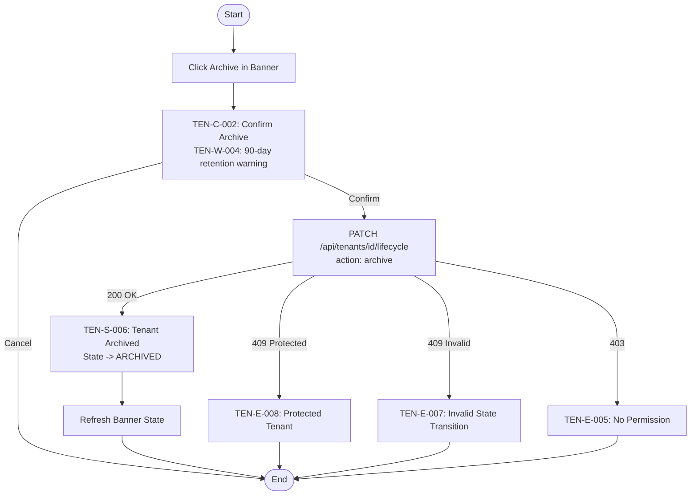
```mermaid
graph TD
    J07_START([Start]):::neutral --> J07_ACTION[Click Archive in Banner]:::neutral
    J07_ACTION --> J07_WARN[TEN-C-002: Confirm Archive<br/>TEN-W-004: 90-day retention warning]:::alt
    J07_WARN -->|Confirm| J07_API[PATCH /api/tenants/id/lifecycle<br/>action: archive]:::happy
    J07_WARN -->|Cancel| J07_END([End]):::neutral

    J07_API -->|200 OK| J07_SUCCESS[TEN-S-006: Tenant Archived<br/>State -> ARCHIVED]:::happy
    J07_API -->|409 Protected| J07_PROTECTED[TEN-E-008: Protected Tenant]:::fail
    J07_API -->|409 Invalid| J07_INVALID[TEN-E-007: Invalid State Transition]:::fail
    J07_API -->|403| J07_PERM[TEN-E-005: No Permission]:::fail

    J07_SUCCESS --> J07_REFRESH[Refresh Banner State]:::happy
    J07_REFRESH --> J07_END
    J07_PROTECTED --> J07_END
    J07_INVALID --> J07_END
    J07_PERM --> J07_END
```

### J07 Step Detail

| Step | Description | API | Screen | Messages | Pre/Post Conditions |
|------|-------------|-----|--------|----------|---------------------|
| Click Archive | Admin clicks Archive action button | -- | Fact Sheet Banner | -- | Pre: Tenant in SUSPENDED state |
| Confirmation | Show dialog with 90-day retention warning | -- | Modal Dialog | TEN-C-002, TEN-W-004 | Pre: Action clicked |
| API Call | Send archive lifecycle transition | `PATCH /api/tenants/{id}/lifecycle {action: "archive"}` | Loading state | -- | Pre: Confirmed |
| Success | Tenant state updated to ARCHIVED | -- | Banner refreshes | TEN-S-006 | Post: State = ARCHIVED |
| Protected | MASTER tenant cannot be archived | -- | Error toast | TEN-E-008 | Post: No state change |

---

## J08: Restore Tenant

**Trigger:** Banner action on ARCHIVED tenant
**Actor:** ADMIN in MASTER tenant
**Primary API:** `PATCH /api/tenants/{id}/lifecycle`

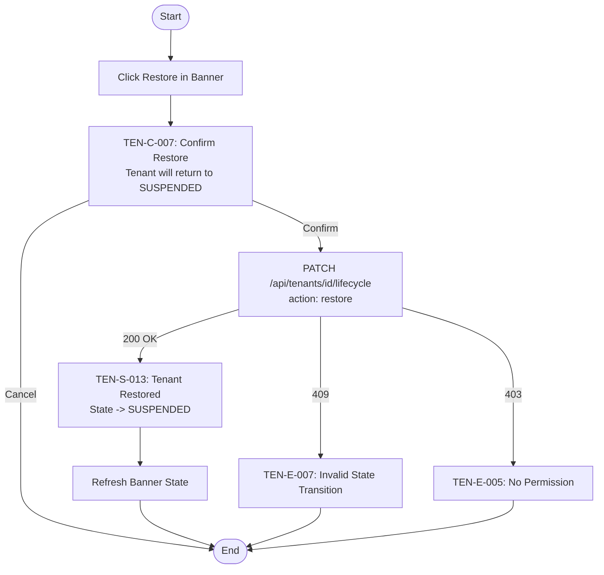
```mermaid
graph TD
    J08_START([Start]):::neutral --> J08_ACTION[Click Restore in Banner]:::neutral
    J08_ACTION --> J08_CONFIRM[TEN-C-007: Confirm Restore<br/>Tenant will return to SUSPENDED]:::alt
    J08_CONFIRM -->|Confirm| J08_API[PATCH /api/tenants/id/lifecycle<br/>action: restore]:::happy
    J08_CONFIRM -->|Cancel| J08_END([End]):::neutral

    J08_API -->|200 OK| J08_SUCCESS[TEN-S-013: Tenant Restored<br/>State -> SUSPENDED]:::happy
    J08_API -->|409| J08_INVALID[TEN-E-007: Invalid State Transition]:::fail
    J08_API -->|403| J08_PERM[TEN-E-005: No Permission]:::fail

    J08_SUCCESS --> J08_REFRESH[Refresh Banner State]:::happy
    J08_REFRESH --> J08_END
    J08_INVALID --> J08_END
    J08_PERM --> J08_END
```

### J08 Step Detail

| Step | Description | API | Screen | Messages | Pre/Post Conditions |
|------|-------------|-----|--------|----------|---------------------|
| Click Restore | Admin clicks Restore action on archived tenant | -- | Fact Sheet Banner | -- | Pre: Tenant in ARCHIVED state |
| Confirmation | Show dialog confirming restore to SUSPENDED state | -- | Modal Dialog | TEN-C-007 | Pre: Action clicked |
| API Call | Send restore lifecycle transition | `PATCH /api/tenants/{id}/lifecycle {action: "restore"}` | Loading state | -- | Pre: Confirmed |
| Success | Tenant state updated to SUSPENDED | -- | Banner refreshes | TEN-S-013 | Post: State = SUSPENDED |

---

## J09: Permanently Delete Tenant

**Trigger:** Banner action on ARCHIVED tenant
**Actor:** ADMIN in MASTER tenant
**Primary API:** `DELETE /api/tenants/{id}`

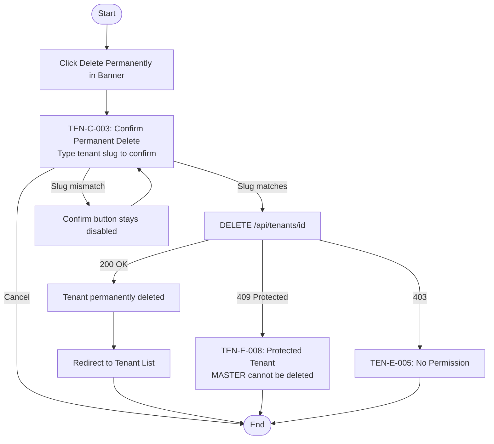
```mermaid
graph TD
    J09_START([Start]):::neutral --> J09_ACTION[Click Delete Permanently in Banner]:::neutral
    J09_ACTION --> J09_WARN[TEN-C-003: Confirm Permanent Delete<br/>Type tenant slug to confirm]:::fail

    J09_WARN -->|Slug matches| J09_API[DELETE /api/tenants/id]:::happy
    J09_WARN -->|Slug mismatch| J09_MISMATCH[Confirm button stays disabled]:::alt
    J09_WARN -->|Cancel| J09_END([End]):::neutral

    J09_MISMATCH --> J09_WARN

    J09_API -->|200 OK| J09_SUCCESS[Tenant permanently deleted]:::happy
    J09_API -->|409 Protected| J09_PROTECTED[TEN-E-008: Protected Tenant<br/>MASTER cannot be deleted]:::fail
    J09_API -->|403| J09_PERM[TEN-E-005: No Permission]:::fail

    J09_SUCCESS --> J09_REDIRECT[Redirect to Tenant List]:::happy
    J09_REDIRECT --> J09_END
    J09_PROTECTED --> J09_END
    J09_PERM --> J09_END
```

### J09 Step Detail

| Step | Description | API | Screen | Messages | Pre/Post Conditions |
|------|-------------|-----|--------|----------|---------------------|
| Click Delete | Admin clicks "Delete Permanently" on archived tenant | -- | Fact Sheet Banner | -- | Pre: Tenant in ARCHIVED state |
| Confirmation | Type slug to confirm; button disabled until match | -- | Modal Dialog | TEN-C-003 | Pre: Action clicked |
| Validate Slug | Client-side check: typed slug matches tenant slug | -- | Modal Dialog | -- | Pre: User types in input |
| API Call | Hard delete tenant and all associated resources | `DELETE /api/tenants/{id}` | Loading state | -- | Pre: Slug confirmed |
| Success | All tenant data permanently removed | -- | Redirect | -- | Post: Tenant no longer exists |
| Redirect | Navigate back to Tenant List | -- | Tenant List | -- | Post: Fact Sheet no longer accessible |
| Protected | MASTER tenant cannot be deleted | -- | Error toast | TEN-E-008 | Post: No action taken |

---

## J10: Manage Branding

**Trigger:** Click Branding tab in Fact Sheet
**Actor:** ADMIN with branding permission
**Primary API:** `GET/PUT /api/tenants/{id}/branding`, `POST /api/tenants/{id}/branding/publish`

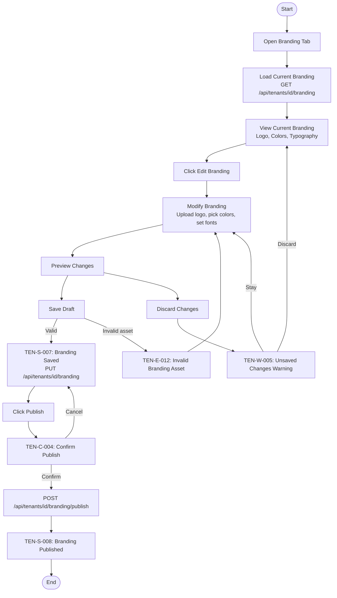
```mermaid
graph TD
    J10_START([Start]):::neutral --> J10_TAB[Open Branding Tab]:::neutral
    J10_TAB --> J10_LOAD[Load Current Branding<br/>GET /api/tenants/id/branding]:::happy

    J10_LOAD --> J10_VIEW[View Current Branding<br/>Logo, Colors, Typography]:::happy
    J10_VIEW --> J10_EDIT[Click Edit Branding]:::neutral

    J10_EDIT --> J10_MODIFY[Modify Branding<br/>Upload logo, pick colors, set fonts]:::happy
    J10_MODIFY --> J10_PREVIEW[Preview Changes]:::happy

    J10_PREVIEW --> J10_SAVE[Save Draft]:::happy
    J10_PREVIEW --> J10_DISCARD[Discard Changes]:::alt

    J10_SAVE -->|Valid| J10_DRAFT[TEN-S-007: Branding Saved<br/>PUT /api/tenants/id/branding]:::happy
    J10_SAVE -->|Invalid asset| J10_ASSET_ERR[TEN-E-012: Invalid Branding Asset]:::fail
    J10_ASSET_ERR --> J10_MODIFY

    J10_DRAFT --> J10_PUBLISH[Click Publish]:::happy
    J10_PUBLISH --> J10_CONFIRM[TEN-C-004: Confirm Publish]:::alt
    J10_CONFIRM -->|Confirm| J10_PUB_API[POST /api/tenants/id/branding/publish]:::happy
    J10_CONFIRM -->|Cancel| J10_DRAFT

    J10_PUB_API --> J10_PUBLISHED[TEN-S-008: Branding Published]:::happy
    J10_PUBLISHED --> J10_END([End]):::neutral

    J10_DISCARD --> J10_UNSAVED[TEN-W-005: Unsaved Changes Warning]:::alt
    J10_UNSAVED -->|Discard| J10_VIEW
    J10_UNSAVED -->|Stay| J10_MODIFY
```

### J10 Step Detail

| Step | Description | API | Screen | Messages | Pre/Post Conditions |
|------|-------------|-----|--------|----------|---------------------|
| Open Tab | Navigate to Branding tab in Fact Sheet | -- | Fact Sheet Tabs | -- | Pre: Tenant loaded |
| Load Branding | Fetch current branding configuration | `GET /api/tenants/{id}/branding` | Branding Tab | TEN-I-003 (if none) | Pre: Tab active |
| View | Display current logo, color palette, typography | -- | Branding Tab | -- | Pre: Branding loaded |
| Edit | Enter edit mode for branding | -- | Branding Tab | -- | Pre: User has branding permission |
| Modify | Upload logo (PNG/SVG, max 2MB, min 64x64), pick colors, set fonts | -- | Branding Editor | TEN-E-012 | Pre: Edit mode |
| Preview | Live preview of changes against tenant UI | -- | Preview pane | -- | Pre: Changes made |
| Save Draft | Persist changes without publishing | `PUT /api/tenants/{id}/branding` | Branding Tab | TEN-S-007 | Post: Draft saved |
| Publish | Push branding live to all tenant users | `POST /api/tenants/{id}/branding/publish` | Confirmation dialog | TEN-C-004, TEN-S-008 | Post: Branding live |
| Unsaved Warning | Warn on navigation away with unsaved changes | -- | Modal Dialog | TEN-W-005 | Pre: Dirty form + navigation |

---

## J11: Manage Integrations

**Trigger:** Click Integrations tab in Fact Sheet
**Actor:** ADMIN with integration permission
**Primary API:** `GET/POST/PUT/DELETE /api/tenants/{id}/integrations`

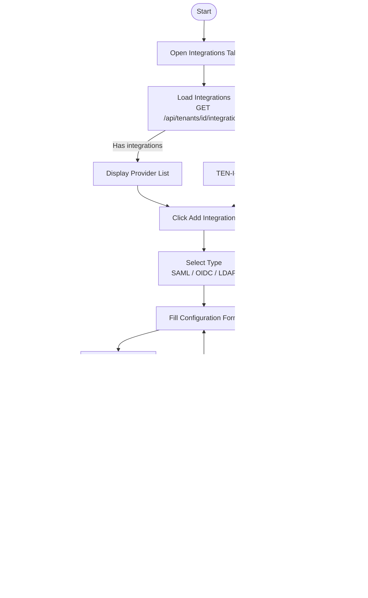
```mermaid
graph TD
    J11_START([Start]):::neutral --> J11_TAB[Open Integrations Tab]:::neutral
    J11_TAB --> J11_LOAD[Load Integrations<br/>GET /api/tenants/id/integrations]:::happy

    J11_LOAD -->|Has integrations| J11_LIST[Display Provider List]:::happy
    J11_LOAD -->|Empty| J11_EMPTY[TEN-I-003: No Integrations]:::alt

    J11_LIST --> J11_ADD[Click Add Integration]:::neutral
    J11_EMPTY --> J11_ADD

    J11_ADD --> J11_TYPE[Select Type<br/>SAML / OIDC / LDAP]:::happy
    J11_TYPE --> J11_FORM[Fill Configuration Form]:::happy

    J11_FORM --> J11_TEST[Test Connection]:::happy
    J11_TEST -->|Success| J11_ENABLE[Enable Integration]:::happy
    J11_TEST -->|Connection fail| J11_CONN_ERR[TEN-E-013: Connection Failed]:::fail
    J11_TEST -->|Config invalid| J11_CFG_ERR[TEN-E-014: Invalid Config]:::fail

    J11_CONN_ERR --> J11_FORM
    J11_CFG_ERR --> J11_FORM

    J11_ENABLE --> J11_SAVE[POST /api/tenants/id/integrations]:::happy
    J11_SAVE --> J11_SUCCESS[TEN-S-009: Integration Added]:::happy
    J11_SUCCESS --> J11_END([End]):::neutral
```

### J11 Step Detail

| Step | Description | API | Screen | Messages | Pre/Post Conditions |
|------|-------------|-----|--------|----------|---------------------|
| Open Tab | Navigate to Integrations tab | -- | Fact Sheet Tabs | -- | Pre: Tenant loaded |
| Load | Fetch existing integration providers | `GET /api/tenants/{id}/integrations` | Integrations Tab | TEN-I-003 (if empty) | Pre: Tab active |
| Add | Open add integration form | -- | Integration Form | -- | Pre: User has integration permission |
| Select Type | Choose SAML, OIDC, or LDAP | -- | Type selector | -- | Pre: Add clicked |
| Fill Config | Enter provider-specific configuration fields | -- | Config form | -- | Pre: Type selected |
| Test Connection | Validate connectivity to external provider | `POST /api/tenants/{id}/integrations/test` | Test result panel | TEN-E-013, TEN-E-014 | Pre: Form filled |
| Enable | Toggle integration to active | -- | Toggle switch | -- | Pre: Test passed |
| Save | Persist integration configuration | `POST /api/tenants/{id}/integrations` | Integrations Tab | TEN-S-009 | Post: Integration active |

---

## J12: Manage Users

**Trigger:** Click Users tab in Fact Sheet (default tab)
**Actor:** ADMIN with user management permission
**Primary API:** `GET /api/tenants/{id}/users`, `POST /api/tenants/{id}/users/invite`

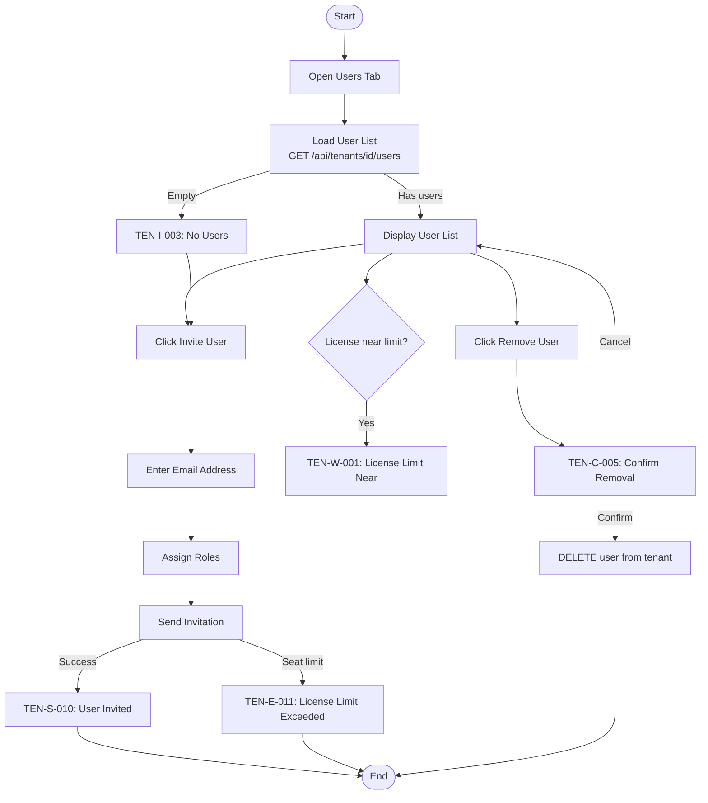
```mermaid
graph TD
    J12_START([Start]):::neutral --> J12_TAB[Open Users Tab]:::neutral
    J12_TAB --> J12_LOAD[Load User List<br/>GET /api/tenants/id/users]:::happy

    J12_LOAD -->|Has users| J12_LIST[Display User List]:::happy
    J12_LOAD -->|Empty| J12_EMPTY[TEN-I-003: No Users]:::alt

    J12_LIST --> J12_INVITE[Click Invite User]:::neutral
    J12_EMPTY --> J12_INVITE

    J12_INVITE --> J12_EMAIL[Enter Email Address]:::happy
    J12_EMAIL --> J12_ROLES[Assign Roles]:::happy
    J12_ROLES --> J12_SEND[Send Invitation]:::happy

    J12_SEND -->|Success| J12_SUCCESS[TEN-S-010: User Invited]:::happy
    J12_SEND -->|Seat limit| J12_LIMIT[TEN-E-011: License Limit Exceeded]:::fail

    J12_LIST --> J12_WARN_BADGE{License near limit?}:::neutral
    J12_WARN_BADGE -->|Yes| J12_WARN[TEN-W-001: License Limit Near]:::alt

    J12_LIST --> J12_REMOVE[Click Remove User]:::neutral
    J12_REMOVE --> J12_CONFIRM_RM[TEN-C-005: Confirm Removal]:::alt
    J12_CONFIRM_RM -->|Confirm| J12_DELETE[DELETE user from tenant]:::happy
    J12_CONFIRM_RM -->|Cancel| J12_LIST

    J12_SUCCESS --> J12_END([End]):::neutral
    J12_LIMIT --> J12_END
    J12_DELETE --> J12_END
```

### J12 Step Detail

| Step | Description | API | Screen | Messages | Pre/Post Conditions |
|------|-------------|-----|--------|----------|---------------------|
| Open Tab | Navigate to Users tab (default on Fact Sheet) | -- | Fact Sheet Tabs | -- | Pre: Tenant loaded |
| Load Users | Fetch paginated user list | `GET /api/tenants/{id}/users?page=&size=&search=` | Users Tab | TEN-I-003 (if empty) | Pre: Tab active |
| License Warning | Show warning if near seat allocation limit | -- | Banner in Users Tab | TEN-W-001 | Pre: usage >= threshold % |
| Invite User | Open invite form | -- | Invite dialog | -- | Pre: User has invite permission |
| Enter Email | Type user email address | -- | Email input | -- | Pre: Invite form open |
| Assign Roles | Select roles for new user | -- | Role picker | -- | Pre: Email entered |
| Send | Submit invitation | `POST /api/tenants/{id}/users/invite` | Loading state | TEN-S-010, TEN-E-011 | Post: Invitation sent or rejected |
| Remove User | Click remove on a user row | -- | User list row | -- | Pre: User has removal permission |
| Confirm Remove | Confirmation dialog before removal | -- | Modal Dialog | TEN-C-005 | Pre: Remove clicked |
| Delete | Remove user from tenant | `DELETE /api/tenants/{id}/users/{userId}` | Users Tab | -- | Post: User removed, seat freed |

---

## J13: View Health Checks

**Trigger:** Click Health Checks tab in Fact Sheet
**Actor:** ADMIN in MASTER tenant only
**Primary API:** `GET /api/tenants/{id}/health`

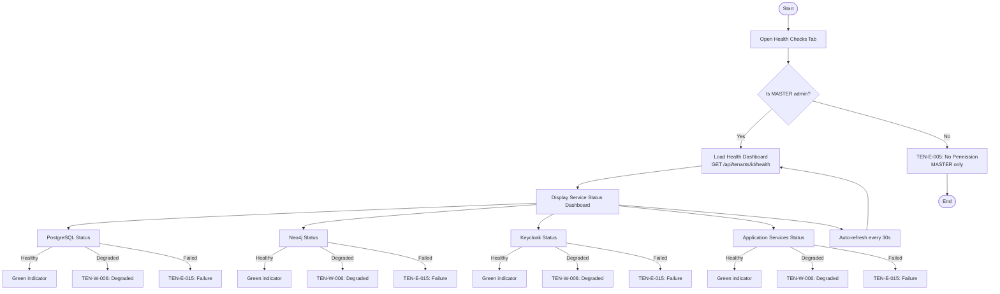
```mermaid
graph TD
    J13_START([Start]):::neutral --> J13_TAB[Open Health Checks Tab]:::neutral
    J13_TAB --> J13_CHECK{Is MASTER admin?}:::neutral

    J13_CHECK -->|Yes| J13_LOAD[Load Health Dashboard<br/>GET /api/tenants/id/health]:::happy
    J13_CHECK -->|No| J13_PERM[TEN-E-005: No Permission<br/>MASTER only]:::fail

    J13_LOAD --> J13_DASH[Display Service Status Dashboard]:::happy

    J13_DASH --> J13_PG[PostgreSQL Status]:::happy
    J13_DASH --> J13_NEO[Neo4j Status]:::happy
    J13_DASH --> J13_KC[Keycloak Status]:::happy
    J13_DASH --> J13_SVC[Application Services Status]:::happy

    J13_PG -->|Healthy| J13_OK1[Green indicator]:::happy
    J13_PG -->|Degraded| J13_DEG1[TEN-W-006: Degraded]:::alt
    J13_PG -->|Failed| J13_FAIL1[TEN-E-015: Failure]:::fail

    J13_NEO -->|Healthy| J13_OK2[Green indicator]:::happy
    J13_NEO -->|Degraded| J13_DEG2[TEN-W-006: Degraded]:::alt
    J13_NEO -->|Failed| J13_FAIL2[TEN-E-015: Failure]:::fail

    J13_KC -->|Healthy| J13_OK3[Green indicator]:::happy
    J13_KC -->|Degraded| J13_DEG3[TEN-W-006: Degraded]:::alt
    J13_KC -->|Failed| J13_FAIL3[TEN-E-015: Failure]:::fail

    J13_SVC -->|Healthy| J13_OK4[Green indicator]:::happy
    J13_SVC -->|Degraded| J13_DEG4[TEN-W-006: Degraded]:::alt
    J13_SVC -->|Failed| J13_FAIL4[TEN-E-015: Failure]:::fail

    J13_DASH --> J13_REFRESH[Auto-refresh every 30s]:::neutral
    J13_REFRESH --> J13_LOAD

    J13_PERM --> J13_END([End]):::neutral
```

### J13 Step Detail

| Step | Description | API | Screen | Messages | Pre/Post Conditions |
|------|-------------|-----|--------|----------|---------------------|
| Open Tab | Navigate to Health Checks tab | -- | Fact Sheet Tabs | -- | Pre: Tenant loaded |
| Permission Check | Verify user is MASTER admin | -- | Tab area | TEN-E-005 | Pre: Tab clicked |
| Load Health | Fetch health status for all services | `GET /api/tenants/{id}/health` | Health Dashboard | -- | Pre: Permission granted |
| Display Dashboard | Show per-service health indicators | -- | Health Dashboard | -- | Pre: Health data loaded |
| PostgreSQL | Show PG connection pool, query latency, disk | -- | Service card | TEN-W-006, TEN-E-015 | -- |
| Neo4j | Show Neo4j connection, query latency | -- | Service card | TEN-W-006, TEN-E-015 | -- |
| Keycloak | Show Keycloak realm health, token service | -- | Service card | TEN-W-006, TEN-E-015 | -- |
| App Services | Show application microservice health | -- | Service card | TEN-W-006, TEN-E-015 | -- |
| Auto-refresh | Dashboard polls health endpoint every 30 seconds | `GET /api/tenants/{id}/health` | Health Dashboard | -- | Pre: Dashboard visible |

---

## Journey Summary

| Journey | ID | Primary Actor | Fact Sheet Tab | Phase | Key Messages |
|---------|----|---------------|----------------|-------|-------------|
| Create Tenant | J01 | MASTER ADMIN | -- (Wizard) | Provisioning | TEN-S-001, TEN-I-001, TEN-E-001..004, TEN-E-009, TEN-E-010 |
| View Tenant List | J02 | ADMIN | -- (List page) | Discovery | TEN-I-002 |
| Open Fact Sheet | J03 | ADMIN | Banner + Tabs | Discovery | TEN-I-004, TEN-I-005, TEN-E-005, TEN-E-006 |
| Edit Tenant | J04 | ADMIN (edit) | Banner | Management | TEN-S-002, TEN-E-005 |
| Activate Tenant | J05 | MASTER ADMIN | Banner action | Lifecycle | TEN-S-003, TEN-E-007 |
| Suspend Tenant | J06 | MASTER ADMIN | Banner action | Lifecycle | TEN-S-004, TEN-C-001, TEN-W-003, TEN-E-007, TEN-E-008 |
| Archive Tenant | J07 | MASTER ADMIN | Banner action | Lifecycle | TEN-S-006, TEN-C-002, TEN-W-004, TEN-E-007, TEN-E-008 |
| Restore Tenant | J08 | MASTER ADMIN | Banner action | Lifecycle | TEN-S-013, TEN-C-007, TEN-E-007 |
| Permanently Delete | J09 | MASTER ADMIN | Banner action | Lifecycle | TEN-C-003, TEN-E-008 |
| Manage Branding | J10 | ADMIN (branding) | Branding | Configuration | TEN-S-007, TEN-S-008, TEN-C-004, TEN-W-005, TEN-E-012 |
| Manage Integrations | J11 | ADMIN (integration) | Integrations | Configuration | TEN-S-009, TEN-E-013, TEN-E-014 |
| Manage Users | J12 | ADMIN (user mgmt) | Users | Management | TEN-S-010, TEN-C-005, TEN-W-001, TEN-E-011 |
| View Health Checks | J13 | MASTER ADMIN | Health Checks | Operations | TEN-W-006, TEN-E-015 |

---

## Message Coverage Matrix

| Code | Used In Journeys |
|------|-----------------|
| TEN-S-001 | J01 |
| TEN-S-002 | J04 |
| TEN-S-003 | J05 |
| TEN-S-004 | J06 |
| TEN-S-005 | (Reactivate -- covered by J05 via SUSPENDED->ACTIVE) |
| TEN-S-006 | J07 |
| TEN-S-007 | J10 |
| TEN-S-008 | J10 |
| TEN-S-009 | J11 |
| TEN-S-010 | J12 |
| TEN-S-013 | J08 |
| TEN-W-001 | J12 |
| TEN-W-002 | J01 |
| TEN-W-003 | J06 |
| TEN-W-004 | J07 |
| TEN-W-005 | J10 |
| TEN-W-006 | J13 |
| TEN-W-007 | J01 |
| TEN-E-001 | J01 |
| TEN-E-002 | J01, J04 |
| TEN-E-003 | J01 |
| TEN-E-004 | J01 |
| TEN-E-005 | J03, J04, J05, J06, J07, J08, J09, J13 |
| TEN-E-006 | J03 |
| TEN-E-007 | J05, J06, J07, J08 |
| TEN-E-008 | J06, J07, J09 |
| TEN-E-009 | J01, J04 |
| TEN-E-010 | J01, J04 |
| TEN-E-011 | J12 |
| TEN-E-012 | J10 |
| TEN-E-013 | J11 |
| TEN-E-014 | J11 |
| TEN-E-015 | J13 |
| TEN-C-001 | J06 |
| TEN-C-002 | J07 |
| TEN-C-003 | J09 |
| TEN-C-004 | J10 |
| TEN-C-005 | J12 |
| TEN-C-007 | J08 |
| TEN-I-001 | J01 |
| TEN-I-002 | J02 |
| TEN-I-003 | J10, J11, J12 |
| TEN-I-004 | J03 |
| TEN-I-005 | J03 |
