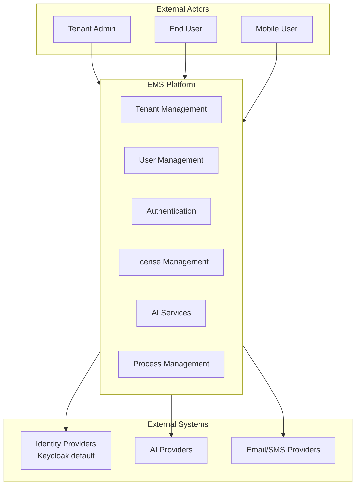
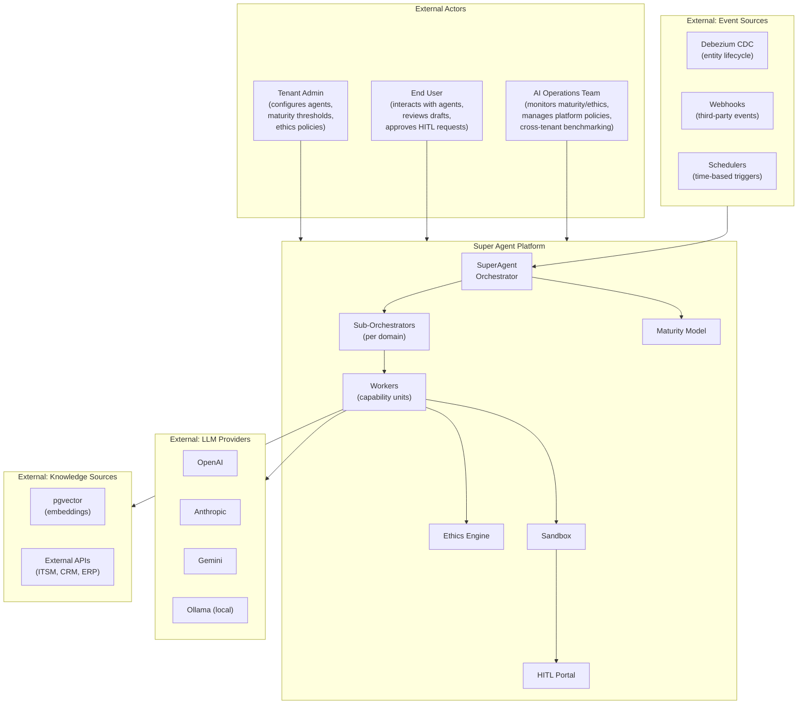
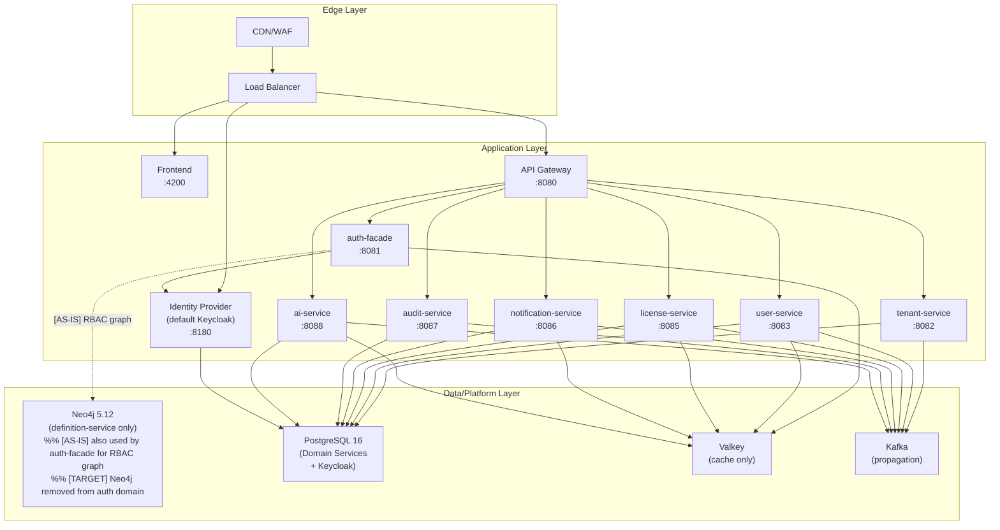
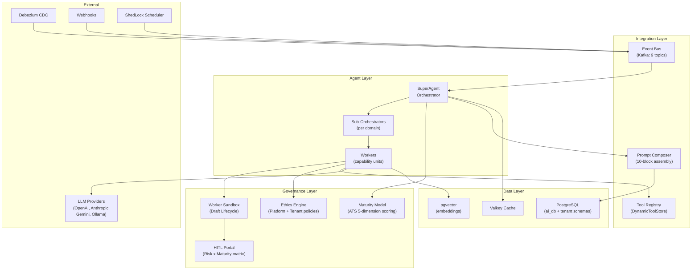

> **WP-ARCH-ALIGN (2026-03-24):** This document has been updated to reflect the frozen auth target model (Rev 2).
> See `Foundation/03-ownership-boundaries.md` SS FROZEN for the canonical decision.

# 3. Context and Scope

## 3.1 Business Context

EMS provides multi-tenant enterprise platform capabilities to tenant admins and end users while integrating with identity, AI, and notification providers.

### External Actors

> **Persona Registry:** Full persona definitions are maintained in the centralized **[TX Persona Registry](../persona/PERSONA-REGISTRY.md)**.

| Actor | Responsibility | Persona Registry Mapping |
|-------|----------------|--------------------------|
| Tenant Admin | Tenant setup, user governance, configuration | [PER-UX-003] Fiona Shaw |
| End User | Day-to-day business workflows | [PER-UX-004] Lisa Harrison |
| Mobile User | Mobile/PWA subset of platform workflows | MX channel variant of platform personas |

### External Systems

| System | Purpose | Protocol |
|--------|---------|----------|
| Keycloak | Default authentication and token issuance | OIDC / OAuth 2.0 |
| Auth0 / Okta / Azure AD | Optional provider integrations via auth abstraction | OIDC / OAuth 2.0 |
| OpenAI / Anthropic / Gemini / Ollama | AI inference and model services | HTTPS/REST |
| SMTP Provider | Email delivery | SMTP/TLS |
| SMS Gateway | SMS delivery | HTTPS/REST |

### 3.1.1 Super Agent Business Context 
The Super Agent platform transforms ai-service from a chatbot API into a hierarchical agent platform serving as an "organizational brain" per tenant.

**Super Agent External Actors:**

| Actor | Responsibility | Reference | Persona Registry Mapping |
|-------|----------------|-----------|--------------------------|
| Tenant Admin | Configures agent hierarchy, sets maturity thresholds, defines tenant-level conduct policies, manages tool permissions | ADR-023, ADR-024, ADR-027 | [PER-UX-003] Fiona Shaw |
| End User | Interacts with agents via chat, reviews worker drafts, responds to HITL approval requests, provides feedback for maturity scoring | ADR-028, ADR-030 | [PER-UX-004] Lisa Harrison |
| AI Operations Team | Monitors platform-level ethics compliance, reviews cross-tenant benchmark reports, manages platform conduct policies, handles maturity escalations | ADR-024, ADR-027 | [PER-EX-002] Oliver Kent |
| Super Agent Actors | Autonomous AI agents that operate within the platform | -- | [PER-AX-001] EMSIST AI Assistant, [PER-AX-002] Governance Audit Agent |

**Super Agent External Systems:**

| System | Purpose | Protocol | Reference |
|--------|---------|----------|-----------|
| Debezium CDC | Entity lifecycle change capture from PostgreSQL WAL; triggers agent workflows on data changes | Kafka Connect | ADR-025 |
| ShedLock Scheduler | Time-based trigger scheduling for recurring agent tasks (daily KPI, weekly compliance, monthly reports) | Internal (PostgreSQL lock table) | ADR-025 |
| External Webhooks | Third-party event ingestion from ITSM, CI/CD, ERP systems with HMAC validation | HTTPS/REST + HMAC | ADR-025 |
| Ollama (local) | Local model inference for on-premise deployments or development environments | HTTP/REST | Existing ai-service provider |

## 3.2 Technical Context

**Auth target model alignment:**

- [AS-IS] `auth-facade` connects to Neo4j for RBAC/identity graph storage. `user-service` owns user profiles, sessions, and devices.
- [TARGET] `auth-facade` is a **transition** service (then removed). Auth edge endpoints (login, token refresh, logout, MFA verify) migrate to `api-gateway`. Tenant users, RBAC, memberships, provider config, session control, revocation, and session history migrate to `tenant-service` (PostgreSQL authoritative store). `user-service` is a **transition** service (then removed); its entities migrate to `tenant-service`. Neo4j is removed from the auth target domain (remains for `definition-service` only). Keycloak is authentication only (login, MFA, token issuance, federation). Valkey is cache only (non-authoritative). Kafka is propagation only (event delivery).

Runtime scope seal (2026-03-01):

- The application-layer diagram is intentionally limited to currently deployed/routed services.
- `product-service`, `process-service`, and `persona-service` are excluded because they are not gateway-routed and not part of current deployment topology.
- Product/process/persona capabilities are modeled as tenant-scoped object instances, not standalone services.

### 3.2.1 Super Agent Technical Context 
The Super Agent platform introduces new internal technical layers within ai-service (port 8088). The architecture adds orchestration, governance, event processing, and tool execution layers on top of the existing chatbot baseline (custom WebClient providers for LLM calls, PostgreSQL + pgvector for persistence, Valkey for caching).

**Key technical boundaries:**

- **Agent Layer** (ADR-023): Three-tier hierarchy -- SuperAgent decomposes tenant-level tasks, Sub-Orchestrators plan within domain scope, Workers execute individual capabilities.
- **Governance Layer** (ADR-024, ADR-027, ADR-028, ADR-030): Maturity scoring controls autonomy gradient; Ethics Engine enforces platform + tenant conduct policies at runtime; Sandbox isolates worker outputs until approved; HITL routes approvals based on risk x maturity matrix.
- **Integration Layer** (ADR-025, ADR-029): Tool Registry enables dynamic tool binding; Prompt Composer assembles system prompts from database-stored blocks with token budgeting; Event Bus consumes CDC, webhook, scheduler, and user-initiated events.
- **Data Layer** (ADR-026): Schema-per-tenant isolation within `ai_db` for agent data; shared schemas for platform-level configuration and cross-tenant benchmarks (k >= 5 anonymization).

### Interface Matrix

| Interface | Type | Security | Status |
|-----------|------|----------|--------|
| Public API | HTTPS/REST | JWT bearer tokens |  |
| Identity Provider Endpoints | OIDC/OAuth 2.0 | Provider-specific credentials |  |
| AI Provider APIs | HTTPS/REST | API keys |  |
| Notification Providers | SMTP/HTTPS | Provider credentials |  |
| Internal Events | Kafka | Service identity + network controls | |
| Agent-to-LLM | HTTPS/REST (Spring AI ChatClient) | API keys + tenant isolation | |
| Agent-to-Agent (internal) | In-process method calls | Tenant-scoped context propagation | |
| Event Bus (Kafka) | Kafka producer/consumer (9 topics) | Service identity + topic ACLs | |
| CDC Source | Debezium Kafka Connect | Database credentials + schema filtering | |
| HITL Portal | WebSocket/SSE to Angular frontend | JWT + role-based access (HITL_REVIEWER role) | |
| Tool Execution | Dynamic tool binding via Spring AI | Sandbox isolation + audit trail | |

---

## Changelog

| Timestamp | Change | Author |
|-----------|--------|--------|
| 2026-03-08 | Wave 2-3: Added Super Agent business context diagram (3.1.1), technical context diagram (3.2.1), external interface matrix with items (Ollama, Debezium, Schema Registry) | ARCH Agent |
| 2026-03-09T14:30Z | Wave 6 (Final completeness): Verified all Super Agent external interfaces documented in C4 context. All tags accurate. Zero TODOs, TBDs, or placeholders. Changelog added. | ARCH Agent |

---

**Previous Section:** [Constraints](./02-constraints.md)
**Next Section:** [Solution Strategy](./04-solution-strategy.md)
