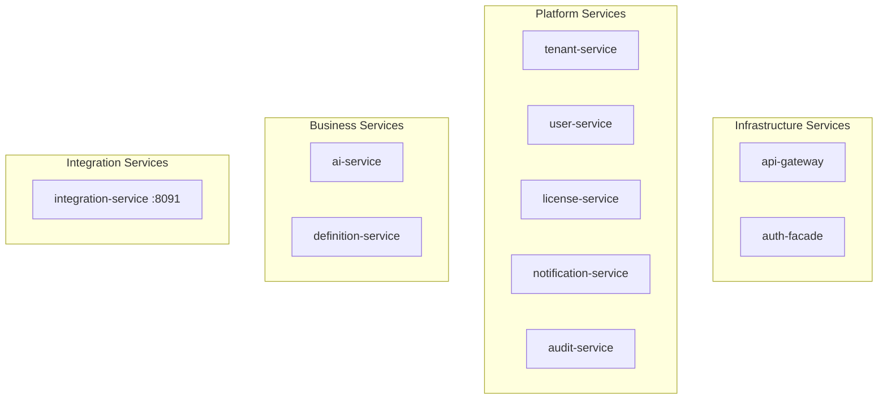
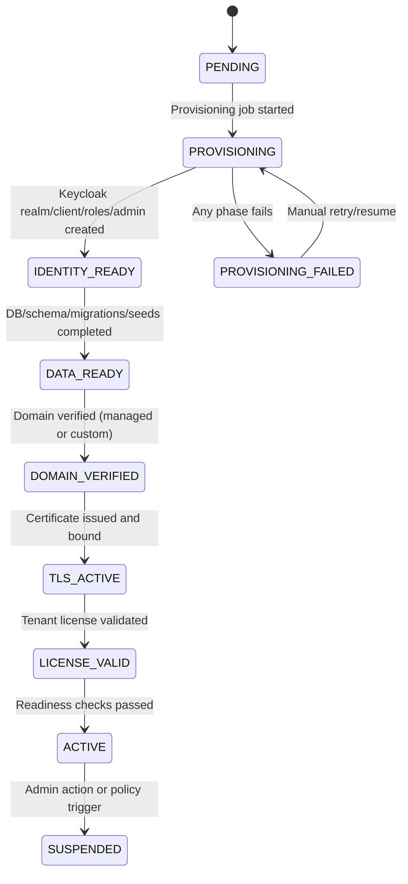
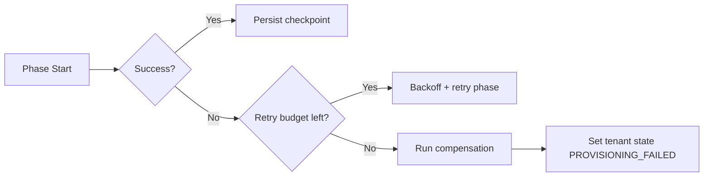
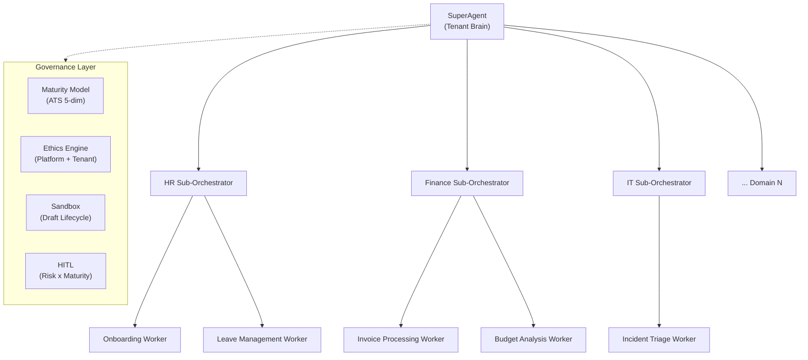

> **WP-ARCH-ALIGN (2026-03-24):** This document has been updated to reflect the frozen auth target model (Rev 2).
> See `Foundation/03-ownership-boundaries.md` SS FROZEN for the canonical decision.

# 4. Solution Strategy

## 4.1 Strategy Principles

- Polyglot persistence: [AS-IS] Neo4j for RBAC/identity graph (auth-facade) and definition-service metamodel, PostgreSQL for relational domain services (per ADR-001, amended). [TARGET] Neo4j for definition-service only. Auth RBAC/identity data migrates to tenant-service PostgreSQL. auth-facade is removed after migration.
- Separate identity internals from application data: PostgreSQL is used by both Keycloak and domain services, but with isolated logical databases.
- Keep authentication extensible: provider abstraction with Keycloak as default provider.
- Enforce UUID-first tenant contracts: all external tenant-scoped headers, paths, and query params use tenant UUID as the canonical identifier.
- Use bounded-context service decomposition for independent deployment.
- Favor explicit observability and cache strategy for predictable runtime behavior.
- Hierarchical agent orchestration: one SuperAgent per tenant orchestrates domain sub-orchestrators and capability workers (section 9.7.1)
- Maturity-gated autonomy: Agent Trust Score across 5 dimensions determines review authority and operational freedom (section 9.7.2)
- Event-driven intelligence: entity lifecycle (Debezium CDC), scheduled, external webhook, and workflow events trigger agent tasks (section 9.7.3)
- Integration governance: dedicated integration-service centralizes external tool sync, tenant-to-tenant sharing, and agent channel governance (section 9.8.1)

## 4.2 Technology Decisions

| Domain | Decision | Why |
|--------|----------|-----|
| Backend runtime | Java 23 + Spring Boot 3.4.1 | Stable ecosystem and strong service tooling |
| Frontend framework | Angular 21+ | Enterprise-ready SPA architecture |
| Frontend component library | PrimeNG 21 (unstyled mode with design tokens) | 80+ enterprise components, Angular-native, RTL support, runtime-switchable theming preserving ThinkPLUS design system (ADR-012) |
| Mobile strategy | Phased PWA then Capacitor | Code reuse from Angular, UAE Pass mobile integration, foldable device support (ADR-013) |
| RBAC/Identity database | [AS-IS] Neo4j 5.12 Community (auth-facade, definition-service). [TARGET] Neo4j for definition-service metamodel only. Auth RBAC/identity migrates to tenant-service PostgreSQL. | [AS-IS] Graph-native recursive role/group traversal, metamodel graph. [TARGET] Metamodel graph only; RBAC resolved from PostgreSQL relational model in tenant-service. |
| Domain services database | PostgreSQL 16 (7 services + Keycloak) | Relational integrity, Flyway migrations, CHECK constraints, `@Version` locking, pgvector (ai-service) |
| Distributed cache | Valkey 8 (single-tier) | Low-latency distributed cache, token blacklist, session state |
| Messaging | Kafka | Asynchronous integration backbone |
| Authentication model | Provider-agnostic BFF with Keycloak default | Extensibility with stable default runtime |
| Integration governance | Dedicated integration-service (port 8091) | Centralized connector registry, sync engine, mapping studio, agent channel governance (ADR-033) |
| LLM integration | Spring AI 1.0+ ChatClient with ReAct agent loop | Standardized tool binding, model-agnostic |
| Agent orchestration | SuperAgent -> SubOrchestrator -> Worker hierarchy | Single organizational brain per tenant with domain specialization |
| Event triggers | Debezium CDC + ShedLock scheduler + webhook receiver | 4 event sources activate agent tasks |
| Prompt composition | Dynamic 10-block system prompt assembly | Runtime prompt built from priority-weighted blocks with token budget management |

Reference: Section 09 (Architecture Decisions) for full rationale and alternatives considered.

## 4.3 Architecture Patterns

| Pattern | Application |
|---------|-------------|
| BFF (Backend for Frontend) | [AS-IS] `auth-facade` hides provider protocol complexity from UI clients. [TARGET] `api-gateway` absorbs auth edge endpoints after `auth-facade` removal. |
| Strategy Pattern | `IdentityProvider` abstraction for pluggable identity providers |
| Microservices by domain | Independent service deployment and ownership boundaries |
| Event-driven integration | Kafka-based async communication for decoupling |
| Distributed caching | Valkey single-tier for hot paths (role cache, seat validation, token blacklist) |
| Integration governance hub | Dedicated `integration-service` centralizes connector lifecycle, sync engine, mapping, and agent channel governance (ADR-033) |
| Design token theming | PrimeNG unstyled mode with ThinkPLUS `--tp-*` CSS custom properties for runtime per-tenant branding |
| Hierarchical orchestration | SuperAgent dispatches to domain sub-orchestrators which delegate to workers |
| Worker sandbox lifecycle | DRAFT -> UNDER_REVIEW -> APPROVED -> COMMITTED with maturity-dependent review authority |
| HITL approval matrix | Risk x maturity determines 4 interaction types: confirmation, data entry, review, takeover |
| Ethics enforcement pipeline | Platform baseline (immutable) + tenant conduct policies evaluated per-request |
| Dynamic prompt composition | 10-block template assembly with Handlebars, token budget overflow handling |

## 4.4 Service Decomposition Strategy

`license-service` remains an independent service. The architectural direction for future consolidation with tenant-service is documented in section 9.4.2.
`integration-service` serves as the integration and communication governance hub, centralizing connector management, sync orchestration, and agent channel governance (section 9.8.1).
Product/process/persona domains are currently treated as tenant-scoped object instances rather than standalone microservices.

## 4.5 Quality Goal Tactics

| Quality Goal | Strategy |
|--------------|----------|
| Security | Tenant-scoped queries, strong auth boundaries, immutable auditing |
| Performance | Cache-first reads, optimized queries (Cypher for Neo4j, JPA/SQL for PostgreSQL), async integration |
| Scalability | Stateless services + horizontal scale, Kafka decoupling [PLANNED] |
| Maintainability | ADR-governed architecture, clear service ownership, docs quality gates |

## 4.6 Tenant Provisioning Strategy [TARGET STATE]

- Tenant creation is a control-plane workflow, not a single synchronous transaction.
- `POST /api/tenants` persists tenant metadata in `PENDING/PROVISIONING` and creates a provisioning job.
- Provisioning is executed asynchronously in idempotent phases with checkpoint/retry.
- Non-master tenants are promoted to `ACTIVE` only after identity, data, domain, TLS, and license validation checks pass.

Provisioning ownership boundaries:

- Inside EMSIST control: tenant metadata, provisioning orchestration, realm/bootstrap automation, migration/seeding, license gating, readiness gating.
- Outside EMSIST control: customer-owned DNS zone updates and external CA/DNS provider execution for custom domains.

### 4.6.1 Provisioning State Control Table [TARGET STATE]

| State | Entry Condition | Exit Condition | Allowed Next States | Auth/API Behavior |
|------|-----------------|----------------|---------------------|-------------------|
| `PENDING` | Tenant record created | Worker starts job | `PROVISIONING` | Tenant cannot authenticate |
| `PROVISIONING` | Job execution started | All phase checkpoints complete OR phase failure | `ACTIVE`, `PROVISIONING_FAILED` | Tenant cannot authenticate |
| `PROVISIONING_FAILED` | Any phase exhausted retry budget or terminal error | Manual retry/resume requested | `PROVISIONING` | Tenant cannot authenticate |
| `ACTIVE` | Identity + data + domain + TLS + license checks passed | Admin/policy suspension trigger | `SUSPENDED` | Tenant can authenticate and call business APIs |
| `SUSPENDED` | Admin/policy action after active state | Explicit reactivation workflow | `PROVISIONING`, `ACTIVE` | Tenant authentication/business access blocked per suspension policy |

### 4.6.2 Phase Retry and Compensation Policy [TARGET STATE]

| Phase | Timeout | Retry Policy | Compensation on Terminal Failure |
|------|---------|--------------|----------------------------------|
| Identity bootstrap (realm/client/roles/admin) | 2 min | 5 retries, exponential backoff | Delete partially created realm/client artifacts or mark as orphaned for cleanup |
| Data bootstrap (schema/migrations/seeds) | 5 min | 3 retries, linear backoff | Rollback tenant bootstrap transaction boundary where possible; keep forensic logs |
| Domain verification | 10 min | 12 retries, fixed interval | Keep tenant in failed state with actionable DNS proof instructions |
| TLS binding | 10 min | 6 retries, exponential backoff | Revoke pending certificate request and remove incomplete route bindings |
| License validation | 1 min | 5 retries, exponential backoff | Mark provisioning failed with `LICENSE_INVALID_OR_MISSING` reason |
| Final readiness checks | 1 min | 3 retries, fixed interval | Keep tenant non-active and preserve last successful checkpoint |

Operational rules:

- Every phase uses idempotency key: `{tenantUuid}:{jobId}:{phase}`.
- Retries resume from the last persisted checkpoint, not from phase zero.
- Max retry exhaustion transitions tenant to `PROVISIONING_FAILED`.
- `ACTIVE` promotion is atomic and allowed only after all mandatory checkpoints pass.

## 4.7 Encryption Strategy
Three-tier encryption covering data at rest, data in transit, and configuration secrets.

| Tier | Scope | Mechanism |
|------|-------|-----------|
| **Tier 1: Volume encryption** | All data stores (PostgreSQL, Neo4j, Valkey, Kafka) | LUKS/FileVault for Docker Compose (dev/staging), encrypted StorageClass PVs for Kubernetes (production) |
| **Tier 2: In-transit TLS** | All service-to-datastore connections | PostgreSQL `sslmode=verify-full`, Neo4j `bolt+s://`, Valkey `--tls-port`, Kafka `SASL_SSL` |
| **Tier 3: Config encryption** | Sensitive `application.yml` values (passwords, API keys, client secrets) | Jasypt `PBEWITHHMACSHA512ANDAES_256` with `ENC()` property values, decrypted at startup via `JASYPT_PASSWORD` env var |

Reference: [section 9.5.2](./09-architecture-decisions.md#952-encryption-at-rest-strategy-adr-019).

## 4.8 Credential Management
Per-service database users with least-privilege access, replacing the current shared `postgres` superuser.

| Principle | Description |
|-----------|-------------|
| **Per-service isolation** | Each service authenticates to PostgreSQL with a dedicated user (e.g., `svc_tenant`, `svc_user`, `svc_audit`) that can only access its own database |
| **SCRAM-SHA-256 authentication** | All PostgreSQL users use SCRAM-SHA-256 (strongest native auth method), not MD5 |
| **No hardcoded defaults** | `application.yml` files reference `${DATABASE_USER}` and `${DATABASE_PASSWORD}` without fallback defaults -- missing credentials cause fail-fast startup failure |
| **Externalized credentials** | All credentials stored in `.env` files (dev/staging, gitignored) or Kubernetes Secrets (production), never in source code |
| **Append-only audit** | `svc_audit` user has `INSERT` and `SELECT` only -- no `UPDATE` or `DELETE` on audit tables |

Reference: [section 9.5.3](./09-architecture-decisions.md#953-service-credential-management-adr-020).

## 4.9 Deployment Modes
Two deployment modes support different operational requirements across environments.

| Mode | Environments | Topology | Data Durability |
|------|-------------|----------|-----------------|
| **Docker Compose** | Dev, Staging | Single-instance containers with named volumes; automated backup scripts (`pg_dump`, `neo4j-admin dump`, Valkey `BGSAVE`) | Backup-based recovery; no replication |
| **Kubernetes with operators** | Production | Operator-managed replicated clusters (CloudNativePG, Neo4j Helm, Valkey Sentinel, Kafka with KRaft) | Synchronous replication, automated failover, encrypted PVs |

Phased rollout:

1. **Phase 1 (immediate):** Automated backup scripts for Docker Compose environments. Volume protection guards.
2. **Phase 2 (Q2-Q3 2026):** Kubernetes migration with operator-managed HA for all stateful components.
3. **Phase 3 (Q4 2026+):** Multi-region active-passive DR with cross-region database replication.

Reference: [section 9.5.4](./09-architecture-decisions.md#954-high-availability-and-multi-tier-architecture-adr-018).

## 4.10 Super Agent Platform Strategy
The Super Agent platform introduces a hierarchical agent orchestration model where each tenant has a single organizational brain (SuperAgent) that delegates work through domain-specialized sub-orchestrators to capability workers. No Super Agent code exists today; the current ai-service is a simple chatbot API with RAG support.

### 4.10.1 Maturity Levels
The Agent Trust Score (ATS) is computed across 5 dimensions (see [section 9.7.2](./09-architecture-decisions.md#972-agent-maturity-model-adr-024)) and determines the agent's operational autonomy:

| Dimension | Weight | Description |
|-----------|--------|-------------|
| **Identity** | 20% | Configuration integrity, versioning, template adherence |
| **Competence** | 25% | Task completion accuracy, domain expertise, tool proficiency |
| **Reliability** | 25% | Consistency over time, availability, response latency |
| **Compliance** | 15% | Ethics policy adherence, data handling rules, regulatory requirements |
| **Alignment** | 15% | Organizational goal alignment, user satisfaction, feedback |

| Level | ATS Range | Autonomy | Review Authority |
|-------|-----------|----------|------------------|
| **Coaching** | 0-39 | All actions require human approval | Human reviews every decision |
| **Co-pilot** | 40-64 | Routine actions auto-approved, novel actions reviewed | Human reviews non-routine decisions |
| **Pilot** | 65-84 | Most actions autonomous, high-risk still reviewed | Human reviews only high-risk actions |
| **Graduate** | 85-100 | Full autonomy with audit trail | Post-hoc audit only |

### 4.10.2 Reference

Full rationale and alternatives for all Super Agent decisions are in [section 9.7](./09-architecture-decisions.md#97-super-agent-platform-adr-023-through-adr-030).

---

## Changelog

| Timestamp | Change | Author |
|-----------|--------|--------|
| 2026-03-08 | Wave 2-3: Added Super Agent Platform Strategy (4.10) with maturity-driven architecture, progressive autonomy, and ADR cross-reference table | ARCH Agent |
| 2026-03-09T14:30Z | Wave 6 (Final completeness): Verified all Super Agent strategies described with ADR references. Changelog added. | ARCH Agent |
| 2026-03-17 | ADR consolidation: added PrimeNG (ADR-012), mobile strategy (ADR-013), integration-service (ADR-033), COTS deployment (ADR-032). Removed status/action language. Updated ADR references to point to section 09. | ARCH Agent |

---

**Previous Section:** [Context and Scope](./03-context-scope.md)
**Next Section:** [Building Blocks](./05-building-blocks.md)
