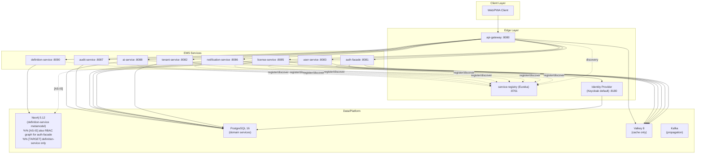
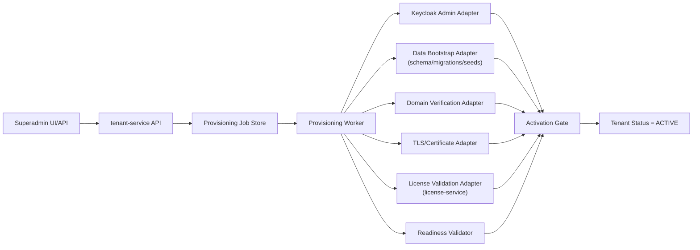
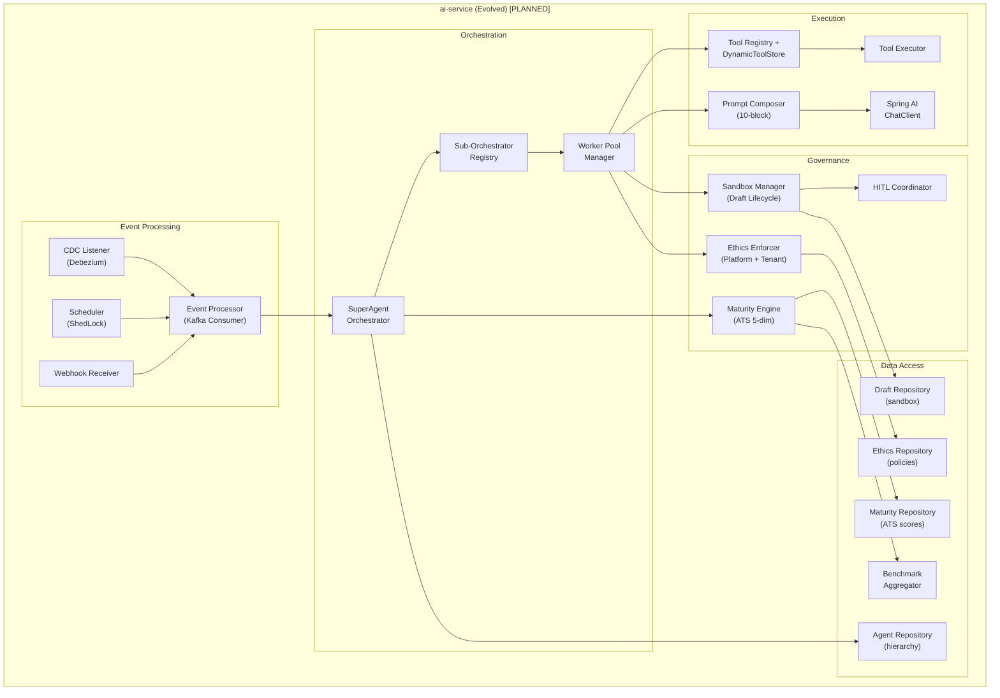
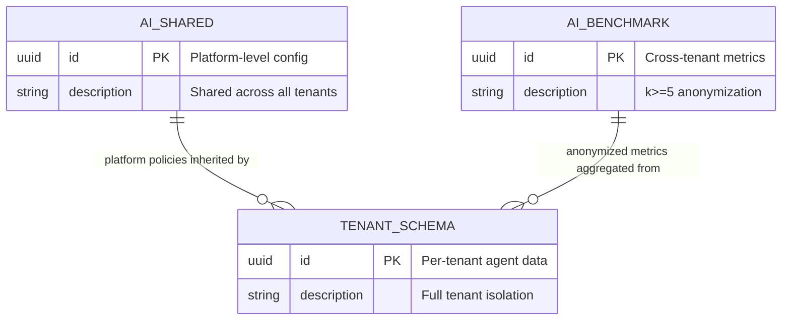
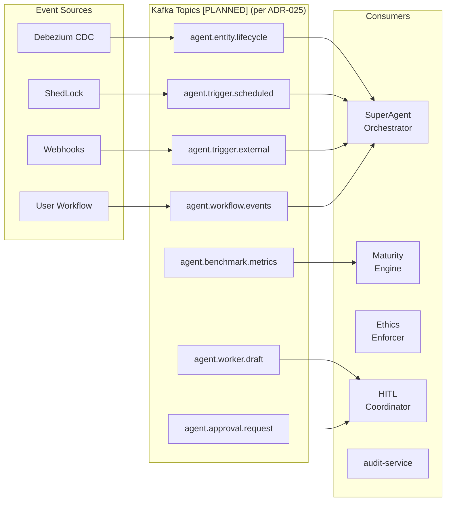

> **WP-ARCH-ALIGN (2026-03-24):** This document has been updated to reflect the frozen auth target model (Rev 2).
> See `Foundation/03-ownership-boundaries.md` SS FROZEN for the canonical decision.

# 5. Building Blocks

## 5.0 Sealed Runtime Baseline (2026-03-01)

This section is sealed to the current deployable runtime topology.

- Active runtime services: `service-registry (eureka)`, `api-gateway`, `auth-facade`, `tenant-service`, `user-service`, `license-service`, `notification-service`, `audit-service`, `ai-service`, `definition-service`.
- Dormant modules outside runtime scope: `product-service`, `process-service`, `persona-service`.

**Evidence (verified 2026-03-01, updated 2026-03-06):**
- `backend/pom.xml` contains `eureka-server`, `product-service`, `process-service`, and `persona-service` modules.
- `backend/eureka-server/src/main/java/com/ems/registry/EurekaServerApplication.java` — `@EnableEurekaServer` confirmed. Tests pass: 3/3 (`mvn test` 2026-03-06).
- `backend/api-gateway/src/main/java/com/ems/gateway/config/RouteConfig.java` has no route entries for `product-service`, `process-service`, or `persona-service`.
- `docker-compose.dev-app.yml` and `docker-compose.staging-app.yml` define active runtime containers and exclude `product-service`, `process-service`, and `persona-service`.
- `backend/product-service/` and `backend/persona-service/` contain `pom.xml` and build artifacts, but no `src/` tree.
- `backend/process-service/` contains source code but is intentionally kept out of active runtime scope.

## 5.1 Level 1: System Overview



## 5.2 Building Block Responsibilities

| Building Block | Responsibility |
|----------------|----------------|
| API Gateway | External entry point, routing, shared request controls |
| Service Registry (Eureka) `[IMPLEMENTED]` | Service registration and discovery for runtime routing. Port 8761. All active services configured as Eureka clients. Service-to-service Feign discovery: `[IN-PROGRESS]`. |
| auth-facade | [AS-IS] BFF authentication orchestration, provider abstraction, token/session orchestration. [TRANSITION] Responsibilities migrate to api-gateway (auth edge endpoints) and tenant-service (data/policy). Service is removed after migration. |
| tenant-service | Tenant lifecycle, domains, branding, tenant security settings, provisioning orchestration (control-plane) [TARGET STATE]. [TARGET] Also: tenant users, RBAC, memberships, provider config, session control, revocation, session history (migrated from auth-facade and user-service). PostgreSQL is the authoritative store. |
| user-service | [AS-IS] User profile, device, and session management. [TRANSITION] Entities migrate to tenant-service. Service is removed after migration. |
| license-service | License catalog, tenant license allocation, user seat assignment, feature gates |
| notification-service | Template and channel delivery orchestration |
| audit-service | Immutable audit event ingestion and query/export |
| ai-service | Agent and conversation orchestration, RAG workflows (pgvector). **[PLANNED] Super Agent transformation:** SuperAgent orchestrator, sub-orchestrator registry, worker pool, tool registry, prompt composer, maturity engine, ethics enforcer, sandbox manager, HITL coordinator, event processor (ADR-023 through ADR-030). |
| definition-service | Master definitions/catalog endpoints backed by Neo4j |
| integration-service | Integration and communication governance hub: connector registry, sync engine, mapping studio, webhook handling, agent channel governance. Database: PostgreSQL (`integration` schema). Port 8091. See [section 9.8.1](./09-architecture-decisions.md#981-integration-governance-hub-adr-033). |
| Tenant domain objects (`product`, `process`, `persona`) | Tenant-scoped business objects handled inside regular-tenant domain model (not standalone services) |

## 5.3 Data Ownership

| Service | Primary Data | Database |
|---------|--------------|----------|
| auth-facade | [AS-IS] Provider/realm configuration, RBAC graph (roles, groups, users), auth session metadata | [AS-IS] Neo4j. [TARGET] Data migrates to tenant-service PostgreSQL (`master_db`). auth-facade is removed. |
| tenant-service | Tenant, domain, branding, tenant security configuration, provisioning job state [TARGET STATE] | PostgreSQL (`master_db`) |
| user-service | [AS-IS] User profile, session, and device entities. [TRANSITION] Migrates to tenant-service. | [AS-IS] PostgreSQL (`user_db`). [TARGET] PostgreSQL (`master_db`) under tenant-service ownership. |
| license-service | Tenant licenses, products/features, seat assignments | PostgreSQL (`license_db`) |
| notification-service | Notification templates, delivery metadata | PostgreSQL (`notification_db`) |
| audit-service | Audit events and compliance metadata | PostgreSQL (`audit_db`) |
| ai-service | Agents, conversations, messages, knowledge embeddings (pgvector) | PostgreSQL (`ai_db`) |
| ai-service [PLANNED] | SuperAgent hierarchy (agents, sub-orchestrators, workers), worker drafts (sandbox lifecycle), maturity scores (ATS 5-dimension), ethics policies (platform + tenant conduct), benchmark metrics (cross-tenant anonymized), tool registry, prompt blocks (10-block composition) | PostgreSQL (`ai_db` with schema-per-tenant + `ai_shared` schema for platform config + `ai_benchmark` schema for cross-tenant metrics) -- see ADR-026 |
| definition-service | Master definition graph nodes and metadata | Neo4j |
| integration-service | Connector registry, sync profiles, mapping versions, sync run history, webhook receipts, agent channel registrations, policy configuration | PostgreSQL (`integration` schema) |
| Tenant-scoped objects (`product`, `process`, `persona`) | Object instances attached to regular tenants | PostgreSQL (`master_db`) [TARGET STATE] |
| Keycloak | Realms, users, sessions, client configs (internal to Keycloak) | PostgreSQL (`keycloak_db`) |

Authoritative data-platform rule per [section 9.1.1](./09-architecture-decisions.md#911-polyglot-persistence-adr-001-adr-016): [AS-IS] Neo4j for RBAC/identity graph (auth-facade, definition-service), PostgreSQL for all relational domain services. [TARGET] Neo4j for definition-service metamodel only. Auth RBAC/identity data migrates to tenant-service PostgreSQL. See section 9.1.1 for database selection criteria.

## 5.4 Internal Structure Pattern

All services follow a consistent layered structure:

```text
{service}/src/main/java/com/ems/{service}/
├── controller/
├── service/
├── repository/
├── entity/
├── dto/
├── mapper/
├── config/
├── exception/
└── event/           # optional
```

## 5.5 Service Matrix

| Service | Port | Database | Logical DB | Cache | Events | Runtime Status |
|---------|------|----------|------------|-------|--------|----------------|
| api-gateway | 8080 | — | — | Valkey (rate-limit/session edge state) | — | Active |
| service-registry (eureka) | 8761 | — | — | — | — | Active `[IMPLEMENTED]` |
| auth-facade | 8081 | [AS-IS] Neo4j | [AS-IS] — (graph) | Valkey | Kafka | [TRANSITION] Active; migrating to api-gateway + tenant-service |
| tenant-service | 8082 | PostgreSQL | `master_db` | — | Kafka | Active |
| user-service | 8083 | PostgreSQL | `user_db` | Valkey | Kafka | [TRANSITION] Active; entities migrating to tenant-service |
| license-service | 8085 | PostgreSQL | `license_db` | Valkey | Kafka | Active |
| notification-service | 8086 | PostgreSQL | `notification_db` | Valkey | Kafka | Active |
| audit-service | 8087 | PostgreSQL | `audit_db` | — | Kafka | Active |
| ai-service | 8088 | PostgreSQL + pgvector | `ai_db` | Valkey | Kafka | Active. **[PLANNED]** transformation: schema-per-tenant isolation (ADR-026), Kafka event consumption (7 topics per ADR-025), Debezium CDC, ShedLock scheduler, Spring AI ChatClient (replacing custom WebClient providers). |
| definition-service | 8090 | Neo4j | — (graph) | — | Kafka | Active |
| integration-service | 8091 | PostgreSQL | `integration` | — | Kafka (CloudEvents outbox) | Defined (section 9.8.1) |

### 5.5.1 Dormant Module Inventory (Not in Runtime Scope)

| Module | Module Exists in Build | Routed by Gateway | Deployed in Compose/K8s Topology | Runtime Status |
|--------|-------------------------|-------------------|------------------------------------|----------------|
| product-service | Yes | No | No | Dormant placeholder |
| process-service | Yes | No | No | Dormant (kept aside) |
| persona-service | Yes | No | No | Dormant placeholder |

## 5.6 Tenant Provisioning Control Plane [TARGET STATE]



Control-plane implementation rule:

- Phase 1: implemented inside `tenant-service` as asynchronous worker modules.
- Phase 2 (optional): extracted into a dedicated provisioning service only if scale/operational complexity requires it.
- Non-master tenant activation gate: provisioning can finalize only when `license-service` confirms a valid tenant license.

## 5.7 Data Ownership: Encryption and Service Accounts [PLANNED]

This section documents the target-state encryption posture and per-service database credentials for every data store. All items are **[PLANNED]** unless marked otherwise.

Reference: [section 9.5.2](./09-architecture-decisions.md#952-encryption-at-rest-strategy-adr-019) (encryption), [section 9.5.3](./09-architecture-decisions.md#953-service-credential-management-adr-020) (credentials).

| Service | Database | Encryption at Rest | TLS In-Transit | Service Account | Status |
|---------|----------|-------------------|----------------|-----------------|--------|
| tenant-service | `master_db` (PostgreSQL) | [PLANNED] Volume-level (LUKS / encrypted PV) | [IMPLEMENTED] `sslmode=verify-full` | [PLANNED] `svc_tenant` | PLANNED |
| user-service | `user_db` (PostgreSQL) | [PLANNED] Volume-level | [IMPLEMENTED] `sslmode=verify-full` | [PLANNED] `svc_user` | PLANNED |
| license-service | `license_db` (PostgreSQL) | [PLANNED] Volume-level | [IMPLEMENTED] `sslmode=verify-full` | [PLANNED] `svc_license` | PLANNED |
| notification-service | `notification_db` (PostgreSQL) | [PLANNED] Volume-level | [IMPLEMENTED] `sslmode=verify-full` | [PLANNED] `svc_notify` | PLANNED |
| audit-service | `audit_db` (PostgreSQL) | [PLANNED] Volume-level | [IMPLEMENTED] `sslmode=verify-full` | [PLANNED] `svc_audit` (INSERT/SELECT only) | PLANNED |
| ai-service | `ai_db` (PostgreSQL + pgvector) | [PLANNED] Volume-level | [MISSING] no `sslmode` parameter | [PLANNED] `svc_ai` | PLANNED |
| process-service | `process_db` (PostgreSQL) | [PLANNED] Volume-level | [IMPLEMENTED] `sslmode=verify-full` | [PLANNED] `svc_process` | PLANNED |
| auth-facade | [AS-IS] Neo4j (graph). [TARGET] Removed -- data migrates to tenant-service PostgreSQL. | [PLANNED] Volume-level | [PLANNED] `bolt+s://` (currently plaintext `bolt://`) | `neo4j` (Neo4j built-in user) | [TRANSITION] PLANNED until auth-facade removal |
| auth-facade | Valkey (cache) | [PLANNED] Volume-level | [PLANNED] TLS (`--tls-port`) | N/A (AUTH password) | PLANNED |
| keycloak | `keycloak_db` (PostgreSQL) | [PLANNED] Volume-level | [PLANNED] `sslmode=verify-full` | [PLANNED] `kc_db_user` (currently `keycloak` user exists) | PLANNED |

**Evidence (current state):**

- PostgreSQL `sslmode=verify-full` confirmed in 6 service `application.yml` files (tenant, user, license, notification, audit, process).
- ai-service JDBC URL has no `sslmode` parameter: `/backend/ai-service/src/main/resources/application.yml` line 9.
- Neo4j connection uses plaintext `bolt://`: `/backend/auth-facade/src/main/resources/application.yml` line 28.
- Valkey connections have no TLS configuration: `/backend/auth-facade/src/main/resources/application.yml` lines 16-20.
- All 7 PostgreSQL services use shared `postgres` superuser: e.g., `/backend/tenant-service/src/main/resources/application.yml` line 10 (`${DATABASE_USER:postgres}`).
- Only `keycloak` has a dedicated database user: `/infrastructure/docker/init-db.sql` lines 16-26.

## 5.8 Frontend UI Building Blocks

Frontend runtime uses PrimeNG 21 with a ThinkPlus neumorphic preset as the active design system. A dedicated `emisi-ui` library is planned but not yet available.

| Building Block | Responsibility | Location | Status |
|----------------|----------------|----------|--------|
| Shell App | Routing, feature composition, backend integration, tenant-aware UX | `frontend/src/app` | [IMPLEMENTED] |
| ThinkPlus Preset | PrimeNG 21 neumorphic theme preset with `--tp-*` CSS custom properties | `frontend/src/app/core/theme/thinkplus-preset.ts` | [IMPLEMENTED] |
| `--tp-*` CSS Tokens | Brand colors, spacing, elevation, radius tokens consumed by shell and feature components | `frontend/src/styles.scss`, layout and feature `.scss` files | [IMPLEMENTED] |
| Advanced CSS Governance Layer | Shared cross-cutting CSS rules for feature detection, input modality, orientation tokens, accessibility utilities, and print behavior | `frontend/src/app/core/theme/advanced-css-governance.scss` | [IMPLEMENTED] |
| EMISI UI Library (`emisi-ui`) | Planned: brand tokens (`--emisi-*`), reusable primitives, accessibility utilities | `frontend/projects/emisi-ui` (deleted -- does not exist) | [PLANNED] |
| `--emisi-*` CSS Tokens | Planned: migration target token namespace to replace `--tp-*` tokens | -- (not yet created) | [PLANNED] |
| PrimeNG Theme Bridge | Will map `--tp-*` to `--emisi-*` tokens during migration | `frontend/src/styles.scss` (future) | [PLANNED] |

**Evidence (verified 2026-03-01):**
- ThinkPlus preset exists at `frontend/src/app/core/theme/thinkplus-preset.ts`
- `--tp-*` tokens are actively used in 5 files under `frontend/src/`
- Advanced CSS governance layer exists at `frontend/src/app/core/theme/advanced-css-governance.scss` and is imported from `frontend/src/styles.scss`
- `--emisi-*` tokens have zero references in the codebase
- `frontend/projects/emisi-ui/` directory does not exist (deleted)

UI composition rules:

- Current: pages and components consume `--tp-*` tokens from the ThinkPlus preset.
- Target: when `emisi-ui` library is created, new pages/components should consume `--emisi-*` tokens instead of introducing page-local token systems.
- Migration: `--tp-*` token usage will progressively map to `--emisi-*` tokens once the library is available.

## 5.9 Super Agent Building Blocks [PLANNED]

All content in this section is **[PLANNED]**. The current ai-service (port 8088, `ai_db`) is a simple chatbot API with static agent configurations (`AgentEntity` = name, systemPrompt, provider, model), custom WebClient LLM providers (OpenAI, Anthropic, Gemini, Ollama), PostgreSQL + pgvector for RAG, and Valkey caching. Zero Super Agent code exists.

This section defines the Level 2 decomposition of the planned Super Agent transformation of ai-service, per ADR-023 through ADR-030.

### 5.9.1 Component Overview [PLANNED]



### 5.9.2 Component Responsibility Table [PLANNED]

| Component | Responsibility | Key Interfaces | Database | Reference |
|-----------|---------------|----------------|----------|-----------|
| SuperAgent Orchestrator | Tenant-level task decomposition, sub-orchestrator dispatch, top-level planning | Sub-Orchestrator Registry, Maturity Engine, Event Processor | `ai_db.{tenant_schema}` | ADR-023 |
| Sub-Orchestrator Registry | Domain-scoped orchestrator registration and lookup (EA, GRC, BSC, KM, ITIL domains) | Worker Pool Manager, SuperAgent Orchestrator | `ai_db.{tenant_schema}` | ADR-023 |
| Worker Pool Manager | Worker lifecycle, capability matching, load balancing, delegation to individual workers | Tool Registry, Prompt Composer, Sandbox Manager | `ai_db.{tenant_schema}` | ADR-023 |
| Tool Registry + DynamicToolStore | Tool definition storage, discovery, dynamic binding to workers at runtime | Tool Executor | `ai_db.ai_shared` (platform tools) + `ai_db.{tenant_schema}` (tenant tools) | ADR-023 |
| Tool Executor | Sandboxed tool invocation with audit trail, timeout enforcement, output capture | External systems via tool adapters | -- (stateless) | ADR-028 |
| Prompt Composer (10-block) | Dynamic system prompt assembly from database-stored blocks with token budget management and priority ordering | Agent Repository, Valkey (prompt cache, TTL 5 min) | `ai_db.{tenant_schema}` (prompt_blocks, prompt_compositions) | ADR-029 |
| Spring AI ChatClient | LLM provider abstraction with ReAct agent loop, replacing current custom WebClient providers | LLM Providers (OpenAI, Anthropic, Gemini, Ollama) | -- (stateless) | ADR-023 |
| Maturity Engine (ATS 5-dim) | Agent Trust Score calculation across 5 dimensions: task success, output quality, ethics compliance, tool reliability, user satisfaction | Benchmark Aggregator, Maturity Repository | `ai_db.{tenant_schema}` (per-tenant scores) + `ai_db.ai_benchmark` (cross-tenant anonymized) | ADR-024 |
| Ethics Enforcer | Per-request conduct policy evaluation (target < 100ms); layered: immutable platform rules + configurable tenant extensions | Ethics Repository | `ai_db.ai_shared` (platform policies) + `ai_db.{tenant_schema}` (tenant policies) | ADR-027 |
| Sandbox Manager (Draft Lifecycle) | DRAFT -> UNDER_REVIEW -> APPROVED -> COMMITTED state machine for worker outputs; revision loop support | HITL Coordinator, Draft Repository | `ai_db.{tenant_schema}` | ADR-028 |
| HITL Coordinator | Approval routing based on risk x maturity matrix (4 types: auto-approve, confirm, review, takeover); WebSocket/SSE push to Angular | notification-service, Angular HITL Portal | `ai_db.{tenant_schema}` | ADR-030 |
| Event Processor (Kafka Consumer) | Unified Kafka consumer for all 4 event source types; routes events to SuperAgent Orchestrator | SuperAgent Orchestrator | -- (stateless, events in Kafka) | ADR-025 |
| CDC Listener (Debezium) | Entity lifecycle change detection from PostgreSQL WAL via Debezium Kafka Connect | Event Processor, Kafka | -- (reads Kafka CDC topics) | ADR-025 |
| Scheduler (ShedLock) | Time-based trigger management with distributed locking; cron expressions stored per tenant | Event Processor | PostgreSQL (ShedLock lock table in `ai_db`) | ADR-025 |
| Webhook Receiver | External system event ingestion with HMAC signature validation and payload normalization | Event Processor | -- (stateless, validated and forwarded) | ADR-025 |
| Benchmark Aggregator | Cross-tenant anonymized metric collection with k-anonymity (k >= 5); provides industry-level agent performance baselines | Maturity Engine | `ai_db.ai_benchmark` | ADR-024 |

### 5.9.3 Data Schema Layout [PLANNED]

Per ADR-026 (schema-per-tenant), the evolved ai-service uses three schema categories within `ai_db`:



| Schema | Contents | Isolation | Reference |
|--------|----------|-----------|-----------|
| `ai_shared` | Platform ethics policies, tool definitions (platform-level), LLM provider configurations, prompt block templates | Shared read-only for tenants | ADR-026, ADR-027 |
| `ai_benchmark` | Cross-tenant anonymized agent performance metrics, industry baselines | Shared with k >= 5 anonymization | ADR-024, ADR-026 |
| `tenant_{tenant_id}` (one per tenant) | Agent hierarchy (SuperAgent, sub-orchestrators, workers), conversations, messages, knowledge embeddings, worker drafts, maturity scores, tenant conduct policies, prompt blocks, prompt compositions, tool configurations (tenant-level) | Full tenant isolation via PostgreSQL schemas + JPA tenant filter | ADR-026 |

### 5.9.4 Event Topology [PLANNED]

Per ADR-025, the Super Agent platform consumes and produces events across Kafka topics. Canonical topic names are defined in [section 9.7.3](./09-architecture-decisions.md#973-event-driven-agent-triggers-adr-025).



### 5.9.5 Relationship to Current ai-service [IMPLEMENTED vs PLANNED]

| Aspect | Current State [IMPLEMENTED] | Target State [PLANNED] | Migration Path |
|--------|---------------------------|----------------------|----------------|
| Agent Model | `AgentEntity` = flat config (name, systemPrompt, provider, model) | Hierarchical: SuperAgent -> Sub-Orchestrator -> Worker with parent/child relationships | Flyway migration adding `parent_id`, `agent_type`, `hierarchy_level` columns |
| LLM Integration | Custom `WebClient` providers per LLM (OpenAI, Anthropic, Gemini, Ollama) | Spring AI `ChatClient` with unified provider abstraction and ReAct agent loop | Gradual replacement; existing providers continue working during migration |
| Prompt System | Static `systemPrompt` text field on `AgentEntity` | Dynamic 10-block composition from `prompt_blocks` table with token budgeting | New `prompt_blocks` and `prompt_compositions` tables; existing `systemPrompt` becomes a single IDENTITY block |
| Data Isolation | Single schema with `tenant_id` column discrimination | Schema-per-tenant (`tenant_{tenant_id}`) with shared platform schemas | Flyway tenant migration script creates schemas; existing data migrated per tenant |
| Event System | None (user-initiated chat only) | Kafka consumer for 4 event sources (CDC, scheduler, webhook, user) across 9 topics | New Kafka consumer configuration; existing chat flow becomes one event source type |
| Quality Control | None (all outputs delivered directly) | Sandbox lifecycle (DRAFT -> UNDER_REVIEW -> APPROVED -> COMMITTED) with HITL approval routing | New `worker_drafts` table and state machine; existing conversation flow unaffected |
| Autonomy Governance | None (all agents have equal authority) | Maturity model (Coaching -> Co-pilot -> Pilot -> Graduate) with ATS 5-dimension scoring | New `maturity_scores` and `maturity_assessments` tables; existing agents default to Coaching level |
| Ethics | None | Platform + tenant conduct policies enforced at runtime (< 100ms target) | New `ethics_policies` and `ethics_evaluations` tables; all requests pass through ethics pipeline |

---

## Changelog

| Timestamp | Change | Author |
|-----------|--------|--------|
| 2026-03-08 | Wave 2-3: Added Super Agent Building Blocks (5.9) with 15 component responsibility table, data schema layout (ER diagram), event topology, current vs planned comparison | ARCH Agent |
| 2026-03-09T14:30Z | Wave 6 (Final completeness): Verified all 15 Super Agent building blocks have descriptions and ADR references. Schema layout and event topology diagrams complete. Changelog added. | ARCH Agent |
| 2026-03-17 | ADR consolidation: added integration-service (ADR-033) to building block responsibilities, service matrix, and data ownership. Updated ADR references to section 09. | ARCH Agent |

---

**Previous Section:** [Solution Strategy](./04-solution-strategy.md)
**Next Section:** [Runtime View](./06-runtime-view.md)
