> **WP-ARCH-ALIGN (2026-03-24):** This document has been updated to reflect the frozen auth target model (Rev 2).
> See `Foundation/03-ownership-boundaries.md` SS FROZEN for the canonical decision.

# 6. Runtime View

This section documents key runtime scenarios. Strategic decisions remain in [Solution Strategy](./04-solution-strategy.md).

## 6.1 User Login with Seat Validation and Authorization Context

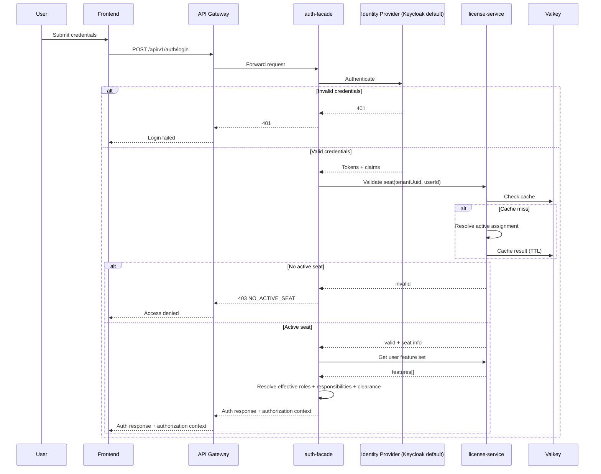

> **Design note:** [AS-IS] auth-facade does NOT call user-service. The only Feign client in auth-facade is
> `LicenseServiceClient`. Session/user state is managed via Keycloak tokens and Neo4j graph, not via user-service REST calls.
> [TARGET] auth-facade is a transition service (then removed). Auth edge endpoints (login, refresh, logout, MFA) migrate to api-gateway. Tenant users, RBAC, session control, and provider config migrate to tenant-service (PostgreSQL). user-service is also a transition service (then removed).

Authorization context payload contract:

- `roles`: effective roles after inheritance.
- `responsibilities`: policy keys resolved by backend policy mapping.
- `features`: license-validated feature list.
- `clearanceLevel`: user data-classification clearance for this tenant context.
- `policyVersion`: policy package version returned by backend.
- `uiVisibility`: frontend rendering hints derived from policy; backend remains authoritative.

## 6.2 Token Refresh

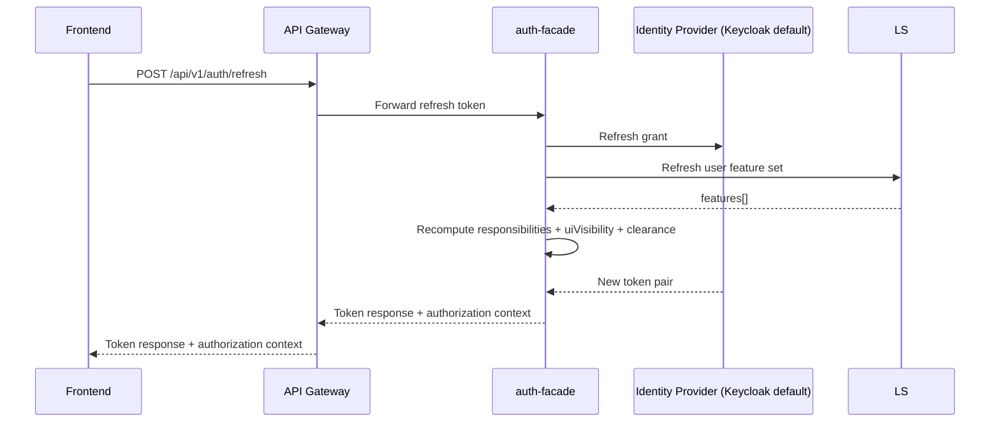

## 6.3 Tenant-Scoped Data Query

### Domain Services (PostgreSQL / Spring Data JPA)

All active domain services (tenant-service, user-service, license-service, notification-service,
audit-service, ai-service) use PostgreSQL with Spring Data JPA.
Tenant isolation is enforced via `tenant_id` column filtering.

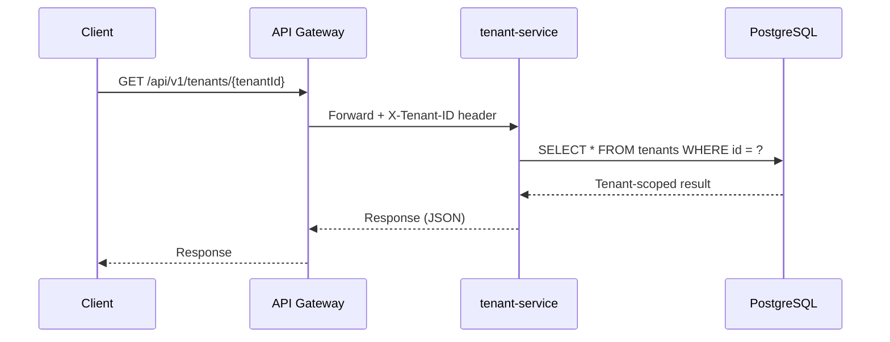

### auth-facade (Neo4j / Spring Data Neo4j) [AS-IS]

[AS-IS] Only auth-facade uses Neo4j for its authentication graph (providers, roles, groups, tenants). [TARGET] This runtime path is removed. Auth graph data migrates to tenant-service PostgreSQL. Neo4j is removed from the auth target domain. api-gateway becomes the auth edge endpoint. tenant-service owns RBAC, provider config, and session control.

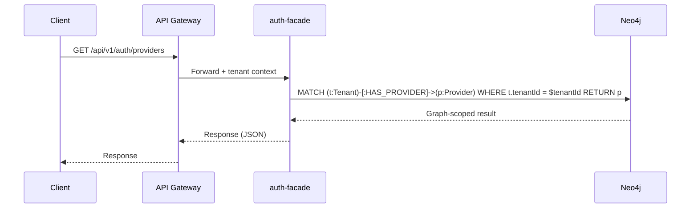

### definition-service (Neo4j / Spring Data Neo4j)

definition-service uses Neo4j for metamodel graph storage.

> **Scope note:** `product-service` and `persona-service` are stub-only (have `pom.xml` but no `src/`
> directory). `process-service` has source code but is intentionally kept out of active runtime
> scope. All three are excluded from current runtime flow scope.

## 6.4 Feature and Classification Gate Check

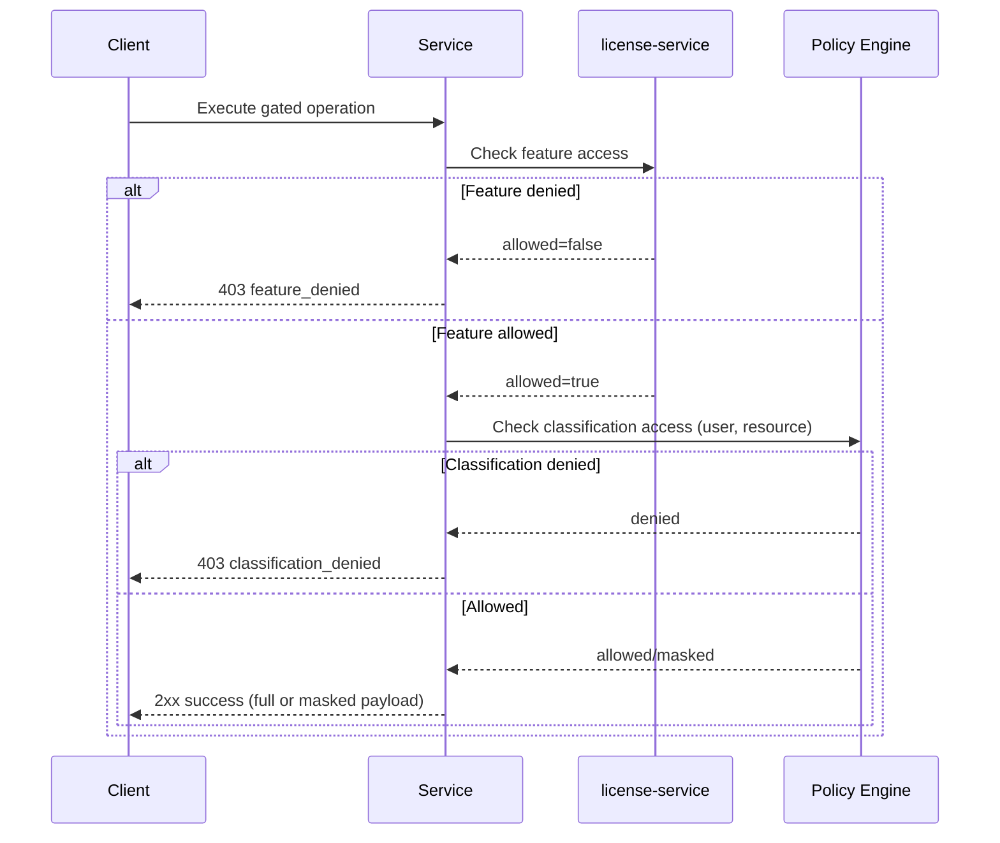

## 6.5 Audit Event Processing

### REST API Ingestion

audit-service exposes a REST API (`AuditController`) and persists to PostgreSQL using
JPA (`AuditEventEntity` with `@Entity` / `@Table(name = "audit_events")`).
Schema managed by Flyway.

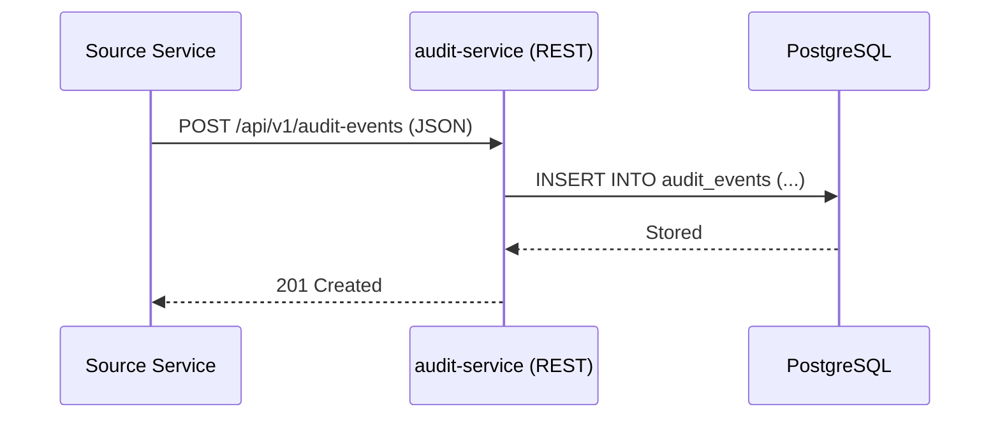

### Kafka Consumer Path

Kafka consumers exist in audit-service and notification-service but are disabled by default
(`@ConditionalOnProperty(name = "spring.kafka.enabled", havingValue = "true", matchIfMissing = false)`).
No Kafka producers (`KafkaTemplate`) exist anywhere in the codebase. When enabled, the target
flow is:

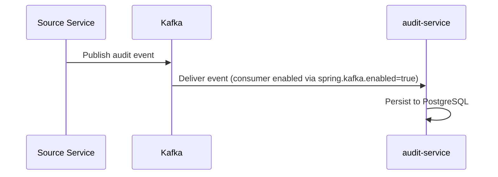

## 6.6 Cache Read/Write Pattern

Single-tier Valkey distributed cache. The caching architecture uses Valkey 8 as the sole cache layer. Caffeine (L1 in-process cache) is not part of the design baseline -- the platform uses a single distributed cache tier to avoid cache coherence complexity across service replicas.

Services use Spring `@Cacheable` / `@CacheEvict` annotations backed by Valkey (via Spring Data Redis).
The backing data store depends on the service: PostgreSQL for domain services, [AS-IS] Neo4j for auth-facade. [TARGET] auth-facade is removed; auth data moves to tenant-service PostgreSQL.

Cache key pattern: `tenant:{tenantId}:{entity}:{id}`

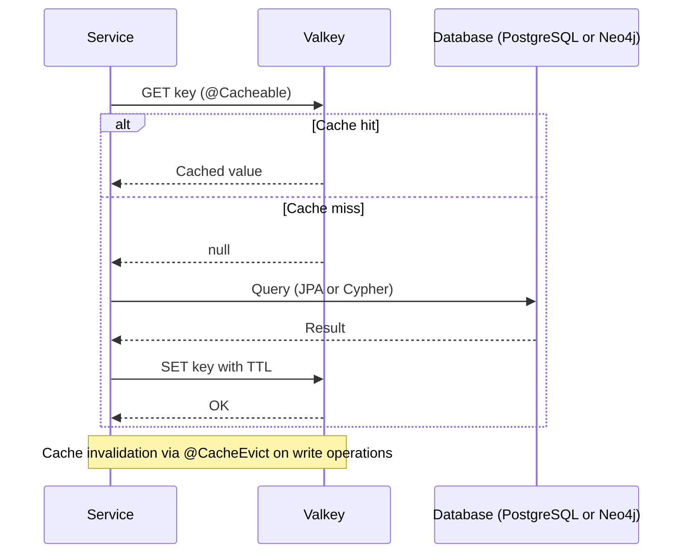

Cache invalidation strategies:

1. **Time-based** -- TTL expiration (primary strategy)
2. **Write-through** -- Invalidate on entity update via `@CacheEvict`
3. **Event-driven** -- Kafka events trigger invalidation (when Kafka producers are active)
4. **Manual** -- Admin API for cache clearing

Spring framework properties and APIs use the `redis` namespace (`spring.data.redis`, `RedisConnectionFactory`) while pointing to the Valkey runtime endpoint.

## 6.7 Tenant Creation and Provisioning

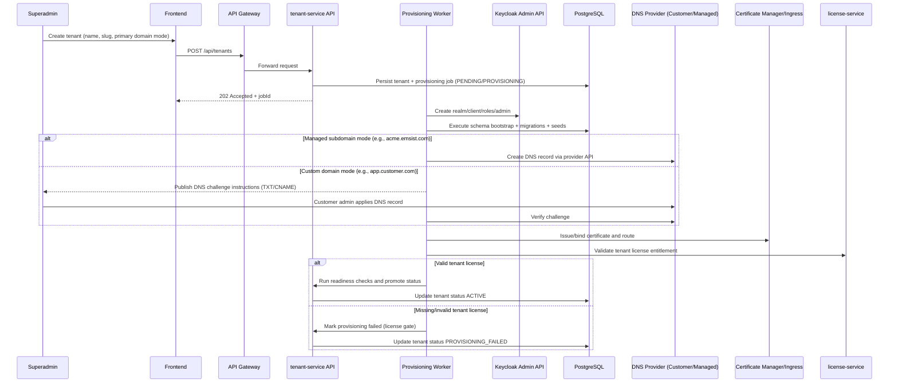

Failure path contract:

- Any failed phase sets tenant to `PROVISIONING_FAILED` with step-specific error details.
- Retry resumes from last successful checkpoint; previously completed phases are not repeated unless explicitly requested.
- Each phase retry uses idempotency key `{tenantUuid}:{jobId}:{phase}` with bounded retry budget.
- Terminal phase failure triggers phase-specific compensation before final failure state commit.

## 6.8 Session Lifecycle (End-to-End)

This section documents the full session lifecycle from login through logout, covering token issuance, refresh, blacklisting, and session termination.

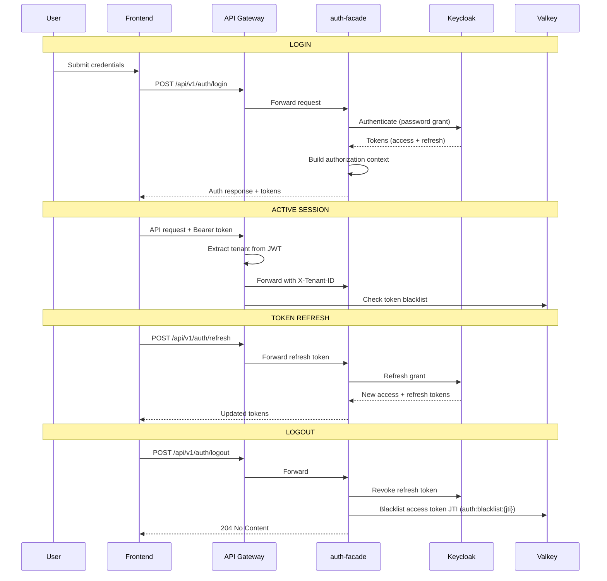

### Session Lifecycle Capabilities

| Capability | Description |
|------------|-------------|
| Login flow | auth-facade authenticates via Keycloak, returns tokens + authorization context |
| Token refresh | auth-facade obtains new token pair from Keycloak |
| Logout | Revokes refresh token in Keycloak, blacklists access token JTI in Valkey |
| Token blacklist | Valkey-backed blacklist with TTL matching token expiry |
| Blacklist check | Gateway checks Valkey for blacklisted JTIs before forwarding requests |
| MFA pending flow | Valkey `auth:mfa:pending:{hash}` with 5min TTL for pending MFA verification |
| Concurrent session limits | Per-user concurrent session cap enforcement |
| Inactivity timeout | Idle-session detection and termination |

## 6.9 Service-to-Service Authentication

Backend services communicate over the Docker network. The design requires authenticated service-to-service communication to prevent implicit trust on network boundaries.

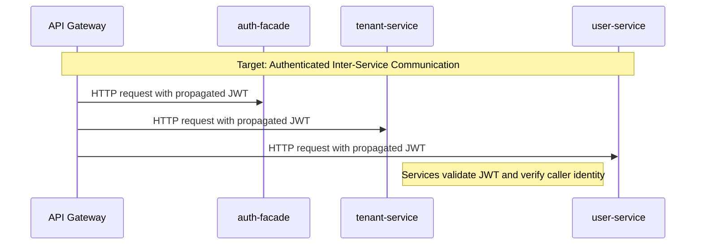

### Authentication Options

| Option | Description | Complexity | Suitability |
|--------|-------------|------------|-------------|
| JWT propagation | Gateway forwards user JWT; downstream services validate it | Low | Good for Docker Compose environments |
| mTLS | Mutual TLS certificates between all services | Medium | Good for Kubernetes with cert-manager |
| Service mesh (Istio/Linkerd) | Sidecar proxies handle mutual auth transparently | High | Best for Kubernetes deployments |

Per the production-parity security baseline, internal APIs (`/api/v1/internal/**`) require explicit service authentication and least privilege. Gateway deny-by-default for internal edge exposure is mandatory.

## 6.10 Integration Hub Runtime Scenarios

The integration-service (port 8091) serves as the Integration and Communication Governance Hub, governing four integration patterns:

1. **EMSIST to External EA/BPM tools** -- MEGA HOPEX, ARIS, webMethods
2. **Tenant to Tenant** -- Controlled, auditable data sharing between EMSIST tenants
3. **Agent to Agent** -- Governance of AI agent communication
4. **EMSIST to External AI Agents** -- Integration with Claude, Codex, Gemini under rate-limited, policy-governed channels

### 6.10.1 External System Synchronization

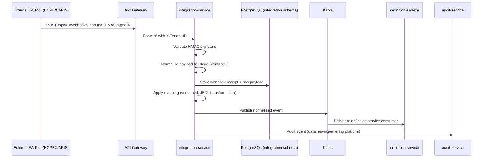

### 6.10.2 Sync Engine Flow

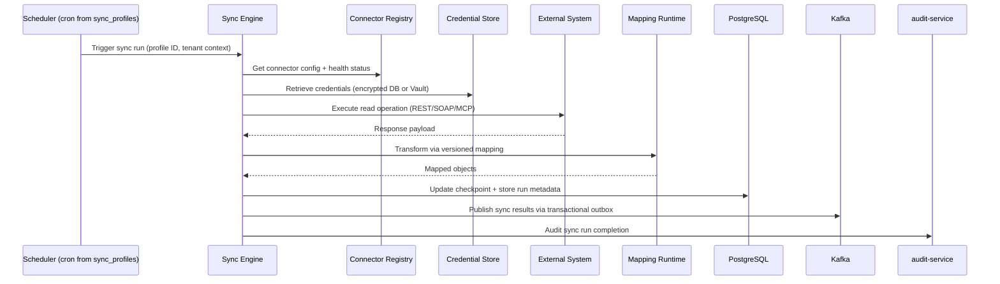

Key design principles for integration-service:

- **Control-plane only** -- stores config, mappings, policies, checkpoints, run metadata, and masked samples; never full data replicas.
- **Plugin boundary** -- plugins handle API-client, pagination, and object mapping for specific external systems. Generic concerns (retry, credentials, rate limiting, audit) remain in the core framework.
- **Tenant isolation** -- every connector, sync profile, mapping, and policy is scoped to a tenant.
- **Transactional outbox** -- guaranteed Kafka delivery via outbox pattern (Phase 1: poller, Phase 2: Debezium CDC).

## 6.11 Super Agent Runtime Scenarios

> The following runtime scenarios document the Super Agent platform behavior.
> The current ai-service is a chatbot API with CRUD agent configurations, custom WebClient LLM providers,
> PostgreSQL `ai_db` with 7 tables, and zero Kafka usage, zero tool binding, zero agent hierarchy.

### 6.11.1 User to SuperAgent Task Orchestration

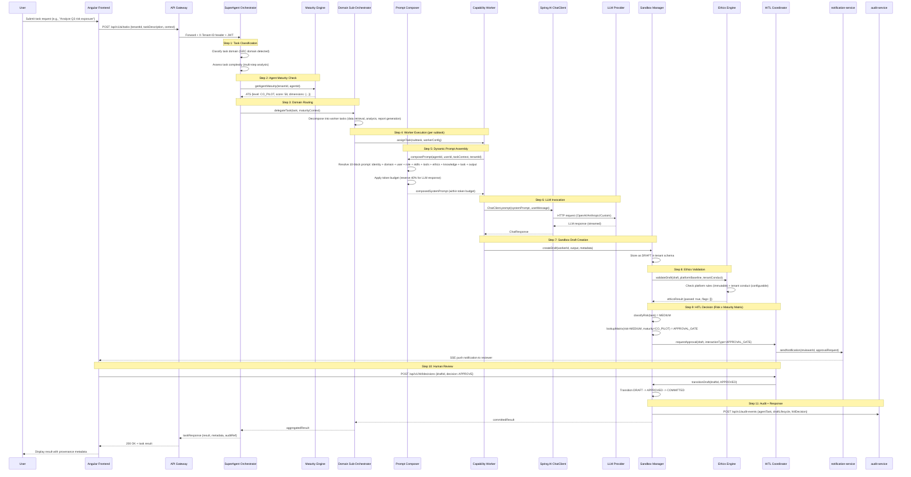

**Key Design Principles:**

- **Three-tier routing:** SuperAgent classifies by domain, Sub-Orchestrator decomposes into subtasks, Worker executes. This prevents the orchestrator from becoming a complexity bottleneck when managing 20+ capability workers across 5 professional domains.
- **Maturity check before delegation:** The SuperAgent queries agent maturity before routing to determine the appropriate oversight level. A Coaching-level agent on the same task would trigger a HUMAN_TAKEOVER instead of APPROVAL_GATE.
- **Dynamic 10-block prompt composition:** The Prompt Composer assembles the system prompt from database-stored blocks with conditional inclusion, respecting a token budget that reserves 40% of the context window for the LLM response.
- **Sandbox-first output:** Worker outputs are never delivered directly to users. Every output enters the sandbox as a DRAFT and progresses through the lifecycle before being COMMITTED.
- **Risk x maturity HITL matrix:** The HITL interaction type is determined by the intersection of action risk level and agent maturity level, achieving less than 10% human intervention for Graduate agents while maintaining 100% review for Coaching agents.

### 6.11.2 Event-Triggered Automated Task

This scenario illustrates how an entity change in a source service database triggers the
Super Agent to autonomously execute a task, without any user interaction initiating the flow.

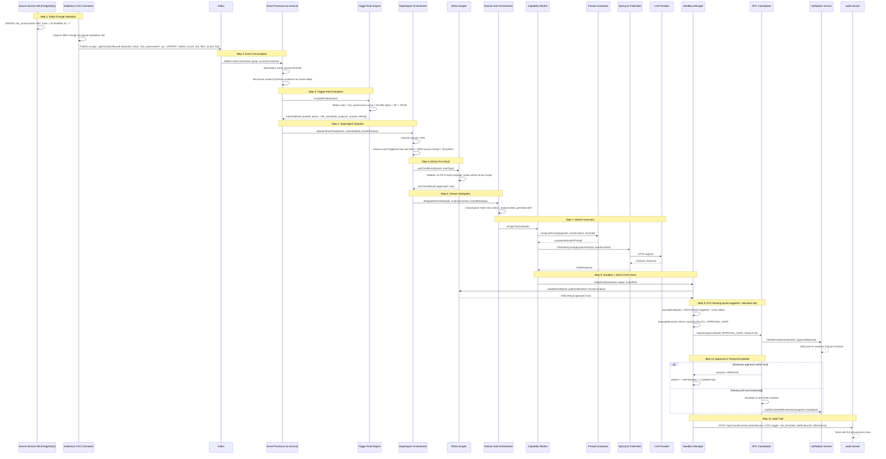

**Key Design Principles:**

- **Debezium CDC for entity lifecycle events:** Database WAL-based change capture ensures no application code changes are needed in source services to generate events.
- **Trigger Rule Engine:** Event-to-task mapping is defined as configurable rules, not hardcoded logic. Tenant administrators can define rules stored in `event_trigger_rules` table in the tenant schema.
- **Ethics pre-check before dispatch:** Event-triggered tasks undergo ethics validation before the SuperAgent dispatches them.
- **Elevated risk for autonomous triggers:** Event-triggered tasks carry inherently higher risk than user-initiated tasks because no human explicitly requested the action.
- **Timeout escalation:** If a reviewer does not respond within the configured SLA window, the HITL Coordinator escalates to the next-level reviewer.

### 6.11.3 HITL Approval Flow

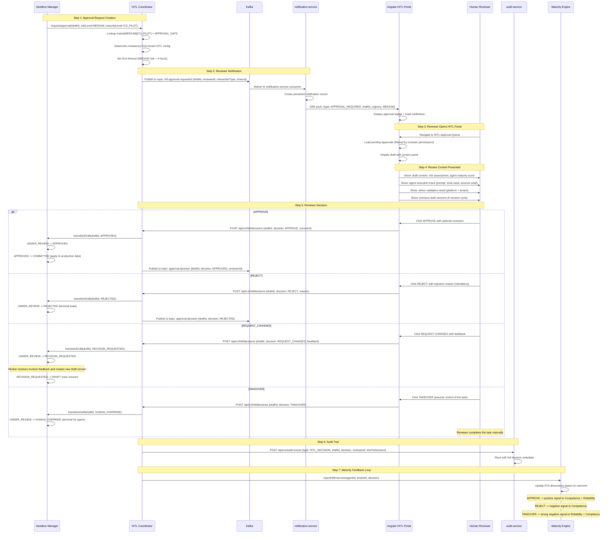

**Key Design Principles:**

- **Four HITL interaction types:** AUTO_APPROVE (no human involved, for Graduate+low-risk), APPROVAL_GATE (lightweight yes/no/revise), INPUT_COLLECTION (human provides missing information), and HUMAN_TAKEOVER (human assumes full control).
- **Mandatory rejection reason:** Rejections require a reason so the worker (and maturity engine) can learn from the feedback.
- **TAKEOVER as terminal state:** When a reviewer takes over, the agent's task is terminated. This is the strongest signal to the maturity engine and may trigger a maturity level demotion.
- **Maturity feedback loop:** Every HITL decision feeds back into the agent's ATS score, creating a reinforcement loop where good agents earn more autonomy.
- **Kafka for decision events:** HITL decisions are published to Kafka (`approval.decision` topic) for event sourcing, enabling audit replay and analytics.

### 6.11.4 Agent Maturity Evaluation

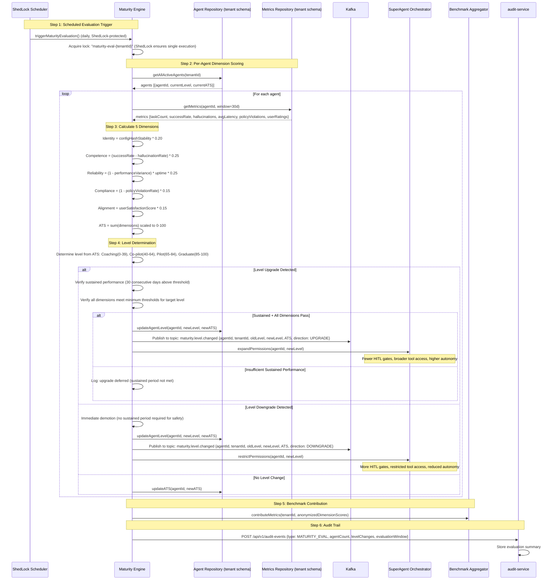

**Key Design Principles:**

- **ShedLock for distributed scheduling:** The evaluation runs daily, protected by ShedLock to ensure exactly-once execution even in a multi-instance deployment.
- **Asymmetric promotion/demotion:** Promotion requires 30 consecutive days of sustained performance above the threshold. Demotion is immediate. This ensures trust is earned slowly and safety responses are immediate.
- **Minimum per-dimension thresholds:** An agent cannot reach a higher level with 90% Competence but 5% Compliance. Every dimension must meet the level-specific minimum threshold, preventing gaming of the composite score through one strong dimension.
- **Kafka events for level transitions:** Level changes are published to Kafka so that other services can react: the SuperAgent adjusts routing, the HITL Coordinator updates the approval matrix, and the audit service records the transition.
- **Permission cascade via SuperAgent:** When maturity changes, the SuperAgent Orchestrator immediately adjusts the agent's operational permissions including tool access scope, HITL gate frequency, and maximum task complexity.

### 6.11.5 Cross-Tenant Benchmark Collection

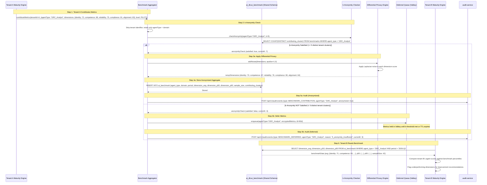

**Key Design Principles:**

- **k-Anonymity threshold of k=5:** Metrics are not stored in the shared benchmark schema until at least 5 distinct tenant clusters contribute data for the same agent type.
- **Differential privacy noise:** Even after k-anonymity is satisfied, Laplacian noise (epsilon=1.0) is added to dimension scores before aggregation, providing mathematical guarantees against reconstruction attacks.
- **Deferred queue with TTL:** When k-anonymity is not met, metrics are encrypted and queued in Valkey with a 90-day TTL.
- **Shared benchmark schema vs tenant schemas:** Benchmark data lives in a shared schema accessible to all tenants for reading, writable only by the Benchmark Aggregator. Tenant-specific agent data remains isolated in per-tenant schemas.
- **Aggregated statistics only:** The shared schema stores only aggregated statistics (averages, percentiles, sample sizes) with differential privacy noise. No raw scores, no individual agent IDs, and no tenant identifiers are stored.

---

## Changelog

| Timestamp | Change | Author |
|-----------|--------|--------|
| 2026-03-08 | Wave 3-4: Added Super Agent runtime scenarios (6.10.1-6.10.5) | ARCH Agent |
| 2026-03-09T14:30Z | Wave 6: Final completeness pass | ARCH Agent |
| 2026-03-17 | Consolidated ADR design principles into arc42. Removed status tags and implementation tracking. Added integration hub runtime scenarios (6.10) from ADR-033. Fixed cache design to reflect single-tier Valkey (no Caffeine L1). Renumbered Super Agent scenarios to 6.11. | SA Agent |

---

**Previous Section:** [Building Blocks](./05-building-blocks.md)
**Next Section:** [Deployment View](./07-deployment-view.md)
