> **WP-ARCH-ALIGN (2026-03-24):** This document has been updated to reflect the frozen auth target model (Rev 2).
> See `Foundation/03-ownership-boundaries.md` SS FROZEN for the canonical decision.

# 7. Deployment View

## 7.1 Deployment Goals

- Deploy services independently with predictable runtime behavior.
- Keep stateful components explicit and operationally isolated.
- Maintain environment parity across local, staging, and production.
- Keep customer delivery artifact-only: no source code, source checkout, build context, or local build requirement on customer hosts.
- Enforce production-parity security baseline across all environments -- no environment-level security downgrades.

## 7.2 Canonical Deployment Contract

Canonical requirement source:

- [R07 Cross-Cutting Platform Requirements](../.Requirements/R07.%20PLATFORM%20OPERATIONS%20AND%20CUSTOMER%20DELIVERY/Design/01-Cross-Cutting-Platform-Requirements.md)
- [R07 Acceptance Criteria and Release Gates](../.Requirements/R07.%20PLATFORM%20OPERATIONS%20AND%20CUSTOMER%20DELIVERY/Design/02-Acceptance-Criteria-and-Release-Gates.md)

EMSIST uses one deployment contract across all supported runtimes. Normative requirements are owned by R07; this section summarizes the architectural shape:

- four logical roles: `postgres`, `neo4j`, `keycloak`, `services`
- four canonical provisioning modes: `preflight`, `first_install`, `upgrade`, `restore`
- supporting operations: `backup`, `rollback`, `validate`
- customer delivery is artifact-only, not source-based
- schema, graph, and identity bootstrap changes are explicit deployment steps within `first_install` and `upgrade`, not side effects of service startup

### Runtime-Agnostic Design Principle

The deployment contract is independent of Docker syntax and must be implemented consistently across Docker, Kubernetes, and local/native environments. Each runtime adapter may use different mechanics, but all adapters preserve:

- the four logical roles
- the lifecycle operations
- explicit migration handling
- backup/restore discipline
- rollback semantics appropriate for the runtime

The same application source code and Docker images deploy to both Docker Compose and Kubernetes. The difference is purely deployment configuration -- no code changes, no feature flags, no conditional compilation.

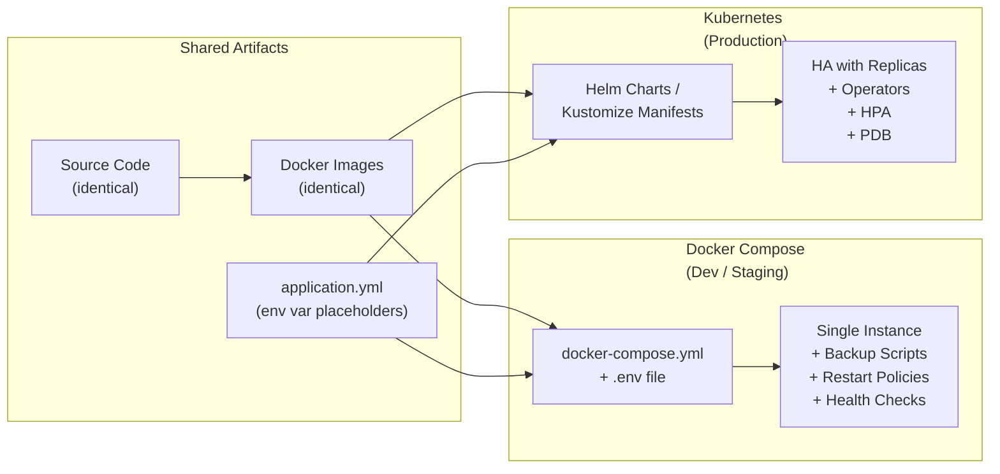

## 7.3 Logical Deployment Roles

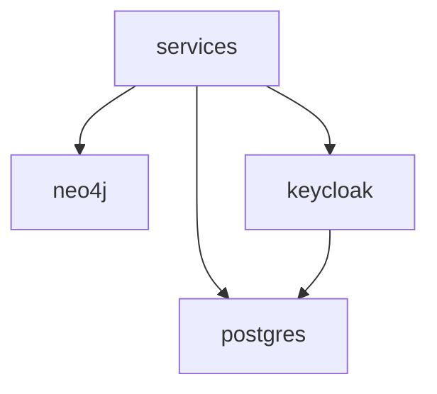

| Role | Responsibility |
|------|----------------|
| `postgres` | PostgreSQL server and relational durability |
| `neo4j` | Neo4j server and graph durability |
| `keycloak` | Identity server and identity bootstrap |
| `services` | Eureka, EMSIST services, gateway, frontend, and support services |

`postgres`, `neo4j`, and `keycloak` are long-lived platform roles. `services` is the replaceable application role. Routine application updates assume platform roles remain intact while services may be rebuilt, replaced, or rolled back. Customer data and identity state survive service updates.

## 7.4 Runtime Adapters and Current Baseline

| Runtime | Contract |
|---------|----------|
| Docker / Compose | Current repo baseline; supported through split `data/app` lifecycle tiers |
| Kubernetes | Target adapter; must preserve the same logical roles and provisioning modes |
| local/native | Target adapter; must preserve the same logical roles and provisioning modes |

| Environment | Baseline | Notes |
|-------------|----------|-------|
| Development | Docker Compose | Split `data/app` lifecycle tiers; three network zones |
| Staging | Docker Compose | Same lifecycle model as development |
| Production | Docker Compose image-based delivery | Artifact-only delivery; source checkout is not part of the customer contract |

The current Docker Compose split remains an interim baseline until the installer/deployment manager is implemented. The existing `docker-compose.{env}-data.yml` and `docker-compose.{env}-app.yml` files and wrapper compose files remain valid.

## 7.5 Current Docker Baseline

Current Docker/Compose lifecycle model:

- `docker-compose.{env}-data.yml` protects stateful data services and owns persistent volumes/networks
- `docker-compose.{env}-app.yml` contains replaceable application services and identity runtime
- customer production delivery uses pre-built artifacts rather than source checkout
- the current repository baseline remains Docker-first, but the future product contract must remain runtime-agnostic

Current Compose/network behavior:

- two lifecycle tiers: `data`, `app`
- three network zones: `frontend`, `backend`, `data`
- app-tier rebuilds must not remove protected data state
- Keycloak-backed identity state remains part of the protected customer state set

## 7.6 Development Compose Inventory

| Service | Default Port |
|---------|--------------|
| frontend | 4200 |
| api-gateway | 8080 |
| auth-facade | 8081 |
| tenant-service | 8082 |
| user-service | 8083 |
| license-service | 8085 |
| notification-service | 8086 |
| audit-service | 8087 |
| ai-service | 8088 |
| definition-service | 8090 |
| integration-service | 8091 |
| service-registry (eureka) | 8761 |
| keycloak | 8180 |
| neo4j | 7687 / 7474 |
| valkey | 6379 |
| kafka | 9092 |
| postgres (keycloak + domain services logical DBs) | 5432 |
| debezium-connect | 8093 |
| ollama | 11434 |
| schema-registry | 8094 |

> **Port range convention:** Microservices use ports 8080-8091, infrastructure platforms use 8093+. This prevents host-port conflicts in Docker Compose environments where services share the host network namespace.

Runtime scope seal (2026-03-01):

- `product-service`, `process-service`, and `persona-service` are not part of the active deployment inventory.
- They remain build modules only and are intentionally excluded from Compose/Kubernetes topology.

## 7.7 Domain and TLS Provisioning Boundary

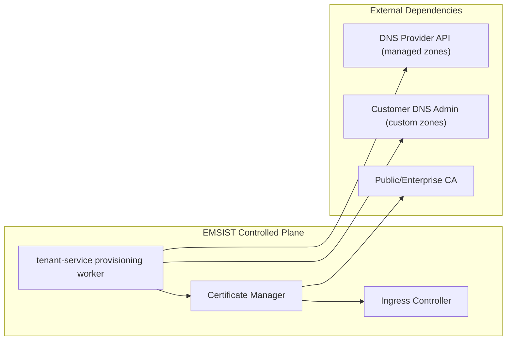

Boundary rules:

- Managed domain (`*.emsist.com`): EMSIST automates DNS + TLS end-to-end.
- Custom domain (`app.customer.com`): customer owns DNS changes; EMSIST verifies ownership and completes TLS/ingress binding.
- Non-master tenant status remains non-active until DNS verification, TLS activation, and tenant license validation complete.

## 7.8 High Availability and Resilience

### 7.8.1 Current State Assessment

The current deployment topology (both development and staging) runs all stateful components as single instances with no replication, no automated backups, and no failover mechanisms.

**Single-points-of-failure:**

| Component | Instance Count | Replication | Automated Backup | Failover |
|-----------|---------------|-------------|-------------------|----------|
| PostgreSQL 16 (pgvector) | 1 | None | None | None |
| Neo4j 5 Community | 1 | None | None | None |
| Valkey 8 | 1 | None | None | None |
| Kafka (Confluent 7.6) | 1 broker | replication.factor=1 | None | None |
| Keycloak 24 | 1 | None | Data in PostgreSQL | None |
| Application services (8+) | 1 each | N/A (stateless) | N/A | Container restart only |

**Risk:** A single container failure, `docker compose down -v`, or host failure results in permanent data loss.

### 7.8.2 Phase 1: Docker Compose HA with Automated Backups

Target: Eliminate data loss risk within the existing Docker Compose deployment model.

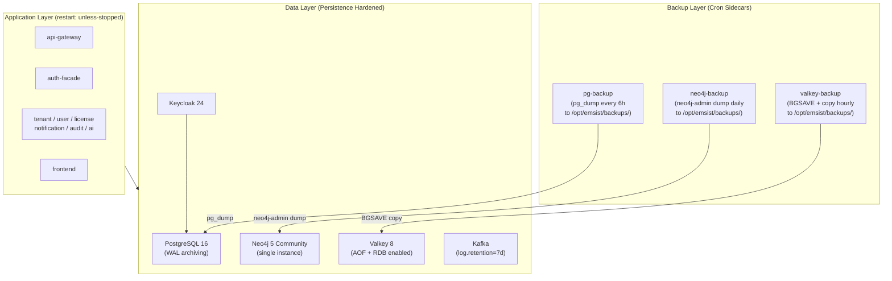

**Recovery targets (Phase 1):**

| Component | RPO (Recovery Point Objective) | RTO (Recovery Time Objective) |
|-----------|-------------------------------|-------------------------------|
| PostgreSQL | 6 hours | 30 minutes |
| Neo4j | 24 hours | 15 minutes |
| Valkey | ~15 minutes (AOF) | 5 minutes |
| Kafka | N/A (messaging) | Broker restart |

**Volume protection strategy:**

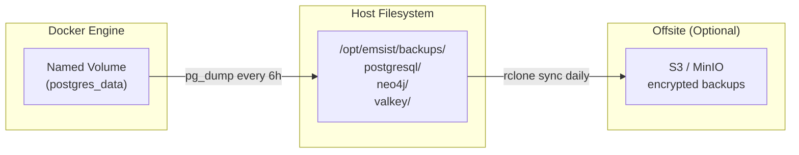

**Phase 1 deliverables:**

| Deliverable | Description |
|-------------|-------------|
| PostgreSQL automated backup | `pg_dump` every 6 hours to host-mounted volume + optional S3 upload |
| Neo4j automated backup | `neo4j-admin database dump` daily to host-mounted volume |
| Valkey persistence hardening | AOF (`appendonly yes`) + RDB snapshots every 15 min |
| Kafka log retention | `log.retention.hours=168` (7 days) |
| Docker Compose restart policies | `restart: unless-stopped` on all services |
| Volume backup guard | Host bind-mount backups to `/opt/emsist/backups/` outside Docker volume scope |
| Health check hardening | Tighten intervals, add `start_period` to all stateful services |
| Upgrade runbook | Documented procedure for safe image upgrades with pre-upgrade backup |

**Critical rule:** NEVER run `docker compose down -v` on staging or production. The `-v` flag destroys all named volumes.

### 7.8.3 Phase 2: Kubernetes with Operator-Managed Databases

Target: Production-grade orchestration with automated failover and horizontal scaling.

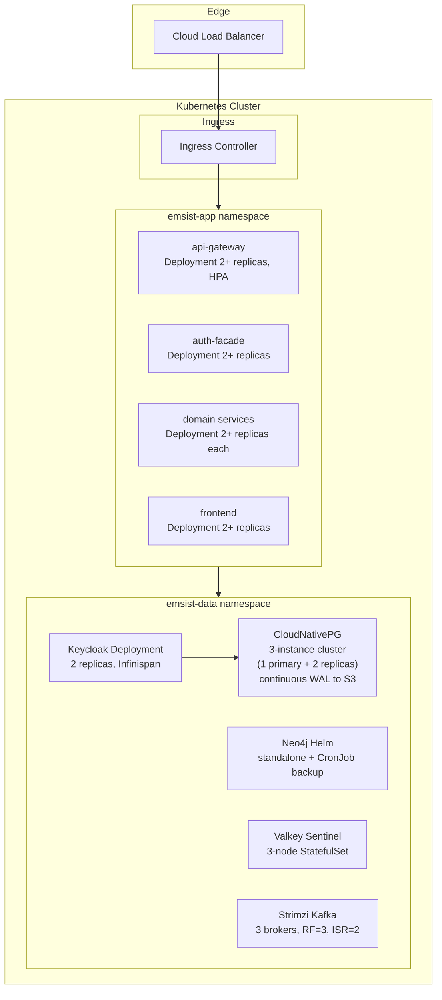

#### Kubernetes Operator Specifications

**CloudNativePG (PostgreSQL):**

| Feature | Configuration |
|---------|---------------|
| Operator version | CloudNativePG >= 1.22 |
| PostgreSQL version | 16 (matching current `pgvector/pgvector:pg16`) |
| Cluster topology | 1 primary + 2 streaming replicas |
| Failover | Automatic (operator promotes replica within seconds) |
| Connection pooling | Built-in PgBouncer sidecar (transaction-level pooling) |
| Backup | Continuous WAL archiving to S3-compatible storage (Barman) |
| Point-in-time recovery | Supported via WAL replay to any timestamp |
| Monitoring | Built-in Prometheus metrics exporter, PodMonitor CRD |
| TLS | Automatic TLS certificate management for inter-node and client connections |

**Strimzi (Kafka):**

| Feature | Configuration |
|---------|---------------|
| Operator version | Strimzi >= 0.40 |
| Kafka version | 3.7+ |
| Broker count | 3 |
| Replication factor | 3 (default for all topics) |
| Min ISR | 2 |
| Storage | JBOD with encrypted PVCs |
| Authentication | SASL/SCRAM-SHA-512 per-service KafkaUser CRDs |
| Encryption | TLS for inter-broker and client connections |

**Valkey Sentinel (StatefulSet):**

| Feature | Configuration |
|---------|---------------|
| Deployment | StatefulSet with 3 pods (1 primary + 2 replicas) |
| Failover | 3 Sentinel instances |
| Quorum | 2 Sentinels must agree for failover |
| Persistence | AOF (`appendonly yes`) + RDB snapshots on each node |
| TLS | `--tls-port 6379` with cert-manager certificates |
| Client | Spring Data Redis Lettuce with Sentinel configuration |

**Neo4j (Helm Chart):**

| Feature | Configuration |
|---------|---------------|
| Helm chart | `neo4j/neo4j` >= 5.12 |
| Edition | Community (standalone only; Enterprise required for clustering) |
| Replicas | 1 (Community limitation) |
| Backup | CronJob: `neo4j-admin database dump` to PVC, then `rclone` to S3 |
| Persistence | PVC with encrypted StorageClass |

**HA guarantees (Phase 2):**

| Component | Instances | Failover | RPO | RTO |
|-----------|-----------|----------|-----|-----|
| PostgreSQL (CloudNativePG) | 1 primary + 2 replicas | Automatic (operator-managed) | ~0 (streaming replication) | < 30 seconds |
| Neo4j (Community standalone) | 1 + CronJob backup | Manual restore from backup | 1 hour | 15 minutes |
| Valkey (Sentinel) | 3 nodes | Automatic (Sentinel-managed) | ~0 (sync replication) | < 10 seconds |
| Kafka (Strimzi) | 3 brokers | Automatic (ISR failover) | 0 (replicated topics) | < 1 minute |
| Keycloak | 2+ replicas | Load-balanced, shared session via Infinispan | N/A (data in PG) | 0 (other replica serves) |
| Application services | 2+ replicas each | Load-balanced, PodDisruptionBudget | N/A (stateless) | 0 (other replica serves) |

**Scaling targets:**

| Metric | Target | Mechanism |
|--------|--------|-----------|
| Application service replicas | 2 min, 8 max | HPA on CPU (70%) and memory (80%) |
| API gateway replicas | 2 min, 10 max | HPA on request rate |
| PostgreSQL read throughput | 3x via read replicas | CloudNativePG replica services |
| Valkey read throughput | 3x via read replicas | Sentinel read-from-replica |
| Zero-downtime deploys | Rolling update, maxUnavailable=0 | Deployment strategy |
| Pod disruption tolerance | 1 unavailable max per service | PodDisruptionBudget |

### 7.8.4 Phase 3: Multi-Region Active-Passive

Target: Geographic redundancy for disaster recovery.

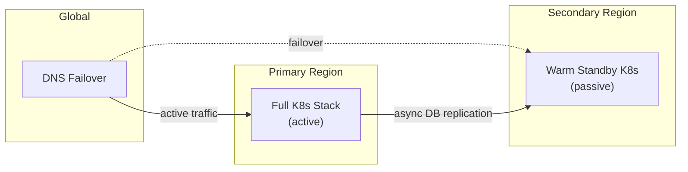

| Target | Value |
|--------|-------|
| Cross-region RPO | < 5 minutes |
| Cross-region RTO | < 10 minutes |
| DNS failover | Health-checked, TTL 60s |

**Key distinction:** Docker Compose environments are NOT highly available. They provide durability (backups + restart policies) but not availability (failover + replication). True HA requires Kubernetes (Phase 2+).

### 7.8.5 Upgrade Safety Runbook

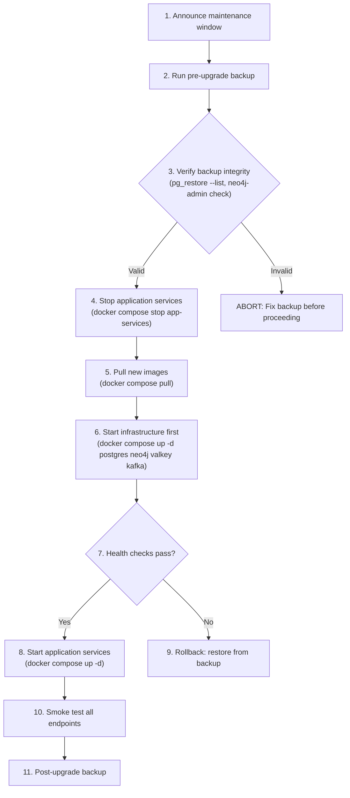

## 7.9 Docker Compose Tier Separation

The Docker Compose deployment baseline uses split `data/app` lifecycle tiers and three explicit Docker networks with controlled ownership.

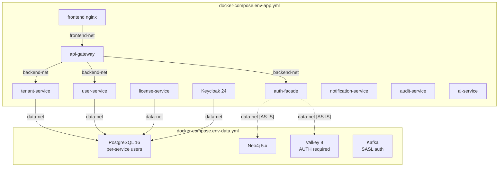

### Three-Network Topology

| Network | Purpose | Members | Host Access |
|---------|---------|---------|-------------|
| `ems-{env}-data` | Data tier internal | PostgreSQL, Neo4j, Valkey, Kafka | No (internal only) |
| `ems-{env}-backend` | Backend bridge | Backend services + Keycloak + MailHog | Debug ports (dev only) |
| `ems-{env}-frontend` | Frontend isolated | frontend + api-gateway only | 4200/24200 |

### Current Behavior

- Development and staging define the three networks in the data-tier compose files and reference them from the app tier as `external: true`.
- Production still uses a single wrapper manifest, but the split `prod-data` and `prod-app` files preserve the same logical ownership model.
- App-tier teardown does not own data-tier volumes or networks.

## 7.10 Secrets Management

### Credential Architecture

| Environment | Credential Source | Rotation | Encryption |
|-------------|-------------------|----------|------------|
| Development | `.env.dev` file (gitignored, `chmod 600`) | Manual | Host filesystem encryption (FileVault/LUKS) |
| Staging | `.env.staging` file (gitignored, `chmod 600`, server filesystem) | Manual (quarterly) | Host filesystem encryption + restricted SSH access |
| Production | K8s Secrets (RBAC per ServiceAccount) + optional HashiCorp Vault | Automated (Vault lease TTL) | K8s etcd encryption at rest + Vault seal |

```mermaid
flowchart TB
    subgraph dev["Dev Environment"]
        DEV_ENV[".env.dev\n(gitignored)\nchmod 600\nlocal filesystem only"]
        DEV_DC["docker-compose.dev.yml\nenv_file: .env.dev"]
        DEV_ENV --> DEV_DC
        DEV_DC --> DEV_CONT["Containers\n(env vars injected)"]
    end

    subgraph staging["Staging Environment"]
        STG_ENV[".env.staging\n(gitignored)\nchmod 600\nserver filesystem"]
        STG_DC["docker-compose.staging.yml\nenv_file: .env.staging"]
        STG_ENV --> STG_DC
        STG_DC --> STG_CONT["Containers\n(env vars injected)"]
    end

    subgraph production["Production Environment"]
        VAULT["HashiCorp Vault\n(optional)\nDynamic secrets engine\nAutomatic rotation"]
        K8S_SEC["Kubernetes Secrets\nRBAC per ServiceAccount\nEncrypted etcd"]
        K8S_POD["Pods\n(env from Secret ref)"]
        VAULT -.->|"dynamic\ncredentials"| K8S_SEC
        K8S_SEC --> K8S_POD
    end
```

### Credential Flow

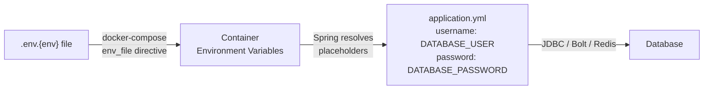

In the target state, each service uses per-service environment variable names (`SVC_TENANT_DB_USER`, `SVC_USER_DB_USER`, etc.) rather than a shared `DATABASE_USER` variable. The `application.yml` placeholders reference service-specific variables with no hardcoded fallback defaults, ensuring fail-fast behavior on missing credentials.

### Credential Types

| Credential | Dev | Staging | Production |
|------------|-----|---------|------------|
| PostgreSQL per-service passwords | `.env.dev` | `.env.staging` | K8s Secret |
| Neo4j password | `.env.dev` | `.env.staging` | K8s Secret |
| Valkey password | `.env.dev` | `.env.staging` | K8s Secret |
| Keycloak admin password | `.env.dev` | `.env.staging` | K8s Secret |
| Jasypt master password | `.env.dev` | `.env.staging` | K8s Secret (mounted as env var) |
| AI provider API keys | `.env.dev` | `.env.staging` | K8s Secret + Vault |
| TLS certificates | `scripts/generate-dev-certs.sh` | Let's Encrypt / self-signed | cert-manager + Let's Encrypt / ACM |

## 7.11 Encryption Strategy

### Three-Tier Encryption Architecture

The platform uses a three-tier encryption strategy covering data at rest, data in transit, and configuration secrets.

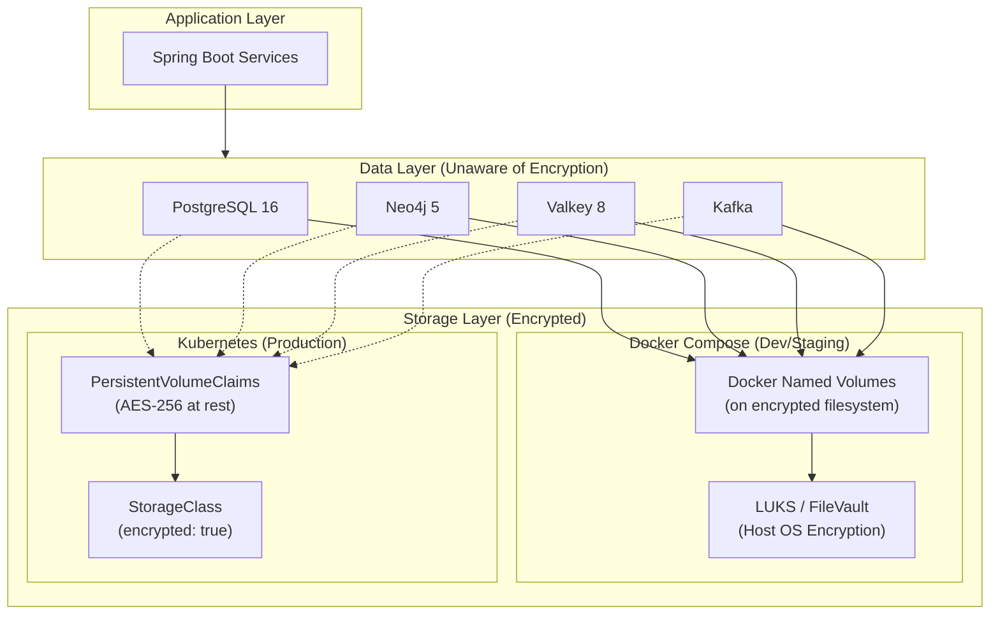

**Tier 1: Volume-Level Encryption (Data at Rest)**

| Environment | Encryption Mechanism | Key Management |
|-------------|---------------------|----------------|
| Dev (macOS) | FileVault (default on macOS) | macOS Keychain |
| Dev (Linux) | LUKS on data partition | Passphrase at boot |
| Staging (Linux) | LUKS on `/var/lib/docker` partition | Passphrase or TPM |
| Production (K8s) | Encrypted StorageClass PVs | Cloud KMS or LUKS |

**Tier 2: In-Transit Encryption (TLS for All Connections)**

All data connections between application services and data stores must use TLS:

| Connection | Target Configuration |
|------------|---------------------|
| Services to PostgreSQL | `sslmode=verify-full` in JDBC URL |
| auth-facade to Neo4j | [AS-IS] `bolt+s://` URI scheme with Neo4j SSL policy. [TARGET] Connection removed -- auth-facade is a transition service; auth data migrates to tenant-service PostgreSQL. |
| Services to Valkey | `spring.data.redis.ssl.enabled=true` with Valkey TLS listener |
| Services to Kafka | `SASL_SSL://` listener with JAAS config |
| PostgreSQL server | `ssl=on` with cert/key mounted |
| Neo4j server | `dbms.ssl.policy.bolt.enabled=true` with mounted certs |
| Valkey server | `--tls-port 6379 --tls-cert-file --tls-key-file` |

**Tier 3: Configuration Encryption (Jasypt for All Services)**

All services with sensitive configuration values use Jasypt `ENC()` values in their `application.yml` files, decrypted at startup using the `JASYPT_PASSWORD` environment variable.

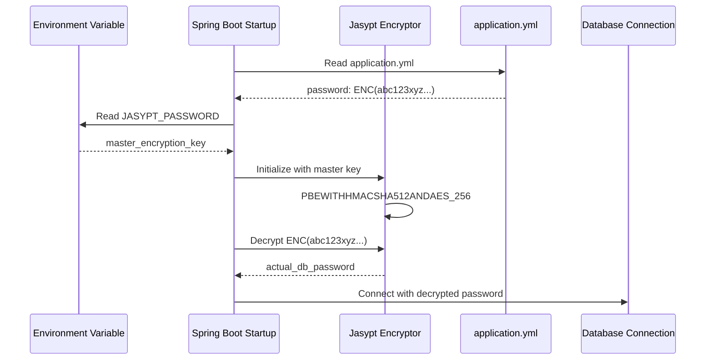

Jasypt algorithm: `PBEWITHHMACSHA512ANDAES_256` with 1000 iterations, random salt, random IV, Base64 output.

### Backup Encryption

When automated backups are active, backup files are encrypted before storage:

| Data Store | Backup Method | Encryption | Target Storage |
|------------|---------------|------------|----------------|
| PostgreSQL | `pg_dump` every 6 hours | `gpg --encrypt` with backup-specific GPG key | `/opt/emsist/backups/postgresql/` |
| Neo4j | `neo4j-admin database dump` daily | `gpg --encrypt` with backup-specific GPG key | `/opt/emsist/backups/neo4j/` |
| Valkey | `BGSAVE` + copy hourly | Host filesystem encryption | `/opt/emsist/backups/valkey/` |
| Offsite (optional) | `rclone sync` daily | Object storage SSE or client-side GPG | S3 / MinIO bucket |

## 7.12 Production-Parity Security Baseline

All environments follow a production-parity security posture. "Dev-only insecure shortcuts" are treated as technical debt exceptions, not normal practice.

**Mandatory rules:**

1. **No environment-level security downgrades** -- Security controls are designed and implemented once, then used across dev/staging/production.
2. **Transport security is mandatory** -- Edge traffic uses HTTPS. Service-to-service traffic uses authenticated secure channels (mTLS or signed service identity tokens). Data-store connections use TLS.
3. **Internal APIs are not implicitly trusted** -- `/api/v1/internal/**` endpoints require explicit service authentication and least privilege. Gateway deny-by-default for internal edge exposure.
4. **Pipeline governance enforces compliance** -- CI blocks net-new insecure transport entries. Existing insecure entries are tracked via an allowlist baseline and must be eliminated.

## 7.13 Installation Runbook and Startup Gating

Operational runbook: [CUSTOMER-INSTALL-RUNBOOK.md](../dev/CUSTOMER-INSTALL-RUNBOOK.md)

Runtime startup policy:

- `service-registry (eureka)` has an explicit healthcheck in app-tier Compose.
- Backend services and API gateway depend on Eureka with `condition: service_healthy`.
- This enforces registry readiness before service registration/discovery traffic begins.

### Cross-Cutting Customer Delivery Baseline

Customer-production deployment is governed by four platform rules that sit above any single feature module:

- customer delivery is artifact-only and must not require source checkout, source code, or local image build on customer hosts
- provisioning must distinguish `preflight`, `first_install`, `upgrade`, and `restore`
- app-tier rebuilds and upgrades must preserve Postgres, Neo4j, Valkey, and Keycloak-backed customer state
- release readiness requires restore proof and login continuity, not only container health

## 7.14 Docker Compose vs Kubernetes Comparison

| Component | Docker Compose (Dev/Staging) | Kubernetes (Production) |
|-----------|------------------------------|-------------------------|
| **PostgreSQL** | Single instance (`pgvector/pgvector:pg16`), named volume, `pg_dump` backup cron | CloudNativePG Operator: 1 primary + 2 streaming replicas, automated failover, continuous WAL archiving to S3 |
| **Neo4j** | Single instance (`neo4j:5-community`), named volume, `neo4j-admin dump` backup cron | Neo4j Helm chart: standalone (Community) or causal cluster (Enterprise), CronJob backup to PVC + S3 |
| **Valkey** | Single instance (`valkey/valkey:8-alpine`), AOF + RDB persistence, `BGSAVE` export cron | StatefulSet: 3-node Sentinel cluster, automatic failover, RDB snapshots to PVC |
| **Kafka** | Single broker (`cp-kafka:7.6.0`), replication factor 1, `log.retention.hours=168` | Strimzi Operator: 3 brokers, replication factor 3, min ISR 2, MirrorMaker for DR |
| **Backend Services** | 1 instance each, `restart: unless-stopped`, Docker health checks | Deployment: 2+ replicas, HPA (CPU 70%, memory 80%), PodDisruptionBudget (maxUnavailable=1) |
| **Frontend** | 1 nginx instance, `restart: unless-stopped` | Deployment: 2+ replicas, CDN cache, HPA on request rate |
| **Keycloak** | 1 instance, data in PostgreSQL | Deployment: 2+ replicas, Infinispan distributed cache for session clustering |
| **Credentials** | `.env.dev` / `.env.staging` files (gitignored, `chmod 600`) | Kubernetes Secrets (RBAC-protected per ServiceAccount) + optional HashiCorp Vault |
| **Encryption at Rest** | Host filesystem encryption (LUKS/FileVault on Docker data partition) | Encrypted StorageClass PVs (cloud KMS or LUKS-backed) |
| **Networking** | Docker bridge network, `ports:` host mapping | ClusterIP services, Ingress controller, NetworkPolicy isolation between namespaces |
| **Monitoring** | Actuator health endpoints, Docker health checks | Prometheus + Grafana, liveness/readiness probes, PodMonitor CRDs |
| **Backup** | Cron sidecar containers writing to host bind-mount | CronJobs writing to PVCs, `rclone` to S3, CloudNativePG continuous WAL archiving |
| **Failover** | Manual restart (`restart: unless-stopped`) -- NOT HA | Automatic (operator-managed failover for databases, K8s restarts for stateless services) -- IS HA |
| **Scaling** | Manual (change `deploy.replicas` in Compose, restart) | Automatic (HPA scales based on metrics, VPA adjusts resource requests) |

## 7.15 Super Agent Infrastructure

> The current ai-service is a chatbot API with CRUD agent configurations, custom WebClient LLM providers,
> PostgreSQL `ai_db` with 7 tables, and zero Kafka usage, zero tool binding, zero agent hierarchy.

### 7.15.1 Additional Infrastructure Components

| Component | Purpose | Docker Image | Port | Depends On |
|-----------|---------|-------------|------|------------|
| Debezium Connect | CDC from PostgreSQL WAL to Kafka for `agent.entity.lifecycle` events | `debezium/connect:2.7` | 8093 | Kafka, PostgreSQL |
| Ollama | Local LLM inference server for on-premise deployments | `ollama/ollama:0.3` | 11434 | -- (standalone) |
| Schema Registry | Kafka Avro/JSON schema management for event contracts | `confluentinc/cp-schema-registry:7.5.0` | 8094 | Kafka |

### 7.15.2 Updated Deployment Topology

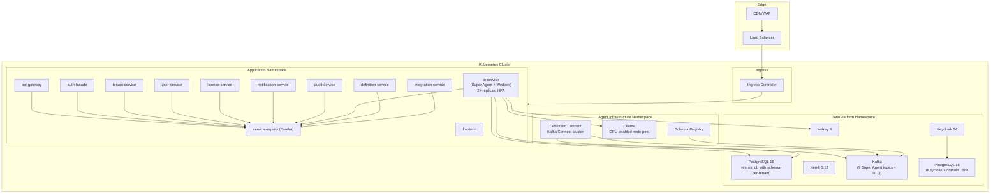

### 7.15.3 Kafka Topic Configuration

The Super Agent platform requires 9 dedicated Kafka topics plus per-topic dead-letter queues.

| Topic | Partitions | Replication Factor | Retention | Key | Consumer Group | Purpose |
|-------|-----------|-------------------|-----------|-----|---------------|---------|
| `agent.entity.lifecycle` | 6 | 3 (prod) / 1 (dev) | 7d | tenantId | ai-service-cdc | Debezium CDC events from PostgreSQL WAL |
| `agent.trigger.scheduled` | 3 | 3 / 1 | 24h | tenantId | ai-service-scheduler | ShedLock-coordinated cron triggers |
| `agent.trigger.external` | 3 | 3 / 1 | 7d | tenantId | ai-service-webhook | External webhook-initiated triggers |
| `agent.workflow.events` | 3 | 3 / 1 | 7d | tenantId | ai-service-workflow | User-initiated workflow triggers |
| `agent.worker.draft` | 6 | 3 / 1 | 7d | tenantId | ai-service-sandbox | Worker draft lifecycle events |
| `agent.approval.request` | 3 | 3 / 1 | 30d | tenantId | ai-service-hitl | HITL approval requests |
| `agent.approval.decision` | 3 | 3 / 1 | 30d | tenantId | ai-service-approval | HITL approval decisions with audit trail |
| `agent.benchmark.metrics` | 3 | 3 / 1 | 90d | anonymized | ai-service-benchmark | Cross-tenant anonymized metrics (k >= 5) |
| `ethics.policy.updated` | 1 | 3 / 1 | 30d | tenantId | ai-service-ethics | Ethics/conduct policy change propagation |
| `*.dlq` (per topic) | 1 each | 3 / 1 | 30d | original-key | ai-service-dlq | Dead-letter queue for failed message processing |

All topic payloads use JSON Schema registered in Schema Registry. Schema evolution follows backward-compatible rules.

### 7.15.4 Debezium CDC Configuration

| Property | Value | Rationale |
|----------|-------|-----------|
| `connector.class` | `io.debezium.connector.postgresql.PostgresConnector` | PostgreSQL WAL-based CDC |
| `plugin.name` | `pgoutput` | Native PostgreSQL 16 logical replication output plugin |
| `schema.include.list` | `public,tenant_*` | Capture changes from shared schema and all tenant schemas |
| `slot.name` | `emsist_ai_cdc` | Replication slot name |
| `publication.name` | `emsist_ai_publication` | PostgreSQL publication name |

PostgreSQL prerequisites: `wal_level = logical`, dedicated replication user, and publication for CDC-tracked tables.

### 7.15.5 Schema-per-Tenant Migration Strategy

The Super Agent platform uses schema-per-tenant isolation for agent data. Each tenant gets a dedicated PostgreSQL schema within the `emsist` database.

| Schema Name | Purpose | Managed By |
|-------------|---------|------------|
| `ai_shared` | Tool definitions, platform ethics baseline, prompt block templates | Platform admin |
| `ai_benchmark` | Anonymized cross-tenant metrics (k-anonymity k >= 5) | Benchmark service |
| `tenant_{uuid}` | Per-tenant agent hierarchy, worker drafts, maturity scores, conversation history, tenant conduct policies | Tenant provisioning worker |

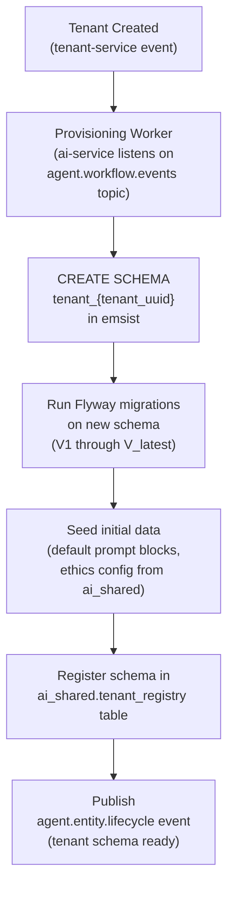

### 7.15.6 Ollama Model Management

| Model | Size | Use Case | Required |
|-------|------|----------|----------|
| `llama3:8b` | ~4.7GB | General-purpose local inference | Yes |
| `mistral:7b` | ~4.1GB | Code generation, technical analysis | Optional |
| `nomic-embed-text` | ~274MB | Embedding generation for RAG | Yes (for RAG) |

| Aspect | Development | Production |
|--------|-------------|------------|
| Compute | CPU-only (Docker Desktop) | GPU node pool preferred with CPU fallback |
| Storage | Docker volume `ollama-models` (10Gi) | Kubernetes PVC (20Gi, ReadWriteOnce) |
| Preload | `ollama pull` during `docker compose up` | Init container runs `ollama pull` before readiness |
| Health check | `curl http://localhost:11434/api/tags` | Kubernetes readiness probe on `/api/tags` |

### 7.15.7 Resource Requirements

#### Development Environment (Docker Compose)

| Component | CPU Limit | Memory Limit | Storage |
|-----------|-----------|-------------|---------|
| ai-service (Super Agent) | 2000m | 2Gi | -- |
| Debezium Connect | 500m | 1Gi | -- |
| Ollama | 2000m | 4Gi | 10Gi (models) |
| Schema Registry | 250m | 512Mi | -- |

#### Production Environment (Kubernetes)

| Component | CPU Request | CPU Limit | Memory Request | Memory Limit | Storage | Replicas |
|-----------|-----------|-----------|---------------|-------------|---------|----------|
| ai-service (Super Agent) | 500m | 2000m | 1Gi | 4Gi | -- | 2+ (HPA) |
| Debezium Connect | 250m | 1000m | 512Mi | 2Gi | -- | 1 (active) |
| Ollama | 1000m | 4000m | 2Gi | 8Gi | 20Gi (models PVC) | 1-2 |
| Schema Registry | 100m | 500m | 256Mi | 1Gi | -- | 2 |

### 7.15.8 Monitoring Additions

| Component | Metrics Source | Key Metrics | Alert Threshold |
|-----------|---------------|-------------|-----------------|
| Debezium Connect | JMX via Prometheus JMX Exporter | connector status, streaming lag, total changes | Lag > 60s, connector status != RUNNING |
| Ollama | `/api/tags` + custom exporter | model loaded, inference duration, request queue length | Queue > 10, inference p95 > 30s |
| Schema Registry | REST API `/subjects` | subjects count, compatibility failures | Compatibility failure on any topic |
| Kafka (Super Agent topics) | Kafka JMX metrics | consumer lag per group, messages in per sec | Consumer lag > 1000 messages |
| Schema-per-tenant migrations | Custom ai-service metric | tenant migration status | Any tenant in `failed` state |

---

## Changelog

| Timestamp | Change | Author |
|-----------|--------|--------|
| 2026-03-08 | Wave 3-4: Added Super Agent Infrastructure (7.13) with 13 subsections | ARCH Agent |
| 2026-03-09T14:30Z | Wave 6: Final completeness pass | ARCH Agent |
| 2026-03-17 | Consolidated ADR design principles into arc42. Removed status tags and implementation tracking. Integrated ADR-032 (COTS deployment contract) into 7.2-7.4, ADR-018 (HA multi-tier) into 7.8, ADR-022 (production-parity) into 7.12, ADR-019 (encryption) into 7.11. Added integration-service to inventory. Renumbered Super Agent sections to 7.15. | SA Agent |

---

**Previous Section:** [Runtime View](./06-runtime-view.md)
**Next Section:** [Crosscutting Concepts](./08-crosscutting.md)
