> **WP-ARCH-ALIGN (2026-03-24):** This document has been updated to reflect the frozen auth target model (Rev 2).
> See `Foundation/03-ownership-boundaries.md` SS FROZEN for the canonical decision.

# 8. Crosscutting Concepts

## 8.1 Tenant Isolation

Tenant isolation is enforced through tenant-scoped context propagation and tenant predicate enforcement in all data queries.

| Layer | Mechanism |
|-------|-----------|
| API/Gateway | Tenant context extraction from token/headers |
| Service | Tenant context filters/interceptors |
| Repository (Neo4j) | [AS-IS] Tenant-scoped Cypher predicates (auth-facade). [TARGET] Neo4j removed from auth domain; auth queries migrate to tenant-service PostgreSQL. Neo4j remains for definition-service only. |
| Repository (PostgreSQL) | Tenant-scoped JPA queries with `tenant_id` column filtering (all other services) |
| Data model | Tenant-aware entities: `TenantNode` in Neo4j, `tenant_id` FK column in PostgreSQL |

Key rule per [section 9.1.1](./09-architecture-decisions.md#911-polyglot-persistence-adr-001-adr-016): [AS-IS] Neo4j for RBAC/identity graph (auth-facade, definition-service), PostgreSQL for all relational domain services (7 active services + Keycloak). [TARGET] Neo4j for definition-service metamodel only. Auth RBAC/identity data migrates to tenant-service PostgreSQL. auth-facade and user-service are transition services (then removed).

## 8.1.1 Tenant Identifier Standard (UUID-First)

Tenant identity in runtime contracts is standardized as UUID.

| Contract Surface | Standard |
|------------------|----------|
| HTTP header | `X-Tenant-ID` carries tenant UUID |
| Path parameter | `/api/.../tenants/{tenantId}` expects UUID |
| Query parameter | Any `tenantId` query param uses UUID |
| Token claim | `tenant_id` should be UUID for stable cross-service matching |
| Persistence | Services may keep internal surrogate IDs, but external contracts remain UUID-first |

Compatibility rule (transition period):

- Services must accept legacy identifiers (`master`, `tenant-master`, slug-style IDs) only as backward-compatible aliases.
- Alias support is temporary and must not be used for new integrations.
- New frontend/backends must emit UUID in all tenant-bound calls.

## 8.2 Authentication and Session Security

Authentication uses a provider-agnostic BFF model with Keycloak as default provider.

| Concept | Standard |
|---------|----------|
| Auth orchestration | `auth-facade` BFF |
| Provider model | `IdentityProvider` strategy abstraction |
| Default provider | Keycloak 24.x |
| Token model | JWT (RS256) |
| Token storage | In-memory/session-safe frontend handling |
| Seat validation | Required during login via `license-service` |

### Provider Strategy Contract

```java
public interface IdentityProvider {
    AuthResponse authenticate(String realm, String email, String password);
    AuthResponse refreshToken(String realm, String refreshToken);
    void logout(String realm, String refreshToken);
    AuthResponse exchangeToken(String realm, String token, String providerHint);
}
```

## 8.3 Authorization

Authorization uses a composite model: **RBAC gates operations, licensing gates features, and data-classification gates data visibility** (per [section 9.3.6](./09-architecture-decisions.md#936-rbac-and-licensing-integration-adr-014) and [section 9.1.4](./09-architecture-decisions.md#914-data-classification-access-control-adr-017)).

| Dimension | Source | Scope | Enforcement |
|-----------|--------|-------|-------------|
| **Role (RBAC)** | [AS-IS] Neo4j graph via JWT claims. [TARGET] tenant-service PostgreSQL via JWT claims. | Per-user, per-tenant | Backend: `@PreAuthorize("hasRole('...')")`, Frontend: `authGuard` |
| **Feature (License)** | PostgreSQL via license-service | Per-tenant + per-user overrides | Backend: `@FeatureGate("feature_key")` [PLANNED], Frontend: `featureGuard` [PLANNED] |
| **Data Classification** | Resource metadata + policy mapping | Per-resource, per-field | Backend: policy filter/interceptor [TARGET], Frontend: classification visibility rules [TARGET] |
| **Context** | Request context | Per-request | Tenant boundary + resource ownership checks |

### Enforcement Truth

**The backend is the authoritative enforcement plane.** Frontend feature toggles are UX-only (hide/show modules, disable buttons). They do not provide security. See ADR-014, Section 2b for the full enforcement contract.

### Authorization Context Contract [TARGET STATE]

At login/refresh, backend returns an authorization context used by frontend for deterministic visibility rendering.

```json
{
  "user": {
    "id": "u-123",
    "tenantId": "b3f6f2ae-8899-4fb8-9e57-d0f4f2234a12"
  },
  "authorization": {
    "roles": ["ADMIN", "MANAGER"],
    "responsibilities": ["users.manage", "tenant.settings.read"],
    "features": ["advanced_workflows", "audit_logs"],
    "clearanceLevel": "CONFIDENTIAL",
    "policyVersion": "2026-03-r1",
    "uiVisibility": {
      "nav.admin": true,
      "nav.license": true,
      "page.audit": true,
      "field.user.nationalId": "masked"
    }
  }
}
```

Contract rules:

- `roles` are effective roles after inheritance resolution.
- `responsibilities` are stable policy keys mapped to operations and UI capabilities.
- `features` are license-validated capabilities.
- `clearanceLevel` is the maximum data-classification level this user may view in this tenant context.
- `policyVersion` allows frontend/backend policy drift detection during rollout.
- Backend always re-validates role/feature/classification policy on protected APIs; frontend visibility is advisory only.

### Data Classification Model [TARGET STATE]

Classification lattice (low to high):

- `OPEN`
- `INTERNAL`
- `CONFIDENTIAL`
- `RESTRICTED`

Decision rule:

- A user may access resource data only when `user.clearanceLevel >= resource.classificationLevel` and role/feature policy also passes.
- If operation is allowed but data level exceeds field-level visibility policy, response uses masking/redaction policy instead of full value.

### Policy Evaluation Order [TARGET STATE]

Every protected request must follow the same deterministic evaluation order:

1. Tenant activation gate (`tenant.status == ACTIVE` for non-master tenants).
2. Role resolution (`effectiveRoles = direct + inherited`).
3. Responsibility resolution (`responsibilities` from policy mapping).
4. License feature resolution (`features` from tenant license + seat + overrides).
5. Data-classification resolution (`clearanceLevel` vs resource classification level).
6. Policy decision (`ALLOW` only if all required dimensions pass).

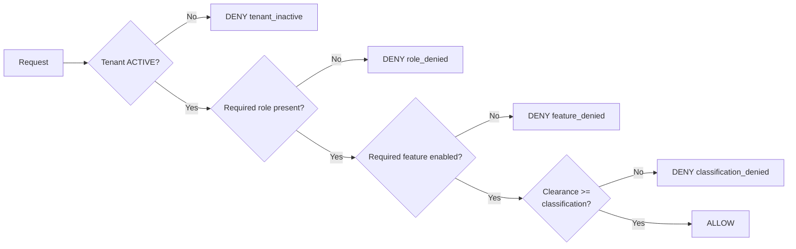

### Responsibility Policy Registry [TARGET STATE]

Responsibilities are platform policy keys that bind backend operations and frontend visibility to the same rule.

| Field | Standard |
|------|----------|
| `policyKey` | Stable key, e.g. `tenant.users.manage` |
| `requiredRoles` | Canonical role names (`SUPER_ADMIN`, `ADMIN`, ...) |
| `requiredFeatures` | License feature keys if applicable |
| `requiredClassification` | Minimum or maximum classification boundary per capability |
| `uiVisibilityKey` | Frontend visibility mapping key (e.g. `nav.admin`) |
| `status` | `planned`, `active`, `deprecated` |
| `owner` | Feature owner/team |

Policy behavior:

- Default deny: missing policy mapping means denied by default.
- No frontend-only policy: each `uiVisibilityKey` must map to backend enforcement.
- Every policy change increments `policyVersion`.

### UI Control Surface for Classification [TARGET STATE]

Frontend control coverage:

- Navigation and page visibility (`visible`, `hidden`).
- Component visibility (`enabled`, `disabled`).
- Field visibility (`full`, `masked`, `redacted`).
- Row-level visibility in grids/tables (filtered by classification policy).

Security rule:

- UI controls improve usability and reduce accidental exposure.
- Backend remains the final enforcement boundary for all data reads/writes.

### Incremental Policy Build Model [TARGET STATE]

Policy evolves per sprint under a strict default-deny model:

- New capability starts as denied by default until explicit policy mapping is added.
- Each policy increment must include:
  - Backend enforcement mapping (annotation/filter/policy key)
  - Frontend visibility mapping (`uiVisibility` key)
  - Test cases (unit + integration + E2E)
- Policy changes are versioned (`policyVersion`) and released with migration notes.

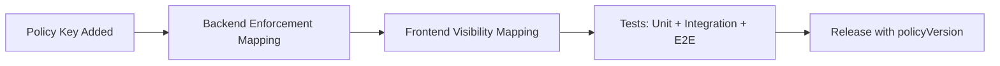

### Master Tenant

The master tenant (identified by `RealmResolver.isMasterTenant()`) receives implicit unlimited features for administration purposes. It **MUST NOT** be used to bypass licensing for business workloads. See ADR-014, Section 2a for hardening boundaries.

## 8.4 Caching Strategy

EMS uses Valkey as a single-tier distributed cache for hot paths.

| Technology | Use | Configuration |
|------------|-----|---------------|
| Valkey 8 | Role cache, seat validation, token blacklist, rate limiting, session state | Spring Data Redis, configurable TTL per cache name |

Cache invalidation is event-driven where possible, with TTL fallback (typically 5 minutes).

Key cache patterns (per [section 9.2.2](./09-architecture-decisions.md#922-valkey-distributed-caching-adr-005)):

| Cache Key Pattern | Service | TTL | Purpose |
|-------------------|---------|-----|---------|
| `userRoles::{email}` | auth-facade | Configurable | Role resolution cache |
| `seat:validation:{tenantId}:{userId}` | license-service | 5 min | Seat validation result |
| `license:feature:{tenantId}:{userId}:{key}` | license-service | 5 min | Feature gate check |
| `auth:blacklist:{jti}` | auth-facade | Token lifetime | Token revocation |
| `auth:mfa:pending:{hash}` | auth-facade | 5 min | MFA session state |

## 8.5 Error Handling

All public APIs follow RFC 7807-style error responses, enriched with a `code` field referencing the centralized message registry (see Section 8.18).

```json
{
  "type": "https://api.ems.com/errors/validation-error",
  "title": "Validation Error",
  "status": 400,
  "code": "DEF-E-002",
  "detail": "An object type with typeKey 'server' already exists in tenant 'T001'",
  "instance": "/api/v1/definitions/object-types"
}
```

**Rules:**
- The `code` field MUST reference a valid message code from the `message_registry` table
- The `detail` field MUST be the localized description resolved from the message registry for the request's `Accept-Language` locale
- If no translation exists for the requested locale, the default English description is used
- Error codes follow the convention `{SERVICE}-E-{SEQ}` (see Section 8.18 for full convention)
- All user-facing error messages MUST be registered — no hardcoded strings in backend services

## 8.6 Observability

| Area | Standard |
|------|----------|
| Logs | Structured JSON logs with trace/correlation IDs |
| Metrics | Micrometer/Prometheus |
| Dashboards | Grafana |
| Tracing | Distributed tracing across gateway/services |
| Health checks | Liveness/readiness probe endpoints |

## 8.7 Eventing

Kafka is the standard asynchronous integration mechanism. [PLANNED -- no KafkaTemplate usage exists in code yet]

| Event Category | Example Producers | Example Consumers |
|----------------|-------------------|-------------------|
| Audit events | Domain services | audit-service |
| Notification events | Domain services | notification-service |
| Domain sync events | tenant/user/license services | Other interested services |

## 8.8 API and Versioning

- URI-based API versioning (`/api/v1`).
- No breaking changes within a published version.
- Breaking changes require new version + migration guidance.

## 8.9 Data Architecture

Polyglot persistence per [section 9.1.1](./09-architecture-decisions.md#911-polyglot-persistence-adr-001-adr-016):

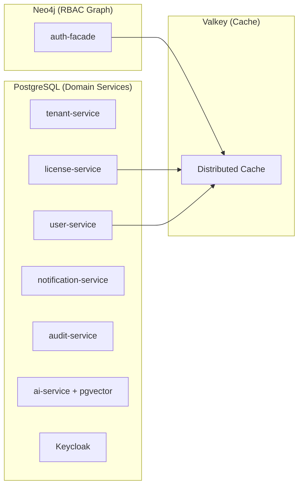

Each PostgreSQL service has its own logical database (`master_db`, `user_db`, `license_db`, `notification_db`, `audit_db`, `ai_db`, `keycloak_db`) on a single PostgreSQL 16 instance. See Architecture/05-building-blocks Service Matrix for the full mapping.

## 8.10 Documentation and Decision Governance

- Constraints are canonical in [02-constraints.md](./02-constraints.md).
- Decision rationale is canonical in [section 09](./09-architecture-decisions.md).
- Arc42 section ownership and anti-duplication rules are canonical in [Documentation Governance](../DOCUMENTATION-GOVERNANCE.md).

## 8.11 Tenant Provisioning Governance [TARGET STATE]

Tenant onboarding is governed as a long-running workflow with explicit status, retry, and audit semantics.

| Concern | Standard |
|--------|----------|
| Workflow trigger | Superadmin request creates provisioning job (`PENDING/PROVISIONING`) |
| Execution model | Asynchronous, idempotent, checkpointed phases |
| Identity bootstrap | Realm/client/roles/admin created through platform service account (not end-user impersonation) |
| Data bootstrap | Schema/migration/seed executed per tenant provisioning policy |
| Domain ownership | Managed domains automated; custom domains require customer DNS proof |
| TLS activation | Certificate + ingress binding required before tenant activation |
| License gate | Non-master tenant requires valid tenant license before activation |
| Failure handling | `PROVISIONING_FAILED` with step-level reason and retry token |
| Auditability | Every phase transition emits immutable audit event |
| Activation gate | Only `ACTIVE` tenants can authenticate and access business APIs; `ACTIVE` requires successful provisioning + license gate |

Security rule:

- Frontend or API caller cannot force `ACTIVE` state directly.
- Activation authority is restricted to provisioning control-plane completion checks, including license validation.

## 8.12 UI Design System and Accessibility

UI consistency and accessibility are enforced through PrimeNG 21 with a ThinkPlus neumorphic preset. A dedicated `emisi-ui` design-system library is planned but does not yet exist.

| Concern | Standard | Status |
|--------|----------|--------|
| Token source of truth | `--tp-*` CSS custom properties from ThinkPlus preset (`frontend/src/app/core/theme/thinkplus-preset.ts`) | [IMPLEMENTED] |
| PrimeNG theming | ThinkPlus neumorphic preset via `providePrimeNG()` + `definePreset()` in app config | [IMPLEMENTED] |
| Advanced CSS governance layer | Shared SCSS layer for `@supports`, input-modality hover rules, orientation tokens, `.sr-only`, and print utilities | [IMPLEMENTED] |
| Accessibility baseline | WCAG 2.2 AAA target (7:1+ contrast ratio in ThinkPlus preset) | [IMPLEMENTED] |
| Device support | Responsive layouts for mobile, tablet, desktop via media queries in component `.scss` files | [IMPLEMENTED] |
| `emisi-ui` library | Planned design-system library at `frontend/projects/emisi-ui` (directory deleted, does not exist) | [PLANNED] |
| `--emisi-*` tokens | Planned migration target token namespace (zero references in codebase) | [PLANNED] |
| Named primitives (`emisi-page-shell`, `emisi-section-header`, `emisi-surface-card`, `emisi-skip-link`, `emisi-keyboard-hints`) | Planned reusable components for the `emisi-ui` library | [PLANNED] |
| `EmisiPrimePreset` | Planned replacement for ThinkPlus preset | [PLANNED] |
| Keyboard discoverability | Skip links + keyboard hints on dense interaction pages | [PLANNED] |

**Evidence (verified 2026-03-01):**
- ThinkPlus preset: `frontend/src/app/core/theme/thinkplus-preset.ts` (exists, 663 bytes)
- `--tp-*` tokens: actively used in `styles.scss`, `shell-layout.component.scss`, `page-frame.component.scss`, `administration.page.ts`, `administration.page.scss`
- Advanced CSS governance layer: `frontend/src/app/core/theme/advanced-css-governance.scss` imported by `frontend/src/styles.scss`
- `--emisi-*` tokens: zero references found in `frontend/src/`
- `frontend/projects/emisi-ui/`: directory does not exist (deleted from repository)

Conformance rules:

- Current: pages and components consume `--tp-*` tokens from the ThinkPlus preset. No standalone color/spacing/typography token sets should be introduced.
- Current: advanced CSS behavior (feature-detection fallbacks, pointer-aware hover, orientation-aware spacing, and assistive-only utility classes) should be implemented through the shared governance layer.
- Target: when `emisi-ui` library is created, global styles will bridge `--tp-*` variables to `--emisi-*` tokens during migration, then remove legacy tokens.
- Accessibility behavior (focus-visible, reduced motion, high contrast, touch targets) should be centralized in design-system styles once the `emisi-ui` library exists.

### 8.12.1 Design QA Handshake [TARGET STATE]

Design quality is governed as a formal handshake between UX/design, frontend engineering, QA, and business owners to prevent implementation drift.

| Phase | Required Activities | Mandatory Evidence | Owner |
|------|----------------------|--------------------|-------|
| Pre-development validation | Prototype usability checks, responsive layout review, design-level accessibility checks, content/copy readiness review | Approved design spec + component usage map + accessibility notes | UX/Design |
| Implementation alignment | Reuse approved design-system components/tokens, map each screen element to governed component inventory | PR links to design references + component mapping checklist | Frontend Dev |
| Post-development parity review | Validate implemented UI against approved design (layout, spacing, states, interactions, copy tone) | Design parity checklist with pass/fail outcomes and deviations | UX/Design + Frontend Dev |
| QA execution | Functional + accessibility + responsive + compatibility + regression checks on implemented screens | QA execution report with environment and test evidence | QA |
| Acceptance and rollout | Internal alpha UAT, then controlled beta UAT before broad release | UAT sign-off record and release go/no-go decision | BA/Product Owner |

Release control rules:

- UI features are not release-ready without completed design parity validation and QA execution evidence.
- Approved deviations must be documented as tracked issues with owner, impact, and target fix release.

## 8.13 Encryption at Rest [PLANNED]

Reference: [section 9.5.2](./09-architecture-decisions.md#952-encryption-at-rest-strategy-adr-019), ISSUE-INF-016, ISSUE-INF-017, ISSUE-INF-018

Data-at-rest encryption uses a three-tier strategy: volume-level encryption, in-transit TLS, and configuration encryption (Jasypt). No application query changes are required -- encryption is transparent to services.

### Volume-Level Encryption

| Data Store | Docker Compose (Dev/Staging) | Kubernetes (Production) | Status |
|------------|------------------------------|-------------------------|--------|
| PostgreSQL | LUKS/FileVault on host Docker data partition | Encrypted StorageClass PVs (e.g., `gp3` with EBS encryption) | [PLANNED] |
| Neo4j | LUKS/FileVault on host Docker data partition | Encrypted StorageClass PVs | [PLANNED] |
| Valkey | LUKS/FileVault on host Docker data partition | Encrypted StorageClass PVs | [PLANNED] |
| Kafka | LUKS/FileVault on host Docker data partition | Encrypted StorageClass PVs (Strimzi JBOD) | [PLANNED] |

### Configuration Encryption (Jasypt)

| Service | Sensitive Config Values | Jasypt Status |
|---------|------------------------|---------------|
| auth-facade | Keycloak admin password, client secret, Neo4j password, Valkey password | [IMPLEMENTED] -- `JasyptConfig.java` with `PBEWITHHMACSHA512ANDAES_256` |
| ai-service | OpenAI/Anthropic API keys, DB password | [PLANNED] |
| tenant-service | DB password, Keycloak admin password | [PLANNED] |
| user-service | DB password | [PLANNED] |
| license-service | DB password, license signing key | [PLANNED] |
| notification-service | DB password, SMTP credentials | [PLANNED] |
| audit-service | DB password | [PLANNED] |
| process-service | DB password | [PLANNED] |

Evidence (auth-facade Jasypt):
- Config class: `backend/auth-facade/src/main/java/com/ems/auth/config/JasyptConfig.java`
- Algorithm: `PBEWITHHMACSHA512ANDAES_256`, 1000 iterations, `RandomSaltGenerator`, `RandomIvGenerator`
- Configuration: `backend/auth-facade/src/main/resources/application.yml` lines 48-56

## 8.14 In-Transit Encryption [PARTIAL]

Reference: [section 9.5.2](./09-architecture-decisions.md#952-encryption-at-rest-strategy-adr-019), ISSUE-INF-012, ISSUE-INF-021, ISSUE-INF-022

All connections between application services and data stores should use TLS. Currently, coverage is inconsistent.

| Connection | Protocol | Current Status | Target |
|------------|----------|----------------|--------|
| 6 services to PostgreSQL | JDBC + TLS | [IMPLEMENTED] -- `sslmode=verify-full` in tenant, user, license, notification, audit, process services | Maintain |
| ai-service to PostgreSQL | JDBC | [PLANNED] -- No `sslmode` parameter in JDBC URL | Add `?sslmode=verify-full` |
| auth-facade to Neo4j | Bolt | [PLANNED] -- Currently `bolt://` (plaintext) | `bolt+s://` with TLS policy |
| auth-facade to Valkey | Redis protocol | [PLANNED] -- No TLS configuration | `spring.data.redis.ssl.enabled=true` |
| ai-service to Valkey | Redis protocol | [PLANNED] -- No TLS configuration | `spring.data.redis.ssl.enabled=true` |
| All services to Kafka | Kafka protocol | [PLANNED] -- Currently `PLAINTEXT://` listener | `SASL_SSL://` with JAAS config |
| Keycloak to PostgreSQL | JDBC + TLS | [IMPLEMENTED] -- `sslmode=verify-full` | Maintain |

Evidence:
- PostgreSQL SSL (6 services): e.g., `backend/tenant-service/src/main/resources/application.yml` line 9 (contains `sslmode=verify-full`)
- Missing ai-service SSL: `backend/ai-service/src/main/resources/application.yml` line 9 (no `sslmode` parameter)
- Plaintext Neo4j: `backend/auth-facade/src/main/resources/application.yml` line 28 (`bolt://localhost:7687`)
- No Valkey TLS: `backend/auth-facade/src/main/resources/application.yml` lines 16-20 (no `ssl` property)
- Plaintext Kafka: `docker-compose.dev.yml` Kafka service (`KAFKA_ADVERTISED_LISTENERS: PLAINTEXT://`)

### 8.14.1 Production-Parity Rule [ACCEPTED]

Reference: [section 9.5.1](./09-architecture-decisions.md#951-production-parity-security-baseline-adr-022)

EMSIST is a licensed COTS product; environment-level security downgrades are not acceptable as a steady-state operating model.

Enforcement posture:

- Production-parity security baseline is mandatory across full stack design and implementation.
- CI transport-security governance blocks net-new insecure transport entries (`http://`, HTTPS-strict bypass flags) via `scripts/check-transport-security-baseline.sh`.
- Existing insecure entries are explicit technical debt tracked in `scripts/transport-security-allowlist.txt` and must be burned down.

## 8.15 Session TTL Governance [PLANNED]

Reference: ISSUE-INF-019

Session and token lifetimes control how long a user session remains active, how tokens are refreshed, and when sessions are forcefully terminated.

| Parameter | Default | Configurable | Source | Status |
|-----------|---------|-------------|--------|--------|
| Access token lifetime | 5 min | Keycloak realm settings | Keycloak | [IMPLEMENTED] -- Keycloak manages access token expiry |
| Refresh token lifetime | 30 min | Keycloak realm settings | Keycloak | [IMPLEMENTED] -- Keycloak manages refresh token expiry |
| Token blacklist TTL | = access token remaining lifetime | Automatic | auth-facade Valkey SET with TTL | [IMPLEMENTED] -- `TokenServiceImpl.blacklistToken()` (mechanism exists, not wired to logout) |
| MFA pending TTL | 5 min | auth-facade config | Valkey | [IN-PROGRESS] -- `AuthServiceImpl.storePendingTokens()` stores with 5-min TTL |
| Inactivity timeout | 30 min | [PLANNED] | Frontend + Valkey | [PLANNED] -- No idle-session detection exists |
| Max concurrent sessions | Unlimited | [PLANNED] | auth-facade + Valkey | [PLANNED] -- No session counting exists |

### Key Gap

The token blacklist mechanism (`TokenServiceImpl.blacklistToken()` and `isTokenBlacklisted()`) is implemented in auth-facade but has two gaps:

1. **Logout does not blacklist the access token.** The `AuthServiceImpl.logout()` method calls `identityProvider.logout()` (revoking the refresh token in Keycloak) but does NOT call `tokenService.blacklistToken()`. This means a logged-out user's access token remains valid until it naturally expires.

2. **API gateway does not check the blacklist.** The `TenantContextFilter` in the API gateway extracts tenant context from the JWT but does not query Valkey to check if the token's JTI has been blacklisted. Even if auth-facade blacklisted a token, the gateway would still forward requests with that token.

## 8.16 Credential Rotation [PLANNED]

Reference: [section 9.5.3](./09-architecture-decisions.md#953-service-credential-management-adr-020)

Credential rotation ensures that compromised or aged passwords are replaced before they can be exploited. The rotation strategy varies by environment maturity.

| Environment | Method | Frequency | Automation | Status |
|-------------|--------|-----------|------------|--------|
| Development | Manual password change in `.env.dev` | On demand | None | [PLANNED] -- Currently uses shared `postgres` superuser |
| Staging | Manual password change in `.env.staging` | Quarterly | None | [PLANNED] -- Currently uses shared `postgres` superuser |
| Production | K8s Secret rotation + optional Vault lease TTL | 90 days | Vault auto-rotation (External Secrets Operator) | [PLANNED] -- No K8s deployment exists yet |

### Current State

All 7 PostgreSQL-backed services use the shared `postgres` superuser with the same hardcoded fallback password (`${DATABASE_PASSWORD:postgres}`). There is no rotation, no per-service isolation, and no fail-fast behavior on missing credentials. The `keycloak` database user is the only dedicated per-service user.

Evidence: See ADR-020 current state audit table for per-service `application.yml` references.

### Target State

Per ADR-020, each service will have a dedicated PostgreSQL user (e.g., `svc_tenant`, `svc_user`, `svc_audit`) with least-privilege grants. Credentials will be externalized to environment-specific `.env` files with no hardcoded fallbacks, ensuring fail-fast on misconfiguration.

## 8.17 Super Agent Crosscutting Patterns [PLANNED]

> The following crosscutting patterns describe the target-state Super Agent platform architecture.
> **ALL patterns are [PLANNED]** -- zero Super Agent code exists in the codebase.
> The current `ai-service` is a simple chatbot API with custom WebClient LLM providers, PostgreSQL + pgvector, zero Kafka usage, and zero agent hierarchy.
> Reference: [section 9.7](./09-architecture-decisions.md#97-super-agent-platform-adr-023-through-adr-030), Design Documents 01-11.

### 8.17.1 Maturity-Based Routing [PLANNED]

Reference: [section 9.7.2](./09-architecture-decisions.md#972-agent-maturity-model-adr-024)

The Agent Trust Score (ATS) governs runtime routing behavior for all worker outputs. Every worker agent has a per-tenant ATS that determines whether its outputs are auto-approved or routed to a human-in-the-loop (HITL) review queue.

**ATS Level Routing Rules:**

| ATS Range | Level | Routing Behavior |
|-----------|-------|-----------------|
| 0-39 | Coaching | All worker outputs routed to HITL review (confirmation type). No auto-approve. Restricted tool set. |
| 40-64 | Co-pilot | Routine/low-risk outputs auto-approved. Novel/medium-risk outputs routed to HITL review. Standard tool set. |
| 65-84 | Pilot | Most outputs auto-approved. High-risk outputs only routed to HITL review. Extended tool set. |
| 85-100 | Graduate | Full autonomy. All outputs auto-approved with audit trail. Full tool set including write operations. |

**Routing Decision Flow:**

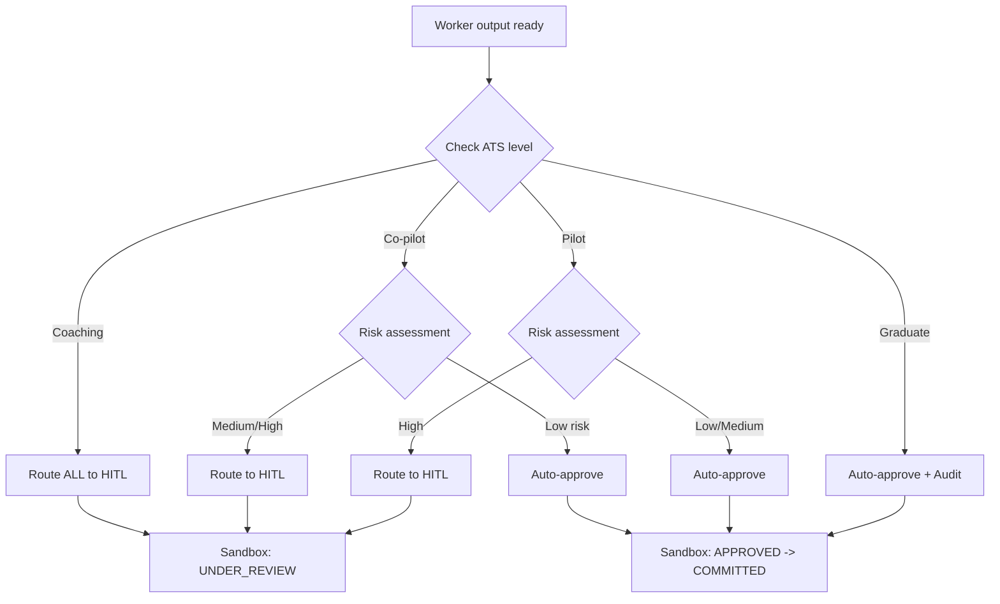

**ATS Calculation:**

The Agent Trust Score is a weighted average of 5 dimensions per [section 9.7.2](./09-architecture-decisions.md#972-agent-maturity-model-adr-024):

| Dimension | Weight | Measures |
|-----------|--------|----------|
| Identity | 20% | Configuration integrity, versioning, template adherence |
| Competence | 25% | Task completion accuracy, domain expertise, tool proficiency |
| Reliability | 25% | Consistency over time, availability, response latency |
| Compliance | 15% | Ethics policy adherence, data handling rules, regulatory requirements |
| Alignment | 15% | Organizational goal alignment, user satisfaction, feedback |

**ATS Formula:** `ATS = (Identity x 0.20) + (Competence x 0.25) + (Reliability x 0.25) + (Compliance x 0.15) + (Alignment x 0.15)`

**Level Transition Rules:**

- **Promotion:** Requires sustained score above the level threshold for 30 consecutive days (configurable per tenant) with minimum 100 completed tasks. The evaluation window prevents premature promotion based on short-term performance spikes.
- **Demotion (score):** Takes effect immediately when ATS drops below current level threshold. No grace period for score-based demotion. Demotion is instantaneous; promotion is gradual. This asymmetry prioritizes safety over convenience.
- **Demotion (violation):** Critical compliance violation triggers immediate demotion to Coaching regardless of current ATS. Requires tenant admin manual promotion to resume.
- **Per-tenant scoring:** The same agent template can be at different maturity levels across tenants. A worker agent earning Graduate status in Tenant A starts at Coaching in Tenant B until it demonstrates competence in that tenant's domain context.

### 8.17.2 Ethics Enforcement Pipeline [PLANNED]

Reference: [section 9.7.4](./09-architecture-decisions.md#974-platform-ethics-baseline-adr-027)

The ethics enforcement pipeline implements a two-layer model that ensures all agent actions comply with both platform-wide immutable rules and tenant-configurable conduct policies.

**Two-Layer Ethics Model:**

| Layer | Scope | Mutability | Evaluation Point |
|-------|-------|-----------|-----------------|
| Platform Baseline | All tenants, all agents | Immutable (platform owner only) | Pre-execution + post-execution |
| Tenant Conduct | Per-tenant, configurable | Tenant admin can add/modify (cannot weaken baseline) | Pre-execution + post-execution |

The Platform Baseline enforces non-negotiable rules that no tenant can override, disable, or weaken. Examples include: cross-tenant data leakage prevention, audit trail integrity, PII handling in prompts, and the HITL escalation requirement for safety-critical actions. Tenant Conduct extensions allow each tenant to add industry-specific rules (e.g., HIPAA for healthcare, SOX for finance, GDPR-specific data handling requirements) on top of the baseline.

**Ethics Pipeline Flow:**

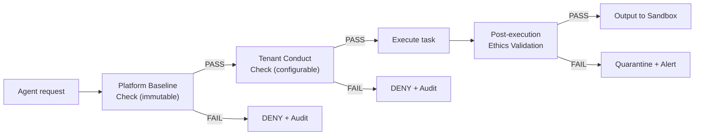

**Performance and Caching:**

- Performance target: < 100ms per evaluation (pre-execution + post-execution combined).
- Cache strategy: Conduct policies cached in Valkey with 5-minute TTL, invalidated on `ethics.policy.updated` Kafka event.
- Audit: Every ethics decision is logged with decision reason, policy version, tenant context, and the specific rule that triggered a DENY or QUARANTINE outcome.

**Post-Execution Quarantine:**

If a worker's output passes pre-execution checks but fails post-execution validation (e.g., the model generated PII in its response despite instructions not to), the output is quarantined rather than delivered. The quarantine record includes the full execution trace, the failing ethics rule, and the output content for human review.

### 8.17.3 Dynamic Prompt Composition [PLANNED]

Reference: [section 9.7.6](./09-architecture-decisions.md#976-dynamic-system-prompt-composition-adr-029), LLD Section 3.29.1

The Super Agent platform replaces static prompt templates with a runtime composition system that assembles system prompts from modular, database-stored blocks. Each block has a priority, token budget, cacheability, and inclusion conditions.

**10-Block Composition System:**

| Priority | Block Type | Source | Cacheable | Max Tokens (GPT-4o) |
|----------|-----------|--------|-----------|-------------------|
| P1 | Identity Preamble | Platform config | Immutable (long TTL) | 500 |
| P2 | Role Definition | Agent hierarchy config | Stable (medium TTL) | 1,000 |
| P3 | Domain Context | Sub-orchestrator config | Stable (medium TTL) | 2,000 |
| P4 | Tenant Rules | Tenant-specific config | Session TTL | 1,000 |
| P5 | Tool Bindings | Tool registry | Stable (medium TTL) | 2,000 |
| P6 | Safety Rails | Ethics config | Immutable (long TTL) | 500 |
| P7 | Output Format | Task-specific template | Stable (medium TTL) | 500 |
| P8 | Memory Context | Conversation history | Ephemeral | 4,000 |
| P9 | Knowledge Base | RAG retrieval results | Ephemeral | 8,000 |
| P10 | Conversation History | Recent message context | Ephemeral | Dynamic (remaining budget) |

Blocks P1-P7 are relatively stable and can be cached. Blocks P8-P10 are ephemeral and assembled per-request. The composition algorithm fills higher-priority blocks first and allocates remaining token budget to lower-priority blocks.

**Composition Algorithm:**

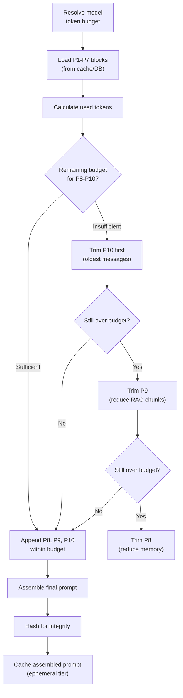

**Model Token Budgets:**

| Model | Context Window | Reserved for Completion | Available for Prompt |
|-------|---------------|------------------------|---------------------|
| GPT-4o | 128K | 4K (configurable) | 124K |
| Claude | 200K | 4K (configurable) | 196K |
| Gemini | 1M | 8K (configurable) | ~992K |
| Llama (local) | 128K | 4K (configurable) | 124K |

**Key Design Decisions:**

- Handlebars template engine for variable substitution within blocks (e.g., `{{tenant.name}}`, `{{user.role}}`).
- Prompt integrity hash stored in audit trail for reproducibility and tamper detection.
- Overflow trimming follows reverse-priority order: P10 (conversation history) is trimmed first, P9 (RAG chunks) second, P8 (memory) third. Blocks P1-P7 are never trimmed.

### 8.17.4 Agent-to-Agent Authentication [PLANNED]

Reference: [section 9.7.1](./09-architecture-decisions.md#971-hierarchical-architecture-adr-023)

The Super Agent hierarchical architecture (SuperAgent -> Sub-Orchestrator -> Worker) requires an internal authentication and authorization model to ensure that tenant context is propagated through the entire chain and that workers cannot exceed their granted permissions.

**Authentication Boundaries:**

| Boundary | Authentication | Authorization |
|----------|---------------|---------------|
| User -> SuperAgent | JWT (from auth-facade) | RBAC + license feature gate |
| SuperAgent -> Sub-Orchestrator | Tenant-scoped internal context | Task delegation authority |
| Sub-Orchestrator -> Worker | Task-scoped execution token | Tool permission set (maturity-gated) |
| Worker -> External Tool | Sandboxed execution context | Tool-specific credentials (vault) |

**Context Propagation:**

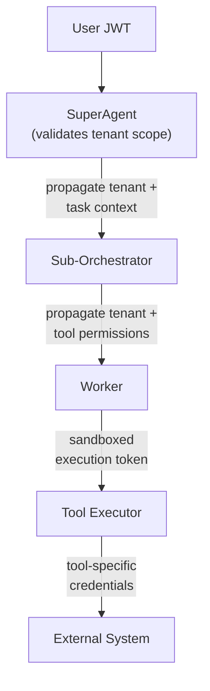

**Key Invariants:**

- **Tenant context propagation:** The originating user's tenant ID is propagated through every boundary in the chain. No agent at any level can change, escalate, or omit the tenant context. This is the foundational guarantee for multi-tenant isolation.
- **Maturity-gated tool permissions:** A worker's tool permission set is restricted by its ATS maturity level (see Section 8.17.1). A Coaching-level worker cannot invoke write tools; a Graduate-level worker can invoke the full tool set.
- **Correlation ID for distributed tracing:** All cross-boundary calls include a correlation ID for end-to-end distributed tracing. The correlation ID connects the initial user request through orchestration, delegation, tool execution, and response assembly.
- **No privilege escalation:** A sub-orchestrator cannot grant a worker more permissions than the sub-orchestrator itself possesses. A worker cannot invoke tools not authorized for its maturity level. The authorization chain is strictly non-escalating.

### 8.17.5 Schema-per-Tenant Data Isolation [PLANNED]

Reference: [section 9.1.3](./09-architecture-decisions.md#913-schema-per-tenant-for-agent-data-adr-026)

The Super Agent platform uses a 3-schema isolation model for agent data within the `ai_db` PostgreSQL database. This provides stronger isolation than the current row-level `tenant_id` column discrimination used by other EMSIST services (documented in Known Discrepancies: "ADR-003 Graph-per-Tenant: Accepted, 0% implemented").

**3-Schema Model:**

| Schema | Content | Isolation | Access Pattern |
|--------|---------|-----------|---------------|
| `ai_shared` | Tool definitions, platform ethics policies, prompt block templates | Shared read, platform-admin write | All tenants read |
| `ai_benchmark` | Anonymized cross-tenant metrics | Shared read/write with k-anonymity (k >= 5) | Aggregated access only |
| `tenant_{uuid}` | Agent hierarchy, worker drafts, maturity scores, conversations, conduct policies | Strict tenant isolation | Tenant-scoped queries only |

**Schema Architecture:**

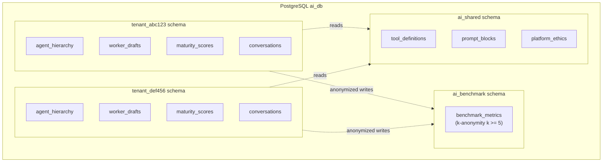

**Key Design Decisions:**

- **Flyway migrations run per-schema during tenant provisioning.** When a new tenant is created, the provisioning workflow creates a `tenant_{uuid}` schema and executes the full migration set within that schema. This ensures every tenant schema is structurally identical.
- **Schema `search_path` set per-request.** The JDBC connection's `search_path` is set to `tenant_{uuid}, ai_shared` based on the tenant context extracted from the JWT. This means tenant-scoped queries automatically resolve to the correct schema, and shared data (tool definitions, prompt templates) is always accessible.
- **Cross-schema access prevented by PostgreSQL GRANT restrictions.** The application database user for ai-service has `USAGE` on `ai_shared` (read-only) and `USAGE + ALL PRIVILEGES` on the tenant's own schema only. Direct cross-tenant schema access is prevented at the database level.
- **Benchmark writes use k-anonymity.** Metrics written to `ai_benchmark` are stripped of tenant-identifying information and only published when at least k=5 tenants contribute to the same metric category. This prevents re-identification of tenant-specific performance patterns.

### 8.17.6 Event-Driven Communication [PLANNED]

Reference: [section 9.7.3](./09-architecture-decisions.md#973-event-driven-agent-triggers-adr-025), Design Doc 09 Section 16.6

The Super Agent platform uses event-driven architecture to enable proactive agent behavior. The current EMSIST codebase has Kafka infrastructure (`confluentinc/cp-kafka:7.5.0` in Docker Compose) but zero producers or consumers (documented in Known Discrepancies: "No KafkaTemplate in any service").

**Event Sources and Routing:**

Canonical Kafka topic names are defined in [section 9.7.3](./09-architecture-decisions.md#973-event-driven-agent-triggers-adr-025).

| Source | Trigger | Kafka Topic | Payload Schema | Consumer |
|--------|---------|-------------|---------------|----------|
| Debezium CDC | PostgreSQL WAL change | `agent.entity.lifecycle` | CDC envelope (ADR-025) | Event Processor |
| ShedLock Scheduler | Cron expression fire | `agent.trigger.scheduled` | Scheduled trigger payload | Event Processor |
| External Webhooks | HTTP POST with HMAC verification | `agent.trigger.external` | External trigger payload | Event Processor |
| Workflow Events | Business process step completion | `agent.workflow.events` | Workflow trigger payload | Event Processor |

**Event Flow Architecture:**

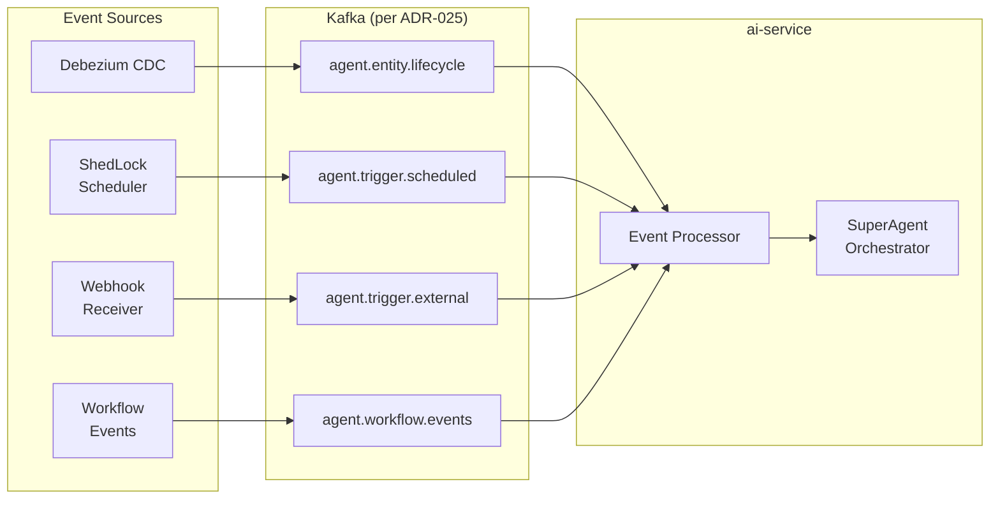

**Resilience Patterns:**

| Pattern | Configuration | Purpose |
|---------|--------------|---------|
| Circuit breaker per event source | Failure threshold, recovery timeout (configurable) | Prevent cascade failures when one event source becomes unreliable |
| Maximum event chain depth | 5 (configurable) | Prevent runaway recursive event-triggered agent chains |
| Deduplication window | Per correlation ID, configurable window | Prevent duplicate processing of the same triggering event |
| Rate limiting | Per tenant per topic (configurable) | Prevent a single tenant from monopolizing event processing capacity |
| Dead Letter Queue (DLQ) | `*.dlq` topic per source topic | Failed events routed to DLQ with error envelope for later investigation |

**Event Processing Pipeline:**

All events pass through a common Event Processor that:

1. Validates the event payload against the registered JSON Schema.
2. Extracts and validates the tenant context from the event.
3. Checks rate limits for the tenant on the event topic.
4. Checks deduplication window for the correlation ID.
5. Routes the validated event to the SuperAgent Orchestrator for task planning.

Failed events at any step are routed to the DLQ with an error envelope containing: original event, failure reason, failure step, timestamp, and retry metadata.

**Event Processing Security [PLANNED]:**

All Kafka messages are signed with HMAC-SHA256 using per-topic keys to prevent message tampering. Consumer groups validate signatures before processing. Failed signature validation routes messages to the DLQ with `SIGNATURE_INVALID` error code. Event payloads containing PII are encrypted at the field level using AES-256-GCM before publishing. Decryption keys are managed per-tenant in the vault. This ensures that even if Kafka storage or transport is compromised, PII fields remain protected. No event signing, field-level encryption, or per-tenant key management exists in the current codebase.

---

## Changelog

| Timestamp | Change | Author |
|-----------|--------|--------|
| 2026-03-08 | Wave 3-4: Added 6 Super Agent Crosscutting Patterns (8.17.1-8.17.6): maturity-based request routing, ethics enforcement pipeline, dynamic prompt composition, agent-to-agent authentication, schema-per-tenant isolation, event-driven communication | ARCH Agent |
| 2026-03-09T14:30Z | Wave 6 (Final completeness): Verified all 6 crosscutting patterns complete with diagrams, ADR references, and [PLANNED] status tags. Zero TODOs, TBDs, or placeholders. Changelog added. | ARCH Agent |

## 8.18 Internationalization (i18n) — Zero Hardcoded Text Principle [PLANNED]

> **Architectural Principle:** The EMSIST codebase MUST NOT contain any hardcoded user-facing text — in backend services, frontend components, or API responses. All user-visible strings (labels, messages, errors, confirmations, tooltips, placeholders) MUST be stored as coded variables referencing a centralized translation table in PostgreSQL, and rendered at runtime in the user's selected interface language.

### 8.18.1 Principle Statement

| Aspect | Rule |
|--------|------|
| **Principle Name** | Zero Hardcoded Text (ZHT) |
| **Scope** | All EMSIST services (backend + frontend) |
| **Rationale** | EMSIST is a multi-tenant, multi-language platform. Users must be able to switch interface language at runtime. Hardcoded strings prevent this and create maintenance burden for translations. |
| **Enforcement** | Code review, linting rules, pre-commit hooks |
| **TOGAF Classification** | Application Architecture Principle — Presentation Layer |
| **Arc42 Classification** | Crosscutting Concept — Internationalization |

### 8.18.2 What MUST Be Externalized

| Category | Examples | Storage |
|----------|----------|---------|
| **Error messages** | Validation errors, not-found, conflict, authorization | `message_registry` table |
| **Confirmation dialogs** | Delete confirmation, status change, publish release | `message_registry` table |
| **Warning messages** | Concurrent modification, breaking changes, stale data | `message_registry` table |
| **Success toasts** | Created, updated, deleted, published | `message_registry` table |
| **UI labels** | Button text, column headers, tab titles, menu items | Frontend translation files (JSON per locale) |
| **Placeholder text** | Search placeholders, empty state messages | Frontend translation files |
| **Tooltip text** | Help tooltips, info icons | Frontend translation files |
| **Enum display values** | Status labels (Active→"نشط", Planned→"مخطط"), data types | `enum_translation` table or frontend translation files |

### 8.18.3 Message Registry Data Model

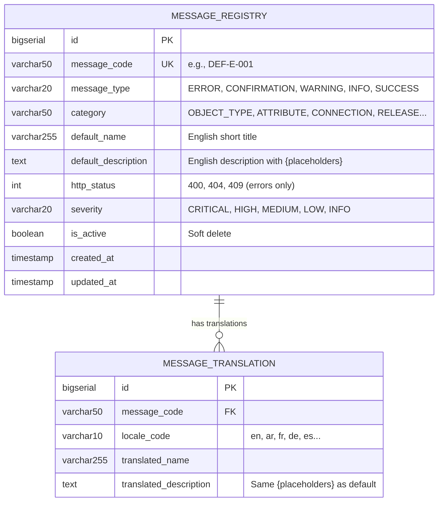

### 8.18.4 Message Code Convention

```
{SERVICE}-{TYPE}-{SEQ}
```

| Segment | Values |
|---------|--------|
| `SERVICE` | `DEF` (Definition), `AUTH` (Auth), `TEN` (Tenant), `LIC` (License), `USR` (User), `AUD` (Audit), `NOT` (Notification), `AI` (AI), `PRC` (Process), `SYS` (System) |
| `TYPE` | `E` (Error), `C` (Confirmation), `W` (Warning), `I` (Info), `S` (Success) |
| `SEQ` | 3-digit sequential, scoped per service+type |

### 8.18.5 Backend Implementation Pattern

**Service layer — resolving messages:**

```java
// MessageService resolves codes to localized strings
@Service
public class MessageService {
    private final MessageRegistryRepository registry;
    private final MessageTranslationRepository translations;

    public String resolve(String code, Locale locale, Object... args) {
        // 1. Lookup translation for locale
        // 2. Fallback to default English if missing
        // 3. Replace {placeholders} with args
        // 4. Return localized string
    }
}
```

**Exception handling — localized ProblemDetail:**

```java
@ExceptionHandler(DuplicateResourceException.class)
ProblemDetail handleDuplicate(DuplicateResourceException ex, Locale locale) {
    String detail = messageService.resolve(
        ex.getCode(),      // "DEF-E-002"
        locale,            // from Accept-Language header
        ex.getArgs()       // {"typeKey", "server", "tenantId", "T001"}
    );
    ProblemDetail pd = ProblemDetail.forStatus(409);
    pd.setProperty("code", ex.getCode());
    pd.setDetail(detail);
    return pd;
}
```

**FORBIDDEN patterns (backend):**

```java
// ❌ NEVER: Hardcoded error message
throw new BusinessException("Object type not found");

// ✅ ALWAYS: Message code reference
throw new ResourceNotFoundException("DEF-E-001", objectTypeId, tenantId);
```

### 8.18.6 Frontend Implementation Pattern

**Translation file structure:**

```
frontend/src/assets/i18n/
├── en.json          # English (default, always complete)
├── ar.json          # Arabic
├── fr.json          # French
├── de.json          # German
└── es.json          # Spanish
```

**Angular integration:**

```typescript
// Translation service wraps @ngx-translate or Angular i18n
// UI labels loaded from JSON files
// API messages (errors, confirmations) come pre-localized from backend

// ❌ NEVER: Hardcoded text in templates
<button>Create Object Type</button>

// ✅ ALWAYS: Translation key reference
<button>{{ 'definition.objectType.actions.create' | translate }}</button>

// ❌ NEVER: Hardcoded toast message
this.messageService.add({summary: 'Object type created'});

// ✅ ALWAYS: Message from API response or translation key
this.messageService.add({summary: response.message}); // pre-localized from backend
```

### 8.18.7 Locale Resolution Flow

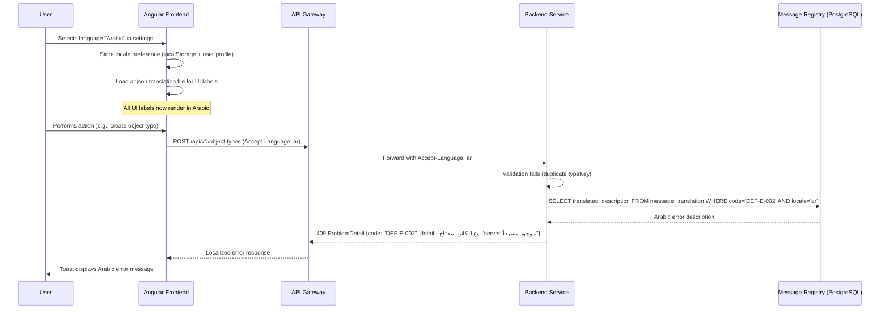

### 8.18.8 RTL (Right-to-Left) Support

For Arabic and other RTL languages:

| Concern | Implementation |
|---------|---------------|
| Layout direction | `dir="rtl"` on `<html>` element, toggled by locale |
| CSS | Use logical properties (`margin-inline-start` instead of `margin-left`) |
| PrimeNG | PrimeNG supports RTL natively via `dir` attribute |
| Icons | Directional icons (arrows, chevrons) flip automatically with CSS `transform: scaleX(-1)` |
| Numbers | Rendered LTR within RTL context (CSS `unicode-bidi: embed`) |
| Date formats | Locale-aware date formatting via Angular DatePipe |

### 8.18.9 Compliance Checklist

Before any PR is merged:

```
[ ] No hardcoded user-facing strings in Java/TypeScript
[ ] All error messages reference a message_registry code
[ ] All UI labels use translation keys (| translate pipe)
[ ] All confirmation dialogs reference message codes
[ ] New message codes added to message_registry migration script
[ ] English default translation provided for all new codes
[ ] RTL layout tested for Arabic locale (if UI changes)
```

### 8.18.10 TOGAF Alignment

| TOGAF Artifact | i18n Impact |
|----------------|-------------|
| **Application Architecture** | All application services implement the MessageService pattern; no service may return hardcoded user-facing text |
| **Data Architecture** | `message_registry` and `message_translation` tables are part of the shared data platform; owned by a shared-services schema or a dedicated `message-service` |
| **Technology Architecture** | Angular `@ngx-translate` for frontend; Spring `MessageSource` + custom `MessageService` for backend; PostgreSQL for message storage |
| **Business Architecture** | Supports multi-language, multi-tenant enterprise deployments; Arabic (RTL) as first-class citizen |
| **Security Architecture** | Message codes in error responses prevent information leakage (no stack traces, no internal details); translators have controlled access to message content |

## 8.19 Production Packaging, Provisioning, and Durability [IN-PROGRESS]

Reference:

- [R07 Cross-Cutting Platform Requirements](../.Requirements/R07.%20PLATFORM%20OPERATIONS%20AND%20CUSTOMER%20DELIVERY/Design/01-Cross-Cutting-Platform-Requirements.md)
- [R07 Acceptance Criteria and Release Gates](../.Requirements/R07.%20PLATFORM%20OPERATIONS%20AND%20CUSTOMER%20DELIVERY/Design/02-Acceptance-Criteria-and-Release-Gates.md)
- [CUSTOMER-INSTALL-RUNBOOK.md](../dev/CUSTOMER-INSTALL-RUNBOOK.md)

### 8.19.1 Customer Delivery Contract

Customer production delivery is governed as a COTS package:

- versioned runtime artifacts
- manifests/templates and env templates
- deploy and rollback scripts
- runbooks and checksums

The production contract must not assume source code, source checkout, Docker build contexts, or local image build on customer hosts.

### 8.19.2 Provisioning Modes

Provisioning is a controlled operational state machine with four modes:

| Mode | Allowed Behavior |
|------|------------------|
| `preflight` | Validate secrets, URLs, certificates, ports, backup target, and clock sync |
| `first_install` | Create schemas, apply baseline bootstrap, initialize identity and core config |
| `upgrade` | Back up first, run compatibility checks, apply migrations only |
| `restore` | Restore data and identity state first, then restart runtime dependencies, then verify login |

Bootstrap rule:

- first-install logic must be idempotent and must never overwrite customer-created identity or platform state during upgrade or restore

### 8.19.3 Authentication and Runtime Dependency Chain

Login continuity depends on more than Keycloak:

- Keycloak availability and persisted realm/user state
- auth-facade client credentials and bootstrap completion
- license-seat validation for non-master tenants
- Valkey availability for session and MFA state
- correct host time for JWT and TOTP validation

Authentication is not operationally healthy unless this full chain is intact after restart, upgrade, and restore.

### 8.19.4 Durability and Release Rules

Durability rules for non-disposable environments:

- app-tier rebuilds and upgrades must not remove or recreate protected data volumes
- Keycloak-backed identity state is part of the protected data set
- `docker compose down -v` is forbidden in approved runbooks, CI, and release automation
- release approval requires successful backup/restore evidence and a real persisted-user login after rollout

## 8.20 Integration Governance

EMSIST centralizes all integration concerns into a dedicated `integration-service` (port 8091) that serves as the integration and communication governance hub. This is a crosscutting concern because integration patterns span multiple services and external systems.

### 8.20.1 Integration Patterns Governed

| Pattern | Description | Examples |
|---------|-------------|---------|
| **EMSIST to External EA/BPM** | Bidirectional sync between EMSIST definitions and external enterprise architecture tools | MEGA HOPEX, ARIS, webMethods |
| **Tenant to Tenant** | Controlled, auditable data sharing between EMSIST tenants within the same deployment | Cross-tenant definition sharing, organizational unit exchange |
| **Agent to Agent** | Governance of AI agent communication within and between EMSIST agents | Inter-orchestrator delegation, worker collaboration |
| **EMSIST to External AI** | Rate-limited, policy-governed channels to external AI providers | Claude, Codex, Gemini integration |

### 8.20.2 Governance Controls

| Control | Mechanism |
|---------|-----------|
| **Connector lifecycle** | DRAFT -> ACTIVE -> ARCHIVED state machine with health checks |
| **Credential management** | Encrypted storage (initial), Vault integration (future); OAuth2 token refresh |
| **Mapping governance** | Design-time editing with versioned, immutable mappings pinned during sync |
| **Sync reliability** | Checkpoint-based sync runs with exception queues and run locks |
| **Webhook security** | Inbound HMAC validation, normalization to CloudEvents v1.0 |
| **Rate limiting** | Per-tenant, per-connector rate policies |
| **Audit trail** | All integration events (connector changes, sync runs, credential access) flow to audit-service |
| **Tenant isolation** | Every connector, sync profile, mapping, and policy is scoped to a tenant |

### 8.20.3 Plugin Boundary

Integration-service uses a plugin SPI with a clear boundary:

- **Plugins own:** Product-specific API client, pagination handling, object mapping for the external system
- **Core framework owns:** Retry, rate limiting, credential vault, audit, outbox, health monitoring

This prevents plugin bloat while keeping cross-cutting integration concerns in one place.

Reference: [section 9.8.1](./09-architecture-decisions.md#981-integration-governance-hub-adr-033).

---

| Timestamp | Change | Author |
|-----------|--------|--------|
| 2026-03-08 | Wave 3-4: Added 6 Super Agent Crosscutting Patterns (8.17.1-8.17.6): maturity-based request routing, ethics enforcement pipeline, dynamic prompt composition, agent-to-agent authentication, schema-per-tenant isolation, event-driven communication | ARCH Agent |
| 2026-03-09T14:30Z | Wave 6 (Final completeness): Verified all 6 crosscutting patterns complete with diagrams, ADR references. Changelog added. | ARCH Agent |
| 2026-03-13 | Added R07 cross-cutting customer delivery, provisioning, and durability baseline (Section 8.19) with traceability to runbook and release gates | ARCH Agent |
| 2026-03-10 | Added Section 8.18 Internationalization (Zero Hardcoded Text Principle): centralized message registry, i18n data model, locale resolution flow, RTL support, TOGAF alignment. Updated Section 8.5 Error Handling with message code enrichment. | Orchestrator |
| 2026-03-17 | ADR consolidation: added Section 8.20 Integration Governance from ADR-033. Updated ADR references to section 09. | ARCH Agent |

---

**Previous Section:** [Deployment View](./07-deployment-view.md)
**Next Section:** [Architecture Decisions](./09-architecture-decisions.md)
