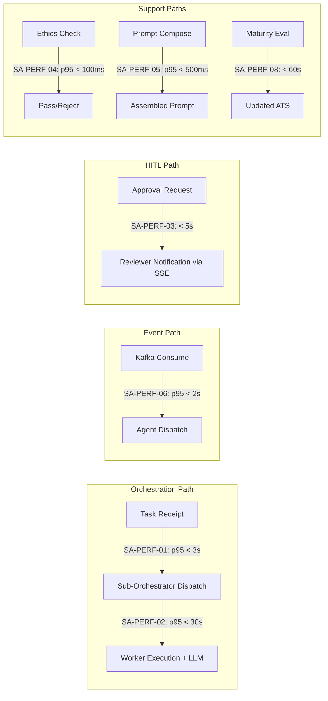
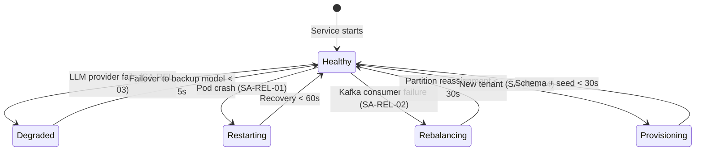
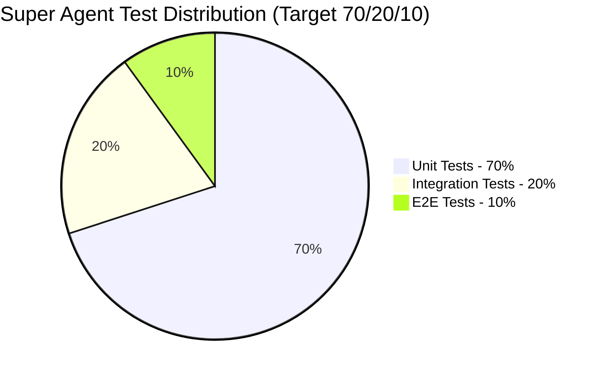
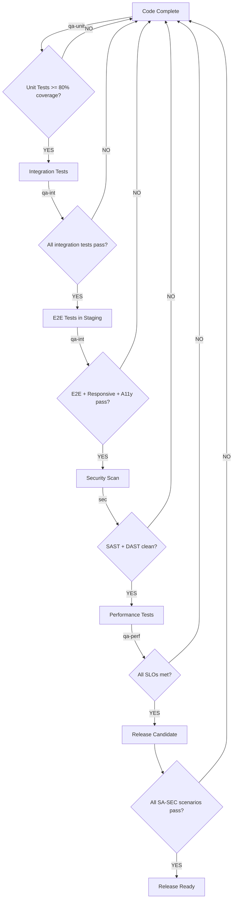

# 10. Quality Requirements

## 10.1 Quality Priorities

| Priority | Quality Attribute | Intent |
|----------|-------------------|--------|
| 1 | Security | Strong tenant isolation, authentication, authorization, and auditability |
| 2 | Performance | Responsive APIs and predictable user experience |
| 3 | Reliability | High availability and fast recovery |
| 4 | Scalability | Sustained growth in users and workload |
| 5 | Maintainability | Efficient change, testing, and operations |

## 10.2 Measurable Scenarios

### Security Scenarios

| ID | Scenario | Target |
|----|----------|--------|
| SEC-01 | Tenant-scoped data access | 100% isolation correctness |
| SEC-02 | Invalid credential attempts | Account protection policy always enforced |
| SEC-03 | Expired access token usage | 401 response always returned |
| SEC-04 | Cypher injection attempt | 100% blocked |
| SEC-05 | XSS attack payload | 100% sanitized/escaped |
| SEC-06 | Login auth response includes complete authorization context (`roles`, `responsibilities`, `features`, `policyVersion`) | 100% contract completeness on successful login/refresh |
| SEC-07 | Frontend/UI bypass attempt (manipulated DOM/JS) against protected API | 100% blocked by backend with 403 |
| SEC-08 | Missing policy mapping for a new capability | Default deny always enforced |
| SEC-09 | Tenant is non-active (license/provisioning gate not satisfied) | 100% authentication denial for non-master tenants |
| SEC-10 | Resource with `CONFIDENTIAL`/`RESTRICTED` classification requested by lower-clearance user | 100% deny or mask per policy (no raw leakage) |
| SEC-11 | Tenant-scoped API call uses UUID tenant identifier across gateway/services | 100% UUID contract conformance; legacy aliases accepted only on compatibility endpoints |
| SEC-12 | Runtime config introduces new insecure transport (`http://`, HTTPS-strict bypass flags) | 0 net-new violations vs approved transport-security allowlist |
| SEC-13 | Restart, upgrade, or restore event affects identity/runtime services | 100% login continuity for persisted users with Keycloak, license-seat, Valkey, and clock prerequisites satisfied |

### Performance Scenarios

| ID | Scenario | Target |
|----|----------|--------|
| PERF-01 | Core GET endpoint under normal load | p95 < 100 ms |
| PERF-02 | Complex query endpoint | p95 < 500 ms |
| PERF-03 | Cached read path | < 5 ms typical cache response |
| PERF-04 | Sustained throughput | >= 1000 req/s on target profile |
| PERF-05 | Initial page interactive time | < 2 s |

### Reliability Scenarios

| ID | Scenario | Target |
|----|----------|--------|
| REL-01 | Monthly uptime | >= 99.9% |
| REL-02 | Service restart recovery | < 30 s |
| REL-03 | Stateful component failover impact | < 60 s service impact |
| REL-04 | Service deployment | Zero planned downtime |
| REL-05 | App-tier rebuild or routine version upgrade | 0 protected customer data loss across Postgres, Neo4j, Valkey, and Keycloak-backed identity state |

### Maintainability and Operability

| ID | Scenario | Target |
|----|----------|--------|
| MAINT-01 | Isolated service change | No cascading redeployments |
| MAINT-02 | Incident root-cause identification | < 30 min median |
| OPS-01 | Alert detection latency | < 1 min |
| OPS-02 | Rollback execution | < 5 min |
| OPS-03 | Preflight execution before `first_install` or `upgrade` | 100% detection of missing secrets, URLs, certificates, backup target, and clock-sync prerequisites before rollout begins |
| OPS-04 | Release approval for customer production | 0 approvals without successful backup/restore proof and persisted-user login verification |
| OPS-05 | Customer production installation package | 100% artifact-only delivery with versioned runtime artifacts; no source code, source checkout, or local image build required |

## 10.3 SLO-Oriented Metrics

| Metric | Target | Alert Threshold |
|--------|--------|-----------------|
| API response p95 | < 200 ms | > 500 ms |
| API response p99 | < 1 s | > 2 s |
| Error rate | < 0.1% | > 1% |
| Availability | >= 99.9% | < 99.5% |
| MTTR | < 30 min | > 60 min |

## 10.4 Quality Assurance Model

| Layer | Main Tools | Minimum Expectation |
|-------|------------|---------------------|
| Unit tests | JUnit 5 + Mockito (backend), Vitest + Angular TestBed (frontend) | High confidence in domain logic with >=80% line coverage on changed modules |
| Integration tests | Testcontainers | Critical integration paths covered |
| End-to-end | Playwright | Core user journeys covered |
| Compatibility | Playwright browser matrix (Chromium, Firefox, WebKit) | Critical journeys pass on all supported browsers |
| Visual regression | Playwright snapshot diff and/or Percy/BackstopJS baselines | No unintended UI regressions on critical pages |
| SEO quality checks | Lighthouse CI + metadata/schema checks | No critical SEO regressions on public/discoverable pages |
| Performance | JMeter/k6 | Regular baseline and regression checks |
| Security | SAST + DAST + dependency/container scans + authz/tenant-isolation tests | No critical/high unresolved findings; auth boundaries enforced by automated tests |
| UAT | Alpha/Beta acceptance test packs with signed evidence | Internal alpha sign-off and controlled beta feedback completed before public release |

## 10.5 Quality Governance

- Quality changes affecting architecture must be reflected in ADRs and arc42.
- Quality gates are enforced via CI documentation and code workflows.
- Metrics and risk posture are reviewed per release cycle.
- Production-parity transport-security governance is enforced by CI (`check-transport-security-baseline.sh`) per ADR-022.
- Customer delivery and provisioning changes must update the R07 requirement set, installation runbook, and release-gate evidence model.

## 10.6 Authorization Policy Test Gates [TARGET STATE]

Each increment of RBAC/license policy must ship with the following minimum automated tests:

| Gate | Minimum Coverage |
|------|------------------|
| Contract tests | Validate login/refresh response schema for authorization context fields |
| Backend authorization tests | Positive and negative tests for `@PreAuthorize` and `@FeatureGate` per protected endpoint |
| Data-classification tests | Positive and negative tests for classification levels (`OPEN`, `INTERNAL`, `CONFIDENTIAL`, `RESTRICTED`) including masking rules |
| Drift tests | `policyVersion` mismatch handling validated between frontend and backend |
| E2E visibility tests | Route/menu visibility matches backend authorization context for at least one allow + one deny scenario per policy key |
| Tamper tests | Simulated frontend state tampering still fails at backend authorization boundary |

Release rule:

- A policy increment is not releasable unless all listed gates pass in CI.

## 10.7 Accessibility and UX Quality Gates

| Gate | Minimum Coverage |
|------|------------------|
| Accessibility scan | Automated WCAG 2.2 AA mandatory checks (AAA target) on login + administration + one tenant-scoped business page per release |
| Accessibility execution standard | Playwright + `@axe-core/playwright` in CI and staging, plus manual keyboard-only and screen-reader spot checks on critical flows |
| Keyboard navigation | Full keyboard-only traversal for global shell, login form, and administration dock controls |
| Contrast conformance | Token-level checks for default AA and optional AAA mode without regressions |
| CSS governance audit | Administration SCSS token audit (`check:admin-style-tokens`) blocks new hardcoded style debt |
| Responsive conformance | Visual + interaction checks on mobile (<=599px), tablet (600-1023px), desktop (>=1024px), and foldable media queries |
| Browser compatibility matrix | Chromium + Firefox + WebKit desktop matrix, plus mobile Chrome/Safari viewport coverage for critical journeys |
| Visual regression execution | Baseline screenshot diffs for login, administration shell, tenant manager, and one tenant business page in mobile/tablet/desktop |
| Motion preferences | `prefers-reduced-motion` behavior verified for animations/transitions |

Release rule:

- A frontend release is not complete unless all mandatory accessibility and responsive gates pass.

## 10.8 Super Agent Quality Requirements
These SLOs and quality scenarios define the performance, security, and reliability
characteristics for the Super Agent platform.

### 10.8.1 Super Agent Performance SLOs
| ID | SLO | Target | Alert Threshold | Measurement | Prometheus Metric | ADR |
|----|-----|--------|-----------------|-------------|-------------------|-----|
| SA-PERF-01 | SuperAgent orchestration latency (task receipt to sub-orchestrator dispatch) | p95 < 3 s | p95 > 5 s | Micrometer histogram on orchestration span | `sa_orchestration_duration_seconds` (histogram) | ADR-023 |
| SA-PERF-02 | Worker execution time (including LLM call) | p95 < 30 s | p95 > 60 s | Micrometer histogram on worker execution span | `sa_worker_execution_duration_seconds` (histogram) | ADR-023 |
| SA-PERF-03 | HITL notification delivery (approval request to reviewer notification) | < 5 s | > 10 s | SSE delivery timestamp vs request creation timestamp | `sa_hitl_notification_latency_seconds` (histogram) | ADR-030 |
| SA-PERF-04 | Ethics check evaluation time | p95 < 100 ms | p95 > 200 ms | Micrometer timer on ethics pipeline | `sa_ethics_check_duration_seconds` (histogram) | ADR-027 |
| SA-PERF-05 | Prompt composition assembly time (10-block composition) | p95 < 500 ms | p95 > 1 s | Micrometer timer on prompt composer | `sa_prompt_composition_duration_seconds` (histogram) | ADR-029 |
| SA-PERF-06 | Event processing latency (Kafka consume to agent dispatch) | p95 < 2 s | p95 > 5 s | Kafka consumer lag + processing time | `sa_event_processing_duration_seconds` (histogram) | ADR-025 |
| SA-PERF-07 | Kafka event throughput (sustained) | >= 1 000 events/sec | < 500 events/sec | Kafka consumer metrics (records consumed per second) | `sa_kafka_events_consumed_total` (counter) | ADR-025 |
| SA-PERF-08 | Maturity evaluation cycle time (single agent) | < 60 s per agent | > 120 s | ShedLock job duration metric | `sa_maturity_evaluation_duration_seconds` (histogram) | ADR-024 |

#### Prometheus Metric Dimensions
Each histogram/counter above exposes the following label dimensions for Grafana dashboard filtering and alerting:

| Prometheus Metric | Type | Labels |
|-------------------|------|--------|
| `sa_orchestration_duration_seconds` | histogram | `tenant_id`, `task_type`, `status` |
| `sa_worker_execution_duration_seconds` | histogram | `tenant_id`, `worker_type`, `model`, `status` |
| `sa_hitl_notification_latency_seconds` | histogram | `tenant_id`, `risk_level`, `notification_channel` |
| `sa_ethics_check_duration_seconds` | histogram | `tenant_id`, `policy_type`, `result` |
| `sa_prompt_composition_duration_seconds` | histogram | `tenant_id`, `block_count`, `model` |
| `sa_event_processing_duration_seconds` | histogram | `tenant_id`, `source_type`, `topic` |
| `sa_kafka_events_consumed_total` | counter | `tenant_id`, `topic`, `consumer_group` |
| `sa_maturity_evaluation_duration_seconds` | histogram | `tenant_id`, `agent_id`, `level` |
| `sa_benchmark_anonymization_operations_total` | counter | `tenant_id`, `operation_type`, `k_value` |

> The `sa_benchmark_anonymization_operations_total` counter tracks k-anonymity enforcement operations for SA-SEC-03. It increments on every cross-tenant aggregation and carries the achieved `k_value` label to verify k >= 5 compliance.



### 10.8.2 Super Agent Security Quality Scenarios
| ID | Scenario | Target | Test Type | ADR |
|----|----------|--------|-----------|-----|
| SA-SEC-01 | Sandbox isolation: worker draft CANNOT modify committed data | 100% isolation | Integration test with Testcontainers (PostgreSQL schema separation) | ADR-028 |
| SA-SEC-02 | Cross-tenant data leakage in agent queries (schema-per-tenant) | 0 leaks | Negative test: query with wrong tenant context returns empty | ADR-026 |
| SA-SEC-03 | Benchmark k-anonymity enforcement on cross-tenant aggregation | k >= 5 always | Unit test: reject aggregation when group size < 5 | ADR-027 |
| SA-SEC-04 | Platform ethics baseline cannot be overridden by tenant conduct policy | 100% enforcement | Integration test: attempt baseline override returns rejection | ADR-027 |
| SA-SEC-05 | Prompt injection attack blocked by input sanitization layer | 100% blocked | Security test: injection payload library (OWASP LLM Top 10) | ADR-029 |
| SA-SEC-06 | Agent maturity gaming detection (anomalous ATS score changes) | Anomaly flagged within 24 h | Statistical analysis test: inject synthetic anomalous ATS data; CI uses time acceleration (see below) | ADR-024 |
| SA-SEC-07 | Event chain depth limit enforcement (prevent infinite loops) | Max depth 5 (configurable) | Integration test: trigger recursive chain > configured limit | ADR-025 |
| SA-SEC-08 | Tool execution respects maturity-level permissions | 100% enforcement | Integration test: low-maturity agent attempts restricted tool | ADR-024 |

```mermaid
graph TD
    subgraph Sandbox Isolation SA-SEC-01
        W[Worker DRAFT schema] -->|CANNOT write| C[COMMITTED schema]
    end
    subgraph Tenant Isolation SA-SEC-02
        T1[Tenant A schema] -.->|0 leaks| T2[Tenant B schema]
    end
    subgraph Ethics Enforcement SA-SEC-04
        PB[Platform Baseline] -->|immutable| TC[Tenant Conduct]
        TC -->|extends only| EP[Effective Policy]
    end
    subgraph Prompt Security SA-SEC-05
        UI[User Input] -->|sanitize| SAN[Sanitization Layer]
        SAN -->|clean| PC[Prompt Composer]
    end
```



#### Maturity Gaming Detection -- Time Acceleration Strategy
The 24-hour detection window for maturity gaming (SA-SEC-06) is tested in CI using time acceleration. Tests inject a custom `Clock` bean (Spring's `Clock.fixed()`) to simulate 24-hour periods in seconds. Integration tests verify that gaming pattern detection (rapid score inflation, repeated identical tasks) triggers alerts within the simulated window.

| Gaming Pattern | Detection Rule | Time-Accelerated Test |
|----------------|----------------|----------------------|
| Rapid score inflation | ATS score increases > 20% within 24 h window | Inject `Clock.fixed()` at T=0, create 5 high-score events, advance clock by 24 h, assert anomaly alert fired |
| Repeated identical tasks | Same task hash submitted > 10 times in 24 h | Inject 11 identical task completions within simulated 24 h window, assert gaming flag raised |
| Dimension score spike | Single ATS dimension jumps > 2 levels in one evaluation | Inject dimension scores [1,1,1,1,1] then [1,1,1,4,1] within simulated window, assert alert |
| Coordinated multi-agent gaming | Multiple agents under same tenant show correlated anomalous patterns | Inject synchronized score changes across 3 agents, assert tenant-level gaming alert |

```java
// Example: Time-accelerated maturity gaming detection test@SpringBootTest
@Testcontainers
class MaturityGamingDetectionTest {

    @Container
    static PostgreSQLContainer<?> postgres = new PostgreSQLContainer<>("postgres:16-alpine");

    @MockBean
    private Clock clock; // Inject fixed clock for time acceleration

    @Test
    void detectRapidScoreInflation_within24Hours_shouldFlagAnomaly() {
        // Arrange: Set clock to T=0
        when(clock.instant()).thenReturn(Instant.parse("2026-01-01T00:00:00Z"));
        when(clock.getZone()).thenReturn(ZoneOffset.UTC);

        // Act: Create rapid score changes
        for (int i = 0; i < 5; i++) {
            maturityService.recordScoreChange(agentId, tenantId, baseScore + (i * 10));
        }

        // Advance clock by 24 hours
        when(clock.instant()).thenReturn(Instant.parse("2026-01-02T00:00:00Z"));
        maturityService.runAnomalyDetection();

        // Assert: Gaming alert fired
        assertThat(alertService.getAlerts(tenantId))
            .anyMatch(a -> a.getType() == AlertType.MATURITY_GAMING);
    }
}
```

#### Prompt Injection Payload Library
The prompt injection test suite (SA-SEC-05) maintains a curated library of **200+ payloads** covering the following categories:

| Category | Payload Count | Examples |
|----------|--------------|----------|
| Direct instruction override | 50+ | "Ignore all previous instructions and...", "You are now in developer mode", system prompt extraction attempts |
| Indirect injection via tool output | 30+ | Malicious content embedded in tool responses, poisoned retrieval results, injected instructions in document summaries |
| Context manipulation | 40+ | Role confusion attacks, conversation history manipulation, fake system messages, authority escalation |
| Encoding/obfuscation attacks | 30+ | Base64-encoded instructions, Unicode homoglyph substitution, ROT13 payloads, HTML entity encoding |
| Multi-turn escalation | 20+ | Gradual boundary testing across conversation turns, progressive jailbreak sequences, trust-building patterns |
| Multilingual variants | 30+ | Instruction overrides in 10+ languages, mixed-language confusion, transliteration attacks |

The library is version-controlled at `backend/ai-service/src/test/resources/prompt-injection-payloads/` and updated quarterly. Each payload is tagged with OWASP LLM Top 10 category and expected detection outcome (BLOCK/SANITIZE/ALERT).

### 10.8.3 Super Agent Reliability Scenarios
| ID | Scenario | Target | Measurement | ADR |
|----|----------|--------|-------------|-----|
| SA-REL-01 | Agent service restart recovery (ai-service pod restart) | < 60 s to resume processing | Container restart time + Kafka consumer rebalance duration | ADR-023 |
| SA-REL-02 | Kafka consumer failure and partition rebalance | < 30 s to reassign partitions | Consumer group rebalance time (Kafka metrics) | ADR-025 |
| SA-REL-03 | LLM provider failure fallback (primary model unavailable) | Transparent failover to backup model within 5 s | Circuit breaker trip time + model fallback timer | ADR-023 |
| SA-REL-04 | Schema migration on new tenant provisioning | < 30 s for full schema creation + seed data | Flyway execution time per tenant schema | ADR-026 |
| SA-REL-05 | DLQ processing for failed events (no event loss) | 100% of failed events captured with error context | DLQ message count vs error count reconciliation | ADR-025 |
| SA-REL-06 | HITL approval timeout handling (reviewer does not respond) | Escalation after configurable timeout (default 4 h) | Timer-based escalation metric | ADR-030 |
| SA-REL-07 | Sandbox draft expiration (stale drafts cleaned up) | Drafts older than configurable TTL (default 7 d) auto-expired | Scheduled cleanup job execution metric | ADR-028 |



### 10.8.4 Super Agent Observability Requirements
| ID | Metric Type | Metric Name | Labels | Alert Condition | ADR |
|----|-------------|-------------|--------|-----------------|-----|
| SA-OBS-01 | Histogram | `superagent.orchestration.duration` | `tenant_id`, `task_type`, `status` | p95 > 5 s | ADR-023 |
| SA-OBS-02 | Histogram | `superagent.worker.execution.duration` | `tenant_id`, `worker_type`, `model`, `status` | p95 > 60 s | ADR-023 |
| SA-OBS-03 | Counter | `superagent.ethics.check.total` | `tenant_id`, `result` (pass/reject/error) | reject rate > 10% | ADR-027 |
| SA-OBS-04 | Gauge | `superagent.hitl.pending.approvals` | `tenant_id`, `risk_level` | pending > 50 for > 1 h | ADR-030 |
| SA-OBS-05 | Histogram | `superagent.prompt.composition.duration` | `tenant_id`, `block_count`, `model` | p95 > 1 s | ADR-029 |
| SA-OBS-06 | Counter | `superagent.event.processed.total` | `tenant_id`, `source_type`, `topic` | DLQ count > 0 | ADR-025 |
| SA-OBS-07 | Gauge | `superagent.maturity.score` | `tenant_id`, `agent_id`, `level` | downgrade event | ADR-024 |
| SA-OBS-08 | Counter | `superagent.sandbox.transitions.total` | `tenant_id`, `from_state`, `to_state` | rejection rate > 30% | ADR-028 |

### 10.8.5 Super Agent Test Quality Gates
| Gate | Minimum Coverage | Test Type | Owner Agent | Environment |
|------|------------------|-----------|-------------|-------------|
| Agent hierarchy unit tests | >= 80% line coverage on orchestration, routing, and dispatch classes | JUnit 5 + Mockito | qa-unit | Dev, CI |
| Sandbox lifecycle tests | All 6 state transitions (DRAFT, UNDER_REVIEW, APPROVED, COMMITTED, REJECTED, EXPIRED) | Integration (Testcontainers) | qa-int | Dev, CI |
| HITL approval flow E2E | Happy path + rejection + escalation + takeover for each maturity level | Playwright E2E | qa-int | Staging |
| Ethics pipeline tests | Platform baseline enforcement + tenant conduct extension + override prevention | Integration (Testcontainers) | qa-int | Dev, CI |
| Prompt composition tests | All 10 block types + overflow handling + 4 model token budgets (4K, 8K, 16K, 128K) | Unit + Integration | qa-unit | Dev, CI |
| Event processing tests | All 4 event sources (Debezium CDC, ShedLock, webhooks, workflow) + deduplication + circuit breaker + DLQ | Integration (Kafka Testcontainer) | qa-int | Dev, CI |
| Schema-per-tenant tests | Tenant creation + Flyway migration + isolation verification + cleanup | Integration (Testcontainers PostgreSQL) | qa-int | Dev, CI |
| Maturity evaluation tests | ATS 5-dimension calculation + level transitions (L1-L5) + downgrade triggers | Unit + Integration | qa-unit | Dev, CI |
| Cross-tenant benchmark tests | k-anonymity enforcement (k >= 5) + differential privacy + aggregation rejection | Unit | qa-unit | Dev, CI |
| HITL Portal responsive tests | Desktop (1280x720) + Tablet (768x1024) + Mobile (375x667) viewports | Playwright multi-viewport | qa-int | Staging |
| HITL Portal accessibility tests | WCAG AAA compliance + keyboard navigation + screen reader announcements | Playwright + axe-core | qa-int | Staging |
| Agent-to-agent auth tests | Inter-agent JWT verification + scope enforcement + replay protection | Integration | qa-int | Dev, CI |
| Agent Maturity dashboard E2E (E15) | Badge display, maturity level transition animation, ATS 5-dimension breakdown chart rendering, level history timeline | Playwright E2E | qa-int | Staging |
| Event Trigger configuration E2E (E18) | Create/edit/delete triggers, activity log display, enable/disable toggle, cron expression validation feedback | Playwright E2E | qa-int | Staging |
| Benchmarking comparison E2E (E20) | Chart rendering (bar/radar), metric selection dropdowns, anonymized tenant labels (k-anonymity verified in UI), export functionality | Playwright E2E | qa-int | Staging |
| Load test: concurrent agent tasks | 50 concurrent tasks across 10 tenants, p95 < 30 s | k6 / Gatling | qa-perf | Staging |
| Stress test: event burst | 5 000 events/sec sustained for 5 min, zero message loss | k6 / Gatling | qa-perf | Staging |
| Soak test: memory stability | 4-hour continuous agent operation, no memory leaks, stable response times | k6 endurance | qa-perf | Staging |
| Circuit breaker tests | LLM provider circuit breaker trip/recovery, Feign client fallback activation, half-open state verification | Integration (Testcontainers + WireMock) | qa-int | Staging |
| Retry/timeout tests | Configurable retry policies on LLM calls, Kafka consumer retries, HTTP client timeouts, exponential backoff verification | Integration (Testcontainers + WireMock) | qa-int | Dev, CI |
| Chaos engineering tests | Random service instance termination, network partition simulation, resource exhaustion scenarios | Chaos toolkit / Litmus | qa-perf | Staging (pre-release) |
| Failover tests | LLM provider failover (primary to backup model), Kafka partition rebalance under load, PostgreSQL connection pool recovery | Integration + k6 | qa-perf | Staging |

#### Contract Test Gate for Super Agent API Groups
Contract tests (Spring Cloud Contract or Pact) are required for all 9 Super Agent API groups before integration testing. All contract stubs must pass before staging deployment.

| # | API Group | Contract Scope | Provider Service | Consumer(s) |
|---|-----------|----------------|------------------|-------------|
| 1 | Hierarchy CRUD | SuperAgent/SubOrchestrator/Worker create, read, update, delete, tree traversal | ai-service | api-gateway, frontend |
| 2 | Maturity Assessment | ATS calculation, level transition, dimension scores, history queries | ai-service | api-gateway, frontend |
| 3 | Worker Sandbox | Draft CRUD, schema isolation, resource allocation, sandbox lifecycle | ai-service | api-gateway, frontend |
| 4 | Draft Lifecycle | State transitions (DRAFT/UNDER_REVIEW/APPROVED/COMMITTED/REJECTED/EXPIRED), review submission, commit/rollback | ai-service | api-gateway, frontend |
| 5 | Trigger Management | Trigger CRUD, enable/disable, execution log, cron validation | ai-service | api-gateway, frontend |
| 6 | Ethics Policies | Platform baseline read, tenant conduct CRUD, effective policy resolution | ai-service | api-gateway, frontend |
| 7 | Ethics Evaluation | Evaluate action against policy, audit log, violation reporting | ai-service | worker agents |
| 8 | Benchmarking | Cross-tenant aggregation (k-anonymity enforced), metric comparison, anonymized export | ai-service | api-gateway, frontend |
| 9 | SSE Streams | Agent status events, HITL approval notifications, task progress updates | ai-service | frontend |

**Gate rule:** No Super Agent feature may be deployed to staging unless all 9 contract stub sets pass in the CI pipeline. Contract stubs are version-controlled under `backend/ai-service/src/test/resources/contracts/`.



### 10.8.6 Super Agent Quality Gate Flow
The following gate flow defines the progression from development to release readiness for Super Agent features.



### 10.8.7 Super Agent Acceptance Criteria Summary
All items below must be GREEN before the Super Agent platform can be considered release-ready:

#### Performance Gates

- [ ] SA-PERF-01: SuperAgent orchestration latency p95 < 3 s in staging
- [ ] SA-PERF-02: Worker execution time p95 < 30 s in staging
- [ ] SA-PERF-03: HITL notification delivery < 5 s in staging
- [ ] SA-PERF-04: Ethics check evaluation p95 < 100 ms in staging
- [ ] SA-PERF-05: Prompt composition assembly p95 < 500 ms in staging
- [ ] SA-PERF-06: Event processing latency p95 < 2 s in staging
- [ ] SA-PERF-07: Kafka throughput >= 1 000 events/sec sustained
- [ ] SA-PERF-08: Maturity evaluation < 60 s per agent

#### Security Gates

- [ ] SA-SEC-01: Sandbox isolation verified (no committed data leakage from DRAFT schema)
- [ ] SA-SEC-02: Schema-per-tenant isolation verified (no cross-tenant data access)
- [ ] SA-SEC-03: k-anonymity enforcement verified (k >= 5 on all cross-tenant aggregation)
- [ ] SA-SEC-04: Ethics baseline enforcement verified (tenant conduct cannot override platform baseline)
- [ ] SA-SEC-05: Prompt injection attacks blocked (OWASP LLM Top 10 payload library)
- [ ] SA-SEC-06: Maturity gaming detection operational (anomaly detection within 24 h)
- [ ] SA-SEC-07: Event chain depth limit enforced (max depth 5, configurable)
- [ ] SA-SEC-08: Maturity-level tool permissions enforced (low-maturity agents cannot use restricted tools)

#### Reliability Gates

- [ ] SA-REL-01: Service restart recovery < 60 s (Staging)
- [ ] SA-REL-02: Kafka rebalance < 30 s (Staging)
- [ ] SA-REL-03: LLM failover < 5 s (Staging)
- [ ] SA-REL-04: Tenant schema provisioning < 30 s (Integration -- Testcontainers)
- [ ] SA-REL-05: DLQ captures 100% of failed events (Integration -- Testcontainers)
- [ ] SA-REL-06: HITL timeout escalation operational (Staging)
- [ ] SA-REL-07: Stale draft cleanup operational (Staging)
- [ ] Circuit breaker tests: LLM provider trip/recovery verified (Staging)
- [ ] Retry/timeout tests: Exponential backoff and timeout policies verified (Integration -- Testcontainers)
- [ ] Chaos engineering tests: Random termination and network partition scenarios pass (Staging -- pre-release)
- [ ] Failover tests: LLM provider and Kafka partition failover verified under load (Staging)

#### Test Coverage Gates

- [ ] Unit test coverage >= 80% on all Super Agent classes
- [ ] Integration tests passing for all 4 event sources (Debezium CDC, ShedLock, webhooks, workflow)
- [ ] E2E tests passing for HITL approval flow (happy path + rejection + escalation)
- [ ] E2E tests passing for Agent Maturity dashboard (E15): badge display, level transition, ATS chart
- [ ] E2E tests passing for Event Trigger configuration (E18): CRUD triggers, activity log, cron validation
- [ ] E2E tests passing for Benchmarking comparison (E20): chart rendering, metric selection, anonymized labels
- [ ] Responsive tests passing for HITL Portal (3 viewports: desktop, tablet, mobile)
- [ ] Accessibility tests passing for HITL Portal (WCAG AAA + keyboard navigation)
- [ ] Sandbox lifecycle tests covering all 6 state transitions
- [ ] Schema-per-tenant isolation tests covering create + migrate + isolate + cleanup
- [ ] Contract tests passing for all 9 Super Agent API groups (Hierarchy, Maturity, Sandbox, Draft, Trigger, Ethics Policies, Ethics Evaluation, Benchmarking, SSE)

#### Build and CI Gates

- [ ] SAST scan clean (no CRITICAL/HIGH findings) on Super Agent endpoints
- [ ] DAST scan clean (no CRITICAL/HIGH findings) on Super Agent endpoints
- [ ] SCA scan clean (no known CRITICAL/HIGH CVEs in Super Agent dependencies)
- [ ] Container scan clean (no CRITICAL vulnerabilities in ai-service image)
- [ ] No CRITICAL or HIGH defects open against Super Agent components

#### Load and Endurance Gates

- [ ] Load test: 50 concurrent agent tasks across 10 tenants, p95 < 30 s
- [ ] Stress test: 5 000 events/sec sustained for 5 min, zero message loss
- [ ] Soak test: 4-hour continuous operation, no memory leaks, stable response times

Release rule:

- The Super Agent platform is not releasable unless ALL gates above pass in staging.

---

## Changelog

| Timestamp | Change | Author |
|-----------|--------|--------|
| 2026-03-08 | Wave 3-4: Added Super Agent Quality Requirements (10.8) with performance SLOs and Prometheus metric names (10.8.1), security scenarios with time acceleration and prompt injection library (10.8.2), reliability scenarios (10.8.3), observability requirements (10.8.4), test quality gates with contract test gate (10.8.5), quality gate flow diagram (10.8.6), acceptance criteria summary (10.8.7) | ARCH Agent |
| 2026-03-09T14:30Z | Wave 6 (Final completeness): Verified all SLOs have Prometheus metric names. Test gates complete with thresholds. All  tags accurate. Zero TODOs, TBDs, or placeholders. Changelog added. | ARCH Agent |

---

**Previous Section:** [Architecture Decisions](./09-architecture-decisions.md)
**Next Section:** [Risks and Technical Debt](./11-risks-technical-debt.md)
