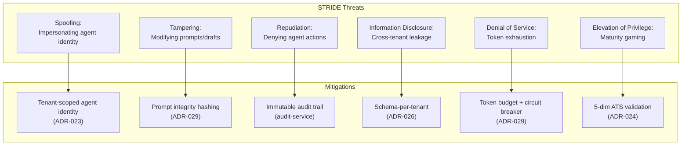
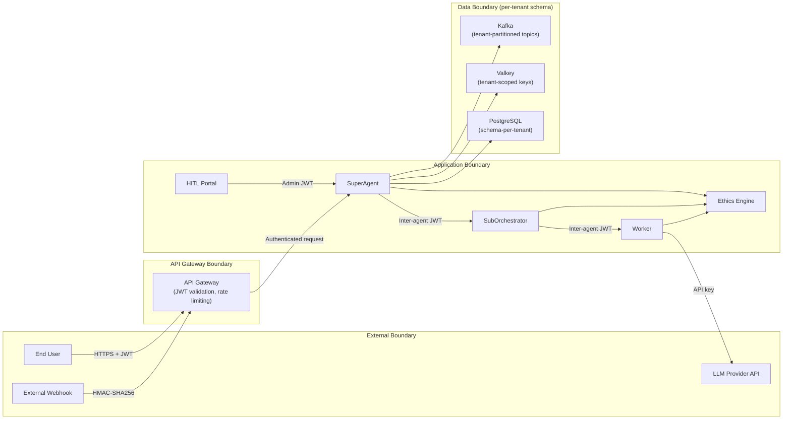

> **WP-ARCH-ALIGN (2026-03-24):** This document has been updated to reflect the frozen auth target model (Rev 2).
> See `Foundation/03-ownership-boundaries.md` SS FROZEN for the canonical decision.

# 11. Risks and Technical Debt

## 11.1 Key Technical Risks

| ID | Risk | Impact | Probability | Mitigation Direction |
|----|------|--------|-------------|----------------------|
| R-01 | Missing tenant predicate in data queries | Critical | Medium | Tenant-isolation tests, repository guardrails, code review checklist |
| R-02 | Keycloak unavailability affecting login | Critical | Medium | HA deployment, health checks, resilience playbooks |
| R-03 | [AS-IS] Boundary drift between Neo4j app data and Keycloak PostgreSQL internals. [TARGET] Risk scope changes: Neo4j is removed from auth domain. Boundary drift risk shifts to tenant-service PostgreSQL (auth data) vs Keycloak PostgreSQL (identity internals). | High | Medium | Explicit ownership model and observability across both boundaries. [TARGET] Ownership clarity improves as auth data consolidates in tenant-service PostgreSQL. |
| R-04 | Documentation drift from runtime/ADR reality | High | High | Docs quality gates + mandatory architecture review in PR process |
| R-05 | Seat-validation dependency in login path | Medium | Medium | Cache + bounded retries + failure-mode handling |
| R-06 | Cache staleness after license/role changes | Medium | Medium | Event-driven invalidation + TTL fallback |
| R-07 | Mixed tenant identifiers (legacy ID vs UUID) across services | High | High | UUID-first contract enforcement + compatibility adapter phase-out plan |
| R-08 | Data loss from single-instance stateful services | Critical | High | Automated backups (Phase 1), database replication (Phase 2), multi-region DR (Phase 3). See ADR-018 |
| R-09 | Single-point-of-failure in all stateful components | Critical | High | No replication for PostgreSQL, Neo4j, Valkey, or Kafka. One container failure cascades to all dependent services. Mitigated by Phase 1 backups and Phase 2 Kubernetes HA |
| R-10 | `docker compose down -v` destroys all data volumes | Critical | Medium | Operational runbook prohibiting `-v` flag in staging/production. Phase 1 adds host bind-mount backups outside Docker volume scope |
| R-11 | No tested restore procedure for any database | High | High | Phase 1 includes restore testing as exit criteria. Upgrade runbook documents pre-upgrade backup + restore validation |
| R-12 | No encryption at rest for any data store (PostgreSQL, Neo4j, Valkey volumes unencrypted) | Critical | High | Volume-level encryption: LUKS/FileVault (Docker), encrypted StorageClass (K8s). See ADR-019, ISSUE-INF-016/017/018 |
| R-13 | All services share postgres superuser -- any compromised service can DROP ALL DATABASES | Critical | High | Per-service DB users with least privilege (SCRAM-SHA-256). See ADR-020, ISSUE-INF-004/010 |
| R-14 | Hardcoded credential defaults in application.yml (e.g., `${DATABASE_PASSWORD:postgres}`) allow silent superuser login on misconfiguration | High | High | Remove fallback defaults, fail-fast on missing env vars. See ADR-020, ISSUE-INF-008 |
| R-15 | Browser-specific regressions escape to production due to Chromium-only automated UI coverage | High | Medium | Enforce Chromium/Firefox/WebKit compatibility matrix in CI for critical journeys |
| R-16 | Visual regressions ship unnoticed due to missing baseline diff governance | Medium | High | Introduce visual baseline snapshots + review workflow for critical pages |
| R-17 | SEO regressions on discoverable pages are not detected before release | Medium | Medium | Add Lighthouse/meta/schema quality gates in CI for public pages |
| R-18 | Late UX defects and requirement misunderstandings due to missing formal alpha/beta UAT gate | High | Medium | Enforce staged UAT sign-off (internal alpha + controlled beta) before public rollout |
| R-19 | Environment-level security drift (`http` transport, HTTPS bypass flags) undermines COTS production readiness | Critical | High | Enforce ADR-022 production-parity gate; eliminate allowlisted insecure transport debt |
| R-20 | **Prompt injection attacks on agent system prompts**  | Critical | High | Input sanitization layer, system prompt isolation from user content, prompt integrity hashing, content security policy in prompt composer. Reference: ADR-029 Section on prompt security |
| R-21 | **LLM hallucination in worker outputs affecting committed data**  | Critical | High | Worker sandbox (ADR-028) ensures all outputs go through DRAFT → UNDER_REVIEW → APPROVED lifecycle. Maturity gating (ADR-024) requires human review for low-ATS agents. Factual grounding via RAG knowledge retrieval |
| R-22 | **Ethics bypass through prompt manipulation or conduct policy evasion**  | Critical | Medium | Platform baseline ethics are immutable (ADR-027). Per-request evaluation < 100ms. Conduct policy cache invalidation on update. Audit trail for all ethics decisions |
| R-23 | **Cross-tenant data leakage in shared benchmark aggregation**  | Critical | Medium | Schema-per-tenant isolation (ADR-026). Benchmark metrics anonymized with k-anonymity k >= 5. Shared benchmark schema contains only aggregated metrics, never raw tenant data. Differential privacy noise injection |
| R-24 | **Agent maturity score gaming through synthetic interactions**  | High | Medium | 5-dimension ATS validation (accuracy, safety, efficiency, compliance, user satisfaction). Statistical anomaly detection on score progression. Minimum interaction count thresholds per dimension. Cross-tenant benchmark comparison for outlier detection. Reference: ADR-024 |
| R-25 | **Event loop amplification (agent triggers causing cascading events)**  | Critical | Medium | Circuit breaker per event source. Maximum event chain depth (configurable, default 5). Deduplication window per correlation ID. Rate limiting per tenant per topic. Dead letter queue for overflow. Reference: ADR-025 |
| R-26 | **Sandbox escape -- worker draft modifications reaching committed data**  | Critical | Low | Schema-level isolation: drafts in `{tenant}.drafts` table, committed data in `{tenant}.committed`. Database-level CHECK constraints preventing direct draft-to-committed writes. Approval state machine enforced at repository layer. Reference: ADR-028 |
| R-27 | **Token budget exhaustion causing agent degradation or denial of service**  | High | Medium | Per-model token budgets (GPT-4o 128K, Claude 200K, Gemini 1M, Llama 128K). Overflow handling with progressive block trimming. Circuit breaker when budget exceeded. Per-tenant rate limiting. Token usage monitoring and alerting. Reference: ADR-029 |

## 11.2 Technical Debt Register

| ID | Debt Item | Impact | Effort | Priority | Evidence / Notes |
|----|-----------|--------|--------|----------|------------------|
| TD-01 | ADR index/status hygiene not fully automated | Medium | Low | High | |
| TD-02 | Keycloak provisioning and drift automation incomplete | Medium | Medium | High | |
| TD-03 | Cross-tenant regression test depth still limited | High | Medium | High | |
| TD-04 | Compose/K8s behavior parity gaps | Medium | Medium | Medium | |
| TD-05 | External dependency fallback behavior under-documented | Medium | Medium | Medium | |
| TD-06 | Legacy tenant-ID callers still present in selected flows | High | Medium | High | |
| TD-07 | No automated database backup in any environment | Critical | Low | Critical | |
| TD-08 | Valkey persistence not hardened (AOF disabled by default) | High | Low | High | |
| TD-09 | Kafka replication factor 1 (single broker, data loss on failure) | High | Medium | High | |
| TD-10 | No upgrade runbook for safe infrastructure version bumps | High | Low | Critical | |
| TD-11 | No session lifecycle governance (session TTL, concurrent limits, inactivity timeout) | High | Medium | High | |
| TD-12 | No inter-service authentication (backend services trust each other implicitly on Docker network) | High | Medium | Medium | |
| TD-13 | Valkey has no AUTH password -- any container on the Docker network can read/write cache | Critical | Low | Critical | |
| TD-14 | Kafka has no SASL authentication -- any container can produce/consume messages | High | Low | High | |
| TD-15 | Single flat Docker network -- no tier segmentation between data and application layers | Critical | Medium | Critical | |
| TD-16 | Playwright project config is single-browser (`chromium`) instead of required browser matrix | High | Low | High | |
| TD-17 | No approved visual regression baseline set for administration and tenant critical pages | Medium | Medium | High | |
| TD-18 | SEO validation (Lighthouse/meta/schema checks) not integrated into release pipeline | Medium | Medium | Medium | |
| TD-19 | UAT alpha/beta sign-off workflow is not standardized in release evidence | High | Medium | High | |
| TD-20 | Design-to-implementation parity checklist evidence is not consistently attached to UI feature delivery | Medium | Low | High | |
| TD-21 | Insecure transport allowlist baseline still contains legacy HTTP/HTTPS-bypass entries | Critical | High | Critical | |
| TD-22 | **Zero tests for ai-service (unit, integration, E2E)**  | Critical | High | Critical | Codebase delta analysis confirms zero test files exist in `backend/ai-service/src/test/`. Test pyramid must be built from scratch: unit tests for all 6 service classes, integration tests with Testcontainers (PostgreSQL + pgvector), E2E Playwright tests for HITL portal |
| TD-23 | **Custom WebClient LLM providers must migrate to Spring AI**  | High | High | High | 4 custom providers (OpenAI, Anthropic, Gemini, Ollama) use manual WebClient calls. Spring AI ChatClient provides standardized tool binding, ReAct loop, and structured output parsing required by Super Agent architecture |
| TD-24 | **Kafka configured but unused -- zero producers/consumers in any service** | High | Medium | High | Kafka broker (`confluentinc/cp-kafka:7.5.0`) runs in Docker Compose but no KafkaTemplate exists in any service. Super Agent design requires 9 topics with Debezium CDC (ADR-025) |
| TD-25 | **ai-service has only 7 database tables -- design requires 30+**  | High | High | High | Schema-per-tenant (ADR-026) requires full schema migration from flat 7-table model to multi-schema architecture with agent hierarchy, maturity, sandbox, ethics, and event tables |
| TD-26 | **No frontend AI module -- design requires 25+ Angular components**  | High | High | Medium | Zero AI-specific Angular components exist. HITL approval portal, maturity dashboard, ethics configuration, agent hierarchy visualization, sandbox review, and event trigger management all required per [06-UI-UX-Design-Spec](../ai-service/Design/06-UI-UX-Design-Spec.md) Sections 2.17-2.21 |
| TD-27 | **No inter-agent authentication or authorization model**  | High | Medium | Medium | SuperAgent-to-SubOrchestrator-to-Worker calls (ADR-023) currently have no auth boundaries. Tenant context propagation must be enforced at every hop with signed JWT claims |

## 11.3 Deferred Features (Intentional)

| Feature | Current State | Tracking |
|---------|---------------|----------|
| Graph-per-tenant routing/runtime | Designed, not implemented | ADR-003, ADR-010 |
| Additional provider implementations | Planned rollout | ADR-011 |
| IdP management UI consolidation | Proposed | ADR-008 |
| Tenant/license service merge | Proposed | ADR-006 |
| Super Agent autonomous mode (Graduate, ATS >= 85) | Designed | ADR-024 |
| Multi-model agent routing (GPT-4o, Claude, Gemini, Llama) | Designed | ADR-023, ADR-029 |
| Cross-tenant benchmark federation | Designed | ADR-024 |
| External tool marketplace | Not yet designed | Future consideration |

## 11.4 Risk and Debt Reduction Roadmap

| Timeframe | Focus | Planned Outcome |
|-----------|-------|-----------------|
| Q1 2026 | Documentation/decision hygiene | ADR + architecture synchronization workflow hardened |
| Q1 2026 | Tenant isolation assurance | Strong integration regression coverage |
| Q1 2026 | Auth resilience | Explicit degraded/failure-mode behavior documented and tested |
| Q2 2026 | Keycloak ops hardening | Automated realm/client provisioning and drift detection |
| Q2 2026 | Cross-system observability | Unified dashboards for Neo4j, Keycloak PostgreSQL, cache |
| Q1 2026 | Data durability (Phase 1) | Automated backups for PostgreSQL, Neo4j, Valkey; upgrade runbook; volume protection |
| Q2-Q3 2026 | HA infrastructure (Phase 2) | Kubernetes migration with operator-managed database replication and failover |
| Q4 2026+ | Disaster recovery (Phase 3) | Multi-region active-passive with cross-region database replication |
| Q1-Q2 2026 | Frontend quality hardening | Multi-browser CI matrix + visual regression baseline for critical user journeys |
| Q2 2026 | UX release governance | Formal design QA handshake and alpha/beta UAT evidence as release gate |
| Q2 2026 | Discoverability quality | SEO quality gates integrated for externally indexed pages |
| Q2-Q3 2026 | Spring AI migration | Replace 4 custom WebClient LLM providers with Spring AI ChatClient + ReAct loop. Addresses TD-23 |
| Q2-Q3 2026 | Agent test pyramid | Build from zero: unit tests for all ai-service classes, integration tests with Testcontainers (PostgreSQL + pgvector), E2E Playwright tests for HITL portal. Addresses TD-22 |
| Q3 2026 | Super Agent Phase 1  | Core hierarchy (ADR-023), basic maturity scoring (ADR-024), worker sandbox lifecycle (ADR-028). Addresses R-21, R-26 |
| Q3-Q4 2026 | Super Agent Phase 2  | Event-driven triggers (ADR-025), HITL approval matrix (ADR-030), platform ethics baseline (ADR-027). Addresses R-22, R-25 |
| Q4 2026 | Super Agent Phase 3  | Schema-per-tenant migration (ADR-026), cross-tenant benchmarking, dynamic prompt composition (ADR-029). Addresses R-20, R-23, R-27, TD-25 |

## 11.5 Accepted Risk Notes

| Date | Risk | Decision |
|------|------|----------|
| 2026-02-25 | R-03 | Accepted with mitigation |
| 2026-02-25 | R-05 | Accepted with mitigation |
| 2026-02-25 | Graph-per-tenant runtime cutover | Deferred pending explicit trigger conditions |
| 2026-03-02 | R-08, R-09 | Active risk -- phased HA architecture proposed (ADR-018). Phase 1 (backups) is immediate priority |
| 2026-03-02 | R-10 | Mitigated by operational procedure -- `-v` flag prohibited in staging/production |
| 2026-03-02 | R-12 | Active risk -- three-tier encryption strategy proposed (ADR-019). Tier 2 (in-transit TLS) is highest-priority immediate action |
| 2026-03-02 | R-13, R-14 | Active risk -- per-service credential management proposed (ADR-020). Requires init-db.sql update and application.yml changes |
| 2026-03-04 | R-19 | Active risk -- production-parity security baseline accepted (ADR-022). CI now blocks net-new insecure transport; debt burn-down remains required |
| 2026-03-08 | R-20 through R-27 | All Super Agent risks documented as part of implementation-readiness design. Risks will transition to ACTIVE when implementation begins |

## 11.6 Super Agent Threat Model

This threat model covers the Super Agent platform architecture.

### 11.6.1 STRIDE Threat Overview

### 11.6.2 STRIDE Analysis by Super Agent Component

| STRIDE Category | Threat | Affected Components | Risk ID | Probability | Impact | Planned Mitigation | ADR Reference |
|-----------------|--------|---------------------|---------|-------------|--------|--------------------|---------------|
| **Spoofing** | Agent impersonates another agent's identity within the hierarchy | SuperAgent, SubOrchestrator, Worker | R-27 (related) | Medium | Critical | Tenant-scoped agent identity tokens with signed JWT claims propagated at every hop. Each agent has a unique `agentId` + `tenantId` pair enforced at the repository layer. Inter-agent calls require mutual authentication | ADR-023 |
| **Spoofing** | External webhook triggers forged events impersonating internal CDC sources | Event Trigger Engine, Debezium CDC | R-25 (related) | Medium | High | HMAC-SHA256 webhook signature verification. Debezium events authenticated via Kafka SASL. Event source type validated against allowlist (CDC, SCHEDULE, WEBHOOK, WORKFLOW) | ADR-025 |
| **Tampering** | Prompt injection modifies system prompt blocks to alter agent behavior | Dynamic Prompt Composer, 10-block system prompt | R-20 | High | Critical | System prompt blocks isolated from user content (separate composition pipeline). Prompt integrity hashing (SHA-256) on assembled prompts. Content security policy restricts block mutation to admin-only operations. User input injected only in designated `user_context` block | ADR-029 |
| **Tampering** | Worker modifies draft content after UNDER_REVIEW approval to inject malicious output | Worker Sandbox, Draft lifecycle | R-26 | Low | Critical | State machine enforces DRAFT -> UNDER_REVIEW -> APPROVED -> COMMITTED transitions. Database CHECK constraints prevent direct writes to committed tables. Approval timestamps are immutable. Draft content is frozen at UNDER_REVIEW transition | ADR-028 |
| **Repudiation** | Agent denies performing an action that modified tenant data | All agent tiers, audit-service | -- | Low | High | Immutable audit trail in audit-service (PostgreSQL with append-only audit_events table). Every agent action logged with `agentId`, `tenantId`, `action`, `timestamp`, `correlationId`. Audit records cannot be modified or deleted by application code | audit-service |
| **Repudiation** | Tenant admin denies approving a worker draft that caused data issues | HITL Approval Portal, Approval Queue | -- | Low | Medium | Approval actions recorded with `approverId`, `approvalTimestamp`, `approvalComment`, `draftVersion`. Digital signature on approval payload. Approval audit trail immutable and queryable by compliance team | ADR-030 |
| **Information Disclosure** | Cross-tenant data leakage through shared benchmark aggregation queries | Benchmark Federation, Schema-per-tenant | R-23 | Medium | Critical | Schema-per-tenant isolation ensures each tenant's agent data resides in a separate PostgreSQL schema. Shared benchmark schema contains only anonymized aggregated metrics (k-anonymity k >= 5). Differential privacy noise injection on small cohorts. No raw tenant data in benchmark queries | ADR-026 |
| **Information Disclosure** | LLM provider receives cross-tenant context via shared prompt cache | Dynamic Prompt Composer, Valkey cache | R-20 (related) | Medium | Critical | Prompt cache keys are tenant-scoped (`{tenantId}:{agentId}:{blockHash}`). Cache isolation enforced at the application layer with tenant context propagation. No shared prompt blocks across tenant boundaries. Cache invalidation on tenant conduct policy update | ADR-029 |
| **Denial of Service** | Token budget exhaustion through rapid agent invocations | LLM Providers, Token Budget Manager | R-27 | Medium | High | Per-model token budgets with progressive block trimming on overflow. Circuit breaker trips when budget exceeded (configurable threshold). Per-tenant rate limiting (requests/minute). Token usage monitoring with Prometheus metrics and alerting. Graceful degradation: reduce prompt context before refusing service | ADR-029 |
| **Denial of Service** | Event loop amplification -- agent action triggers cascading events | Event Trigger Engine, Kafka topics | R-25 | Medium | Critical | Maximum event chain depth (configurable, default 5). Deduplication window per correlationId. Per-tenant per-topic rate limiting. Dead letter queue for overflow events. Circuit breaker per event source type. Monitoring dashboard for event chain depth distribution | ADR-025 |
| **Elevation of Privilege** | Agent maturity score gaming through synthetic interactions to bypass HITL requirements | Agent Trust Score (ATS), Maturity Model | R-24 | Medium | High | 5-dimension ATS validation (accuracy, safety, efficiency, compliance, user satisfaction) with minimum interaction thresholds per dimension. Statistical anomaly detection on score progression velocity. Cross-tenant benchmark comparison flags outliers. Maturity level transitions require minimum observation window (configurable per tier) | ADR-024 |
| **Elevation of Privilege** | Ethics policy bypass through adversarial prompt manipulation | Platform Ethics Baseline, Conduct Policy Engine | R-22 | Medium | Critical | Platform baseline ethics are immutable (cannot be overridden by tenant or agent). Per-request ethics evaluation < 100ms. Conduct policy applied as a pre-check before LLM invocation and a post-check on LLM output. Failed ethics checks produce audit trail entries and block output delivery | ADR-027 |

### 11.6.3 Trust Boundaries

### 11.6.4 Data Sensitivity Classification
| Data Category | Sensitivity | Storage | Encryption | Access Control |
|---------------|-------------|---------|------------|----------------|
| Agent system prompts | High | PostgreSQL (prompt_blocks table) | AES-256 at rest (ADR-019) | Admin-only write, agent read-only |
| User conversation content | High | PostgreSQL (conversations table) | AES-256 at rest | Tenant-scoped, user-owned |
| Agent maturity scores (ATS) | Medium | PostgreSQL (agent_maturity table) | Standard encryption | Tenant-scoped, read by HITL portal |
| Worker draft outputs | High | PostgreSQL ({tenant}.drafts) | AES-256 at rest | Tenant-scoped, approval-gated |
| Committed agent outputs | High | PostgreSQL ({tenant}.committed) | AES-256 at rest | Tenant-scoped, immutable after commit |
| Ethics evaluation results | Medium | PostgreSQL (ethics_evaluations table) | Standard encryption | Audit-accessible, append-only |
| Benchmark aggregations | Low | PostgreSQL (shared benchmark schema) | Standard encryption | Anonymized, cross-tenant read |
| Audit trail entries | High | PostgreSQL (audit_events table) | AES-256 at rest | Append-only, compliance read |
| Kafka event payloads | Medium | Kafka topics (retention-bound) | TLS in transit | Tenant-scoped via payload tenantId |
| Token usage metrics | Low | Prometheus/Valkey | Standard encryption | Platform admin read |

### 11.6.5 OWASP LLM Top 10 Mapping
The Super Agent architecture must address the OWASP Top 10 for LLM Applications in addition to the standard OWASP Top 10:

| OWASP LLM ID | Vulnerability | Super Agent Relevance | Risk ID | Mitigation |
|---------------|---------------|----------------------|---------|------------|
| LLM01 | Prompt Injection | System prompt blocks manipulated by user input | R-20 | Input sanitization layer, block isolation, integrity hashing |
| LLM02 | Insecure Output Handling | Worker outputs rendered in HITL portal or committed to data | R-21 | Sandbox lifecycle (DRAFT -> APPROVED), output validation, XSS encoding |
| LLM03 | Training Data Poisoning | Not directly applicable (no fine-tuning in current design) | -- | N/A for current scope; RAG knowledge source validation planned |
| LLM04 | Model Denial of Service | Token budget exhaustion, rapid invocations | R-27 | Per-model budgets, circuit breakers, rate limiting |
| LLM05 | Supply Chain Vulnerabilities | Multiple LLM providers (GPT-4o, Claude, Gemini, Llama) | TD-23 | Spring AI standardization, provider health monitoring |
| LLM06 | Sensitive Information Disclosure | Cross-tenant leakage via prompts or outputs | R-23 | Schema-per-tenant, tenant-scoped cache, no shared prompt context |
| LLM07 | Insecure Plugin Design | Agent tools and skill bindings | -- | Tool allowlisting per agent, permission-scoped tool execution |
| LLM08 | Excessive Agency | Autonomous agent actions without human oversight | R-24 | HITL approval matrix (risk x maturity), maturity gating |
| LLM09 | Overreliance | Users trusting agent outputs without verification | R-21 | Confidence scoring, mandatory human review for low-ATS agents |
| LLM10 | Model Theft | Proprietary prompts or fine-tuned models exposed | R-20 (related) | Prompt blocks encrypted at rest, API key rotation, access logging |

---

## Changelog

| Timestamp | Change | Author |
|-----------|--------|--------|
| 2026-03-08 | Wave 3-4: Added Super Agent risks R-20 through R-27 with STRIDE threat model (11.6), OWASP LLM Top 10 mapping, trust boundary analysis, data sensitivity classification. Added tech debt TD-22 through TD-27. | ARCH Agent |
| 2026-03-09T14:30Z | Wave 6 (Final completeness): Verified R-20 through R-27 have mitigations and ADR cross-references. STRIDE analysis covers all 6 categories. OWASP LLM Top 10 mapping complete. Zero TODOs, TBDs, or placeholders. Changelog added. | ARCH Agent |

---

**Previous Section:** [Quality Requirements](./10-quality-requirements.md)
**Next Section:** [Glossary](./12-glossary.md)
