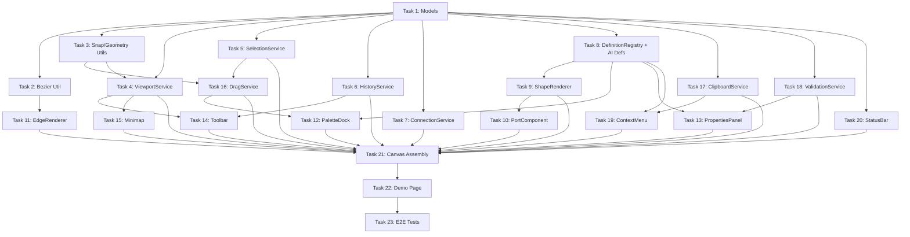

# Canvas Engine Frontend Implementation Plan

> **For agentic workers:** REQUIRED: Use superpowers:subagent-driven-development (if subagents available) or superpowers:executing-plans to implement this plan. Steps use checkbox (`- [ ]`) syntax for tracking.

**Goal:** Build the EMSIST canvas engine Angular library with AI pipeline object definitions as the first canvas type, matching Flowise's interaction quality.

**Architecture:** Single `<ems-canvas>` component using HTML nodes + SVG edges (React Flow architecture). Canvas type drives which object definitions appear in the palette. All state managed with Angular Signals. EMSIST design tokens throughout.

**Tech Stack:** Angular 21, PrimeNG 21, TypeScript strict, Vitest, Playwright, EMSIST design tokens (`--tp-*`, `--nm-*`)

**Spec:** `Documentation/lld/canvas-engine-spec.md`

**Scope:** Frontend only (Phase 1). Backend `modeler-service` and BPMN migration are separate plans.

**Deferred to Phase 2:** `LayoutService` (auto-layout via dagre) — not needed for AI pipeline validation. Will be added when BPMN canvas requires auto-layout.

---

## File Structure

```
frontend/src/app/shared/canvas-engine/
├── models/
│   ├── object-definition.model.ts       // ObjectDefinition, ShapeConfig, PortDefinition, PropertySchema
│   ├── object-instance.model.ts         // ObjectInstance, EdgeInstance, PropertyValue
│   ├── canvas-state.model.ts            // CanvasState, CanvasPermissions, ModelLock
│   └── validation.model.ts             // ValidationRule, ValidationError
├── services/
│   ├── viewport.service.ts              // pan, zoom, fit-to-view, CSS transform
│   ├── viewport.service.spec.ts
│   ├── selection.service.ts             // single/multi select, lasso
│   ├── selection.service.spec.ts
│   ├── drag.service.ts                  // node drag, snap-to-grid, palette drop
│   ├── drag.service.spec.ts
│   ├── connection.service.ts            // port wiring, dataType validation, preview
│   ├── connection.service.spec.ts
│   ├── history.service.ts               // undo/redo command stack
│   ├── history.service.spec.ts
│   ├── clipboard.service.ts             // copy/paste/duplicate
│   ├── clipboard.service.spec.ts
│   ├── validation.service.ts            // run rules from definitions
│   ├── validation.service.spec.ts
│   ├── definition-registry.service.ts   // load/cache definitions by canvas type
│   └── definition-registry.service.spec.ts
├── components/
│   ├── canvas/                          // <ems-canvas> main component
│   │   ├── canvas.component.ts
│   │   ├── canvas.component.html
│   │   ├── canvas.component.scss
│   │   └── canvas.component.spec.ts
│   ├── shape-renderer/                  // renders any ShapeConfig
│   │   ├── shape-renderer.component.ts
│   │   ├── shape-renderer.component.html
│   │   ├── shape-renderer.component.scss
│   │   └── shape-renderer.component.spec.ts
│   ├── port/                            // connection port handle
│   │   ├── port.component.ts           // inline template (small component)
│   │   ├── port.component.scss
│   │   └── port.component.spec.ts
│   ├── edge-renderer/                   // SVG edge paths
│   │   ├── edge-renderer.component.ts
│   │   └── edge-renderer.component.spec.ts
│   ├── palette-dock/                    // left-side palette
│   │   ├── palette-dock.component.ts
│   │   ├── palette-dock.component.html
│   │   ├── palette-dock.component.scss
│   │   └── palette-dock.component.spec.ts
│   ├── properties-panel/               // right-side panel
│   │   ├── properties-panel.component.ts
│   │   ├── properties-panel.component.html
│   │   ├── properties-panel.component.scss
│   │   └── properties-panel.component.spec.ts
│   ├── toolbar/                         // top toolbar
│   │   ├── toolbar.component.ts
│   │   ├── toolbar.component.html
│   │   ├── toolbar.component.scss
│   │   └── toolbar.component.spec.ts
│   ├── minimap/                         // minimap overlay
│   │   ├── minimap.component.ts
│   │   ├── minimap.component.scss
│   │   └── minimap.component.spec.ts
│   ├── context-menu/                    // right-click menu
│   │   ├── context-menu.component.ts
│   │   ├── context-menu.component.html
│   │   ├── context-menu.component.scss
│   │   └── context-menu.component.spec.ts
│   └── status-bar/                      // bottom status bar
│       ├── status-bar.component.ts
│       ├── status-bar.component.scss
│       └── status-bar.component.spec.ts
├── definitions/
│   └── ai-pipeline.definitions.ts       // AI pipeline object definitions
├── utils/
│   ├── bezier.util.ts                   // edge path math (ported from React Flow)
│   ├── bezier.util.spec.ts
│   ├── snap.util.ts                     // grid snapping
│   ├── snap.util.spec.ts
│   ├── geometry.util.ts                 // hit testing, bounding box
│   └── geometry.util.spec.ts
└── index.ts                             // public API barrel export
```

---

## Task 1: TypeScript Models

**Files:**
- Create: `frontend/src/app/shared/canvas-engine/models/object-definition.model.ts`
- Create: `frontend/src/app/shared/canvas-engine/models/object-instance.model.ts`
- Create: `frontend/src/app/shared/canvas-engine/models/canvas-state.model.ts`
- Create: `frontend/src/app/shared/canvas-engine/models/validation.model.ts`

- [ ] **Step 1: Create directory structure**

Run: `mkdir -p frontend/src/app/shared/canvas-engine/models`

- [ ] **Step 2: Write object-definition.model.ts**

All interfaces from spec Section 3 + 5: `ObjectDefinition`, `ShapeConfig`, `ShapeVisualState`, `PortDefinition`, `PropertySchema`, `PaletteSubItem`, `TranslatableString`. Import `ValidationRule` from `validation.model.ts` (defined there, referenced here).

- [ ] **Step 3: Write object-instance.model.ts**

Interfaces from spec Section 4 + 6: `PropertyValue`, `ObjectInstance`, `EdgeInstance`, `Position`.

- [ ] **Step 4: Write canvas-state.model.ts**

From spec Section 9 + 16: `CanvasState`, `CanvasPermissions`, `ModelLock`.

- [ ] **Step 5: Write validation.model.ts**

`ValidationRule`, `ValidationError`.

- [ ] **Step 6: Verify TypeScript compiles with strict mode**

Run: `cd frontend && npx tsc --noEmit --project tsconfig.app.json`
Expected: 0 errors

- [ ] **Step 7: Commit**

```bash
git add frontend/src/app/shared/canvas-engine/models/
git commit -m "feat(canvas-engine): add TypeScript model interfaces"
```

---

## Task 2: Bezier Utility (Ported from React Flow)

**Files:**
- Create: `frontend/src/app/shared/canvas-engine/utils/bezier.util.ts`
- Create: `frontend/src/app/shared/canvas-engine/utils/bezier.util.spec.ts`
- Reference: `Flowise/node_modules/.pnpm/@reactflow+core@11.10.4_*/node_modules/@reactflow/core/dist/esm/index.mjs` (search for `getBezierPath`)

- [ ] **Step 1: Write failing tests for bezier path calculation**

Test cases:
- Horizontal: source right port → target left port (standard LTR flow)
- Vertical: source bottom port → target top port
- Same-level: nodes at same Y coordinate
- Reversed: target is left of source
- Close nodes: very short distance between ports

- [ ] **Step 2: Run tests to verify they fail**

Run: `cd frontend && npx vitest run src/app/shared/canvas-engine/utils/bezier.util.spec.ts`
Expected: FAIL

- [ ] **Step 3: Port React Flow's getBezierPath implementation**

Read the React Flow source, translate to TypeScript with proper types. Export: `getBezierPath`, `getEdgeCenter`, `Position` enum.

- [ ] **Step 4: Run tests to verify they pass**

Run: `cd frontend && npx vitest run src/app/shared/canvas-engine/utils/bezier.util.spec.ts`
Expected: PASS

- [ ] **Step 5: Commit**

```bash
git add frontend/src/app/shared/canvas-engine/utils/bezier.*
git commit -m "feat(canvas-engine): port React Flow bezier path calculation"
```

---

## Task 3: Snap & Geometry Utilities

**Files:**
- Create: `frontend/src/app/shared/canvas-engine/utils/snap.util.ts`
- Create: `frontend/src/app/shared/canvas-engine/utils/snap.util.spec.ts`
- Create: `frontend/src/app/shared/canvas-engine/utils/geometry.util.ts`

- [ ] **Step 1: Write failing tests for snap-to-grid**

Test: `snapToGrid(153, 24)` → `144` (nearest multiple of 24). Test: `snapToGrid(160, 24)` → `168`.

- [ ] **Step 2: Run tests to verify fail**

- [ ] **Step 3: Implement snap.util.ts**

`snapToGrid(value, gridSize)`, `snapPosition(position, gridSize)`.

- [ ] **Step 4: Run tests to verify pass**

- [ ] **Step 5: Write failing tests for geometry.util**

Test: `getBoundingBox([...instances])` returns correct rect. Test: `isPointInRect({x:5,y:5}, {x:0,y:0,w:10,h:10})` → true. Test: `getDistance(a, b)` returns euclidean distance. Test: `getIntersection(rectA, rectB)` returns overlap rect or null.

- [ ] **Step 6: Run tests to verify fail**

- [ ] **Step 7: Implement geometry.util.ts**

`getBoundingBox(instances)`, `isPointInRect(point, rect)`, `getIntersection(rectA, rectB)`, `getDistance(a, b)`.

- [ ] **Step 8: Run tests to verify pass**

- [ ] **Step 9: Commit**

```bash
git add frontend/src/app/shared/canvas-engine/utils/
git commit -m "feat(canvas-engine): add snap and geometry utilities"
```

---

## Task 4: ViewportService

**Files:**
- Create: `frontend/src/app/shared/canvas-engine/services/viewport.service.ts`
- Create: `frontend/src/app/shared/canvas-engine/services/viewport.service.spec.ts`

- [ ] **Step 1: Write failing tests**

Test: initial zoom is 1, panX/panY is 0. Test: `zoomIn()` increases zoom by step. Test: `zoomOut()` decreases. Test: zoom clamps to min/max. Test: `fitToView(instances)` computes correct transform. Test: `transform` computed signal returns correct CSS string.

- [ ] **Step 2: Run tests to verify fail**

- [ ] **Step 3: Implement ViewportService**

Signals: `zoom`, `panX`, `panY`. Computed: `transform` → `translate(panX, panY) scale(zoom)`. Methods: `zoomIn()`, `zoomOut()`, `zoomTo(level)`, `fitToView(instances)`, `pan(deltaX, deltaY)`, `zoomAtPoint(delta, clientX, clientY)` (zoom centered on cursor — ported from React Flow's d3-zoom math).

- [ ] **Step 4: Run tests to verify pass**

- [ ] **Step 5: Commit**

```bash
git add frontend/src/app/shared/canvas-engine/services/viewport.*
git commit -m "feat(canvas-engine): add ViewportService with zoom/pan/fit"
```

---

## Task 5: SelectionService

**Files:**
- Create: `frontend/src/app/shared/canvas-engine/services/selection.service.ts`
- Create: `frontend/src/app/shared/canvas-engine/services/selection.service.spec.ts`

- [ ] **Step 1: Write failing tests**

Test: initial selection empty. Test: `select(id)` selects one, deselects others. Test: `toggleSelect(id)` adds to multi-select. Test: `selectAll(ids)`. Test: `clear()`. Test: `hasSelection` computed. Test: `lassoSelect(rect, instances)` selects instances within rect.

- [ ] **Step 2: Run tests to verify fail**

- [ ] **Step 3: Implement SelectionService**

Signals: `selectedNodeIds`, `selectedEdgeIds`. Computed: `hasSelection`. Methods: `select`, `toggleSelect`, `selectAll`, `clear`, `lassoSelect`.

- [ ] **Step 4: Run tests to verify pass**

- [ ] **Step 5: Commit**

```bash
git add frontend/src/app/shared/canvas-engine/services/selection.*
git commit -m "feat(canvas-engine): add SelectionService"
```

---

## Task 6: HistoryService (Undo/Redo)

**Files:**
- Create: `frontend/src/app/shared/canvas-engine/services/history.service.ts`
- Create: `frontend/src/app/shared/canvas-engine/services/history.service.spec.ts`

- [ ] **Step 1: Write failing tests**

Test: initial canUndo/canRedo false. Test: `push(command)` makes canUndo true. Test: `undo()` reverts last command. Test: `redo()` reapplies. Test: push after undo clears redo stack. Test: max stack size (100).

- [ ] **Step 2: Run tests to verify fail**

- [ ] **Step 3: Implement HistoryService**

Command pattern: `{ execute: () => void, undo: () => void }`. Signals: `canUndo`, `canRedo`. Methods: `push`, `undo`, `redo`, `clear`.

- [ ] **Step 4: Run tests to verify pass**

- [ ] **Step 5: Commit**

```bash
git add frontend/src/app/shared/canvas-engine/services/history.*
git commit -m "feat(canvas-engine): add HistoryService with undo/redo"
```

---

## Task 7: ConnectionService

**Files:**
- Create: `frontend/src/app/shared/canvas-engine/services/connection.service.ts`
- Create: `frontend/src/app/shared/canvas-engine/services/connection.service.spec.ts`

- [ ] **Step 1: Write failing tests**

Test: `canConnect(sourcePort, targetPort)` returns true for matching dataTypes. Test: returns false for incompatible types. Test: returns false if maxConnections reached. Test: `startConnection(instanceId, portId)` sets isConnecting. Test: `completeConnection(targetInstanceId, targetPortId)` creates edge. Test: `cancelConnection()` clears state.

- [ ] **Step 2: Run tests to verify fail**

- [ ] **Step 3: Implement ConnectionService**

Signals: `isConnecting`, `previewEdge`, `validTargets`. Methods: `canConnect`, `startConnection`, `completeConnection`, `cancelConnection`, `getValidTargets`.

- [ ] **Step 4: Run tests to verify pass**

- [ ] **Step 5: Commit**

```bash
git add frontend/src/app/shared/canvas-engine/services/connection.*
git commit -m "feat(canvas-engine): add ConnectionService with port validation"
```

---

## Task 8: DefinitionRegistryService

**Files:**
- Create: `frontend/src/app/shared/canvas-engine/services/definition-registry.service.ts`
- Create: `frontend/src/app/shared/canvas-engine/services/definition-registry.service.spec.ts`
- Create: `frontend/src/app/shared/canvas-engine/definitions/ai-pipeline.definitions.ts`

- [ ] **Step 1: Write failing tests**

Test: `loadDefinitions('ai-pipeline')` returns AI pipeline definitions. Test: `getCategories()` returns grouped categories. Test: `getDefinition(type)` returns single definition. Test: unknown type returns undefined.

- [ ] **Step 2: Run tests to verify fail**

- [ ] **Step 3: Implement DefinitionRegistryService**

Signals: `definitions`, `categories`. Methods: `loadDefinitions(canvasType)`, `getDefinition(type)`, `getCategories()`.

- [ ] **Step 4: Write AI pipeline object definitions**

Create `ai-pipeline.definitions.ts` with definitions for: ChatOpenAI, Anthropic Claude, Postgres Vector Store, Pinecone, Retriever, Conversational Chain, Tool Agent, Embedding (OpenAI), Memory (Buffer), Document Loader.

Each definition includes: type, label, category, shape (ShapeConfig with EMSIST tokens), inputs, outputs, properties, paletteIcon, paletteSortOrder.

- [ ] **Step 5: Run tests to verify pass**

- [ ] **Step 6: Commit**

```bash
git add frontend/src/app/shared/canvas-engine/services/definition-registry.*
git add frontend/src/app/shared/canvas-engine/definitions/
git commit -m "feat(canvas-engine): add DefinitionRegistryService and AI pipeline definitions"
```

---

## Task 9: ShapeRendererComponent

**Files:**
- Create: `frontend/src/app/shared/canvas-engine/components/shape-renderer/shape-renderer.component.ts`
- Create: `frontend/src/app/shared/canvas-engine/components/shape-renderer/shape-renderer.component.html`
- Create: `frontend/src/app/shared/canvas-engine/components/shape-renderer/shape-renderer.component.scss`
- Create: `frontend/src/app/shared/canvas-engine/components/shape-renderer/shape-renderer.component.spec.ts`

- [ ] **Step 1: Write failing test**

Test: renders rounded-rectangle form with correct border/fill from ShapeConfig. Test: renders header when header config present. Test: applies hover state styles. Test: applies selected state outline.

- [ ] **Step 2: Run tests to verify fail**

- [ ] **Step 3: Implement ShapeRendererComponent**

Inputs: `definition = input.required<ObjectDefinition>()`, `instance = input.required<ObjectInstance>()`, `state = input<ShapeStateName>('default')` (default value = 'default'). Renders: the shape form (div with CSS for rounded-rect, SVG for circle/diamond), header bar, icon, port handles. All styles derived from `ShapeConfig` + `ShapeVisualState` merged with defaults. Uses EMSIST tokens.

- [ ] **Step 4: Run tests to verify pass**

- [ ] **Step 5: Commit**

```bash
git add frontend/src/app/shared/canvas-engine/components/shape-renderer/
git commit -m "feat(canvas-engine): add ShapeRendererComponent"
```

---

## Task 10: PortComponent

**Files:**
- Create: `frontend/src/app/shared/canvas-engine/components/port/port.component.ts`
- Create: `frontend/src/app/shared/canvas-engine/components/port/port.component.scss`
- Create: `frontend/src/app/shared/canvas-engine/components/port/port.component.spec.ts`

- [ ] **Step 1: Write failing test**

Test: renders port dot at correct position. Test: emits `connectionStart` on mousedown. Test: shows glow when `isValidTarget` is true. Test: port label renders on hover.

- [ ] **Step 2: Run tests to verify fail**

- [ ] **Step 3: Implement PortComponent**

Input: `port` (PortDefinition), `side` ('input' | 'output'), `isValidTarget`. Output: `connectionStart`, `connectionEnd`. Renders: 12px circle with `var(--tp-primary)` fill, white border. Glow: `var(--tp-focus-ring)` when valid target.

- [ ] **Step 4: Run tests to verify pass**

- [ ] **Step 5: Commit**

```bash
git add frontend/src/app/shared/canvas-engine/components/port/
git commit -m "feat(canvas-engine): add PortComponent"
```

---

## Task 11: EdgeRendererComponent

**Files:**
- Create: `frontend/src/app/shared/canvas-engine/components/edge-renderer/edge-renderer.component.ts`
- Create: `frontend/src/app/shared/canvas-engine/components/edge-renderer/edge-renderer.component.spec.ts`

- [ ] **Step 1: Write failing test**

Test: renders SVG path with correct bezier from source to target position. Test: animated edge shows `animateMotion` circle. Test: selected edge has highlight stroke. Test: edge shadow path renders with lower opacity.

- [ ] **Step 2: Run tests to verify fail**

- [ ] **Step 3: Implement EdgeRendererComponent**

Input: `edge` (EdgeInstance), `sourcePos`, `targetPos`, `selected`, `animated`. Renders: SVG `<g>` containing shadow path + main path + optional animated dot. Uses `getBezierPath` from util.

- [ ] **Step 4: Run tests to verify pass**

- [ ] **Step 5: Commit**

```bash
git add frontend/src/app/shared/canvas-engine/components/edge-renderer/
git commit -m "feat(canvas-engine): add EdgeRendererComponent with bezier curves"
```

---

## Task 12: PaletteDockComponent

**Files:**
- Create: `frontend/src/app/shared/canvas-engine/components/palette-dock/palette-dock.component.ts`
- Create: `frontend/src/app/shared/canvas-engine/components/palette-dock/palette-dock.component.html`
- Create: `frontend/src/app/shared/canvas-engine/components/palette-dock/palette-dock.component.scss`
- Create: `frontend/src/app/shared/canvas-engine/components/palette-dock/palette-dock.component.spec.ts`

- [ ] **Step 1: Write failing test**

Test: renders categories from definitions. Test: expandable item shows sub-items on hover. Test: drag start sets dataTransfer with definition type. Test: hidden when `canEdit` is false.

- [ ] **Step 2: Run tests to verify fail**

- [ ] **Step 3: Implement PaletteDockComponent**

Port the macOS-dock pattern from `frontendold/src/app/components/bpmn-palette-docker/`. Input: `definitions` (from DefinitionRegistryService), `canEdit`. Neumorphic styling with `var(--nm-bg)`, `var(--tp-elevation-default)`.

- [ ] **Step 4: Run tests to verify pass**

- [ ] **Step 5: Commit**

```bash
git add frontend/src/app/shared/canvas-engine/components/palette-dock/
git commit -m "feat(canvas-engine): add PaletteDockComponent with drag-and-drop"
```

---

## Task 13: PropertiesPanelComponent

**Files:**
- Create: `frontend/src/app/shared/canvas-engine/components/properties-panel/properties-panel.component.ts`
- Create: `frontend/src/app/shared/canvas-engine/components/properties-panel/properties-panel.component.html`
- Create: `frontend/src/app/shared/canvas-engine/components/properties-panel/properties-panel.component.scss`
- Create: `frontend/src/app/shared/canvas-engine/components/properties-panel/properties-panel.component.spec.ts`

- [ ] **Step 1: Write failing test**

Test: renders property fields from selected instance's definition schema. Test: text property renders PrimeNG InputText. Test: select property renders PrimeNG Dropdown. Test: toggle renders PrimeNG InputSwitch. Test: emits property change on edit. Test: fields disabled when `canEdit` false.

- [ ] **Step 2: Run tests to verify fail**

- [ ] **Step 3: Implement PropertiesPanelComponent**

Input: `selectedInstance`, `definition`, `canEdit`. Dynamically renders PrimeNG form fields based on `PropertySchema[]`. Emits `propertyChanged` on value edit. Shows instance label, category, connection list.

- [ ] **Step 4: Run tests to verify pass**

- [ ] **Step 5: Commit**

```bash
git add frontend/src/app/shared/canvas-engine/components/properties-panel/
git commit -m "feat(canvas-engine): add PropertiesPanelComponent with PrimeNG forms"
```

---

## Task 14: ToolbarComponent

**Files:**
- Create: `frontend/src/app/shared/canvas-engine/components/toolbar/toolbar.component.ts`
- Create: `frontend/src/app/shared/canvas-engine/components/toolbar/toolbar.component.html`
- Create: `frontend/src/app/shared/canvas-engine/components/toolbar/toolbar.component.scss`
- Create: `frontend/src/app/shared/canvas-engine/components/toolbar/toolbar.component.spec.ts`

- [ ] **Step 1: Write failing test**

Test: undo button disabled when canUndo false. Test: zoom display shows current percentage. Test: save button emits save event. Test: toolbar shows zoom-only when canEdit false.

- [ ] **Step 2: Run tests to verify fail**

- [ ] **Step 3: Implement ToolbarComponent**

Inputs from services: `canUndo`, `canRedo`, `zoomPercentage`, `canEdit`. Actions: undo, redo, zoomIn, zoomOut, fitToView, toggleGrid, toggleMinimap, validate, save.

- [ ] **Step 4: Run tests to verify pass**

- [ ] **Step 5: Commit**

```bash
git add frontend/src/app/shared/canvas-engine/components/toolbar/
git commit -m "feat(canvas-engine): add ToolbarComponent"
```

---

## Task 15: MinimapComponent

**Files:**
- Create: `frontend/src/app/shared/canvas-engine/components/minimap/minimap.component.ts`
- Create: `frontend/src/app/shared/canvas-engine/components/minimap/minimap.component.scss`
- Create: `frontend/src/app/shared/canvas-engine/components/minimap/minimap.component.spec.ts`

- [ ] **Step 1: Write failing test**

Test: renders scaled rectangles for each instance. Test: viewport indicator shows visible area. Test: clicking minimap pans the viewport.

- [ ] **Step 2: Run tests to verify fail**

- [ ] **Step 3: Implement MinimapComponent**

Computed scale from bounding box of all instances. Renders colored rectangles. Viewport rect from ViewportService. Click/drag on minimap calls `ViewportService.pan()`.

- [ ] **Step 4: Run tests to verify pass**

- [ ] **Step 5: Commit**

```bash
git add frontend/src/app/shared/canvas-engine/components/minimap/
git commit -m "feat(canvas-engine): add MinimapComponent"
```

---

## Task 16: DragService

**Files:**
- Create: `frontend/src/app/shared/canvas-engine/services/drag.service.ts`
- Create: `frontend/src/app/shared/canvas-engine/services/drag.service.spec.ts`

- [ ] **Step 1: Write failing tests**

Test: initial `isDragging` false. Test: `startDrag(instanceId, offset)` sets isDragging. Test: `updateDrag(position)` computes new position with snap. Test: `endDrag()` returns final position. Test: `startPaletteDrop(definitionType)` sets drop mode. Test: `completePaletteDrop(position)` creates instance at snapped position. Test: snap uses `snapToGrid` from snap.util.

- [ ] **Step 2: Run tests to verify fail**

- [ ] **Step 3: Implement DragService**

Signals: `isDragging`, `dragOffset`, `snapGuides`, `isPaletteDropping`. Methods: `startDrag`, `updateDrag`, `endDrag`, `startPaletteDrop`, `completePaletteDrop`, `cancelDrag`. Uses `snapToGrid` from snap.util and `SelectionService` for multi-node drag.

- [ ] **Step 4: Run tests to verify pass**

- [ ] **Step 5: Commit**

```bash
git add frontend/src/app/shared/canvas-engine/services/drag.*
git commit -m "feat(canvas-engine): add DragService with snap-to-grid"
```

---

## Task 17: ClipboardService

**Files:**
- Create: `frontend/src/app/shared/canvas-engine/services/clipboard.service.ts`
- Create: `frontend/src/app/shared/canvas-engine/services/clipboard.service.spec.ts`

- [ ] **Step 1: Write failing tests**

Test: initial `canPaste` false. Test: `copy(instances, edges)` stores data, sets canPaste true. Test: `paste()` returns deep clones with new IDs and offset positions. Test: `duplicate(instances, edges)` returns clones with offset. Test: `cut(instances, edges)` copies then returns IDs to remove.

- [ ] **Step 2: Run tests to verify fail**

- [ ] **Step 3: Implement ClipboardService**

Signals: `canPaste`. Methods: `copy`, `paste`, `cut`, `duplicate`. Uses structuredClone for deep copy, generates new unique IDs, offsets pasted positions by (20, 20).

- [ ] **Step 4: Run tests to verify pass**

- [ ] **Step 5: Commit**

```bash
git add frontend/src/app/shared/canvas-engine/services/clipboard.*
git commit -m "feat(canvas-engine): add ClipboardService with copy/paste/duplicate"
```

---

## Task 18: ValidationService

**Files:**
- Create: `frontend/src/app/shared/canvas-engine/services/validation.service.ts`
- Create: `frontend/src/app/shared/canvas-engine/services/validation.service.spec.ts`

- [ ] **Step 1: Write failing tests**

Test: `validate(instances, edges, definitions)` returns empty errors for valid canvas. Test: returns error for required port with no connection. Test: returns error for maxConnections exceeded. Test: returns warning from custom ValidationRule. Test: `errors` and `warnings` signals update after validate call.

- [ ] **Step 2: Run tests to verify fail**

- [ ] **Step 3: Implement ValidationService**

Signals: `errors`, `warnings`. Methods: `validate(instances, edges, definitions)`, `clearErrors()`. Checks: required ports connected, maxConnections, custom ValidationRules from definitions.

- [ ] **Step 4: Run tests to verify pass**

- [ ] **Step 5: Commit**

```bash
git add frontend/src/app/shared/canvas-engine/services/validation.*
git commit -m "feat(canvas-engine): add ValidationService"
```

---

## Task 19: ContextMenuComponent

**Files:**
- Create: `frontend/src/app/shared/canvas-engine/components/context-menu/context-menu.component.ts`
- Create: `frontend/src/app/shared/canvas-engine/components/context-menu/context-menu.component.html`
- Create: `frontend/src/app/shared/canvas-engine/components/context-menu/context-menu.component.scss`
- Create: `frontend/src/app/shared/canvas-engine/components/context-menu/context-menu.component.spec.ts`

- [ ] **Step 1: Write failing test**

Test: menu shows at click position. Test: "Delete" option emits delete event. Test: "Duplicate" option emits duplicate event. Test: menu hidden when `canEdit` false. Test: menu closes on outside click.

- [ ] **Step 2: Run tests to verify fail**

- [ ] **Step 3: Implement ContextMenuComponent**

Input: `position`, `targetInstance`, `canEdit`. Output: `delete`, `duplicate`, `changeType`. Renders PrimeNG-styled dropdown menu at cursor position. Closes on click outside or Escape.

- [ ] **Step 4: Run tests to verify pass**

- [ ] **Step 5: Commit**

```bash
git add frontend/src/app/shared/canvas-engine/components/context-menu/
git commit -m "feat(canvas-engine): add ContextMenuComponent"
```

---

## Task 20: StatusBarComponent

**Files:**
- Create: `frontend/src/app/shared/canvas-engine/components/status-bar/status-bar.component.ts`
- Create: `frontend/src/app/shared/canvas-engine/components/status-bar/status-bar.component.scss`
- Create: `frontend/src/app/shared/canvas-engine/components/status-bar/status-bar.component.spec.ts`

- [ ] **Step 1: Write failing test**

Test: displays instance count. Test: displays edge count. Test: displays zoom percentage. Test: displays cursor coordinates.

- [ ] **Step 2: Run tests to verify fail**

- [ ] **Step 3: Implement StatusBarComponent**

Inline template (small component). Inputs: `instanceCount`, `edgeCount`, `zoomPercentage`, `cursorPosition`. Bottom bar with EMSIST tokens.

- [ ] **Step 4: Run tests to verify pass**

- [ ] **Step 5: Commit**

```bash
git add frontend/src/app/shared/canvas-engine/components/status-bar/
git commit -m "feat(canvas-engine): add StatusBarComponent"
```

---

## Task 21: EmsCanvasComponent (Assembly)

**Files:**
- Create: `frontend/src/app/shared/canvas-engine/components/canvas/canvas.component.ts`
- Create: `frontend/src/app/shared/canvas-engine/components/canvas/canvas.component.html`
- Create: `frontend/src/app/shared/canvas-engine/components/canvas/canvas.component.scss`
- Create: `frontend/src/app/shared/canvas-engine/components/canvas/canvas.component.spec.ts`
- Create: `frontend/src/app/shared/canvas-engine/index.ts`

- [ ] **Step 1: Write integration test**

Test: canvas renders with ai-pipeline type. Test: palette shows AI pipeline categories. Test: drop creates instance. Test: connect two nodes creates edge. Test: select node shows properties panel.

- [ ] **Step 2: Run tests to verify fail**

- [ ] **Step 3: Implement EmsCanvasComponent**

Assembles all sub-components. Template layout: toolbar (top) + palette (left) + viewport (center) + properties (right) + status bar (bottom). Viewport div with CSS transform from ViewportService. Mouse event handlers: wheel → zoom, mousedown+drag → pan or node drag, port mousedown → connection start. Keyboard shortcuts via `@HostListener`.

- [ ] **Step 4: Implement viewport interactions**

Port from React Flow: wheel zoom (centered on cursor), mouse pan, node drag with snap. Reference: `@reactflow/core/dist/esm/index.mjs` — search for `useZoom`, `usePanOnDrag`, `useDrag`.

- [ ] **Step 5: Implement connection interactions**

Port from React Flow: drag from port → bezier preview follows cursor → snap to valid target → create edge. Reference: search for `ConnectionLine`, `Handle`.

- [ ] **Step 6: Write barrel export**

`index.ts` exports: `EmsCanvasComponent`, all models, `DefinitionRegistryService`.

- [ ] **Step 7: Run all tests**

Run: `cd frontend && npx vitest run src/app/shared/canvas-engine/`
Expected: ALL PASS

- [ ] **Step 8: Commit**

```bash
git add frontend/src/app/shared/canvas-engine/
git commit -m "feat(canvas-engine): assemble EmsCanvasComponent with all interactions"
```

---

## Task 22: Demo Page

**Files:**
- Create: `frontend/src/app/features/canvas-demo/canvas-demo.page.ts`
- Modify: `frontend/src/app/app.routes.ts` — add route `/canvas-demo`

- [ ] **Step 1: Create demo page**

Simple page that renders `<ems-canvas [type]="'ai-pipeline'" />` with sample instances and edges. Used for manual testing and visual comparison against Flowise.

- [ ] **Step 2: Add route**

Add `{ path: 'canvas-demo', loadComponent: () => import('./features/canvas-demo/canvas-demo.page').then(m => m.CanvasDemoPage) }` to app.routes.ts.

- [ ] **Step 3: Manual testing**

Run: `cd frontend && ng serve`
Open: `http://localhost:4200/canvas-demo`
Verify: palette renders, drag-drop works, connections work, zoom/pan smooth, properties panel edits, minimap shows.

- [ ] **Step 4: Commit**

```bash
git add frontend/src/app/features/canvas-demo/
git add frontend/src/app/app.routes.ts
git commit -m "feat(canvas-engine): add demo page for visual testing"
```

---

## Task 23: E2E Tests

**Files:**
- Create: `frontend/e2e/canvas-engine.e2e.ts`

- [ ] **Step 1: Write E2E tests**

Playwright tests:
- Navigate to `/canvas-demo`
- Drag node from palette to canvas
- Verify node appears
- Drag second node
- Connect output port to input port
- Verify edge renders
- Click node → verify properties panel opens
- Edit property → verify value updates
- Zoom with scroll wheel
- Pan with mouse drag
- Keyboard: Ctrl+Z undo, Ctrl+Shift+Z redo
- Visual screenshot comparison

- [ ] **Step 2: Run E2E tests**

Run: `cd frontend && npx playwright test e2e/canvas-engine.e2e.ts`
Expected: ALL PASS

- [ ] **Step 3: Commit**

```bash
git add frontend/e2e/canvas-engine.e2e.ts
git commit -m "test(canvas-engine): add E2E tests for core canvas interactions"
```

---

## Task Order & Dependencies



**Parallelizable tasks** (after Task 1 completes):
- Tasks 2, 3, 4, 5, 6, 7, 8 can run in parallel
- Tasks 9-20 can run in parallel (after their respective dependencies)
- Task 21 (assembly) blocks on all component + service tasks
- Tasks 22, 23 are sequential at the end

**Note:** Canvas component location is in `components/canvas/` (not root of canvas-engine/). This deviates from the spec's file structure for consistency — all components live under `components/`. The barrel export (`index.ts`) re-exports from there.
