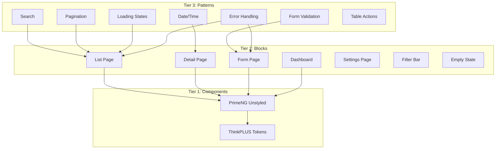
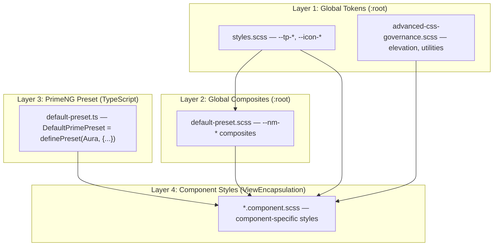

# EMSIST Design System Contract

**Version:** 1.0.0
**Status:** [IN-PROGRESS]
**Stack:** Angular 21 + PrimeNG 21 (unstyled) + SCSS + ThinkPLUS tokens

## Purpose
This is the SINGLE ENTRY POINT for all agents before building any frontend screen.
Every DEV, UX, and QA agent MUST read this file before touching frontend code.

## Source Of Truth Hierarchy

Global UI governance for the EMSIST repo lives only under `Documentation/design-system/`.

Rules that apply across multiple features must be defined only under
`Documentation/design-system/` and must not be redefined under
`Documentation/.Requirements/`.

Feature delivery docs under `Documentation/.Requirements/` are supplements only.
They may define feature-specific scope, screen inventory, placement, scenarios,
test inventory, and rollout sequencing, but they must not replace or fork the
global token scales, component rules, interaction patterns, or repo-wide UI
governance defined here.

If a feature document conflicts with this contract on a repo-wide UI rule, this
contract wins. Feature docs may only narrow behavior for the feature they
describe.

## Reading Order
1. This contract (you are here)
2. The canonical visual reference → [component-showcase.html](./component-showcase.html)
3. The relevant BLOCK for your page type → [blocks/](./blocks/)
4. The relevant PATTERNS for your interactions → [patterns/](./patterns/)
5. The component docs for PrimeNG components you'll use → [components/](./components/)
6. The foundation docs for tokens you'll reference → [foundations/](./foundations/)

## Visual Contract

`Documentation/design-system/component-showcase.html` is the canonical visual
contract for the shell, component language, token usage, and typography scale.
It is a frozen reference artifact with inline `@font-face` and `:root` token
declarations. The application token sources, generated token snapshot,
documentation, tests, hooks, and CI must align to the values declared there.

## Architecture

## Quick Reference

### Token Namespace
| Prefix | Scope | Example |
|--------|-------|---------|
| `--tp-*` | ThinkPLUS global tokens (`:root`) | `--tp-primary`, `--tp-surface` |
| `--nm-*` | Neumorphic composite design-system tokens (`:root`, centralized in `default-preset.scss`) | `--nm-shadow-dark`, `--nm-btn-bezel-gradient` |
| `--icon-*` | Icon sizing scale (`:root`) | `--icon-size-sm`, `--icon-size-md` |
| `--ai-*` | AI service tokens (16 in `prototype-extras.css`: status — `--ai-primary`, `--ai-primary-hover`, `--ai-primary-subtle`, `--ai-success`, `--ai-success-bg`, `--ai-warning`, `--ai-warning-bg`, `--ai-error`, `--ai-error-bg`, `--ai-text-disabled`; agent types — `--ai-agent-orchestrator`, `--ai-agent-data`, `--ai-agent-support`, `--ai-agent-code`, `--ai-agent-document`, `--ai-agent-custom`) | `--ai-primary`, `--ai-success` |

**Note:** Historical feature-scoped token prefixes (`--adm-*`, `--tm-*`, `--bs-*`) were retired during the 2026-03 token-architecture consolidation. New design-system work must use `--tp-*` primitives plus centralized `--nm-*` composites instead of reintroducing feature-token namespaces.

### Color Palette (Source: styles.scss)
| Token | Hex | Usage |
|-------|-----|-------|
| `--tp-primary` | #428177 | Actions, links, active states |
| `--tp-primary-dark` | #054239 | Hover states, gradients |
| `--tp-surface` | #F2EFE9 | Page background |
| `--tp-surface-raised` | #FAF8F4 | Cards, panels, inputs (floating surfaces) |
| `--nm-surface` | #E0DDDA | Recessed/inset areas (tab wells, search containers) |
| `--tp-text` | #3d3a3b | Body text, labels |
| `--tp-text-dark` | #2A241C | Headings, high-emphasis text |
| `--tp-text-secondary` | #7A7672 | Secondary information, subtitles |
| `--tp-text-muted` | #999590 | Tertiary text, placeholders, helper copy |
| `--tp-border` | #E0DDDA | Default structural border (cards, panels, inputs) |
| `--tp-danger` | #6b1f2a | Errors, destructive actions |
| `--tp-danger-hover` | #4a151e | Danger hover/pressed state |
| `--tp-warning-dark` | #5a4a2a | Dark warning text (toast/banner) |
| `--tp-success` | #428177 | Success states |
| `--tp-warning` | #988561 | Warning states |
| `--tp-info` | #054239 | Informational states |

### Spacing Scale (4px base)
| Token | Value | Use |
|-------|-------|-----|
| `--tp-space-0` | 0 | No space |
| `--tp-space-1` | 0.25rem (4px) | Tight inline |
| `--tp-space-2` | 0.5rem (8px) | Compact gaps |
| `--tp-space-3` | 0.75rem (12px) | Default inner padding |
| `--tp-space-4` | 1rem (16px) | Standard gap |
| `--tp-space-5` | 1.25rem (20px) | Comfortable spacing |
| `--tp-space-6` | 1.5rem (24px) | Section padding |
| `--tp-space-8` | 2rem (32px) | Large section gaps |
| `--tp-space-10` | 2.5rem (40px) | Major separations |
| `--tp-space-12` | 3rem (48px) | Page-level spacing |
| `--tp-space-16` | 4rem (64px) | Hero/header spacing |

### Breakpoints
| Name | Width | Usage |
|------|-------|-------|
| Mobile | < 768px | Single column, stacked layout |
| Tablet | 768px - 1024px | Two column, collapsible sidebar |
| Desktop | > 1024px | Full layout with sidebar |

### CSS Architecture Layers

The design system is implemented across multiple SCSS layers:

| Layer | File | Scope | Token Namespace |
|-------|------|-------|-----------------|
| 1 - Global | `frontend/src/styles.scss` | `:root` (all pages) | `--tp-*`, `--icon-*` |
| 1 - Global | `frontend/src/app/core/theme/advanced-css-governance.scss` | `:root` | `--tp-elevation-*` (aliases to `--nm-elevation-*`), `--tp-admin-content-*` |
| 2 - Global Composites | `frontend/src/app/core/theme/default-preset.scss` | `:root` | `--nm-*` |
| 3 - PrimeNG | `frontend/src/app/core/theme/default-preset.ts` | PrimeNG theme engine | Static hex (TypeScript API limitation) |
| 4 - Component | `*.component.scss` | Angular ViewEncapsulation | Uses tokens from layers 1-3 |

**Rule:** Layer 2-4 composites and component styles MUST reference Layer 1 tokens via `var(--tp-*)` when deriving palette-based values. Direct hex values are forbidden except in Layer 3, where the PrimeNG TypeScript preset requires static values.

### PrimeNG Component Selection
Before creating any custom component, check if PrimeNG provides it.
See [primeng-token-integration.md](./technical/primeng-token-integration.md).

## Index

### Foundations
- [Color](./foundations/color.md) -- [DOCUMENTED]
- [Typography](./foundations/typography.md) -- [DOCUMENTED]
- [Spacing](./foundations/spacing.md) -- [DOCUMENTED]
- [Iconography](./foundations/iconography.md) -- [DOCUMENTED]
- [Accessibility](./foundations/accessibility.md) -- [DOCUMENTED]
- [Content Guidelines](./foundations/content-guidelines.md) -- [DOCUMENTED]

### Blocks
- [List Page](./blocks/list-page.md) -- [DOCUMENTED]
- [Detail Page](./blocks/detail-page.md) -- [DOCUMENTED]
- [Form Page](./blocks/form-page.md) -- [DOCUMENTED]
- [Dashboard](./blocks/dashboard.md) -- [DOCUMENTED]
- [Settings Page](./blocks/settings-page.md) -- [DOCUMENTED]
- [Filter Bar](./blocks/filter-bar.md) -- [DOCUMENTED]
- [Empty State](./blocks/empty-state.md) -- [DOCUMENTED]
- [Header / App Shell](./blocks/header.md) -- [DOCUMENTED]

### Patterns
- [Search](./patterns/search.md) -- [DOCUMENTED]
- [Pagination](./patterns/pagination.md) -- [DOCUMENTED]
- [Date/Time](./patterns/date-time.md) -- [DOCUMENTED]
- [Form Validation](./patterns/form-validation.md) -- [DOCUMENTED]
- [Loading States](./patterns/loading-states.md) -- [DOCUMENTED]
- [Error Handling](./patterns/error-handling.md) -- [DOCUMENTED]
- [Table Actions](./patterns/table-actions.md) -- [DOCUMENTED]

### Components
- [Button](./components/button.md) -- [DOCUMENTED]
- [Card](./components/card.md) -- [DOCUMENTED]
- [DataTable](./components/datatable.md) -- [DOCUMENTED]
- [DatePicker](./components/datepicker.md) -- [DOCUMENTED]
- [Fieldset](./components/fieldset.md) -- [DOCUMENTED]
- [Input](./components/input.md) -- [DOCUMENTED]
- [Dialog](./components/dialog.md) -- [DOCUMENTED]
- [Menu](./components/menu.md) -- [DOCUMENTED]
- [Message](./components/message.md) -- [DOCUMENTED]
- [MultiSelect](./components/multiselect.md) -- [DOCUMENTED]
- [Paginator](./components/paginator.md) -- [DOCUMENTED]
- [ProgressBar](./components/progressbar.md) -- [DOCUMENTED]
- [ProgressSpinner](./components/progressspinner.md) -- [DOCUMENTED]
- [RadioButton](./components/radiobutton.md) -- [DOCUMENTED]
- [Select](./components/select.md) -- [DOCUMENTED]
- [SelectButton](./components/selectbutton.md) -- [DOCUMENTED]
- [Slider](./components/slider.md) -- [DOCUMENTED]
- [Tabs](./components/tabs.md) -- [DOCUMENTED]
- [Tag](./components/tag.md) -- [DOCUMENTED]
- [Toast](./components/toast.md) -- [IMPLEMENTED]
- [ToggleSwitch](./components/toggleswitch.md) -- [DOCUMENTED]
- [Tooltip](./components/tooltip.md) -- [DOCUMENTED]
- [Checkbox](./components/checkbox.md) -- [DOCUMENTED]
- [Badge](./components/badge.md) -- [DOCUMENTED]
- [Breadcrumb](./components/breadcrumb.md) -- [DOCUMENTED]

### Technical
- [Frontend Do/Don't](./technical/frontend-do-dont.md) -- [DOCUMENTED]
- [Performance Targets](./technical/performance-targets.md) -- [DOCUMENTED]
- [PrimeNG Token Integration](./technical/primeng-token-integration.md) -- [DOCUMENTED]
- [Browser Support](./technical/browser-support.md) -- [DOCUMENTED]
