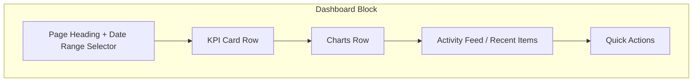
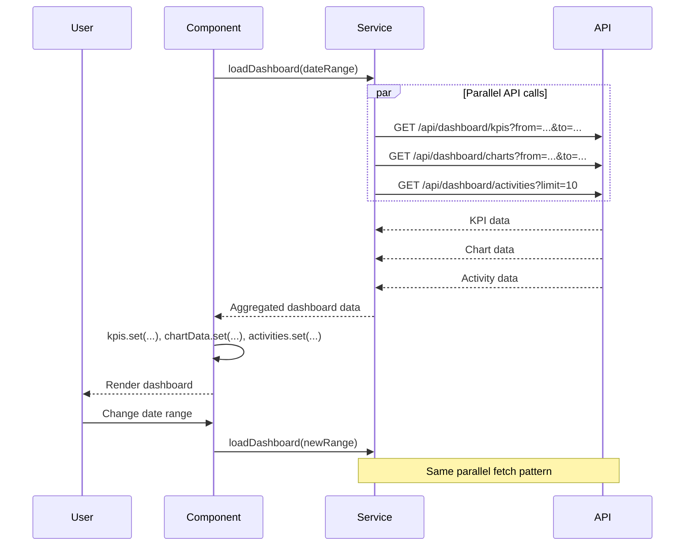

# Dashboard Block

**Version:** 1.0.0
**Status:** [DOCUMENTED]

## Overview

The Dashboard block is the standard layout for overview and home pages. It presents key performance indicators (KPI cards), charts for visual data analysis, an activity feed of recent events, and quick action buttons for common tasks. It provides an at-a-glance summary of the most important metrics for the current context (tenant, system, or feature area).

## When to Use

- Landing page after login (tenant dashboard, admin dashboard)
- Feature-area overview (license overview, definition management overview)
- Executive summary pages with KPI metrics
- Pages combining multiple data summaries from different services

## When NOT to Use

- Browsing a single entity collection -- use List Page instead
- Viewing a single entity in depth -- use Detail Page instead
- Data entry -- use Form Page instead
- Configuring settings -- use Settings Page instead

## Anatomy



## Components Used

| Component | PrimeNG Module | Import | Purpose |
|-----------|---------------|--------|---------|
| `p-card` | `CardModule` | `primeng/card` | KPI cards, chart containers |
| `p-chart` | `ChartModule` | `primeng/chart` | Bar, line, pie charts (Chart.js wrapper) |
| `p-button` | `ButtonModule` | `primeng/button` | Quick action buttons |
| `p-tag` | `TagModule` | `primeng/tag` | Trend indicators (up/down), status badges |
| `p-skeleton` | `SkeletonModule` | `primeng/skeleton` | Loading placeholder for KPIs and charts |
| `p-datePicker` | `DatePickerModule` | `primeng/datepicker` | Date range selector for filtering |
| `p-timeline` | `TimelineModule` | `primeng/timeline` | Activity feed |
| `p-progressSpinner` | `ProgressSpinnerModule` | `primeng/progressspinner` | Loading state |

## Layout

### Desktop (> 1024px)

Four-column grid for KPI cards. Charts in a two-column row below. Activity feed and quick actions side by side at the bottom.

```
+----------------------------------------------------------+
| Dashboard                        [This Month v] [Refresh] |
+----------------------------------------------------------+
| [KPI 1]    | [KPI 2]    | [KPI 3]    | [KPI 4]          |
| Total Users  Active Lic.  Definitions  Avg Response      |
| 142 +12%     8 active     24 types     120ms -5%         |
+----------------------------------------------------------+
| [Bar Chart: Usage by Service]  | [Pie Chart: Users by Role]|
+----------------------------------------------------------+
| Recent Activity                | Quick Actions              |
| - User created 2m ago         | [+ Create Tenant]          |
| - License renewed 1h ago      | [+ Invite User]            |
| - Definition published 3h ago | [View Reports]             |
+----------------------------------------------------------+
```

### Tablet (768px - 1024px)

Two-column KPI grid. Charts stack vertically. Activity feed and quick actions stack vertically.

### Mobile (< 768px)

Single-column stacked layout. KPI cards in a horizontally scrollable row or stacked. Charts full-width. Activity feed and quick actions stacked.

## Required Signals

| Signal | Type | Purpose |
|--------|------|---------|
| `kpis` | `signal<KpiData[]>` | KPI card data (value, label, trend, trendDirection) |
| `chartData` | `signal<ChartData>` | Chart.js dataset for charts |
| `activities` | `signal<ActivityItem[]>` | Recent activity feed items |
| `loading` | `signal<boolean>` | Overall dashboard loading state |
| `dateRange` | `signal<[Date, Date]>` | Selected date range filter |
| `error` | `signal<string \| null>` | Error loading dashboard data |

## Data Flow



## Code Example

```html
<div class="dashboard">
  <div class="dashboard-header">
    <h2>Dashboard</h2>
    <div class="dashboard-controls">
      <p-datePicker
        [(ngModel)]="dateRange"
        selectionMode="range"
        [showIcon]="true"
        placeholder="Select date range"
      />
      <p-button
        icon="pi pi-refresh"
        severity="secondary"
        (onClick)="refresh()"
        aria-label="Refresh dashboard"
        [style]="{ 'min-height': 'var(--tp-touch-target-min-size)' }"
      />
    </div>
  </div>

  <div class="kpi-grid">
    @for (kpi of kpis(); track kpi.label) {
      <p-card [pt]="{ root: { class: 'kpi-card' } }">
        <div class="kpi-content">
          <span class="kpi-label">{{ kpi.label }}</span>
          <span class="kpi-value">{{ kpi.value }}</span>
          @if (kpi.trend) {
            <p-tag
              [value]="kpi.trend"
              [severity]="kpi.trendDirection === 'up' ? 'success' : 'danger'"
              [rounded]="true"
            />
          }
        </div>
      </p-card>
    }
  </div>

  <div class="charts-row">
    <p-card>
      <p-chart type="bar" [data]="barChartData()" [options]="chartOptions" />
    </p-card>
    <p-card>
      <p-chart type="pie" [data]="pieChartData()" [options]="chartOptions" />
    </p-card>
  </div>
</div>
```

```scss
.kpi-grid {
  display: grid;
  grid-template-columns: repeat(4, 1fr);
  gap: var(--tp-space-4);

  @media (max-width: 1024px) {
    grid-template-columns: repeat(2, 1fr);
  }

  @media (max-width: 768px) {
    grid-template-columns: 1fr;
  }
}

.charts-row {
  display: grid;
  grid-template-columns: 1fr 1fr;
  gap: var(--tp-space-4);
  margin-block-start: var(--tp-space-6);

  @media (max-width: 1024px) {
    grid-template-columns: 1fr;
  }
}
```

## Tokens Used

| Token | Usage in This Block |
|-------|---------------------|
| `--tp-primary` | KPI trend up indicator, chart accent color |
| `--tp-primary-dark` | Chart bar fill |
| `--tp-warning` | Chart secondary series |
| `--tp-surface` | Card backgrounds, page background |
| `--tp-text` | KPI labels, activity text |
| `--tp-text-dark` | KPI values, heading |
| `--tp-border` | Card borders, dividers |
| `--tp-danger` | Trend down indicator |
| `--tp-success` | Trend up indicator |
| `--tp-space-4` | Grid gap, card inner padding |
| `--tp-space-6` | Section margin between KPIs and charts |
| `--tp-touch-target-min-size` | Refresh button, quick action buttons |

## Do / Don't

| Do | Don't |
|----|-------|
| Load KPIs, charts, and activities in parallel | Fetch sequentially, blocking the entire page |
| Show `p-skeleton` placeholders during loading | Leave cards blank until data arrives |
| Use `p-chart` (Chart.js) for standard chart types | Build custom SVG charts from scratch |
| Provide a date range selector for filtering | Hardcode a fixed time window |
| Show trend direction with both icon and text | Indicate trend with color alone (accessibility) |
| Keep quick actions to 3-5 most common tasks | Overload the dashboard with every possible action |
| Use semantic chart colors from `--tp-*` tokens | Use arbitrary colors in chart datasets |

## Accessibility

| Requirement | Implementation |
|-------------|----------------|
| KPI cards | Each card is a `<section>` with `aria-label` describing the metric |
| Chart alt text | `<p-chart>` has `aria-label` summarizing the data; provide a data table fallback |
| Activity feed | `<p-timeline>` uses semantic markup; items are keyboard-navigable |
| Quick actions | Buttons with descriptive labels, not icon-only |
| Loading state | `aria-busy="true"` on dashboard container while loading |
| Color contrast | Chart colors meet AAA contrast requirements |
| Touch targets | All interactive elements have min 44x44px hit area |
| Focus order | Tab order: date range selector, refresh, KPI cards, charts, activities, quick actions |
| RTL support | Grid and flexbox use logical properties |
