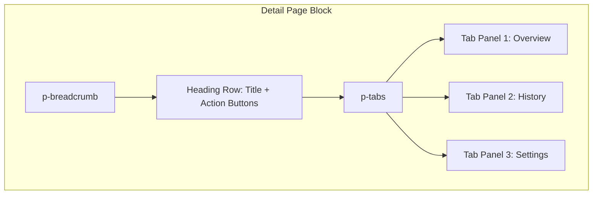
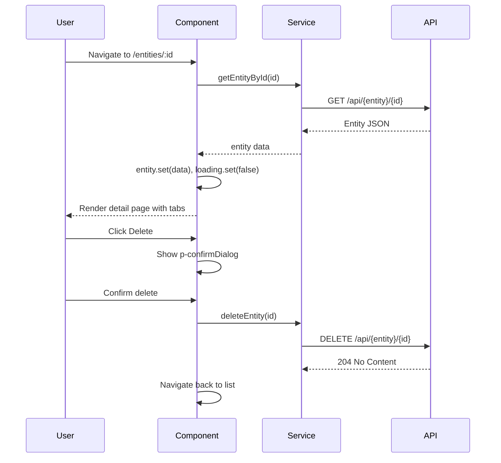

# Detail Page Block

**Version:** 1.0.0
**Status:** [DOCUMENTED]

## Overview

The Detail Page block displays a single entity with structured sections. It provides a breadcrumb trail for navigation context, a heading row with the entity name and action buttons (Edit, Delete), and a tab group to organize related information into logical sections.

Use this block when the user navigates from a List Page to view or manage a single record in depth.

## When to Use

- Viewing a single entity with multiple related data sections
- Providing Edit and Delete actions for the entity
- Organizing related information into tabs (Overview, History, Settings, Related Items)
- Showing entity metadata (created date, status, owner)

## When NOT to Use

- Displaying a collection of entities -- use List Page instead
- Creating or editing an entity -- use Form Page instead
- Showing a summary dashboard with KPIs -- use Dashboard instead

## Anatomy



## Components Used

| Component | PrimeNG Module | Import | Purpose |
|-----------|---------------|--------|---------|
| `p-breadcrumb` | `BreadcrumbModule` | `primeng/breadcrumb` | Navigation breadcrumb trail |
| `p-tabs` | `TabsModule` | `primeng/tabs` | Tab group for content sections |
| `p-tabList` | `TabsModule` | `primeng/tabs` | Scrollable tab header list |
| `p-tab` | `TabsModule` | `primeng/tabs` | Individual tab header |
| `p-tabPanels` | `TabsModule` | `primeng/tabs` | Tab content container |
| `p-tabPanel` | `TabsModule` | `primeng/tabs` | Individual tab content |
| `p-button` | `ButtonModule` | `primeng/button` | Edit, Delete, Back action buttons |
| `p-tag` | `TagModule` | `primeng/tag` | Entity status badge |
| `p-confirmDialog` | `ConfirmDialogModule` | `primeng/confirmdialog` | Delete confirmation |
| `p-card` | `CardModule` | `primeng/card` | Content section cards within tab panels |

## Layout

### Desktop (> 1024px)

Breadcrumb spans full width. Heading row: entity name left-aligned, action buttons right-aligned. Tabs below. Within tab panels, content may use a two-column layout (side-by-side panels).

```
Home > Tenants > Acme Corp
+----------------------------------------------------------+
| Acme Corp                          [Edit] [Delete]        |
| Status: Active   Created: 12 Mar 2026                     |
+----------------------------------------------------------+
| [Overview] [Users] [Licenses] [Audit Log]                 |
+----------------------------------------------------------+
| Left Panel (Metadata)     | Right Panel (Summary)         |
|   Name: Acme Corp         |   Total Users: 42             |
|   Domain: acme.com        |   Active Licenses: 3          |
|   Owner: admin@acme.com   |   Last Activity: 2h ago       |
+----------------------------------------------------------+
```

### Tablet (768px - 1024px)

Same structure but panels stack vertically within tabs. Action buttons may move below the title on narrow tablets.

### Mobile (< 768px)

Breadcrumb shows only parent + current (collapsed). Title and action buttons stack vertically. Tabs remain horizontal with scroll. All panel content stacks in a single column.

## Required Signals

| Signal | Type | Purpose |
|--------|------|---------|
| `entity` | `signal<T \| null>` | The loaded entity |
| `loading` | `signal<boolean>` | Whether the entity is being fetched |
| `error` | `signal<string \| null>` | Fetch error message |
| `activeTab` | `signal<number>` | Index of the currently active tab |
| `deleting` | `signal<boolean>` | Whether a delete operation is in progress |

## Data Flow



## Code Example

```html
<div class="detail-page">
  <p-breadcrumb [model]="breadcrumbs()" [home]="homeItem" />

  <div class="heading-row">
    <div class="heading-text">
      <h2>{{ entity()?.name }}</h2>
      <p-tag [value]="entity()?.status" [severity]="statusSeverity()" />
    </div>
    <div class="heading-actions">
      <p-button
        label="Edit"
        icon="pi pi-pencil"
        severity="secondary"
        (onClick)="onEdit()"
        [style]="{ 'min-height': 'var(--tp-touch-target-min-size)' }"
      />
      <p-button
        label="Delete"
        icon="pi pi-trash"
        severity="danger"
        (onClick)="onDelete()"
        [style]="{ 'min-height': 'var(--tp-touch-target-min-size)' }"
      />
    </div>
  </div>

  <p-tabs [value]="activeTab()" (valueChange)="activeTab.set($event)">
    <p-tabList>
      <p-tab [value]="0">Overview</p-tab>
      <p-tab [value]="1">Users</p-tab>
      <p-tab [value]="2">Audit Log</p-tab>
    </p-tabList>
    <p-tabPanels>
      <p-tabPanel [value]="0">
        <!-- Overview content panels -->
      </p-tabPanel>
      <p-tabPanel [value]="1">
        <!-- Embedded list page for related users -->
      </p-tabPanel>
      <p-tabPanel [value]="2">
        <!-- Audit log entries -->
      </p-tabPanel>
    </p-tabPanels>
  </p-tabs>
</div>

<p-confirmDialog />
```

## Tokens Used

| Token | Usage in This Block |
|-------|---------------------|
| `--tp-primary` | Edit button, active tab indicator |
| `--tp-primary-dark` | Breadcrumb active link |
| `--tp-surface` | Page background, card surface |
| `--tp-text` | Body text in panels |
| `--tp-text-dark` | Entity name heading |
| `--tp-border` | Tab divider line, card borders |
| `--tp-danger` | Delete button |
| `--tp-space-4` | Gap between heading and tabs |
| `--tp-space-6` | Section padding within tab panels |
| `--tp-space-8` | Gap between side-by-side panels (desktop) |
| `--tp-touch-target-min-size` | Minimum button hit area (44px) |

## Do / Don't

| Do | Don't |
|----|-------|
| Show a loading skeleton while entity loads | Show a blank page during fetch |
| Use `p-breadcrumb` for navigation context | Rely on browser back button alone |
| Confirm destructive actions with `p-confirmDialog` | Delete immediately on button click |
| Use tabs to organize sections logically | Put all information in one scrolling page |
| Lazy-load tab content (e.g., audit log) on tab activation | Fetch all tab data on page load |
| Use `p-tag` for entity status with semantic severity | Display status as plain text |

## Accessibility

| Requirement | Implementation |
|-------------|----------------|
| Breadcrumb | `aria-label="Breadcrumb"` on `<nav>`, current item has `aria-current="page"` |
| Tabs | PrimeNG `p-tabs` provides `role="tablist"`, `role="tab"`, `role="tabpanel"` automatically |
| Tab keyboard | Arrow keys navigate tabs, Enter/Space activates, Tab moves to panel content |
| Delete confirmation | Dialog traps focus, Escape closes, focus returns to Delete button |
| Heading hierarchy | `<h2>` for entity name; `<h3>` within tab panels for section headings |
| Touch targets | All buttons have min 44x44px hit area |
| Focus indicators | Visible 3px focus ring on breadcrumb links, buttons, tab headers |
| RTL support | Breadcrumb separator direction flips; layout uses logical properties |
