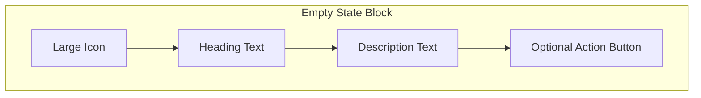
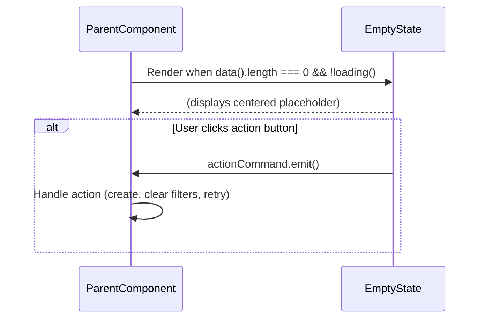

# Empty State Block

**Version:** 1.0.0
**Status:** [DOCUMENTED]

## Overview

The Empty State block is a centered placeholder displayed when a data container (table, list, card grid) has no content to show. It communicates why the area is empty and, when appropriate, guides the user toward a constructive action. It is used within List Page, Detail Page tabs, and Dashboard sections.

## When to Use

- A table or data view has zero records (initial state or after filtering)
- A tab panel within a Detail Page has no related items
- A dashboard section has no activity or data for the selected period
- A feature is being used for the first time and needs onboarding guidance

## When NOT to Use

- The data is still loading -- use Loading States pattern instead
- An error occurred during fetch -- use Error Handling pattern instead
- There is data to display (even a single row)

## Anatomy



## Variants

| Variant | Icon | Heading | Description | Action |
|---------|------|---------|-------------|--------|
| **No Data (initial)** | `pi pi-inbox` | No records yet | This area is empty. Create your first entry to get started. | Create button |
| **No Results (filtered)** | `pi pi-search` | No results found | No records match your current filters. Try adjusting your search or filters. | Clear Filters button |
| **Error State** | `pi pi-exclamation-triangle` | Something went wrong | We could not load this data. Please try again. | Retry button |
| **First-Time Use** | `pi pi-star` | Welcome! | Get started by creating your first [entity]. | Create / Learn More button |
| **No Activity** | `pi pi-clock` | No recent activity | There is no activity for the selected time period. | (none) |

## Components Used

| Component | PrimeNG Module | Import | Purpose |
|-----------|---------------|--------|---------|
| `p-button` | `ButtonModule` | `primeng/button` | Optional action button (Create, Clear Filters, Retry) |

The Empty State block is primarily a custom layout component. It does not wrap a single PrimeNG component but uses PrimeIcons and optionally a `p-button`.

## Layout

All breakpoints use the same centered layout. The block fills its parent container and centers content both horizontally and vertically.

```
          (parent container)
    +----------------------------+
    |                            |
    |        [Large Icon]        |
    |     No records found       |
    |  Try adjusting filters.    |
    |      [Clear Filters]       |
    |                            |
    +----------------------------+
```

### Desktop / Tablet / Mobile

No responsive variation needed -- the centered layout adapts naturally. On mobile, the text wraps within narrower constraints. Icon size may reduce slightly on very small screens.

## Required Signals

| Signal | Type | Purpose |
|--------|------|---------|
| `variant` | `input<'no-data' \| 'no-results' \| 'error' \| 'first-use' \| 'no-activity'>` | Determines icon, heading, description defaults |
| `icon` | `input<string>` | PrimeIcon class (overrides variant default) |
| `heading` | `input<string>` | Heading text (overrides variant default) |
| `description` | `input<string>` | Description text (overrides variant default) |
| `actionLabel` | `input<string>` | Optional button label |
| `actionCommand` | `output<void>` | Emitted when the action button is clicked |

## Data Flow



## Code Example

```html
<!-- Usage in a List Page -->
@if (!loading() && !error() && data().length === 0) {
  <div class="empty-state" role="status">
    <i class="pi pi-inbox empty-state-icon" aria-hidden="true"></i>
    <h3 class="empty-state-heading">No records found</h3>
    <p class="empty-state-description">
      Try adjusting your filters or create a new entry.
    </p>
    @if (actionLabel) {
      <p-button
        [label]="actionLabel"
        icon="pi pi-plus"
        (onClick)="actionCommand.emit()"
        [style]="{ 'min-height': 'var(--tp-touch-target-min-size)' }"
      />
    }
  </div>
}
```

```scss
.empty-state {
  display: flex;
  flex-direction: column;
  align-items: center;
  justify-content: center;
  padding: var(--tp-space-12) var(--tp-space-4);
  text-align: center;
  min-height: 240px;
}

.empty-state-icon {
  font-size: 3rem;
  color: var(--tp-text-muted);
  margin-block-end: var(--tp-space-4);
}

.empty-state-heading {
  margin: 0;
  font-size: 1.125rem;
  color: var(--tp-text-dark);
  margin-block-end: var(--tp-space-2);
}

.empty-state-description {
  margin: 0;
  color: var(--tp-text-muted);
  font-size: 0.875rem;
  max-width: 360px;
  margin-block-end: var(--tp-space-6);
}
```

## Tokens Used

| Token | Usage in This Block |
|-------|---------------------|
| `--tp-primary` | Action button background |
| `--tp-text-dark` | Heading text |
| `--tp-text-muted` | Icon color, description text |
| `--tp-space-2` | Gap between heading and description |
| `--tp-space-4` | Gap between icon and heading, horizontal padding |
| `--tp-space-6` | Gap between description and action button |
| `--tp-space-12` | Vertical padding for the empty state container |
| `--tp-touch-target-min-size` | Action button min height |

## Do / Don't

| Do | Don't |
|----|-------|
| Provide a clear, actionable description | Say "No data" with no further guidance |
| Include an action button when the user can resolve the empty state | Show an empty state with no way to proceed |
| Use a different variant for "no results after filtering" vs "no data at all" | Use the same generic message for all empty scenarios |
| Use large, recognizable PrimeIcons | Use tiny icons or no icon at all |
| Center the content vertically and horizontally | Align the empty state to the top-left |
| Match the tone to the context (welcoming for first-use, helpful for no-results) | Use error-style language for non-error empty states |

## Accessibility

| Requirement | Implementation |
|-------------|----------------|
| Status announcement | Container has `role="status"` so screen readers announce the empty state |
| Icon | `aria-hidden="true"` on decorative icon |
| Heading | Uses `<h3>` (appropriate level within parent context) |
| Action button | Descriptive label (e.g., "Create Tenant", not just "Create") |
| Touch target | Action button has min 44x44px hit area |
| Color contrast | Text colors meet AAA contrast (7:1) against `--tp-surface` background |
| Focus | If action button is present, it is focusable via Tab |
| RTL support | Text alignment uses `text-align: center` (same for both directions); spacing uses logical properties |
