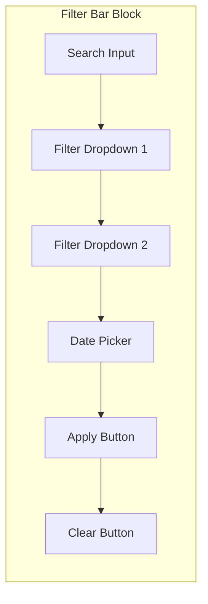
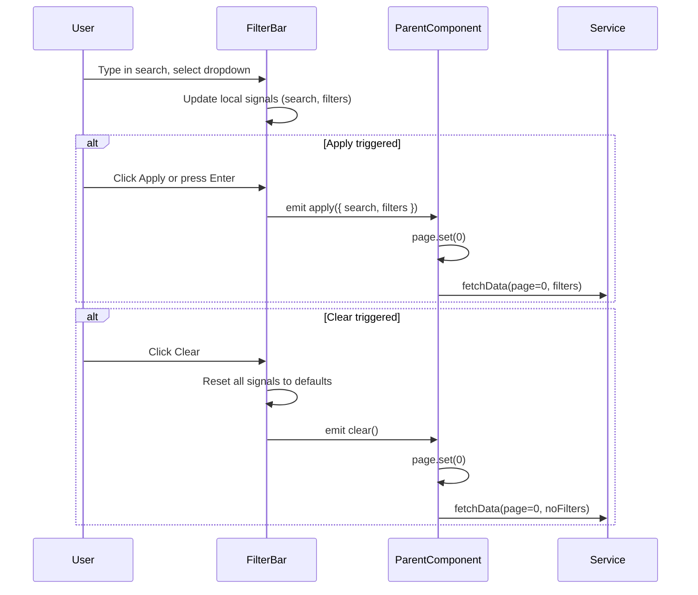

# Filter Bar Block

**Version:** 1.0.0
**Status:** [DOCUMENTED]

## Overview

The Filter Bar block is a reusable horizontal row of filter controls placed above a data table or data view. It provides a search input, dropdown filters, optional date pickers, and Apply/Clear action buttons. It is always used within a List Page block but can also appear in Dashboard and Settings Page blocks where filterable data is displayed.

## When to Use

- Above any `p-table` or `p-dataView` that supports server-side filtering
- When 2 or more filter criteria need to be applied together
- When the user needs an explicit Apply action (not auto-filter on each keystroke)
- When a Clear/Reset action is needed to restore default filters

## When NOT to Use

- Single search-only filtering -- use a standalone search input (Search pattern)
- Filtering fewer than 10 records -- client-side `p-table` built-in filtering suffices
- Date range selection as the only filter -- embed directly in the page header
- Form Page inputs -- those are data entry, not filtering

## Anatomy



## Components Used

| Component | PrimeNG Module | Import | Purpose |
|-----------|---------------|--------|---------|
| `p-inputText` / `p-iconField` | `InputTextModule` / `IconFieldModule` | `primeng/inputtext`, `primeng/iconfield` | Search text input with icon |
| `p-select` | `SelectModule` | `primeng/select` | Filter dropdowns (role, status, type) |
| `p-datePicker` | `DatePickerModule` | `primeng/datepicker` | Date range filter |
| `p-button` | `ButtonModule` | `primeng/button` | Apply and Clear buttons |
| `p-inputIcon` | `InputIconModule` | `primeng/inputicon` | Search icon inside input |

## Layout

### Desktop (> 1024px)

Single horizontal row. Search input (widest, flex-grow) followed by dropdown filters, date picker, Apply and Clear buttons. All items aligned in a flex row with wrapping disabled.

```
[pi-search | Search________________] [Role v] [Status v] [Date Range] [Apply] [Clear]
```

### Tablet (768px - 1024px)

Same horizontal row, but narrower inputs. If the row overflows, it wraps to a second line with the Apply and Clear buttons on the right.

### Mobile (< 768px)

Stacked layout. Search input takes full width. Dropdown filters wrap to the next line (two per row). Apply and Clear buttons span full width at the bottom.

## Required Signals

| Signal | Type | Purpose |
|--------|------|---------|
| `search` | `signal<string>` | Search text value |
| `filters` | `signal<Record<string, any>>` | Key-value map of active filter values |
| `activeFilterCount` | `computed<number>` | Count of non-empty filters for badge display |

### Outputs (EventEmitter or callback)

| Output | Type | Purpose |
|--------|------|---------|
| `apply` | `EventEmitter<FilterState>` | Emitted when user clicks Apply or presses Enter in search |
| `clear` | `EventEmitter<void>` | Emitted when user clicks Clear |

## Data Flow



## Code Example

```html
<div class="filter-bar" role="search" aria-label="Filter results">
  <p-iconField>
    <p-inputIcon styleClass="pi pi-search" />
    <input
      pInputText
      type="search"
      [ngModel]="search()"
      (ngModelChange)="search.set($event)"
      (keydown.enter)="onApply()"
      placeholder="Search..."
      aria-label="Search"
      [style]="{ 'min-height': 'var(--tp-touch-target-min-size)' }"
    />
  </p-iconField>

  <p-select
    [options]="roleOptions"
    [ngModel]="filters().role"
    (ngModelChange)="updateFilter('role', $event)"
    placeholder="All Roles"
    [showClear]="true"
    [style]="{ 'min-height': 'var(--tp-touch-target-min-size)', 'min-width': '140px' }"
  />

  <p-select
    [options]="statusOptions"
    [ngModel]="filters().status"
    (ngModelChange)="updateFilter('status', $event)"
    placeholder="All Status"
    [showClear]="true"
    [style]="{ 'min-height': 'var(--tp-touch-target-min-size)', 'min-width': '140px' }"
  />

  <p-button
    label="Apply"
    icon="pi pi-filter"
    (onClick)="onApply()"
    [style]="{ 'min-height': 'var(--tp-touch-target-min-size)' }"
  />

  <p-button
    label="Clear"
    icon="pi pi-times"
    severity="secondary"
    (onClick)="onClear()"
    [disabled]="activeFilterCount() === 0"
    [style]="{ 'min-height': 'var(--tp-touch-target-min-size)' }"
  />
</div>
```

```scss
.filter-bar {
  display: flex;
  flex-wrap: wrap;
  align-items: center;
  gap: var(--tp-space-2);
  padding: var(--tp-space-3);
  background: var(--tp-surface);
  border-radius: var(--tp-space-2);
  border: 1px solid var(--tp-border);

  @media (max-width: 768px) {
    flex-direction: column;
    align-items: stretch;

    > * {
      width: 100%;
    }
  }
}
```

## Tokens Used

| Token | Usage in This Block |
|-------|---------------------|
| `--tp-primary` | Apply button background |
| `--tp-surface` | Filter bar background |
| `--tp-text` | Input text, dropdown text |
| `--tp-border` | Input borders, bar border |
| `--tp-space-2` | Gap between filter controls, bar border-radius |
| `--tp-space-3` | Bar inner padding |
| `--tp-touch-target-min-size` | Minimum height for all controls (44px) |

## Do / Don't

| Do | Don't |
|----|-------|
| Use explicit Apply button to trigger filtering | Auto-filter on every keystroke (causes excessive API calls) |
| Allow Enter key in search input to trigger Apply | Require the user to click Apply after typing |
| Disable Clear button when no filters are active | Leave Clear always enabled (confusing when nothing to clear) |
| Reset page to 0 when applying new filters | Keep the current page when filters change (may return empty) |
| Use `p-select` with `[showClear]="true"` for resettable dropdowns | Use native `<select>` elements |
| Show an active filter count badge when filters are applied | Leave no indication that filters are active |
| Stack vertically on mobile | Force horizontal scroll on small screens |

## Accessibility

| Requirement | Implementation |
|-------------|----------------|
| Search landmark | Container has `role="search"` and `aria-label="Filter results"` |
| Input labels | Each input has `aria-label` or a visible `<label>` |
| Keyboard | Tab moves through controls; Enter in search triggers Apply |
| Clear state | Clear button has `aria-label="Clear all filters"` |
| Active filters | Announce active filter count via `aria-live="polite"` region |
| Touch targets | All controls have min 44x44px hit area |
| Focus indicators | Visible 3px focus ring on all interactive elements |
| RTL support | Flex layout respects logical direction; icons flip as needed |
