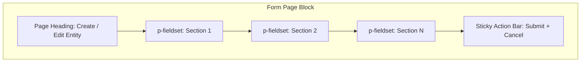
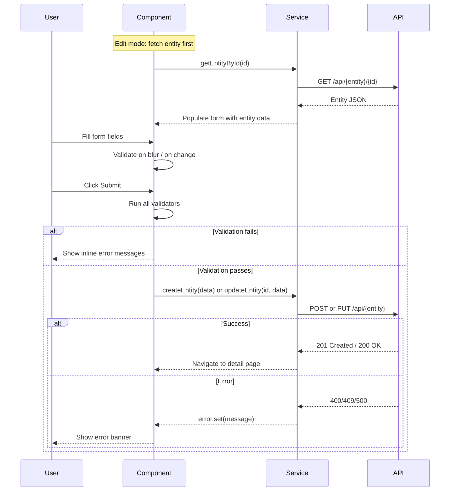

# Form Page Block

**Version:** 1.0.0
**Status:** [DOCUMENTED]

## Overview

The Form Page block provides the standard layout for creating or editing an entity. It uses a page heading, one or more `p-fieldset` groups to organize form fields into logical sections, PrimeNG input components for data entry, inline validation messages, and a sticky bottom action bar with Submit and Cancel buttons.

## When to Use

- Creating a new entity (tenant, user, definition, license)
- Editing an existing entity's properties
- Multi-section forms that benefit from grouped fields
- Forms requiring client-side and server-side validation

## When NOT to Use

- Simple inline filters -- use Filter Bar block instead
- Wizard-style multi-step flows -- consider a stepper component
- Read-only entity display -- use Detail Page block instead
- Bulk data entry -- consider a spreadsheet-style grid

## Anatomy



## Components Used

| Component | PrimeNG Module | Import | Purpose |
|-----------|---------------|--------|---------|
| `p-fieldset` | `FieldsetModule` | `primeng/fieldset` | Collapsible form section group |
| `p-inputText` | `InputTextModule` | `primeng/inputtext` | Single-line text input |
| `p-textArea` | `TextareaModule` | `primeng/textarea` | Multi-line text input |
| `p-select` | `SelectModule` | `primeng/select` | Dropdown selection |
| `p-multiSelect` | `MultiSelectModule` | `primeng/multiselect` | Multi-value dropdown |
| `p-inputNumber` | `InputNumberModule` | `primeng/inputnumber` | Numeric input |
| `p-datePicker` | `DatePickerModule` | `primeng/datepicker` | Date input |
| `p-toggleSwitch` | `ToggleSwitchModule` | `primeng/toggleswitch` | Boolean toggle |
| `p-message` | `MessageModule` | `primeng/message` | Validation and error messages |
| `p-button` | `ButtonModule` | `primeng/button` | Submit and Cancel actions |

## Layout

### Desktop (> 1024px)

Two-column form grid within each fieldset. Labels above fields. Fieldsets stack vertically. Sticky action bar at the bottom of the viewport.

```
+----------------------------------------------------------+
| Create Tenant                                              |
+----------------------------------------------------------+
| General Information                                        |
|  [Name_______________]    [Domain_____________]           |
|  [Owner Email________]    [Plan ___v__________]           |
+----------------------------------------------------------+
| Configuration                                              |
|  [Max Users___]           [Timezone ___v______]           |
|  [Language ___v]          [Active ____toggle___]          |
+----------------------------------------------------------+
|                              [Cancel]  [Save]   <sticky>  |
+----------------------------------------------------------+
```

### Tablet (768px - 1024px)

Same two-column layout but with tighter spacing. Fieldsets remain collapsible.

### Mobile (< 768px)

Single-column layout. All fields stack vertically. Fieldsets remain collapsible. Action bar remains sticky at viewport bottom.

## Required Signals

| Signal | Type | Purpose |
|--------|------|---------|
| `formData` | `signal<T>` | The form model (or use Reactive Forms `FormGroup`) |
| `loading` | `signal<boolean>` | Whether submission is in progress |
| `error` | `signal<string \| null>` | Server-side error message |
| `isEditMode` | `signal<boolean>` | Create vs. Edit mode |
| `dirty` | `signal<boolean>` | Whether the form has unsaved changes |

### Validation Approach

- **Complex forms:** Use Angular Reactive Forms (`FormGroup`, `FormControl`, `Validators`) for cross-field validation, async validators, and form arrays.
- **Simple forms:** Use signal-based state with manual validation for lightweight filters or settings.

## Data Flow



## Code Example

```html
<div class="form-page">
  <h2>{{ isEditMode() ? 'Edit' : 'Create' }} Tenant</h2>

  @if (error()) {
    <p-message severity="error" [text]="error()" role="alert" />
  }

  <form [formGroup]="form" (ngSubmit)="onSubmit()">
    <p-fieldset legend="General Information" [toggleable]="true">
      <div class="form-grid">
        <div class="form-field">
          <label for="name">Name</label>
          <input pInputText id="name" formControlName="name" />
          @if (form.controls['name'].invalid && form.controls['name'].touched) {
            <small class="field-error" role="alert">Name is required.</small>
          }
        </div>
        <div class="form-field">
          <label for="domain">Domain</label>
          <input pInputText id="domain" formControlName="domain" />
        </div>
      </div>
    </p-fieldset>

    <div class="form-actions">
      <p-button
        label="Cancel"
        severity="secondary"
        (onClick)="onCancel()"
        [style]="{ 'min-height': 'var(--tp-touch-target-min-size)' }"
      />
      <p-button
        label="Save"
        type="submit"
        [loading]="loading()"
        [disabled]="form.invalid || loading()"
        [style]="{ 'min-height': 'var(--tp-touch-target-min-size)' }"
      />
    </div>
  </form>
</div>
```

```scss
.form-grid {
  display: grid;
  grid-template-columns: 1fr 1fr;
  gap: var(--tp-space-4);

  @media (max-width: 768px) {
    grid-template-columns: 1fr;
  }
}

.form-field {
  display: flex;
  flex-direction: column;
  gap: var(--tp-space-1);
}

.form-field label {
  font-weight: 600;
  color: var(--tp-text-dark);
  font-size: 0.875rem;
}

.field-error {
  color: var(--tp-danger);
  font-size: 0.8rem;
}

.form-actions {
  position: sticky;
  inset-block-end: 0;
  display: flex;
  justify-content: flex-end;
  gap: var(--tp-space-3);
  padding: var(--tp-space-4);
  background: var(--tp-surface);
  border-block-start: 1px solid var(--tp-border);
}
```

## Tokens Used

| Token | Usage in This Block |
|-------|---------------------|
| `--tp-primary` | Submit button background |
| `--tp-surface` | Action bar background, page background |
| `--tp-text` | Input text color |
| `--tp-text-dark` | Labels, fieldset legend |
| `--tp-border` | Input borders, fieldset borders, action bar divider |
| `--tp-danger` | Validation error text, error message severity |
| `--tp-space-1` | Gap between label and input |
| `--tp-space-3` | Gap between action bar buttons |
| `--tp-space-4` | Form grid gap, action bar padding |
| `--tp-touch-target-min-size` | Minimum button height (44px) |

## Do / Don't

| Do | Don't |
|----|-------|
| Use `p-fieldset` to group related fields | Place all fields in a single flat list |
| Validate on blur for each field, full validation on submit | Validate only on submit (delayed feedback) |
| Show inline errors below the invalid field | Show all errors in a single banner at the top only |
| Mark required fields with a visible indicator | Omit required indicators and rely on validation alone |
| Use a sticky action bar so Submit is always reachable | Place Submit at the bottom of a long scrolling form |
| Warn before navigating away with unsaved changes | Silently discard unsaved form data |
| Use Reactive Forms for complex multi-section forms | Use template-driven forms for complex validation |
| Pre-populate fields in edit mode from the entity data | Start with empty fields in edit mode |

## Accessibility

| Requirement | Implementation |
|-------------|----------------|
| Labels | Every input has a visible `<label>` with matching `for` / `id` |
| Required fields | `aria-required="true"` on required inputs |
| Validation errors | `aria-describedby` links input to error message element; error has `role="alert"` |
| Fieldset grouping | `<p-fieldset>` renders `<fieldset>` + `<legend>` for screen readers |
| Submit button | Disabled when form is invalid; `aria-disabled="true"` communicated |
| Keyboard | Tab order follows visual order; Enter submits form |
| Focus management | On validation failure, focus moves to first invalid field |
| Touch targets | All buttons and inputs have min 44px height |
| RTL support | Form grid uses logical properties; labels align to `inline-start` |
