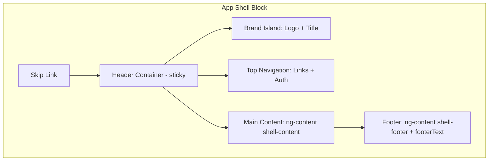
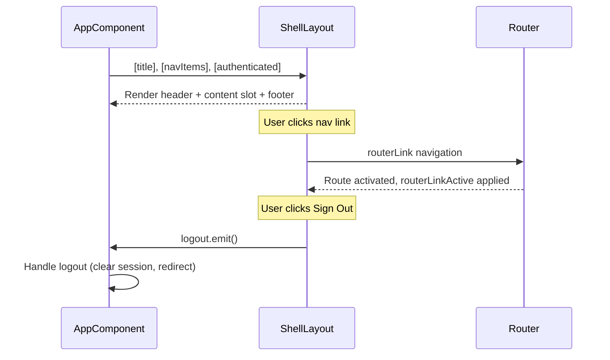

# Header / App Shell Block -- [DOCUMENTED]

**Version:** 1.0.0
**Status:** [DOCUMENTED] -- `ShellLayoutComponent` is the single owner of the universal top header, and pages project page-specific controls into it.

## Evidence

**Component:** `frontend/src/app/layout/shell-layout/shell-layout.component.ts`
**Template:** `frontend/src/app/layout/shell-layout/shell-layout.component.html`
**Styles:** `frontend/src/app/layout/shell-layout/shell-layout.component.scss`

### What EXISTS (verified 2026-03-22):

- **ShellLayoutComponent** owns the universal top header, content slot, and footer
- **Header projection slots** exist for `shell-header-leading`, `shell-header-trailing`, and `shell-header-actions`
- **Administration page uses the shared shell** instead of rendering a separate page-owned top header
- **Brand/title island** uses shared shell markup and tokenized typography
- **Default top navigation/auth actions** still render when `showDefaultHeaderActions` is enabled
- **Skip link**, **content slot**, and **footer slot** remain implemented
- **Touch targets** and **focus indicators** are tokenized
- **Canonical visual reference:** [component-showcase.html](../component-showcase.html)

### What does NOT exist:

- No `p-avatar` component for user profile
- No tenant badge component
- No `p-menubar` / `p-sidebar` responsive shell implementation

## Overview

The Header / App Shell block is the outermost layout wrapper for the entire application. It provides the only top-level header, page title context, projected page actions, primary navigation/auth actions, a main content area, and a footer.

## When to Use

- Always -- this block wraps the entire application
- It is the root layout component used by the Angular router outlet

## When NOT to Use

- Chromeless authentication flows that intentionally suppress header actions
- Embedded views within iframes

## Anatomy



## Components Used (Current Implementation)

| Component | Source | Purpose |
|-----------|--------|---------|
| `RouterLink` | `@angular/router` | Navigation links |
| `RouterLinkActive` | `@angular/router` | Active route highlighting |
| `` | Native HTML | Logo image |
| `<button>` | Native HTML | Sign Out button |

### Planned PrimeNG Additions [PLANNED]

| Component | PrimeNG Module | Import | Purpose |
|-----------|---------------|--------|---------|
| `p-avatar` | `AvatarModule` | `primeng/avatar` | User profile avatar |
| `p-badge` | `BadgeModule` | `primeng/badge` | Notification count |
| `p-menubar` | `MenubarModule` | `primeng/menubar` | Responsive navigation with hamburger |
| `p-sidebar` | `SidebarModule` | `primeng/sidebar` | Mobile slide-out navigation |

## Layout

### Desktop (> 1024px)

Sticky header with two neumorphic islands side by side: brand island (logo + title) on the left, navigation island (links + auth button) on the right. Content below in a max-width container (1200px).

### Tablet (768px - 1024px)

Same layout as desktop. Navigation links wrap if needed (flex-wrap is enabled).

### Mobile (< 768px) [IMPLEMENTED]

Header switches to column layout (`flex-direction: column`). Brand island takes full width. Nav links wrap below. Reduced padding. Font sizes slightly smaller.

### Mobile (< 768px) [PLANNED -- not yet implemented]

Replace horizontal nav links with a hamburger menu triggering `p-sidebar` for slide-out navigation.

## Inputs and Outputs

| Name | Type | Direction | Purpose |
|------|------|-----------|---------|
| `title` | `string` | `@Input` (required) | App title shown in brand block |
| `subtitle` | `string` | `@Input` | Optional subtitle below title |
| `footerText` | `string` | `@Input` | Optional footer text |
| `navItems` | `readonly ShellNavItem[]` | `@Input` | Navigation items with label, route, exact flag |
| `authenticated` | `boolean` | `@Input` | Controls Sign In vs Sign Out display |
| `logout` | `EventEmitter<void>` | `@Output` | Emitted when Sign Out is clicked |

### ShellNavItem Interface

```typescript
export interface ShellNavItem {
  readonly label: string;
  readonly route: string;
  readonly exact?: boolean;
}
```

## Data Flow



## Code Example (Current Implementation)

```html
<app-shell-layout
  [title]="'ThinkPLUS Administration'"
  [subtitle]="'Tenant Management Portal'"
  [navItems]="navItems"
  [authenticated]="isAuthenticated()"
  (logout)="onLogout()"
>
  <div shell-content>
    <router-outlet />
  </div>
  <div shell-footer>
    <span>ThinkPLUS v1.0.0</span>
  </div>
</app-shell-layout>
```

## Tokens Used

| Token | Status | Usage in This Block |
|-------|--------|---------------------|
| `--tp-text` | [IMPLEMENTED] | Body text color via `.app-shell { color: var(--tp-text) }` |
| `--tp-bg` | [IMPLEMENTED] | Background with fallback `var(--tp-bg, #edebe0)` |
| `--tp-text-secondary` | [IMPLEMENTED] | Subtitle text color |
| `--tp-text-muted` | [IMPLEMENTED] | Footer text color |
| `--tp-primary` | [IMPLEMENTED] | Active nav link gradient, hover/focus background |
| `--tp-primary-dark` | [IMPLEMENTED] | Active nav link gradient end, focus outline |
| `--tp-touch-target-min-size` | [IMPLEMENTED] | Nav link and button min-height |
| `--tp-pattern-opacity` | [IMPLEMENTED] | Background pattern overlay opacity |
| `--tp-surface` | NOT YET USED | Should replace hardcoded `#edebe0` |
| `--tp-border` | Border color | Subtle neutral structural border |

### Token Migration [IMPLEMENTED — 2026-03-12]

All hardcoded hex values in `shell-layout.component.scss` have been migrated to `var(--tp-*)` token references. Neumorphic shadow `rgba()` values remain as-is (part of the neumorphic design system, not semantic colors).

## Do / Don't

| Do | Don't |
|----|-------|
| Keep the skip link as the first focusable element | Remove or hide the skip link |
| Use `routerLinkActive` for active route highlighting | Manually track active routes |
| Emit logout event and let the parent handle auth logic | Handle authentication directly in the shell |
| Use content projection (`ng-content`) for page content | Hard-code page content inside the shell |
| Use `@media (hover: hover)` guard for hover-only styles | Apply hover styles without media query guard |
| Migrate hardcoded hex values to `--tp-*` tokens | Add more hardcoded values |

## Accessibility

| Requirement | Status | Implementation |
|-------------|--------|----------------|
| Skip link | [IMPLEMENTED] | `<a class="skip-link" href="#main-content">Skip to main content</a>` |
| Main landmark | [IMPLEMENTED] | `<main id="main-content" tabindex="-1">` |
| Nav landmark | [IMPLEMENTED] | `<nav aria-label="Primary navigation">` |
| Logo link | [IMPLEMENTED] | `aria-label="ThinkPLUS Home"` on brand logo link |
| Focus indicators | [IMPLEMENTED] | 3px solid outline on focus-visible for all interactive elements |
| Touch targets | [IMPLEMENTED] | `min-height: var(--tp-touch-target-min-size, 44px)` on nav links and buttons |
| Hover guard | [IMPLEMENTED] | `@media (hover: hover) and (pointer: fine)` wraps hover styles |
| Color contrast | PARTIAL | Active link uses white-on-green (needs AAA verification) |
| RTL support | PARTIAL | Uses logical properties (`inset-inline-start`, `padding-inline`) in skip link and containers; some hardcoded values remain |
