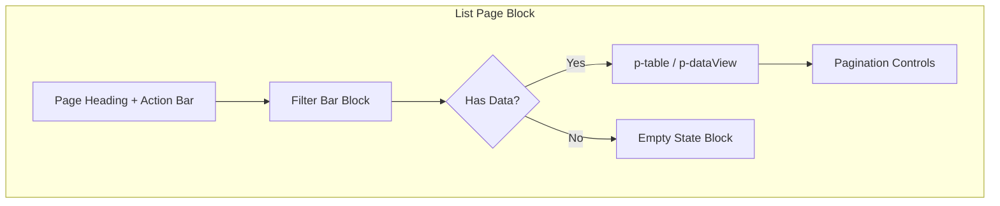
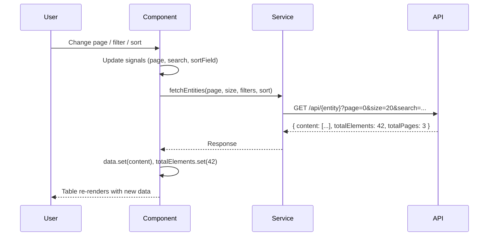

# List Page Block

**Version:** 1.0.0
**Status:** [DOCUMENTED]
**Existing Evidence:** `user-embedded.component` at `frontend/src/app/features/admin/users/` uses `p-table` with signals for data, loading, error, pagination, and sorting.

## Overview

The List Page block is the standard layout for displaying collections of entities in a paginated, filterable table. It combines a Filter Bar (block ref), a data table (`p-table` or `p-dataView`), pagination controls, and an Empty State (block ref) when no records match.

Use this block whenever the user needs to browse, search, filter, and act on a list of domain objects (users, tenants, definitions, licenses, audit entries).

## When to Use

- Displaying a paginated collection of entities from an API
- Allowing the user to search, filter, and sort records
- Providing row-level actions (view detail, edit, delete, sessions)
- Showing summary counts (total records, active filters)

## When NOT to Use

- Displaying a single entity with tabs and sections -- use Detail Page instead
- Showing a create/edit form -- use Form Page instead
- Presenting KPI cards and charts -- use Dashboard instead
- Displaying fewer than 5 static items -- use a simple list or card grid instead

## Anatomy



## Components Used

| Component | PrimeNG Module | Import | Purpose |
|-----------|---------------|--------|---------|
| `p-table` | `TableModule` | `primeng/table` | Data table with lazy loading, sorting, selection |
| `p-dataView` | `DataViewModule` | `primeng/dataview` | Card-based view for mobile breakpoint |
| `p-paginator` | `PaginatorModule` | `primeng/paginator` | Page navigation (alternative to built-in table paginator) |
| `p-tag` | `TagModule` | `primeng/tag` | Status badges (active/inactive, severity) |
| `p-button` | `ButtonModule` | `primeng/button` | Action buttons (Apply, Reset, Refresh, row actions) |
| `p-progressSpinner` | `ProgressSpinnerModule` | `primeng/progressspinner` | Loading indicator |
| `p-message` | `MessageModule` | `primeng/message` | Error banner |
| `p-card` | `CardModule` | `primeng/card` | Table container card |

### Key `p-table` Props

| Prop | Value | Purpose |
|------|-------|---------|
| `[value]` | `data()` signal | Bound to the data signal |
| `[lazy]` | `true` | Server-side pagination and sorting |
| `(onLazyLoad)` | `onLazyLoad($event)` | Triggers data fetch on page/sort change |
| `[loading]` | `loading()` | Shows built-in loading overlay |
| `[paginator]` | `true` | Enables built-in paginator (or use external `p-paginator`) |
| `[rows]` | `pageSize()` | Rows per page |
| `[totalRecords]` | `totalElements()` | Total count for paginator |
| `[rowsPerPageOptions]` | `[10, 20, 50, 100]` | Page size selector |
| `[sortField]` | `sortField()` | Current sort column |
| `[sortOrder]` | `sortOrder()` | 1 = ascending, -1 = descending |

## Layout

### Desktop (> 1024px)

Full-width table with all columns visible. Filter bar spans the full width above the table. Pagination below.

```
+----------------------------------------------------------+
| Page Title                              [+ Create] button |
+----------------------------------------------------------+
| [Search___________] [Role v] [Status v] [Apply] [Reset]  |
+----------------------------------------------------------+
| Name | Email | Role | Status | Last Active | Actions     |
|------|-------|------|--------|-------------|-------------|
| ...  | ...   | ...  | ...    | ...         | [Sessions]  |
+----------------------------------------------------------+
| 42 users  Page 1 of 3    [< Prev] [1] [2] [3] [Next >]  |
+----------------------------------------------------------+
```

### Tablet (768px - 1024px)

Hide low-priority columns (Last Active, Email). Filter bar wraps to two rows if needed.

### Mobile (< 768px)

Switch from `p-table` to `p-dataView` with card layout. Each entity renders as a card showing Name, Role, Status, and an action button. Filter bar stacks vertically. Pagination simplified to Prev/Next only.

## Required Signals

| Signal | Type | Purpose |
|--------|------|---------|
| `data` | `signal<T[]>` | Current page of entities |
| `loading` | `signal<boolean>` | Whether a fetch is in progress |
| `error` | `signal<string \| null>` | Error message from API |
| `page` | `signal<number>` | Current page index (0-based) |
| `pageSize` | `signal<number>` | Rows per page |
| `totalElements` | `signal<number>` | Total entity count from API |
| `totalPages` | `signal<number>` | Computed total pages |
| `sortField` | `signal<string>` | Column key to sort by |
| `sortDirection` | `signal<'asc' \| 'desc'>` | Sort direction |
| `search` | `signal<string>` | Search text filter |

## Data Flow



## Code Example

```html
<section class="list-page">
  <div class="page-header">
    <h2>{{ pageTitle }}</h2>
    <p-button
      label="Create"
      icon="pi pi-plus"
      (onClick)="onCreate()"
      [style]="{ 'min-height': 'var(--tp-touch-target-min-size)' }"
    />
  </div>

  <!-- Filter Bar (see filter-bar.md) -->
  <app-filter-bar
    [filters]="filterConfig"
    (apply)="applyFilters($event)"
    (clear)="resetFilters()"
  />

  @if (error()) {
    <p-message severity="error" [text]="error()" role="alert" />
  }

  @if (!error() && data().length === 0 && !loading()) {
    <!-- Empty State (see empty-state.md) -->
    <app-empty-state
      icon="pi pi-inbox"
      heading="No records found"
      description="Try adjusting your filters or create a new entry."
      [action]="{ label: 'Create', command: onCreate }"
    />
  }

  <p-table
    [value]="data()"
    [lazy]="true"
    (onLazyLoad)="onLazyLoad($event)"
    [loading]="loading()"
    [paginator]="true"
    [rows]="pageSize()"
    [totalRecords]="totalElements()"
    [rowsPerPageOptions]="[10, 20, 50, 100]"
    [sortField]="sortField()"
    [sortOrder]="sortDirection() === 'asc' ? 1 : -1"
    [pt]="{ root: { style: 'border-radius: var(--tp-space-3)' } }"
  >
    <!-- Column templates -->
  </p-table>
</section>
```

## Tokens Used

| Token | Usage in This Block |
|-------|---------------------|
| `--tp-primary` | Action button backgrounds, active sort column |
| `--tp-surface` | Table card background |
| `--tp-text` | Table body text |
| `--tp-text-dark` | Page heading, column headers |
| `--tp-border` | Table row dividers, card border |
| `--tp-danger` | Error message severity |
| `--tp-success` | Active status tag |
| `--tp-space-3` | Inner cell padding |
| `--tp-space-4` | Gap between filter bar and table |
| `--tp-space-6` | Page section padding |
| `--tp-touch-target-min-size` | Minimum button/link hit area (44px) |

## Do / Don't

| Do | Don't |
|----|-------|
| Use `[lazy]="true"` for server-side pagination | Load all records client-side and paginate in memory |
| Provide a loading indicator via the `loading` signal | Leave the table blank during fetches |
| Show an Empty State block when `data().length === 0` | Show an empty table with no guidance |
| Use `p-tag` for status badges with semantic severity | Use colored text without a tag for status |
| Hide low-priority columns on tablet via CSS `display: none` | Horizontally scroll the full table on tablet |
| Switch to card view (`p-dataView`) on mobile | Force the table layout on small screens |
| Use `aria-label` on icon-only action buttons | Rely on icon alone without accessible name |
| Apply filters on explicit button click or Enter key | Auto-filter on every keystroke (performance) |

## Accessibility

| Requirement | Implementation |
|-------------|----------------|
| Keyboard navigation | Tab through filter inputs, table headers (sortable), pagination buttons |
| Sort announcement | `aria-sort="ascending"` or `aria-sort="descending"` on active `<th>` |
| Loading state | `aria-busy="true"` on table container while loading |
| Error announcement | `role="alert"` on `p-message` error banner |
| Empty state | Descriptive text with optional action button; focusable |
| Touch targets | All buttons and links have min 44x44px hit area (`--tp-touch-target-min-size`) |
| Color contrast | Status tags use text + background combinations meeting AAA (7:1) ratio |
| Screen reader | `.sr-only` text for icon-only buttons (e.g., "View sessions for John") |
| Focus indicators | Visible 3px focus ring on all interactive elements |
| RTL support | Use logical properties (`padding-inline-start`, `margin-inline-end`) |
