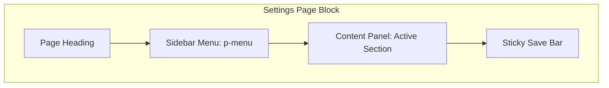
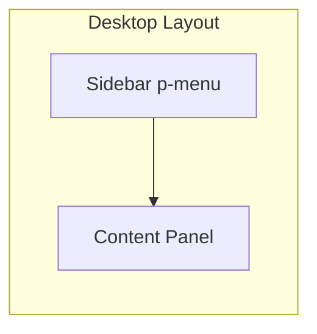
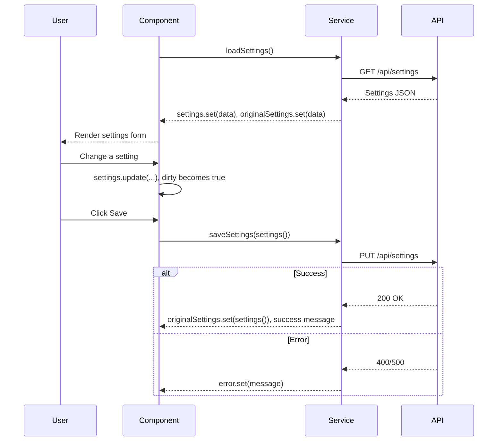

# Settings Page Block

**Version:** 1.0.0
**Status:** [DOCUMENTED]

## Overview

The Settings Page block provides the standard layout for configuration screens. It features a sidebar navigation menu listing setting categories, a right-side content panel showing the active section's controls, and a sticky save bar at the bottom. This block is used for tenant settings, user preferences, system configuration, and feature-level settings.

## When to Use

- Tenant configuration (branding, locale, security policies)
- User preferences (notifications, display, language)
- System administration (email templates, integrations, API keys)
- Feature-level settings (definition management config, audit retention)

## When NOT to Use

- Editing a single entity -- use Form Page instead
- Viewing entity details -- use Detail Page instead
- Browsing entity collections -- use List Page instead
- Overview summaries -- use Dashboard instead

## Anatomy





## Components Used

| Component | PrimeNG Module | Import | Purpose |
|-----------|---------------|--------|---------|
| `p-menu` | `MenuModule` | `primeng/menu` | Sidebar navigation for settings categories |
| `p-card` | `CardModule` | `primeng/card` | Section content container |
| `p-fieldset` | `FieldsetModule` | `primeng/fieldset` | Grouping related settings |
| `p-toggleSwitch` | `ToggleSwitchModule` | `primeng/toggleswitch` | Boolean settings |
| `p-select` | `SelectModule` | `primeng/select` | Dropdown settings |
| `p-inputText` | `InputTextModule` | `primeng/inputtext` | Text settings |
| `p-inputNumber` | `InputNumberModule` | `primeng/inputnumber` | Numeric settings |
| `p-button` | `ButtonModule` | `primeng/button` | Save and Cancel buttons |
| `p-message` | `MessageModule` | `primeng/message` | Success/error feedback |
| `p-accordion` | `AccordionModule` | `primeng/accordion` | Mobile alternative to sidebar sections |

## Layout

### Desktop (> 1024px)

Two-column layout: left sidebar (`p-menu`, ~250px width) with settings categories, right content panel occupying remaining width. Sticky save bar at the bottom spanning the full content area.

```
+----------------------------------------------------------+
| Settings                                                   |
+----------------------------------------------------------+
| [General]        | General Settings                       |
| [Security]       |  Organization Name: [__________]       |
| [Notifications]  |  Default Language:  [English v]        |
| [Integrations]   |  Timezone:          [UTC+4 v]          |
| [Advanced]       |  Dark Mode:         [toggle]           |
+----------------------------------------------------------+
|                              [Cancel]  [Save]   <sticky>  |
+----------------------------------------------------------+
```

### Tablet (768px - 1024px)

Sidebar collapses to a horizontal tab strip or a collapsible menu. Content panel takes full width below.

### Mobile (< 768px)

Replace sidebar with `p-accordion`. Each settings category becomes an accordion panel. Save bar remains sticky at the bottom.

## Required Signals

| Signal | Type | Purpose |
|--------|------|---------|
| `activeSection` | `signal<string>` | Currently selected settings category |
| `settings` | `signal<SettingsModel>` | Current settings values |
| `originalSettings` | `signal<SettingsModel>` | Original values for dirty detection |
| `loading` | `signal<boolean>` | Whether settings are being loaded or saved |
| `dirty` | `computed<boolean>` | Whether any setting has changed from original |
| `error` | `signal<string \| null>` | Save error message |
| `success` | `signal<string \| null>` | Save success message |

## Data Flow



## Code Example

```html
<div class="settings-page">
  <h2>Settings</h2>

  <div class="settings-layout">
    <aside class="settings-sidebar">
      <p-menu [model]="menuItems()" (click)="onMenuSelect($event)" />
    </aside>

    <section class="settings-content">
      @switch (activeSection()) {
        @case ('general') {
          <p-card>
            <h3>General Settings</h3>
            <div class="settings-field">
              <label for="orgName">Organization Name</label>
              <input
                pInputText
                id="orgName"
                [ngModel]="settings().orgName"
                (ngModelChange)="updateSetting('orgName', $event)"
              />
            </div>
            <div class="settings-field">
              <label for="timezone">Timezone</label>
              <p-select
                id="timezone"
                [options]="timezones"
                [ngModel]="settings().timezone"
                (ngModelChange)="updateSetting('timezone', $event)"
              />
            </div>
          </p-card>
        }
        @case ('security') {
          <!-- Security settings panel -->
        }
      }
    </section>
  </div>

  <div class="settings-save-bar" [class.visible]="dirty()">
    <p-message severity="warn" text="You have unsaved changes." />
    <div class="save-actions">
      <p-button
        label="Cancel"
        severity="secondary"
        (onClick)="revert()"
        [style]="{ 'min-height': 'var(--tp-touch-target-min-size)' }"
      />
      <p-button
        label="Save"
        [loading]="loading()"
        (onClick)="save()"
        [style]="{ 'min-height': 'var(--tp-touch-target-min-size)' }"
      />
    </div>
  </div>
</div>
```

```scss
.settings-layout {
  display: grid;
  grid-template-columns: 250px 1fr;
  gap: var(--tp-space-6);

  @media (max-width: 768px) {
    grid-template-columns: 1fr;
  }
}

.settings-save-bar {
  position: sticky;
  inset-block-end: 0;
  display: flex;
  justify-content: space-between;
  align-items: center;
  padding: var(--tp-space-3) var(--tp-space-4);
  background: var(--tp-surface);
  border-block-start: 1px solid var(--tp-border);
}

.settings-field {
  display: flex;
  flex-direction: column;
  gap: var(--tp-space-1);
  margin-block-end: var(--tp-space-4);
}
```

## Tokens Used

| Token | Usage in This Block |
|-------|---------------------|
| `--tp-primary` | Save button, active menu item |
| `--tp-surface` | Page background, save bar background |
| `--tp-surface-raised` | Card backgrounds |
| `--tp-text` | Setting labels and values |
| `--tp-text-dark` | Section headings |
| `--tp-border` | Card borders, save bar divider, sidebar border |
| `--tp-warning` | Unsaved changes message |
| `--tp-success` | Save success message |
| `--tp-danger` | Save error message |
| `--tp-space-1` | Label-to-input gap |
| `--tp-space-4` | Field bottom margin, save bar padding |
| `--tp-space-6` | Grid gap between sidebar and content |
| `--tp-touch-target-min-size` | Save/Cancel button height |

## Do / Don't

| Do | Don't |
|----|-------|
| Track dirty state and show save bar only when changes exist | Always show the save bar, even when nothing changed |
| Warn before navigating away with unsaved changes | Silently discard changes on navigation |
| Show success feedback after save | Leave the user unsure whether save succeeded |
| Use `p-accordion` on mobile as a sidebar replacement | Force the sidebar layout on mobile screens |
| Group related settings with headings or `p-fieldset` | List all settings in a flat, unstructured list |
| Load settings on component init and cache until saved | Refetch settings on every section switch |

## Accessibility

| Requirement | Implementation |
|-------------|----------------|
| Sidebar navigation | `p-menu` has `role="menu"` and `role="menuitem"` for each item |
| Section landmark | Content panel wrapped in `<section>` with `aria-label` |
| Active section | Active menu item has `aria-current="true"` |
| Dirty state | Save bar appears with `role="status"` for unsaved changes message |
| Keyboard | Tab moves between sidebar items and content fields; Enter activates menu items |
| Focus management | When switching sections, focus moves to section heading |
| Touch targets | All interactive elements have min 44x44px hit area |
| RTL support | Grid layout uses logical properties; menu aligns to `inline-start` |
