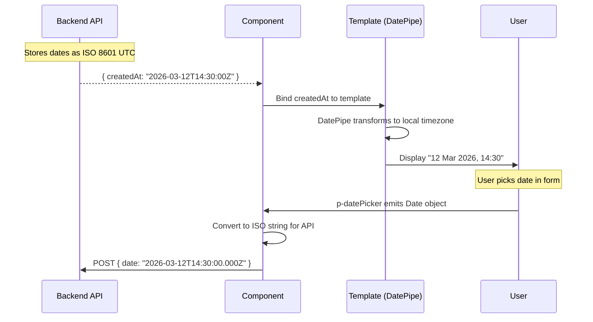

# Date/Time Pattern

**Status:** [DOCUMENTED]
**Version:** 1.0.0
**Date:** 2026-03-12

## Problem

Two date formatting approaches coexist in the same component. In `user-embedded.component.ts` (lines 255-265), the `lastActive()` method uses `parsed.toLocaleString()` for date display. Meanwhile, in `user-embedded.component.html` (lines 308-310), the sessions dialog uses Angular `DatePipe` with format `'dd MMM y, HH:mm'`. This inconsistency means dates look different within the same screen.

**Codebase evidence:**

- `frontend/src/app/features/admin/users/user-embedded.component.ts:255-265` -- `lastActive()` uses `new Date(user.lastLoginAt).toLocaleString()` (locale-dependent, inconsistent format)
- `frontend/src/app/features/admin/users/user-embedded.component.html:308` -- `{{ s.createdAt | date: 'dd MMM y, HH:mm' }}` (explicit format via DatePipe)
- `frontend/src/app/features/admin/users/user-embedded.component.html:309` -- `{{ s.lastActivity | date: 'dd MMM y, HH:mm' }}` (consistent with line 308)
- `frontend/src/app/features/admin/users/user-embedded.component.html:310` -- `{{ s.expiresAt | date: 'dd MMM y, HH:mm' }}` (consistent with line 308)

## Specification

| Aspect | Standard |
|--------|----------|
| Display format | `dd MMM y, HH:mm` (e.g., "12 Mar 2026, 14:30") |
| Storage format | ISO 8601: `YYYY-MM-DDTHH:mm:ssZ` (UTC) |
| Pipe | Angular `DatePipe` -- always use the pipe, never format manually |
| Date picker | `p-datePicker` with `dateFormat="dd M yy"` |
| Time zone | Display in user's local timezone (DatePipe default) |
| Null/missing | Display "---" (em dash) for null dates, never "Invalid Date" |
| Relative time | Not used in tables; acceptable in cards or timeline views |

### Format Reference

| Context | Format String | Example Output |
|---------|--------------|----------------|
| Table cells, detail fields | `'dd MMM y, HH:mm'` | 12 Mar 2026, 14:30 |
| Date only (no time) | `'dd MMM y'` | 12 Mar 2026 |
| Time only | `'HH:mm'` | 14:30 |
| Full with seconds | `'dd MMM y, HH:mm:ss'` | 12 Mar 2026, 14:30:45 |
| ISO for API payload | `toISOString()` | 2026-03-12T14:30:00.000Z |

## Component

- Angular `DatePipe` -- For display in templates
- `p-datePicker` -- For date input/selection (PrimeNG)
- `DatePickerModule` import

### p-datePicker Properties

| Property | Value | Description |
|----------|-------|-------------|
| `dateFormat` | `"dd M yy"` | PrimeNG date format (different syntax from DatePipe) |
| `[showTime]` | `true` (when time needed) | Show time picker |
| `hourFormat` | `"24"` | 24-hour format |
| `[showIcon]` | `true` | Calendar icon trigger |
| `[showClear]` | `true` | Clear button |
| `appendTo` | `"body"` | Append overlay to body (avoid clipping) |

## Data Flow



## Code Example

### Template -- Display (DatePipe)

```html
<!-- Standard date-time display -->
<td>{{ item.createdAt | date: 'dd MMM y, HH:mm' }}</td>

<!-- Date only -->
<span>{{ item.dueDate | date: 'dd MMM y' }}</span>

<!-- With null guard -->
<td>{{ item.lastLoginAt ? (item.lastLoginAt | date: 'dd MMM y, HH:mm') : '---' }}</td>
```

### Template -- Input (p-datePicker)

```html
<p-datePicker
  [(ngModel)]="selectedDate"
  dateFormat="dd M yy"
  [showTime]="true"
  hourFormat="24"
  [showIcon]="true"
  [showClear]="true"
  appendTo="body"
  placeholder="Select date"
  aria-label="Select date"
/>
```

### TypeScript -- Never Do Manual Formatting

```typescript
// WRONG -- manual formatting with toLocaleString()
protected lastActive(user: TenantUser): string {
  const parsed = new Date(user.lastLoginAt);
  return parsed.toLocaleString(); // locale-dependent, inconsistent
}

// RIGHT -- use DatePipe in template instead
// In template: {{ user.lastLoginAt | date: 'dd MMM y, HH:mm' }}
// For null: {{ user.lastLoginAt ? (user.lastLoginAt | date: 'dd MMM y, HH:mm') : '---' }}
```

### TypeScript -- API Payload Conversion

```typescript
// Converting Date object to ISO string for API
protected onSubmit(): void {
  const payload = {
    startDate: this.selectedDate()?.toISOString() ?? null,
  };
  this.api.create(payload).subscribe(/* ... */);
}
```

## Tokens Used

| Token | Usage |
|-------|-------|
| `--tp-text` | Date text color in tables and fields |
| `--tp-text-muted` | "---" placeholder color for null dates |
| `--tp-primary` | Calendar icon color, selected date highlight |
| `--tp-surface` | Date picker dropdown background |
| `--tp-border` | Date picker input border |
| `--tp-space-3` | Date picker input padding |
| `--tp-focus-ring` | Focus ring on date picker input |

## Responsive Behavior

| Breakpoint | Behavior |
|------------|----------|
| Desktop (>1024px) | Full date display "12 Mar 2026, 14:30", date picker opens as dropdown |
| Tablet (768-1024px) | Same as desktop |
| Mobile (<768px) | Date picker opens as full-screen overlay (`[touchUI]="true"`), shorter format may be used in tight table columns |

### Mobile Date Picker

```html
<p-datePicker
  [(ngModel)]="selectedDate"
  dateFormat="dd M yy"
  [touchUI]="isMobile()"
  appendTo="body"
/>
```

## Accessibility

| Requirement | Implementation |
|-------------|----------------|
| Label | `aria-label="Select [field name]"` on date picker input |
| Calendar navigation | Arrow keys navigate days, Page Up/Down navigate months (provided by PrimeNG) |
| Date format hint | Placeholder text shows expected format: "dd MMM yyyy" |
| Screen reader | Selected date announced via `aria-live="polite"` on value change |
| Keyboard | Tab to input, Enter/Space opens calendar, Escape closes |
| Null dates | Display "---" (not empty string) so screen readers announce something |

## Do / Don't

| Do | Don't |
|----|-------|
| Use Angular `DatePipe` with `'dd MMM y, HH:mm'` | Use `toLocaleString()` or `toLocaleDateString()` |
| Store dates as ISO 8601 UTC strings | Store dates as formatted strings or timestamps |
| Use `p-datePicker` for date input | Use native `<input type="date">` (inconsistent cross-browser) |
| Display "---" for null/missing dates | Display empty string, "N/A", or "Invalid Date" |
| Use 24-hour format (`HH:mm`) | Use 12-hour format with AM/PM |
| Use `dd MMM y` format (day first) | Use `MM/dd/yyyy` (US-centric, ambiguous) |
| Let DatePipe handle timezone conversion | Manually adjust timezone offsets |
| Use `appendTo="body"` on date picker | Let date picker render in component (may clip) |

## Codebase Fix Reference

| File | Line(s) | Current | Required Change |
|------|---------|---------|-----------------|
| `user-embedded.component.ts` | 255-265 | `lastActive()` method using `toLocaleString()` | Remove method; use `DatePipe` in template instead |
| `user-embedded.component.html` | 132 | `{{ lastActive(user) }}` | Replace with `{{ user.lastLoginAt ? (user.lastLoginAt \| date: 'dd MMM y, HH:mm') : '---' }}` |
| `user-embedded.component.html` | 308-310 | Already uses `date: 'dd MMM y, HH:mm'` | No change needed -- this is the correct pattern |
