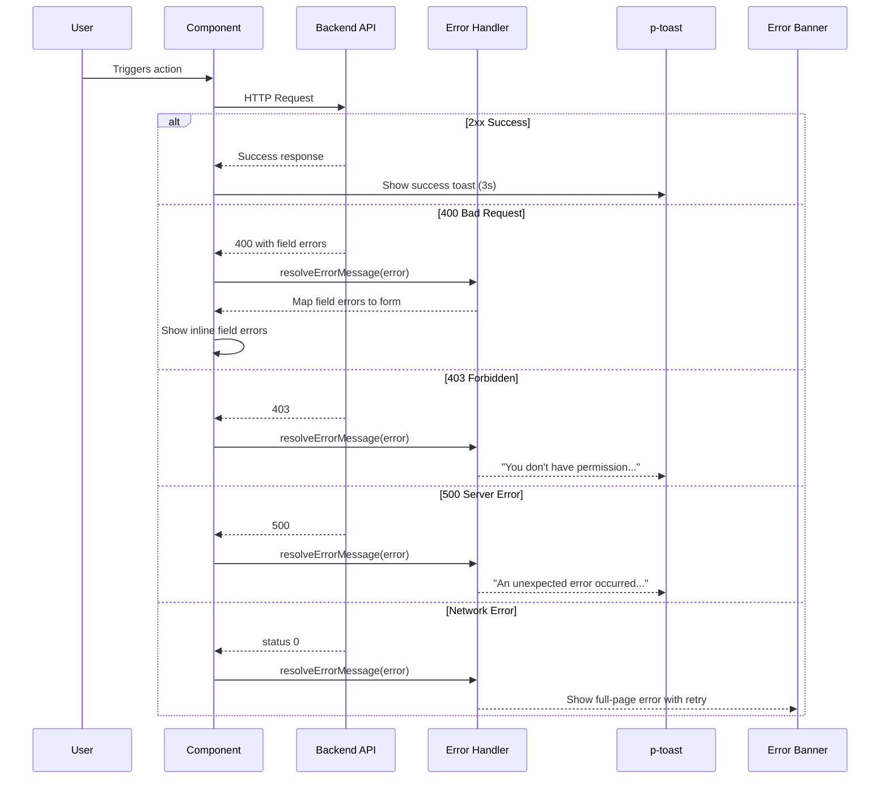

# Error Handling Pattern

**Status:** [DOCUMENTED]
**Version:** 1.0.0
**Date:** 2026-03-12

## Problem

Error display uses a mix of inline messages, toasts, and ad-hoc error banners with no standard for which approach to use when. The `user-embedded.component.ts` has a good `resolveErrorMessage()` pattern (lines 368-388) that maps HTTP status codes to user-friendly messages, but this logic is not shared or reusable.

**Codebase evidence:**

- `frontend/src/app/features/admin/users/user-embedded.component.ts:368-388` -- `resolveErrorMessage()` maps 403 to "Access denied...", 404 to "...not found", extracts `error.error.message`, falls back to generic message. Good pattern, but private to this component.
- `frontend/src/app/features/admin/users/user-embedded.component.html:80-82` -- `<p-message severity="error">{{ error() }}</p-message>` inline error for page-level errors
- `frontend/src/app/features/admin/users/user-embedded.component.html:270-275` -- Error banner in sessions dialog with `role="alert"` and icon (good accessibility pattern)
- `frontend/src/app/features/admin/users/user-embedded.component.ts:304-306` -- Session revoke error sets inline string `'Failed to revoke sessions.'` (no HTTP status mapping)

## Specification

### Error Categories

| Category | Display Method | Auto-Dismiss | Component |
|----------|---------------|-------------|-----------|
| Action error (save, delete, API call) | Toast notification | Yes, 5 seconds | `p-toast` with `severity="error"` |
| Form field validation error | Inline below field | No (persistent until fixed) | `<small class="tp-field-error">` |
| Page-level error (data load failed) | Error banner at top of content | No (persistent with retry) | Custom error banner |
| Network error (no connectivity) | Full-page error state | No (persistent with retry) | Error page component |
| Inline operation error (row action) | Toast notification | Yes, 5 seconds | `p-toast` |

### HTTP Status Code Mapping

| HTTP Status | User Message | Action |
|-------------|-------------|--------|
| 400 | "Invalid request. Please check your input." | Show field errors if available |
| 401 | (No message -- redirect to login) | Redirect to `/login` |
| 403 | "You don't have permission to perform this action." | Show toast |
| 404 | "The requested item was not found." | Show toast or empty state |
| 409 | "This item has been modified. Please refresh and try again." | Show toast with refresh button |
| 422 | "Validation failed. Please correct the highlighted fields." | Map field errors inline |
| 429 | "Too many requests. Please wait a moment." | Show toast |
| 500 | "An unexpected error occurred. Please try again." | Show toast with retry |
| 502/503 | "Service temporarily unavailable. Please try again later." | Show error page |
| 0 (network) | "Unable to connect. Please check your internet connection." | Show error page |

### Toast Configuration

| Property | Value |
|----------|-------|
| Position | `top-right` |
| Life (auto-dismiss) | 5000ms for errors, 3000ms for success/info |
| Closable | Yes |
| Max visible | 3 |

## Component

- `p-toast` -- Toast notifications for action errors
- `p-message` -- Inline persistent messages (page-level errors)
- `p-confirmDialog` -- Confirmation before destructive actions (not an error component, but prevents errors)

## Data Flow



## Code Example

### Shared Error Resolution Service

```typescript
import { HttpErrorResponse } from '@angular/common/http';
import { Injectable } from '@angular/core';

export interface ResolvedError {
  message: string;
  severity: 'error' | 'warn' | 'info';
  fieldErrors?: Record<string, string>;
  retryable: boolean;
}

@Injectable({ providedIn: 'root' })
export class ErrorResolverService {

  resolve(error: unknown): ResolvedError {
    if (!(error instanceof HttpErrorResponse)) {
      return {
        message: 'An unexpected error occurred.',
        severity: 'error',
        retryable: true,
      };
    }

    switch (error.status) {
      case 0:
        return {
          message: 'Unable to connect. Please check your internet connection.',
          severity: 'error',
          retryable: true,
        };
      case 400:
        return {
          message: 'Invalid request. Please check your input.',
          severity: 'error',
          fieldErrors: this.extractFieldErrors(error),
          retryable: false,
        };
      case 403:
        return {
          message: 'You don\'t have permission to perform this action.',
          severity: 'error',
          retryable: false,
        };
      case 404:
        return {
          message: 'The requested item was not found.',
          severity: 'warn',
          retryable: false,
        };
      case 409:
        return {
          message: 'This item has been modified. Please refresh and try again.',
          severity: 'warn',
          retryable: true,
        };
      case 422:
        return {
          message: 'Validation failed. Please correct the highlighted fields.',
          severity: 'error',
          fieldErrors: this.extractFieldErrors(error),
          retryable: false,
        };
      case 429:
        return {
          message: 'Too many requests. Please wait a moment.',
          severity: 'warn',
          retryable: true,
        };
      case 500:
        return {
          message: this.extractServerMessage(error) ?? 'An unexpected error occurred. Please try again.',
          severity: 'error',
          retryable: true,
        };
      case 502:
      case 503:
        return {
          message: 'Service temporarily unavailable. Please try again later.',
          severity: 'error',
          retryable: true,
        };
      default:
        return {
          message: this.extractServerMessage(error) ?? 'An unexpected error occurred.',
          severity: 'error',
          retryable: true,
        };
    }
  }

  private extractServerMessage(error: HttpErrorResponse): string | null {
    if (typeof error.error === 'string' && error.error.trim().length > 0) {
      return error.error;
    }
    if (typeof error.error === 'object' && error.error !== null) {
      const message = (error.error as Record<string, unknown>)['message'];
      if (typeof message === 'string' && message.trim().length > 0) {
        return message;
      }
    }
    return null;
  }

  private extractFieldErrors(error: HttpErrorResponse): Record<string, string> | undefined {
    if (typeof error.error === 'object' && error.error !== null) {
      const errors = (error.error as Record<string, unknown>)['errors'];
      if (typeof errors === 'object' && errors !== null) {
        return errors as Record<string, string>;
      }
    }
    return undefined;
  }
}
```

### Template -- Page-Level Error Banner

```html
@if (pageError()) {
  <div class="tp-error-banner" role="alert">
    <i class="pi pi-exclamation-triangle" aria-hidden="true"></i>
    <span>{{ pageError() }}</span>
    @if (pageErrorRetryable()) {
      <button
        type="button"
        pButton
        [text]="true"
        size="small"
        label="Retry"
        icon="pi pi-refresh"
        (click)="retry()"
      ></button>
    }
  </div>
}
```

### Template -- Toast Setup

```html
<p-toast position="top-right" [life]="5000" />
```

### TypeScript -- Using Error Resolver in Component

```typescript
@Component({ /* ... */ })
export class MyComponent {
  private readonly errorResolver = inject(ErrorResolverService);
  private readonly messageService = inject(MessageService);

  protected readonly pageError = signal<string | null>(null);
  protected readonly pageErrorRetryable = signal(false);

  protected loadData(): void {
    this.api.getData().subscribe({
      error: (err) => {
        const resolved = this.errorResolver.resolve(err);
        if (resolved.retryable) {
          // Page-level error with retry
          this.pageError.set(resolved.message);
          this.pageErrorRetryable.set(true);
        } else {
          // Toast for non-retryable errors
          this.messageService.add({
            severity: resolved.severity,
            summary: 'Error',
            detail: resolved.message,
            life: 5000,
          });
        }
      },
    });
  }
}
```

### SCSS -- Error Banner

```scss
.tp-error-banner {
  display: flex;
  align-items: center;
  gap: var(--tp-space-3);
  padding: var(--tp-space-3) var(--tp-space-4);
  background: color-mix(in srgb, var(--tp-danger) 10%, var(--tp-surface-light));
  border: 1px solid var(--tp-danger);
  border-radius: var(--tp-space-2);
  color: var(--tp-danger);
  margin-block-end: var(--tp-space-4);

  i {
    font-size: 1.25rem;
    flex-shrink: 0;
  }

  span {
    flex: 1;
  }
}
```

## Tokens Used

| Token | Usage |
|-------|-------|
| `--tp-danger` | Error text, error border, error banner background tint |
| `--tp-warning` | Warning severity toast |
| `--tp-success` | Success toast |
| `--tp-surface-light` | Error banner background base |
| `--tp-text` | Error message body text |
| `--tp-space-2` | Error banner border radius |
| `--tp-space-3` | Error banner inner gap, error banner padding |
| `--tp-space-4` | Error banner horizontal padding, bottom margin |
| `--tp-focus-ring` | Focus indicator on retry button |

## Responsive Behavior

| Breakpoint | Behavior |
|------------|----------|
| Desktop (>1024px) | Toast appears top-right; error banner full width within content area |
| Tablet (768-1024px) | Same as desktop |
| Mobile (<768px) | Toast appears top-center, full-width; error banner stacks icon above text on very narrow screens |

## Accessibility

| Requirement | Implementation |
|-------------|----------------|
| Error announcement | `role="alert"` on error banners (auto-announced by screen readers) |
| Toast | PrimeNG `p-toast` uses `role="alert"` automatically |
| Inline errors | `role="alert"` on field error messages, linked via `aria-describedby` |
| Focus management | After dismissing an error, return focus to the element that triggered the action |
| Color + text | Errors use both color (red) and icon (warning triangle) -- never color alone |
| Retry button | `aria-label="Retry loading data"` on retry buttons |
| Keyboard | Escape to dismiss toast (PrimeNG default), Tab to reach retry button |

## Do / Don't

| Do | Don't |
|----|-------|
| Use `p-toast` for action errors (save, delete) | Use `alert()` or `confirm()` for errors |
| Use error banner with retry for page-level load failures | Show toast for page load failure (user may miss it) |
| Use inline errors below form fields | Show all form errors in a single toast |
| Create shared `ErrorResolverService` for HTTP mapping | Copy `resolveErrorMessage()` into every component |
| Map HTTP status codes to user-friendly messages | Show raw HTTP error text to users |
| Include retry button for retryable errors | Force user to refresh the entire page |
| Use `role="alert"` on error containers | Rely on color alone to indicate errors |
| Auto-dismiss action error toasts after 5s | Leave error toasts visible indefinitely |
| Log original error to console for debugging | Swallow errors silently |
| Show both icon and text for errors | Use color as the only error indicator |

## Codebase Fix Reference

| File | Line(s) | Current | Required Change |
|------|---------|---------|-----------------|
| `user-embedded.component.ts` | 368-388 | Private `resolveErrorMessage()` method | Extract to shared `ErrorResolverService` in `core/services/` |
| `user-embedded.component.ts` | 304-306 | Hardcoded `'Failed to revoke sessions.'` | Use `ErrorResolverService.resolve(err).message` |
| `user-embedded.component.html` | 80-82 | `<p-message severity="error">` for page error | Replace with error banner template (includes retry button) |
| `user-embedded.component.html` | 270-275 | Custom error banner in sessions dialog | Good pattern -- standardize CSS class to `tp-error-banner` |
| `frontend/src/app/core/services/` | Does not exist | Create `error-resolver.service.ts` with shared HTTP status mapping |
