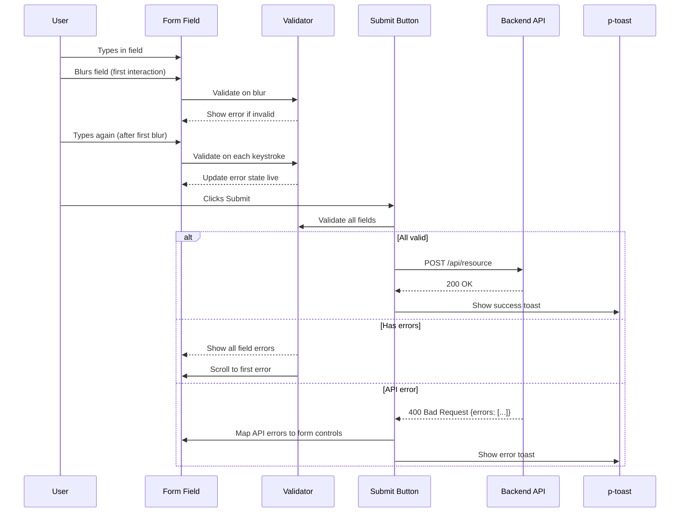

# Form Validation Pattern

**Status:** [DOCUMENTED]
**Version:** 1.0.0
**Date:** 2026-03-12

## Problem

No consistent validation UX exists across forms in the application. Some forms use native HTML validation, others use Angular reactive forms with ad-hoc error display. There is no standard for:
- When to show errors (on blur vs on submit vs on type)
- How to display errors (inline, toast, or dialog)
- Error message wording (inconsistent phrasing)
- Required field indicators (some use asterisk, some don't)
- Submit button state (some disable, some don't)

**Codebase evidence:**

- `frontend/src/app/features/admin/users/user-embedded.component.html:19-42` -- Filter bar uses `FormsModule` with `ngModel` for simple inputs (appropriate for filters)
- `frontend/src/app/features/admin/identity-providers/auth-source-wizard/` -- Wizard form exists but validation approach not standardized
- No shared form error component exists in `frontend/src/app/shared/`

## Specification

### Form Type Selection

| Form Complexity | Approach | Module |
|----------------|----------|--------|
| Filter bars, simple toggles | Signal-based + `FormsModule` (`ngModel`) | `FormsModule` |
| Data entry forms (create/edit) | Reactive Forms with `FormGroup`/`FormControl` | `ReactiveFormsModule` |

### Validation Timing

| Event | Action |
|-------|--------|
| Field blur (first time) | Validate field, show error if invalid |
| Field input (after first blur) | Re-validate on each keystroke (live feedback) |
| Form submit | Validate all fields, scroll to first error, show all errors |
| Programmatic (API error) | Map API field errors to form controls |

### Error Display Rules

| Error Type | Display Method | Component |
|------------|---------------|-----------|
| Field validation error | Inline below field, red text | `<small>` with `tp-field-error` class |
| Form-level error (API) | Toast notification | `p-toast` with `severity="error"` |
| Cross-field validation | Inline below relevant field group | `<small>` with `tp-field-error` class |

### Required Field Indicator

- Asterisk (*) after label text for required fields
- Asterisk color: `var(--tp-danger)`
- Screen reader: `aria-required="true"` on input

### Submit Button Behavior

- Disabled until form is valid (for simple forms)
- On invalid submit: enable button, validate all, scroll to first error
- Loading state during API call: `[loading]="true"` on button

### Error Message Format

| Validation | Message Template |
|-----------|-----------------|
| Required | "{Field name} is required" |
| Min length | "{Field name} must be at least {n} characters" |
| Max length | "{Field name} must not exceed {n} characters" |
| Email | "{Field name} must be a valid email address" |
| Pattern | "{Field name} format is invalid" |
| Min value | "{Field name} must be at least {n}" |
| Max value | "{Field name} must not exceed {n}" |
| Custom | Context-specific message |

## Component

- `p-message` with `severity="error"` -- For inline field errors (when using PrimeNG message style)
- `p-toast` -- For action-level errors (API failures)
- `p-floatLabel` -- Optional: floating labels for compact forms
- `ReactiveFormsModule` -- For data entry forms
- `FormsModule` -- For filter bars and simple inputs

## Data Flow



## Code Example

### TypeScript -- Reactive Form (Data Entry)

```typescript
import { Component, inject, signal } from '@angular/core';
import { FormBuilder, FormGroup, ReactiveFormsModule, Validators } from '@angular/forms';
import { MessageService } from 'primeng/api';

@Component({
  imports: [ReactiveFormsModule],
  providers: [MessageService],
  // ...
})
export class MyFormComponent {
  private readonly fb = inject(FormBuilder);
  private readonly messageService = inject(MessageService);

  protected readonly submitting = signal(false);
  protected readonly submitted = signal(false);

  protected readonly form: FormGroup = this.fb.group({
    name: ['', [Validators.required, Validators.minLength(3), Validators.maxLength(100)]],
    email: ['', [Validators.required, Validators.email]],
    description: ['', [Validators.maxLength(500)]],
  });

  protected onSubmit(): void {
    this.submitted.set(true);
    this.form.markAllAsTouched();

    if (this.form.invalid) {
      this.scrollToFirstError();
      return;
    }

    this.submitting.set(true);
    this.api.create(this.form.value).subscribe({
      next: () => {
        this.messageService.add({
          severity: 'success',
          summary: 'Created',
          detail: 'Item created successfully.',
        });
        this.submitting.set(false);
      },
      error: (err) => {
        this.messageService.add({
          severity: 'error',
          summary: 'Error',
          detail: this.resolveErrorMessage(err),
          life: 5000,
        });
        this.submitting.set(false);
      },
    });
  }

  protected isInvalid(controlName: string): boolean {
    const control = this.form.get(controlName);
    return !!control && control.invalid && (control.touched || this.submitted());
  }

  protected errorMessage(controlName: string, label: string): string {
    const control = this.form.get(controlName);
    if (!control || !control.errors) return '';

    if (control.errors['required']) return `${label} is required`;
    if (control.errors['minlength']) {
      return `${label} must be at least ${control.errors['minlength'].requiredLength} characters`;
    }
    if (control.errors['maxlength']) {
      return `${label} must not exceed ${control.errors['maxlength'].requiredLength} characters`;
    }
    if (control.errors['email']) return `${label} must be a valid email address`;
    return `${label} is invalid`;
  }

  private scrollToFirstError(): void {
    const firstInvalid = document.querySelector('.ng-invalid[formControlName]');
    firstInvalid?.scrollIntoView({ behavior: 'smooth', block: 'center' });
    (firstInvalid as HTMLElement)?.focus();
  }
}
```

### Template -- Reactive Form

```html
<form [formGroup]="form" (ngSubmit)="onSubmit()" novalidate>
  <!-- Name field -->
  <div class="tp-field">
    <label for="name">
      Name <span class="tp-required" aria-hidden="true">*</span>
    </label>
    <input
      pInputText
      id="name"
      formControlName="name"
      [class.ng-invalid-visible]="isInvalid('name')"
      aria-required="true"
      [attr.aria-describedby]="isInvalid('name') ? 'name-error' : null"
    />
    @if (isInvalid('name')) {
      <small id="name-error" class="tp-field-error" role="alert">
        {{ errorMessage('name', 'Name') }}
      </small>
    }
  </div>

  <!-- Email field -->
  <div class="tp-field">
    <label for="email">
      Email <span class="tp-required" aria-hidden="true">*</span>
    </label>
    <input
      pInputText
      id="email"
      formControlName="email"
      type="email"
      [class.ng-invalid-visible]="isInvalid('email')"
      aria-required="true"
      [attr.aria-describedby]="isInvalid('email') ? 'email-error' : null"
    />
    @if (isInvalid('email')) {
      <small id="email-error" class="tp-field-error" role="alert">
        {{ errorMessage('email', 'Email') }}
      </small>
    }
  </div>

  <!-- Submit -->
  <div class="tp-form-actions">
    <button
      type="submit"
      pButton
      label="Save"
      [loading]="submitting()"
      [disabled]="submitting()"
    ></button>
    <button
      type="button"
      pButton
      severity="secondary"
      label="Cancel"
      [disabled]="submitting()"
      (click)="onCancel()"
    ></button>
  </div>
</form>

<p-toast />
```

### SCSS -- Field Error Styles

```scss
.tp-field {
  display: flex;
  flex-direction: column;
  gap: var(--tp-space-1);
  margin-block-end: var(--tp-space-4);

  label {
    font-weight: 600;
    color: var(--tp-text-dark);
  }
}

.tp-required {
  color: var(--tp-danger);
  margin-inline-start: var(--tp-space-1);
}

.tp-field-error {
  color: var(--tp-danger);
  font-size: 0.875rem;
  margin-block-start: var(--tp-space-1);
}

.tp-form-actions {
  display: flex;
  gap: var(--tp-space-3);
  justify-content: flex-end;
  margin-block-start: var(--tp-space-6);
  padding-block-start: var(--tp-space-4);
  border-block-start: 1px solid var(--tp-border);
}

.ng-invalid-visible {
  border-color: var(--tp-danger) !important;
  box-shadow: 0 0 0 1px var(--tp-danger);
}
```

## Tokens Used

| Token | Usage |
|-------|-------|
| `--tp-danger` | Error text, invalid border, required asterisk |
| `--tp-text-dark` | Label text |
| `--tp-text` | Input text |
| `--tp-border` | Default input border, form actions divider |
| `--tp-space-1` | Gap between label and input, error message offset |
| `--tp-space-3` | Gap between action buttons |
| `--tp-space-4` | Field bottom margin, actions top padding |
| `--tp-space-6` | Actions section top margin |
| `--tp-focus-ring` | Focus indicator on inputs |
| `--tp-success` | Success toast icon color |

## Responsive Behavior

| Breakpoint | Behavior |
|------------|----------|
| Desktop (>1024px) | Multi-column form layout (2 columns), actions aligned right |
| Tablet (768-1024px) | Single column layout, full-width fields |
| Mobile (<768px) | Single column, full-width fields, sticky submit button at bottom |

### Mobile Sticky Submit

```scss
@media (max-width: 767px) {
  .tp-form-actions {
    position: sticky;
    inset-block-end: 0;
    background: var(--tp-surface-light);
    padding: var(--tp-space-4);
    margin-inline: calc(-1 * var(--tp-space-4));
    box-shadow: 0 -2px 8px rgba(0, 0, 0, 0.1);
  }
}
```

## Accessibility

| Requirement | Implementation |
|-------------|----------------|
| Required fields | `aria-required="true"` on input, asterisk `aria-hidden="true"` |
| Error association | `aria-describedby="field-error"` linking input to error message |
| Error announcement | `role="alert"` on error message container |
| Focus management | On submit with errors, focus moves to first invalid field |
| Label association | `for`/`id` pairing on all label/input pairs |
| Submit state | `aria-busy="true"` on form during submission |
| Success feedback | Toast with `role="status"` for success messages |
| Keyboard | Tab through fields, Enter to submit, Escape to cancel |

## Do / Don't

| Do | Don't |
|----|-------|
| Use Reactive Forms for data entry | Use `ngModel` for complex forms |
| Use `ngModel` for simple filter bars | Use Reactive Forms for a single search input |
| Show errors on blur (first interaction) | Show errors immediately on page load |
| Show errors live after first blur | Wait until submit to show any errors |
| Use `markAllAsTouched()` on submit | Manually iterate controls to mark touched |
| Scroll to first error on invalid submit | Just show errors with no scroll |
| Use `role="alert"` on error messages | Use `console.error` for user-facing errors |
| Map API field errors to form controls | Show generic "Something went wrong" for 400 errors |
| Use `p-toast` for action-level errors | Use `alert()` or custom modal for errors |
| Disable submit button during API call | Allow double-submit |

## Codebase Fix Reference

| File | Current | Required Change |
|------|---------|-----------------|
| `frontend/src/app/shared/` | No shared form error components | Create `tp-field-error` directive or shared CSS class |
| All form components | Inconsistent error display | Adopt `isInvalid()` + `errorMessage()` pattern from this spec |
| All form components | Mixed use of Reactive and Template forms | Standardize: `FormsModule` for filters, `ReactiveFormsModule` for data entry |
