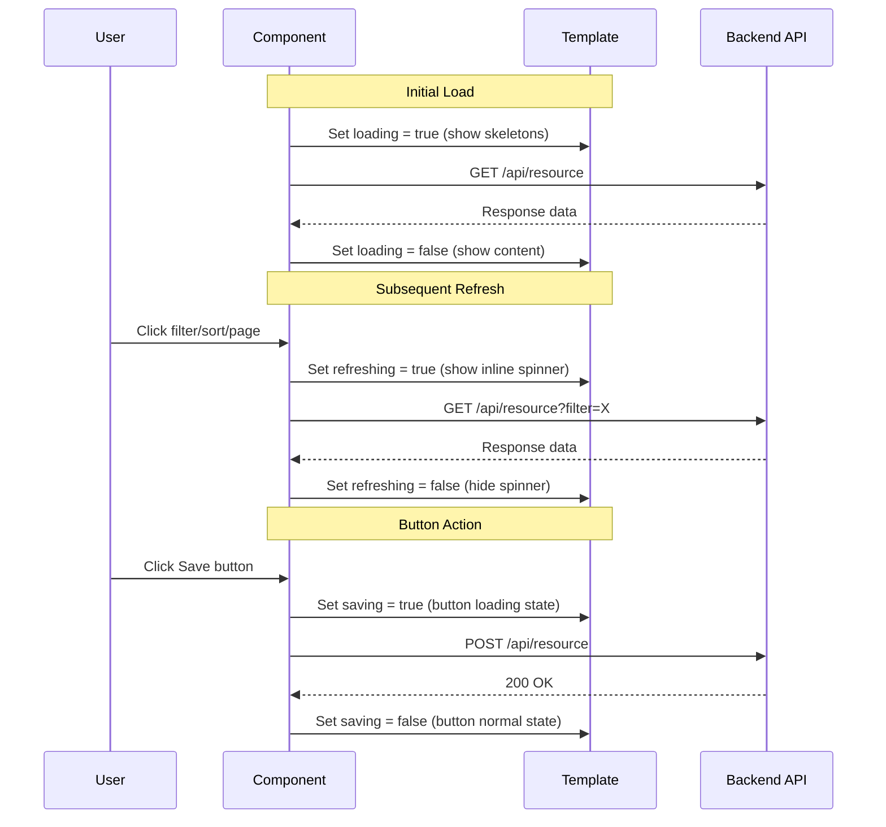

# Loading States Pattern

**Status:** [DOCUMENTED]
**Version:** 1.0.0
**Date:** 2026-03-12

## Problem

Loading states are inconsistently applied across the application. Some features show a blank screen during data load, others show a full-page spinner overlay, and some use inline spinners. There is no standard for which loading indicator to use in which context.

**Codebase evidence:**

- `frontend/src/app/features/admin/users/user-embedded.component.html:84-89` -- Inline `p-progressSpinner` with custom size `{width: '1.25rem', height: '1.25rem'}` and text "Loading users..."
- `frontend/src/app/features/admin/users/user-embedded.component.html:71` -- Button `[loading]="loading()"` on Refresh button (correct pattern for button loading)
- `frontend/src/app/features/admin/users/user-embedded.component.html:265-267` -- Sessions dialog uses `p-progressSpinner` with `styleClass="sessions-spinner"` but no skeleton for the table layout
- No skeleton screens (`p-skeleton`) are used anywhere in the codebase for initial page load

## Specification

| Context | Loading Indicator | Component |
|---------|-------------------|-----------|
| Initial page load (first data fetch) | Skeleton screens mimicking final layout | `p-skeleton` |
| Subsequent data refresh (filter, sort, page) | Subtle spinner in toolbar/header area | `p-progressSpinner` (small, inline) |
| Button action (save, delete, submit) | Button loading state | `[loading]="true"` on `p-button` |
| Long operation (file upload, export) | Progress bar | `p-progressBar` with `mode="indeterminate"` |
| Dialog/overlay data load | Centered spinner inside dialog | `p-progressSpinner` |
| Full-page transition | Top progress bar | `p-progressBar` (thin, fixed top) |

### Skeleton Layout Rules

Skeletons must approximate the shape of the final content:
- Table: Skeleton rows matching column widths
- Card: Skeleton rectangle matching card dimensions
- Text: Skeleton lines matching text line count
- Avatar: Circular skeleton matching avatar size

## Component

- `p-skeleton` -- For initial page load skeletons
- `p-progressSpinner` -- For inline and dialog loading
- `p-progressBar` -- For long operations and page transitions
- Button `[loading]` property -- For button loading states

## Data Flow



## Code Example

### Template -- Skeleton for Table (Initial Load)

```html
@if (initialLoading()) {
  <!-- Skeleton header -->
  <div class="tp-skeleton-toolbar">
    <p-skeleton width="200px" height="2rem" />
    <p-skeleton width="150px" height="2.5rem" />
  </div>

  <!-- Skeleton table rows -->
  <div class="tp-skeleton-table">
    @for (row of [1, 2, 3, 4, 5]; track row) {
      <div class="tp-skeleton-row">
        <p-skeleton width="30%" height="1rem" />
        <p-skeleton width="25%" height="1rem" />
        <p-skeleton width="15%" height="1rem" />
        <p-skeleton width="10%" height="1.5rem" borderRadius="16px" />
        <p-skeleton width="20%" height="1rem" />
      </div>
    }
  </div>
} @else {
  <!-- Actual content -->
  <p-table [value]="items()" ...>
    <!-- ... -->
  </p-table>
}
```

### Template -- Inline Spinner (Data Refresh)

```html
<div class="tp-toolbar">
  <h3>Items</h3>
  @if (refreshing()) {
    <p-progressSpinner
      strokeWidth="5"
      [style]="{ width: '1.25rem', height: '1.25rem' }"
      aria-label="Loading data"
    />
  }
</div>
```

### Template -- Button Loading State

```html
<button
  type="submit"
  pButton
  label="Save"
  [loading]="saving()"
  [disabled]="saving()"
></button>
```

### Template -- Progress Bar (Long Operation)

```html
@if (exporting()) {
  <p-progressBar mode="indeterminate" [style]="{ height: '4px' }" />
}
```

### TypeScript -- Loading State Signals

```typescript
@Component({ /* ... */ })
export class MyListComponent {
  // Separate signals for different loading contexts
  protected readonly initialLoading = signal(true);   // First load -- show skeletons
  protected readonly refreshing = signal(false);       // Subsequent loads -- show inline spinner
  protected readonly saving = signal(false);           // Button action -- show button loading

  ngOnInit(): void {
    this.loadData(true); // isInitial = true
  }

  protected onFilter(): void {
    this.loadData(false); // isInitial = false
  }

  private loadData(isInitial: boolean): void {
    if (isInitial) {
      this.initialLoading.set(true);
    } else {
      this.refreshing.set(true);
    }

    this.api.list().subscribe({
      next: (data) => {
        this.items.set(data);
        this.initialLoading.set(false);
        this.refreshing.set(false);
      },
      error: () => {
        this.initialLoading.set(false);
        this.refreshing.set(false);
      },
    });
  }
}
```

### SCSS -- Skeleton Layout

```scss
.tp-skeleton-toolbar {
  display: flex;
  align-items: center;
  justify-content: space-between;
  padding: var(--tp-space-4);
}

.tp-skeleton-table {
  display: flex;
  flex-direction: column;
  gap: var(--tp-space-3);
  padding: var(--tp-space-4);
}

.tp-skeleton-row {
  display: flex;
  align-items: center;
  gap: var(--tp-space-4);
  padding: var(--tp-space-2) 0;
}
```

## Tokens Used

| Token | Usage |
|-------|-------|
| `--tp-surface` | Skeleton base color (light background) |
| `--tp-border` | Skeleton animation highlight color |
| `--tp-primary` | Progress bar color, spinner stroke color |
| `--tp-space-2` | Skeleton row vertical padding |
| `--tp-space-3` | Gap between skeleton rows |
| `--tp-space-4` | Skeleton container padding, gap between skeleton elements |
| `--tp-surface-light` | Skeleton animation shimmer color |

## Responsive Behavior

| Breakpoint | Behavior |
|------------|----------|
| Desktop (>1024px) | Skeleton rows show all columns (5-6 skeleton bars per row) |
| Tablet (768-1024px) | Skeleton rows show fewer columns (3-4 skeleton bars per row) |
| Mobile (<768px) | Skeleton shows card-shaped blocks instead of table rows |

### Mobile Skeleton Cards

```html
@if (initialLoading() && isMobile()) {
  @for (card of [1, 2, 3]; track card) {
    <div class="tp-skeleton-card">
      <p-skeleton width="60%" height="1.25rem" />
      <p-skeleton width="80%" height="1rem" />
      <p-skeleton width="40%" height="1rem" />
    </div>
  }
}
```

## Accessibility

| Requirement | Implementation |
|-------------|----------------|
| Loading announcement | `aria-busy="true"` on container during loading |
| Spinner label | `aria-label="Loading data"` on `p-progressSpinner` |
| Screen reader | `role="status"` on loading container for live announcements |
| Progress bar | `aria-label="Operation in progress"` on `p-progressBar` |
| Skeleton | `aria-hidden="true"` on skeleton elements (decorative) |
| Content hidden | Content area hidden from screen reader during skeleton state |
| Button loading | PrimeNG automatically sets `aria-busy="true"` on loading buttons |

## Do / Don't

| Do | Don't |
|----|-------|
| Use skeletons for initial page load | Show a blank page while data loads |
| Use inline spinner for data refresh | Show full-page overlay for every data fetch |
| Use button `[loading]` for actions | Disable button without visual feedback |
| Match skeleton shapes to final layout | Use generic rectangular skeletons |
| Use separate signals for each loading context | Use a single `loading` signal for everything |
| Show skeletons for 5 rows (match `pageSize`) | Show 1 skeleton row or 20 rows |
| Use `p-progressBar` for long operations | Use spinner for operations that take >5 seconds |
| Set `aria-busy="true"` during loading | Omit accessibility attributes on loading states |

## Codebase Fix Reference

| File | Line(s) | Current | Required Change |
|------|---------|---------|-----------------|
| `user-embedded.component.html` | 84-89 | Inline spinner for all loading (including initial) | Add skeleton screen for initial load; keep spinner for refresh |
| `user-embedded.component.ts` | 62 | Single `loading = signal(false)` | Split into `initialLoading` and `refreshing` signals |
| `user-embedded.component.html` | 265-267 | `p-progressSpinner` in sessions dialog | Acceptable -- dialog loading is a valid use of spinner |
| All list components | No skeletons used anywhere | Add `p-skeleton` layout matching table/card structure for initial load |
