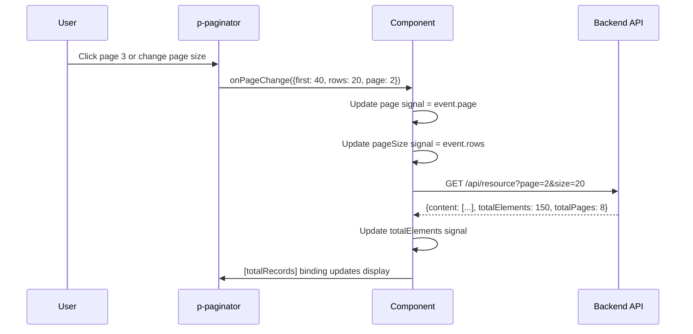

# Pagination Pattern

**Status:** [DOCUMENTED]
**Version:** 1.0.0
**Date:** 2026-03-12

## Problem

`user-embedded.component.html` (lines 156-238) implements custom pagination with hand-built page buttons, previous/next navigation, page size selector, and jump-to-page input. This is 82 lines of template code that duplicates functionality already provided by PrimeNG's `p-paginator`. Every new list page would need to copy this entire block, leading to inconsistency and maintenance burden.

**Codebase evidence:**

- `frontend/src/app/features/admin/users/user-embedded.component.html:156-238` -- 82 lines of custom pagination HTML (page buttons, previous/next, jump-to-page)
- `frontend/src/app/features/admin/users/user-embedded.component.ts:148-215` -- 67 lines of custom pagination logic (changePageSize, previousPage, nextPage, goToPage, visiblePages, jumpToPage)
- Page size options are `[10, 20, 50, 100]` using a native `<select>` instead of PrimeNG `p-select`

## Specification

| Behavior | Rule |
|----------|------|
| Component | `p-paginator` from PrimeNG |
| Default page size | 20 |
| Page size options | `[10, 20, 50, 100]` |
| Pagination type | Server-side always -- pass `page` and `size` to API |
| Display text | "Showing {first} to {last} of {totalRecords}" via `currentPageReportTemplate` |
| Jump to page | `[showJumpToPageInput]="true"` |
| Page links | 5 visible page links (default) |
| Zero state | When `totalRecords === 0`, paginator is hidden |

## Component

- `p-paginator` -- PrimeNG Paginator component
- `PaginatorModule` import

### Key Properties

| Property | Type | Value | Description |
|----------|------|-------|-------------|
| `[rows]` | `number` | `pageSize()` | Current page size |
| `[totalRecords]` | `number` | `totalElements()` | Total count from API |
| `[rowsPerPageOptions]` | `number[]` | `[10, 20, 50, 100]` | Page size selector |
| `[showCurrentPageReport]` | `boolean` | `true` | Shows "Showing X to Y of Z" |
| `currentPageReportTemplate` | `string` | `"Showing {first} to {last} of {totalRecords}"` | Report template |
| `[showJumpToPageInput]` | `boolean` | `true` | Jump-to-page input |
| `(onPageChange)` | `EventEmitter` | `onPageChange($event)` | Page change handler |

## Data Flow



## Code Example

### TypeScript (Component)

```typescript
import { Component, signal } from '@angular/core';
import { PaginatorModule, PaginatorState } from 'primeng/paginator';

@Component({
  imports: [PaginatorModule],
  // ...
})
export class MyListComponent {
  protected readonly page = signal(0);
  protected readonly pageSize = signal(20);
  protected readonly totalElements = signal(0);
  protected readonly first = signal(0);

  protected onPageChange(event: PaginatorState): void {
    this.page.set(event.page ?? 0);
    this.pageSize.set(event.rows ?? 20);
    this.first.set(event.first ?? 0);
    this.loadData();
  }

  private loadData(): void {
    this.api.list({
      page: this.page(),
      size: this.pageSize(),
    }).subscribe(response => {
      this.items.set(response.content);
      this.totalElements.set(response.totalElements);
    });
  }
}
```

### Template (HTML)

```html
@if (totalElements() > 0) {
  <p-paginator
    [rows]="pageSize()"
    [totalRecords]="totalElements()"
    [rowsPerPageOptions]="[10, 20, 50, 100]"
    [showCurrentPageReport]="true"
    currentPageReportTemplate="Showing {first} to {last} of {totalRecords}"
    [showJumpToPageInput]="true"
    [first]="first()"
    (onPageChange)="onPageChange($event)"
  />
}
```

## Tokens Used

| Token | Usage |
|-------|-------|
| `--tp-primary` | Active page button background |
| `--tp-surface` | Paginator background |
| `--tp-text` | Page numbers text color |
| `--tp-text-muted` | "Showing X to Y" report text |
| `--tp-border` | Paginator border |
| `--tp-space-3` | Inner padding of paginator |
| `--tp-space-4` | Gap between paginator elements |
| `--tp-touch-target-min-size` | Minimum size for page buttons (44px) |

## Responsive Behavior

| Breakpoint | Behavior |
|------------|----------|
| Desktop (>1024px) | Full paginator: page numbers + page size selector + report text + jump-to-page |
| Tablet (768-1024px) | Page numbers + page size selector + report text; jump-to-page hidden |
| Mobile (<768px) | Simplified: Previous/Next buttons + "Page X of Y" text only; hide page numbers and jump-to-page |

### Mobile Simplification

On mobile, use a custom template or CSS to show only essential controls:

```scss
@media (max-width: 767px) {
  :host ::ng-deep .p-paginator {
    .p-paginator-pages,
    .p-paginator-jtp-input,
    .p-paginator-rpp-options {
      display: none;
    }
  }
}
```

## Accessibility

| Requirement | Implementation |
|-------------|----------------|
| Navigation label | `aria-label="Pagination"` on paginator container |
| Page buttons | Each page button has `aria-label="Page N"` (provided by PrimeNG) |
| Current page | `aria-current="page"` on active page (provided by PrimeNG) |
| Previous/Next | `aria-label="Previous Page"` / `aria-label="Next Page"` (provided by PrimeNG) |
| Disabled state | `aria-disabled="true"` on disabled prev/next buttons |
| Keyboard | Tab through page buttons, Enter to select, arrow keys to navigate |
| Live region | Announce page change via `role="status"` on report text |

## Do / Don't

| Do | Don't |
|----|-------|
| Use `p-paginator` component | Build custom pagination HTML (buttons, selects, inputs) |
| Use server-side pagination with `page` + `size` params | Load all data and paginate client-side |
| Hide paginator when `totalRecords === 0` | Show paginator with "Page 1 of 0" |
| Use `currentPageReportTemplate` for display text | Build custom "Showing X of Y" text |
| Use `[rowsPerPageOptions]` for page size | Use native `<select>` for page size |
| Pass `[first]` to keep paginator in sync | Let paginator and component state diverge |
| Simplify on mobile (prev/next only) | Show full paginator on small screens |

## Codebase Fix Reference

| File | Line(s) | Current | Required Change |
|------|---------|---------|-----------------|
| `user-embedded.component.html` | 156-238 | 82 lines of custom pagination HTML | Replace entire block with single `<p-paginator>` tag |
| `user-embedded.component.ts` | 148-215 | 67 lines: `changePageSize`, `previousPage`, `nextPage`, `goToPage`, `visiblePages`, `jumpToPage` | Replace with single `onPageChange(event: PaginatorState)` method |
| `user-embedded.component.ts` | 61 | `jumpPage = signal('')` | Remove -- jump-to-page handled by `p-paginator` |
| `user-embedded.component.ts` | 268-278 | `hasPreviousPage()`, `hasNextPage()`, `isCurrentPage()` | Remove -- navigation state handled by `p-paginator` |
| `user-embedded.component.ts` | 40 | No `PaginatorModule` import | Add `PaginatorModule` to imports array |
