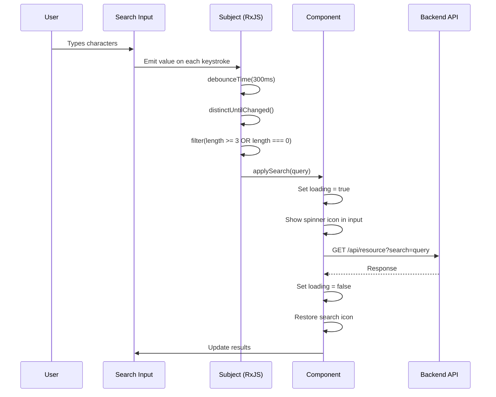

# Search Pattern

**Status:** [DOCUMENTED]
**Version:** 1.0.0
**Date:** 2026-03-12

## Problem

Every feature implements search differently. In `user-embedded.component.ts` (line 234-237), search triggers only on Enter key via `onSearchKeydown()`. There is no debounce, no minimum character threshold, no loading indicator inside the input, and no clear button. Other features may implement search-on-type without debounce, causing excessive API calls.

**Codebase evidence:**

- `frontend/src/app/features/admin/users/user-embedded.component.ts:234-237` -- Search fires only on Enter keydown, no debounce
- `frontend/src/app/features/admin/users/user-embedded.component.html:9-18` -- `pInputText` with `(keydown)="onSearchKeydown($event)"`, no clear button, no loading indicator

## Specification

| Behavior | Rule |
|----------|------|
| Trigger | Debounced on input (300ms), NOT on Enter key |
| Debounce | 300ms via RxJS `debounceTime` |
| Minimum characters | 3 (below 3 characters = show all / reset filter) |
| Empty query | Resets to unfiltered results |
| Loading indicator | Spinner icon replaces search icon inside input during API call |
| Clear button | "x" button appears inside input when value is present |
| No results | Empty State block with "No results for '{query}'" |
| Accessibility | `aria-label` on input, `role="status"` on result count announcement |

## Component

- `p-inputText` -- The text input field
- `p-iconField` with `p-inputIcon` -- Wraps input with search/spinner/clear icons
- PrimeNG `IconField` + `InputIcon` modules

## Data Flow



## Code Example

### TypeScript (Component)

```typescript
import { Component, DestroyRef, inject, signal } from '@angular/core';
import { takeUntilDestroyed } from '@angular/core/rxjs-interop';
import { debounceTime, distinctUntilChanged, filter, Subject } from 'rxjs';

@Component({ /* ... */ })
export class MyListComponent {
  private readonly destroyRef = inject(DestroyRef);
  private readonly searchSubject = new Subject<string>();

  protected readonly searchQuery = signal('');
  protected readonly searchLoading = signal(false);

  constructor() {
    this.searchSubject.pipe(
      debounceTime(300),
      distinctUntilChanged(),
      filter(q => q.length >= 3 || q.length === 0),
      takeUntilDestroyed(this.destroyRef)
    ).subscribe(query => this.applySearch(query));
  }

  protected onSearchInput(event: Event): void {
    const value = (event.target as HTMLInputElement).value;
    this.searchQuery.set(value);
    this.searchSubject.next(value);
  }

  protected clearSearch(): void {
    this.searchQuery.set('');
    this.searchSubject.next('');
  }

  private applySearch(query: string): void {
    this.searchLoading.set(true);
    // Load data with query parameter
    // Set searchLoading to false on complete
  }
}
```

### Template (HTML)

```html
<p-iconField>
  <p-inputIcon>
    @if (searchLoading()) {
      <i class="pi pi-spinner pi-spin" aria-hidden="true"></i>
    } @else {
      <i class="pi pi-search" aria-hidden="true"></i>
    }
  </p-inputIcon>
  <input
    type="search"
    pInputText
    [value]="searchQuery()"
    (input)="onSearchInput($event)"
    placeholder="Search..."
    aria-label="Search items"
    [style.padding-inline-end]="searchQuery() ? 'var(--tp-space-8)' : 'var(--tp-space-3)'"
  />
  @if (searchQuery()) {
    <button
      type="button"
      class="search-clear-btn"
      (click)="clearSearch()"
      aria-label="Clear search"
    >
      <i class="pi pi-times" aria-hidden="true"></i>
    </button>
  }
</p-iconField>
```

### SCSS

```scss
:host {
  .search-clear-btn {
    position: absolute;
    inset-inline-end: var(--tp-space-2);
    top: 50%;
    transform: translateY(-50%);
    background: none;
    border: none;
    cursor: pointer;
    color: var(--tp-text-muted);
    min-width: var(--tp-touch-target-min-size);
    min-height: var(--tp-touch-target-min-size);
    display: flex;
    align-items: center;
    justify-content: center;

    &:hover {
      color: var(--tp-text-dark);
    }

    &:focus-visible {
      outline: none;
      box-shadow: var(--tp-focus-ring);
      border-radius: var(--tp-space-1);
    }
  }
}
```

## Tokens Used

| Token | Usage |
|-------|-------|
| `--tp-text-muted` | Clear button icon color |
| `--tp-text-dark` | Clear button hover color |
| `--tp-space-2` | Clear button inset |
| `--tp-space-3` | Input inline padding |
| `--tp-space-8` | Input inline padding when clear button visible |
| `--tp-focus-ring` | Focus indicator on clear button |
| `--tp-touch-target-min-size` | Minimum 44px touch target for clear button |

## Responsive Behavior

| Breakpoint | Behavior |
|------------|----------|
| Desktop (>1024px) | Full-width search input in filter bar, inline with other filters |
| Tablet (768-1024px) | Full-width search input, stacks above other filters |
| Mobile (<768px) | Full-width search input spanning entire row, other filters collapse into expandable section |

## Accessibility

| Requirement | Implementation |
|-------------|----------------|
| Label | `aria-label="Search [entity name]"` on input |
| Clear button | `aria-label="Clear search"` on clear button |
| Loading state | `aria-busy="true"` on results container during search |
| Result count | `role="status"` on live region announcing "N results found" |
| Keyboard | Type to search (automatic), Tab to clear button, Escape clears input |
| Screen reader | Spinner icon hidden via `aria-hidden="true"`, status announced via live region |

## Do / Don't

| Do | Don't |
|----|-------|
| Use `debounceTime(300)` on input | Trigger search on every keystroke without debounce |
| Use `distinctUntilChanged()` to skip duplicate queries | Fire API call when query hasn't changed |
| Require minimum 3 characters | Search on single character (excessive API calls) |
| Show spinner inside input during loading | Show full-page overlay for search loading |
| Provide clear button inside input | Require user to manually select and delete text |
| Use `p-iconField` + `p-inputIcon` | Build custom icon positioning with absolute CSS |
| Use `type="search"` on input | Use `type="text"` (loses native clear on some browsers) |
| Use RxJS `Subject` + `pipe` for debounce | Use `setTimeout` for manual debounce |

## Codebase Fix Reference

| File | Line(s) | Current | Required Change |
|------|---------|---------|-----------------|
| `user-embedded.component.ts` | 234-237 | `onSearchKeydown()` -- Enter-only trigger | Replace with `Subject` + `debounceTime(300)` + `distinctUntilChanged()` + `filter(q => q.length >= 3 \|\| q.length === 0)` |
| `user-embedded.component.html` | 9-18 | `(keydown)="onSearchKeydown($event)"` | Replace with `(input)="onSearchInput($event)"`, wrap in `p-iconField`, add clear button |
| `user-embedded.component.ts` | 52 | `search = signal('')` | Add `searchSubject = new Subject<string>()` and pipe setup in constructor |
