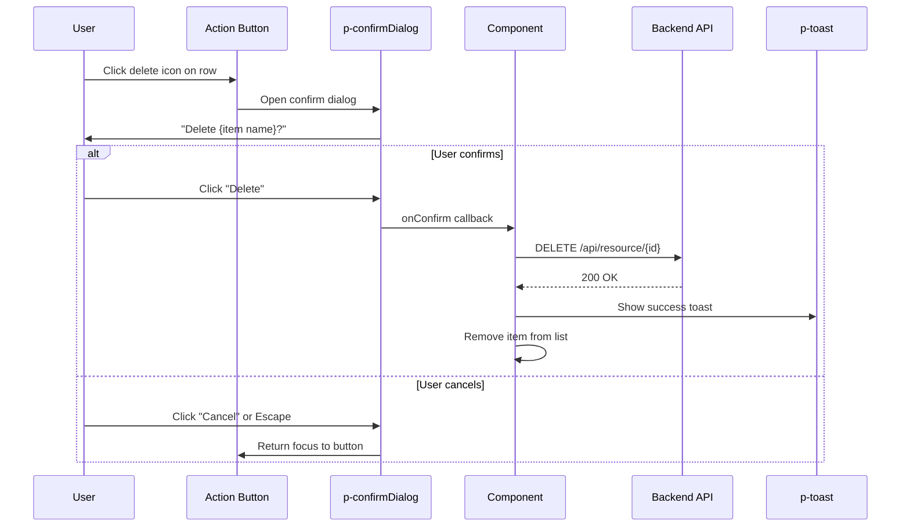
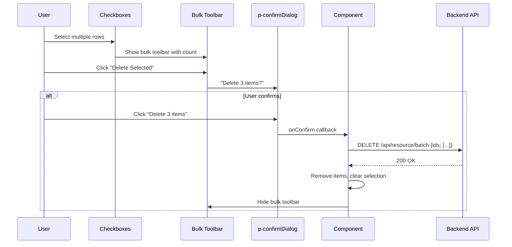

# Table Actions Pattern

**Status:** [DOCUMENTED]
**Version:** 1.0.0
**Date:** 2026-03-12

## Problem

No standard exists for row-level actions, bulk actions, or destructive action confirmations in tables. The `user-embedded` component has a "Sessions" action button per row, but no pattern for common CRUD actions (view, edit, delete) or multi-select bulk operations. Each new list page risks implementing these differently.

**Codebase evidence:**

- `frontend/src/app/features/admin/users/user-embedded.component.html:133-144` -- Single row action button ("Sessions") using `pButton` with `[text]="true"` and `icon="pi pi-shield"`. Good: has `aria-label`, `data-testid`, and `$event.stopPropagation()`.
- `frontend/src/app/features/admin/users/user-embedded.component.html:120` -- Action column header is plain `<th>Actions</th>` (no sortable behavior, correct).
- `frontend/src/app/features/admin/users/user-embedded.component.html:92-154` -- Table uses `p-table` with `pTemplate` for header and body rows. No selection, no checkbox column, no bulk actions toolbar.
- No `p-confirmDialog` usage found for destructive action confirmation.

## Specification

### Row Actions

| Action | Icon | Position | Behavior |
|--------|------|----------|----------|
| View/Detail | `pi pi-eye` | Action column (rightmost) | Navigate to detail page |
| Edit | `pi pi-pencil` | Action column | Navigate to edit page or open edit dialog |
| Delete | `pi pi-trash` | Action column | Open `p-confirmDialog` before deleting |
| Custom action | Context-specific icon | Action column | Context-specific behavior |

### Action Column Rules

- Always the rightmost column
- Header text: "Actions" (not sortable)
- Use icon-only buttons with `[text]="true"` and `[rounded]="true"`
- Each button has `aria-label` describing the action and target
- Use `$event.stopPropagation()` to prevent row click from firing

### Bulk Actions

| Feature | Implementation |
|---------|----------------|
| Selection | Checkbox column (leftmost) via `p-table` selection |
| Select all | Header checkbox for current page (not all pages) |
| Bulk toolbar | Appears above table when items are selected |
| Bulk actions | Delete, Export, Status change (context-specific) |
| Selection count | "N items selected" text in toolbar |
| Clear selection | "Clear" button in toolbar |

### Destructive Action Confirmation

| Element | Value |
|---------|-------|
| Component | `p-confirmDialog` |
| Header | "Confirm {Action}" (e.g., "Confirm Delete") |
| Message | Explicit description: "Are you sure you want to delete {item name}?" |
| Accept label | Action verb: "Delete", "Remove", "Revoke" (not "OK" or "Yes") |
| Accept severity | `danger` |
| Reject label | "Cancel" |
| Keyboard | Escape to cancel, Enter to confirm (focus on Cancel by default) |

### Row Click Behavior

| Interaction | Action |
|-------------|--------|
| Click on row | Navigate to detail view (optional, depends on use case) |
| Enter key on focused row | Navigate to detail view |
| Delete key on selected row(s) | Open confirm dialog for delete |
| Click on action button | Execute specific action |

## Component

- `p-table` -- Data table with selection support
- `p-confirmDialog` -- Destructive action confirmation
- `ConfirmationService` -- PrimeNG confirmation service
- `p-toolbar` -- Bulk actions toolbar
- `p-button` -- Action buttons (icon-only, text style)

## Data Flow

### Single Row Action (Delete)



### Bulk Action



## Code Example

### TypeScript -- Row Actions with Confirmation

```typescript
import { Component, inject, signal } from '@angular/core';
import { ConfirmationService, MessageService } from 'primeng/api';

@Component({
  providers: [ConfirmationService, MessageService],
  imports: [TableModule, ConfirmDialogModule, ToastModule, ToolbarModule, ButtonModule],
  // ...
})
export class MyListComponent {
  private readonly confirmationService = inject(ConfirmationService);
  private readonly messageService = inject(MessageService);

  protected readonly selectedItems = signal<MyItem[]>([]);

  protected onView(item: MyItem): void {
    this.router.navigate(['/items', item.id]);
  }

  protected onEdit(item: MyItem): void {
    this.router.navigate(['/items', item.id, 'edit']);
  }

  protected onDelete(item: MyItem, event: Event): void {
    this.confirmationService.confirm({
      target: event.target as EventTarget,
      message: `Are you sure you want to delete "${item.name}"?`,
      header: 'Confirm Delete',
      icon: 'pi pi-exclamation-triangle',
      acceptLabel: 'Delete',
      rejectLabel: 'Cancel',
      acceptButtonStyleClass: 'p-button-danger',
      defaultFocus: 'reject',
      accept: () => {
        this.api.delete(item.id).subscribe({
          next: () => {
            this.items.update(list => list.filter(i => i.id !== item.id));
            this.messageService.add({
              severity: 'success',
              summary: 'Deleted',
              detail: `"${item.name}" has been deleted.`,
            });
          },
          error: (err) => {
            this.messageService.add({
              severity: 'error',
              summary: 'Error',
              detail: this.errorResolver.resolve(err).message,
            });
          },
        });
      },
    });
  }

  protected onBulkDelete(): void {
    const count = this.selectedItems().length;
    this.confirmationService.confirm({
      message: `Are you sure you want to delete ${count} item(s)?`,
      header: 'Confirm Bulk Delete',
      icon: 'pi pi-exclamation-triangle',
      acceptLabel: `Delete ${count} item(s)`,
      rejectLabel: 'Cancel',
      acceptButtonStyleClass: 'p-button-danger',
      defaultFocus: 'reject',
      accept: () => {
        const ids = this.selectedItems().map(i => i.id);
        this.api.batchDelete(ids).subscribe({
          next: () => {
            this.items.update(list => list.filter(i => !ids.includes(i.id)));
            this.selectedItems.set([]);
            this.messageService.add({
              severity: 'success',
              summary: 'Deleted',
              detail: `${count} item(s) deleted.`,
            });
          },
        });
      },
    });
  }

  protected clearSelection(): void {
    this.selectedItems.set([]);
  }
}
```

### Template -- Table with Actions and Selection

```html
<!-- Bulk actions toolbar (visible when items selected) -->
@if (selectedItems().length > 0) {
  <p-toolbar styleClass="tp-bulk-toolbar">
    <ng-template pTemplate="start">
      <span class="tp-selection-count">
        {{ selectedItems().length }} item(s) selected
      </span>
      <button
        type="button"
        pButton
        [text]="true"
        size="small"
        label="Clear"
        (click)="clearSelection()"
      ></button>
    </ng-template>
    <ng-template pTemplate="end">
      <button
        type="button"
        pButton
        severity="danger"
        size="small"
        icon="pi pi-trash"
        label="Delete Selected"
        (click)="onBulkDelete()"
      ></button>
    </ng-template>
  </p-toolbar>
}

<p-table
  [value]="items()"
  [(selection)]="selectedItems"
  dataKey="id"
  [tableStyle]="{ 'min-width': '50rem' }"
>
  <ng-template pTemplate="header">
    <tr>
      <th style="width: 3rem">
        <p-tableHeaderCheckbox />
      </th>
      <th>Name</th>
      <th>Email</th>
      <th>Status</th>
      <th style="width: 10rem">Actions</th>
    </tr>
  </ng-template>

  <ng-template pTemplate="body" let-item>
    <tr>
      <td>
        <p-tableCheckbox [value]="item" />
      </td>
      <td>{{ item.name }}</td>
      <td>{{ item.email }}</td>
      <td>
        <p-tag [value]="item.status" />
      </td>
      <td>
        <div class="tp-row-actions">
          <button
            type="button"
            pButton
            [text]="true"
            [rounded]="true"
            size="small"
            icon="pi pi-eye"
            [attr.aria-label]="'View ' + item.name"
            (click)="onView(item); $event.stopPropagation()"
          ></button>
          <button
            type="button"
            pButton
            [text]="true"
            [rounded]="true"
            size="small"
            icon="pi pi-pencil"
            [attr.aria-label]="'Edit ' + item.name"
            (click)="onEdit(item); $event.stopPropagation()"
          ></button>
          <button
            type="button"
            pButton
            [text]="true"
            [rounded]="true"
            size="small"
            severity="danger"
            icon="pi pi-trash"
            [attr.aria-label]="'Delete ' + item.name"
            (click)="onDelete(item, $event); $event.stopPropagation()"
          ></button>
        </div>
      </td>
    </tr>
  </ng-template>
</p-table>

<p-confirmDialog />
<p-toast position="top-right" />
```

### SCSS -- Row Actions and Bulk Toolbar

```scss
.tp-row-actions {
  display: flex;
  gap: var(--tp-space-1);
  align-items: center;
  justify-content: flex-end;
}

.tp-bulk-toolbar {
  background: color-mix(in srgb, var(--tp-primary) 8%, var(--tp-surface-light));
  border: 1px solid var(--tp-primary);
  border-radius: var(--tp-space-2);
  margin-block-end: var(--tp-space-3);
  padding: var(--tp-space-2) var(--tp-space-4);
}

.tp-selection-count {
  font-weight: 600;
  color: var(--tp-primary-dark);
  margin-inline-end: var(--tp-space-3);
}
```

## Tokens Used

| Token | Usage |
|-------|-------|
| `--tp-primary` | Bulk toolbar border and background tint |
| `--tp-primary-dark` | Selection count text |
| `--tp-danger` | Delete button severity, confirm dialog accept button |
| `--tp-surface-light` | Bulk toolbar background base |
| `--tp-text` | Action button default color |
| `--tp-space-1` | Gap between row action buttons |
| `--tp-space-2` | Bulk toolbar padding, border radius |
| `--tp-space-3` | Bulk toolbar bottom margin, selection count margin |
| `--tp-space-4` | Bulk toolbar horizontal padding |
| `--tp-focus-ring` | Focus indicator on action buttons |
| `--tp-touch-target-min-size` | Minimum 44px size for action buttons |

## Responsive Behavior

| Breakpoint | Behavior |
|------------|----------|
| Desktop (>1024px) | Full action column with all icon buttons visible; bulk toolbar above table |
| Tablet (768-1024px) | Action column visible; bulk toolbar stacks vertically |
| Mobile (<768px) | Actions move to swipe-to-reveal or action menu (`p-menu`); checkbox column hidden, long-press to select |

### Mobile Action Menu Alternative

On mobile, replace individual icon buttons with a single menu button:

```html
<!-- Mobile: single action menu button -->
<button
  type="button"
  pButton
  [text]="true"
  [rounded]="true"
  icon="pi pi-ellipsis-v"
  [attr.aria-label]="'Actions for ' + item.name"
  (click)="actionMenu.toggle($event)"
></button>
<p-menu
  #actionMenu
  [model]="getActionItems(item)"
  [popup]="true"
  appendTo="body"
/>
```

## Accessibility

| Requirement | Implementation |
|-------------|----------------|
| Action buttons | `aria-label="[Action] [item name]"` on every action button |
| Checkbox | PrimeNG `p-tableCheckbox` provides `aria-label` automatically |
| Select all | Header checkbox selects current page only, with `aria-label="Select all on this page"` |
| Confirm dialog | Focus moves to "Cancel" button by default (`defaultFocus: 'reject'`); Escape closes dialog |
| Bulk toolbar | `role="toolbar"` with `aria-label="Bulk actions"` |
| Selection count | `role="status"` for live announcement of selection changes |
| Keyboard (row) | Enter on focused row = View detail |
| Keyboard (delete) | Delete key on selected rows = Open confirm dialog |
| Keyboard (actions) | Tab through action buttons within a row |
| Screen reader | Confirm dialog message read aloud; accept/reject labels are descriptive verbs |

## Do / Don't

| Do | Don't |
|----|-------|
| Use icon-only buttons with `aria-label` for row actions | Use text buttons in action column (too wide) |
| Use `p-confirmDialog` for all destructive actions | Delete without confirmation |
| Set `defaultFocus: 'reject'` on destructive confirms | Default focus on "Delete" button (accidental deletion) |
| Use descriptive accept labels ("Delete", "Remove") | Use "OK" or "Yes" as accept labels |
| Include item name in confirmation message | Use generic "Are you sure?" without context |
| Use `$event.stopPropagation()` on action buttons | Let action button clicks bubble to row click handler |
| Provide bulk actions toolbar with count | Delete items one by one for bulk operations |
| Select current page only with header checkbox | Select all pages (confusing with server-side pagination) |
| Show selection count in toolbar | Select items without any visual count |
| Use `p-menu` for mobile action overflow | Show all action buttons on mobile (too cramped) |

## Codebase Fix Reference

| File | Current | Required Change |
|------|---------|-----------------|
| `user-embedded.component.html:133-144` | Single "Sessions" action button per row | Good pattern -- extend with standard View/Edit/Delete if applicable |
| `user-embedded.component.html:92` | No selection support on `p-table` | Add `[(selection)]` binding and `dataKey` for multi-select |
| `user-embedded.component.ts` | No `ConfirmationService` usage | Add `ConfirmationService` for destructive actions |
| `user-embedded.component.html` | No `<p-confirmDialog />` in template | Add `<p-confirmDialog />` for delete confirmations |
| All list components | No bulk action pattern | Implement selection + bulk toolbar pattern from this spec |
