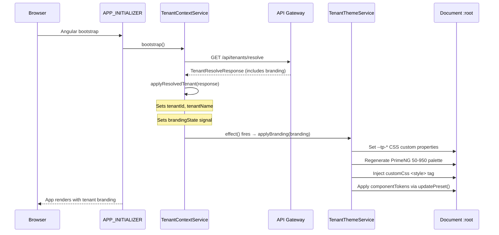
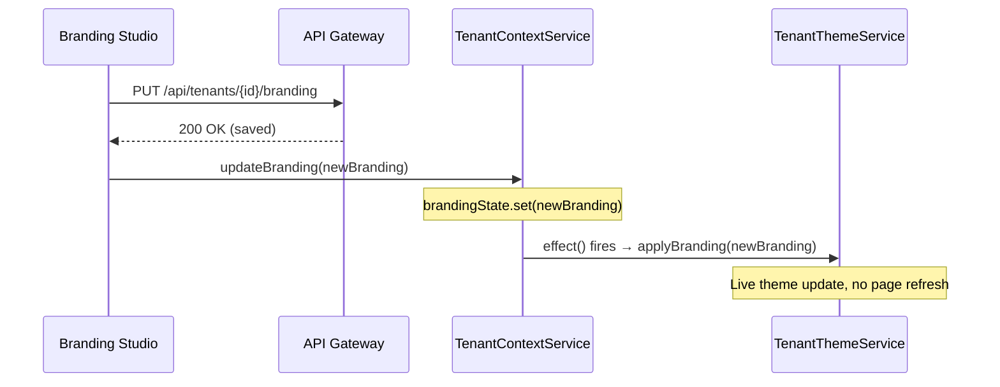
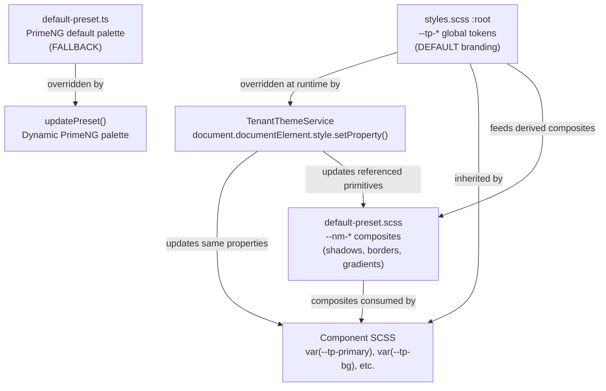

# Tenant Branding Wiring — Design Spec

**Date:** 2026-03-12
**Status:** Approved
**Approach:** Reactive Signal (Approach 2)

## Problem

EMSIST is a COTS solution installed at customer environments. Each tenant requires custom branding (colors, fonts, logos, neumorphic shapes, hover behaviors). The backend infrastructure exists — `TenantBrandingEntity` stores 24 branding fields per tenant, APIs are functional, `TenantThemeService` can apply branding to CSS custom properties and PrimeNG preset, and the Branding Studio admin UI works.

**The gap:** `TenantThemeService.applyBranding()` is never called during app initialization. Tenant branding from `resolveTenant()` is received but not applied.

## Solution

Wire up the existing branding infrastructure using Angular signals so that:
1. Tenant branding auto-applies at app startup (via APP_INITIALIZER)
2. Branding updates live when an admin saves in the Branding Studio (no page refresh)

## Architecture

### Runtime Flow



### Branding Studio Live Update Flow



## Files Changed

### 1. `frontend/src/app/core/services/tenant-context.service.ts`

**Changes:**
- Add `private readonly themeService = inject(TenantThemeService)` (field-level inject, matching existing pattern)
- Add `private readonly brandingState = signal<TenantBranding | null>(null)`
- Add `readonly branding = this.brandingState.asReadonly()`
- Add field-level `effect()` that watches `brandingState` and calls `themeService.applyBranding()`
- Add `updateBranding(branding: TenantBranding): void` public method
- In `applyResolvedTenant()`: extract branding from response and set signal

**New fields** (added alongside existing field-level declarations):
```typescript
private readonly themeService = inject(TenantThemeService);
private readonly brandingState = signal<TenantBranding | null>(null);
readonly branding = this.brandingState.asReadonly();

private readonly brandingEffect = effect(() => {
  const b = this.brandingState();
  if (b) {
    this.themeService.applyBranding(b);
  }
});
```

> **Pattern note:** This follows the existing `TenantContextService` convention of field-level `inject()` — the service has no constructor. All DI and reactive wiring uses field initializers.

**In `applyResolvedTenant()`** — add branding extraction before `resolvedState.set(true)`:
```typescript
private applyResolvedTenant(response: TenantResolveResponse): void {
  // existing tenantId normalization logic (lines 45-50)
  // existing tenantName logic (lines 52-55)

  if (response.branding) {
    this.brandingState.set(response.branding);
  }

  this.resolvedState.set(true);
}
```

**New public method:**
```typescript
updateBranding(branding: TenantBranding): void {
  this.brandingState.set(branding);
}
```

### 2. `frontend/src/app/core/api/models.ts`

**Change:** Strengthen `TenantResolveResponse.branding` type from `Record<string, unknown>` to `TenantBranding`.

**Before:**
```typescript
readonly branding?: Record<string, unknown>;
```

**After:**
```typescript
readonly branding?: TenantBranding;
```

> **Backend contract note:** The backend `TenantBrandingEntity` stores all 24 fields as non-null columns with defaults. If the tenant has no saved branding, the resolve endpoint returns `branding: undefined` (field absent). If branding exists, all required `TenantBranding` fields are populated. The `?` on the property handles the absent-branding case; when present, the shape is guaranteed complete by the backend.

### 3. `frontend/src/app/features/administration/sections/tenant-manager/branding-studio/branding-studio.component.ts`

**Change:** Inject `TenantContextService` and, after a successful save API call, call `this.tenantContext.updateBranding(savedBranding)` to trigger live theme update via the signal. The component already injects other core services; this adds one more `inject()` field.

### 4. `frontend/src/app/core/theme/tenant-theme.service.ts`

**No changes needed.** The existing `applyBranding()` method handles all CSS variable setting, PrimeNG palette regeneration, custom CSS injection, and component token application.

## Edge Cases

| Scenario | Behavior |
|----------|----------|
| Tenant has no saved branding | `branding` is `null/undefined` → default `--tp-*` from `styles.scss` applies |
| Tenant resets branding to defaults | Backend returns default hex values → theme matches `default-preset.ts` fallback |
| API call fails (network error) | `catchError` in bootstrap already handles this → default theme applies |
| Admin saves in Branding Studio | `updateBranding()` fires signal → effect applies branding instantly |
| Multiple rapid saves | Angular signal coalesces — last value wins, no race conditions |
| `customCss` is empty string | `_injectCustomCss('')` clears the injected `<style>` tag (existing behavior) |
| Effect timing during APP_INITIALIZER | The `effect()` is field-level and fires synchronously during `applyResolvedTenant()` within `bootstrap()`. Since `bootstrap()` is an `APP_INITIALIZER` that blocks rendering, branding applies before first paint — no FOUC. |

## CSS Architecture Context

This design builds on the recently completed CSS token flattening:

### Token Layer Architecture (Post-Flattening)



### How Tenant Branding Maps to CSS Tokens

| Branding Field | CSS Token(s) Set | Cascade Effect |
|----------------|-----------------|----------------|
| `primaryColor` | `--tp-primary`, `--nm-accent`, `--nm-accent-rgb` | All interactive elements, neumorphic accents |
| `primaryColorDark` | `--tp-primary-dark` | Hover states, headers, high-emphasis |
| `secondaryColor` | `--tp-primary-light`, `--tp-border` | Borders, dividers, secondary accent |
| `surfaceColor` | `--tp-bg`, `--tp-surface`, `--nm-bg` | Page backgrounds, card surfaces |
| `textColor` | `--tp-text` | All body text, labels |
| `shadowDarkColor` | `--nm-shadow-dark` | Neumorphic lower-right shadows |
| `shadowLightColor` | `--nm-shadow-light` | Neumorphic upper-left highlights |
| `cornerRadius` | `--nm-radius` | Neumorphic card border radius |
| `buttonDepth` | `--nm-depth` | Shadow offset distance |
| `fontFamily` | `document.body.style.fontFamily` | All text via CSS inheritance |
| `customCss` | Injected `<style id="tenant-custom-css">` | Arbitrary CSS overrides |
| `componentTokens` | PrimeNG `updatePreset({ components })` | Per-component PrimeNG tokens |

### Composite Token Cascade

When `--tp-primary` changes via tenant branding, composite tokens that reference it automatically update:

```scss
/* These centralized composites in default-preset.scss auto-cascade: */
--nm-btn-bezel-gradient: linear-gradient(145deg, var(--tp-primary), var(--tp-primary-dark));
--nm-action-primary-border: 1px solid color-mix(in srgb, var(--tp-primary-dark) 60%, transparent);
--nm-dock-item-border: 1px solid color-mix(in srgb, var(--tp-primary) 28%, transparent);
--nm-accent-soft: color-mix(in srgb, var(--tp-primary) 17%, transparent);
/* ... all composites using var(--tp-*) cascade automatically */
```

Composites using hardcoded RGB values (neumorphic shadow channels like `rgba(152, 133, 97, 0.38)`) do NOT cascade from `--tp-*` changes. These are controlled by `shadowDarkColor` and `shadowLightColor` branding fields which set `--nm-shadow-dark` and `--nm-shadow-light`.

## PrimeNG Preset Relationship

| Layer | Purpose | When Applied |
|-------|---------|-------------|
| `default-preset.ts` | Default/fallback PrimeNG theme | At app config time (static) |
| `TenantThemeService._applyPrimeNgPreset()` | Tenant-specific PrimeNG palette | At runtime via `updatePreset()` |

The preset file serves as the **reset target** — when a tenant clears their branding, PrimeNG reverts to these colors. The dynamic palette is generated via HSL from the tenant's `primaryColor` and applied on top.

## Testing Strategy

| Test | Type | What to Verify |
|------|------|----------------|
| Signal wiring | Unit (Vitest) | `brandingState` set from response → effect calls `applyBranding()` |
| Null branding | Unit | No branding in response → signal stays null, no effect call |
| updateBranding() | Unit | Calling `updateBranding()` → signal updates → effect fires |
| Type alignment | Compile-time | `TenantResolveResponse.branding` accepts `TenantBranding` shape |
| CSS variables applied | E2E (Playwright) | Load app with mock branding → verify `--tp-primary` is tenant's color |
| PrimeNG palette | E2E | PrimeNG button uses tenant's primary color, not default |

## Documentation Deliverables

| Document | Section | Content |
|----------|---------|---------|
| `docs/arc42/06-runtime-view.md` | New section: Tenant Branding Resolution | Sequence diagram + description of the bootstrap branding flow |
| `docs/arc42/08-crosscutting.md` | Theming / Multi-Tenant Branding | CSS token architecture, PrimeNG integration, cascade behavior |
| `Documentation/design-system/DESIGN-SYSTEM-CONTRACT.md` | Updated architecture diagram | Reflect 2-layer token architecture + runtime branding override |

## Out of Scope

- localStorage branding cache (future enhancement)
- Per-tenant SCSS files (not needed — runtime CSS custom properties are sufficient)
- New branding fields beyond the existing 24
- Multi-theme support (dark mode) — separate initiative
