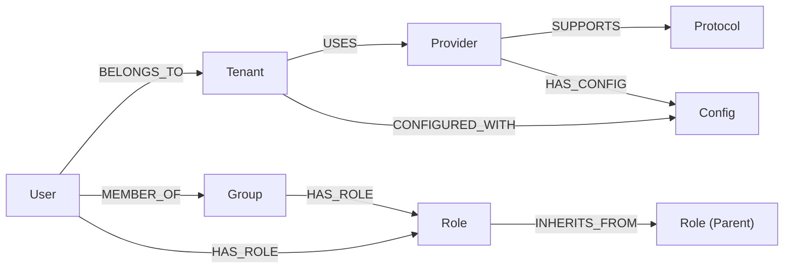
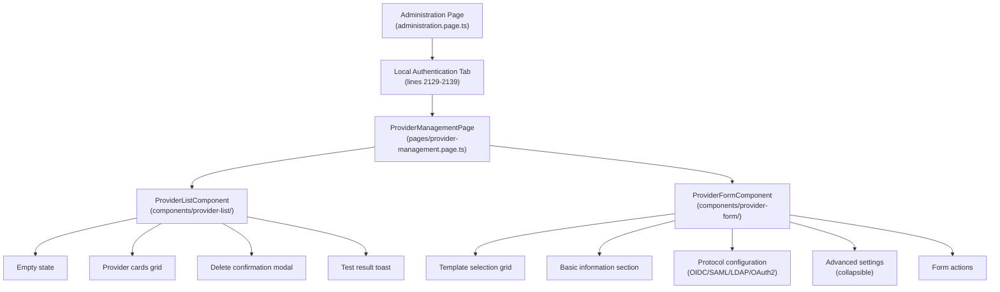
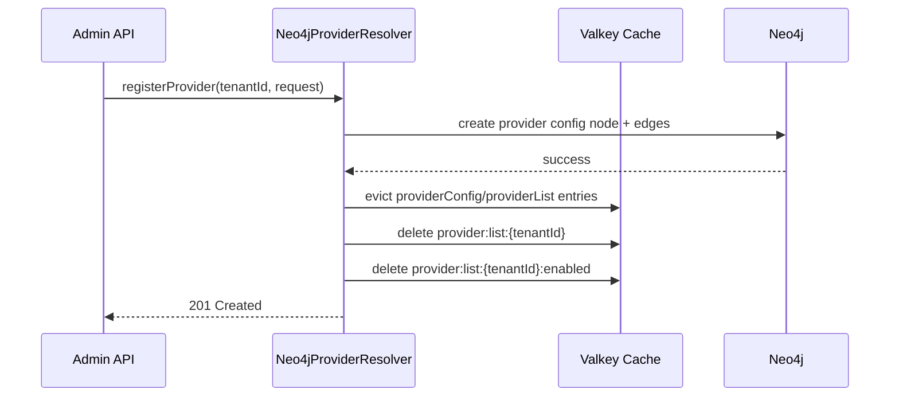
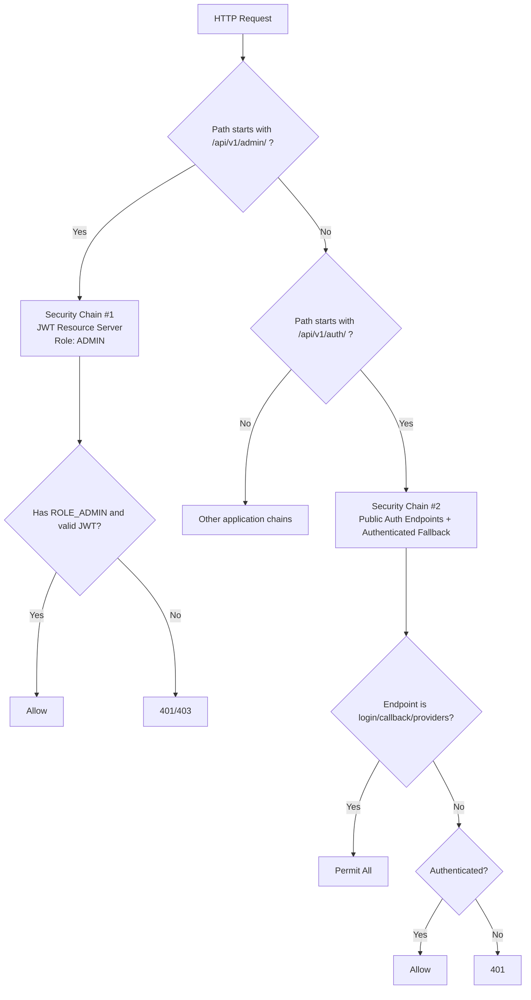

# Auth Facade - Low-Level Design (LLD)

> **WP-ARCH-ALIGN (2026-03-24):** This document has been updated to reflect the frozen auth target model (Rev 2).
> See `Foundation/03-ownership-boundaries.md` § FROZEN for the canonical decision.

> **Document Type:** Low-Level Design (C4 Level 3-4)
> **Owner:** Solution Architect
> **Status:** [TRANSITION] — as-is reference for migration; not a design target
> **Last Updated:** 2026-03-24 (WP-ARCH-ALIGN Rev 2)
> **References:** [Architecture section 9.3.3](../Architecture/09-architecture-decisions.md#933-neo4j-backed-identity-broker-adr-009), [EMS Neo4j Database Schema](../data-models/neo4j-ems-db.md)

---

## 1. Overview

> **[TRANSITION]** auth-facade is a transition-only service. Per the frozen auth target model (Rev 2, 2026-03-24), auth-facade is removed after migration. Its edge responsibilities (login, token refresh, logout, MFA verify) migrate to api-gateway. Its data/policy responsibilities (RBAC, provider config, session control) migrate to tenant-service (PostgreSQL). Neo4j is removed from the auth target domain.
>
> This LLD documents the **as-is implementation** for reference during migration. It is not a design target.

[AS-IS] This document provides the Low-Level Design for the Auth Facade service, which implements a provider-agnostic Dynamic Identity Broker pattern. The design enables runtime identity provider configuration per tenant without service restarts.

### 1.1 Document Scope

| Aspect | Coverage |
|--------|----------|
| C4 Level | Level 3 (Components) and Level 4 (Code) |
| Service | `auth-facade` |
| Focus | Implementation details, class design, API contracts, Cypher queries |

### 1.2 Related Documentation

| Document | Location | Purpose |
|----------|----------|---------|
| Strategic decision | [Architecture section 9.3.3](../Architecture/09-architecture-decisions.md#933-neo4j-backed-identity-broker-adr-009) | Architecture decision and rationale |
| Graph Schema | [neo4j-ems-db.md](../data-models/neo4j-ems-db.md) | Canonical EMS Neo4j database schema |
| HLD (Building Blocks) | [05-building-blocks.md](../Architecture/05-building-blocks.md) | High-level service architecture |
| Security Concepts | [08-crosscutting.md](../Architecture/08-crosscutting.md) | Authentication patterns |
| Service README | [/backend/auth-facade/README.md](../../backend/auth-facade/README.md) | Developer quick-start |

---

## 2. Key Design Decisions

| Decision | Choice | Rationale |
|----------|--------|-----------|
| Primary Database | [AS-IS] Neo4j (Graph). [TARGET] PostgreSQL via tenant-service. Provider config migrates from Neo4j to tenant-service (PostgreSQL). Auth-facade is a transitional service that will be removed; its edge responsibilities migrate to api-gateway and its data/policy responsibilities migrate to tenant-service. | [AS-IS] Identity relationships stored as graph. [TARGET] PostgreSQL is the authoritative store for tenant users, RBAC, memberships, provider config, and session control. |
| Secret Storage | Jasypt Encryption | Secrets encrypted at rest; decrypted only in memory |
| Caching | Valkey | Provider config cache, role cache with 5-min TTL |
| Provider Pattern | Strategy + Factory | Runtime provider selection without code changes |
| Multi-Tenancy | Per-tenant configuration | Each tenant manages their own identity providers |

---

## 3. Package Structure

```mermaid
flowchart TB
    ROOT["backend/auth-facade/src/main/java/com/ems/auth"]

    ROOT --> CONFIG["config/"]
    ROOT --> CONTROLLER["controller/"]
    ROOT --> DTO["dto/"]
    ROOT --> DOMAIN["domain/"]
    ROOT --> PROVIDER["provider/"]
    ROOT --> SECURITY["security/"]
    ROOT --> SERVICE["service/"]
    ROOT --> GRAPH["graph/"]
    ROOT --> FILTER["filter/"]
    ROOT --> CLIENT["client/"]

    CONFIG --> CONFIG_KEYS["AuthProperties, CacheConfig, DynamicBrokerSecurityConfig, JasyptConfig, Neo4jConfig, SecurityConfig"]
    CONTROLLER --> CONTROLLER_KEYS["AdminProviderController, AuthController, EventController"]
    DTO --> DTO_KEYS["ProviderConfigRequest, ProviderConfigResponse"]
    DOMAIN --> DOMAIN_KEYS["ProviderType, ProtocolType"]
    PROVIDER --> PROVIDER_KEYS["DynamicProviderResolver, IdentityProvider, Neo4jProviderResolver, KeycloakIdentityProvider"]
    SECURITY --> SECURITY_KEYS["JwtTokenValidator, PrincipalExtractor, ProviderAgnosticRoleConverter"]
    SERVICE --> SERVICE_KEYS["AuthService, TokenService, GraphRoleService, EncryptionService, SeatValidationService"]
    GRAPH --> GRAPH_ENTITY["entity/: TenantNode, ProviderNode, ProtocolNode, ConfigNode, UserNode, GroupNode, RoleNode"]
    GRAPH --> GRAPH_REPO["repository/: AuthGraphRepository"]
    GRAPH --> GRAPH_INIT["Neo4jDataInitializer"]
    FILTER --> FILTER_KEYS["JwtValidationFilter, RateLimitFilter, TenantContextFilter"]
    CLIENT --> CLIENT_KEYS["LicenseServiceClient, LicenseServiceClientFallbackFactory, SeatValidationResponse"]
```



---

## 4. API Contract

> **[TRANSITION]** All APIs below are as-is. In the target model, provider management APIs migrate to tenant-service; auth edge endpoints (login, token refresh, logout, MFA verify) migrate to api-gateway. auth-facade is removed after migration.

### 4.1 Admin Provider Management API

**Base URL:** `/api/v1/admin/tenants/{tenantId}/providers`
**Security:** Requires `ADMIN` role, Bearer JWT authentication

#### 4.1.1 List Providers

```yaml
GET /api/v1/admin/tenants/{tenantId}/providers
Summary: List all identity providers for a tenant
Security: bearerAuth (ADMIN role required)

Parameters:
  - name: tenantId
    in: path
    required: true
    schema:
      type: string
    example: "tenant-acme"

Responses:
  200:
    description: Provider list retrieved successfully
    content:
      application/json:
        schema:
          type: array
          items:
            $ref: '#/components/schemas/ProviderConfigResponse'
  401:
    description: Not authenticated
  403:
    description: Insufficient permissions (requires ADMIN role)
  404:
    description: Tenant not found
```

#### 4.1.2 Get Provider by ID

```yaml
GET /api/v1/admin/tenants/{tenantId}/providers/{providerId}
Summary: Get a specific identity provider configuration
Security: bearerAuth (ADMIN role required)

Parameters:
  - name: tenantId
    in: path
    required: true
    schema:
      type: string
  - name: providerId
    in: path
    required: true
    schema:
      type: string

Responses:
  200:
    description: Provider retrieved successfully
    content:
      application/json:
        schema:
          $ref: '#/components/schemas/ProviderConfigResponse'
  404:
    description: Provider not found
```

#### 4.1.3 Register Provider

```yaml
POST /api/v1/admin/tenants/{tenantId}/providers
Summary: Register a new identity provider for a tenant
Security: bearerAuth (ADMIN role required)

Parameters:
  - name: tenantId
    in: path
    required: true
    schema:
      type: string

RequestBody:
  required: true
  content:
    application/json:
      schema:
        $ref: '#/components/schemas/ProviderConfigRequest'

Responses:
  201:
    description: Provider registered successfully
    content:
      application/json:
        schema:
          $ref: '#/components/schemas/ProviderConfigResponse'
  400:
    description: Invalid provider configuration
    content:
      application/json:
        schema:
          $ref: '#/components/schemas/ErrorResponse'
  409:
    description: Provider with same name already exists
```

#### 4.1.4 Update Provider

```yaml
PUT /api/v1/admin/tenants/{tenantId}/providers/{providerId}
Summary: Update an existing identity provider configuration
Security: bearerAuth (ADMIN role required)

Parameters:
  - name: tenantId
    in: path
    required: true
    schema:
      type: string
  - name: providerId
    in: path
    required: true
    schema:
      type: string

RequestBody:
  required: true
  content:
    application/json:
      schema:
        $ref: '#/components/schemas/ProviderConfigRequest'

Responses:
  200:
    description: Provider updated successfully
  404:
    description: Provider not found
```

#### 4.1.5 Delete Provider

```yaml
DELETE /api/v1/admin/tenants/{tenantId}/providers/{providerId}
Summary: Delete an identity provider
Security: bearerAuth (ADMIN role required)

Responses:
  204:
    description: Provider deleted successfully
  404:
    description: Provider not found
```

#### 4.1.6 Invalidate Cache

```yaml
POST /api/v1/admin/tenants/{tenantId}/providers/cache/invalidate
Summary: Force invalidation of provider cache
Security: bearerAuth (ADMIN role required)

Responses:
  204:
    description: Cache invalidated successfully
```

### 4.2 Request/Response Schemas

#### ProviderConfigRequest

```java
public record ProviderConfigRequest(
    @NotBlank @Size(max = 50) String providerName,       // e.g., "KEYCLOAK", "AUTH0"
    @Size(max = 100) String displayName,                  // UI display name
    @NotBlank @Pattern(regexp = "^(OIDC|SAML|LDAP|OAUTH2)$") String protocol,

    // OIDC/OAuth2
    @Size(max = 255) String clientId,
    @Size(max = 512) String clientSecret,                 // Encrypted at rest
    @Size(max = 512) String discoveryUrl,                 // /.well-known/openid-configuration
    @Size(max = 512) String authorizationUrl,
    @Size(max = 512) String tokenUrl,
    @Size(max = 512) String userInfoUrl,
    @Size(max = 512) String jwksUrl,
    @Size(max = 512) String issuerUrl,
    List<String> scopes,                                  // Default: [openid, profile, email]

    // SAML
    @Size(max = 512) String metadataUrl,

    // LDAP
    @Size(max = 255) String serverUrl,
    Integer port,                                         // Default: 389
    @Size(max = 255) String bindDn,
    @Size(max = 255) String bindPassword,                 // Encrypted at rest
    @Size(max = 255) String userSearchBase,
    @Size(max = 255) String userSearchFilter,

    // Common
    @Size(max = 100) String idpHint,                      // kc_idp_hint
    boolean enabled,                                      // Default: true
    Integer priority,                                     // Default: 100
    Boolean trustEmail,                                   // Default: true
    Boolean storeToken,                                   // Default: false
    Boolean linkExistingAccounts                          // Default: true
) {}
```

#### ProviderConfigResponse

```java
public record ProviderConfigResponse(
    String id,                      // UUID
    String providerName,
    String displayName,
    String protocol,
    String clientId,
    String clientSecret,            // MASKED: "cl****et"
    String discoveryUrl,
    String metadataUrl,
    String serverUrl,
    Integer port,
    String bindDn,                  // MASKED
    String userSearchBase,
    String idpHint,
    List<String> scopes,
    boolean enabled,
    Instant createdAt,
    Instant updatedAt
) {}
```

#### ErrorResponse

```java
public record ErrorResponse(
    Instant timestamp,
    int status,
    String error,
    String message,
    String path
) {}
```

### 4.3 Error Codes

| HTTP Status | Error Code | Description |
|-------------|------------|-------------|
| 400 | `VALIDATION_ERROR` | Request body validation failed |
| 401 | `UNAUTHORIZED` | Missing or invalid authentication |
| 403 | `FORBIDDEN` | Insufficient permissions |
| 404 | `PROVIDER_NOT_FOUND` | Provider with given ID not found |
| 409 | `PROVIDER_ALREADY_EXISTS` | Provider with same name already exists |
| 500 | `INTERNAL_ERROR` | Internal server error |

---

## 5. Service Layer Design

### 5.1 DynamicProviderResolver Interface

```java
public interface DynamicProviderResolver {

    /**
     * Resolve provider configuration for a tenant.
     * @throws ProviderNotFoundException if not found
     */
    ProviderConfig resolveProvider(String tenantId, String providerName);

    /**
     * List all providers for a tenant (including disabled).
     */
    List<ProviderConfig> listProviders(String tenantId);

    /**
     * List only enabled providers for a tenant.
     */
    List<ProviderConfig> listEnabledProviders(String tenantId);

    /**
     * Register a new identity provider.
     * @throws ProviderAlreadyExistsException if name exists
     */
    void registerProvider(String tenantId, ProviderConfigRequest request);

    /**
     * Update an existing provider configuration.
     * @throws ProviderNotFoundException if not found
     */
    void updateProvider(String tenantId, String providerId, ProviderConfigRequest request);

    /**
     * Delete a provider configuration.
     * @throws ProviderNotFoundException if not found
     */
    void deleteProvider(String tenantId, String providerId);

    /**
     * Invalidate cache for a tenant.
     */
    void invalidateCache(String tenantId);
}
```

### 5.2 Neo4jProviderResolver Implementation

[AS-IS] The current primary implementation uses Neo4j graph database.
[TARGET] Provider resolution migrates to tenant-service backed by PostgreSQL. Auth-facade (and this resolver) will be removed after migration.

```java
@Service
@ConditionalOnProperty(name = "auth.dynamic-broker.storage", havingValue = "neo4j", matchIfMissing = true)
@Primary
@RequiredArgsConstructor
@Transactional(readOnly = true)
public class Neo4jProviderResolver implements DynamicProviderResolver {

    private final AuthGraphRepository repository;
    private final StringRedisTemplate redisTemplate;
    private final EncryptionService encryptionService;

    @Override
    @Cacheable(value = "providerConfig", key = "#tenantId + ':' + #providerName")
    public ProviderConfig resolveProvider(String tenantId, String providerName) {
        return repository.findProviderConfig(tenantId, providerName)
            .map(this::toProviderConfig)
            .orElseThrow(() -> new ProviderNotFoundException(tenantId, providerName));
    }

    @Override
    @Transactional
    @CacheEvict(value = {"providerConfig", "providerList"}, allEntries = true)
    public void registerProvider(String tenantId, ProviderConfigRequest request) {
        if (repository.providerExistsForTenant(tenantId, request.providerName())) {
            throw new ProviderAlreadyExistsException(tenantId, request.providerName());
        }

        ensureProviderNode(request.providerName(), request.protocol());
        Map<String, Object> configProps = buildConfigProperties(tenantId, request);
        repository.createProviderConfig(tenantId, request.providerName(), configProps);
        invalidateCacheForTenant(tenantId);
    }

    // Secret encryption on save
    private Map<String, Object> buildConfigProperties(String tenantId, ProviderConfigRequest request) {
        Map<String, Object> props = new HashMap<>();
        props.put("id", UUID.randomUUID().toString());
        props.put("tenantId", tenantId);
        // ... other properties

        // Encrypt secrets
        if (request.clientSecret() != null && !request.clientSecret().isBlank()) {
            props.put("clientSecretEncrypted", encryptionService.encrypt(request.clientSecret()));
        }
        if (request.bindPassword() != null && !request.bindPassword().isBlank()) {
            props.put("bindPasswordEncrypted", encryptionService.encrypt(request.bindPassword()));
        }

        return props;
    }

    // Secret decryption on read
    private ProviderConfig toProviderConfig(ConfigNode node) {
        return ProviderConfig.builder()
            .id(node.id())
            .clientSecret(decryptIfPresent(node.clientSecretEncrypted()))
            .bindPassword(decryptIfPresent(node.bindPasswordEncrypted()))
            // ... other properties
            .build();
    }
}
```

### 5.3 EncryptionService Interface

```java
public interface EncryptionService {
    /**
     * Encrypts the given raw string using Jasypt.
     * @return Encrypted string in format "ENC(ciphertext)"
     */
    String encrypt(String rawData);

    /**
     * Decrypts the given encrypted string.
     * @return Decrypted plaintext
     */
    String decrypt(String encryptedData);
}
```

### 5.4 Connection Test Service (TO BE IMPLEMENTED)

```java
/**
 * Service for testing provider connectivity.
 * Status: NEEDS IMPLEMENTATION
 */
public interface ConnectionTestService {

    /**
     * Test connection to an identity provider.
     *
     * For OIDC: Fetches discovery document
     * For SAML: Fetches metadata
     * For LDAP: Attempts bind operation
     *
     * @return TestConnectionResponse with success status and details
     */
    TestConnectionResponse testConnection(String tenantId, String providerId);

    /**
     * Validate provider configuration without saving.
     * Tests that required fields are present for the protocol.
     */
    TestConnectionResponse validateConfig(ProviderConfigRequest request);
}

public record TestConnectionResponse(
    boolean success,
    String message,
    @Nullable ConnectionDetails details,
    @Nullable String error
) {}

public record ConnectionDetails(
    String discoveryUrl,
    String issuer,
    List<String> supportedScopes,
    Map<String, String> endpoints
) {}
```

### 5.5 GraphRoleService Interface

> [AS-IS] This service currently queries Neo4j for role inheritance.
> [TARGET] Role resolution migrates to tenant-service (PostgreSQL) with recursive CTE queries. The GraphRoleService is removed along with auth-facade.

```java
public interface GraphRoleService {

    /**
     * Get effective roles with deep inheritance traversal.
     * Traverses: User -> Groups -> Roles -> Inherited Roles
     */
    Set<String> getEffectiveRoles(String email);

    /**
     * Get effective roles scoped to a specific tenant.
     */
    Set<String> getEffectiveRolesForTenant(String email, String tenantId);

    /**
     * Get Spring Security GrantedAuthority collection.
     */
    Collection<GrantedAuthority> getAuthorities(String email);
}
```

---

## 6. Neo4j Data Model

> [AS-IS] The following Neo4j data model describes the current implementation.
> [TARGET] User, Group, and Role nodes migrate to tenant-service (PostgreSQL) as relational entities. Provider/Config nodes also migrate to tenant-service. Neo4j retains only definition-service canonical object types. Auth graph nodes become legacy after migration.

### 6.1 Node Summary

| Node | Key Properties | Purpose | Target State |
|------|---------------|---------|--------------|
| `Tenant` | id, domain, name, active | Tenant identity root | [TARGET] Migrates to tenant-service (PostgreSQL) |
| `Provider` | name, vendor, displayName, iconUrl | IdP vendor definition (shared) | [TARGET] Migrates to tenant-service (PostgreSQL) |
| `Protocol` | type, version | Auth protocol (OIDC, SAML, LDAP) | [TARGET] Migrates to tenant-service (PostgreSQL) |
| `Config` | id, tenantId, clientId, clientSecretEncrypted, discoveryUrl, enabled, priority | Tenant-provider configuration | [TARGET] Migrates to tenant-service (PostgreSQL) |
| `User` | id, email, tenantId, externalId | User identity | [TARGET] Migrates to tenant-service (PostgreSQL) |
| `Group` | id, name, tenantId | Role aggregation | [TARGET] Migrates to tenant-service (PostgreSQL) |
| `Role` | name, tenantId, systemRole | RBAC role with inheritance | [TARGET] Migrates to tenant-service (PostgreSQL) |

### 6.2 Relationship Structure

> [AS-IS] The following diagram shows the current Neo4j graph relationships.
> [TARGET] All these relationships migrate to relational tables in tenant-service (PostgreSQL). Neo4j is removed from the auth domain.



### 6.3 Required Indexes

> [AS-IS] These Neo4j indexes support the current implementation.
> [TARGET] Equivalent indexes will be created as PostgreSQL B-tree/composite indexes in tenant-service migration scripts.

```cypher
-- Tenant lookup
CREATE INDEX tenant_id IF NOT EXISTS FOR (t:Tenant) ON (t.id);
CREATE INDEX tenant_domain IF NOT EXISTS FOR (t:Tenant) ON (t.domain);

-- Provider lookup
CREATE INDEX provider_name IF NOT EXISTS FOR (p:Provider) ON (p.name);

-- Config lookup (most frequent queries)
CREATE INDEX config_id IF NOT EXISTS FOR (c:Config) ON (c.id);
CREATE INDEX config_tenant IF NOT EXISTS FOR (c:Config) ON (c.tenantId);
CREATE INDEX config_enabled IF NOT EXISTS FOR (c:Config) ON (c.enabled);
CREATE INDEX config_provider IF NOT EXISTS FOR (c:Config) ON (c.providerName);

-- User lookup
CREATE INDEX user_email IF NOT EXISTS FOR (u:User) ON (u.email);
CREATE INDEX user_tenant IF NOT EXISTS FOR (u:User) ON (u.tenantId);
CREATE INDEX user_email_tenant IF NOT EXISTS FOR (u:User) ON (u.email, u.tenantId);

-- Role lookup
CREATE INDEX role_name IF NOT EXISTS FOR (r:Role) ON (r.name);
CREATE INDEX role_tenant IF NOT EXISTS FOR (r:Role) ON (r.tenantId);
```

### 6.4 Key Cypher Queries

> [AS-IS] These Cypher queries describe the current Neo4j-backed implementation.
> [TARGET] Provider config queries migrate to tenant-service SQL. Role/RBAC queries migrate to tenant-service SQL with recursive CTEs for role inheritance. Neo4j is removed from the auth query path.

#### Get Tenant Provider Config
```cypher
MATCH (t:Tenant {id: $tenantId})-[:USES]->(p:Provider {name: $providerName})
MATCH (p)-[:SUPPORTS]->(proto:Protocol)
MATCH (t)-[:CONFIGURED_WITH]->(c:Config)<-[:HAS_CONFIG]-(p)
WHERE c.enabled = true
RETURN c
```

#### List All Enabled Configs for Tenant
```cypher
MATCH (t:Tenant {id: $tenantId})-[:CONFIGURED_WITH]->(c:Config)
WHERE c.enabled = true
RETURN c
ORDER BY c.priority ASC
```

#### Deep Role Lookup with Inheritance
```cypher
MATCH (u:User {email: $email, tenantId: $tenantId})-[:MEMBER_OF*0..]->(groupOrUser)
MATCH (groupOrUser)-[:HAS_ROLE]->(rootRole:Role)
WHERE rootRole.tenantId = $tenantId OR rootRole.tenantId IS NULL
MATCH (rootRole)-[:INHERITS_FROM*0..]->(effectiveRole:Role)
RETURN DISTINCT effectiveRole.name
```

#### Create Provider Configuration
```cypher
MATCH (t:Tenant {id: $tenantId})
MATCH (p:Provider {name: $providerName})
MERGE (t)-[:USES]->(p)
CREATE (c:Config $configProps)
CREATE (t)-[:CONFIGURED_WITH]->(c)
CREATE (p)-[:HAS_CONFIG]->(c)
RETURN c
```

---

## 7. Frontend Component Design

### 7.1 Component Hierarchy



### 7.2 Models (TypeScript Interfaces)

```typescript
// Protocol and Provider Types
export type Protocol = 'OIDC' | 'SAML' | 'LDAP' | 'OAUTH2';
export type ProviderType =
  | 'KEYCLOAK' | 'AUTH0' | 'OKTA' | 'AZURE_AD'
  | 'UAE_PASS' | 'IBM_IAM' | 'LDAP_SERVER' | 'CUSTOM';
export type ProviderStatus = 'active' | 'inactive' | 'pending' | 'error';

// Main Configuration Interface
export interface ProviderConfig {
  id?: string;
  providerName: string;
  providerType: ProviderType;
  protocol: Protocol;
  displayName: string;
  enabled: boolean;
  status?: ProviderStatus;

  // OIDC/OAuth2 fields
  clientId?: string;
  clientSecret?: string;
  discoveryUrl?: string;
  authorizationUrl?: string;
  tokenUrl?: string;
  userInfoUrl?: string;
  jwksUrl?: string;
  scopes?: string[];
  pkceEnabled?: boolean;

  // SAML fields
  metadataUrl?: string;
  entityId?: string;
  certificate?: string;
  signRequests?: boolean;
  wantAssertionsSigned?: boolean;
  nameIdFormat?: string;

  // LDAP fields
  serverUrl?: string;
  port?: number;
  bindDn?: string;
  bindPassword?: string;
  userSearchBase?: string;
  userSearchFilter?: string;
  useSsl?: boolean;
  useTls?: boolean;

  // Common
  idpHint?: string;
  iconUrl?: string;
  sortOrder?: number;

  // Metadata
  createdAt?: string;
  updatedAt?: string;
  lastTestedAt?: string;
  testResult?: 'success' | 'failure' | 'pending';
}

// Provider Template for UI
export interface ProviderTemplate {
  type: ProviderType;
  name: string;
  description: string;
  icon: string;
  supportedProtocols: Protocol[];
  defaultConfig: Partial<ProviderConfig>;
}
```

### 7.3 Service Layer (Angular Signals)

```typescript
@Injectable({ providedIn: 'root' })
export class ProviderAdminService {
  private readonly http = inject(HttpClient);
  private readonly apiUrl = `${environment.apiUrl}/api/v1/admin/tenants`;

  // State signals
  private readonly _providers = signal<ProviderConfig[]>([]);
  private readonly _selectedProvider = signal<ProviderConfig | null>(null);
  private readonly _isLoading = signal(false);
  private readonly _error = signal<string | null>(null);
  private readonly _isSaving = signal(false);
  private readonly _isTestingConnection = signal(false);

  // Public readonly signals
  readonly providers = this._providers.asReadonly();
  readonly selectedProvider = this._selectedProvider.asReadonly();
  readonly isLoading = this._isLoading.asReadonly();
  readonly error = this._error.asReadonly();
  readonly isSaving = this._isSaving.asReadonly();
  readonly isTestingConnection = this._isTestingConnection.asReadonly();

  // Computed values
  readonly providerCount = computed(() => this._providers().length);
  readonly enabledProviders = computed(() => this._providers().filter(p => p.enabled));
  readonly hasProviders = computed(() => this._providers().length > 0);

  // CRUD Operations
  getProviders(tenantId: string): Observable<ProviderConfig[]> { ... }
  getProvider(tenantId: string, providerId: string): Observable<ProviderConfig> { ... }
  createProvider(tenantId: string, config: ProviderConfig): Observable<ProviderConfig> { ... }
  updateProvider(tenantId: string, providerId: string, config: ProviderConfig): Observable<ProviderConfig> { ... }
  deleteProvider(tenantId: string, providerId: string): Observable<void> { ... }
  toggleProviderEnabled(tenantId: string, providerId: string, enabled: boolean): Observable<ProviderConfig> { ... }

  // Connection Testing
  testConnection(tenantId: string, providerId: string): Observable<TestConnectionResponse> { ... }
  validateConfig(tenantId: string, config: ProviderConfig): Observable<TestConnectionResponse> { ... }

  // OIDC Discovery
  discoverOidcConfig(discoveryUrl: string): Observable<Partial<ProviderConfig>> { ... }
}
```

### 7.4 Integration into Administration Page

The "Local Authentication" tab in `administration.page.ts` needs to be updated to embed the provider management component:

```typescript
// Current implementation (EMPTY - lines 2129-2139):
@if (activeTenantTab() === 'authentication') {
  <div class="tab-empty-state">
    
    <h3>Local Authentication</h3>
    <p>Configure authentication providers and settings for this tenant.</p>
    <button class="btn btn-primary">
      
      Add Provider
    </button>
  </div>
}

// Target implementation (NEEDS IMPLEMENTATION):
@if (activeTenantTab() === 'authentication') {
  <app-provider-management-page
    [tenantId]="selectedTenant()!.id" />
}

// Required imports:
import { ProviderManagementPage } from '../features/admin/identity-providers/pages/provider-management.page';
```

### 7.5 Accessibility and Keyboard Contract (WCAG 2.2 AA)

The Tenant Details > Local Authentication experience MUST satisfy WCAG 2.2 AA with a PrimeNG-first implementation approach.

#### Required WCAG Criteria

| Criterion | Requirement |
|-----------|-------------|
| 1.3.1 Info and Relationships | Tabs, panels, and form controls use semantic roles and label relationships |
| 1.4.3 Contrast (Minimum) | Text and interactive states meet AA contrast minimums |
| 2.1.1 Keyboard | All actions are keyboard operable without pointer input |
| 2.4.3 Focus Order | Focus moves in predictable reading order |
| 2.4.7 Focus Visible | Interactive controls show visible focus indicators |
| 2.5.8 Target Size (Minimum) | Interactive targets satisfy minimum size requirements |
| 4.1.2 Name, Role, Value | Assistive tech can read role/state/value of controls |

#### Keyboard Interaction Contract (Tabs)

| Key | Behavior |
|-----|----------|
| `ArrowLeft` / `ArrowRight` | Move focus between tabs (do not trigger global actions) |
| `Home` / `End` | Move focus to first/last tab |
| `Enter` / `Space` | Activate the focused tab |
| `Tab` / `Shift+Tab` | Move focus out of tablist in normal DOM order |
| `Esc` | Reserved for closing active modal/dialog only |

#### Policy Constraints

1. Use PrimeNG components first (`p-tabs`, `p-button`, `p-tag`, and related controls).
2. Do not introduce custom global shortcuts (`accesskey`, `aria-keyshortcuts`) in this module.
3. Local CSS is restricted to layout and spacing concerns; component visuals come from PrimeNG theme tokens.

#### Verification

1. Automated: Playwright + axe-core accessibility checks (AA baseline).
2. Manual: keyboard traversal validation of tablist and modal flows.
3. ~~Governance gate: custom CSS audit report~~ [RETIRED — `scripts/custom-css-audit.sh` retired with `frontendold/`].

---

## 8. Caching Strategy

| Cache Key Pattern | TTL | Invalidation Trigger |
|-------------------|-----|----------------------|
| `provider:config:{tenantId}:{providerName}` | 5 min | Admin updates provider config |
| `provider:list:{tenantId}` | 5 min | Admin adds/removes provider |
| `provider:list:{tenantId}:enabled` | 5 min | Admin enables/disables provider |
| `roles:{tenantId}:{email}` | 5 min | Role/group assignment change |
| `seat:{tenantId}:{userId}` | 5 min | License assignment change |

### Cache Invalidation Flow

> [AS-IS] The following sequence diagram shows the current Neo4j-backed cache invalidation flow.
> [TARGET] The resolver migrates to tenant-service; the backing store becomes PostgreSQL. Valkey remains as cache (non-authoritative).



Reference implementation:

```java
@CacheEvict(value = {"providerConfig", "providerList"}, allEntries = true)
public void registerProvider(String tenantId, ProviderConfigRequest request) {
    // ... create provider
    invalidateCacheForTenant(tenantId);
}

private void invalidateCacheForTenant(String tenantId) {
    Set<String> keys = redisTemplate.keys("provider:*:" + tenantId + ":*");
    if (keys != null && !keys.isEmpty()) {
        redisTemplate.delete(keys);
    }
    redisTemplate.delete("provider:list:" + tenantId);
    redisTemplate.delete("provider:list:" + tenantId + ":enabled");
}
```

---

## 9. Security Configuration

### 9.1 Dual Filter Chain



Reference configuration:

```java
// Chain 1: Admin API (JWT Resource Server)
@Order(1)
@Bean
public SecurityFilterChain adminApiChain(HttpSecurity http) {
    return http
        .securityMatcher("/api/v1/admin/**")
        .authorizeHttpRequests(auth -> auth
            .requestMatchers("/api/v1/admin/**").hasRole("ADMIN")
        )
        .oauth2ResourceServer(oauth2 -> oauth2.jwt(Customizer.withDefaults()))
        .build();
}

// Chain 2: Public Auth Flow
@Order(2)
@Bean
public SecurityFilterChain publicAuthChain(HttpSecurity http) {
    return http
        .securityMatcher("/api/v1/auth/**")
        .authorizeHttpRequests(auth -> auth
            .requestMatchers("/api/v1/auth/login").permitAll()
            .requestMatchers("/api/v1/auth/callback").permitAll()
            .requestMatchers("/api/v1/auth/providers").permitAll()
            .anyRequest().authenticated()
        )
        .build();
}
```

### 9.2 Secret Encryption (Jasypt)

```java
@Service
public class JasyptEncryptionService implements EncryptionService {

    private final StringEncryptor encryptor;

    @Override
    public String encrypt(String plainText) {
        if (plainText == null || plainText.isBlank()) {
            return null;
        }
        return "ENC(" + encryptor.encrypt(plainText) + ")";
    }

    @Override
    public String decrypt(String encryptedText) {
        if (encryptedText == null || encryptedText.isBlank()) {
            return null;
        }
        if (encryptedText.startsWith("ENC(") && encryptedText.endsWith(")")) {
            String cipherText = encryptedText.substring(4, encryptedText.length() - 1);
            return encryptor.decrypt(cipherText);
        }
        // Return as-is if not encrypted format
        return encryptedText;
    }
}
```

---

## 10. Supported Identity Providers

| Provider | Protocol | Implementation Status |
|----------|----------|----------------------|
| Keycloak | OIDC, SAML | **Implemented** (Primary) |
| Auth0 | OIDC | Configuration-ready |
| Okta | OIDC | Configuration-ready |
| Azure AD | OIDC | Configuration-ready |
| UAE Pass | OAuth2 | Configuration-ready |
| Google | OIDC | Configuration-ready |
| Microsoft | OIDC | Configuration-ready |
| GitHub | OAuth2 | Configuration-ready |
| IBM IAM | OIDC | Planned |
| Generic SAML | SAML | Planned |
| Generic LDAP | LDAP | Planned |

---

## 11. Implementation Status

### Backend Components

| Component | Status | Location |
|-----------|--------|----------|
| `IdentityProvider` interface | **Implemented** | `/provider/IdentityProvider.java` |
| `KeycloakIdentityProvider` | **Implemented** | `/provider/KeycloakIdentityProvider.java` |
| `DynamicProviderResolver` interface | **Implemented** | `/provider/DynamicProviderResolver.java` |
| `Neo4jProviderResolver` | **Implemented** [AS-IS] [TRANSITION: migrates to tenant-service PostgreSQL-backed resolver] | `/provider/Neo4jProviderResolver.java` |
| `InMemoryProviderResolver` | **Implemented** | `/provider/InMemoryProviderResolver.java` |
| `AuthGraphRepository` | **Implemented** | `/graph/repository/AuthGraphRepository.java` |
| `GraphRoleService` | **Implemented** [AS-IS] [TRANSITION: RBAC role resolution migrates to tenant-service] | `/service/GraphRoleService.java` |
| `EncryptionService` | **Implemented** | `/service/JasyptEncryptionService.java` |
| `AdminProviderController` | **Implemented** | `/controller/AdminProviderController.java` |
| Neo4j Entities (all) | **Implemented** [AS-IS] [TRANSITION: entities migrate to tenant-service JPA entities backed by PostgreSQL] | `/graph/entity/*.java` |
| DTOs (Request/Response) | **Implemented** | `/dto/*.java` |
| `ConnectionTestService` | **Needs Implementation** | - |
| Additional provider implementations | **Needs Implementation** | Auth0, Okta, LDAP, SAML |

### Frontend Components

| Component | Status | Location |
|-----------|--------|----------|
| `ProviderConfig` model | **Implemented** | `/features/admin/identity-providers/models/` |
| `ProviderAdminService` | **Implemented** | `/features/admin/identity-providers/services/` |
| `ProviderListComponent` | **Implemented** | `/features/admin/identity-providers/components/provider-list/` |
| `ProviderFormComponent` | **Implemented** | `/features/admin/identity-providers/components/provider-form/` |
| `ProviderManagementPage` | **Implemented** | `/features/admin/identity-providers/pages/` |
| Provider templates | **Implemented** | `/features/admin/identity-providers/data/` |
| Admin page integration | **Needs Implementation** | `/pages/administration/administration.page.ts:2129-2139` |

### Documentation

| Document | Status | Location |
|----------|--------|----------|
| This LLD | **Complete** | `/docs/lld/auth-facade-lld.md` |
| ADR-009 | **Complete** | `/Documentation/Architecture/09-architecture-decisions.md#933-neo4j-backed-identity-broker-adr-009` |
| Neo4j Schema | **Complete** | `/docs/data-models/neo4j-ems-db.md` |
| OpenAPI Spec | **Needs Export** | Swagger UI at `/swagger-ui.html` |

---

## 12. Next Steps

### Priority 1: Integration
1. Update `administration.page.ts` to embed `ProviderManagementPage` in the "Local Authentication" tab
2. Add routing for identity providers module
3. Test end-to-end flow with Keycloak provider

### Priority 2: Connection Testing
1. Implement `ConnectionTestService` interface
2. Add OIDC discovery endpoint validation
3. Add LDAP bind test
4. Add SAML metadata fetch

### Priority 3: Additional Providers
1. Implement `Auth0IdentityProvider`
2. Implement `OktaIdentityProvider`
3. Implement `LdapIdentityProvider`
4. Implement `SamlIdentityProvider`

---

**Owner:** Solution Architect
**Approval:** Architecture Team
**Last Review:** 2026-02-25
