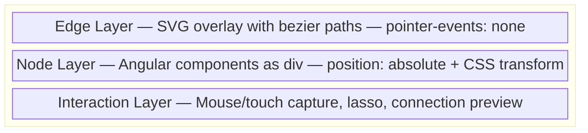
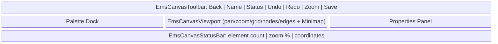

# EMSIST Canvas Engine — Low-Level Design (LLD)

> **Document Type:** Low-Level Design (C4 Level 3-4)
> **Owner:** Solution Architect
> **Status:** [PLANNED] — Design complete, no code exists yet
> **Last Updated:** 2026-03-18
> **Library:** `@emsist/canvas-engine`
> **References:** Co-designed with project owner; React Flow source code as interaction reference

---

## Table of Contents

1. [Overview](#1-overview)
2. [Core Architecture](#2-core-architecture)
3. [Object Definition (Template)](#3-object-definition-template)
4. [Object Instance (Canvas Element)](#4-object-instance-canvas-element)
5. [Shape System](#5-shape-system)
6. [Edge System](#6-edge-system)
7. [Engine Services](#7-engine-services)
8. [Canvas Sub-Components](#8-canvas-sub-components)
9. [Canvas State & Persistence](#9-canvas-state--persistence)
10. [Interaction Model](#10-interaction-model)
11. [Design Token Integration](#11-design-token-integration)
12. [Testing Strategy](#12-testing-strategy)
13. [File Structure](#13-file-structure)
14. [Migration Path from bpmn.js](#14-migration-path-from-bpmnjs)
15. [Multi-Language Support](#15-multi-language-support)
16. [Access Control](#16-access-control)
17. [Storage & Multi-Tenancy](#17-storage--multi-tenancy)
18. [Open Items & Future Considerations](#18-open-items--future-considerations)

---

## 1. Overview

### 1.1 Purpose

A single, reusable Angular canvas component (`<ems-canvas>`) that renders visual flow editors for multiple domains. The canvas type determines which object definitions are available. All domains share the same engine, interaction model, and design system.

### 1.2 Key Design Decisions

| Decision | Choice | Rationale |
|----------|--------|-----------|
| One canvas, type-driven | `<ems-canvas [type]="'ai-pipeline'">`| Canvas type = configuration, not separate components |
| Rendering approach | HTML nodes + SVG edges (hybrid) | Same architecture as React Flow / Flowise. PrimeNG works natively inside nodes |
| State management | Angular Signals | Reactive, fine-grained, no RxJS overhead for UI state |
| Design system | EMSIST tokens only (`--tp-*`, `--nm-*`) | Zero drift. Teal, beige, warm accent, Gotham Rounded, neumorphic elevation |
| TypeScript | Strict mode, no `any` types | Full type safety across definitions, instances, edges |
| Interaction quality | Port React Flow's interaction logic | Source code available in Flowise repo. Same math, same feel |
| bpmn.js | Replace entirely | Clone logic (element types, validation, RACI/KPI extensions), build native rendering |

### 1.3 Canvas Types (Planned)

| Type | Domain | Object Categories |
|------|--------|-------------------|
| `ai-pipeline` | AI/LLM workflows (Flowise-equivalent) | Chat Models, Vector Stores, Chains, Tools, Embeddings, Retrievers, Agents |
| `bpmn` | BPMN 2.0 process modeling | Events, Tasks, Gateways, Containers, Data, Artifacts |
| `service-arch` | Service architecture | Services, APIs, Databases, Queues, Gateways, Caches |
| `app-model` | Application modeling | Screens, Components, Data Flows, States, Navigation |

First canvas to build: **ai-pipeline** (validates the engine against Flowise benchmark).

---

## 2. Core Architecture

### 2.1 Component API

```typescript
@Component({
  selector: 'ems-canvas',
  standalone: true
})
export class EmsCanvasComponent {
  // Signal inputs (Angular 21)
  type = input.required<string>();                         // canvas type → loads object definitions
  instances = input<ObjectInstance[]>([]);                  // objects on the canvas
  edges = input<EdgeInstance[]>([]);                        // connections between objects

  // Outputs
  instanceAdded = output<ObjectInstance>();
  instanceRemoved = output<string>();
  instanceMoved = output<{ id: string; position: Position }>();
  instancePropertyChanged = output<{ id: string; key: string; value: PropertyValue }>();
  edgeCreated = output<EdgeInstance>();
  edgeRemoved = output<string>();
  selectionChanged = output<string[]>();
  canvasSaved = output<CanvasState>();
}
```

### 2.2 Rendering Layers



---

## 3. Object Definition (Template)

An Object Definition is a template stored in the palette. It defines **what** can be placed on the canvas and **how** it looks and behaves.

```typescript
export interface ObjectDefinition {
  // Identity
  type: string;                          // unique key: 'chat-openai', 'bpmn:UserTask'
  label: string;                         // display name
  category: string;                      // palette group
  description?: string;                  // tooltip

  // Shape configuration
  shape: ShapeConfig;

  // Ports (connection points)
  inputs: PortDefinition[];
  outputs: PortDefinition[];

  // Property schema (what the properties panel shows)
  properties: PropertySchema[];

  // Validation rules
  rules?: ValidationRule[];

  // Palette display
  paletteIcon: string;                   // SVG path or PrimeIcon
  paletteSortOrder: number;
  paletteExpandable?: boolean;
  paletteSubItems?: PaletteSubItem[];    // for expandable items (e.g., event types)
}
```

---

## 4. Object Instance (Canvas Element)

An Object Instance is a concrete element on the canvas, created by dropping an Object Definition from the palette.

```typescript
/** Property values stored on instances — no `any` types. */
export type PropertyValue = string | number | boolean | string[] | null;

export interface ObjectInstance {
  id: string;                            // unique: 'chatOpenAI_1'
  definitionType: string;                // reference to ObjectDefinition.type
  label: string;                         // user-editable display name

  // Position on canvas
  position: { x: number; y: number };
  size?: { width: number; height: number };  // overrides definition default if resized

  // Instance property values
  properties: Record<string, PropertyValue>;

  // State
  locked?: boolean;
  status?: 'idle' | 'running' | 'success' | 'error';

  // Metadata
  createdAt?: Date;
  modifiedAt?: Date;
}
```

---

## 5. Shape System

A Shape is a class that defines the complete visual configuration of an object definition. It is NOT a simple string — it carries stroke, fill, size, markers, icon, and visual state configuration.

### 5.1 ShapeConfig Interface

```typescript
export interface ShapeConfig {
  // Geometry
  form: 'rectangle' | 'rounded-rectangle' | 'circle' | 'diamond'
      | 'pill' | 'hexagon' | 'stadium';
  defaultSize: { width: number; height: number | 'auto' };
  minSize?: { width: number; height: number };
  resizable?: boolean;

  // Visual
  strokeColor: string;                   // CSS token: 'var(--tp-primary)' or BPMN semantic token: 'var(--tp-bpmn-start-stroke)'
  fillColor: string;                     // CSS token: 'var(--tp-surface)' or BPMN semantic token: 'var(--tp-bpmn-start-fill)'
  strokeWidth: number;                   // default: 2
  borderRadius?: number;                 // for rectangles (uses --nm-radius by default: 16px)
  shadow?: string;                       // CSS token: 'var(--tp-elevation-default)'

  // Header (optional — for card-style nodes like Flowise)
  header?: {
    backgroundColor: string;             // 'var(--tp-primary)'
    textColor: string;                   // 'var(--tp-on-primary)'
    showIcon: boolean;
    showCategory: boolean;
  };

  // Icon / marker inside the shape
  icon?: {
    svg?: string;                        // inline SVG or asset path
    primeIcon?: string;                  // PrimeIcon name
    position: 'center' | 'top-left' | 'header';
    size: number;                        // pixels
    color?: string;
  };

  // Visual states
  states: {
    default: ShapeVisualState;
    hover: ShapeVisualState;
    selected: ShapeVisualState;
    dragging: ShapeVisualState;
    error?: ShapeVisualState;
    running?: ShapeVisualState;
    success?: ShapeVisualState;
  };
}

export interface ShapeVisualState {
  strokeColor?: string;
  fillColor?: string;
  strokeWidth?: number;
  shadow?: string;
  outline?: string;                      // 'var(--tp-focus-ring)'
  opacity?: number;
  scale?: number;                        // e.g., 1.02 for hover lift
}
```

### 5.2 BPMN Semantic Color Tokens

BPMN shapes use domain-specific colors that differ from the core EMSIST palette. These are defined as dedicated CSS custom properties so they remain token-governed (not hardcoded hex):

```css
:root {
  /* BPMN semantic tokens — registered by canvas engine when type='bpmn' */
  --tp-bpmn-start-stroke: #52B415;
  --tp-bpmn-start-fill: #E8F5E9;
  --tp-bpmn-intermediate-stroke: #F97316;
  --tp-bpmn-intermediate-fill: #FFF7ED;
  --tp-bpmn-boundary-stroke: #8B5CF6;
  --tp-bpmn-boundary-fill: #F5F3FF;
  --tp-bpmn-end-stroke: #C02520;
  --tp-bpmn-end-fill: #FFEBEE;
  --tp-bpmn-end-stroke-width: 3;
  --tp-bpmn-task-stroke: var(--tp-primary);  /* #047481 / #428177 */
  --tp-bpmn-task-fill: var(--tp-white);
  --tp-bpmn-gateway-stroke: var(--tp-border); /* #b9a779 */
  --tp-bpmn-gateway-fill: #FFF8E1;
  --tp-bpmn-data-stroke: #585858;
  --tp-bpmn-data-fill: #F5F7FA;
}
```

### 5.3 Shape Examples by Canvas Type

**AI Pipeline (Flowise-style card nodes):**
```typescript
const chatOpenAiShape: ShapeConfig = {
  form: 'rounded-rectangle',
  defaultSize: { width: 200, height: 'auto' },
  strokeColor: 'var(--tp-primary)',
  fillColor: 'var(--tp-white)',
  strokeWidth: 2,
  borderRadius: 12,
  shadow: 'var(--tp-elevation-default)',
  header: {
    backgroundColor: 'var(--tp-primary)',
    textColor: 'var(--tp-on-primary)',
    showIcon: true,
    showCategory: true
  },
  states: {
    default: {},
    hover: { shadow: 'var(--tp-elevation-hover)', scale: 1.01 },
    selected: { outline: 'var(--tp-focus-ring)' },
    dragging: { opacity: 0.85 }
  }
};
```

**BPMN Start Event (circle, green):**
```typescript
const startEventShape: ShapeConfig = {
  form: 'circle',
  defaultSize: { width: 36, height: 36 },
  strokeColor: 'var(--tp-bpmn-start-stroke)',
  fillColor: 'var(--tp-bpmn-start-fill)',
  strokeWidth: 2,
  icon: { svg: 'assets/icons/bpmn/start-event-none.svg', position: 'center', size: 18 },
  states: {
    default: {},
    hover: { strokeWidth: 3 },
    selected: { outline: 'var(--tp-focus-ring)', strokeWidth: 3 },
    dragging: { opacity: 0.8 }
  }
};
```

**BPMN Gateway (diamond, gold):**
```typescript
const exclusiveGatewayShape: ShapeConfig = {
  form: 'diamond',
  defaultSize: { width: 50, height: 50 },
  strokeColor: 'var(--tp-bpmn-gateway-stroke)',
  fillColor: 'var(--tp-bpmn-gateway-fill)',
  strokeWidth: 2,
  icon: { svg: 'assets/icons/bpmn/gateway-xor.svg', position: 'center', size: 20 },
  states: {
    default: {},
    hover: { strokeWidth: 3 },
    selected: { outline: 'var(--tp-focus-ring)' },
    dragging: { opacity: 0.8 }
  }
};
```

### 5.4 Shape Renderer

The canvas has one `ShapeRendererComponent` that reads the `ShapeConfig` and renders the appropriate HTML/SVG:

```typescript
@Component({ selector: 'ems-shape-renderer', standalone: true })
export class ShapeRendererComponent {
  definition = input.required<ObjectDefinition>();
  instance = input.required<ObjectInstance>();
  state = input<ShapeStateName>('default');
}

type ShapeStateName = 'default' | 'hover' | 'selected' | 'dragging' | 'error' | 'running' | 'success';
```

The renderer dynamically applies styles from `ShapeConfig.states[currentState]` merged with the default state.

---

## 6. Edge System

### 6.1 Edge Instance

```typescript
export interface EdgeInstance {
  id: string;
  sourceInstanceId: string;
  sourcePortId: string;
  targetInstanceId: string;
  targetPortId: string;
  label?: string;
  type?: 'bezier' | 'step' | 'straight';  // default: 'bezier'
  animated?: boolean;                       // show flow dot
}
```

### 6.2 Port Definition

```typescript
export interface PortDefinition {
  id: string;
  label: string;
  dataType: string;              // controls connection compatibility
  position?: 'left' | 'right' | 'top' | 'bottom';
  multiple?: boolean;            // accept multiple connections
  maxConnections?: number;       // limit connections (e.g., LLM input accepts exactly 1)
  required?: boolean;            // validation: must be connected
}
```

### 6.3 Edge Rendering

Edges are SVG `<path>` elements. Bezier control points are calculated using the same algorithm as React Flow, with position-aware branching:

```typescript
function getBezierPath(
  sourceX: number, sourceY: number,
  targetX: number, targetY: number,
  sourcePosition: Position,
  targetPosition: Position
): string {
  // Horizontal ports (left/right) — offset on X axis
  if (sourcePosition === 'right' || sourcePosition === 'left') {
    const offset = Math.abs(targetX - sourceX) * 0.5;
    const signSource = sourcePosition === 'right' ? 1 : -1;
    const signTarget = targetPosition === 'left' ? -1 : 1;
    return `M ${sourceX},${sourceY} C ${sourceX + offset * signSource},${sourceY} ${targetX + offset * signTarget},${targetY} ${targetX},${targetY}`;
  }
  // Vertical ports (top/bottom) — offset on Y axis
  const offset = Math.abs(targetY - sourceY) * 0.5;
  const signSource = sourcePosition === 'bottom' ? 1 : -1;
  const signTarget = targetPosition === 'top' ? -1 : 1;
  return `M ${sourceX},${sourceY} C ${sourceX},${sourceY + offset * signSource} ${targetX},${targetY + offset * signTarget} ${targetX},${targetY}`;
}
```

> **Note:** The full implementation will be ported directly from React Flow's `getBezierPath` in `@reactflow/core/dist/esm/components/Edges/utils.js`. The above shows the approach; the production code will match React Flow's exact math including edge cases.

### 6.4 Edge Behaviors

- **Animated flow dot**: SVG `<circle>` with `<animateMotion>` along edge path
- **Edge shadow**: secondary path with lower opacity for depth
- **Interactive preview**: live bezier follows cursor while dragging from port
- **Valid target glow**: compatible ports glow with `var(--tp-focus-ring)` during connection drag
- **Selection**: click edge to select, delete button at midpoint
- **Labels**: HTML `<foreignObject>` at edge midpoint (for BPMN conditions)

---

## 7. Engine Services

All services use Angular Signals. No RxJS for UI state.

| Service | Responsibility | Key Signals |
|---------|---------------|-------------|
| **ViewportService** | Pan, zoom, fit-to-view | `zoom`, `panX`, `panY`, `transform` (computed) |
| **SelectionService** | Single/multi select, lasso, keyboard | `selectedIds`, `hasSelection` |
| **DragService** | Node drag, snap-to-grid, drop from palette | `isDragging`, `dragOffset`, `snapGuides` |
| **ConnectionService** | Port-to-port wiring, dataType validation, preview | `isConnecting`, `previewEdge`, `validTargets` |
| **HistoryService** | Undo/redo command stack | `canUndo`, `canRedo` |
| **LayoutService** | Auto-layout (dagre), alignment guides | — |
| **ClipboardService** | Copy/paste/duplicate | `canPaste` |
| **ValidationService** | Run rules from object definitions | `errors`, `warnings` |
| **DefinitionRegistryService** | Load/cache object definitions by canvas type | `definitions`, `categories` |

### 7.1 Interaction Logic (Ported from React Flow)

The following behaviors are ported directly from React Flow source code:

| Behavior | React Flow Source | Angular Implementation |
|----------|-------------------|----------------------|
| Zoom with wheel | `useZoom` via d3-zoom | `ViewportService` — same d3-zoom math, CSS transform |
| Pan with mouse drag | `usePanOnDrag` | `ViewportService` — mousedown/mousemove on viewport |
| Node drag with snap | `useDrag` | `DragService` — snap-to-grid with configurable grid size |
| Connection preview | `ConnectionLine` component | `ConnectionService` — SVG path follows cursor |
| Port hover detection | Handle component hit testing | `ConnectionService` — DOM element proximity check |
| Multi-select box | `SelectionRect` | `SelectionService` — SVG rect overlay |
| Zoom inertia | d3-zoom transition | CSS `transition: transform 0.1s ease` on viewport |
| Fit-to-view | `fitView` utility | `ViewportService` — compute bounding box of all instances |

---

## 8. Canvas Sub-Components

### 8.1 Layout



### 8.2 Palette Dock

Reuses the macOS-dock-style pattern from frontendold's `BpmnPaletteDockerComponent`:
- Vertical icon strip on left edge
- Expandable hover panels for categories with sub-items
- Drag-and-drop from palette to canvas
- Items loaded from `DefinitionRegistryService` based on canvas type
- Neumorphic styling: elevation via `var(--nm-elevation-default)`, background `var(--nm-bg)`

### 8.3 Properties Panel

- Right-side panel, shown when an instance is selected
- Dynamically renders form fields from `ObjectDefinition.properties` schema
- Uses PrimeNG form components (InputText, Dropdown, InputSwitch, InputNumber, Textarea)
- All styled with EMSIST tokens
- Shows connection list for selected instance

### 8.4 Minimap

- Bottom-right overlay
- Scaled-down view of all instances as colored rectangles
- Viewport indicator rectangle (draggable for navigation)
- Toggleable via toolbar

---

## 9. Canvas State & Persistence

### 9.1 CanvasState

```typescript
export interface CanvasState {
  id: string;
  name: string;
  canvasType: string;
  /** Serialization schema version for migration support. Format: semver (e.g., '1.0.0'). */
  schemaVersion: string;
  lastModified: Date;
  /** User ID from JWT `sub` claim (Keycloak subject). */
  createdBy: string;
  /** Tenant ID from tenant-resolver (multi-tenant isolation). */
  tenantId: string;

  instances: ObjectInstance[];
  edges: EdgeInstance[];
  viewport: { x: number; y: number; zoom: number };

  metadata?: Record<string, PropertyValue>;
}
```

### 9.2 Persistence

Persistence format depends on canvas type:

| Canvas Type | Primary Format | Secondary Format | Rationale |
|-------------|---------------|-----------------|-----------|
| `bpmn` | **BPMN 2.0 XML** | JSON (CanvasState) | XML is mandatory for interoperability with external tools (ARIS, MEGA HOPEX, Camunda). JSON copy kept for fast canvas loading. |
| `ai-pipeline` | JSON (CanvasState) | — | No interoperability standard for AI pipelines |
| `service-arch` | JSON (CanvasState) | — | No interoperability standard |
| `app-model` | JSON (CanvasState) | — | No interoperability standard |

**BPMN dual persistence:**
- **Save:** Canvas engine serializes `CanvasState` to JSON (fast reload) AND converts to BPMN 2.0 XML via `bpmn-xml.util.ts` (interoperability). Both are stored.
- **Load:** Reads JSON for fast canvas rendering. XML is the source of truth for import/export with external tools.
- **Import from external tool:** Parses BPMN XML → converts to `CanvasState` → generates JSON copy.
- **Export:** Always exports valid BPMN 2.0 XML with BPMN DI (diagram interchange) for layout preservation.

**Backend:**
- All canvas types persisted via `modeler-service` — a dedicated backend service for canvas CRUD, versioning, and import/export
- `modeler-service` `/api/v1/models` — stores CanvasState (JSON) and BPMN XML where applicable
- Single service for all canvas types — the `canvasType` field determines storage and export behavior

**Definition sources:**
- `ai-pipeline` and `service-arch`: TypeScript constants in `definitions/*.definitions.ts`
- `bpmn`: loaded from backend API (`/api/process/element-types` → `BpmnElementTypeDTO[]`)

**Auto-save:** debounced (configurable interval)

### 9.4 Unsaved Work Recovery

Page refresh, browser crash, or accidental navigation must not lose work. The canvas engine maintains a local recovery copy that the user can choose to restore.

**Mechanism:**
- On every state change (node move, property edit, edge create, etc.), the canvas writes the current `CanvasState` to `IndexedDB` (keyed by `canvasId + userId`)
- Write is debounced (default: 2 seconds) to avoid excessive I/O
- The recovery entry includes a timestamp and dirty flag

**Recovery flow:**
1. User opens a canvas
2. Engine checks IndexedDB for a recovery entry newer than the last server-saved version
3. If found, shows a PrimeNG dialog: *"Unsaved changes from [timestamp] were found. Restore or discard?"*
4. **Restore** → loads the recovery state onto the canvas
5. **Discard** → deletes the recovery entry, loads server version
6. After successful server save, the recovery entry is cleared

**User preferences** (stored in user settings):
- `recovery.enabled`: boolean (default: true)
- `recovery.autoRestoreWithoutPrompt`: boolean (default: false) — if true, silently restores without asking
- `recovery.maxAge`: number in hours (default: 48) — recovery entries older than this are auto-discarded

**Storage:**
- IndexedDB via Angular CDK or lightweight wrapper (not localStorage — CanvasState can exceed 5MB for large diagrams)
- One DB per tenant: `emsist-modeler-recovery-{tenantId}`
- Entries auto-pruned on app startup if older than `maxAge`

### 9.3 Schema Versioning

- `schemaVersion` tracks the serialization format (not business version)
- When `ObjectDefinition` property schemas change, a migration function converts old `CanvasState` to new format
- Migration registry: `canvas-engine/migrations/` with versioned migration functions
- On load: compare `schemaVersion` against current → run migrations if needed
- Unknown `definitionType` at load time: render as a generic placeholder node with a warning badge, preserving all data

---

## 10. Interaction Model

### 10.1 Mouse / Touch Interactions

| Action | Behavior |
|--------|----------|
| Scroll wheel | Zoom in/out (centered on cursor) |
| Click + drag on canvas | Pan |
| Click + drag on node | Move node (snap-to-grid if enabled) |
| Click node | Select (deselect others) |
| Ctrl/Cmd + click node | Add to selection |
| Drag from output port | Start connection — bezier preview follows cursor |
| Release on input port | Create edge (if dataType compatible) |
| Delete key | Remove selected instances/edges |
| Ctrl/Cmd + Z | Undo |
| Ctrl/Cmd + Shift + Z | Redo |
| Ctrl/Cmd + C / V | Copy / paste selected |
| Ctrl/Cmd + D | Duplicate selected |
| Ctrl/Cmd + A | Select all |
| Double-click node | Open inline edit (label) |
| Right-click node | Context menu (delete, duplicate, change type) |
| Drag from palette | Drop creates new instance at cursor position |
| Ctrl/Cmd + 0 | Fit to view |
| Ctrl/Cmd + +/- | Zoom in/out |

### 10.2 Grid & Snapping

- Configurable grid size (default: 24px)
- Dot grid rendered with CSS `radial-gradient`
- Snap-to-grid on node drag (optional, toggleable)
- Alignment guides shown when nodes align with others

---

## 11. Design Token Integration

### 11.1 Token Usage

Every visual property maps to a verified EMSIST design token from `styles.scss` and `advanced-css-governance.scss`:

| Canvas Element | Token | Resolved Value |
|---------------|-------|----------------|
| Node border (default) | `var(--tp-primary)` | #428177 |
| Node fill | `var(--tp-white)` | #ffffff |
| Node header bg | `var(--tp-primary)` | #428177 |
| Node text | `var(--tp-text)` | #3d3a3b |
| Canvas background | `var(--tp-bg)` | #edebe0 |
| Grid dots | `var(--tp-border)` at 20% opacity | #b9a779 |
| Edge stroke | `var(--tp-primary)` | #428177 |
| Selection outline | `var(--tp-focus-ring)` | 0 0 0 3px color-mix(...) |
| Hover elevation | `var(--tp-elevation-hover)` | aliased from --nm-elevation-hover |
| Default elevation | `var(--tp-elevation-default)` | aliased from --nm-elevation-default |
| Pressed elevation | `var(--tp-elevation-pressed)` | aliased from --nm-elevation-pressed |
| Panel backgrounds | `var(--nm-bg)` | #edebe0 |
| Port dots | `var(--tp-primary)` with white border | #428177 |
| Toolbar bg | `var(--tp-white)` | #ffffff |
| Spacing | `var(--tp-space-*)` scale | 4px base |
| Border radius | `var(--nm-radius)` | 16px |
| Transitions | `all 0.2s ease` (inline, no token yet) | — |
| Touch target min | `var(--tp-touch-target-min-size)` | 44px |
| Font | Gotham Rounded | via global stylesheet |

### 11.2 No Dark Mode

The canvas uses EMSIST's light theme only. No dark mode selector. No theme switching.

### 11.3 Accessibility

- Focus ring: `var(--tp-focus-ring)` on keyboard navigation
- Touch targets: minimum `var(--tp-touch-target-min-size)` (44px)
- ARIA labels on all interactive elements
- Keyboard navigation for nodes and toolbar
- WCAG 2.2 AA baseline

---

## 12. Testing Strategy

### 12.1 Unit Tests (Vitest)

- ViewportService: zoom calculations, pan bounds, transform computation
- SelectionService: single/multi select, lasso geometry
- ConnectionService: dataType compatibility, edge validation, maxConnections enforcement
- HistoryService: undo/redo stack, command merging
- ShapeRendererComponent: correct CSS from ShapeConfig states (assert DOM class/style via `@testing-library/angular`)
- Bezier path calculation: control point math for both horizontal and vertical ports

### 12.2 Integration Tests (Vitest + Angular TestBed)

- Drag from palette → instance created with correct defaults
- Connect two ports → edge created, validation passes
- Connect beyond maxConnections → rejected
- Undo → instance removed, redo → instance restored
- Canvas type change → palette reloads, definitions change
- Load canvas with unknown definitionType → placeholder node rendered

### 12.3 E2E Tests (Playwright)

- Full drag-and-drop flow: palette → canvas → connect → save
- Zoom and pan interactions
- Properties panel: edit values, verify persistence
- Multi-select and bulk operations
- Keyboard shortcuts
- Responsive layout (desktop, tablet)
- Visual regression against Flowise screenshots (baseline comparison)

### 12.4 Performance Benchmarks

- 100 nodes + 150 edges: smooth 60fps pan/zoom
- 500 nodes: acceptable performance with virtualization (see Section 15)
- Initial render time < 500ms for typical canvas

---

## 13. File Structure

```
frontend/src/app/shared/canvas-engine/
├── canvas.component.ts                  // <ems-canvas> main component
├── canvas.component.html
├── canvas.component.scss
├── models/
│   ├── object-definition.model.ts       // ObjectDefinition, ShapeConfig, PortDefinition
│   ├── object-instance.model.ts         // ObjectInstance, EdgeInstance, PropertyValue
│   ├── canvas-state.model.ts            // CanvasState
│   └── validation.model.ts             // ValidationRule, ValidationError
├── services/
│   ├── viewport.service.ts
│   ├── selection.service.ts
│   ├── drag.service.ts
│   ├── connection.service.ts
│   ├── history.service.ts
│   ├── layout.service.ts
│   ├── clipboard.service.ts
│   ├── validation.service.ts
│   └── definition-registry.service.ts
├── components/
│   ├── shape-renderer/                  // renders ObjectDefinition shape
│   ├── port/                            // connection port handle
│   ├── edge-renderer/                   // SVG bezier/step/straight
│   ├── palette-dock/                    // left-side palette
│   ├── properties-panel/               // right-side properties
│   ├── toolbar/                         // top toolbar
│   ├── minimap/                         // minimap overlay
│   ├── context-menu/                    // right-click menu
│   └── status-bar/                      // bottom status
├── definitions/
│   ├── ai-pipeline.definitions.ts       // AI pipeline object definitions
│   ├── bpmn.definitions.ts              // BPMN object definitions (migrated)
│   ├── bpmn-tokens.scss                 // BPMN semantic color tokens
│   ├── service-arch.definitions.ts      // Service architecture definitions
│   └── app-model.definitions.ts         // Application model definitions
├── migrations/
│   └── index.ts                         // Schema version migration registry
└── utils/
    ├── bezier.util.ts                   // edge path calculation (ported from React Flow)
    ├── snap.util.ts                     // grid snapping math
    ├── layout.util.ts                   // dagre auto-layout
    ├── geometry.util.ts                 // hit testing, bounding box, intersection
    └── bpmn-xml.util.ts                // BPMN XML ↔ CanvasState conversion
```

---

## 14. Migration Path from bpmn.js

### 14.1 What Gets Migrated

| From (frontendold) | To (canvas-engine) |
|--------------------|--------------------|
| `BpmnElementTypeDTO` (strokeColor, fillColor, strokeWidth, defaultSize, iconSvg) | `ShapeConfig` on each `ObjectDefinition` + BPMN semantic tokens |
| `BpmnModelerService` (undo, redo, zoom, selection, validation) | Individual engine services (ViewportService, HistoryService, etc.) |
| `BpmnPaletteDockerComponent` (dock-style, drag-drop, expandable sub-items) | `EmsCanvasPaletteDockComponent` (same UX, driven by definitions) |
| `bpmn-properties-panel` component | `EmsCanvasPropertiesPanel` (PrimeNG form components) |
| 87 BPMN SVG icons | Reused in `bpmn.definitions.ts` ShapeConfig.icon |
| BPMN 2.0 element types (30+ types) | `bpmn.definitions.ts` ObjectDefinition[] |
| RACI, KPIs, Business Rules, Compliance Tags | Extended properties in BPMN ObjectDefinitions |
| BPMN XML import/export | Separate utility: `bpmn-xml.util.ts` (converts XML ↔ CanvasState) |
| Process documentation extensions | Property schemas on BPMN ObjectDefinitions |

### 14.2 What Gets Dropped

- bpmn.js library dependency
- diagram-js dependency
- All `any` typed wrappers
- Custom `.d.ts` type declarations for bpmn-js
- bpmn-js-properties-panel dependency
- camunda-bpmn-moddle dependency

### 14.3 Migration Order

1. Build canvas engine with AI pipeline definitions (validates engine)
2. Create `bpmn.definitions.ts` with all BPMN element types as ObjectDefinitions
3. Register BPMN semantic color tokens (`bpmn-tokens.scss`)
4. Port BPMN SVG icons to ShapeConfig
5. Build BPMN XML import/export utility
6. Migrate RACI/KPI/compliance as extended property schemas
7. E2E test against existing BPMN canvas behavior

---

## 15. Multi-Language Support

### 15.1 Translatable Attributes

Object definitions and instances have language-dependent attributes that must support translations:

```typescript
/** Translatable string — keyed by locale code. */
export type TranslatableString = Record<string, string>;
// e.g., { 'en': 'Approve Request', 'ar': 'الموافقة على الطلب' }

export interface ObjectDefinition {
  // ... existing fields ...
  label: TranslatableString;           // translated in palette + node header
  description?: TranslatableString;    // translated in tooltip
  // category remains a key — translated via i18n catalog
}

export interface ObjectInstance {
  // ... existing fields ...
  label: TranslatableString;           // user-editable per language
}

export interface PropertySchema {
  // ... existing fields ...
  label: TranslatableString;           // translated in properties panel
}

export interface PortDefinition {
  // ... existing fields ...
  label: TranslatableString;           // translated on port tooltip
}
```

**Active locale** is read from the application's locale service. The canvas renders the current locale's value, falling back to `'en'` if missing.

**Property values** (instance data) are NOT translated — they are domain data, not UI labels. Exception: if a `PropertySchema.type` is `'translatable-text'`, the properties panel renders a multi-language editor.

---

## 16. Access Control

### 16.1 View vs Edit Permissions

Canvas access is governed by two permission levels:

| Permission | Behavior |
|-----------|----------|
| **View** | Canvas renders read-only. Nodes visible but not draggable. Properties panel shows values but fields are disabled. No palette dock. Toolbar shows zoom/fit only. Edges not editable. |
| **Edit** | Full canvas interaction. Drag, connect, edit properties, add/remove nodes. Palette dock visible. Full toolbar. |

```typescript
export interface CanvasPermissions {
  canView: boolean;
  canEdit: boolean;
  canDelete: boolean;
  canExport: boolean;
  canShare: boolean;
}
```

The `<ems-canvas>` component accepts permissions as an input:

```typescript
permissions = input<CanvasPermissions>({ canView: true, canEdit: false, canDelete: false, canExport: false, canShare: false });
```

Permissions are resolved by the parent page from the user's roles (ADMIN, SUPER_ADMIN, TENANT_ADMIN, USER, VIEWER) via the existing EMSIST RBAC system.

### 16.2 Model Locking (Pessimistic Lock)

When a user opens a model for editing, it must be locked to prevent concurrent edits:

**Lock flow:**
1. User clicks "Edit" on a model → frontend calls `POST /api/v1/models/{id}/lock`
2. `modeler-service` checks if model is already locked by another user
   - If locked → returns `409 Conflict` with lock holder info → frontend shows: *"Model is being edited by [user]. Open in read-only mode?"*
   - If unlocked → creates lock record → returns `200 OK` → canvas enters edit mode
3. Lock record stores: `modelId`, `lockedBy` (userId), `lockedAt` (timestamp), `expiresAt` (TTL)
4. Lock TTL default: 30 minutes. Frontend sends heartbeat every 5 minutes to extend
5. On save or close → `DELETE /api/v1/models/{id}/lock` releases the lock
6. Expired locks are auto-released by backend scheduled task

```typescript
export interface ModelLock {
  modelId: string;
  lockedBy: string;           // userId from JWT sub
  lockedByName: string;       // display name for UI
  lockedAt: Date;
  expiresAt: Date;
}
```

**Edge cases:**
- Browser crash → lock expires after TTL, no data loss (recovery in Section 9.4)
- User navigates away without saving → `beforeunload` event triggers lock release + recovery write
- Admin can force-unlock any model via admin panel

---

## 17. Storage & Multi-Tenancy

### 17.1 Database Choice

| Data | Database | Rationale |
|------|----------|-----------|
| **CanvasState (JSON)** | PostgreSQL | Structured data, JSONB column for canvas payload, strong query support, existing EMSIST infra |
| **BPMN XML** | PostgreSQL | Stored as TEXT alongside JSON in same row, keeps both representations co-located |
| **Model metadata** (name, type, owner, timestamps, lock) | PostgreSQL | Relational data with foreign keys to tenant/user |
| **Model relationships** (model references other models, traceability links) | Neo4j | Graph relationships: Model → references → Model, Model → implements → Requirement |
| **Recovery data** | IndexedDB (client-side) | No server involvement for crash recovery |
| **Object definitions** | Code (TypeScript) or PostgreSQL | Static definitions in code, tenant-customizable definitions in PostgreSQL |

### 17.2 PostgreSQL Schema

```sql
CREATE TABLE models (
  id UUID PRIMARY KEY DEFAULT gen_random_uuid(),
  tenant_id UUID NOT NULL REFERENCES tenants(id),
  name VARCHAR(255) NOT NULL,
  canvas_type VARCHAR(50) NOT NULL,         -- 'ai-pipeline', 'bpmn', 'service-arch', 'app-model'
  schema_version VARCHAR(20) NOT NULL,       -- serialization version for migrations
  canvas_state JSONB NOT NULL,               -- CanvasState payload
  bpmn_xml TEXT,                             -- NULL for non-BPMN types
  status VARCHAR(20) DEFAULT 'draft',        -- 'draft', 'published', 'archived'
  created_by UUID NOT NULL REFERENCES users(id),
  updated_by UUID REFERENCES users(id),
  created_at TIMESTAMPTZ DEFAULT NOW(),
  updated_at TIMESTAMPTZ DEFAULT NOW(),

  -- Multi-tenancy isolation
  CONSTRAINT fk_tenant FOREIGN KEY (tenant_id) REFERENCES tenants(id)
);

-- Tenant isolation index
CREATE INDEX idx_models_tenant ON models(tenant_id);
CREATE INDEX idx_models_tenant_type ON models(tenant_id, canvas_type);
CREATE INDEX idx_models_tenant_status ON models(tenant_id, status);

-- Lock table
CREATE TABLE model_locks (
  model_id UUID PRIMARY KEY REFERENCES models(id) ON DELETE CASCADE,
  locked_by UUID NOT NULL REFERENCES users(id),
  locked_by_name VARCHAR(255),
  locked_at TIMESTAMPTZ DEFAULT NOW(),
  expires_at TIMESTAMPTZ NOT NULL
);

-- Auto-cleanup expired locks
CREATE INDEX idx_model_locks_expires ON model_locks(expires_at);
```

### 17.3 Neo4j Graph Model

Models are also registered as nodes in Neo4j for traceability:

```cypher
// Model node
(:Model {
  id: UUID,
  tenantId: UUID,
  name: String,
  canvasType: String,
  status: String
})

// Relationships
(:Model)-[:REFERENCES]->(:Model)              // model references another model
(:Model)-[:IMPLEMENTS]->(:Requirement)         // traceability to requirements
(:Model)-[:OWNED_BY]->(:User)
(:Model)-[:BELONGS_TO]->(:Tenant)
```

### 17.4 Multi-Tenancy Rules

- Every query includes `tenant_id` filter — no cross-tenant data access
- `modeler-service` extracts `tenantId` from JWT token (via `tenant-resolver`)
- Object definitions can be:
  - **Platform-level**: shared across all tenants (built-in definitions)
  - **Tenant-level**: custom definitions added by TENANT_ADMIN (stored in PostgreSQL, loaded by `DefinitionRegistryService`)
- Models are never shared across tenants (unless explicitly via integration-hub tenant-to-tenant pattern)

---

## 18. Open Items & Future Considerations

### 15.1 Virtualization Strategy

For canvases with 500+ nodes, only nodes within the visible viewport (plus a buffer zone) should be rendered as Angular components. Nodes outside the viewport are represented as lightweight placeholders or removed from DOM entirely. The `ViewportService` tracks visible bounds; the node layer uses this to filter rendered instances. Exact implementation TBD during performance benchmarking.

### 15.2 RTL / i18n

EMSIST has active localization requirements (R06). The canvas must support:
- Palette dock position: left in LTR, right in RTL (or configurable)
- Properties panel: right in LTR, left in RTL
- Port default positions may flip
- Text direction in node labels and properties panel

Implementation deferred to after core engine is validated, but the layout must not hardcode left/right assumptions.

### 15.3 Transition Tokens

The codebase does not yet define `--tp-transition-*` tokens. The canvas uses inline `all 0.2s ease` for now. When the design system adds transition tokens, the canvas will adopt them.
