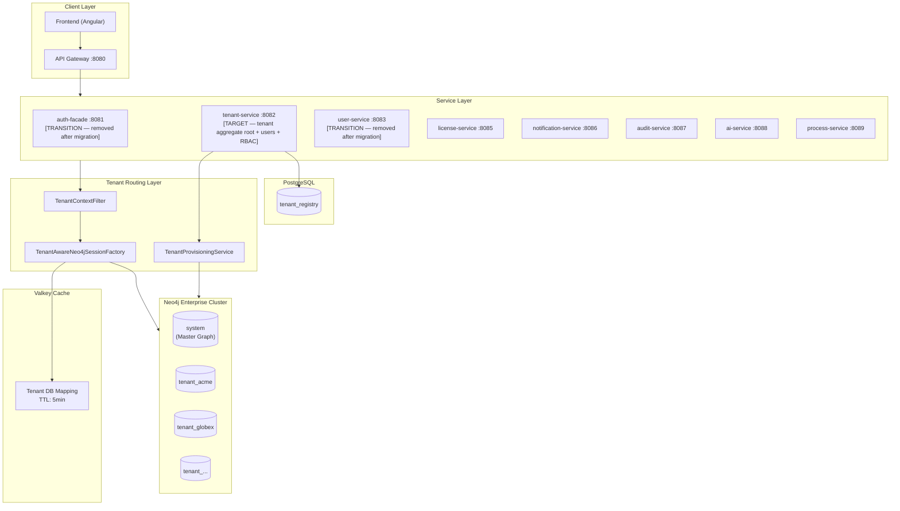
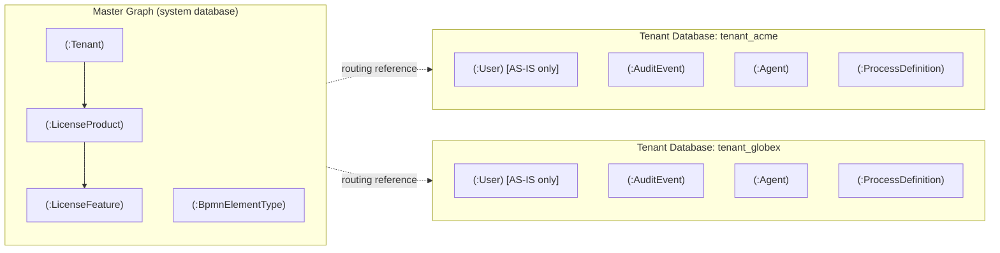
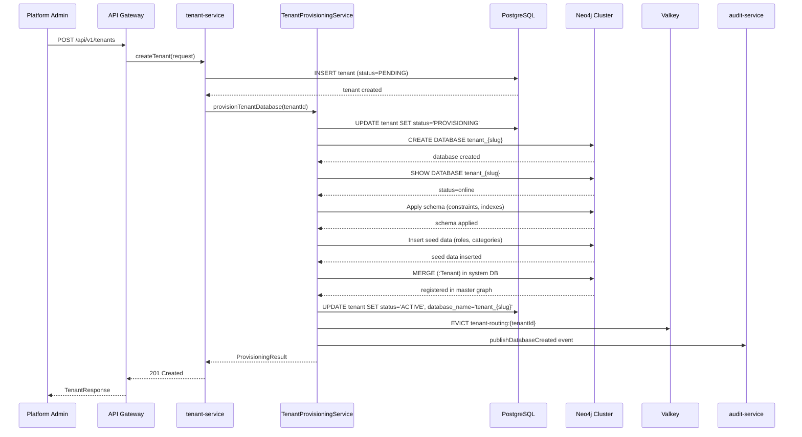
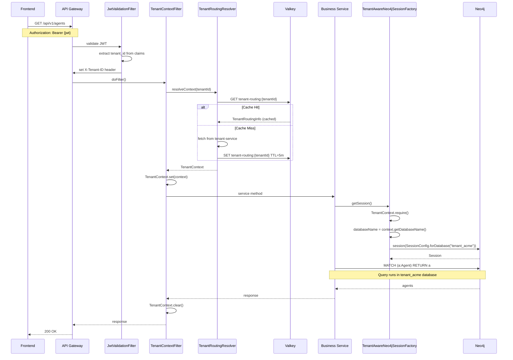
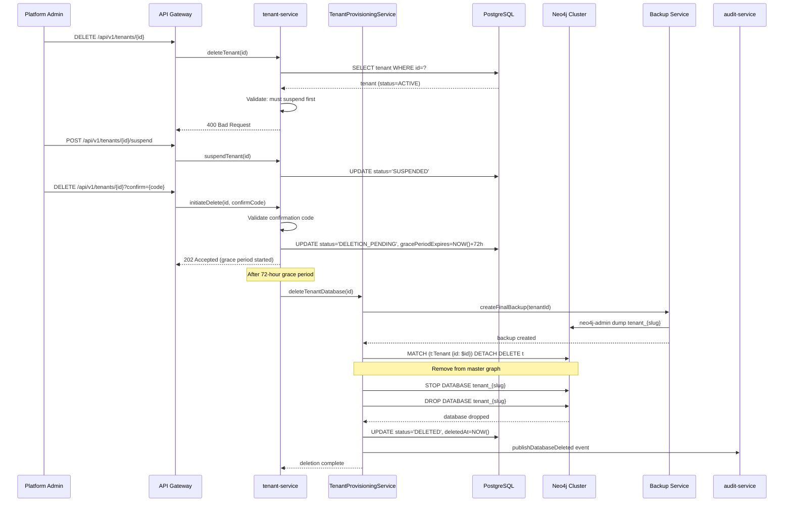
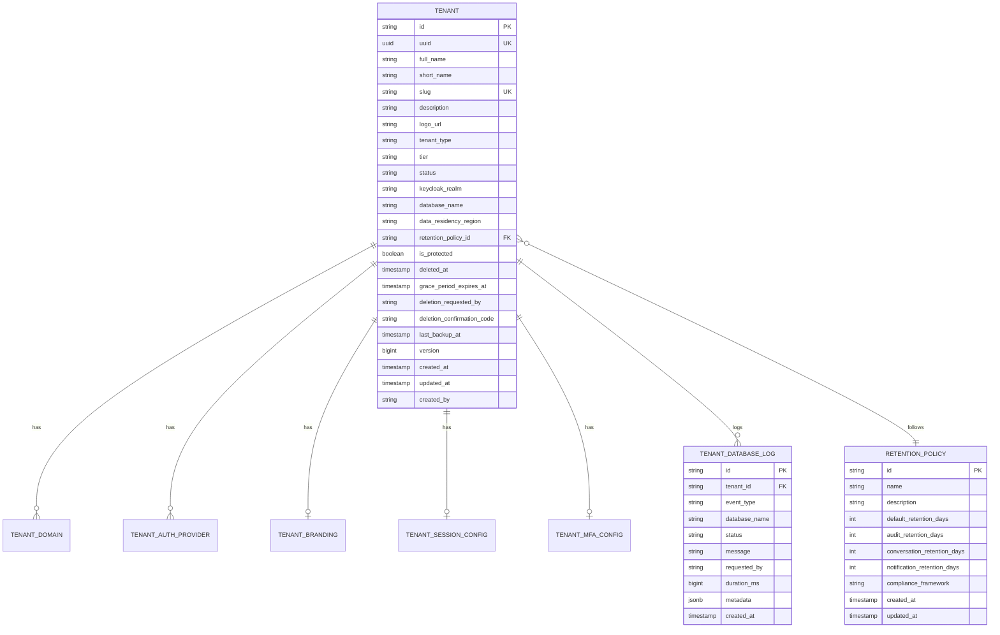
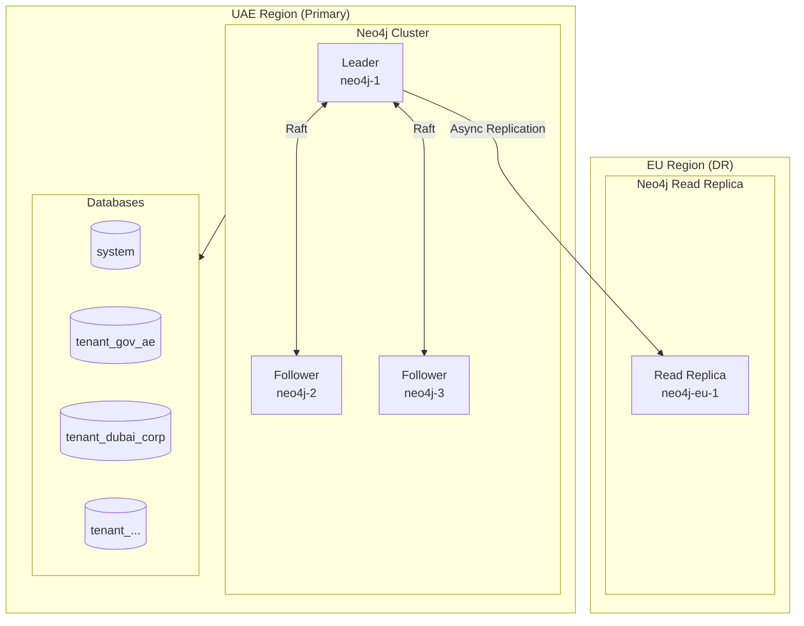

# Low-Level Design: Graph-per-Tenant Isolation

> **WP-ARCH-ALIGN (2026-03-24):** This document has been updated to reflect the frozen auth target model (Rev 2).
> See `Foundation/03-ownership-boundaries.md` § FROZEN for the canonical decision.

**Document Type:** Low-Level Design (LLD)
**Version:** 1.0
**Status:** Draft
**Date:** 2026-02-25
**Author:** SA Agent
**Traceability:** [GRAPH-PER-TENANT-REQUIREMENTS.md](/docs/requirements/GRAPH-PER-TENANT-REQUIREMENTS.md)
**Related Decisions:** [Architecture section 9.1.2](/Users/mksulty/Claude/Projects/Emsist-app/Documentation/Architecture/09-architecture-decisions.md#912-multi-tenancy-strategy-adr-003-adr-010), [Architecture section 9.3.3](/Users/mksulty/Claude/Projects/Emsist-app/Documentation/Architecture/09-architecture-decisions.md#933-neo4j-backed-identity-broker-adr-009)

---

## 1. Executive Summary

This document provides the low-level technical design for implementing graph-per-tenant isolation in the EMS platform using Neo4j Enterprise multi-database architecture. The design covers:

1. **TenantAwareNeo4jSessionFactory** - Dynamic session routing to tenant-specific databases
2. **Database Routing Mechanism** - Request-scoped tenant context propagation
3. **Tenant Provisioning Service** - Automated database creation and schema setup
4. **Multi-Database Connection Pooling** - Efficient connection management across tenant databases

> **Auth Domain Scope Note:** [TARGET] Per the frozen auth target model (Rev 2), Neo4j is removed from the auth target domain. Graph-per-tenant isolation applies to **definition-service** (canonical object types) ONLY. User, Group, Role, and identity-related nodes are **not** part of the target graph-per-tenant scope -- they migrate to tenant-service (PostgreSQL). Any references to User nodes in tenant databases below describe [AS-IS] state only.

---

## 2. Architecture Overview

### 2.1 High-Level Component Diagram



### 2.2 Database Architecture

> [AS-IS] The diagram below shows User nodes inside tenant databases. [TARGET] User nodes migrate to tenant-service (PostgreSQL). Tenant graph databases retain only definition-service data (AuditEvent, Agent, ProcessDefinition, and canonical object types). Neo4j remains for definition-service ONLY.



---

## 3. Component Specifications

### 3.1 TenantContext

Thread-local and Reactor context holder for tenant information.

```java
package com.ems.common.context;

import lombok.Builder;
import lombok.Value;
import reactor.util.context.Context;

import java.util.Optional;

/**
 * Immutable tenant context carrying routing information.
 */
@Value
@Builder
public class TenantContext {

    /** Tenant identifier (e.g., "tenant-abc123") */
    String tenantId;

    /** Tenant slug for database naming (e.g., "acme") */
    String tenantSlug;

    /** Neo4j database name (e.g., "tenant_acme") */
    String databaseName;

    /** Data residency region (e.g., "UAE", "EU") */
    String dataResidencyRegion;

    /** Whether this is the system/master tenant context */
    boolean systemContext;

    // Thread-local storage for imperative code
    private static final ThreadLocal<TenantContext> CURRENT = new ThreadLocal<>();

    // Reactor context key for reactive code
    public static final String REACTOR_CONTEXT_KEY = "TenantContext";

    // ----- Static Factory Methods -----

    /**
     * Create context for a regular tenant.
     */
    public static TenantContext of(String tenantId, String tenantSlug, String region) {
        return TenantContext.builder()
            .tenantId(tenantId)
            .tenantSlug(tenantSlug)
            .databaseName("tenant_" + tenantSlug)
            .dataResidencyRegion(region)
            .systemContext(false)
            .build();
    }

    /**
     * Create context for system database operations.
     */
    public static TenantContext system() {
        return TenantContext.builder()
            .tenantId("system")
            .tenantSlug("system")
            .databaseName("system")
            .dataResidencyRegion("GLOBAL")
            .systemContext(true)
            .build();
    }

    // ----- Thread-Local Operations -----

    public static void set(TenantContext context) {
        CURRENT.set(context);
    }

    public static Optional<TenantContext> current() {
        return Optional.ofNullable(CURRENT.get());
    }

    public static TenantContext require() {
        return current().orElseThrow(() ->
            new IllegalStateException("Tenant context not set. Ensure TenantContextFilter processed the request."));
    }

    public static void clear() {
        CURRENT.remove();
    }

    // ----- Reactor Context Operations -----

    public Context addToReactorContext(Context context) {
        return context.put(REACTOR_CONTEXT_KEY, this);
    }

    public static TenantContext fromReactorContext(Context context) {
        return context.getOrDefault(REACTOR_CONTEXT_KEY, null);
    }
}
```

### 3.2 TenantContextFilter (Enhanced)

Enhanced filter that resolves tenant metadata and sets database routing context.

```java
package com.ems.common.filter;

import com.ems.common.context.TenantContext;
import jakarta.servlet.FilterChain;
import jakarta.servlet.ServletException;
import jakarta.servlet.http.HttpServletRequest;
import jakarta.servlet.http.HttpServletResponse;
import lombok.RequiredArgsConstructor;
import lombok.extern.slf4j.Slf4j;
import org.springframework.core.annotation.Order;
import org.springframework.stereotype.Component;
import org.springframework.web.filter.OncePerRequestFilter;

import java.io.IOException;

/**
 * Filter that extracts tenant context from JWT and resolves database routing information.
 *
 * Priority: Order(1) - Must execute before any data access filters.
 */
@Component
@Order(1)
@RequiredArgsConstructor
@Slf4j
public class TenantContextFilter extends OncePerRequestFilter {

    public static final String TENANT_HEADER = "X-Tenant-ID";
    public static final String TENANT_SLUG_HEADER = "X-Tenant-Slug";

    private final TenantRoutingResolver routingResolver;

    @Override
    protected void doFilterInternal(
            HttpServletRequest request,
            HttpServletResponse response,
            FilterChain filterChain) throws ServletException, IOException {

        try {
            // Extract tenant ID from header (set by JWT filter or API gateway)
            String tenantId = request.getHeader(TENANT_HEADER);

            if (tenantId != null && !tenantId.isBlank()) {
                // Resolve full tenant context including database name
                TenantContext context = routingResolver.resolveContext(tenantId.trim());
                TenantContext.set(context);

                log.debug("Tenant context set: id={}, database={}",
                    context.getTenantId(), context.getDatabaseName());
            }

            filterChain.doFilter(request, response);

        } finally {
            TenantContext.clear();
        }
    }

    @Override
    protected boolean shouldNotFilter(HttpServletRequest request) {
        String path = request.getRequestURI();
        // Skip tenant context for public endpoints
        return path.startsWith("/actuator/")
            || path.startsWith("/api/v1/auth/login")
            || path.startsWith("/api/v1/auth/oauth");
    }
}
```

### 3.3 TenantRoutingResolver

Resolves tenant context from cache or database with caching.

```java
package com.ems.common.routing;

import com.ems.common.context.TenantContext;
import lombok.RequiredArgsConstructor;
import lombok.extern.slf4j.Slf4j;
import org.springframework.cache.annotation.Cacheable;
import org.springframework.stereotype.Component;

/**
 * Resolves tenant routing information with caching.
 *
 * Cache Strategy:
 * - Cache key: "tenant-routing:{tenantId}"
 * - TTL: 5 minutes
 * - Invalidation: On tenant update/delete events
 */
@Component
@RequiredArgsConstructor
@Slf4j
public class TenantRoutingResolver {

    private final TenantRegistryClient tenantRegistryClient;

    /**
     * Resolve tenant context with database routing info.
     * Results are cached for 5 minutes.
     *
     * @param tenantId Tenant identifier
     * @return TenantContext with database routing information
     * @throws TenantNotFoundException if tenant does not exist
     * @throws TenantDatabaseNotReadyException if database is not provisioned
     */
    @Cacheable(value = "tenant-routing", key = "#tenantId", unless = "#result == null")
    public TenantContext resolveContext(String tenantId) {
        log.debug("Resolving tenant routing for: {}", tenantId);

        // Fetch from tenant registry (PostgreSQL via tenant-service)
        TenantRoutingInfo routingInfo = tenantRegistryClient.getRoutingInfo(tenantId);

        // Validate database is ready
        if (routingInfo.getStatus() != TenantStatus.ACTIVE) {
            throw new TenantDatabaseNotReadyException(tenantId, routingInfo.getStatus());
        }

        return TenantContext.of(
            routingInfo.getTenantId(),
            routingInfo.getSlug(),
            routingInfo.getDataResidencyRegion()
        );
    }

    /**
     * Invalidate cached routing info for a tenant.
     * Called when tenant is updated or deleted.
     */
    @CacheEvict(value = "tenant-routing", key = "#tenantId")
    public void invalidateCache(String tenantId) {
        log.info("Invalidated routing cache for tenant: {}", tenantId);
    }
}
```

### 3.4 TenantAwareNeo4jSessionFactory

Core component that provides tenant-scoped Neo4j sessions.

```java
package com.ems.common.neo4j;

import com.ems.common.context.TenantContext;
import lombok.RequiredArgsConstructor;
import lombok.extern.slf4j.Slf4j;
import org.neo4j.driver.Driver;
import org.neo4j.driver.Session;
import org.neo4j.driver.SessionConfig;
import org.neo4j.driver.reactive.RxSession;
import org.springframework.stereotype.Component;
import reactor.core.publisher.Mono;

/**
 * Factory for creating tenant-aware Neo4j sessions.
 *
 * Routing Strategy:
 * 1. Extract tenant context from thread-local or Reactor context
 * 2. Build SessionConfig with target database name
 * 3. Return session bound to tenant database
 *
 * Connection Pooling:
 * - Single Neo4j Driver instance shared across all tenant databases
 * - Neo4j Driver handles connection pooling internally
 * - Pool settings configured in application.yml
 */
@Component
@RequiredArgsConstructor
@Slf4j
public class TenantAwareNeo4jSessionFactory {

    private final Driver neo4jDriver;

    /**
     * Get session for current tenant (imperative).
     * Uses thread-local TenantContext.
     *
     * @return Session bound to tenant database
     * @throws IllegalStateException if tenant context not set
     */
    public Session getSession() {
        TenantContext context = TenantContext.require();
        return createSession(context.getDatabaseName());
    }

    /**
     * Get session for a specific database (explicit routing).
     * Use for system database queries or cross-tenant admin operations.
     *
     * @param databaseName Target database name
     * @return Session bound to specified database
     */
    public Session getSession(String databaseName) {
        return createSession(databaseName);
    }

    /**
     * Get system database session.
     * Use for master graph operations (tenant registry, license products).
     *
     * @return Session bound to system database
     */
    public Session getSystemSession() {
        return createSession("system");
    }

    /**
     * Get reactive session for current tenant.
     * Extracts tenant from Reactor context.
     *
     * @return Mono emitting RxSession bound to tenant database
     */
    public Mono<RxSession> getReactiveSession() {
        return Mono.deferContextual(ctx -> {
            TenantContext context = TenantContext.fromReactorContext(ctx);
            if (context == null) {
                return Mono.error(new IllegalStateException(
                    "Tenant context not found in Reactor context"));
            }
            return Mono.just(createReactiveSession(context.getDatabaseName()));
        });
    }

    /**
     * Get reactive system database session.
     *
     * @return RxSession bound to system database
     */
    public RxSession getReactiveSystemSession() {
        return createReactiveSession("system");
    }

    // ----- Internal Methods -----

    private Session createSession(String databaseName) {
        log.debug("Creating Neo4j session for database: {}", databaseName);

        SessionConfig config = SessionConfig.builder()
            .withDatabase(databaseName)
            .build();

        return neo4jDriver.session(config);
    }

    private RxSession createReactiveSession(String databaseName) {
        log.debug("Creating reactive Neo4j session for database: {}", databaseName);

        SessionConfig config = SessionConfig.builder()
            .withDatabase(databaseName)
            .build();

        return neo4jDriver.rxSession(config);
    }
}
```

### 3.5 TenantAwareNeo4jTemplate

Spring Data Neo4j template wrapper with tenant awareness.

```java
package com.ems.common.neo4j;

import com.ems.common.context.TenantContext;
import lombok.RequiredArgsConstructor;
import org.neo4j.driver.Driver;
import org.springframework.data.neo4j.core.Neo4jClient;
import org.springframework.data.neo4j.core.Neo4jTemplate;
import org.springframework.data.neo4j.core.mapping.Neo4jMappingContext;
import org.springframework.stereotype.Component;

import java.util.Map;
import java.util.concurrent.ConcurrentHashMap;

/**
 * Provides tenant-scoped Neo4jTemplate instances.
 *
 * Caching Strategy:
 * - Templates are cached per database name
 * - Templates are stateless and thread-safe
 * - Cache is bounded by max tenant count
 */
@Component
@RequiredArgsConstructor
public class TenantAwareNeo4jTemplate {

    private final Driver neo4jDriver;
    private final Neo4jMappingContext mappingContext;

    // Cache templates per database (they are stateless/thread-safe)
    private final Map<String, Neo4jTemplate> templateCache = new ConcurrentHashMap<>();

    /**
     * Get Neo4jTemplate for current tenant.
     */
    public Neo4jTemplate getTemplate() {
        TenantContext context = TenantContext.require();
        return getTemplateForDatabase(context.getDatabaseName());
    }

    /**
     * Get Neo4jTemplate for system database.
     */
    public Neo4jTemplate getSystemTemplate() {
        return getTemplateForDatabase("system");
    }

    /**
     * Get Neo4jTemplate for specific database.
     */
    public Neo4jTemplate getTemplateForDatabase(String databaseName) {
        return templateCache.computeIfAbsent(databaseName, this::createTemplate);
    }

    private Neo4jTemplate createTemplate(String databaseName) {
        Neo4jClient client = Neo4jClient.create(neo4jDriver, databaseName);
        return new Neo4jTemplate(client, mappingContext);
    }
}
```

---

## 4. Tenant Provisioning Service

### 4.1 Service Interface

```java
package com.ems.tenant.service;

import com.ems.tenant.dto.*;

/**
 * Service for provisioning and managing tenant Neo4j databases.
 */
public interface TenantProvisioningService {

    /**
     * Provision a new tenant database with full setup.
     *
     * Steps:
     * 1. Validate tenant does not already have a database
     * 2. Create Neo4j database
     * 3. Apply schema constraints and indexes
     * 4. Insert seed data (default roles)
     * 5. Update tenant status to ACTIVE
     * 6. Register in master graph
     *
     * @param request Provisioning request
     * @return Provisioning result with database details
     * @throws DatabaseProvisioningException on failure
     */
    ProvisioningResult provisionTenantDatabase(ProvisioningRequest request);

    /**
     * Delete a tenant database.
     *
     * Requirements:
     * - Tenant must be in DELETION_PENDING status
     * - Grace period must have expired
     *
     * @param tenantId Tenant identifier
     * @throws TenantNotDeletableException if preconditions not met
     */
    void deleteTenantDatabase(String tenantId);

    /**
     * Check database health and metrics.
     *
     * @param tenantId Tenant identifier
     * @return Database status including size, node counts
     */
    DatabaseStatus getDatabaseStatus(String tenantId);

    /**
     * Run schema migration on tenant database.
     *
     * @param tenantId Tenant identifier
     * @param targetVersion Target schema version
     * @return Migration result
     */
    MigrationResult runMigration(String tenantId, String targetVersion);
}
```

### 4.2 Service Implementation

```java
package com.ems.tenant.service;

import com.ems.common.neo4j.TenantAwareNeo4jSessionFactory;
import com.ems.tenant.dto.*;
import com.ems.tenant.entity.TenantEntity;
import com.ems.tenant.exception.*;
import com.ems.tenant.repository.TenantRepository;
import lombok.RequiredArgsConstructor;
import lombok.extern.slf4j.Slf4j;
import org.neo4j.driver.Session;
import org.neo4j.driver.Result;
import org.springframework.retry.annotation.Backoff;
import org.springframework.retry.annotation.Retryable;
import org.springframework.stereotype.Service;
import org.springframework.transaction.annotation.Transactional;

import java.time.Duration;
import java.time.Instant;

/**
 * Implementation of tenant database provisioning.
 *
 * Transaction Strategy:
 * - PostgreSQL: @Transactional for tenant registry updates
 * - Neo4j: Explicit transactions for database operations
 *
 * Retry Strategy:
 * - Max 3 attempts for database creation
 * - Exponential backoff: 1s, 2s, 4s
 */
@Service
@RequiredArgsConstructor
@Slf4j
public class TenantProvisioningServiceImpl implements TenantProvisioningService {

    private final TenantAwareNeo4jSessionFactory sessionFactory;
    private final TenantRepository tenantRepository;
    private final TenantSchemaService schemaService;
    private final TenantSeedDataService seedDataService;
    private final AuditEventPublisher auditPublisher;

    private static final Duration PROVISIONING_TIMEOUT = Duration.ofMinutes(5);

    @Override
    @Transactional
    @Retryable(
        retryFor = DatabaseProvisioningException.class,
        maxAttempts = 3,
        backoff = @Backoff(delay = 1000, multiplier = 2)
    )
    public ProvisioningResult provisionTenantDatabase(ProvisioningRequest request) {
        String tenantId = request.tenantId();
        Instant startTime = Instant.now();

        log.info("Starting database provisioning for tenant: {}", tenantId);

        // 1. Load and validate tenant
        TenantEntity tenant = tenantRepository.findById(tenantId)
            .orElseThrow(() -> new TenantNotFoundException(tenantId));

        if (tenant.getDatabaseName() != null) {
            throw new DatabaseAlreadyExistsException(tenantId, tenant.getDatabaseName());
        }

        String databaseName = "tenant_" + tenant.getSlug();

        try {
            // 2. Update status to PROVISIONING
            tenant.setStatus(TenantStatus.PROVISIONING);
            tenantRepository.save(tenant);

            // 3. Create database
            createDatabase(databaseName);
            log.info("Database created: {}", databaseName);

            // 4. Apply schema
            schemaService.applySchema(databaseName);
            log.info("Schema applied to: {}", databaseName);

            // 5. Insert seed data
            seedDataService.insertSeedData(databaseName, tenant);
            log.info("Seed data inserted to: {}", databaseName);

            // 6. Register in master graph
            registerInMasterGraph(tenant, databaseName);

            // 7. Update tenant status to ACTIVE
            tenant.setDatabaseName(databaseName);
            tenant.setStatus(TenantStatus.ACTIVE);
            tenantRepository.save(tenant);

            Duration duration = Duration.between(startTime, Instant.now());
            log.info("Database provisioning completed for {} in {}ms",
                tenantId, duration.toMillis());

            // Publish audit event
            auditPublisher.publishDatabaseCreated(tenantId, databaseName, request.requestedBy());

            return ProvisioningResult.builder()
                .tenantId(tenantId)
                .databaseName(databaseName)
                .status(ProvisioningStatus.COMPLETED)
                .durationMs(duration.toMillis())
                .build();

        } catch (Exception e) {
            log.error("Database provisioning failed for {}: {}", tenantId, e.getMessage(), e);

            // Cleanup on failure
            cleanupFailedProvisioning(databaseName);

            // Update status to PROVISIONING_FAILED
            tenant.setStatus(TenantStatus.PROVISIONING_FAILED);
            tenantRepository.save(tenant);

            throw new DatabaseProvisioningException(tenantId, e);
        }
    }

    @Override
    @Transactional
    public void deleteTenantDatabase(String tenantId) {
        TenantEntity tenant = tenantRepository.findById(tenantId)
            .orElseThrow(() -> new TenantNotFoundException(tenantId));

        // Validate preconditions
        if (tenant.getStatus() != TenantStatus.DELETION_PENDING) {
            throw new TenantNotDeletableException(tenantId,
                "Tenant must be in DELETION_PENDING status");
        }

        if (tenant.getIsProtected()) {
            throw new TenantNotDeletableException(tenantId,
                "Protected tenants cannot be deleted");
        }

        String databaseName = tenant.getDatabaseName();

        log.info("Deleting database {} for tenant {}", databaseName, tenantId);

        try {
            // 1. Remove from master graph
            removeFromMasterGraph(tenantId);

            // 2. Drop database
            dropDatabase(databaseName);

            // 3. Soft delete tenant record
            tenant.setStatus(TenantStatus.DELETED);
            tenant.setDeletedAt(Instant.now());
            tenantRepository.save(tenant);

            // Publish audit event
            auditPublisher.publishDatabaseDeleted(tenantId, databaseName);

            log.info("Database deletion completed for tenant: {}", tenantId);

        } catch (Exception e) {
            log.error("Database deletion failed for {}: {}", tenantId, e.getMessage(), e);

            tenant.setStatus(TenantStatus.DELETION_FAILED);
            tenantRepository.save(tenant);

            throw new DatabaseDeletionException(tenantId, e);
        }
    }

    @Override
    public DatabaseStatus getDatabaseStatus(String tenantId) {
        TenantEntity tenant = tenantRepository.findById(tenantId)
            .orElseThrow(() -> new TenantNotFoundException(tenantId));

        String databaseName = tenant.getDatabaseName();

        try (Session session = sessionFactory.getSystemSession()) {
            // Query database info from system database
            Result result = session.run("""
                SHOW DATABASE $name YIELD name, currentStatus, sizeInBytes, creationTime
                RETURN name, currentStatus, sizeInBytes, creationTime
                """,
                Map.of("name", databaseName));

            if (result.hasNext()) {
                var record = result.next();
                return DatabaseStatus.builder()
                    .tenantId(tenantId)
                    .databaseName(databaseName)
                    .status(record.get("currentStatus").asString())
                    .sizeBytes(record.get("sizeInBytes").asLong())
                    .createdAt(record.get("creationTime").asZonedDateTime().toInstant())
                    .build();
            }

            throw new DatabaseNotFoundException(databaseName);
        }
    }

    // ----- Internal Methods -----

    private void createDatabase(String databaseName) {
        try (Session session = sessionFactory.getSystemSession()) {
            session.run("CREATE DATABASE $name IF NOT EXISTS WAIT 30 SECONDS",
                Map.of("name", databaseName));

            // Verify database is online
            Result result = session.run("""
                SHOW DATABASE $name YIELD currentStatus
                RETURN currentStatus
                """,
                Map.of("name", databaseName));

            if (result.hasNext()) {
                String status = result.next().get("currentStatus").asString();
                if (!"online".equalsIgnoreCase(status)) {
                    throw new DatabaseProvisioningException(
                        "Database created but not online: " + status);
                }
            }
        }
    }

    private void dropDatabase(String databaseName) {
        try (Session session = sessionFactory.getSystemSession()) {
            // Stop database first
            session.run("STOP DATABASE $name", Map.of("name", databaseName));

            // Drop database
            session.run("DROP DATABASE $name IF EXISTS",
                Map.of("name", databaseName));
        }
    }

    private void registerInMasterGraph(TenantEntity tenant, String databaseName) {
        try (Session session = sessionFactory.getSystemSession()) {
            session.run("""
                MERGE (t:Tenant {id: $tenantId})
                SET t.slug = $slug,
                    t.databaseName = $databaseName,
                    t.status = $status,
                    t.dataResidencyRegion = $region,
                    t.createdAt = datetime()
                """,
                Map.of(
                    "tenantId", tenant.getId(),
                    "slug", tenant.getSlug(),
                    "databaseName", databaseName,
                    "status", tenant.getStatus().name(),
                    "region", tenant.getDataResidencyRegion()
                ));
        }
    }

    private void removeFromMasterGraph(String tenantId) {
        try (Session session = sessionFactory.getSystemSession()) {
            session.run("MATCH (t:Tenant {id: $tenantId}) DETACH DELETE t",
                Map.of("tenantId", tenantId));
        }
    }

    private void cleanupFailedProvisioning(String databaseName) {
        try (Session session = sessionFactory.getSystemSession()) {
            session.run("DROP DATABASE $name IF EXISTS",
                Map.of("name", databaseName));
        } catch (Exception e) {
            log.warn("Failed to cleanup database {}: {}", databaseName, e.getMessage());
        }
    }
}
```

### 4.3 Schema Service

```java
package com.ems.tenant.service;

import com.ems.common.neo4j.TenantAwareNeo4jSessionFactory;
import lombok.RequiredArgsConstructor;
import lombok.extern.slf4j.Slf4j;
import org.neo4j.driver.Session;
import org.springframework.stereotype.Service;

/**
 * Applies schema constraints and indexes to tenant databases.
 */
@Service
@RequiredArgsConstructor
@Slf4j
public class TenantSchemaService {

    private final TenantAwareNeo4jSessionFactory sessionFactory;

    /**
     * Schema version for tracking migrations.
     */
    public static final String CURRENT_SCHEMA_VERSION = "1.0.0";

    /**
     * Apply full schema to a tenant database.
     */
    public void applySchema(String databaseName) {
        try (Session session = sessionFactory.getSession(databaseName)) {
            // User constraints
            session.run("CREATE CONSTRAINT user_id IF NOT EXISTS FOR (u:User) REQUIRE u.id IS UNIQUE");
            session.run("CREATE CONSTRAINT user_keycloak IF NOT EXISTS FOR (u:User) REQUIRE u.keycloakId IS UNIQUE");
            session.run("CREATE INDEX user_email IF NOT EXISTS FOR (u:User) ON (u.email)");

            // Audit constraints
            session.run("CREATE CONSTRAINT audit_id IF NOT EXISTS FOR (a:AuditEvent) REQUIRE a.id IS UNIQUE");
            session.run("CREATE INDEX audit_timestamp IF NOT EXISTS FOR (a:AuditEvent) ON (a.timestamp)");
            session.run("CREATE INDEX audit_type IF NOT EXISTS FOR (a:AuditEvent) ON (a.eventType)");

            // Agent constraints (AI)
            session.run("CREATE CONSTRAINT agent_id IF NOT EXISTS FOR (ag:Agent) REQUIRE ag.id IS UNIQUE");
            session.run("CREATE INDEX agent_name IF NOT EXISTS FOR (ag:Agent) ON (ag.name)");

            // Conversation constraints (AI)
            session.run("CREATE CONSTRAINT conversation_id IF NOT EXISTS FOR (c:Conversation) REQUIRE c.id IS UNIQUE");
            session.run("CREATE INDEX conversation_user IF NOT EXISTS FOR (c:Conversation) ON (c.userId)");

            // Knowledge source constraints (RAG)
            session.run("CREATE CONSTRAINT knowledge_id IF NOT EXISTS FOR (ks:KnowledgeSource) REQUIRE ks.id IS UNIQUE");

            // Chunk constraints with vector index
            session.run("CREATE CONSTRAINT chunk_id IF NOT EXISTS FOR (ch:Chunk) REQUIRE ch.id IS UNIQUE");
            session.run("""
                CREATE VECTOR INDEX chunk_embedding IF NOT EXISTS
                FOR (c:Chunk) ON (c.embedding)
                OPTIONS {indexConfig: {`vector.dimensions`: 1536, `vector.similarity_function`: 'cosine'}}
                """);

            // Process constraints (BPMN)
            session.run("CREATE CONSTRAINT process_def_id IF NOT EXISTS FOR (pd:ProcessDefinition) REQUIRE pd.id IS UNIQUE");
            session.run("CREATE CONSTRAINT process_inst_id IF NOT EXISTS FOR (pi:ProcessInstance) REQUIRE pi.id IS UNIQUE");
            session.run("CREATE CONSTRAINT process_elem_id IF NOT EXISTS FOR (pe:ProcessElement) REQUIRE pe.id IS UNIQUE");

            // Notification constraints
            session.run("CREATE CONSTRAINT notification_id IF NOT EXISTS FOR (n:Notification) REQUIRE n.id IS UNIQUE");
            session.run("CREATE INDEX notification_status IF NOT EXISTS FOR (n:Notification) ON (n.status)");

            // License constraints
            session.run("CREATE CONSTRAINT license_id IF NOT EXISTS FOR (tl:TenantLicense) REQUIRE tl.id IS UNIQUE");

            // Set schema version
            session.run("""
                MERGE (s:SchemaVersion {id: 'current'})
                SET s.version = $version, s.appliedAt = datetime()
                """,
                Map.of("version", CURRENT_SCHEMA_VERSION));

            log.info("Schema applied to database {} (version: {})",
                databaseName, CURRENT_SCHEMA_VERSION);
        }
    }
}
```

### 4.4 Seed Data Service

```java
package com.ems.tenant.service;

import com.ems.common.neo4j.TenantAwareNeo4jSessionFactory;
import com.ems.tenant.entity.TenantEntity;
import lombok.RequiredArgsConstructor;
import lombok.extern.slf4j.Slf4j;
import org.neo4j.driver.Session;
import org.springframework.stereotype.Service;

import java.util.Map;

/**
 * Inserts seed data into newly provisioned tenant databases.
 */
@Service
@RequiredArgsConstructor
@Slf4j
public class TenantSeedDataService {

    private final TenantAwareNeo4jSessionFactory sessionFactory;

    /**
     * Insert default seed data for a new tenant.
     */
    public void insertSeedData(String databaseName, TenantEntity tenant) {
        try (Session session = sessionFactory.getSession(databaseName)) {
            // Create default roles
            createDefaultRoles(session);

            // Create default agent category
            createDefaultAgentCategory(session);

            // Create welcome notification
            createWelcomeNotification(session, tenant);

            log.info("Seed data inserted for database: {}", databaseName);
        }
    }

    private void createDefaultRoles(Session session) {
        // System roles with inheritance
        session.run("""
            CREATE (sa:Role {
                id: 'role-super-admin',
                name: 'SUPER_ADMIN',
                description: 'Full system access',
                permissions: ['*'],
                isSystem: true,
                createdAt: datetime()
            })
            CREATE (ta:Role {
                id: 'role-tenant-admin',
                name: 'TENANT_ADMIN',
                description: 'Full tenant access',
                permissions: ['tenant:*', 'user:*', 'license:*', 'audit:read'],
                isSystem: true,
                createdAt: datetime()
            })
            CREATE (m:Role {
                id: 'role-manager',
                name: 'MANAGER',
                description: 'Team management access',
                permissions: ['user:read', 'report:*', 'process:*'],
                isSystem: true,
                createdAt: datetime()
            })
            CREATE (u:Role {
                id: 'role-user',
                name: 'USER',
                description: 'Standard user access',
                permissions: ['self:*', 'dashboard:read', 'ai:use'],
                isSystem: true,
                createdAt: datetime()
            })
            CREATE (ta)-[:INHERITS_FROM]->(sa)
            CREATE (m)-[:INHERITS_FROM]->(ta)
            CREATE (u)-[:INHERITS_FROM]->(m)
            """);
    }

    private void createDefaultAgentCategory(Session session) {
        session.run("""
            CREATE (ac:AgentCategory {
                id: 'category-general',
                name: 'General',
                description: 'General purpose AI assistants',
                icon: 'robot',
                sortOrder: 0,
                isActive: true,
                createdAt: datetime()
            })
            """);
    }

    private void createWelcomeNotification(Session session, TenantEntity tenant) {
        session.run("""
            CREATE (n:Notification {
                id: randomUUID(),
                type: 'IN_APP',
                category: 'SYSTEM',
                subject: 'Welcome to EMS!',
                body: $body,
                status: 'PENDING',
                priority: 'NORMAL',
                createdAt: datetime()
            })
            """,
            Map.of("body", "Welcome " + tenant.getFullName() + "! Your tenant has been set up successfully."));
    }
}
```

---

## 5. Sequence Diagrams

### 5.1 Tenant Provisioning Flow



### 5.2 Query Routing Flow



### 5.3 Tenant Deletion Flow



---

## 6. Data Models

### 6.1 PostgreSQL Tenant Registry (Enhanced)

```sql
-- Enhanced tenant table with graph-per-tenant fields
ALTER TABLE tenants ADD COLUMN IF NOT EXISTS database_name VARCHAR(100);
ALTER TABLE tenants ADD COLUMN IF NOT EXISTS data_residency_region VARCHAR(20) DEFAULT 'UAE';
ALTER TABLE tenants ADD COLUMN IF NOT EXISTS retention_policy_id VARCHAR(50);
ALTER TABLE tenants ADD COLUMN IF NOT EXISTS deleted_at TIMESTAMP;
ALTER TABLE tenants ADD COLUMN IF NOT EXISTS grace_period_expires_at TIMESTAMP;
ALTER TABLE tenants ADD COLUMN IF NOT EXISTS deletion_requested_by VARCHAR(50);
ALTER TABLE tenants ADD COLUMN IF NOT EXISTS deletion_confirmation_code VARCHAR(10);
ALTER TABLE tenants ADD COLUMN IF NOT EXISTS last_backup_at TIMESTAMP;

-- Add enum value for new statuses
-- Note: PostgreSQL enum types need to be updated carefully
ALTER TYPE tenant_status ADD VALUE IF NOT EXISTS 'PROVISIONING';
ALTER TYPE tenant_status ADD VALUE IF NOT EXISTS 'PROVISIONING_FAILED';
ALTER TYPE tenant_status ADD VALUE IF NOT EXISTS 'DELETION_PENDING';
ALTER TYPE tenant_status ADD VALUE IF NOT EXISTS 'DELETION_FAILED';
ALTER TYPE tenant_status ADD VALUE IF NOT EXISTS 'RESTORING';

-- Indexes for query optimization
CREATE INDEX IF NOT EXISTS idx_tenant_database_name ON tenants(database_name);
CREATE INDEX IF NOT EXISTS idx_tenant_data_residency ON tenants(data_residency_region);
CREATE INDEX IF NOT EXISTS idx_tenant_deleted_at ON tenants(deleted_at);

-- Retention policy reference table
CREATE TABLE IF NOT EXISTS retention_policies (
    id VARCHAR(50) PRIMARY KEY,
    name VARCHAR(100) NOT NULL,
    description TEXT,
    default_retention_days INTEGER NOT NULL,
    audit_retention_days INTEGER,
    conversation_retention_days INTEGER,
    notification_retention_days INTEGER,
    compliance_framework VARCHAR(50),
    created_at TIMESTAMP DEFAULT CURRENT_TIMESTAMP,
    updated_at TIMESTAMP DEFAULT CURRENT_TIMESTAMP
);

-- Insert default retention policies
INSERT INTO retention_policies (id, name, default_retention_days, audit_retention_days, compliance_framework) VALUES
    ('policy-1year', '1-Year Standard', 365, 365, 'DEFAULT'),
    ('policy-3year', '3-Year Business', 1095, 2555, 'SOC2'),
    ('policy-7year', '7-Year Compliance', 2555, 2555, 'GDPR'),
    ('policy-uae-gov', 'UAE Government', 2555, 2555, 'UAE_GOV')
ON CONFLICT (id) DO NOTHING;

-- Database provisioning log table
CREATE TABLE IF NOT EXISTS tenant_database_logs (
    id VARCHAR(50) PRIMARY KEY,
    tenant_id VARCHAR(50) NOT NULL REFERENCES tenants(id),
    event_type VARCHAR(50) NOT NULL,
    database_name VARCHAR(100),
    status VARCHAR(20) NOT NULL,
    message TEXT,
    requested_by VARCHAR(50),
    duration_ms BIGINT,
    metadata JSONB,
    created_at TIMESTAMP DEFAULT CURRENT_TIMESTAMP,

    CONSTRAINT fk_tenant FOREIGN KEY (tenant_id) REFERENCES tenants(id)
);

CREATE INDEX IF NOT EXISTS idx_db_log_tenant ON tenant_database_logs(tenant_id);
CREATE INDEX IF NOT EXISTS idx_db_log_type ON tenant_database_logs(event_type);
CREATE INDEX IF NOT EXISTS idx_db_log_created ON tenant_database_logs(created_at);
```

### 6.2 Entity Relationship Diagram



### 6.3 Master Graph Schema (Neo4j system database)

```cypher
// ============================================
// MASTER GRAPH SCHEMA (system database)
// ============================================

// --- Constraints ---
CREATE CONSTRAINT tenant_id IF NOT EXISTS FOR (t:Tenant) REQUIRE t.id IS UNIQUE;
CREATE CONSTRAINT tenant_slug IF NOT EXISTS FOR (t:Tenant) REQUIRE t.slug IS UNIQUE;
CREATE CONSTRAINT license_product_code IF NOT EXISTS FOR (lp:LicenseProduct) REQUIRE lp.code IS UNIQUE;
CREATE CONSTRAINT license_feature_code IF NOT EXISTS FOR (lf:LicenseFeature) REQUIRE lf.code IS UNIQUE;
CREATE CONSTRAINT bpmn_element_code IF NOT EXISTS FOR (b:BpmnElementType) REQUIRE b.code IS UNIQUE;

// --- Indexes ---
CREATE INDEX tenant_status IF NOT EXISTS FOR (t:Tenant) ON (t.status);
CREATE INDEX tenant_region IF NOT EXISTS FOR (t:Tenant) ON (t.dataResidencyRegion);

// --- Node Properties ---

// Tenant Node (routing reference only)
// Full tenant data remains in PostgreSQL
(:Tenant {
    id: 'tenant-abc123',           // PK from PostgreSQL
    slug: 'acme',                  // URL-safe identifier
    databaseName: 'tenant_acme',   // Neo4j database name
    status: 'ACTIVE',              // Current status
    dataResidencyRegion: 'UAE',    // Data residency tag
    createdAt: datetime(),         // Registration time
    updatedAt: datetime()          // Last update time
})

// LicenseProduct Node (system-wide catalog)
(:LicenseProduct {
    id: 'prod-001',
    code: 'EMS_PROFESSIONAL',
    name: 'EMS Professional',
    description: 'Full-featured enterprise plan',
    tier: 'PROFESSIONAL',
    baseSeats: 50,
    pricePerSeat: 25.00,
    isActive: true,
    createdAt: datetime()
})

// LicenseFeature Node
(:LicenseFeature {
    id: 'feat-001',
    code: 'AI_CHATBOT',
    name: 'AI Chatbot',
    description: 'AI-powered conversational assistant',
    category: 'AI',
    isActive: true
})

// BpmnElementType Node
(:BpmnElementType {
    id: 'bpmn-001',
    code: 'USER_TASK',
    name: 'User Task',
    description: 'Task assigned to a user',
    category: 'TASK',
    bpmnType: 'bpmn:UserTask',
    icon: 'user-task',
    color: '#3B82F6',
    sortOrder: 10,
    isActive: true
})

// --- Relationships ---
(:Tenant)-[:USES_DATABASE {since: datetime()}]->(:TenantDatabase)
(:LicenseProduct)-[:HAS_FEATURE]->(:LicenseFeature)
```

### 6.4 Tenant Graph Schema Template

```cypher
// ============================================
// TENANT GRAPH SCHEMA (tenant_{slug} database)
// Applied during tenant provisioning
// ============================================

// --- User Management ---
CREATE CONSTRAINT user_id IF NOT EXISTS FOR (u:User) REQUIRE u.id IS UNIQUE;
CREATE CONSTRAINT user_keycloak IF NOT EXISTS FOR (u:User) REQUIRE u.keycloakId IS UNIQUE;
CREATE INDEX user_email IF NOT EXISTS FOR (u:User) ON (u.email);
CREATE INDEX user_status IF NOT EXISTS FOR (u:User) ON (u.status);

CREATE CONSTRAINT device_id IF NOT EXISTS FOR (d:Device) REQUIRE d.id IS UNIQUE;
CREATE INDEX device_fingerprint IF NOT EXISTS FOR (d:Device) ON (d.fingerprint);

CREATE CONSTRAINT session_id IF NOT EXISTS FOR (s:Session) REQUIRE s.id IS UNIQUE;
CREATE INDEX session_status IF NOT EXISTS FOR (s:Session) ON (s.status);

// --- Audit ---
CREATE CONSTRAINT audit_id IF NOT EXISTS FOR (a:AuditEvent) REQUIRE a.id IS UNIQUE;
CREATE INDEX audit_timestamp IF NOT EXISTS FOR (a:AuditEvent) ON (a.timestamp);
CREATE INDEX audit_type IF NOT EXISTS FOR (a:AuditEvent) ON (a.eventType);
CREATE INDEX audit_category IF NOT EXISTS FOR (a:AuditEvent) ON (a.eventCategory);

// --- AI Services ---
CREATE CONSTRAINT agent_id IF NOT EXISTS FOR (ag:Agent) REQUIRE ag.id IS UNIQUE;
CREATE INDEX agent_name IF NOT EXISTS FOR (ag:Agent) ON (ag.name);
CREATE INDEX agent_status IF NOT EXISTS FOR (ag:Agent) ON (ag.status);

CREATE CONSTRAINT agent_category_id IF NOT EXISTS FOR (ac:AgentCategory) REQUIRE ac.id IS UNIQUE;

CREATE CONSTRAINT conversation_id IF NOT EXISTS FOR (c:Conversation) REQUIRE c.id IS UNIQUE;
CREATE INDEX conversation_user IF NOT EXISTS FOR (c:Conversation) ON (c.userId);

CREATE CONSTRAINT message_id IF NOT EXISTS FOR (m:Message) REQUIRE m.id IS UNIQUE;

CREATE CONSTRAINT knowledge_id IF NOT EXISTS FOR (ks:KnowledgeSource) REQUIRE ks.id IS UNIQUE;

CREATE CONSTRAINT chunk_id IF NOT EXISTS FOR (ch:Chunk) REQUIRE ch.id IS UNIQUE;
CREATE VECTOR INDEX chunk_embedding IF NOT EXISTS
FOR (c:Chunk) ON (c.embedding)
OPTIONS {indexConfig: {`vector.dimensions`: 1536, `vector.similarity_function`: 'cosine'}};

// --- Process Management ---
CREATE CONSTRAINT process_def_id IF NOT EXISTS FOR (pd:ProcessDefinition) REQUIRE pd.id IS UNIQUE;
CREATE INDEX process_def_name IF NOT EXISTS FOR (pd:ProcessDefinition) ON (pd.name);

CREATE CONSTRAINT process_elem_id IF NOT EXISTS FOR (pe:ProcessElement) REQUIRE pe.id IS UNIQUE;

CREATE CONSTRAINT process_inst_id IF NOT EXISTS FOR (pi:ProcessInstance) REQUIRE pi.id IS UNIQUE;
CREATE INDEX process_inst_status IF NOT EXISTS FOR (pi:ProcessInstance) ON (pi.status);

// --- Notifications ---
CREATE CONSTRAINT notification_id IF NOT EXISTS FOR (n:Notification) REQUIRE n.id IS UNIQUE;
CREATE INDEX notification_status IF NOT EXISTS FOR (n:Notification) ON (n.status);
CREATE INDEX notification_type IF NOT EXISTS FOR (n:Notification) ON (n.type);

// --- Licenses ---
CREATE CONSTRAINT tenant_license_id IF NOT EXISTS FOR (tl:TenantLicense) REQUIRE tl.id IS UNIQUE;

// --- RBAC ---
CREATE CONSTRAINT role_id IF NOT EXISTS FOR (r:Role) REQUIRE r.id IS UNIQUE;
CREATE INDEX role_name IF NOT EXISTS FOR (r:Role) ON (r.name);

CREATE CONSTRAINT group_id IF NOT EXISTS FOR (g:Group) REQUIRE g.id IS UNIQUE;
CREATE INDEX group_name IF NOT EXISTS FOR (g:Group) ON (g.name);

// --- Schema Version Tracking ---
CREATE CONSTRAINT schema_version_id IF NOT EXISTS FOR (sv:SchemaVersion) REQUIRE sv.id IS UNIQUE;
```

---

## 7. Infrastructure Requirements

### 7.1 Neo4j Enterprise Cluster Topology



### 7.2 Cluster Configuration

```yaml
# Neo4j Enterprise configuration (neo4j.conf)
# Cluster mode
server.cluster.system_database_mode=PRIMARY
server.cluster.catchup.connect_randomly_to_server_group=false

# Multi-database settings
dbms.max_databases=1000
initial.server.mode_constraint=PRIMARY

# Connection pool settings (per database)
server.bolt.connection_pool_max_size=200
server.bolt.connection_pool_idle_time=10m
server.bolt.connection_pool_acquisition_timeout=60s

# Memory allocation
server.memory.heap.initial_size=4G
server.memory.heap.max_size=8G
server.memory.pagecache.size=4G

# Query logging
db.logs.query.enabled=INFO
db.logs.query.threshold=1s

# Security
dbms.security.auth_enabled=true
dbms.security.procedures.unrestricted=apoc.*

# Backup configuration
dbms.backup.enabled=true
server.backup.listen_address=0.0.0.0:6362
```

### 7.3 Database Naming Conventions

| Pattern | Example | Description |
|---------|---------|-------------|
| `system` | `system` | Master graph (tenant registry, catalogs) |
| `tenant_{slug}` | `tenant_acme` | Tenant-specific database |
| `tenant_{slug}_archive` | `tenant_acme_archive` | Archived tenant data (post-deletion) |

**Slug Validation Rules:**
- Lowercase alphanumeric with hyphens: `^[a-z0-9][a-z0-9-]*[a-z0-9]$`
- Length: 3-50 characters
- Reserved words: `system`, `admin`, `api`, `www`, `master`, `default`, `neo4j`

### 7.4 Connection Pooling Strategy

```java
package com.ems.common.neo4j;

import org.neo4j.driver.AuthTokens;
import org.neo4j.driver.Config;
import org.neo4j.driver.Driver;
import org.neo4j.driver.GraphDatabase;
import org.springframework.beans.factory.annotation.Value;
import org.springframework.context.annotation.Bean;
import org.springframework.context.annotation.Configuration;

import java.time.Duration;
import java.util.concurrent.TimeUnit;

/**
 * Neo4j Driver configuration with optimized connection pooling.
 *
 * Pool Strategy:
 * - Single Driver instance shared across all tenant databases
 * - Neo4j Driver manages internal connection pool per database
 * - Connections are multiplexed across databases
 */
@Configuration
public class Neo4jDriverConfig {

    @Value("${spring.neo4j.uri}")
    private String neo4jUri;

    @Value("${spring.neo4j.authentication.username}")
    private String username;

    @Value("${spring.neo4j.authentication.password}")
    private String password;

    @Bean
    public Driver neo4jDriver() {
        Config config = Config.builder()
            // Connection pool settings
            .withMaxConnectionPoolSize(200)
            .withConnectionAcquisitionTimeout(60, TimeUnit.SECONDS)
            .withMaxConnectionLifetime(1, TimeUnit.HOURS)
            .withConnectionLivenessCheckTimeout(Duration.ofMinutes(1))

            // Connection timeout
            .withConnectionTimeout(30, TimeUnit.SECONDS)

            // Encryption (TLS 1.3)
            .withEncryption()
            .withTrustStrategy(Config.TrustStrategy.trustSystemCertificates())

            // Logging
            .withLogging(org.neo4j.driver.Logging.slf4j())

            // Fetch size for large results
            .withFetchSize(1000)

            .build();

        return GraphDatabase.driver(
            neo4jUri,
            AuthTokens.basic(username, password),
            config
        );
    }
}
```

### 7.5 Backup and Restore Procedures

#### Backup Strategy

```yaml
# Backup schedule (Kubernetes CronJob)
apiVersion: batch/v1
kind: CronJob
metadata:
  name: neo4j-tenant-backup
spec:
  schedule: "0 2 * * *"  # Daily at 02:00 UTC
  jobTemplate:
    spec:
      template:
        spec:
          containers:
          - name: backup
            image: neo4j-enterprise:5.x
            command:
            - /bin/bash
            - -c
            - |
              # Get list of tenant databases
              DATABASES=$(cypher-shell -u $NEO4J_USER -p $NEO4J_PASSWORD \
                "SHOW DATABASES YIELD name WHERE name STARTS WITH 'tenant_' RETURN name")

              for DB in $DATABASES; do
                echo "Backing up $DB..."
                neo4j-admin database dump $DB \
                  --to-path=/backups/$DB-$(date +%Y%m%d).dump

                # Upload to S3
                aws s3 cp /backups/$DB-$(date +%Y%m%d).dump \
                  s3://ems-backups/neo4j/$DB/$(date +%Y%m%d).dump
              done
            env:
            - name: NEO4J_USER
              valueFrom:
                secretKeyRef:
                  name: neo4j-credentials
                  key: username
            - name: NEO4J_PASSWORD
              valueFrom:
                secretKeyRef:
                  name: neo4j-credentials
                  key: password
```

#### Restore Procedure

```bash
#!/bin/bash
# restore-tenant-db.sh
# Usage: ./restore-tenant-db.sh tenant_acme 20260225

TENANT_DB=$1
BACKUP_DATE=$2
S3_BUCKET="s3://ems-backups/neo4j"

echo "Restoring $TENANT_DB from backup $BACKUP_DATE..."

# 1. Download backup from S3
aws s3 cp $S3_BUCKET/$TENANT_DB/$BACKUP_DATE.dump /tmp/$TENANT_DB.dump

# 2. Stop database
cypher-shell -u $NEO4J_USER -p $NEO4J_PASSWORD \
  "STOP DATABASE $TENANT_DB"

# 3. Drop existing database
cypher-shell -u $NEO4J_USER -p $NEO4J_PASSWORD \
  "DROP DATABASE $TENANT_DB IF EXISTS"

# 4. Restore from dump
neo4j-admin database load $TENANT_DB \
  --from-path=/tmp/$TENANT_DB.dump \
  --overwrite-destination

# 5. Create and start database
cypher-shell -u $NEO4J_USER -p $NEO4J_PASSWORD \
  "CREATE DATABASE $TENANT_DB"

echo "Restore completed for $TENANT_DB"
```

---

## 8. Monitoring and Observability

### 8.1 Key Metrics

| Metric | Description | Alert Threshold |
|--------|-------------|-----------------|
| `neo4j.database.count` | Number of tenant databases | > 900 (90% of max) |
| `neo4j.database.size_bytes{db}` | Database size per tenant | > 80GB (80% of limit) |
| `neo4j.connection.pool.used` | Active connections | > 160 (80% of pool) |
| `neo4j.query.latency_ms{p99}` | Query latency P99 | > 500ms |
| `tenant.provisioning.duration_ms` | Provisioning time | > 60000ms |
| `tenant.routing.cache.hit_ratio` | Cache hit rate | < 0.9 (90%) |

### 8.2 Health Checks

```java
package com.ems.common.health;

import org.neo4j.driver.Driver;
import org.neo4j.driver.Session;
import org.springframework.boot.actuate.health.Health;
import org.springframework.boot.actuate.health.HealthIndicator;
import org.springframework.stereotype.Component;

/**
 * Health indicator for Neo4j multi-database connectivity.
 */
@Component
public class Neo4jMultiDbHealthIndicator implements HealthIndicator {

    private final Driver neo4jDriver;

    @Override
    public Health health() {
        try (Session session = neo4jDriver.session(
                SessionConfig.forDatabase("system"))) {

            // Check system database
            var result = session.run("""
                SHOW DATABASES
                YIELD name, currentStatus
                WHERE name STARTS WITH 'tenant_' AND currentStatus <> 'online'
                RETURN count(*) as unhealthyCount
                """);

            int unhealthy = result.single().get("unhealthyCount").asInt();

            if (unhealthy > 0) {
                return Health.down()
                    .withDetail("unhealthyDatabases", unhealthy)
                    .build();
            }

            // Get database count
            var countResult = session.run("""
                SHOW DATABASES YIELD name
                WHERE name STARTS WITH 'tenant_'
                RETURN count(*) as count
                """);

            int dbCount = countResult.single().get("count").asInt();

            return Health.up()
                .withDetail("tenantDatabases", dbCount)
                .withDetail("maxDatabases", 1000)
                .build();

        } catch (Exception e) {
            return Health.down()
                .withException(e)
                .build();
        }
    }
}
```

---

## 9. Security Considerations

### 9.1 Tenant Isolation Guarantees

| Layer | Isolation Mechanism |
|-------|---------------------|
| Network | TLS 1.3 encrypted connections |
| Authentication | Single admin account per cluster |
| Authorization | Database-level access (session bound to database) |
| Query Execution | Session cannot cross database boundaries |
| Audit | All queries logged with database name |

### 9.2 Cross-Tenant Access Prevention

```java
package com.ems.common.security;

import com.ems.common.context.TenantContext;
import org.aspectj.lang.JoinPoint;
import org.aspectj.lang.annotation.Aspect;
import org.aspectj.lang.annotation.Before;
import org.springframework.stereotype.Component;

/**
 * Security aspect that validates tenant context on all data access operations.
 */
@Aspect
@Component
public class TenantIsolationAspect {

    /**
     * Validate tenant context before any repository operation.
     */
    @Before("execution(* com.ems..repository..*.*(..))")
    public void validateTenantContext(JoinPoint joinPoint) {
        // System repositories are exempt
        if (isSystemRepository(joinPoint)) {
            return;
        }

        TenantContext context = TenantContext.current()
            .orElseThrow(() -> new SecurityException(
                "Tenant context required for data access: " + joinPoint.getSignature()));

        // Validate context is not system context for tenant data
        if (context.isSystemContext()) {
            throw new SecurityException(
                "System context cannot access tenant data: " + joinPoint.getSignature());
        }
    }

    private boolean isSystemRepository(JoinPoint joinPoint) {
        String className = joinPoint.getSignature().getDeclaringTypeName();
        return className.contains(".system.") ||
               className.contains(".master.") ||
               className.contains("LicenseProduct") ||
               className.contains("BpmnElementType");
    }
}
```

---

## 10. Migration Strategy

### 10.1 Migration Phases

| Phase | Duration | Activities |
|-------|----------|------------|
| Phase 1: Preparation | 1 week | Deploy Neo4j Enterprise, schema design, testing |
| Phase 2: Dual-Write | 2 weeks | Write to both PostgreSQL and Neo4j, read from PostgreSQL |
| Phase 3: Cutover | 1 week | Switch reads to Neo4j, validate data consistency |
| Phase 4: Cleanup | 1 week | Remove PostgreSQL graph data, update documentation |

### 10.2 Data Migration Script

```java
package com.ems.migration;

import lombok.RequiredArgsConstructor;
import lombok.extern.slf4j.Slf4j;
import org.springframework.stereotype.Service;

/**
 * Migrates existing tenant data from PostgreSQL to Neo4j graph-per-tenant.
 */
@Service
@RequiredArgsConstructor
@Slf4j
public class TenantDataMigrationService {

    private final TenantRepository tenantRepository;
    private final TenantProvisioningService provisioningService;
    private final PostgresDataExporter dataExporter;
    private final Neo4jDataImporter dataImporter;

    /**
     * Migrate all existing tenants to graph-per-tenant model.
     */
    public MigrationReport migrateAllTenants() {
        List<TenantEntity> tenants = tenantRepository.findByStatus(TenantStatus.ACTIVE);

        MigrationReport report = new MigrationReport();

        for (TenantEntity tenant : tenants) {
            try {
                migrateTenant(tenant);
                report.addSuccess(tenant.getId());
            } catch (Exception e) {
                log.error("Migration failed for tenant {}: {}", tenant.getId(), e.getMessage());
                report.addFailure(tenant.getId(), e.getMessage());
            }
        }

        return report;
    }

    /**
     * Migrate single tenant.
     */
    public void migrateTenant(TenantEntity tenant) {
        log.info("Starting migration for tenant: {}", tenant.getId());

        // 1. Provision new database
        provisioningService.provisionTenantDatabase(
            ProvisioningRequest.builder()
                .tenantId(tenant.getId())
                .requestedBy("migration-service")
                .build());

        // 2. Export data from PostgreSQL
        TenantDataExport export = dataExporter.exportTenantData(tenant.getId());

        // 3. Import to Neo4j
        dataImporter.importTenantData(tenant.getDatabaseName(), export);

        log.info("Migration completed for tenant: {}", tenant.getId());
    }
}
```

---

## 11. Testing Strategy

### 11.1 Integration Tests

```java
package com.ems.tenant.service;

import com.ems.common.context.TenantContext;
import com.ems.common.neo4j.TenantAwareNeo4jSessionFactory;
import org.junit.jupiter.api.Test;
import org.neo4j.driver.Session;
import org.springframework.beans.factory.annotation.Autowired;
import org.springframework.boot.test.context.SpringBootTest;
import org.testcontainers.containers.Neo4jContainer;
import org.testcontainers.junit.jupiter.Container;
import org.testcontainers.junit.jupiter.Testcontainers;

import static org.assertj.core.api.Assertions.*;

/**
 * Integration tests for tenant isolation.
 */
@SpringBootTest
@Testcontainers
class TenantIsolationIntegrationTest {

    @Container
    static Neo4jContainer<?> neo4j = new Neo4jContainer<>("neo4j:5-enterprise")
        .withEnv("NEO4J_ACCEPT_LICENSE_AGREEMENT", "yes");

    @Autowired
    private TenantProvisioningService provisioningService;

    @Autowired
    private TenantAwareNeo4jSessionFactory sessionFactory;

    @Test
    void shouldIsolateDataBetweenTenants() {
        // Given: Two tenants with separate databases
        provisioningService.provisionTenantDatabase(
            ProvisioningRequest.of("tenant-a", "acme", "user-1"));
        provisioningService.provisionTenantDatabase(
            ProvisioningRequest.of("tenant-b", "globex", "user-1"));

        // When: Insert data into tenant A
        TenantContext.set(TenantContext.of("tenant-a", "acme", "UAE"));
        try (Session session = sessionFactory.getSession()) {
            session.run("CREATE (:TestNode {name: 'Acme Data'})");
        }
        TenantContext.clear();

        // Then: Tenant B should not see tenant A's data
        TenantContext.set(TenantContext.of("tenant-b", "globex", "UAE"));
        try (Session session = sessionFactory.getSession()) {
            var result = session.run("MATCH (n:TestNode) RETURN count(n) as count");
            assertThat(result.single().get("count").asInt()).isEqualTo(0);
        }
        TenantContext.clear();
    }

    @Test
    void shouldPreventCrossDatabaseQueries() {
        // Given: Tenant context for tenant A
        TenantContext.set(TenantContext.of("tenant-a", "acme", "UAE"));

        try (Session session = sessionFactory.getSession()) {
            // When: Attempt to query different database
            // Then: Should fail (session is bound to tenant_acme)
            assertThatThrownBy(() ->
                session.run("USE tenant_globex MATCH (n) RETURN n"))
                .isInstanceOf(Exception.class);
        }

        TenantContext.clear();
    }
}
```

---

## 12. Appendix

### 12.1 Configuration Reference

```yaml
# application.yml

spring:
  neo4j:
    uri: ${NEO4J_URI:bolt://localhost:7687}
    authentication:
      username: ${NEO4J_USER:neo4j}
      password: ${NEO4J_PASSWORD:password}
    pool:
      max-connection-pool-size: 200
      connection-acquisition-timeout: 60s
      max-connection-lifetime: 1h
      log-leaked-sessions: true

tenant:
  provisioning:
    timeout: 5m
    retry:
      max-attempts: 3
      backoff-delay: 1s
      backoff-multiplier: 2
    schema-version: "1.0.0"

  routing:
    cache:
      enabled: true
      ttl: 5m
      max-size: 2000

  backup:
    enabled: true
    schedule: "0 2 * * *"
    retention-days: 30
    storage: s3://ems-backups/neo4j
```

### 12.2 Error Codes

| Code | Description |
|------|-------------|
| `TENANT_001` | Tenant not found |
| `TENANT_002` | Tenant slug already exists |
| `TENANT_003` | Protected tenant modification blocked |
| `DB_001` | Database provisioning failed |
| `DB_002` | Database already exists |
| `DB_003` | Database not ready |
| `DB_004` | Database deletion failed |
| `DB_005` | Schema migration failed |
| `ROUTING_001` | Tenant context not set |
| `ROUTING_002` | Invalid tenant context |
| `ROUTING_003` | Cross-tenant access denied |

### 12.3 Glossary

| Term | Definition |
|------|------------|
| Master Graph | The `system` database containing tenant registry |
| Tenant Graph | A dedicated database named `tenant_{slug}` |
| Tenant Context | Request-scoped holder for tenant routing info |
| Session Factory | Component that creates database-bound sessions |
| Schema Service | Applies constraints and indexes to databases |
| Seed Data | Default roles and categories for new tenants |

---

## 13. Approval

| Role | Name | Date | Status |
|------|------|------|--------|
| Solution Architect | SA Agent | 2026-02-25 | Drafted |
| Architect | | | Pending |
| DBA | | | Pending |
| Security | | | Pending |
| DevOps | | | Pending |

---

**Document History:**

| Version | Date | Author | Changes |
|---------|------|--------|---------|
| 1.0 | 2026-02-25 | SA Agent | Initial LLD |
