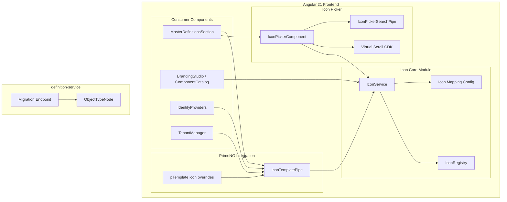
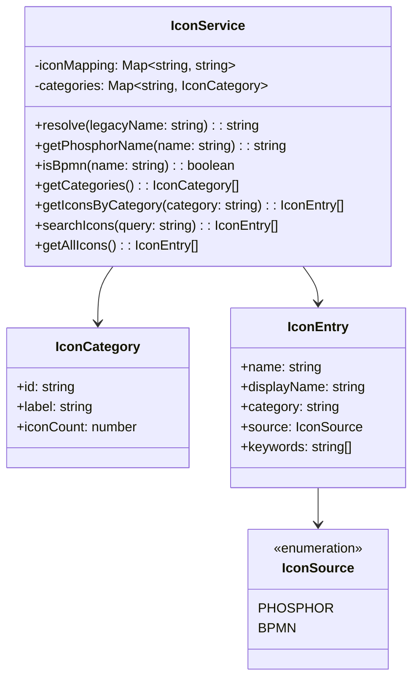
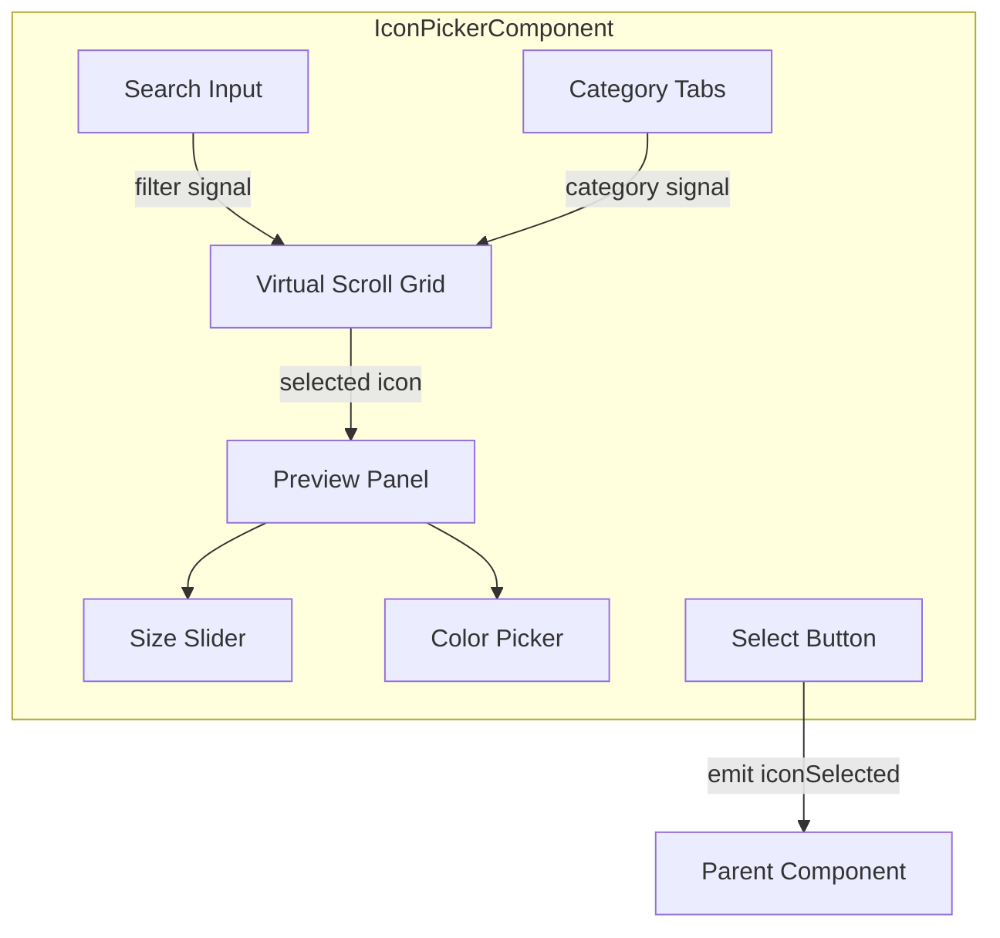
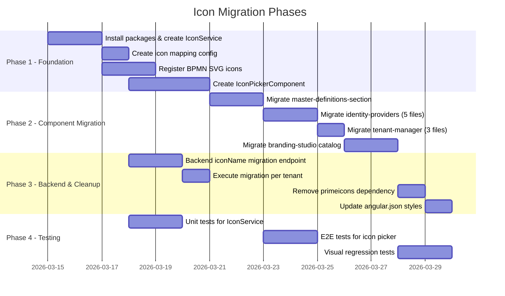

# LLD: Icon Migration -- PrimeIcons to Phosphor Icons + BPMN

**Version:** 1.0.0
**Date:** 2026-03-12
**Status:** [PLANNED] -- no migration code exists yet
**SA Agent:** SA-PRINCIPLES.md v1.1.0
**BA Requirements:** REQ-ICN-001 through REQ-ICN-012

---

## 1. Overview

### 1.1 Purpose

Migrate the EMSIST Angular 21 frontend from PrimeIcons (font-based, `pi pi-*` class pattern) to Phosphor Icons (SVG-based, `@ng-icons/core` + `@ng-icons/phosphor-icons` v33.x) for all UI icons, plus custom BPMN icons from iconbuddy.com/bpmn for domain-specific process notation in object definitions.

### 1.2 Scope

| Area | In Scope | Evidence |
|------|----------|----------|
| Frontend icon rendering | 20 files, 239 usages of `pi pi-*` | Grep across `frontend/src/` |
| Icon picker component | 78 PrimeIcon names in `iconOptions` array | `master-definitions-section.component.ts` lines 121-199 |
| PrimeNG component icons | Button, MenuItem, Menu, etc. `icon` prop | Template files with `icon="pi pi-*"` |
| Branding studio catalog | 77 icon refs in `component-catalog.ts` | `branding-studio/component-catalog.ts` |
| Backend data migration | `iconName` field in `ObjectTypeNode` (Neo4j) | `definition-service/.../ObjectTypeNode.java` line 50 |
| Package cleanup | Remove `primeicons` v7 dependency | `frontend/package.json` line 50, `angular.json` line 42 |

### 1.3 Dependencies

| Dependency | Type | Details |
|------------|------|---------|
| `@ng-icons/core` v33.x | npm package | Core icon rendering engine |
| `@ng-icons/phosphor-icons` v33.x | npm package | 1,248 Phosphor thin-weight icons |
| BPMN SVG files | Static assets | Downloaded from iconbuddy.com/bpmn, registered as custom icons |
| PrimeNG v21.x | Existing | Must support `ng-template` icon override on Button, Menu, etc. |
| definition-service | Backend | Neo4j `ObjectTypeNode.iconName` field migration |

### 1.4 Technology Stack

| Layer | Technology | Status |
|-------|-----------|--------|
| Frontend | Angular 21.1, PrimeNG 21.1.1 | [IMPLEMENTED] -- `package.json` |
| Icon library (current) | PrimeIcons v7 | [IMPLEMENTED] -- to be removed |
| Icon library (target) | Phosphor Icons via `@ng-icons` | [PLANNED] |
| BPMN icons | Custom SVG registration | [PLANNED] |
| Backend | Spring Boot 3.4.1 / Neo4j SDN | [IMPLEMENTED] -- definition-service |

---

## 2. Component Diagram (C4 Level 3)



---

## 3. Icon Service Architecture

### 3.1 IconService

Central service managing icon name resolution, registration, and categorization.



**File location:** `frontend/src/app/core/icons/icon.service.ts`

### 3.2 Icon Name Mapping Configuration

**File location:** `frontend/src/app/core/icons/icon-mapping.config.ts`

This file exports a `Record<string, string>` mapping every legacy PrimeIcon name to its Phosphor equivalent. The mapping is used by `IconService.resolve()` for backward compatibility during transition.

### 3.3 BPMN Icon Registration

**File location:** `frontend/src/app/core/icons/bpmn-icons.config.ts`

BPMN SVG files are downloaded to `frontend/src/assets/icons/bpmn/` and registered via `@ng-icons/core`'s `provideNgIconLoader()` as custom icons with a `bpmn` prefix (e.g., `bpmnTask`, `bpmnGateway`, `bpmnEvent`).

### 3.4 Module Registration

**File location:** `frontend/src/app/app.config.ts`

```typescript
// Registration in app.config.ts providers array
provideNgIconsConfig({ size: '24' }),
provideIcons({
  // Phosphor thin icons -- tree-shakeable, only used icons bundled
  phosphorHouse, phosphorGear, phosphorUser, /* ... */
}),
provideNgIconLoader(name => {
  // Custom BPMN icon loader
  if (name.startsWith('bpmn')) {
    return fetch(`/assets/icons/bpmn/${name}.svg`).then(r => r.text());
  }
  return undefined;
}),
```

---

## 4. PrimeNG Component Compatibility Strategy

### 4.1 Problem

PrimeNG components (Button, MenuItem, Menu, SplitButton, etc.) accept an `icon` property as a CSS class string (`icon="pi pi-check"`). They render `<span [class]="icon"></span>` internally. This is incompatible with `@ng-icons/core`'s `<ng-icon name="..." />` element-based approach.

### 4.2 Strategy: ng-template Icon Override

PrimeNG v19+ supports `pTemplate="icon"` on Button and many other components. This allows replacing the default `<span>` icon with custom content.

**Before (current):**
```html
<button pButton icon="pi pi-check" label="Save"></button>
```

**After (migration target):**
```html
<button pButton label="Save">
  <ng-icon name="phosphorCheck" size="18" slot="icon" />
</button>
```

For PrimeNG Button specifically in v21, the `icon` input still works but we replace it with the `iconTemplate` approach:

```html
<p-button label="Save">
  <ng-template pTemplate="icon">
    <ng-icon name="phosphorCheck" size="18" />
  </ng-template>
</p-button>
```

### 4.3 MenuItem Icon Handling

`MenuItem` interfaces (used by Menu, Menubar, ContextMenu, etc.) have an `icon` string property. PrimeNG renders this as a CSS class. Two options:

| Approach | Pros | Cons | Recommendation |
|----------|------|------|----------------|
| A. Custom `menuItemTemplate` | Full control, clean SVG | Must override every Menu component template | Recommended |
| B. CSS compatibility layer | No template changes | Fragile, depends on PrimeNG internals | Not recommended |

**Recommended approach (A):** Use PrimeNG's `pTemplate="item"` to render custom MenuItem content with `<ng-icon>`. The `icon` property in `MenuItem` stores the Phosphor icon name (e.g., `phosphorGear`) and the template renders it via `<ng-icon [name]="item.icon" />`.

### 4.4 Compatibility Matrix

| PrimeNG Component | Current Usage Pattern | Migration Strategy | Complexity |
|--------------------|----------------------|-------------------|------------|
| `pButton` / `p-button` | `icon="pi pi-*"` on 15+ buttons | `pTemplate="icon"` or inline `<ng-icon>` | Low |
| `MenuItem` (Menu, Menubar) | `icon: 'pi pi-*'` in model | `pTemplate="item"` with `<ng-icon>` | Medium |
| `TabPanel` | `<i class="pi pi-*">` in tab header | Replace `<i>` with `<ng-icon>` | Low |
| `Tag` | `icon="pi pi-*"` prop | `pTemplate="icon"` | Low |
| Standalone `<i>` elements | `<i class="pi pi-*">` in templates | Replace with `<ng-icon>` | Low |

### 4.5 IconTemplatePipe

A utility pipe that maps old `pi pi-*` strings to Phosphor names, for use during incremental migration:

**File location:** `frontend/src/app/core/icons/icon-template.pipe.ts`

```typescript
@Pipe({ name: 'iconName', standalone: true })
export class IconNamePipe implements PipeTransform {
  private iconService = inject(IconService);
  transform(legacyName: string): string {
    return this.iconService.resolve(legacyName);
  }
}
```

---

## 5. Icon Picker Component Design

### 5.1 Component Structure



**File location:** `frontend/src/app/shared/icon-picker/icon-picker.component.ts`

### 5.2 Component API

```typescript
@Component({
  selector: 'app-icon-picker',
  standalone: true,
  changeDetection: ChangeDetectionStrategy.OnPush,
})
export class IconPickerComponent {
  // Inputs
  readonly selectedIcon = input<string>('phosphorCube');
  readonly selectedColor = input<string>('#428177');

  // Outputs
  readonly iconSelected = output<{ name: string; source: 'phosphor' | 'bpmn' }>();
  readonly colorSelected = output<string>();

  // Internal state
  readonly search = signal('');
  readonly activeCategory = signal<string>('all');
  readonly previewIcon = signal<string | null>(null);
  readonly previewSize = signal(24);
}
```

### 5.3 Virtual Scrolling

With 1,248+ Phosphor icons plus BPMN icons, rendering all at once is not viable.

**Strategy:** Use `@angular/cdk/scrolling` `CdkVirtualScrollViewport` with a custom `CdkVirtualForOf` grid strategy.

| Configuration | Value | Rationale |
|---------------|-------|-----------|
| Item size (height) | 48px | 38px icon + 10px gap |
| Items per row | `auto-fill, minmax(48px, 1fr)` | Responsive grid |
| Buffer size | 5 rows | Smooth scrolling |
| Search debounce | 200ms | Responsive filtering |

**File location:** `frontend/src/app/shared/icon-picker/icon-picker.component.ts`

### 5.4 Category Tabs

| Category | Source | Approximate Count |
|----------|--------|--------------------|
| All | Both | ~1,300+ |
| General | Phosphor | ~200 (common UI icons) |
| Arrows & Navigation | Phosphor | ~80 |
| Communication | Phosphor | ~60 |
| Data & Charts | Phosphor | ~50 |
| Development | Phosphor | ~40 |
| Files & Folders | Phosphor | ~40 |
| Commerce | Phosphor | ~30 |
| Media | Phosphor | ~40 |
| Weather & Nature | Phosphor | ~30 |
| BPMN | Custom SVG | ~50 |

Categories are defined in `frontend/src/app/core/icons/icon-categories.config.ts`.

### 5.5 Search

Search filters across icon name, display name, and keywords array. The `IconService.searchIcons(query)` method returns matched `IconEntry[]` sorted by relevance (exact name match first, then keyword match).

### 5.6 Accessibility (REQ-ICN-005)

| Requirement | Implementation |
|-------------|----------------|
| `aria-label` on all icons | `<ng-icon>` wrapped in container with `[attr.aria-label]` |
| `role="img"` for decorative | Applied on `<ng-icon>` wrapper |
| `aria-hidden="true"` for decorative | Icons next to text labels |
| Keyboard navigation in picker | Arrow keys navigate grid, Enter selects |
| Focus management | Focus ring on selected icon cell |
| Screen reader | Category count announced, search results count announced |

---

## 6. Backend Data Migration Strategy (REQ-ICN-008)

### 6.1 Current State

The `ObjectTypeNode` in definition-service stores icon names as plain strings:

```java
// ObjectTypeNode.java line 50
@Builder.Default
private String iconName = "box";
```

**Evidence:** `backend/definition-service/src/main/java/com/ems/definition/node/ObjectTypeNode.java`

The `iconName` field stores PrimeIcon names (without the `pi pi-` prefix), e.g., `"box"`, `"server"`, `"database"`.

### 6.2 Migration Approach

| Aspect | Decision | Rationale |
|--------|----------|-----------|
| Migration type | In-place Neo4j Cypher update | Simple string replacement, no schema change |
| Trigger | One-time migration endpoint | Controlled execution, idempotent |
| Direction | Forward only (old -> new) | No rollback needed; old names resolve via mapping |
| Default value | `"box"` -> `"phosphorCube"` | Builder default updated |

### 6.3 Migration Cypher Query

```cypher
// Run per tenant database
MATCH (ot:ObjectType)
WHERE ot.iconName IN $oldNames
SET ot.iconName = CASE ot.iconName
  WHEN 'box' THEN 'phosphorCube'
  WHEN 'server' THEN 'phosphorDesktop'
  WHEN 'database' THEN 'phosphorDatabase'
  WHEN 'desktop' THEN 'phosphorMonitor'
  // ... full mapping below in Section 8
  ELSE ot.iconName
END
RETURN count(ot) AS updated
```

### 6.4 Backward Compatibility During Transition

During the migration period, the frontend `IconService.resolve()` method handles both old and new names:

1. If `iconName` starts with `phosphor` or `bpmn` -- use directly
2. If `iconName` matches a legacy PrimeIcon key -- resolve to Phosphor equivalent
3. If unknown -- fall back to `phosphorCube` (default)

This means the backend migration can happen independently of the frontend deployment.

### 6.5 Migration Endpoint

**Endpoint:** `PUT /api/v1/admin/migrate-icons`
**Auth:** Requires `ROLE_ADMIN`
**Tenant scope:** Executes per tenant (X-Tenant-ID header)
**Idempotent:** Yes -- re-running skips already-migrated names

---

## 7. File and Module Structure

### 7.1 New Files

```
frontend/src/app/
  core/
    icons/
      icon.service.ts              -- Central icon service
      icon-mapping.config.ts       -- PrimeIcon -> Phosphor name map
      icon-categories.config.ts    -- Category definitions with icon lists
      bpmn-icons.config.ts         -- BPMN SVG registration
      icon-template.pipe.ts        -- Pipe for legacy name resolution
      icon.model.ts                -- IconEntry, IconCategory, IconSource types
  shared/
    icon-picker/
      icon-picker.component.ts     -- Icon picker with search, categories, virtual scroll
      icon-picker.component.html   -- Template
      icon-picker.component.scss   -- Styles
frontend/src/assets/
  icons/
    bpmn/
      bpmnTask.svg                 -- BPMN task icon
      bpmnGateway.svg              -- BPMN gateway icon
      bpmnEvent.svg                -- BPMN event icon
      bpmnPool.svg                 -- BPMN pool icon
      ... (remaining BPMN SVGs)
```

### 7.2 Modified Files

| File | Change | Requirement |
|------|--------|-------------|
| `frontend/package.json` | Add `@ng-icons/core`, `@ng-icons/phosphor-icons`; remove `primeicons` | REQ-ICN-006 |
| `frontend/angular.json` | Remove `node_modules/primeicons/primeicons.css` from styles array (line 42) | REQ-ICN-006 |
| `frontend/src/app/app.config.ts` | Add `provideIcons()`, `provideNgIconsConfig()`, `provideNgIconLoader()` | REQ-ICN-001 |
| `master-definitions-section.component.ts` | Replace `iconOptions` array with `IconService` injection; replace icon picker grid | REQ-ICN-003 |
| `master-definitions-section.component.html` | Replace all `<i class="pi pi-*">` with `<ng-icon>`; replace `icon="pi pi-*"` on buttons | REQ-ICN-001 |
| `component-catalog.ts` | Replace all 77 `icon: 'pi pi-*'` entries with Phosphor names | REQ-ICN-009 |
| All 20 files with `pi pi-*` usage | Replace `<i class="pi pi-*">` and `icon="pi pi-*"` | REQ-ICN-001 |
| `ObjectTypeNode.java` | Update `@Builder.Default` from `"box"` to `"phosphorCube"` | REQ-ICN-008 |
| `ObjectTypeCreateRequest.java` | Update `@Size(max = 100)` -- sufficient for Phosphor names | REQ-ICN-008 |

### 7.3 Deleted Files / Dependencies

| Item | Action |
|------|--------|
| `primeicons` npm package | Remove from `package.json` dependencies |
| `primeicons.css` global import | Remove from `angular.json` styles array |

---

## 8. Complete Icon Name Mapping (88 PrimeIcons)

### 8.1 iconOptions Array Mapping (78 icons from master-definitions-section.component.ts)

| # | PrimeIcon Name | Phosphor Icon Name | Phosphor Component Import |
|---|----------------|-------------------|--------------------------|
| 1 | `box` | `phosphorCube` | `phosphorCube` |
| 2 | `server` | `phosphorDesktop` | `phosphorDesktop` |
| 3 | `database` | `phosphorDatabase` | `phosphorDatabase` |
| 4 | `desktop` | `phosphorMonitor` | `phosphorMonitor` |
| 5 | `mobile` | `phosphorDeviceMobile` | `phosphorDeviceMobile` |
| 6 | `cloud` | `phosphorCloud` | `phosphorCloud` |
| 7 | `cog` | `phosphorGear` | `phosphorGear` |
| 8 | `wrench` | `phosphorWrench` | `phosphorWrench` |
| 9 | `bolt` | `phosphorLightning` | `phosphorLightning` |
| 10 | `shield` | `phosphorShield` | `phosphorShield` |
| 11 | `user` | `phosphorUser` | `phosphorUser` |
| 12 | `users` | `phosphorUsers` | `phosphorUsers` |
| 13 | `home` | `phosphorHouse` | `phosphorHouse` |
| 14 | `chart-bar` | `phosphorChartBar` | `phosphorChartBar` |
| 15 | `chart-line` | `phosphorChartLine` | `phosphorChartLine` |
| 16 | `chart-pie` | `phosphorChartPie` | `phosphorChartPie` |
| 17 | `file` | `phosphorFile` | `phosphorFile` |
| 18 | `folder` | `phosphorFolder` | `phosphorFolder` |
| 19 | `envelope` | `phosphorEnvelope` | `phosphorEnvelope` |
| 20 | `calendar` | `phosphorCalendar` | `phosphorCalendar` |
| 21 | `clock` | `phosphorClock` | `phosphorClock` |
| 22 | `tag` | `phosphorTag` | `phosphorTag` |
| 23 | `bookmark` | `phosphorBookmarkSimple` | `phosphorBookmarkSimple` |
| 24 | `star` | `phosphorStar` | `phosphorStar` |
| 25 | `heart` | `phosphorHeart` | `phosphorHeart` |
| 26 | `flag` | `phosphorFlag` | `phosphorFlag` |
| 27 | `globe` | `phosphorGlobe` | `phosphorGlobe` |
| 28 | `link` | `phosphorLink` | `phosphorLink` |
| 29 | `lock` | `phosphorLock` | `phosphorLock` |
| 30 | `sitemap` | `phosphorTreeStructure` | `phosphorTreeStructure` |
| 31 | `th-large` | `phosphorSquaresFour` | `phosphorSquaresFour` |
| 32 | `list` | `phosphorList` | `phosphorList` |
| 33 | `align-justify` | `phosphorTextAlignJustify` | `phosphorTextAlignJustify` |
| 34 | `sliders-h` | `phosphorSliders` | `phosphorSliders` |
| 35 | `inbox` | `phosphorTray` | `phosphorTray` |
| 36 | `send` | `phosphorPaperPlaneTilt` | `phosphorPaperPlaneTilt` |
| 37 | `map-marker` | `phosphorMapPin` | `phosphorMapPin` |
| 38 | `microchip` | `phosphorCpu` | `phosphorCpu` |
| 39 | `wifi` | `phosphorWifi` | `phosphorWifi` |
| 40 | `key` | `phosphorKey` | `phosphorKey` |
| 41 | `id-card` | `phosphorIdentificationCard` | `phosphorIdentificationCard` |
| 42 | `warehouse` | `phosphorWarehouse` | `phosphorWarehouse` |
| 43 | `truck` | `phosphorTruck` | `phosphorTruck` |
| 44 | `money-bill` | `phosphorMoney` | `phosphorMoney` |
| 45 | `shopping-cart` | `phosphorShoppingCart` | `phosphorShoppingCart` |
| 46 | `comments` | `phosphorChatCircle` | `phosphorChatCircle` |
| 47 | `phone` | `phosphorPhone` | `phosphorPhone` |
| 48 | `print` | `phosphorPrinter` | `phosphorPrinter` |
| 49 | `search` | `phosphorMagnifyingGlass` | `phosphorMagnifyingGlass` |
| 50 | `eye` | `phosphorEye` | `phosphorEye` |
| 51 | `pencil` | `phosphorPencilSimple` | `phosphorPencilSimple` |
| 52 | `check-circle` | `phosphorCheckCircle` | `phosphorCheckCircle` |
| 53 | `exclamation-triangle` | `phosphorWarning` | `phosphorWarning` |
| 54 | `info-circle` | `phosphorInfo` | `phosphorInfo` |
| 55 | `question-circle` | `phosphorQuestion` | `phosphorQuestion` |
| 56 | `image` | `phosphorImage` | `phosphorImage` |
| 57 | `video` | `phosphorVideoCamera` | `phosphorVideoCamera` |
| 58 | `headphones` | `phosphorHeadphones` | `phosphorHeadphones` |
| 59 | `map` | `phosphorMapTrifold` | `phosphorMapTrifold` |
| 60 | `directions` | `phosphorSignpost` | `phosphorSignpost` |
| 61 | `hammer` | `phosphorHammer` | `phosphorHammer` |
| 62 | `clipboard` | `phosphorClipboard` | `phosphorClipboard` |
| 63 | `megaphone` | `phosphorMegaphone` | `phosphorMegaphone` |
| 64 | `stopwatch` | `phosphorTimer` | `phosphorTimer` |
| 65 | `palette` | `phosphorPalette` | `phosphorPalette` |
| 66 | `code` | `phosphorCode` | `phosphorCode` |
| 67 | `copy` | `phosphorCopy` | `phosphorCopy` |
| 68 | `filter` | `phosphorFunnel` | `phosphorFunnel` |
| 69 | `sort-alt` | `phosphorSortAscending` | `phosphorSortAscending` |
| 70 | `arrows-alt` | `phosphorArrowsOutCardinal` | `phosphorArrowsOutCardinal` |
| 71 | `share-alt` | `phosphorShareNetwork` | `phosphorShareNetwork` |
| 72 | `eraser` | `phosphorEraser` | `phosphorEraser` |
| 73 | `receipt` | `phosphorReceipt` | `phosphorReceipt` |
| 74 | `briefcase` | `phosphorBriefcase` | `phosphorBriefcase` |
| 75 | `building-columns` | `phosphorBuildings` | `phosphorBuildings` |
| 76 | `graduation-cap` | `phosphorGraduationCap` | `phosphorGraduationCap` |
| 77 | `wave-pulse` | `phosphorWaveSine` | `phosphorWaveSine` |

### 8.2 Additional PrimeIcons Used in Templates (not in iconOptions)

These are PrimeIcons found in template files but not in the `iconOptions` array:

| # | PrimeIcon Name | Context | Phosphor Icon Name |
|---|----------------|---------|-------------------|
| 78 | `refresh` | Retry button | `phosphorArrowClockwise` |
| 79 | `times` | Close/dismiss button | `phosphorX` |
| 80 | `plus` | Add/create button | `phosphorPlus` |
| 81 | `trash` | Delete button | `phosphorTrash` |
| 82 | `chevron-left` | Navigation back | `phosphorCaretLeft` |
| 83 | `chevron-right` | Navigation forward | `phosphorCaretRight` |
| 84 | `chevron-down` | Dropdown indicator | `phosphorCaretDown` |
| 85 | `bars` | Menu/hamburger | `phosphorList` |
| 86 | `play` | Start/run action | `phosphorPlay` |
| 87 | `sync` | Sync/refresh action | `phosphorArrowsClockwise` |
| 88 | `check` | Confirm/save | `phosphorCheck` |

### 8.3 Component Catalog Icon Mapping (77 refs in branding-studio)

The `component-catalog.ts` file contains 77 icon references using `icon: 'pi pi-*'` format. Each entry maps to a Phosphor equivalent using the same mapping table above. Key unique icons in the catalog not already covered:

| PrimeIcon | Phosphor Equivalent |
|-----------|-------------------|
| `sort-numeric-up` | `phosphorSortAscending` |
| `check-square` | `phosphorCheckSquare` |
| `hashtag` | `phosphorHash` |
| `table` | `phosphorTable` |
| `ellipsis-h` | `phosphorDotsThreeOutline` |
| `arrow-right-arrow-left` | `phosphorArrowsLeftRight` |
| `clone` | `phosphorCopySimple` |
| `window-maximize` | `phosphorFrameCorners` |
| `minus` | `phosphorMinus` |
| `arrow-down` | `phosphorArrowDown` |
| `circle` | `phosphorCircle` |
| `power-off` | `phosphorPower` |
| `compass` | `phosphorCompass` |
| `arrow-right` | `phosphorArrowRight` |
| `comment` | `phosphorChatCircle` |
| `bell` | `phosphorBell` |
| `circle-fill` | `phosphorCircleFill` |
| `align-left` | `phosphorTextAlignLeft` |
| `ellipsis-v` | `phosphorDotsThreeVertical` |
| `images` | `phosphorImages` |
| `spinner` | `phosphorSpinner` |
| `percentage` | `phosphorPercent` |
| `arrow-up` | `phosphorArrowUp` |
| `ban` | `phosphorProhibit` |

---

## 9. CSS and Styling Considerations

### 9.1 Icon Sizing via CSS Custom Properties (REQ-ICN-004)

```scss
:root {
  --icon-size-xs: 14px;
  --icon-size-sm: 18px;
  --icon-size-md: 24px;
  --icon-size-lg: 32px;
  --icon-size-xl: 48px;
}
```

The `<ng-icon>` component accepts `size` and `color` inputs directly, but for consistency with the design system, sizes should be controlled via CSS custom properties where possible.

### 9.2 Icon Circle Component Styling

The current `.icon-circle` class in `master-definitions-section.component.scss` (lines 219-265) targets `i` elements for font sizing. After migration, these must target `ng-icon` elements instead:

```scss
.icon-circle {
  // ... existing styles ...
  ng-icon {
    font-size: 0.78rem;
    --ng-icon__size: 0.78rem;
  }
}
```

### 9.3 RTL Mirroring (REQ-ICN-010)

Directional icons (arrows, chevrons, etc.) require mirroring in RTL layouts. The `@ng-icons/core` library does not handle this automatically.

**Strategy:** CSS `transform: scaleX(-1)` applied via a `[dir="rtl"]` selector on directional icon wrappers.

**Directional icons to mirror:**
- `phosphorCaretLeft`, `phosphorCaretRight`
- `phosphorArrowLeft`, `phosphorArrowRight`
- `phosphorArrowClockwise`
- `phosphorPaperPlaneTilt`
- `phosphorSignpost`

**File location:** `frontend/src/app/core/icons/icon-rtl.scss`

---

## 10. Migration Sequence

### 10.1 Phase Plan



### 10.2 Migration Checklist per File

For each of the 20 files containing `pi pi-*`:

- [ ] Replace all `<i class="pi pi-*">` with `<ng-icon name="phosphor*" />`
- [ ] Replace all `icon="pi pi-*"` PrimeNG props with template overrides
- [ ] Add `NgIconComponent` to component imports
- [ ] Verify accessibility attributes preserved
- [ ] Run component unit tests
- [ ] Visual regression check

---

## 11. Error Handling

| Scenario | Behavior |
|----------|----------|
| Icon name not found in mapping | Fall back to `phosphorCube` with console.warn |
| BPMN SVG fails to load | Show placeholder icon + error log |
| Icon picker search returns 0 results | Show "No icons found" empty state |
| Backend migration encounters unknown icon | Skip (leave as-is), log to migration report |

---

## 12. Performance Considerations

### 12.1 Bundle Size Impact

| Item | Size | Strategy |
|------|------|----------|
| PrimeIcons (current) | ~90KB (font + CSS) | Removed |
| `@ng-icons/core` | ~5KB | Added |
| Phosphor icons (tree-shaken) | ~2KB per icon used | Only import used icons |
| Estimated net change | -50KB to -70KB | Net reduction |

### 12.2 Tree Shaking

`@ng-icons/phosphor-icons` supports tree shaking -- only icons explicitly imported in `provideIcons()` are bundled. The icon picker uses `provideNgIconLoader()` for lazy loading icons not in the initial bundle.

### 12.3 Icon Picker Performance

| Technique | Target |
|-----------|--------|
| Virtual scrolling | Render only visible icons (~40-60 at a time) |
| Search debounce | 200ms debounce on search input |
| Category filtering | Reduce render set by category |
| Signal-based reactivity | Fine-grained updates, no unnecessary re-renders |

---

## 13. Security Considerations

| Concern | Mitigation |
|---------|------------|
| SVG injection via custom BPMN icons | BPMN SVGs are static assets shipped with the build, not user-uploaded |
| XSS via icon names from backend | Icon names are used as component input strings, not rendered as HTML |
| Migration endpoint authorization | `ROLE_ADMIN` required, tenant-scoped |

---

## 14. Backward Compatibility CSS Layer (REQ-ICN-012 -- Could Have)

An optional CSS compatibility layer that maps `pi pi-*` class selectors to inline SVG backgrounds. This allows gradual migration without breaking all icons at once.

**Decision:** Not recommended. Full migration is cleaner and the mapping service handles backward compatibility at the data layer. If needed, it can be implemented as a temporary stylesheet during transition.

---

## 15. SA Checklist Verification

- [x] LLD follows standard 8-section structure
- [x] C4 Level 3 component diagram created (Section 2)
- [x] All diagrams use Mermaid syntax (no ASCII art)
- [x] File paths reference actual codebase locations
- [x] Current state verified by reading source files
- [x] All new content tagged [PLANNED]
- [x] BA requirements (REQ-ICN-001 through REQ-ICN-012) traced to design sections
- [x] Multi-tenancy considered (per-tenant migration, X-Tenant-ID header)
- [x] Accessibility requirements addressed (REQ-ICN-005)
- [x] Performance requirements addressed (REQ-ICN-011)
