# Integration & Communication Governance Hub — Low-Level Design (LLD)

> **WP-ARCH-ALIGN (2026-03-24):** This document has been updated to reflect the frozen auth target model (Rev 2).
> See `Foundation/03-ownership-boundaries.md` § FROZEN for the canonical decision.

> **Document Type:** Low-Level Design (C4 Level 3-4)
> **Owner:** Solution Architect
> **Status:** [PLANNED] — Design complete, no code exists yet
> **Last Updated:** 2026-03-16
> **Service:** `integration-service` (port 8091)
> **References:** Co-designed with project owner; codebase patterns verified against existing services

---

## Table of Contents

1. [Overview](#1-overview)
2. [Communication Patterns](#2-communication-patterns)
3. [Connector Architecture](#3-connector-architecture)
4. [Data Model](#4-data-model)
5. [Observability & Health](#5-observability--health)
6. [Protocol Adapters](#6-protocol-adapters)
7. [Sync Engine & Operational Entities](#7-sync-engine--operational-entities)
8. [Plugin Architecture](#8-plugin-architecture)
9. [Frontend Structure](#9-frontend-structure)
10. [API Surface & Contracts](#10-api-surface--contracts)
11. [Event & Topic Contracts](#11-event--topic-contracts)
12. [Deployment, Rollout & Migration](#12-deployment-rollout--migration)
13. [Testing, SLOs & Acceptance Criteria](#13-testing-slos--acceptance-criteria)

---

## 1. Overview

### 1.1 Purpose

The Integration & Communication Governance Hub is a dedicated microservice (`integration-service`) that centralizes governance of four communication patterns within the EMSIST platform:

1. **EMSIST ↔ External EA/BPM tools** — MEGA HOPEX, ARIS, webMethods
2. **Tenant ↔ Tenant** — Controlled data sharing between EMSIST tenants
3. **Agent ↔ Agent** — AI service governance for agent-to-agent communication
4. **EMSIST ↔ External AI Agents** — Claude, Codex, Gemini, and other external agents

### 1.2 Key Design Decisions

| Decision | Choice | Rationale |
|----------|--------|-----------|
| Service topology | Dedicated `integration-service` | Isolates integration complexity from core business services |
| Primary database | PostgreSQL | Control-plane data only; aligns with existing services. No Neo4j dependency -- integration-service does not use Neo4j. |
| Event envelope | CloudEvents v1.0 | Industry standard; schema evolution via `dataschema` field |
| Credential storage | Vault (Phase 2); encrypted DB column (Phase 1) | Vault is the target; encrypted column is the safe interim |
| Error format | ProblemDetail / RFC 9457 | Forward-looking; auth-facade and definition-service already use it |
| Outbox pattern | Transactional outbox (Phase 1: poller, Phase 2: Debezium CDC) | Guarantees at-least-once publishing without two-phase commit |
| Plugin boundary | Product-specific only | Generic concerns (retry, Vault, policy) live in core framework |
| Frontend pattern | Standalone admin section | Matches verified `administration.page.ts` + `?section=` query param |

### 1.3 What This Service Does NOT Store

The integration-service is a **control plane**. It stores:
- Configuration, mappings, policies, checkpoints, run metadata
- Masked samples (for playground/preview)
- Health metrics and audit event references

It does **NOT** store:
- Full replicas of external system data
- Business domain data (that belongs in definition-service, etc.)
- Raw credentials in plaintext

---

## 2. Communication Patterns

### 2.1 Pattern Overview

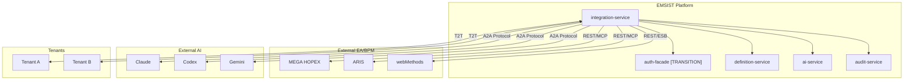

### 2.2 Pattern Details

| Pattern | Direction | Protocol | Auth Model |
|---------|-----------|----------|------------|
| External EA/BPM | Bidirectional | REST, SOAP/ESB, MCP | OAuth2 client credentials or API key per connector |
| Tenant-to-Tenant | Bidirectional | Internal REST | Scoped connector token issued by auth-facade |
| Agent-to-Agent | Bidirectional | REST + MCP | Service-to-service JWT with agent scope |
| External AI Agents | Outbound-initiated | REST + MCP | API key + rate limiting |

### 2.3 Auth Integration

[AS-IS] The integration-service works with the existing auth-facade + api-gateway model.
[TARGET] Auth-facade is a transitional service that will be removed. Its edge responsibilities (token issuance for outbound connectors, cross-tenant tokens) migrate to api-gateway. Its data/policy responsibilities migrate to tenant-service.

- **Inbound requests**: JWT validated by api-gateway; integration-service extracts `tenant_id` from claims
- **Outbound connections**: [AS-IS] integration-service requests scoped connector tokens from auth-facade for OAuth2 flows. [TARGET] Token issuance migrates to api-gateway.
- **T2T communication**: [AS-IS] auth-facade issues cross-tenant tokens with explicit scope restrictions. [TARGET] Cross-tenant token issuance migrates to api-gateway.
- **Webhook ingress**: Protected by signature/timestamp/IP policy, NOT Bearer JWT

---

## 3. Connector Architecture

### 3.1 Connector Lifecycle

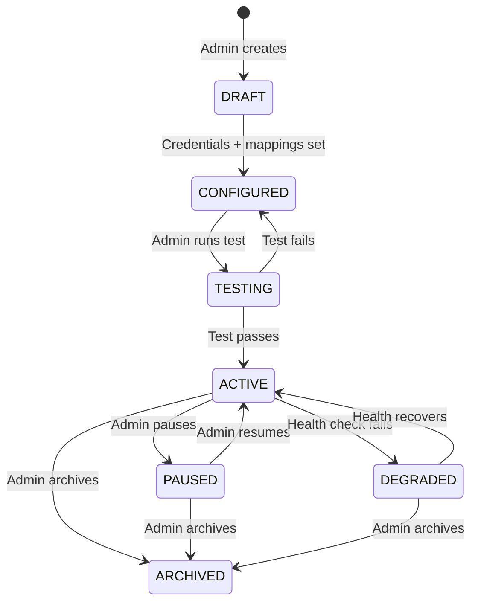

### 3.2 Connector Trigger Modes (Hybrid)

Each connector supports multiple trigger modes simultaneously:

| Mode | Mechanism | Use Case |
|------|-----------|----------|
| On-demand | Admin clicks "Sync Now" or API call to `/trigger` | Initial setup, debugging |
| Scheduled | Cron expression in `sync_profiles.schedule_cron` | Regular data synchronization |
| Event-driven | Inbound webhook or Kafka event | Real-time updates from external systems |

### 3.3 Credential Management

**Phase 1** — Encrypted database column:
- AES-256-GCM encryption at rest
- Decrypted only in memory during connection
- Never logged, never returned in API responses
- Stored in `connector_credentials` table

**Phase 2** — Vault integration:
- Tenant-isolated namespaces: `secret/data/ems/{tenantId}/integration/{connectorId}`
- OAuth2 tokens with automatic refresh
- Vault agent sidecar for token renewal
- Encrypted column remains as fallback

---

## 4. Data Model

### 4.1 Entity Overview

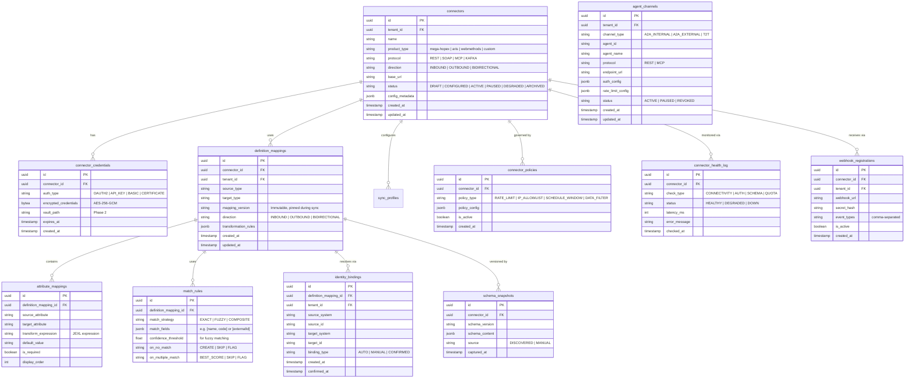

### 4.2 Schema Compatibility

Schema snapshots enable compatibility checks when external schemas evolve:

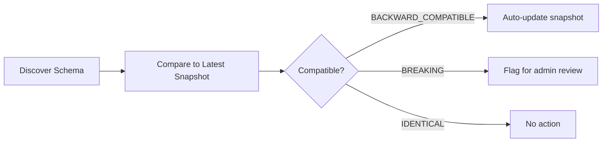

Compatibility results are stored in `schema_compatibility_results` (computed, not a table — derived from snapshot diff).

---

## 5. Observability & Health

### 5.1 Two-Layer Model

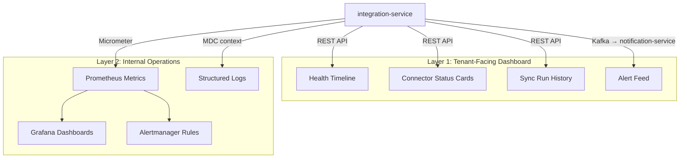

### 5.2 Metrics Source

All metrics come directly from integration-service via **Micrometer** counters, timers, and gauges — NOT from replaying Kafka audit events.

| Metric | Type | Labels |
|--------|------|--------|
| `integration.connector.health` | Gauge | `connectorId`, `tenantId`, `status` |
| `integration.sync.run.duration` | Timer | `profileId`, `tenantId`, `status` |
| `integration.sync.records.processed` | Counter | `profileId`, `direction`, `outcome` |
| `integration.outbox.pending` | Gauge | — |
| `integration.webhook.received` | Counter | `connectorId`, `tenantId` |
| `integration.playground.executions` | Counter | `tenantId`, `mode` |
| `integration.agent.messages` | Counter | `channelId`, `direction` |

### 5.3 Health Summary Endpoint

`GET /api/v1/integrations/health-summary` returns an aggregated view for the admin dashboard:

```json
{
  "totalConnectors": 12,
  "healthy": 10,
  "degraded": 1,
  "down": 1,
  "lastCheckedAt": "2026-03-16T10:30:00Z",
  "recentSyncs": {
    "completed": 45,
    "failed": 2,
    "running": 1
  },
  "outboxBacklog": 3,
  "alerts": [
    {
      "connectorId": "abc-123",
      "connectorName": "HOPEX Production",
      "type": "AUTH_EXPIRY",
      "message": "OAuth token expires in 2 hours",
      "severity": "WARNING"
    }
  ]
}
```

### 5.4 External Monitoring Integration

The integration-service exposes metrics via Micrometer/Prometheus. External tools like **Splunk** or **Datadog** consume data from:
- Prometheus remote-write (metrics)
- Structured JSON logs (via log shipper)
- Kafka audit events (if the external tool has a Kafka consumer)

The integration-service does NOT embed Splunk/Datadog SDKs. The boundary is: integration-service publishes; the observability pipeline consumes.

---

## 6. Protocol Adapters

### 6.1 Adapter Architecture

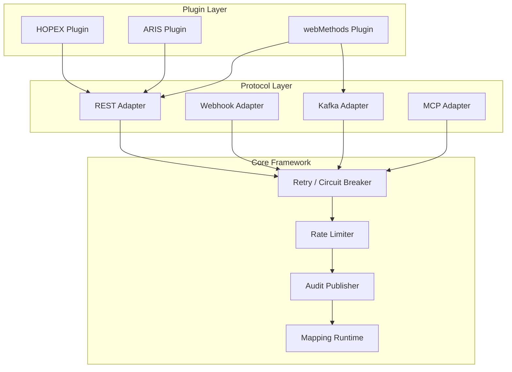

### 6.2 REST Adapter

- Primary adapter for MEGA HOPEX, ARIS, and most external systems
- Supports OAuth2, API key, Basic auth, and mTLS
- Automatic retry with exponential backoff (Resilience4j)
- Request/response logging with credential masking

### 6.3 Webhook Adapter

- Inbound: receives callbacks from external systems at `/api/v1/webhooks/{connectorId}`
- Validates HMAC signature, timestamp freshness, and IP allowlist
- Normalizes payload to CloudEvents before publishing to Kafka
- Outbound: delivers events to registered webhook URLs with retry

### 6.4 Kafka Adapter

- Produces to `integration-events`, `integration-sync-commands`, `audit-events`
- Consumes from `integration-webhooks` (normalized inbound webhooks)
- Uses transactional outbox for guaranteed delivery
- CloudEvents structured content mode

### 6.5 MCP Adapter

- Model Context Protocol for AI agent communication
- Supports tool registration, context sharing, and capability discovery
- Used for A2A internal governance and external AI agent integration
- Rate-limited per agent channel configuration

---

## 7. Sync Engine & Operational Entities

### 7.1 Design Principle

`sync_profiles` is the **single source of truth** for what to sync, when to sync, and how to sync. There is no separate `sync_schedules` entity — `schedule_cron` and `timezone` live directly on the profile.

**Mapping boundary rule:** `sync_profiles` references a `definition_mappings` entry via `mapping_id` FK and pins a specific `mapping_version_pin` at run start. It does NOT embed mapping logic (field mappings, transformation rules, or attribute mappings). Those live exclusively in Section 4's `definition_mappings` + `attribute_mappings` entities, managed by the mapping studio. The sync engine reads the pinned mapping version at execution time via the mapping runtime. This preserves the mapping-studio / mapping-runtime split and ensures version pinning holds even after a newer mapping version is published.

### 7.2 Entity Model

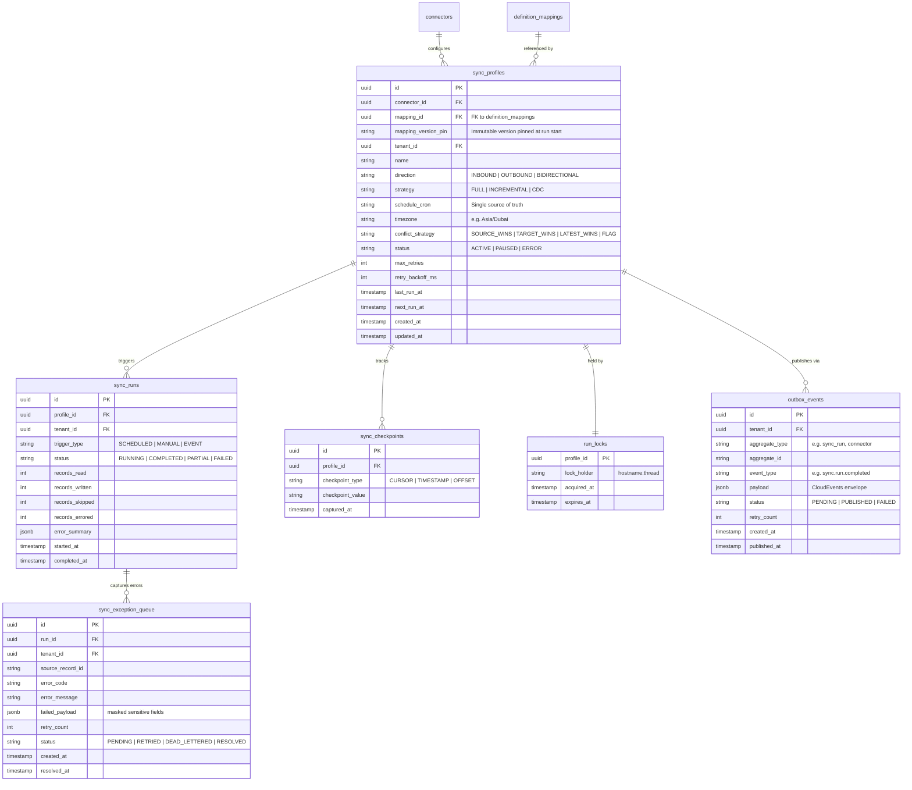

### 7.3 Operational Behavior

| Entity | Purpose | Lifecycle |
|--------|---------|-----------|
| `sync_profiles` | Single source of truth for what/when/how to sync | Created by admin; `schedule_cron` drives the scheduler |
| `sync_runs` | Immutable audit trail of each execution | Created per trigger; terminal state is COMPLETED/PARTIAL/FAILED |
| `sync_checkpoints` | Incremental cursors for resumable sync | Updated atomically at end of successful run |
| `run_locks` | Prevents concurrent execution of the same profile | Acquired before run, released on completion or expiry |
| `sync_exception_queue` | Per-record errors for retry or manual resolution | Records stay PENDING until retried or dead-lettered |
| `outbox_events` | Transactional outbox for Kafka publishing | Phase 1: polled by scheduler; Phase 2: Debezium CDC |

### 7.4 Run Lock Strategy

`run_locks` uses `SELECT ... FOR UPDATE SKIP LOCKED` on PostgreSQL. Lock expiry (`expires_at`) ensures recovery if the holder crashes without releasing. A second trigger for the same profile while a lock is held returns `409 Conflict`.

### 7.5 Sync Execution Flow

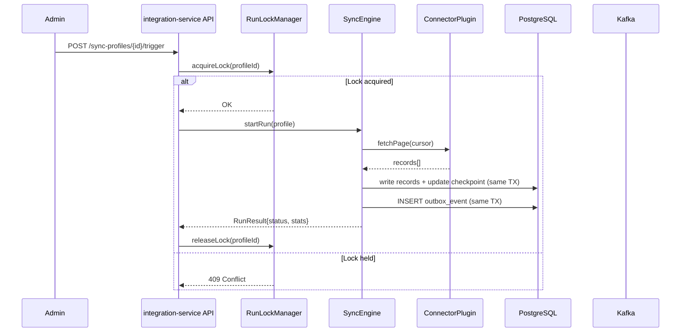

---

## 8. Plugin Architecture

### 8.1 Boundary Rule

Plugins contain **ONLY product-specific adapter logic**. Generic concerns live in the core integration-service framework.

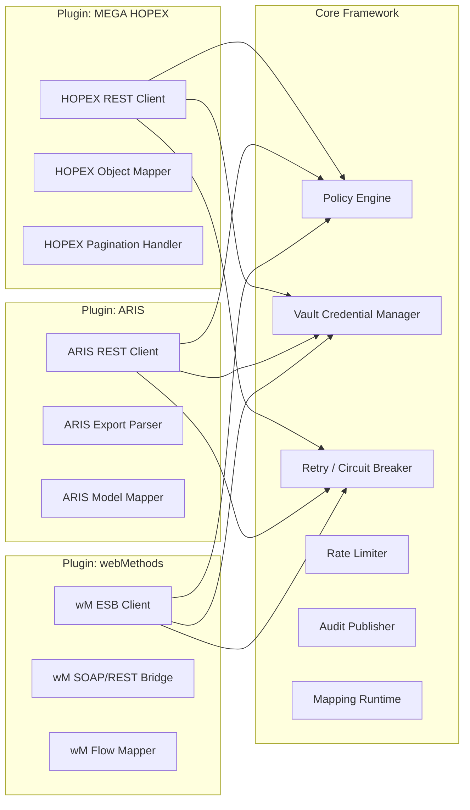

### 8.2 What Plugins Contain (Product-Specific)

| Responsibility | Example |
|---------------|---------|
| API client for the target product | `HopexRestClient`, `ArisRestClient` |
| Product-specific pagination | HOPEX uses `$skip/$top`; ARIS uses cursor tokens |
| Object model mapping | Translate HOPEX `MgObject` → EMSIST `ObjectDefinition` |
| Product-specific error codes | Map HOPEX `403 Insufficient License` → connector error |
| Authentication flow quirks | ARIS requires session cookie + CSRF token |
| Schema discovery | Query HOPEX metamodel API for available object types |

### 8.3 What Plugins Do NOT Contain

| Responsibility | Lives In | Reason |
|---------------|----------|--------|
| Policy enforcement | Core `PolicyEngine` | Cross-cutting, not product-specific |
| Vault/credential retrieval | Core `VaultCredentialManager` | Platform concern |
| Retry/backoff/circuit breaker | Core `ResilienceManager` (Resilience4j) | Configurable per connector, not per product |
| Rate limiting | Core `RateLimiter` | Framework-level enforcement |
| Audit event publishing | Core `AuditPublisher` | Shared audit pipeline |
| Mapping execution | Core `MappingRuntime` (MapStruct + JEXL) | Product-agnostic engine |

### 8.4 Plugin SPI

```java
public interface ConnectorPlugin {
    String getProductId();           // "mega-hopex", "aris", "webmethods"
    String getDisplayName();
    SemVer getVersion();

    // Product-specific operations
    ConnectionTestResult testConnection(ConnectorConfig config);
    SchemaDiscoveryResult discoverSchema(ConnectorConfig config);
    SyncPage fetchPage(SyncContext ctx, String cursor);
    PushResult pushRecords(SyncContext ctx, List<MappedRecord> records);
}
```

Core framework wraps plugin calls with retry, circuit breaker, rate limiting, and audit. The plugin never implements these itself.

---

## 9. Frontend Structure

### 9.1 Verified Codebase Pattern

The EMSIST frontend uses a standalone administration shell:
- Route: `/administration` → loads `AdministrationPageComponent` (standalone)
- Sections selected via `?section=tenant-manager` query parameter
- `AdminSection` type union in `administration.models.ts`
- Existing sections: `tenant-manager`, `license-manager`, `master-locale`, `master-definitions`

### 9.2 File Structure

```
frontend/src/app/features/administration/
├── sections/
│   ├── tenant-manager/
│   ├── license-manager/
│   ├── master-definitions/
│   ├── master-locale/
│   └── integration-hub/                          ← NEW
│       ├── integration-hub-section.component.ts
│       ├── integration-hub-section.component.html
│       ├── integration-hub-section.component.scss
│       ├── components/
│       │   ├── connector-list/
│       │   ├── connector-detail/
│       │   ├── mapping-studio/
│       │   ├── sync-monitor/
│       │   └── playground/
│       ├── services/
│       │   ├── integration-hub.service.ts
│       │   └── integration-hub.models.ts
│       └── pipes/
│           └── connector-status.pipe.ts
├── models/
│   └── administration.models.ts                  ← MODIFY
└── administration.page.ts                        ← MODIFY
```

### 9.3 Changes to Existing Files

**`administration.models.ts`** — Extend `AdminSection` union:

```typescript
export type AdminSection =
  | 'tenant-manager'
  | 'license-manager'
  | 'master-locale'
  | 'master-definitions'
  | 'integration-hub';        // ← ADD
```

Add to `ADMIN_NAV_ITEMS`:

```typescript
{
  section: 'integration-hub',
  label: 'Integration Hub',
  description: 'External connectors, sync profiles, and agent communication governance.',
}
```

Add to `ADMIN_SECTION_LABELS`:

```typescript
'integration-hub': 'Integration Hub',
```

**`administration.page.ts`** — Add import, dock meta, and render:

```typescript
import { IntegrationHubSectionComponent } from './sections/integration-hub/integration-hub-section.component';

// In ADMIN_DOCK_META:
'integration-hub': {
  iconMask: 'url("assets/icons/dock-integration.svg")',
  hue: 'var(--tp-primary)',
},

// In @Component imports array:
IntegrationHubSectionComponent,
```

**`administration.page.html`** — Add conditional render:

```html
@if (activeSection() === 'integration-hub') {
  <app-integration-hub-section />
}
```

### 9.4 Section Component

```typescript
@Component({
  selector: 'app-integration-hub-section',
  standalone: true,
  imports: [CommonModule, /* PrimeNG components */],
  templateUrl: './integration-hub-section.component.html',
  styleUrl: './integration-hub-section.component.scss',
})
export class IntegrationHubSectionComponent implements OnInit {
  // Tab-based layout: Connectors | Sync Profiles | Monitoring | Playground
}
```

---

## 10. API Surface & Contracts

### 10.1 Base Path

All integration-service endpoints live under `/api/v1/integrations`. Webhooks use `/api/v1/webhooks`.

### 10.2 Role Model

Roles follow the runtime authorization model already enforced across the gateway and downstream services. Do not introduce a new `PLATFORM_ADMIN` role for Integration Hub.

| Runtime role | Integration Hub meaning | Notes |
|------|--------|-------|
| `TENANT_ADMIN` | Tenant-local integration operator | Current tenant-local admin role used in existing `hasAnyRole("TENANT_ADMIN", "ADMIN", "SUPER_ADMIN")` service patterns |
| `ADMIN` | Elevated tenant admin | Higher-privilege tenant-scoped administration; also accepted by the existing admin chains |
| `SUPER_ADMIN` | Cross-tenant platform admin | Platform-wide governance, platform security/operations, and cross-tenant bypass |
| `VIEWER` | Read-only viewer | Exists in the auth graph today; write endpoints remain blocked |

Additional rules:

- `PLATFORM_ADMIN` is not a runtime role in the current repo.
- "Security admin" or "operations admin" is not a separate runtime role today; model those responsibilities under `SUPER_ADMIN` until a distinct role is added.
- The current repo is slightly inconsistent: several services enforce `TENANT_ADMIN`, but the base Keycloak/Neo4j bootstrap seeds `VIEWER`, `USER`, `MANAGER`, `ADMIN`, and `SUPER_ADMIN`. Integration Hub must resolve that drift explicitly by either seeding `TENANT_ADMIN` end-to-end or normalizing it to `ADMIN` at the auth boundary.

### 10.3 Connector CRUD

| Method | Path | Description | Auth |
|--------|------|-------------|------|
| `POST` | `/api/v1/integrations/connectors` | Create connector | `TENANT_ADMIN`, `ADMIN`, `SUPER_ADMIN` |
| `GET` | `/api/v1/integrations/connectors` | List connectors (page/limit pagination) | `TENANT_ADMIN`, `ADMIN`, `SUPER_ADMIN` |
| `GET` | `/api/v1/integrations/connectors/{id}` | Get connector detail | `TENANT_ADMIN`, `ADMIN`, `SUPER_ADMIN` |
| `PUT` | `/api/v1/integrations/connectors/{id}` | Update connector | `TENANT_ADMIN`, `ADMIN`, `SUPER_ADMIN` |
| `DELETE` | `/api/v1/integrations/connectors/{id}` | Soft-delete connector | `ADMIN`, `SUPER_ADMIN` |
| `POST` | `/api/v1/integrations/connectors/{id}/test` | Test connection | `TENANT_ADMIN`, `ADMIN`, `SUPER_ADMIN` |
| `POST` | `/api/v1/integrations/connectors/{id}/discover-schema` | Discover remote schema | `TENANT_ADMIN`, `ADMIN`, `SUPER_ADMIN` |

### 10.4 Health Summary

| Method | Path | Description | Auth |
|--------|------|-------------|------|
| `GET` | `/api/v1/integrations/health-summary` | Aggregated health for admin dashboard | `TENANT_ADMIN`, `ADMIN`, `SUPER_ADMIN` |

### 10.5 Sync Profile Endpoints

| Method | Path | Description | Auth |
|--------|------|-------------|------|
| `POST` | `/api/v1/integrations/sync-profiles` | Create sync profile | `TENANT_ADMIN`, `ADMIN`, `SUPER_ADMIN` |
| `GET` | `/api/v1/integrations/sync-profiles` | List sync profiles (page/limit; LHS bracket filters) | `TENANT_ADMIN`, `ADMIN`, `SUPER_ADMIN` |
| `GET` | `/api/v1/integrations/sync-profiles/{id}` | Get sync profile detail | `TENANT_ADMIN`, `ADMIN`, `SUPER_ADMIN` |
| `PUT` | `/api/v1/integrations/sync-profiles/{id}` | Update sync profile | `TENANT_ADMIN`, `ADMIN`, `SUPER_ADMIN` |
| `POST` | `/api/v1/integrations/sync-profiles/{id}/trigger` | Manually trigger sync run | `TENANT_ADMIN`, `ADMIN`, `SUPER_ADMIN` |
| `POST` | `/api/v1/integrations/sync-profiles/{id}/pause` | Pause scheduled sync | `TENANT_ADMIN`, `ADMIN`, `SUPER_ADMIN` |
| `POST` | `/api/v1/integrations/sync-profiles/{id}/resume` | Resume scheduled sync | `TENANT_ADMIN`, `ADMIN`, `SUPER_ADMIN` |

### 10.6 Sync Runs & Exception Queue (Cursor Pagination)

High-volume history endpoints use **cursor-based pagination**:

| Method | Path | Description |
|--------|------|-------------|
| `GET` | `/api/v1/integrations/sync-runs` | List runs (cursor pagination; LHS bracket filters) |
| `GET` | `/api/v1/integrations/sync-runs/{id}` | Get run detail with error summary |
| `GET` | `/api/v1/integrations/sync-runs/{id}/exceptions` | List exception queue (cursor pagination) |
| `POST` | `/api/v1/integrations/sync-runs/{id}/exceptions/{exId}/retry` | Retry a failed record |
| `POST` | `/api/v1/integrations/sync-runs/{id}/exceptions/{exId}/dead-letter` | Move to dead letter |

Cursor pagination response:

```json
{
  "data": [ ... ],
  "cursor": {
    "next": "eyJpZCI6IjEyMyIsInRzIjoiMjAyNi0wMy0xNlQxMDozMDowMFoifQ==",
    "hasMore": true
  },
  "limit": 50
}
```

### 10.7 Mapping Studio

| Method | Path | Description |
|--------|------|-------------|
| `GET` | `/api/v1/integrations/mappings` | List mapping definitions |
| `POST` | `/api/v1/integrations/mappings` | Create mapping definition |
| `PUT` | `/api/v1/integrations/mappings/{id}` | Update mapping definition |
| `POST` | `/api/v1/integrations/mappings/{id}/validate` | Validate mapping with sample data |
| `POST` | `/api/v1/integrations/mappings/{id}/preview` | Preview transformation output |

### 10.8 Playground

| Method | Path | Description |
|--------|------|-------------|
| `POST` | `/api/v1/integrations/playground/execute` | Execute ad-hoc query against a connector |
| `POST` | `/api/v1/integrations/playground/transform` | Run a mapping on sample payload |

**Safety rule:** Playground `dry_write` mode never performs a network send.

### 10.9 Webhook Receiver

| Method | Path | Description |
|--------|------|-------------|
| `POST` | `/api/v1/webhooks/{connectorId}` | Receive inbound webhook from external system |

### 10.10 Agent Communication Governance

| Method | Path | Description |
|--------|------|-------------|
| `GET` | `/api/v1/integrations/agent-channels` | List registered agent channels |
| `POST` | `/api/v1/integrations/agent-channels` | Register an agent channel |
| `PUT` | `/api/v1/integrations/agent-channels/{id}` | Update agent channel config |
| `POST` | `/api/v1/integrations/agent-channels/{id}/test` | Test agent communication |
| `GET` | `/api/v1/integrations/agent-channels/{id}/audit-log` | Agent audit trail (cursor pagination) |

### 10.11 Pagination Strategy

| Endpoint Type | Pagination | Rationale |
|--------------|------------|-----------|
| Connector list, sync profiles, mappings | `page`/`limit` (offset) | Small admin lists; matches `TenantController` pattern |
| Sync runs, exceptions, audit history | Cursor-based (`cursor`/`limit`) | High-volume history; avoids deep-offset performance issues |

### 10.12 Filtering (LHS Bracket Syntax)

Complex list endpoints support LHS bracket filters:

```
GET /api/v1/integrations/sync-runs?filter[status]=FAILED&filter[connectorId]=abc-123&filter[startedAfter]=2026-03-01T00:00:00Z&limit=50
```

| Filter | Type | Applicable To |
|--------|------|---------------|
| `filter[status]` | enum | connectors, sync-profiles, sync-runs, exceptions |
| `filter[connectorId]` | uuid | sync-profiles, sync-runs |
| `filter[connectorType]` | string | connectors (`mega-hopex`, `aris`, etc.) |
| `filter[startedAfter]` | ISO 8601 | sync-runs |
| `filter[startedBefore]` | ISO 8601 | sync-runs |
| `filter[triggerType]` | enum | sync-runs (`SCHEDULED`, `MANUAL`, `EVENT`) |
| `search` | string | Free-text on name/description (connectors, profiles) |
| `sort` | string | `name,asc` or `startedAt,desc` |

### 10.13 Error Response (ProblemDetail / RFC 9457)

The integration-service uses `ProblemDetail` for error responses, aligning with the newer services in the codebase. The repo is mixed today: auth-facade (`GlobalExceptionHandler.java`, line 33 — uses `AuthProblemFactory`) and definition-service (`GlobalExceptionHandler.java`, line 21 — uses `ProblemDetail.forStatusAndDetail()`) already use RFC 9457, while older services still use the shared `ErrorResponse` record. The integration-service follows the forward-looking pattern:

```json
{
  "type": "urn:ems:integration:connector-not-found",
  "title": "Connector Not Found",
  "status": 404,
  "detail": "Connector with id 'abc-123' not found for tenant 'tenant-xyz'",
  "instance": "/api/v1/integrations/connectors/abc-123"
}
```

Validation errors include field-level detail:

```json
{
  "type": "urn:ems:integration:validation-error",
  "title": "Validation Failed",
  "status": 422,
  "detail": "Request body contains invalid fields",
  "instance": "/api/v1/integrations/connectors",
  "errors": {
    "schedule_cron": "Must be a valid cron expression",
    "base_url": "Must be a valid URL"
  }
}
```

### 10.14 Tenant Scoping

Every endpoint extracts `tenant_id` from the JWT:

```java
@GetMapping
public ResponseEntity<ConnectorListResponse> listConnectors(
    Authentication authentication,
    @RequestParam(defaultValue = "1") int page,
    @RequestParam(defaultValue = "20") int limit) {
    String tenantId = JwtUtils.extractTenantId(authentication);
    // All queries scoped to tenantId
}
```

Cross-tenant access returns **404** (not 403) to prevent resource enumeration.

> **Intentional divergence from current codebase:** The existing `TenantController.enforceTenantScope()` (line 419) throws `AccessDeniedException`, which Spring maps to 403. The integration-service deliberately uses 404 instead as an anti-enumeration measure — a 403 reveals that the resource exists but the caller lacks permission, whereas 404 leaks nothing. This is a conscious design decision for the new service, not a bug. If the platform later standardizes on 404-not-403 for tenant isolation, `TenantController` should be updated to match.

---

## 11. Event & Topic Contracts

### 11.1 Kafka Topics

| Topic | Producer | Consumer(s) | Partition Key |
|-------|----------|-------------|---------------|
| `integration-events` | integration-service | audit-service, notification-service | `tenantId` |
| `integration-events.dlq` | integration-service (on failure) | integration-service (manual retry) | `tenantId` |
| `integration-sync-commands` | integration-service (outbox poller) | integration-service (sync executor) | `profileId` |
| `integration-webhooks` | integration-service (webhook controller) | integration-service (sync executor) | `connectorId` |
| `audit-events` | integration-service | audit-service (existing) | `tenantId` |

### 11.2 CloudEvents v1.0 Envelope

All events use CloudEvents structured content mode with `sequence` and `dataschema`:

```json
{
  "specversion": "1.0",
  "id": "550e8400-e29b-41d4-a716-446655440000",
  "source": "urn:ems:integration-service",
  "type": "com.ems.integration.sync.run.completed",
  "subject": "sync-profile/abc123",
  "time": "2026-03-16T10:30:00Z",
  "datacontenttype": "application/json",
  "dataschema": "urn:ems:schema:integration.sync.run.completed:v1",
  "sequence": "42",
  "tenantid": "tenant-xyz",
  "data": {
    "runId": "run-456",
    "profileId": "abc123",
    "status": "COMPLETED",
    "recordsRead": 1500,
    "recordsWritten": 1487,
    "recordsErrored": 13,
    "durationMs": 45230
  }
}
```

- `sequence`: Monotonically increasing per source+subject; enables ordering verification
- `dataschema`: URI identifying the schema version; enables schema evolution tracking
- **Phase 2**: Avro schema registry for binary encoding and formal compatibility checks

### 11.3 Event Types

| Type | Trigger | Data |
|------|---------|------|
| `com.ems.integration.connector.created` | Connector registered | connectorId, product, tenantId |
| `com.ems.integration.connector.tested` | Connection test | connectorId, success, latencyMs |
| `com.ems.integration.connector.health.changed` | Health status change | connectorId, oldStatus, newStatus |
| `com.ems.integration.sync.run.started` | Sync begins | runId, profileId, triggerType |
| `com.ems.integration.sync.run.completed` | Sync ends (success) | runId, stats summary |
| `com.ems.integration.sync.run.failed` | Sync ends (failure) | runId, errorCode, errorMessage |
| `com.ems.integration.sync.record.failed` | Single record fails | runId, sourceRecordId, error |
| `com.ems.integration.webhook.received` | Inbound webhook | connectorId, eventType, size |
| `com.ems.integration.agent.message.sent` | A2A message sent | channelId, agentId, messageType |
| `com.ems.integration.agent.message.received` | A2A message received | channelId, sourceAgent, messageType |

### 11.4 Outbox → Kafka Publishing

**Phase 1: Outbox poller**

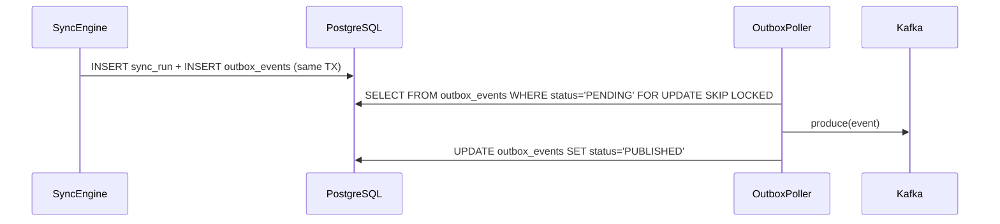

**Phase 2**: Replace poller with **Debezium CDC** connector reading the outbox table. Not parallel — CDC replaces the poller.

### 11.5 Retry and DLQ Strategy

| Stage | Retry Policy | After Exhaustion |
|-------|-------------|-----------------|
| Outbox publish | 3 attempts, exponential backoff (1s, 2s, 4s) | Mark `outbox_events.status = 'FAILED'`; alert |
| Sync record processing | Configurable per profile (`max_retries`, `retry_backoff_ms`) | Move to `sync_exception_queue` with `status = 'DEAD_LETTERED'` |
| Kafka consumer | Spring Kafka `DefaultErrorHandler`, 3 retries | Route to `integration-events.dlq` topic |
| Webhook delivery (outbound) | 3 attempts, exponential backoff | Log failure; mark webhook delivery as FAILED |

### 11.6 Webhook Normalization

Inbound webhooks are received, validated, normalized, and published to Kafka entirely within **integration-service**. The api-gateway is proxy-only — it routes `/api/v1/webhooks/**` to `lb://INTEGRATION-SERVICE` but performs no webhook business logic (no HMAC validation, no normalization, no Kafka production).

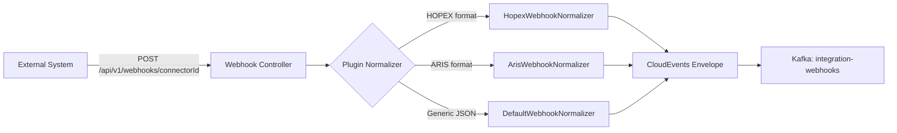

---

## 12. Deployment, Rollout & Migration

### 12.1 Runtime Placement

| Property | Value |
|----------|-------|
| Service name | `integration-service` |
| Default port | `8091` |
| Spring application name | `integration-service` |
| Eureka registration | `lb://INTEGRATION-SERVICE` |
| API route | `api-gateway` → `/api/v1/integrations/**` → `integration-service` |
| Webhook route | `api-gateway` → `/api/v1/webhooks/**` → `integration-service` |

**Dependencies:**

| Dependency | Required | Purpose |
|-----------|----------|---------|
| PostgreSQL | Yes | Control-plane data (dedicated schema `integration`) |
| Vault | Yes (Phase 2) | Credential storage; Phase 1 uses encrypted DB column |
| Kafka | Yes | Async commands/events, outbox publication, webhook normalization |
| audit-service | Yes | Canonical audit persistence |
| notification-service | Yes | Alert delivery |
| auth-facade | Yes | Trust and connector token issuance |
| license-service | Yes | Entitlement checks |

### 12.2 Storage Deployment Model

- **Phase 1**: Dedicated logical PostgreSQL database or dedicated schema for integration-service
- **Secrets**: Vault only (encrypted column as Phase 1 interim)
- **Kafka**: Required for outbox publication, sync commands, webhook normalization
- **Rule**: No domain truth stored in integration-service; only control-plane and operational data

### 12.3 Gateway and Service Registration

- Add Eureka registration for integration-service
- Add gateway route in `RouteConfig.java` using `lb://INTEGRATION-SERVICE` style
- Enforce JWT on `/api/v1/integrations/**`
- Allow unauthenticated ingress only for webhook endpoints, protected by signature/timestamp/IP policy

Gateway route addition:

```java
// INTEGRATION SERVICE (8091) - Integration Governance Hub
.route("integration-service", r -> r
    .path("/api/v1/integrations/**")
    .uri("lb://INTEGRATION-SERVICE"))
.route("integration-webhooks", r -> r
    .path("/api/v1/webhooks/**")
    .uri("lb://INTEGRATION-SERVICE"))
```

Health route in `application.yml`:

```yaml
- id: integration-health
  uri: lb://INTEGRATION-SERVICE
  predicates:
    - Path=/services/integration/health
  filters:
    - RewritePath=/services/integration/health, /actuator/health
```

### 12.4 Frontend Rollout

- New standalone admin section: `features/administration/sections/integration-hub/`
- Extend `AdminSection`, `ADMIN_NAV_ITEMS`, and `ADMIN_SECTION_LABELS` in `administration.models.ts`
- Render via `/administration?section=integration-hub`, matching `administration.page.ts`

### 12.5 Phased Rollout

| Phase | Scope |
|-------|-------|
| **Phase 0** | Internal service skeleton, DB schema, gateway route, health endpoint |
| **Phase 1** | Connector registry, playground, sync profiles, outbox poller, audit publishing |
| **Phase 2** | Mapping studio/runtime, exception queue, health dashboard, notification hooks |
| **Phase 3** | A2A governance, T2T connector, webhook normalization, Kafka command topics |
| **Phase 4** | Debezium outbox CDC, Avro schemas, advanced observability export |

### 12.6 Feature Flags

| Flag | Gates |
|------|-------|
| `integrationHub.enabled` | Backend routes + frontend section visibility |
| `integrationHub.playground.enabled` | Playground tab and endpoints |
| `integrationHub.mappingStudio.enabled` | Mapping studio tab and endpoints |
| `integrationHub.t2t.enabled` | Tenant-to-tenant connector type |
| `integrationHub.a2a.enabled` | Agent-to-agent governance |
| `integrationHub.observabilityExport.enabled` | External observability pipeline export |

### 12.7 Environment Strategy

**Development:**
- Local PostgreSQL
- Local Vault dev mode or stubbed secret adapter
- Kafka optional but supported
- WireMock for external systems

**Staging:**
- Real Vault integration
- Kafka enabled
- Representative connectors against sandbox endpoints
- Canary deployment enabled

**Production:**
- Vault mandatory
- Kafka mandatory
- Prometheus scrape + telemetry pipeline enabled
- Restricted connector allowlists and outbound egress controls enabled by default

### 12.8 Migration and Backward Compatibility

- No existing connector data migration assumed in Phase 1
- If connector-like config already exists elsewhere, import through one-time bootstrap jobs (not live shared ownership)
- Mapping profile versions are immutable and pinned
- Outbox poller is Phase 1 publication mechanism; Debezium CDC is a later replacement, not parallel from day one

### 12.9 Deployment Safety

Use canary rollout for integration-service in staging/production. New service must pass:

- Health endpoint checks
- Vault connectivity check
- Kafka publish smoke test
- PostgreSQL migration success

**Rollback triggers:**

| Trigger | Action |
|---------|--------|
| Webhook rejection spike | Halt canary, rollback |
| Sync failure rate above threshold | Halt canary, rollback |
| Vault resolution failures | Halt canary, rollback |
| Audit outbox backlog growth beyond limit | Halt canary, investigate |

### 12.10 Flyway Migrations

```
backend/integration-service/src/main/resources/db/migration/
├── V1__create_connectors.sql
├── V2__create_connector_credentials.sql
├── V3__create_definition_mappings.sql
├── V4__create_attribute_mappings.sql
├── V5__create_match_rules.sql
├── V6__create_identity_bindings.sql
├── V7__create_schema_snapshots.sql
├── V8__create_sync_profiles.sql
├── V9__create_sync_runs.sql
├── V10__create_sync_checkpoints.sql
├── V11__create_run_locks.sql
├── V12__create_sync_exception_queue.sql
├── V13__create_outbox_events.sql
├── V14__create_agent_channels.sql
├── V15__create_connector_policies.sql
├── V16__create_connector_health_log.sql
└── V17__create_webhook_registrations.sql
```

All migrations are tenant-aware: every table includes `tenant_id` column with index.

---

## 13. Testing, SLOs & Acceptance Criteria

### 13.1 Test Layers

| Layer | Scope |
|-------|-------|
| **Unit tests** | Mapping rules, policy enforcement, checkpoint logic, plugin adapters |
| **Contract tests** | REST API contracts, ProblemDetail responses, auth/tenant scoping |
| **Integration tests** | PostgreSQL, Kafka, Vault, outbox poller, WireMock external systems |
| **Security tests** | Tenant isolation, SSRF controls, webhook replay blocking, secret leakage prevention |
| **E2E tests** | Admin UI flows, playground wizard, mapping preview, sync trigger, health timeline |
| **Performance tests** | Sync throughput, batch latency, webhook ingestion, outbox drain speed |
| **Resilience tests** | Retries, partial failure, lock expiry recovery, dead-letter handling |

### 13.2 Required Test Infrastructure

| Component | Purpose |
|-----------|---------|
| Testcontainers (PostgreSQL) | Repository and migration tests |
| Testcontainers (Kafka) | Outbox publishing, event consumption, DLQ |
| Vault test harness | Controlled fake secret adapter |
| WireMock | HOPEX/ARIS/webMethods-style external API simulation |
| Mock webhook senders | Signed payload generation and replay tests |
| Playwright | Frontend E2E |
| CloudEvents schema validator | Contract validation for event payloads |

### 13.3 Critical Test Scenarios

| # | Scenario | Expected |
|---|----------|----------|
| 1 | Cross-tenant access | Returns 404, not 403 |
| 2 | Concurrent mutating syncs on same connector | Second trigger returns 409 Conflict |
| 3 | Checkpoint resume after mid-batch failure | Resumes from last committed checkpoint |
| 4 | Record-level failure with partial completion | Failed records move to `sync_exception_queue`; run completes as PARTIAL |
| 5 | Secret exposure | Secrets never appear in DB records, logs, Kafka payloads, or audit metadata |
| 6 | Webhook replay within blocked window | Rejected and audited |
| 7 | Outbox exactly-once semantics | Poller publishes once per outbox row; idempotent consumer handling downstream |
| 8 | Mapping version pinning | Sync uses pinned version even after newer mapping published |
| 9 | Playground `dry_write` | Never performs a network send |
| 10 | Expired auth/credential failure | Run stops; health degradation emitted; no blind retry |
| 11 | Role drift handling | `TENANT_ADMIN`, `ADMIN`, and `SUPER_ADMIN` authorize as documented; no endpoint depends on nonexistent `PLATFORM_ADMIN` |

### 13.4 SLOs

| SLO | Target |
|-----|--------|
| Connector health status freshness | < 60s for active connectors |
| Playground connectivity/auth test p95 | < 5s |
| Sync run start latency after manual trigger | < 10s |
| Outbox event publish latency p95 | < 2s |
| Webhook accept-to-enqueue latency p95 | < 1s |
| Failed sync alert delivery | < 60s |
| Cross-tenant leakage incidents | 0 |
| Secret exposure incidents | 0 |

### 13.5 Acceptance Criteria

| ID | Criterion |
|----|-----------|
| AC-01 | integration-service registers with Eureka and is routed by gateway successfully |
| AC-02 | Admin UI section renders under `/administration?section=integration-hub` |
| AC-03 | Tenant-scoped connector CRUD works with correct authorization boundaries |
| AC-04 | Playground supports connectivity, auth, schema discovery, dry-read, and dry-write safely |
| AC-05 | Sync profiles execute on-demand and scheduled modes with checkpoint recovery |
| AC-06 | Outbox poller publishes audit/integration events to Kafka and consumers process them |
| AC-07 | Health dashboard reflects status, last sync, auth expiry, and recent failures |
| AC-08 | audit-service contains immutable records for config, sync, policy, and security events |
| AC-09 | SSRF, webhook replay, and secret-handling negative tests pass |
| AC-10 | Performance and observability SLO gates pass in staging |

---

## Appendix A: Technology Stack

| Component | Technology | Version |
|-----------|-----------|---------|
| Runtime | Java | 23 |
| Framework | Spring Boot | 3.4.13 |
| Build | Maven | (parent POM) |
| ORM | Spring Data JPA + Flyway | — |
| Mapping | MapStruct | 1.6.3 |
| Expression engine | Apache JEXL | 3.x |
| Resilience | Resilience4j | — |
| Testing | JUnit 5, Mockito, Testcontainers | 1.21.4 |
| Event format | CloudEvents | 1.0 |
| Frontend | Angular (standalone components) | 21 |
| E2E testing | Playwright | — |

## Appendix B: Glossary

| Term | Definition |
|------|-----------|
| **Connector** | A registered integration point to an external system or tenant |
| **Sync profile** | Configuration defining what, when, and how to synchronize data |
| **Sync run** | A single execution of a sync profile |
| **Checkpoint** | A cursor/timestamp marking progress for incremental sync |
| **Run lock** | A PostgreSQL advisory lock preventing concurrent sync execution |
| **Outbox event** | A transactional record ensuring at-least-once Kafka delivery |
| **Exception queue** | Per-record error buffer for retry or manual resolution |
| **Plugin** | Product-specific adapter implementing the `ConnectorPlugin` SPI |
| **Match rule** | Configuration for identity resolution during bidirectional sync |
| **Identity binding** | A confirmed mapping between a source record ID and a target record ID |
