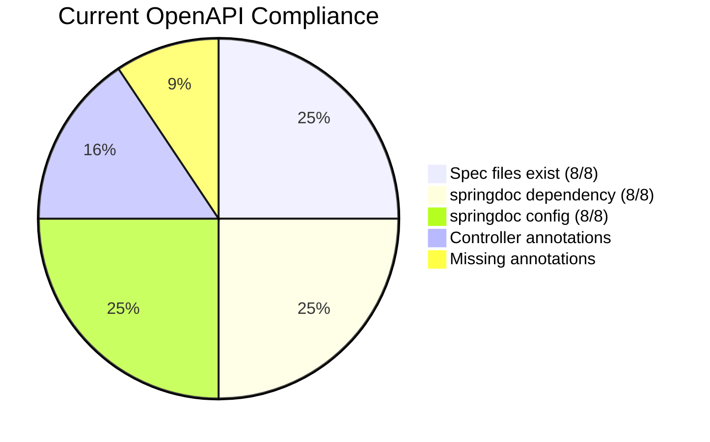
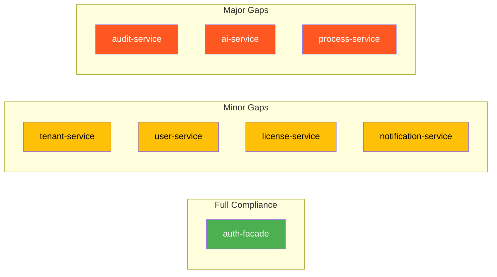
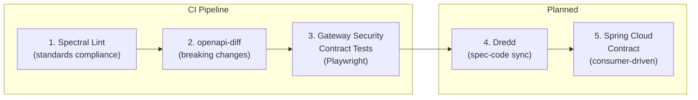
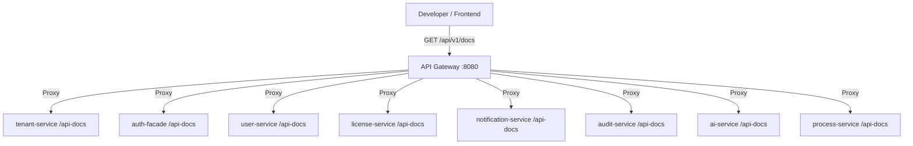
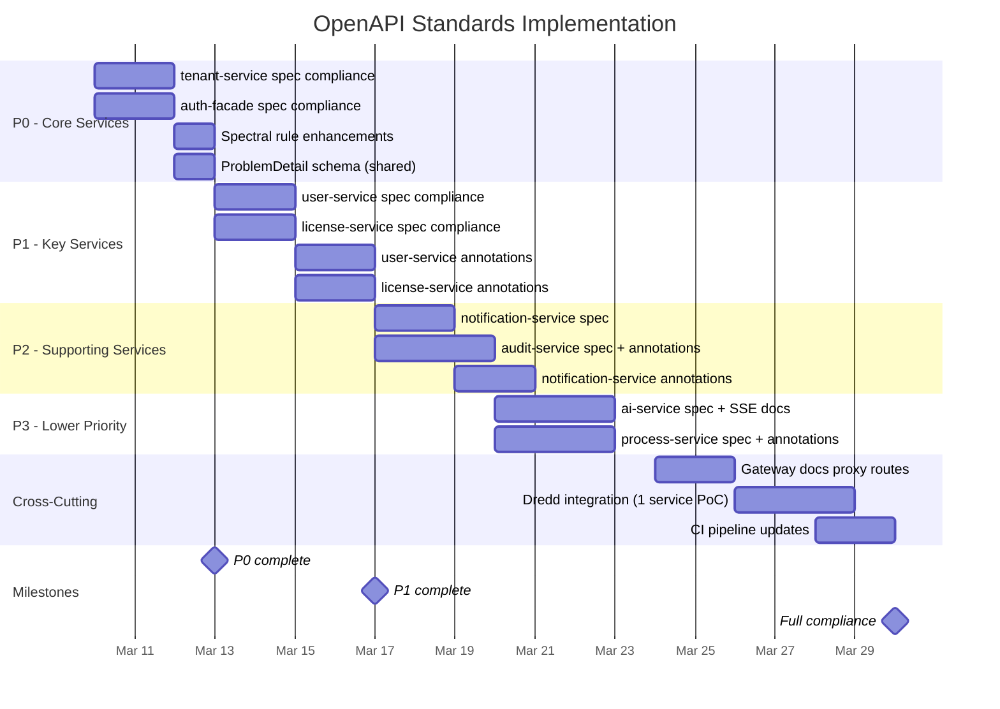

# LLD: OpenAPI Standards Audit and Implementation Plan

**Author:** SA Agent
**Date:** 2026-03-03
**SA Principles Version:** v1.1.0
**Status:** [IMPLEMENTED] (audit) / [PLANNED] (standards enforcement + gateway aggregation)

---

## 1. Overview

This document audits the current state of OpenAPI specifications across all 8 active EMSIST backend microservices, defines the mandatory standards every specification must follow, and provides an implementation plan for achieving full compliance.

### Purpose

- Establish a single source of truth for API contracts
- Enable automated linting, breaking-change detection, and contract testing
- Support API gateway aggregation for developer portal consumption
- Enforce security requirements (Bearer JWT, tenant isolation) at the contract level

### Scope

All 8 active services with source code:

| Service | Port | Database |
|---------|------|----------|
| auth-facade | 8081 | Neo4j + Valkey |
| tenant-service | 8082 | PostgreSQL |
| user-service | 8083 | PostgreSQL |
| license-service | 8085 | PostgreSQL |
| notification-service | 8086 | PostgreSQL |
| audit-service | 8087 | PostgreSQL |
| ai-service | 8088 | PostgreSQL + pgvector |
| process-service | 8089 | PostgreSQL |

**Excluded:** api-gateway (8080) -- does not serve its own REST endpoints, only proxies downstream services. It is a Spring Cloud Gateway (reactive) and does not use `springdoc-openapi-starter-webmvc-ui`.

---

## 2. Current State Audit

### 2.1 OpenAPI Spec File Inventory

All 8 services already have OpenAPI spec files at `backend/{service}/openapi.yaml`. Verified via filesystem glob.

| Service | Spec File | Exists | OpenAPI Version | Lines |
|---------|-----------|--------|-----------------|-------|
| auth-facade | `backend/auth-facade/openapi.yaml` | Yes | 3.1.0 | ~700+ |
| tenant-service | `backend/tenant-service/openapi.yaml` | Yes | 3.1.0 | 579 |
| user-service | `backend/user-service/openapi.yaml` | Yes | 3.1.0 | 411 |
| license-service | `backend/license-service/openapi.yaml` | Yes | 3.1.0 | 445 |
| notification-service | `backend/notification-service/openapi.yaml` | Yes | 3.1.0 | 527 |
| audit-service | `backend/audit-service/openapi.yaml` | Yes | 3.1.0 | 406 |
| ai-service | `backend/ai-service/openapi.yaml` | Yes | 3.1.0 | 702 |
| process-service | `backend/process-service/openapi.yaml` | Yes | 3.1.0 | 507 |

**Evidence:** `find backend -maxdepth 2 -name openapi.yaml` returns all 8 files.

### 2.2 springdoc-openapi Dependency

All 8 services declare `springdoc-openapi-starter-webmvc-ui` as a dependency. The version is managed centrally in the parent POM.

| Service | pom.xml Dependency | Version (from parent) |
|---------|-------------------|----------------------|
| auth-facade | `springdoc-openapi-starter-webmvc-ui` | 2.3.0 |
| tenant-service | `springdoc-openapi-starter-webmvc-ui` | 2.3.0 |
| user-service | `springdoc-openapi-starter-webmvc-ui` | 2.3.0 |
| license-service | `springdoc-openapi-starter-webmvc-ui` | 2.3.0 |
| notification-service | `springdoc-openapi-starter-webmvc-ui` | 2.3.0 |
| audit-service | `springdoc-openapi-starter-webmvc-ui` | 2.3.0 |
| ai-service | `springdoc-openapi-starter-webmvc-ui` | 2.3.0 |
| process-service | `springdoc-openapi-starter-webmvc-ui` | 2.3.0 |

**Evidence:** Parent POM at `backend/pom.xml` line 45: `<springdoc.version>2.3.0</springdoc.version>`. Each service's pom.xml declares the dependency without a version (inherits from `<dependencyManagement>`).

**Note:** api-gateway uses `spring-cloud-starter-gateway` (reactive stack), not webmvc. It does NOT have `springdoc-openapi-starter-webmvc-ui` and should not -- it is not a resource server. Verified at `backend/api-gateway/pom.xml`.

### 2.3 springdoc Configuration in application.yml

All 8 services configure springdoc identically.

| Service | `/api-docs` Path | `/swagger-ui.html` Path | Extra Config |
|---------|-----------------|------------------------|--------------|
| auth-facade | `/api-docs` | `/swagger-ui.html` | None |
| tenant-service | `/api-docs` | `/swagger-ui.html` | None |
| user-service | `/api-docs` | `/swagger-ui.html` | None |
| license-service | `/api-docs` | `/swagger-ui.html` | None |
| notification-service | `/api-docs` | `/swagger-ui.html` | None |
| audit-service | `/api-docs` | `/swagger-ui.html` | None |
| ai-service | `/api-docs` | `/swagger-ui.html` | `enabled: true` |
| process-service | `/api-docs` | `/swagger-ui.html` | None |

**Evidence:** `grep -r "springdoc" backend/*/src/main/resources/application.yml` confirms all 8 services have identical config blocks.

### 2.4 Controller Annotation Coverage

Checked for `@Operation`, `@ApiResponse`, `@Parameter`, and `@Schema` annotations across all controllers.

| Service | Controllers | Total Annotations | Annotation Density |
|---------|------------|-------------------|-------------------|
| auth-facade | AuthController, AdminProviderController, AdminUserController, EventController | 150+ | HIGH |
| tenant-service | TenantController | 17 | MEDIUM |
| user-service | UserController | 22 | MEDIUM |
| license-service | LicenseAdminController, SeatManagementController, SeatValidationController, FeatureGateController | 58 | HIGH |
| notification-service | NotificationController, PreferenceController, TemplateController | 21 | MEDIUM |
| audit-service | AuditController | 9 | LOW |
| ai-service | AgentController, ConversationController, StreamController, KnowledgeController, ProviderController | 26 | MEDIUM |
| process-service | BpmnElementTypeController | 4 | LOW |

**Evidence:** `grep -c "@Operation\|@ApiResponse\|@Parameter\|@Schema" backend/*/src/main/java/**/*Controller.java` returns 324 total annotations across 20 controller files.

### 2.5 Existing Contract Testing Infrastructure

The following contract testing infrastructure is already in place:

| Component | Location | Status |
|-----------|----------|--------|
| Spectral ruleset | `.spectral.yaml` | [IMPLEMENTED] -- 4 custom rules |
| Breaking-change detection script | `scripts/check-openapi-breaking.sh` | [IMPLEMENTED] -- uses openapi-diff Docker image |
| Gateway security contract tests | `contracts/tests/gateway-security.contract.spec.ts` | [IMPLEMENTED] -- 4 Playwright tests |
| CI/CD pipeline | `.github/workflows/api-contract-security.yml` | [IMPLEMENTED] -- 2 jobs |

**Spectral Rules (verified at `.spectral.yaml`):**

1. `require-global-security` -- OpenAPI specs must define a global `security` requirement (severity: error)
2. `require-security-schemes` -- Must define `components.securitySchemes` (severity: error)
3. `require-bearer-or-oauth2` -- Security schemes must include `bearerAuth` and/or `oauth2ClientCredentials` (severity: error)
4. `internal-apis-must-declare-scope` -- Internal APIs (`/api/v1/internal/*`) must require `internal.service` scope via `oauth2ClientCredentials` (severity: error)

**Breaking-Change Detection (verified at `scripts/check-openapi-breaking.sh`):**

- Compares current `backend/*/openapi.yaml` against `origin/main` baseline
- Uses `openapitools/openapi-diff:latest` Docker image
- Fails on incompatible (breaking) changes
- Skips new specs that have no baseline

**Gateway Security Contract Tests (verified at `contracts/tests/gateway-security.contract.spec.ts`):**

- 4 Playwright-based HTTP contract tests
- Tests: unauthenticated user API (401), unauthenticated tenant creation (401), internal API protection (401), malformed bearer token (401)
- Uses `CONTRACT_BASE_URL` (default `http://localhost:28080`) and `CONTRACT_TENANT_ID` header

**CI Pipeline (verified at `.github/workflows/api-contract-security.yml`):**

- Job 1 (`openapi-governance`): Spectral lint + breaking-change check on all `backend/*/openapi.yaml`
- Job 2 (`gateway-security-contracts`): Starts gateway + Valkey in Docker Compose, runs Playwright contract tests

### 2.6 Compliance Summary



| Compliance Area | Score | Notes |
|----------------|-------|-------|
| Spec file exists | 8/8 (100%) | All services have `openapi.yaml` |
| OpenAPI 3.1.0 version | 8/8 (100%) | All specs use 3.1.0 |
| springdoc dependency | 8/8 (100%) | All services have it in pom.xml |
| springdoc config | 8/8 (100%) | All have `/api-docs` + `/swagger-ui.html` |
| `info.title` | 8/8 (100%) | All present |
| `info.version` | 8/8 (100%) | All set to `1.0.0` |
| `info.contact` | 8/8 (100%) | All have `name: EMS Team` |
| `servers` array | 8/8 (100%) | All have at least localhost |
| `security` (global) | 8/8 (100%) | All declare `bearerAuth` |
| `tags` | 8/8 (100%) | All have endpoint grouping |
| `operationId` on all endpoints | 8/8 (100%) | All endpoints have operationId |
| `$ref` schemas | 8/8 (100%) | All use component schemas |
| `X-Tenant-ID` header | 6/8 (75%) | Missing in tenant-service and auth-facade |
| `info.description` (detailed) | 2/8 (25%) | Only auth-facade has detailed description |
| `info.contact.email` | 1/8 (12%) | Only auth-facade |
| `info.license` | 1/8 (12%) | Only auth-facade |
| Production `servers` entry | 2/8 (25%) | auth-facade + tenant-service |
| Error responses (400/401/403/500) | 3/8 (37%) | Most specs only document happy path + 404 |
| RFC 7807 error schemas | 0/8 (0%) | No service defines Problem Details schema |
| Deprecation markers | 0/8 (0%) | No endpoints marked deprecated |

---

## 3. Standards to Implement

### 3.1 Mandatory Spec Structure

Every `backend/{service}/openapi.yaml` MUST contain:

```yaml
openapi: 3.1.0
info:
  title: "{Service Name} API"
  description: |
    {Multi-line description of the service purpose, capabilities, and architecture notes.}
  version: "{semver}"
  contact:
    name: EMS Team
    email: support@ems.com
  license:
    name: Proprietary
    url: https://ems.com/license

servers:
  - url: http://localhost:{port}
    description: Local development
  - url: http://{service}:{port}
    description: Docker Compose network
  - url: https://api.ems.com
    description: Production (via API Gateway)

security:
  - bearerAuth: []

tags:
  - name: {GroupName}
    description: {Group description}

paths:
  # ... endpoints ...

components:
  securitySchemes:
    bearerAuth:
      type: http
      scheme: bearer
      bearerFormat: JWT
    oauth2ClientCredentials:
      type: oauth2
      flows:
        clientCredentials:
          tokenUrl: /realms/{realm}/protocol/openid-connect/token
          scopes:
            internal.service: Internal service-to-service calls

  parameters:
    XTenantID:
      name: X-Tenant-ID
      in: header
      required: true
      description: Tenant identifier for multi-tenant isolation
      schema:
        type: string
        format: uuid
        example: "00000000-0000-0000-0000-000000000001"

  schemas:
    ProblemDetail:
      type: object
      description: RFC 7807 Problem Details
      properties:
        type:
          type: string
          format: uri
          description: URI reference identifying the problem type
        title:
          type: string
          description: Short human-readable summary
        status:
          type: integer
          description: HTTP status code
        detail:
          type: string
          description: Human-readable explanation
        instance:
          type: string
          format: uri
          description: URI reference of the specific occurrence
        timestamp:
          type: string
          format: date-time
        traceId:
          type: string
          description: Distributed tracing ID
```

### 3.2 Endpoint Requirements

Every endpoint MUST include:

| Field | Required | Example |
|-------|----------|---------|
| `operationId` | Yes | `createTenant` (camelCase, verb-first) |
| `summary` | Yes | "Create a new tenant" (max 80 chars) |
| `description` | Yes | Multi-line description with business context |
| `tags` | Yes | At least one tag |
| `security` | Yes (or override `[]`) | `bearerAuth` or explicitly `security: []` for public |
| `parameters` | If applicable | Include `$ref: '#/components/parameters/XTenantID'` for tenant-scoped |
| `requestBody` | If applicable | With `$ref` to schema and `required: true/false` |
| `responses` | Yes | At minimum: success + 400 + 401 + 403 + 500 |

### 3.3 Standard Response Codes

Every endpoint MUST document these responses:

| Code | When | Schema |
|------|------|--------|
| 200 | Successful GET/PUT/PATCH | Resource or resource list |
| 201 | Successful POST (creation) | Created resource with `Location` header |
| 204 | Successful DELETE | No content |
| 400 | Validation failure | `$ref: '#/components/schemas/ProblemDetail'` |
| 401 | Missing or invalid token | `$ref: '#/components/schemas/ProblemDetail'` |
| 403 | Insufficient permissions | `$ref: '#/components/schemas/ProblemDetail'` |
| 404 | Resource not found | `$ref: '#/components/schemas/ProblemDetail'` |
| 409 | Conflict (duplicate, concurrent edit) | `$ref: '#/components/schemas/ProblemDetail'` |
| 500 | Internal server error | `$ref: '#/components/schemas/ProblemDetail'` |

### 3.4 Naming Conventions

| Element | Convention | Example |
|---------|-----------|---------|
| operationId | camelCase, verb-first | `createTenant`, `listUsers`, `getTenantById` |
| Schema names | PascalCase | `TenantSummary`, `CreateTenantRequest` |
| Path parameters | camelCase | `{tenantId}`, `{userId}` |
| Query parameters | camelCase | `pageSize`, `sortBy` |
| Path segments | kebab-case | `/api/v1/tenant-licenses` |
| Header parameters | PascalKebab-Case | `X-Tenant-ID`, `X-Request-ID` |

### 3.5 Pagination Standard

All list endpoints MUST use this pagination schema:

```yaml
components:
  schemas:
    PageMetadata:
      type: object
      properties:
        page:
          type: integer
          description: Current page number (0-based)
        size:
          type: integer
          description: Page size
        totalElements:
          type: integer
          format: int64
          description: Total number of elements
        totalPages:
          type: integer
          description: Total number of pages

  parameters:
    PageParam:
      name: page
      in: query
      description: Page number (0-based)
      schema:
        type: integer
        default: 0
        minimum: 0
    SizeParam:
      name: size
      in: query
      description: Page size
      schema:
        type: integer
        default: 20
        minimum: 1
        maximum: 100
    SortParam:
      name: sort
      in: query
      description: "Sort expression (e.g., createdAt,desc)"
      schema:
        type: string
```

### 3.6 Security Scheme Standard

```yaml
components:
  securitySchemes:
    bearerAuth:
      type: http
      scheme: bearer
      bearerFormat: JWT
      description: |
        JWT access token obtained from auth-facade.
        Token must contain: sub, tenant_id, realm_access.roles claims.

    oauth2ClientCredentials:
      type: oauth2
      description: Service-to-service authentication via client credentials
      flows:
        clientCredentials:
          tokenUrl: "{keycloak-url}/realms/{realm}/protocol/openid-connect/token"
          scopes:
            internal.service: Access internal service APIs
```

**Public endpoints** (no authentication required) MUST explicitly override:

```yaml
paths:
  /api/tenants/resolve:
    get:
      security: []  # Explicitly public
```

### 3.7 Tenant Isolation Header

All tenant-scoped endpoints MUST include the `X-Tenant-ID` header parameter:

```yaml
parameters:
  - $ref: '#/components/parameters/XTenantID'
```

Exceptions (global scope, no tenant header required):
- `GET /api/tenants` -- master admin listing all tenants
- `POST /api/tenants` -- master admin creating a tenant
- `GET /api/tenants/resolve` -- public tenant resolution
- BPMN element type CRUD in process-service (global catalog)

---

## 4. Gap Analysis per Service

### 4.1 Gap Matrix



### 4.2 Detailed Service Gaps

#### auth-facade [LOWEST GAP]

| Standard | Current State | Gap |
|----------|--------------|-----|
| `info.description` | Detailed multi-paragraph | None |
| `info.contact.email` | `support@ems.com` | None |
| `info.license` | Proprietary | None |
| Production server | `https://auth.ems.com` | None |
| Error responses | Mostly documented | Minor -- add 500 responses |
| RFC 7807 ProblemDetail | Not defined | Add `ProblemDetail` schema |
| `X-Tenant-ID` header | Uses custom `X-Tenant-ID` parameter | None |
| Docker server | Not listed | Add Docker Compose URL |
| `oauth2ClientCredentials` scheme | Not defined | Add for internal APIs |

#### tenant-service [MODERATE GAP]

| Standard | Current State | Gap |
|----------|--------------|-----|
| `info.description` | One-liner | Needs detailed description |
| `info.contact.email` | Missing | Add `support@ems.com` |
| `info.license` | Missing | Add Proprietary |
| Production server | `https://api.ems.com` | None |
| Error responses | Partial (409, 404) | Missing 400, 401, 403, 500 |
| RFC 7807 ProblemDetail | Not defined | Add `ProblemDetail` schema |
| `X-Tenant-ID` header | Not declared in components | Not needed -- tenant-service paths embed `{tenantId}` in URL |
| Path convention | `/api/tenants` (no `/v1/`) | Inconsistent with other services using `/api/v1/` |
| Docker server | Not listed | Add Docker Compose URL |

#### user-service [MODERATE GAP]

| Standard | Current State | Gap |
|----------|--------------|-----|
| `info.description` | One-liner | Needs detailed description |
| `info.contact.email` | Missing | Add |
| `info.license` | Missing | Add |
| Production server | Missing | Add |
| Error responses | Partial (401, 404) | Missing 400, 403, 500 |
| RFC 7807 ProblemDetail | Not defined | Add |
| `X-Tenant-ID` header | Defined in components | None |
| Docker server | Missing | Add |

#### license-service [MODERATE GAP]

| Standard | Current State | Gap |
|----------|--------------|-----|
| `info.description` | One-liner | Needs detailed description |
| `info.contact.email` | Missing | Add |
| `info.license` | Missing | Add |
| Production server | Missing | Add |
| Error responses | Partial (404, 409) | Missing 400, 401, 403, 500 |
| RFC 7807 ProblemDetail | Not defined | Add |
| `X-Tenant-ID` header | Defined in components | None |
| Docker server | Missing | Add |

#### notification-service [MODERATE GAP]

| Standard | Current State | Gap |
|----------|--------------|-----|
| `info.description` | One-liner | Needs detailed description |
| `info.contact.email` | Missing | Add |
| `info.license` | Missing | Add |
| Production server | Missing | Add |
| Error responses | Partial (400, 404) | Missing 401, 403, 500 |
| RFC 7807 ProblemDetail | Not defined | Add |
| `X-Tenant-ID` header | Defined in components | None |
| Docker server | Missing | Add |

#### audit-service [MAJOR GAP]

| Standard | Current State | Gap |
|----------|--------------|-----|
| `info.description` | One-liner | Needs detailed description |
| `info.contact.email` | Missing | Add |
| `info.license` | Missing | Add |
| Production server | Missing | Add |
| Error responses | Minimal (404 only) | Missing 400, 401, 403, 500 |
| RFC 7807 ProblemDetail | Not defined | Add |
| `X-Tenant-ID` header | Defined in components | None |
| Docker server | Missing | Add |
| Annotation count | 9 (lowest) | Needs significant annotation work |

#### ai-service [MAJOR GAP]

| Standard | Current State | Gap |
|----------|--------------|-----|
| `info.description` | One-liner | Needs detailed description |
| `info.contact.email` | Missing | Add |
| `info.license` | Missing | Add |
| Production server | Missing | Add |
| Error responses | Minimal | Missing 400, 401, 403, 500 |
| RFC 7807 ProblemDetail | Not defined | Add |
| `X-Tenant-ID` header | Defined in components | None |
| Docker server | Missing | Add |
| Streaming endpoint docs | Basic `text/event-stream` | Needs SSE event format documentation |

#### process-service [MAJOR GAP]

| Standard | Current State | Gap |
|----------|--------------|-----|
| `info.description` | One-liner | Needs detailed description |
| `info.contact.email` | Missing | Add |
| `info.license` | Missing | Add |
| Production server | Missing | Add |
| Error responses | Minimal (404 only) | Missing 400, 401, 403, 500 |
| RFC 7807 ProblemDetail | Not defined | Add |
| `X-Tenant-ID` header | Defined but not on BPMN element type endpoints | Add where tenant-scoped |
| Docker server | Missing | Add |
| Annotation count | 4 (lowest) | Needs significant annotation work |

---

## 5. Implementation Plan

### 5.1 Work Items per Service

For each service, the following changes are needed:

#### Spec File Updates (all services)

1. Add `info.contact.email: support@ems.com`
2. Add `info.license` block (Proprietary)
3. Expand `info.description` with multi-paragraph service description
4. Add `servers` entries for Docker Compose and production
5. Add `ProblemDetail` schema to `components.schemas`
6. Add standard error responses (400, 401, 403, 500) to all endpoints
7. Add `oauth2ClientCredentials` security scheme for internal APIs
8. Add `PageMetadata` schema for paginated responses (where applicable)

#### Controller Annotation Updates (delegate to DEV agent)

1. Add `@Operation(summary, description, operationId)` to all controller methods
2. Add `@ApiResponse` for all standard HTTP codes (200/201/204, 400, 401, 403, 404, 500)
3. Add `@Parameter` for path/query/header parameters
4. Add `@Schema` on all DTO classes
5. Add `@Tag` at the class level on each controller
6. Ensure generated `/api-docs` output matches hand-written `openapi.yaml`

#### Spec File Validation

1. Run Spectral lint after each update
2. Run `openapi-diff` to confirm no unintended breaking changes
3. Compare generated spec (`/api-docs`) against hand-written spec

### 5.2 Tenant-Service Path Versioning Decision

**Observation:** The tenant-service uses `/api/tenants` paths (no `/v1/`), while all other services use `/api/v1/` prefix.

**Recommendation:** This is a pre-existing inconsistency. Changing it now would be a breaking API change requiring ARCH + PM approval. Document as a known inconsistency and address during the next major version bump.

**Escalation:** This requires ARCH review per SA governance rules (affects API gateway routing patterns across services).

### 5.3 Spectral Rule Enhancements [PLANNED]

The current `.spectral.yaml` has 4 security-focused rules. The following rules should be added for full standards compliance:

```yaml
# New rules to add to .spectral.yaml

require-operation-id:
  description: Every operation must have an operationId
  severity: error
  given: "$.paths[*][get,post,put,patch,delete]"
  then:
    field: operationId
    function: truthy

require-operation-summary:
  description: Every operation must have a summary
  severity: error
  given: "$.paths[*][get,post,put,patch,delete]"
  then:
    field: summary
    function: truthy

require-operation-description:
  description: Every operation must have a description
  severity: warn
  given: "$.paths[*][get,post,put,patch,delete]"
  then:
    field: description
    function: truthy

require-info-description:
  description: Info must have a detailed description
  severity: error
  given: "$.info"
  then:
    field: description
    function: truthy

require-info-contact-email:
  description: Info contact must include email
  severity: warn
  given: "$.info.contact"
  then:
    field: email
    function: truthy

require-info-license:
  description: Info must include license
  severity: warn
  given: "$.info"
  then:
    field: license
    function: truthy

require-problem-detail-schema:
  description: Specs must define a ProblemDetail schema for error responses
  severity: warn
  given: "$.components.schemas"
  then:
    field: ProblemDetail
    function: truthy

require-error-responses:
  description: All operations must document 401 and 500 responses
  severity: error
  given: "$.paths[*][get,post,put,patch,delete].responses"
  then:
    - field: "401"
      function: truthy
    - field: "500"
      function: truthy

no-inline-request-schemas:
  description: Request bodies should use $ref, not inline schemas
  severity: warn
  given: "$.paths[*][*].requestBody.content.application/json.schema"
  then:
    field: "$ref"
    function: truthy
```

---

## 6. Contract Testing Integration

### 6.1 Testing Pipeline



### 6.2 Current Tools [IMPLEMENTED]

| Tool | Purpose | Status | Location |
|------|---------|--------|----------|
| **Spectral** | OpenAPI linting against custom ruleset | [IMPLEMENTED] | `.spectral.yaml`, CI job `openapi-governance` |
| **openapi-diff** | Breaking change detection between branches | [IMPLEMENTED] | `scripts/check-openapi-breaking.sh`, CI job `openapi-governance` |
| **Playwright** (contract mode) | Gateway security contract tests | [IMPLEMENTED] | `contracts/tests/`, CI job `gateway-security-contracts` |

### 6.3 Planned Tools

#### Dredd (Spec-Code Sync Validation) [PLANNED]

Dredd validates that the hand-written `openapi.yaml` matches the actual running API.

**How it works:**
1. Start the service (e.g., via Testcontainers or Docker Compose)
2. Dredd reads `backend/{service}/openapi.yaml`
3. Dredd sends HTTP requests for each documented endpoint
4. Dredd validates response status codes and schemas match the spec

**Configuration:**

```yaml
# dredd.yml (per service)
reporter: dot
language: nodejs
server: "docker compose up {service}"
server-wait: 30
endpoint: "http://localhost:{port}"
apiDescriptions:
  - backend/{service}/openapi.yaml
hooks-worker-timeout: 10000
```

**Integration:** Add as CI job gated on service-specific changes.

#### Spring Cloud Contract (Consumer-Driven) [PLANNED]

For service-to-service API contracts:

**Where needed:**
- auth-facade calls tenant-service and user-service (via Feign)
- license-service is called by gateway for feature gates
- notification-service consumes Kafka events from other services

**Approach:**
1. Consumer service defines contract expectations (e.g., "auth-facade expects `GET /api/tenants/{id}` returns TenantSummary")
2. Provider service generates stub JAR from contracts
3. CI verifies provider implementation matches contract

**Escalation:** This is a cross-service decision requiring ARCH review before implementation.

#### openapi-generator (Client SDK Generation) [PLANNED]

Generate TypeScript client SDKs for the Angular frontend from OpenAPI specs:

```bash
npx @openapitools/openapi-generator-cli generate \
  -i backend/tenant-service/openapi.yaml \
  -g typescript-angular \
  -o frontend/src/app/core/api/generated/tenant-service
```

**Benefit:** Ensures frontend API calls stay in sync with backend contracts.
**Escalation:** This changes the frontend build workflow -- requires ARCH + FE team input.

---

## 7. API Gateway Aggregation Design

### 7.1 Architecture



### 7.2 Option A: Gateway Route Proxy (Recommended) [PLANNED]

Add gateway routes to proxy each service's `/api-docs` endpoint.

**Gateway route configuration:**

```yaml
# In api-gateway application.yml
spring:
  cloud:
    gateway:
      routes:
        # OpenAPI docs proxy routes
        - id: tenant-api-docs
          uri: http://localhost:8082
          predicates:
            - Path=/api/v1/docs/tenant-service/api-docs
          filters:
            - RewritePath=/api/v1/docs/tenant-service/api-docs, /api-docs

        - id: auth-api-docs
          uri: http://localhost:8081
          predicates:
            - Path=/api/v1/docs/auth-facade/api-docs
          filters:
            - RewritePath=/api/v1/docs/auth-facade/api-docs, /api-docs

        # ... repeat for all services
```

**Pros:** Simple, no new dependencies, each service owns its spec generation.
**Cons:** No single aggregated spec -- frontend must call each service individually.

### 7.3 Option B: Aggregated Swagger UI at Gateway [PLANNED]

Use `springdoc-openapi-starter-webflux-api` on the gateway to aggregate specs.

**Dependency to add (api-gateway pom.xml):**

```xml
<dependency>
    <groupId>org.springdoc</groupId>
    <artifactId>springdoc-openapi-starter-webflux-api</artifactId>
    <version>${springdoc.version}</version>
</dependency>
```

**Configuration:**

```yaml
# api-gateway application.yml
springdoc:
  swagger-ui:
    urls:
      - name: Auth Facade
        url: /api/v1/docs/auth-facade/api-docs
      - name: Tenant Service
        url: /api/v1/docs/tenant-service/api-docs
      - name: User Service
        url: /api/v1/docs/user-service/api-docs
      - name: License Service
        url: /api/v1/docs/license-service/api-docs
      - name: Notification Service
        url: /api/v1/docs/notification-service/api-docs
      - name: Audit Service
        url: /api/v1/docs/audit-service/api-docs
      - name: AI Service
        url: /api/v1/docs/ai-service/api-docs
      - name: Process Service
        url: /api/v1/docs/process-service/api-docs
```

**Pros:** Single Swagger UI at gateway with service selector dropdown.
**Cons:** Adds dependency to reactive gateway; must verify compatibility with Spring Cloud Gateway.

**Recommendation:** Start with Option A (route proxy). Evaluate Option B after verifying WebFlux compatibility.

**Escalation:** Gateway dependency changes require ARCH review.

---

## 8. Implementation Priority and Timeline

### 8.1 Priority Table

| Priority | Service | Reason | Effort |
|----------|---------|--------|--------|
| **P0** | tenant-service | Core platform service, has most mature spec, path versioning inconsistency to document | Small |
| **P0** | auth-facade | External authentication API, most complex spec, already closest to compliance | Small |
| **P1** | user-service | User management API consumed by frontend admin panel | Medium |
| **P1** | license-service | License management API, feature gates used by other services | Medium |
| **P2** | notification-service | Notification API, moderately complex | Medium |
| **P2** | audit-service | Audit API, low annotation count, needs significant work | Large |
| **P3** | ai-service | AI/Agent API, SSE streaming docs needed | Large |
| **P3** | process-service | Process API, lowest annotation count, not in runtime yet | Large |

### 8.2 Implementation Timeline



### 8.3 Task Breakdown

#### Phase 1: P0 Core Services (March 10-13)

| Task | Agent | Deliverable |
|------|-------|-------------|
| Update tenant-service openapi.yaml (info, servers, errors, ProblemDetail) | SA | Spec file |
| Update auth-facade openapi.yaml (servers, ProblemDetail, oauth2ClientCredentials) | SA | Spec file |
| Define shared ProblemDetail YAML fragment for copy across specs | SA | Template |
| Add new Spectral rules to `.spectral.yaml` | SA + DevOps | Config file |
| Run Spectral lint and fix violations | SA | Validated specs |

#### Phase 2: P1 Key Services (March 13-17)

| Task | Agent | Deliverable |
|------|-------|-------------|
| Update user-service openapi.yaml | SA | Spec file |
| Update license-service openapi.yaml | SA | Spec file |
| Add `@Operation`/`@ApiResponse` annotations to user-service controllers | DEV | Source code |
| Add `@Operation`/`@ApiResponse` annotations to license-service controllers | DEV | Source code |
| Verify generated `/api-docs` matches `openapi.yaml` | QA | Test report |

#### Phase 3: P2 Supporting Services (March 17-20)

| Task | Agent | Deliverable |
|------|-------|-------------|
| Update notification-service openapi.yaml | SA | Spec file |
| Update audit-service openapi.yaml + expand annotations | SA + DEV | Spec + code |
| Add `@Operation`/`@ApiResponse` to notification-service controllers | DEV | Source code |
| Add `@Operation`/`@ApiResponse` to audit-service controllers | DEV | Source code |

#### Phase 4: P3 Lower Priority + Cross-Cutting (March 20-30)

| Task | Agent | Deliverable |
|------|-------|-------------|
| Update ai-service openapi.yaml + SSE event documentation | SA | Spec file |
| Update process-service openapi.yaml + expand annotations | SA + DEV | Spec + code |
| Add gateway proxy routes for `/api-docs` | DEV | Gateway config |
| Dredd PoC for tenant-service | QA-INT | Test results |
| Update CI pipeline with new Spectral rules | DevOps | CI config |

---

## 9. springdoc-openapi Runtime Configuration

### 9.1 Standard Configuration (all services)

Every service's `application.yml` MUST include:

```yaml
springdoc:
  api-docs:
    path: /api-docs
  swagger-ui:
    path: /swagger-ui.html
    enabled: true
  show-actuator: false
  packages-to-scan: com.ems.{service}.controller
  default-produces-media-type: application/json
  default-consumes-media-type: application/json
```

### 9.2 Current State vs Standard

| Service | Current Config | Gap |
|---------|---------------|-----|
| All 8 services | `path: /api-docs` + `path: /swagger-ui.html` | Missing `packages-to-scan`, `show-actuator`, `default-*-media-type` |
| ai-service | Has `enabled: true` | Consistent |
| All others | No `enabled` setting | Defaults to `true` -- acceptable |

### 9.3 Security Considerations for springdoc

In production, Swagger UI SHOULD be disabled:

```yaml
# application-prod.yml
springdoc:
  api-docs:
    enabled: false
  swagger-ui:
    enabled: false
```

**Status:** [PLANNED] -- No `application-prod.yml` profiles exist yet. This should be addressed during the production hardening phase.

---

## 10. Verification Checklist

### SA Completion Checklist

- [x] All 8 services audited for OpenAPI spec existence
- [x] All 8 services audited for springdoc dependency
- [x] All 8 services audited for springdoc configuration
- [x] Controller annotation counts verified per service
- [x] Existing contract testing infrastructure documented
- [x] Gap analysis completed per service
- [x] Standards defined (spec structure, endpoints, responses, naming, pagination, security)
- [x] Implementation priority and timeline provided
- [x] Gateway aggregation design options documented
- [x] Contract testing integration plan documented
- [x] All diagrams use Mermaid syntax (no ASCII art)
- [x] All claims verified against actual files (EBD compliance)
- [x] Status tags used ([IMPLEMENTED], [IN-PROGRESS], [PLANNED])

### Upstream Dependencies

- [x] ARCH HLD/ADRs reviewed (SA-PRINCIPLES.md mandates this)
- [ ] BA domain model not required (this is infrastructure/tooling, not business domain)
- [x] Existing Spectral rules and CI pipeline verified

### Downstream Handoffs

| Artifact | Recipient Agent | Action |
|----------|----------------|--------|
| This document | DEV | Implement `@Operation`/`@ApiResponse` annotations per service |
| This document | DevOps | Update `.spectral.yaml` with new rules, update CI pipeline |
| This document | QA-INT | Dredd PoC for spec-code sync validation |
| This document | ARCH | Review gateway aggregation approach and path versioning inconsistency |

---

## 11. Tactical ADR: OpenAPI Standards Enforcement

**Decision:** Enforce OpenAPI 3.1.0 standards via automated Spectral linting in CI pipeline, with hand-written specs as the source of truth (not auto-generated from code).

**Context:** The project has 8 hand-written `openapi.yaml` specs and 8 services with springdoc auto-generating `/api-docs` at runtime. We need to decide which is the source of truth.

**Decision Rationale:**
1. Hand-written specs (`backend/{service}/openapi.yaml`) are the **design-time** source of truth -- reviewed, version-controlled, and linted
2. springdoc-generated `/api-docs` is the **runtime** source of truth -- always matches actual code
3. Dredd bridges the gap by validating that hand-written specs match runtime behavior
4. Spectral enforces standards on hand-written specs in CI
5. openapi-diff detects breaking changes against the previous version

**Consequences:**
- All API design reviews happen against `openapi.yaml` files
- Controller annotations must be kept in sync with spec files
- CI blocks merges if Spectral lint fails or breaking changes detected
- Dredd integration (once implemented) blocks merges if spec diverges from code

**Escalation to ARCH:** The path versioning inconsistency (tenant-service uses `/api/tenants` while others use `/api/v1/`) is a strategic decision that affects all clients and should be resolved in an ADR.

---

## References

- **SA Principles:** `/Users/mksulty/Claude/EMSIST/docs/governance/agents/SA-PRINCIPLES.md` (v1.1.0)
- **Parent POM:** `/Users/mksulty/Claude/EMSIST/backend/pom.xml` (springdoc version 2.3.0)
- **Spectral Config:** `/Users/mksulty/Claude/EMSIST/.spectral.yaml`
- **Breaking-Change Script:** `/Users/mksulty/Claude/EMSIST/scripts/check-openapi-breaking.sh`
- **CI Pipeline:** `/Users/mksulty/Claude/EMSIST/.github/workflows/api-contract-security.yml`
- **Contract Tests:** `/Users/mksulty/Claude/EMSIST/contracts/tests/gateway-security.contract.spec.ts`
- **Gateway Config:** `/Users/mksulty/Claude/EMSIST/backend/api-gateway/src/main/resources/application.yml`
- **OpenAPI 3.1 Specification:** https://spec.openapis.org/oas/v3.1.0
- **RFC 7807 Problem Details:** https://datatracker.ietf.org/doc/html/rfc7807
- **springdoc-openapi:** https://springdoc.org/
- **Spectral:** https://stoplight.io/open-source/spectral
