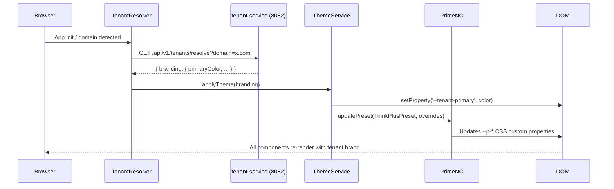

# LLD: PrimeNG Migration and PWA Enablement

**Document Version:** 1.0.0
**Status:** DRAFT
**Last Updated:** 2026-02-26
**Author:** SA Agent
**Reviewed By:** Pending ARCH review

---

## 1. Overview

### 1.1 Purpose

This Low-Level Design defines the incremental migration of the EMSIST frontend from Bootstrap 5.3.8 + ng-bootstrap 20 to PrimeNG 21, followed by Progressive Web App (PWA) enablement. The migration preserves the existing ThinkPLUS design system (teal brand, Gotham Rounded typography, glassmorphism effects, WCAG AAA compliance) while gaining PrimeNG's design token architecture, built-in accessibility, and rich component library.

### 1.2 Scope

| In Scope | Out of Scope |
|----------|--------------|
| Component library replacement (Bootstrap to PrimeNG) | Backend service changes |
| Design token migration (SCSS variables to PrimeNG 3-tier tokens) | API contract changes |
| Custom PrimeNG preset ("ThinkPLUS" preset) | New feature development |
| Multi-tenant runtime theming via `updatePreset()` | BPMN modeler component changes |
| RTL (Arabic) support integration | Database schema changes |
| PWA service worker, manifest, offline strategy | Native mobile app development |
| Responsive + foldable device support | Server-side rendering (SSR) |

### 1.3 Technology Stack

| Technology | Current | Target |
|------------|---------|--------|
| Component Library | Bootstrap 5.3.8 + ng-bootstrap 20 | PrimeNG 21 |
| Design Token System | SCSS variables + CSS custom properties | PrimeNG 3-tier design tokens |
| CSS Framework | Bootstrap CSS (global import) | PrimeNG styled mode + Aura preset base |
| Theming | `ThemeService` with `--tenant-*` CSS variables | `updatePreset()` + `ThemeService` bridge |
| PWA | None | `@angular/pwa` + Workbox |
| Angular | 21.1.0 | 21.1.0 (no change) |

### 1.4 Dependencies on Other Services

None. This is a frontend-only migration. All backend APIs remain unchanged.

### 1.5 Key Constraints

1. **Incremental migration** -- Bootstrap and PrimeNG must coexist during transition phases (A through C)
2. **Zero visual regression** -- All pages must look identical to current ThinkPLUS design after migration
3. **WCAG AAA maintained** -- 7:1 contrast ratios, 44px touch targets, full keyboard navigation
4. **Multi-tenant theming preserved** -- `ThemeService` runtime branding must continue working
5. **RTL support preserved** -- Arabic layout must remain functional throughout migration
6. **BPMN modeler excluded** -- bpmn-js components use their own CSS and are not migrated

---

## 2. Current State Analysis

### 2.1 Bootstrap Usage Inventory

**Source:** `angular.json` line 81 confirms global Bootstrap CSS import:
```
"node_modules/bootstrap/dist/css/bootstrap.min.css"
```

**Source:** `package.json` confirms npm dependencies:
```
"@ng-bootstrap/ng-bootstrap": "^20.0.0"
"bootstrap": "^5.3.8"
"@popperjs/core": "^2.11.8"
```

### 2.2 ng-bootstrap Component Usage

[VERIFIED] Grep for `@ng-bootstrap`, `NgbModule`, `NgbModal`, and all `ngb*` directives in `frontend/src/` returned **zero matches**. The `@ng-bootstrap/ng-bootstrap` package is listed as a dependency but **no ng-bootstrap components are currently imported or used in any TypeScript file**.

**Conclusion:** ng-bootstrap is an unused dependency. No component-level migration from ng-bootstrap widgets is required. The migration is purely about replacing Bootstrap CSS utility classes and Bootstrap-styled component overrides.

### 2.3 Bootstrap CSS Class Usage by File

The following files use Bootstrap CSS utility classes (verified via grep):

| File | Bootstrap Classes Used | Impact Level |
|------|----------------------|--------------|
| `src/app/components/persona-form/persona-form.component.html` | `card`, `card-header`, `card-body`, `row`, `col-*`, `g-*`, `form-control`, `form-select`, `form-label`, `btn`, `btn-*`, `badge`, `bg-*`, `d-flex`, `gap-*`, `mb-*`, `rounded-*`, `border-*`, `bg-opacity-*`, `fw-*`, `text-*`, `w-100`, `p-*`, `small`, `flex-wrap`, `flex-grow-1`, `fst-italic` | HIGH |
| `src/app/components/journey-form/journey-form.component.html` | `card`, `card-header`, `card-body`, `row`, `col-md-*`, `g-*`, `form-control`, `form-select`, `form-label`, `btn`, `btn-*`, `badge`, `bg-*`, `d-flex`, `gap-*`, `mb-*`, `rounded-*`, `border-*`, `bg-opacity-*`, `fw-*`, `text-*`, `w-100`, `alert`, `alert-primary`, `flex-wrap`, `form-range`, `text-truncate` | HIGH |
| `src/app/components/preview/preview.component.html` | `card`, `card-body`, `d-flex`, `gap-*`, `mb-*`, `badge`, `bg-*`, `btn`, `btn-group`, `btn-*`, `fw-*`, `text-*`, `flex-wrap`, `flex-grow-1`, `rounded`, `bg-light`, `fst-italic`, `text-center`, `text-end`, `text-dark`, `py-*`, `p-*`, `small` | HIGH |
| `src/app/components/shared/page-layout/page-layout.component.html` | `breadcrumb`, `breadcrumb-item`, `btn`, `btn-outline-primary` | LOW |
| `src/app/app.html` | Custom classes only (island-btn, nav-dropdown-item, etc.), no Bootstrap | NONE |
| `src/index.html` | Inline critical CSS only, no Bootstrap classes | NONE |

### 2.4 Bootstrap CSS Override Surface in styles.scss

The global `styles.scss` (989 lines) contains a "Bootstrap Component Overrides" section (line 301+) that reskins the following Bootstrap classes to match the ThinkPLUS design system:

| Override Section | Lines | Classes Overridden |
|-----------------|-------|-------------------|
| Cards | 305-358 | `.card`, `.card-glass`, `.card-header`, `.card-body`, `.card-title` |
| Buttons | 378-518 | `.btn`, `.btn-primary`, `.btn-secondary`, `.btn-outline-*`, `.btn-success`, `.btn-sm`, `.btn-lg`, `.btn-icon` |
| Badges | 521-558 | `.badge`, `.badge.bg-*` |
| Forms | 560-617 | `.form-control`, `.form-select`, `.form-label`, `.required`, `.invalid-feedback` |
| Tables | 619-635 | `.table`, `thead th` |
| Dropdowns | 637-664 | `.dropdown-menu`, `.dropdown-item` |
| List Groups | 667-684 | `.list-group-item` |
| Modals | 686-723 | `.modal-content`, `.modal-header`, `.modal-body`, `.modal-footer`, `.modal-backdrop` |
| Utility Classes | 727-768 | `.w-100`, `.h-100`, `.d-flex`, `.gap-*`, `.mb-*`, `.mt-*`, `.me-*`, `.ms-*`, `.p-*`, `.rounded-pill`, `.text-*`, `.bg-*`, `.fw-*` |

### 2.5 Existing ThemeService Architecture

**File:** `src/app/core/services/theme.service.ts`

The `ThemeService` currently applies tenant branding by setting CSS custom properties on `:root`:

| CSS Variable Pattern | Purpose |
|---------------------|---------|
| `--tenant-primary` | Tenant primary brand color |
| `--tenant-primary-dark` | Darker variant |
| `--tenant-secondary` | Secondary brand color |
| `--tenant-accent` | Accent color |
| `--tenant-primary-50` through `--tenant-primary-900` | Color scale (generated) |
| `--tenant-primary-rgb` | RGB values for rgba() |
| `--tenant-font-family` | Custom font |
| `--tenant-heading-font` | Heading font override |
| `--tenant-logo-url` | Logo URL for CSS |
| `--tenant-login-bg` | Login background image |

This service will be extended (not replaced) to bridge into PrimeNG's `updatePreset()` API.

---

## 3. Component Mapping Table

Since ng-bootstrap components are **not actually used in code** (verified: zero imports), the mapping is between Bootstrap CSS component classes and their PrimeNG equivalents.

### 3.1 Layout Components

| Bootstrap Class | PrimeNG Component | Import | Notes |
|----------------|-------------------|--------|-------|
| `.row` + `.col-*` + `.g-*` | `<div class="grid">` + `<div class="col-*">` | PrimeNG Flex/Grid utilities | PrimeNG uses PrimeFlex grid system |
| `.container` / `.container-fluid` | None (keep custom layout) | - | ThinkPLUS uses custom layout containers |
| `.d-flex`, `.flex-column`, etc. | PrimeFlex utility classes | primeflex | `flex`, `flex-column`, `align-items-center` |

### 3.2 Form Components

| Bootstrap Class | PrimeNG Component | Import | Notes |
|----------------|-------------------|--------|-------|
| `<input class="form-control">` | `<input pInputText>` or `<p-inputText>` | `InputTextModule` | Same `<input>`, add directive |
| `<textarea class="form-control">` | `<textarea pTextarea>` | `TextareaModule` | Auto-resize support |
| `<select class="form-select">` | `<p-select>` | `SelectModule` | Rich dropdown with filtering |
| `.form-label` | `<label>` (no change, PrimeNG uses standard labels) | - | Add `pFloatLabel` wrapper if needed |
| `<input type="range" class="form-range">` | `<p-slider>` | `SliderModule` | Built-in styling |
| `.form-control-sm` | `size="small"` attribute | - | PrimeNG component sizes |
| `.input-group` | `<p-inputGroup>` | `InputGroupModule` | Prefix/suffix add-ons |
| `.form-check` / `.form-switch` | `<p-checkbox>` / `<p-toggleSwitch>` | `CheckboxModule` / `ToggleSwitchModule` | - |
| `.invalid-feedback` | `<small class="p-error">` | - | Conditional display |

### 3.3 Data Display Components

| Bootstrap Class | PrimeNG Component | Import | Notes |
|----------------|-------------------|--------|-------|
| `.table` | `<p-table>` | `TableModule` | Virtual scroll, sort, filter, export |
| `.badge` | `<p-badge>` or `<p-tag>` | `BadgeModule` / `TagModule` | Tag for status labels |
| `.card`, `.card-header`, `.card-body` | `<p-card>` | `CardModule` | Or use `<p-panel>` for collapsible |
| `.alert` | `<p-message>` or `<p-inlineMessage>` | `MessageModule` | Severity levels |
| `.list-group`, `.list-group-item` | `<p-listbox>` | `ListboxModule` | Or keep as custom list |

### 3.4 Overlay Components

| Bootstrap Class | PrimeNG Component | Import | Notes |
|----------------|-------------------|--------|-------|
| `.modal` | `<p-dialog>` | `DialogModule` | Draggable, resizable |
| `.dropdown-menu` | `<p-menu>` or `<p-popover>` | `MenuModule` / `PopoverModule` | Context menus |
| `.offcanvas` (not used) | `<p-drawer>` | `DrawerModule` | Side panel |
| `.tooltip` (not used) | `pTooltip` directive | `TooltipModule` | Directive-based |

### 3.5 Navigation Components

| Bootstrap Class | PrimeNG Component | Import | Notes |
|----------------|-------------------|--------|-------|
| `.breadcrumb` | `<p-breadcrumb>` | `BreadcrumbModule` | MenuItem-based model |
| `.nav` / `.nav-tabs` | `<p-tabs>` | `TabsModule` | For detail page tabs |
| `.pagination` | `<p-paginator>` | `PaginatorModule` | Built-in page size selector |

### 3.6 Button Components

| Bootstrap Class | PrimeNG Component | Import | Notes |
|----------------|-------------------|--------|-------|
| `.btn` | `<p-button>` or `pButton` directive | `ButtonModule` | Directive on native `<button>` |
| `.btn-primary` | `severity="primary"` | - | Attribute-based |
| `.btn-secondary` | `severity="secondary"` | - | - |
| `.btn-outline-*` | `[outlined]="true"` | - | Combined with severity |
| `.btn-sm` | `size="small"` | - | - |
| `.btn-lg` | `size="large"` | - | - |
| `.btn-group` | `<p-selectButton>` or `<p-buttonGroup>` | `SelectButtonModule` | For toggle groups |

### 3.7 Utility Class Mapping

| Bootstrap Utility | PrimeNG / PrimeFlex | Notes |
|------------------|---------------------|-------|
| `d-flex` | `flex` | PrimeFlex class |
| `flex-column` | `flex-column` | Same name |
| `justify-content-between` | `justify-content-between` | Same name |
| `align-items-center` | `align-items-center` | Same name |
| `flex-wrap` | `flex-wrap` | Same name |
| `gap-1` through `gap-4` | `gap-1` through `gap-4` | Same name |
| `mb-1` through `mb-4` | `mb-1` through `mb-4` | Same in PrimeFlex |
| `mt-1` through `mt-3` | `mt-1` through `mt-3` | Same in PrimeFlex |
| `p-2`, `p-3` | `p-2`, `p-3` | Same in PrimeFlex |
| `w-100` | `w-full` | PrimeFlex uses `w-full` |
| `text-center` | `text-center` | Same |
| `text-muted` | Custom class (keep) | No PrimeFlex equivalent |
| `fw-semibold`, `fw-bold` | `font-semibold`, `font-bold` | PrimeFlex naming |
| `rounded-pill` | `border-round-3xl` | PrimeFlex border-radius |
| `bg-light` | `surface-50` | PrimeFlex surface classes |
| `bg-opacity-10` | No direct equivalent | Use `rgba()` or keep custom |
| `row` + `col-*` | `grid` + `col-*` | PrimeFlex grid |
| `g-3` (gutter) | `gap-3` on grid parent | Different approach |
| `fst-italic` | `font-italic` | PrimeFlex |
| `text-uppercase` | `text-xs uppercase` | PrimeFlex |
| `small` | `text-sm` | PrimeFlex typography |

---

## 4. Design Token Migration

### 4.1 PrimeNG 3-Tier Token Architecture

PrimeNG uses a three-level design token system:

```
Tier 1: Primitive Tokens   -- Raw values (colors, spacing, font sizes)
    |
Tier 2: Semantic Tokens    -- Intent-based (primary, surface, text colors)
    |
Tier 3: Component Tokens   -- Per-component overrides (button padding, input border)
```

### 4.2 Tier 1: Primitive Token Mapping

Map current SCSS variables and CSS custom properties to PrimeNG primitives.

#### Colors

| Current Variable | Current Value | PrimeNG Primitive Token | Notes |
|-----------------|---------------|------------------------|-------|
| `$teal` / `--tp-teal` | `#047481` | `primitive.teal.600` | Custom teal scale |
| `$teal-dark` / `--tp-teal-dark` | `#035a66` | `primitive.teal.700` | Darker variant |
| `$teal-light` / `--tp-teal-light` | `#5ee7f7` | `primitive.teal.300` | Highlight |
| `--tp-blue-dark` | `#1a365d` | `primitive.blue.900` | Deep blue |
| `--tp-blue` | `#2c5282` | `primitive.blue.700` | Secondary |
| `--tp-blue-light` | `#4299e1` | `primitive.blue.400` | Light blue |
| `$gray-50` / `--tp-gray-50` | `#f7fafc` | `primitive.slate.50` | Lightest neutral |
| `$gray-100` / `--tp-gray-100` | `#edf2f7` | `primitive.slate.100` | Subtle bg |
| `$gray-200` / `--tp-gray-200` | `#e2e8f0` | `primitive.slate.200` | Borders |
| `$gray-300` / `--tp-gray-300` | `#cbd5e0` | `primitive.slate.300` | Disabled |
| `$gray-400` / `--tp-gray-400` | `#545e6e` | `primitive.slate.500` | Muted text (AAA) |
| `$gray-500` / `--tp-gray-500` | `#454e5c` | `primitive.slate.600` | Secondary text |
| `$gray-600` / `--tp-gray-600` | `#2d3748` | `primitive.slate.700` | Body text |
| `$gray-700` / `--tp-gray-700` | `#1a202c` | `primitive.slate.800` | Headings |
| `--tp-green` / `$success` | `#276749` | `primitive.green.700` | Success |
| `--tp-orange` / `$warning` | `#c05621` | `primitive.orange.700` | Warning |
| `--tp-error` / `$danger` | `#c53030` | `primitive.red.700` | Error |
| `--tp-info` / `$info` | `#2b6cb0` | `primitive.blue.600` | Info |
| `--tp-gold` | `#b7791f` | `primitive.amber.600` | Gold accent |
| `--tp-purple` | `#6b46c1` | `primitive.violet.600` | Purple accent |

#### Spacing

| Current Variable | Current Value | PrimeNG Primitive Token |
|-----------------|---------------|------------------------|
| `$space-1` / `space-1` | `4px` / `0.25rem` | `primitive.spacing.1` |
| `$space-2` / `space-2` | `8px` / `0.5rem` | `primitive.spacing.2` |
| `$space-3` / `space-3` | `12px` / `0.75rem` | `primitive.spacing.3` |
| `$space-4` / `space-4` | `16px` / `1rem` | `primitive.spacing.4` |
| `$space-5` / `space-5` | `20px` / `1.25rem` | `primitive.spacing.5` |
| `$space-6` / `space-6` | `24px` / `1.5rem` | `primitive.spacing.6` |
| `$space-8` / `space-8` | `32px` / `2rem` | `primitive.spacing.8` |
| `$space-10` / `space-10` | `40px` / `2.5rem` | `primitive.spacing.10` |
| `$space-12` / `space-12` | `48px` / `3rem` | `primitive.spacing.12` |

#### Border Radius

| Current Variable | Current Value | PrimeNG Primitive Token |
|-----------------|---------------|------------------------|
| `--tp-radius-sm` | `0.375rem` | `primitive.borderRadius.sm` |
| `--tp-radius-md` | `0.5rem` | `primitive.borderRadius.md` |
| `--tp-radius-lg` | `0.75rem` | `primitive.borderRadius.lg` |
| `--tp-radius-xl` | `1rem` | `primitive.borderRadius.xl` |
| `--tp-radius-2xl` | `1.25rem` | `primitive.borderRadius.2xl` |

#### Typography

| Current Variable | Current Value | PrimeNG Primitive Token |
|-----------------|---------------|------------------------|
| `--tp-font-sans` | `'Gotham Rounded', 'Nunito', ...` | `primitive.fontFamily.sans` |
| Body size | `1rem` (16px) | `primitive.fontSize.base` |
| Small | `0.875rem` (14px) | `primitive.fontSize.sm` |
| XSmall | `0.75rem` (12px) | `primitive.fontSize.xs` |
| H1 | `clamp(1.75rem, 2.5vw, 2.25rem)` | `primitive.fontSize.3xl` |
| H2 | `clamp(1.25rem, 2vw, 1.5rem)` | `primitive.fontSize.xl` |
| H3 | `clamp(1.125rem, 1.5vw, 1.25rem)` | `primitive.fontSize.lg` |

### 4.3 Tier 2: Semantic Token Mapping

Semantic tokens map intent to primitive values.

```typescript
// ThinkPLUS Preset - Semantic Tokens (light mode)
semantic: {
  // Primary action color
  primary: {
    50:  '{teal.50}',
    100: '{teal.100}',
    200: '{teal.200}',
    300: '{teal.300}',
    400: '{teal.400}',
    500: '{teal.500}',
    600: '{teal.600}',    // Main primary = #047481
    700: '{teal.700}',    // Hover = #035a66
    800: '{teal.800}',
    900: '{teal.900}',
    950: '{teal.950}',
  },
  // Surface colors (backgrounds, cards)
  colorScheme: {
    light: {
      primary: {
        color:        '{teal.600}',     // --tp-primary: #047481
        contrastColor: '#ffffff',
        hoverColor:    '{teal.700}',    // --tp-primary-dark: #035a66
        activeColor:   '{teal.800}',
      },
      highlight: {
        background:    'rgba(4, 116, 129, 0.1)',
        focusBackground: 'rgba(4, 116, 129, 0.2)',
        color:         '{teal.700}',
        focusColor:    '{teal.800}',
      },
      surface: {
        0:   '#ffffff',
        50:  '{slate.50}',     // #f7fafc
        100: '{slate.100}',    // #edf2f7
        200: '{slate.200}',    // #e2e8f0
        300: '{slate.300}',    // #cbd5e0
        400: '{slate.500}',    // #545e6e
        500: '{slate.600}',    // #454e5c
        600: '{slate.700}',    // #2d3748
        700: '{slate.800}',    // #1a202c
        800: '{slate.900}',
        900: '{slate.950}',
        ground: '#faf9f5',     // --tp-bg (warm off-white)
        section: '#faf9f5',
        card:    '#ffffff',
        overlay: '#ffffff',
        border:  '{slate.200}',  // --tp-border
        hover:   '{slate.50}',
      },
      text: {
        color:          '{slate.800}',  // --tp-text = #1a202c
        hoverColor:     '{slate.950}',
        mutedColor:     '{slate.500}',  // --tp-text-muted = #545e6e
        hoverMutedColor: '{slate.600}',
      },
    },
    dark: {
      // Dark mode tokens - future implementation
      primary: {
        color:         '{teal.400}',
        contrastColor: '{slate.900}',
        hoverColor:    '{teal.300}',
        activeColor:   '{teal.200}',
      },
      surface: {
        0:   '{slate.900}',
        ground: '{slate.950}',
        card:    '{slate.800}',
        overlay: '{slate.800}',
        border:  '{slate.700}',
      },
      text: {
        color:      '{slate.100}',
        mutedColor: '{slate.400}',
      },
    }
  },
  // Focus ring
  focusRing: {
    width:  '2px',
    style:  'solid',
    color:  '{primary.color}',
    offset: '2px',
    shadow: '0 0 0 3px rgba(4, 116, 129, 0.4)',  // --tp-focus-ring
  },
  // Transition
  transitionDuration: '0.2s',
  // Form fields
  formField: {
    paddingX: '1rem',
    paddingY: '0.75rem',
    borderRadius: '{borderRadius.md}',
    focusRing: {
      width:  '0',
      style:  'none',
      color:  'transparent',
      offset: '0',
      shadow: '0 0 0 3px rgba(4, 116, 129, 0.4), 0 2px 8px rgba(4, 116, 129, 0.1)',
    },
  },
  // Content
  content: {
    borderRadius: '{borderRadius.lg}',
  },
  // Mask / Backdrop
  mask: {
    background: 'rgba(26, 32, 44, 0.6)',
    color:      '{surface.200}',
  },
}
```

### 4.4 Tier 3: Component Token Mapping

Component-specific overrides to match ThinkPLUS design.

```typescript
// ThinkPLUS Preset - Component Tokens
components: {
  button: {
    paddingX:       '1.25rem',
    paddingY:       '0.625rem',
    borderRadius:   '{formField.borderRadius}',
    // Primary button gradient
    primary: {
      background:      'linear-gradient(135deg, {primary.color} 0%, {primary.hoverColor} 100%)',
      borderColor:     '{primary.color}',
      color:           '#ffffff',
      hoverBackground: 'linear-gradient(135deg, {primary.hoverColor} 0%, #024850 100%)',
      hoverBorderColor: '{primary.hoverColor}',
      hoverColor:      '#ffffff',
    },
    sm: {
      paddingX: '1rem',
      paddingY: '0.5rem',
      fontSize: '0.875rem',
    },
    lg: {
      paddingX: '1.75rem',
      paddingY: '0.75rem',
      fontSize: '1rem',
    },
  },
  card: {
    background:   '{surface.card}',
    borderColor:  '{surface.border}',
    borderRadius: '{content.borderRadius}',
    shadow:       '0 1px 2px rgba(0,0,0,0.04), 0 1px 3px rgba(0,0,0,0.06)',
    body: {
      padding: '1.5rem',
    },
    title: {
      fontWeight: '600',
      fontSize:   '1rem',
    },
    subtitle: {
      fontWeight: '400',
      color:      '{text.mutedColor}',
    },
  },
  inputtext: {
    paddingX:     '{formField.paddingX}',
    paddingY:     '{formField.paddingY}',
    borderColor:  '{surface.border}',
    borderRadius: '{formField.borderRadius}',
    color:        '{text.color}',
    background:   '{surface.card}',
    hoverBorderColor: '{surface.300}',
    shadow:       '0 1px 2px rgba(0,0,0,0.02)',
  },
  select: {
    paddingX:     '{formField.paddingX}',
    paddingY:     '{formField.paddingY}',
    borderColor:  '{surface.border}',
    borderRadius: '{formField.borderRadius}',
  },
  dialog: {
    borderRadius: '{borderRadius.xl}',
    background:   'rgba(255, 255, 255, 0.95)',
    shadow:       '0 8px 32px rgba(0,0,0,0.12), 0 24px 64px rgba(0,0,0,0.08), inset 0 1px 0 rgba(255,255,255,0.8)',
    header: {
      padding:    '1.25rem 1.5rem',
      borderColor: 'rgba(0,0,0,0.06)',
    },
    content: {
      padding: '1.5rem',
    },
    footer: {
      padding: '1.25rem 1.5rem',
      borderColor: 'rgba(0,0,0,0.06)',
    },
  },
  datatable: {
    header: {
      background: '{surface.50}',
      color:      '{text.color}',
      fontWeight: '500',
      borderColor: '{surface.border}',
    },
    row: {
      hoverBackground: '{surface.50}',
      borderColor:     '{surface.100}',
    },
  },
  tag: {
    borderRadius: '50rem',
    paddingX:     '0.75rem',
    paddingY:     '0.375rem',
    fontSize:     '0.75rem',
    fontWeight:   '500',
    primary: {
      background: '{primary.color}',
      color:      '#ffffff',
    },
    success: {
      background: '#276749',
      color:      '#ffffff',
    },
    warn: {
      background: '#c05621',
      color:      '#ffffff',
    },
    danger: {
      background: '#c53030',
      color:      '#ffffff',
    },
    info: {
      background: '#2b6cb0',
      color:      '#ffffff',
    },
    secondary: {
      background: '{surface.400}',
      color:      '#ffffff',
    },
  },
  breadcrumb: {
    padding:      '0',
    background:   'transparent',
    separator: {
      color: '{surface.400}',
    },
    item: {
      color:       '{primary.color}',
      hoverColor:  '{primary.hoverColor}',
      borderRadius: '4px',
    },
  },
  paginator: {
    background:    'transparent',
    borderColor:   'transparent',
    borderRadius:  '{borderRadius.md}',
    padding:       '0.5rem',
  },
  tab: {
    borderColor: '{surface.border}',
    active: {
      background: '{primary.color}',
      color:      '#ffffff',
    },
  },
  tooltip: {
    background:   '{surface.700}',
    color:        '#ffffff',
    borderRadius: '{borderRadius.md}',
    padding:      '0.5rem 0.75rem',
    shadow:       '{card.shadow}',
  },
  message: {
    borderRadius: '{borderRadius.md}',
    // Severity-specific (info, success, warn, error)
    info: {
      background: 'rgba(43, 108, 176, 0.1)',
      borderColor: 'rgba(43, 108, 176, 0.3)',
      color:       '#2b6cb0',
    },
  },
}
```

### 4.5 CSS Custom Property Bridge

PrimeNG generates CSS custom properties with the `--p-` prefix. To maintain backward compatibility with existing `--tp-*` variables during migration:

```scss
// _primeng-bridge.scss
// Bridge file: maps existing --tp-* vars to PrimeNG --p-* equivalents
// Remove this file after Phase D cleanup

:root {
  // Map PrimeNG tokens back to --tp-* for components not yet migrated
  --tp-primary:       var(--p-primary-color);
  --tp-primary-dark:  var(--p-primary-600);
  --tp-primary-light: var(--p-primary-300);
  --tp-text:          var(--p-text-color);
  --tp-text-secondary: var(--p-text-muted-color);
  --tp-text-muted:    var(--p-text-muted-color);
  --tp-bg:            var(--p-surface-ground);
  --tp-bg-surface:    var(--p-surface-card);
  --tp-border:        var(--p-surface-border);
  --tp-border-light:  var(--p-surface-100);
  --tp-success:       var(--p-green-700);
  --tp-warning:       var(--p-orange-700);
  --tp-error:         var(--p-red-700);
  --tp-info:          var(--p-blue-600);
}
```

---

## 5. PrimeNG Custom Preset Definition

### 5.1 Preset File Structure

```
frontend/src/
  app/
    core/
      theme/
        thinkplus-preset.ts          -- Main preset definition
        thinkplus-preset.tokens.ts   -- Token values (extracted for readability)
        primeng-theme.provider.ts    -- Angular provider configuration
```

### 5.2 ThinkPLUS Preset Implementation

```typescript
// frontend/src/app/core/theme/thinkplus-preset.ts
import { definePreset } from '@primeng/themes';
import Aura from '@primeng/themes/aura';
import { THINKPLUS_PRIMITIVE, THINKPLUS_SEMANTIC, THINKPLUS_COMPONENTS } from './thinkplus-preset.tokens';

/**
 * ThinkPLUS custom PrimeNG preset.
 * Extends Aura as the base preset, overriding tokens to match
 * the ThinkPLUS enterprise design system.
 *
 * Brand: Teal (#047481) primary, Gotham Rounded typography
 * Compliance: WCAG 2.1 AAA (7:1 contrast ratio)
 * Multi-tenant: Supports runtime theming via updatePreset()
 */
export const ThinkPlusPreset = definePreset(Aura, {
  primitive: THINKPLUS_PRIMITIVE,
  semantic: THINKPLUS_SEMANTIC,
  components: THINKPLUS_COMPONENTS,
});
```

### 5.3 Angular Provider Configuration

```typescript
// frontend/src/app/core/theme/primeng-theme.provider.ts
import { Provider } from '@angular/core';
import { providePrimeNG } from 'primeng/config';
import { ThinkPlusPreset } from './thinkplus-preset';

export function providePrimeNGTheme(): Provider[] {
  return [
    providePrimeNG({
      theme: {
        preset: ThinkPlusPreset,
        options: {
          prefix: 'p',
          darkModeSelector: '.dark-mode',
          cssLayer: {
            name: 'primeng',
            order: 'tailwind-base, primeng, tailwind-utilities',
          },
        },
      },
      ripple: true,
    }),
  ];
}
```

### 5.4 Registration in app.config.ts

```typescript
// Addition to frontend/src/app/app.config.ts
import { providePrimeNGTheme } from './core/theme/primeng-theme.provider';

export const appConfig: ApplicationConfig = {
  providers: [
    // ... existing providers
    ...providePrimeNGTheme(),
  ],
};
```

---

## 6. Multi-Tenant Theming Architecture

### 6.1 Current Flow

```
TenantResolver (resolve tenant from domain)
    |
    v
ThemeService.applyTheme(branding)
    |
    v
document.documentElement.style.setProperty('--tenant-*', value)
    |
    v
CSS custom properties cascade to all components
```

### 6.2 Target Flow (PrimeNG Integration)

```
TenantResolver (resolve tenant from domain)
    |
    v
ThemeService.applyTheme(branding)
    |
    +--- document.documentElement.style.setProperty('--tenant-*', value)  // Legacy bridge
    |
    +--- updatePreset(ThinkPlusPreset, {                                  // PrimeNG runtime
    |      semantic: {
    |        primary: { color: branding.primaryColor, ... },
    |        colorScheme: {
    |          light: {
    |            primary: { color: branding.primaryColor, ... },
    |          }
    |        }
    |      }
    |    })
    |
    v
Both legacy --tenant-* AND PrimeNG --p-* variables updated simultaneously
```

### 6.3 ThemeService Extension

```typescript
// Extension to frontend/src/app/core/services/theme.service.ts
import { updatePreset } from '@primeng/themes';
import { ThinkPlusPreset } from '../theme/thinkplus-preset';

// Inside ThemeService class, add to applyTheme():

applyTheme(branding: TenantBranding): void {
  if (!isPlatformBrowser(this.platformId)) return;

  this._currentBranding.set(branding);

  // Legacy CSS variable injection (for non-migrated components)
  this.applyColorVariables(branding);
  this.applyTypography(branding);
  this.updateFavicon(branding.faviconUrl);
  this.injectCustomCss(branding.customCss);

  // PrimeNG preset update (for migrated components)
  this.applyPrimeNGPreset(branding);

  this._isApplied.set(true);
}

private applyPrimeNGPreset(branding: TenantBranding): void {
  const darkVariant = this.darkenColor(branding.primaryColor, 0.15);
  const lightVariant = this.lightenColor(branding.primaryColor, 0.85);

  updatePreset(ThinkPlusPreset, {
    semantic: {
      primary: {
        50:  this.lightenColor(branding.primaryColor, 0.95),
        100: this.lightenColor(branding.primaryColor, 0.90),
        200: this.lightenColor(branding.primaryColor, 0.80),
        300: this.lightenColor(branding.primaryColor, 0.60),
        400: this.lightenColor(branding.primaryColor, 0.40),
        500: this.lightenColor(branding.primaryColor, 0.20),
        600: branding.primaryColor,
        700: darkVariant,
        800: this.darkenColor(branding.primaryColor, 0.30),
        900: this.darkenColor(branding.primaryColor, 0.40),
        950: this.darkenColor(branding.primaryColor, 0.50),
      },
      colorScheme: {
        light: {
          primary: {
            color:         branding.primaryColor,
            contrastColor: '#ffffff',
            hoverColor:    darkVariant,
            activeColor:   this.darkenColor(branding.primaryColor, 0.25),
          },
          highlight: {
            background:      `rgba(${this.hexToRgbString(branding.primaryColor)}, 0.1)`,
            focusBackground: `rgba(${this.hexToRgbString(branding.primaryColor)}, 0.2)`,
            color:           darkVariant,
            focusColor:      this.darkenColor(branding.primaryColor, 0.25),
          },
        },
      },
    },
    components: {
      button: {
        primary: {
          background:       `linear-gradient(135deg, ${branding.primaryColor} 0%, ${darkVariant} 100%)`,
          borderColor:      branding.primaryColor,
          hoverBackground:  `linear-gradient(135deg, ${darkVariant} 0%, ${this.darkenColor(branding.primaryColor, 0.30)} 100%)`,
          hoverBorderColor: darkVariant,
        },
      },
    },
  });
}

private hexToRgbString(hex: string): string {
  const rgb = this.hexToRgb(hex);
  return rgb ? `${rgb.r}, ${rgb.g}, ${rgb.b}` : '0, 0, 0';
}

private lightenColor(hex: string, factor: number): string {
  const rgb = this.hexToRgb(hex);
  if (!rgb) return hex;
  const r = Math.round(rgb.r + (255 - rgb.r) * factor);
  const g = Math.round(rgb.g + (255 - rgb.g) * factor);
  const b = Math.round(rgb.b + (255 - rgb.b) * factor);
  return `#${r.toString(16).padStart(2, '0')}${g.toString(16).padStart(2, '0')}${b.toString(16).padStart(2, '0')}`;
}

private darkenColor(hex: string, factor: number): string {
  const rgb = this.hexToRgb(hex);
  if (!rgb) return hex;
  const r = Math.round(rgb.r * (1 - factor));
  const g = Math.round(rgb.g * (1 - factor));
  const b = Math.round(rgb.b * (1 - factor));
  return `#${r.toString(16).padStart(2, '0')}${g.toString(16).padStart(2, '0')}${b.toString(16).padStart(2, '0')}`;
}
```

### 6.4 Tenant Theme Data Flow Sequence



---

## 7. RTL Support Architecture

### 7.1 Current RTL Implementation

- HTML `dir="ltr"` attribute on `<html>` tag (verified in `index.html` line 2)
- No active Arabic content detected in current codebase
- Design system specifies: "Alignment: Left for English, Right for Arabic (RTL)"

### 7.2 PrimeNG RTL Integration

PrimeNG has built-in RTL support. When `dir="rtl"` is set on the document or a container, all PrimeNG components automatically mirror their layouts.

#### Configuration

```typescript
// Direction change triggers in ThemeService or a dedicated DirectionService
@Injectable({ providedIn: 'root' })
export class DirectionService {
  private _direction = signal<'ltr' | 'rtl'>('ltr');
  readonly direction = this._direction.asReadonly();

  setDirection(dir: 'ltr' | 'rtl'): void {
    this._direction.set(dir);
    document.documentElement.setAttribute('dir', dir);
    document.documentElement.setAttribute('lang', dir === 'rtl' ? 'ar' : 'en');
  }
}
```

#### PrimeNG RTL Behavior

| Component | RTL Behavior |
|-----------|-------------|
| `p-dialog` | Close button moves to left, content mirrors |
| `p-drawer` | Slides from right instead of left |
| `p-breadcrumb` | Separator arrows reverse |
| `p-table` | Column order and text alignment reverse |
| `p-select` | Dropdown arrow moves to left |
| `p-paginator` | Navigation arrows reverse |
| `p-tabs` | Tab order reverses |
| All form fields | Label and input alignment reverse |

#### RTL-Specific CSS Layer

```scss
// _rtl-overrides.scss
// Applied when dir="rtl"
[dir='rtl'] {
  // PrimeNG handles most RTL automatically.
  // Only custom components need overrides.

  // Docker sidebar: moves to right
  .docker-container {
    border-right: none;
    border-left: 1px solid var(--p-surface-border);

    @media (max-width: 768px) {
      left: auto;
      right: 0;
      transform: translateX(100%);

      &.mobile-open {
        transform: translateX(0);
      }
    }
  }

  // Breadcrumb: separator stays dot, just flow reverses
  .breadcrumb {
    direction: rtl;
  }

  // Header islands: swap positions
  .app-header {
    .header-island-left {
      order: 2;
    }
    .header-island-right {
      order: 1;
    }
  }

  // Footer text alignment
  .footer-island {
    direction: rtl;
  }

  // Noto Kufi Arabic font
  font-family: 'Noto Kufi Arabic', 'Alexandria', system-ui, sans-serif;

  h1, h2, h3, h4, h5, h6 {
    font-family: 'Noto Kufi Arabic', 'Alexandria', system-ui, sans-serif;
  }
}
```

#### Arabic Font Loading

```typescript
// In ThemeService or DirectionService
private loadArabicFonts(): void {
  const link = document.createElement('link');
  link.rel = 'stylesheet';
  link.href = 'https://fonts.googleapis.com/css2?family=Noto+Kufi+Arabic:wght@400;500;600;700&display=swap';
  document.head.appendChild(link);
}
```

---

## 8. Responsive and Foldable Strategy

### 8.1 Current Breakpoints

**Source:** `styles.scss` lines 178-184 and `UI-DEVELOPMENT-GUIDELINES.md`

| Name | Current Value | PrimeNG Responsive Equivalent |
|------|---------------|-------------------------------|
| `$breakpoint-sm` | 576px / 640px (inconsistent) | `sm: 576px` |
| `$breakpoint-md` | 768px | `md: 768px` |
| `$breakpoint-lg` | 992px | `lg: 992px` |
| `$breakpoint-xl` | 1200px | `xl: 1200px` |
| `$breakpoint-xxl` | 1400px | (custom) |
| `$breakpoint-2k` | 1920px | (custom) |
| `$breakpoint-4k` | 3840px | (custom) |

**Note:** There is an inconsistency between `styles.scss` (`$breakpoint-sm: 576px`) and `DESIGN-SYSTEM.md` (`sm: 640px`). The LLD aligns with the SCSS value (576px) as the source of truth.

### 8.2 PrimeNG Responsive Utilities

PrimeNG components with built-in responsive behavior:

| Component | Responsive Feature |
|-----------|-------------------|
| `p-table` | `responsiveLayout="scroll"` or `"stack"` for mobile |
| `p-dialog` | `breakpoints` input for responsive sizing |
| `p-drawer` | Position and size adapt |
| `p-menubar` | Collapses to hamburger at breakpoint |
| `p-steps` | Linear mode for narrow screens |
| Grid | `col-12 md:col-6 lg:col-4` responsive prefixes |

#### Dialog Responsive Example

```html
<p-dialog
  [breakpoints]="{ '3840px': '40vw', '1920px': '50vw', '1200px': '60vw', '768px': '80vw', '576px': '95vw' }"
  [style]="{ width: '50vw' }">
</p-dialog>
```

### 8.3 Foldable Device Support

Foldable devices (Samsung Galaxy Fold, Microsoft Surface Duo) expose CSS viewport segments for multi-screen layouts.

#### Detection Strategy

```scss
// _foldable.scss
// CSS Viewport Segments API for foldable devices

// Detect horizontal fold (book-style, 2 vertical segments)
@media (horizontal-viewport-segments: 2) {
  .page-layout {
    display: grid;
    grid-template-columns:
      env(viewport-segment-width 0 0)
      env(viewport-segment-width 1 0);
    gap: env(viewport-segment-left 1 0) - env(viewport-segment-right 0 0);
  }

  // Sidebar on left screen, content on right screen
  .content-area.has-sidebar {
    .docker-container {
      grid-column: 1;
      width: 100%;
      max-width: none;
      min-width: auto;
    }
    .main-container {
      grid-column: 2;
    }
  }

  // Dialog spans single screen only
  .p-dialog {
    max-width: env(viewport-segment-width 0 0);
  }
}

// Detect vertical fold (tent-style, 2 horizontal segments)
@media (vertical-viewport-segments: 2) {
  .page-layout {
    display: grid;
    grid-template-rows:
      env(viewport-segment-height 0 0)
      env(viewport-segment-height 0 1);
  }
}
```

#### JavaScript Foldable Detection

```typescript
// frontend/src/app/core/services/viewport.service.ts
@Injectable({ providedIn: 'root' })
export class ViewportService {
  private _isFoldable = signal(false);
  private _foldableSegments = signal(1);
  readonly isFoldable = this._isFoldable.asReadonly();
  readonly foldableSegments = this._foldableSegments.asReadonly();

  constructor() {
    if (typeof window !== 'undefined' && 'visualViewport' in window) {
      this.detectFoldable();
      window.visualViewport?.addEventListener('resize', () => this.detectFoldable());
    }
  }

  private detectFoldable(): void {
    // Screen Fold API
    if ('getWindowSegments' in window) {
      const segments = (window as any).getWindowSegments();
      this._isFoldable.set(segments.length > 1);
      this._foldableSegments.set(segments.length);
    }
    // CSS segments media query detection
    const mql = window.matchMedia('(horizontal-viewport-segments: 2)');
    if (mql.matches) {
      this._isFoldable.set(true);
      this._foldableSegments.set(2);
    }
  }
}
```

### 8.4 Breakpoint Configuration for PrimeNG + Custom

```scss
// Unified breakpoint map used across all responsive utilities
$breakpoints: (
  'xs':  0,
  'sm':  576px,
  'md':  768px,
  'lg':  992px,
  'xl':  1200px,
  'xxl': 1400px,
  '2k':  1920px,
  '4k':  3840px,
);

// PrimeNG table responsive behavior
.p-datatable-responsive-scroll {
  @media (max-width: map-get($breakpoints, 'md')) {
    .p-datatable-thead { display: none; }
    .p-datatable-tbody > tr > td {
      display: flex;
      justify-content: space-between;
      padding: 0.5rem 1rem;

      &::before {
        content: attr(data-label);
        font-weight: 600;
        color: var(--p-text-color);
      }
    }
  }
}
```

---

## 9. Migration Phases

### Phase A: Install PrimeNG, Create Custom Preset, Coexistence (3 days)

#### A.1 Install Dependencies

```bash
npm install primeng @primeng/themes primeflex
npm install primeicons  # Icon library
```

#### A.2 Configure PrimeNG Provider

Create preset files and register in `app.config.ts` (see Section 5).

#### A.3 CSS Layer Ordering

PrimeNG and Bootstrap CSS must be ordered to prevent conflicts during coexistence.

**Update `angular.json` styles array:**

```json
"styles": [
  "node_modules/bootstrap/dist/css/bootstrap.min.css",
  "node_modules/primeicons/primeicons.css",
  "node_modules/primeflex/primeflex.css",
  "node_modules/bpmn-js/dist/assets/diagram-js.css",
  "node_modules/bpmn-js/dist/assets/bpmn-js.css",
  "node_modules/bpmn-js/dist/assets/bpmn-font/css/bpmn-embedded.css",
  "node_modules/diagram-js-minimap/assets/diagram-js-minimap.css",
  "src/styles.scss"
]
```

PrimeNG styled mode generates its CSS via JS (not a static file), so it does not appear in the styles array. The CSS layer configuration in `providePrimeNG` ensures proper cascade order.

#### A.4 Create Bridge SCSS File

Create `src/styles/_primeng-bridge.scss` (see Section 4.5) to map `--tp-*` to `--p-*` variables.

#### A.5 Verification Criteria

- [ ] PrimeNG components render correctly alongside Bootstrap
- [ ] No CSS conflicts visible on any existing page
- [ ] ThemeService still applies tenant branding
- [ ] All existing pages look unchanged
- [ ] Bundle size increase is under 150KB gzipped

---

### Phase B: Migrate Shared Components (5 days)

#### B.1 Page Layout Component

**File:** `src/app/components/shared/page-layout/page-layout.component.html`

| Current | Migration |
|---------|-----------|
| `.breadcrumb` (custom) | `<p-breadcrumb [model]="items">` |
| `.btn.btn-outline-primary` | `<p-button severity="primary" [outlined]="true">` |
| `.breadcrumb-item` | PrimeNG MenuItem model |

**Impact:** LOW -- Only 2 Bootstrap classes used.

#### B.2 Form Components (Shared Patterns)

All forms across persona-form, journey-form, and future admin pages use the same Bootstrap form patterns.

**Create shared form wrapper components:**

```
src/app/components/shared/
  form-field/form-field.component.ts       -- Wraps p-inputText + label + error
  select-field/select-field.component.ts   -- Wraps p-select + label + error
  textarea-field/textarea-field.component.ts
```

Each wrapper encapsulates the PrimeNG component with ThinkPLUS styling (rounded pill inputs, uppercase muted labels, etc.).

#### B.3 Badge/Tag Migration

Replace all `<span class="badge bg-*">` with `<p-tag>`:

```html
<!-- Before -->
<span class="badge bg-primary">G1</span>
<span class="badge bg-danger">High</span>

<!-- After -->
<p-tag value="G1" severity="primary"></p-tag>
<p-tag value="High" severity="danger"></p-tag>
```

#### B.4 Button Migration

Replace `.btn.btn-*` patterns:

```html
<!-- Before -->
<button class="btn btn-outline-danger btn-sm" (click)="remove()">Remove</button>
<button class="btn btn-outline-primary w-100" (click)="add()">+ Add Goal</button>

<!-- After -->
<p-button label="Remove" severity="danger" [outlined]="true" size="small" (onClick)="remove()"></p-button>
<p-button label="+ Add Goal" severity="primary" [outlined]="true" styleClass="w-full" (onClick)="add()"></p-button>
```

#### B.5 Modal Migration (Product Modal)

**File:** `src/app/components/product-modal/product-modal.component.ts`

Migrate from custom modal to `p-dialog`:

```html
<p-dialog
  [header]="isEdit ? 'Edit Product' : 'Create Product'"
  [(visible)]="visible"
  [modal]="true"
  [draggable]="false"
  [closable]="true"
  [style]="{ width: '600px' }"
  [breakpoints]="{ '768px': '90vw' }">
  <!-- form content -->
  <ng-template #footer>
    <p-button label="Cancel" severity="secondary" [outlined]="true" (onClick)="cancel()"></p-button>
    <p-button label="Save" severity="primary" (onClick)="save()"></p-button>
  </ng-template>
</p-dialog>
```

#### B.6 Alert Migration

```html
<!-- Before -->
<div class="alert alert-primary mb-3">
  Building journey for: <strong>{{ name }}</strong>
</div>

<!-- After -->
<p-message severity="info" styleClass="mb-3">
  Building journey for: <strong>{{ name }}</strong>
</p-message>
```

#### B.7 Verification Criteria

- [ ] All shared components render identically to current design
- [ ] Form validation error states work correctly
- [ ] Modal/dialog open, close, backdrop click dismiss work
- [ ] Keyboard navigation (Tab, Escape) works in all migrated components
- [ ] Touch targets remain 44px minimum

---

### Phase C: Migrate Page-Specific Components (5 days)

#### C.1 Persona Form Page

**File:** `src/app/components/persona-form/persona-form.component.html` (477 lines)

This is the highest-impact file. Migration tasks:

| Element | Count | Bootstrap Class | PrimeNG Replacement |
|---------|-------|----------------|---------------------|
| Card sections | 6 | `.card`, `.card-header`, `.card-body` | `<p-card>` or `<p-panel>` |
| Grid layouts | 10+ | `.row`, `.col-*`, `.g-*` | PrimeFlex `grid` + `col-*` |
| Text inputs | 10+ | `.form-control.rounded-pill` | `pInputText` + styleClass |
| Selects | 4 | `.form-select.rounded-pill` | `<p-select>` |
| Textareas | 4 | `.form-control` (textarea) | `pTextarea` |
| Buttons | 15+ | `.btn.btn-*` | `<p-button>` |
| Badges | 10+ | `.badge.bg-*` | `<p-tag>` |
| Flex layouts | 10+ | `.d-flex`, `.gap-*`, `.flex-wrap` | PrimeFlex `flex`, `gap-*` |
| Spacing | 20+ | `.mb-*`, `.mt-*`, `.p-*` | PrimeFlex `mb-*`, `mt-*`, `p-*` |
| Typography | 10+ | `.fw-*`, `.text-*`, `.small` | PrimeFlex `font-*`, `text-*` |

#### C.2 Journey Form Page

**File:** `src/app/components/journey-form/journey-form.component.html` (302 lines)

Similar pattern to persona form with additional components:

| Additional Element | Bootstrap Class | PrimeNG Replacement |
|-------------------|----------------|---------------------|
| Range slider | `.form-range` | `<p-slider>` |
| Alert | `.alert.alert-primary` | `<p-message severity="info">` |
| Button group | (custom) | `<p-selectButton>` |

#### C.3 Preview Component

**File:** `src/app/components/preview/preview.component.html` (155 lines)

| Element | PrimeNG Replacement |
|---------|---------------------|
| `.btn-group.btn-group-sm` | `<p-selectButton>` |
| `.card.border-0` (preview cards) | `<p-card>` with custom styling |
| Stage flow badges | `<p-tag>` with dynamic severity |

#### C.4 Product List Component

**File:** `src/app/components/product-list/product-list.component.ts` (inline template)

Migrate data table to `<p-table>`:

```html
<p-table
  [value]="products()"
  [paginator]="true"
  [rows]="10"
  [showCurrentPageReport]="true"
  [tableStyle]="{ 'min-width': '50rem' }"
  [rowHover]="true"
  responsiveLayout="scroll"
  currentPageReportTemplate="Showing {first} to {last} of {totalRecords}">
  <ng-template #header>
    <tr>
      <th pSortableColumn="name">Name <p-sortIcon field="name"></p-sortIcon></th>
      <th>Description</th>
      <th>Status</th>
      <th>Actions</th>
    </tr>
  </ng-template>
  <ng-template #body let-product>
    <tr>
      <td>{{ product.name }}</td>
      <td>{{ product.description }}</td>
      <td><p-tag [value]="product.status" [severity]="getStatusSeverity(product.status)"></p-tag></td>
      <td>
        <p-button icon="pi pi-pencil" [rounded]="true" [text]="true" (onClick)="edit(product)"></p-button>
        <p-button icon="pi pi-trash" [rounded]="true" [text]="true" severity="danger" (onClick)="delete(product)"></p-button>
      </td>
    </tr>
  </ng-template>
</p-table>
```

#### C.5 Administration Page

**File:** `src/app/pages/administration/administration.page.ts`

Migrate to use PrimeNG tabs for admin sections:

```html
<p-tabs [(activeIndex)]="activeTab">
  <p-tabPanel header="Identity Providers">
    <app-provider-list></app-provider-list>
  </p-tabPanel>
  <p-tabPanel header="Tenant Settings">
    <!-- settings content -->
  </p-tabPanel>
</p-tabs>
```

#### C.6 Future Admin Pages (User Management, License Dashboard, Audit Viewer)

These pages are not yet built (documented in `FRONTEND-IMPLEMENTATION-PLAN.md` as missing). They should be implemented directly with PrimeNG components, never with Bootstrap. This avoids migration debt.

| Planned Page | PrimeNG Components to Use |
|-------------|--------------------------|
| User List (`/admin/users`) | `p-table`, `p-paginator`, `p-select` (filters), `p-dialog` (create), `p-tag` (status) |
| User Detail (`/admin/users/:id`) | `p-tabs`, `p-card`, `p-table` (sessions), `p-button` (actions) |
| License Dashboard (`/admin/licenses`) | `p-card` (stats), `p-chart` (via ng-apexcharts retained), `p-table` |
| Audit Log (`/admin/audit`) | `p-table` (virtual scroll), `p-calendar` (date range), `p-select` (filters), `p-button` (export) |
| Session Management | `p-table`, `p-dialog` (confirm revoke), `p-tag` (status) |

#### C.7 Verification Criteria

- [ ] All pages render with no visible Bootstrap remnants
- [ ] Data tables sort, paginate, and filter correctly
- [ ] Form validation states display correctly
- [ ] All interactive states (hover, focus, active, disabled) work
- [ ] No accessibility regressions (run axe-core scan)

---

### Phase D: Remove Bootstrap, Cleanup (2 days)

#### D.1 Uninstall Bootstrap

```bash
npm uninstall bootstrap @ng-bootstrap/ng-bootstrap @popperjs/core
```

#### D.2 Update angular.json

Remove Bootstrap from styles array:

```json
"styles": [
  "node_modules/primeicons/primeicons.css",
  "node_modules/primeflex/primeflex.css",
  "node_modules/bpmn-js/dist/assets/diagram-js.css",
  "node_modules/bpmn-js/dist/assets/bpmn-js.css",
  "node_modules/bpmn-js/dist/assets/bpmn-font/css/bpmn-embedded.css",
  "node_modules/diagram-js-minimap/assets/diagram-js-minimap.css",
  "src/styles.scss"
]
```

#### D.3 Cleanup styles.scss

Remove the entire "Bootstrap Component Overrides" section (lines 301-723) from `styles.scss`. These styles are now handled by PrimeNG component tokens in the ThinkPLUS preset.

Remove the utility classes section (lines 727-768) that duplicated Bootstrap utilities. These are now provided by PrimeFlex.

**Keep:**
- Font face declarations (lines 13-35)
- CSS custom properties in `:root` (lines 45-138) -- still used by non-PrimeNG custom components
- SCSS variables (lines 143-183) -- still referenced in component SCSS files
- Base styles (html, body, headings, paragraphs, links) (lines 190-266)
- Skip link, sr-only (lines 268-298)
- Glass utilities, shadow utilities, hover animations (lines 770-838)
- Animations (shimmer, fadeIn, pulse) (lines 840-871)
- WCAG focus styles (lines 876-895)
- Selection, scrollbar, reduced motion, high contrast, print (lines 900-988)

#### D.4 Remove Bridge File

Delete `src/styles/_primeng-bridge.scss` (no longer needed after all components migrated).

#### D.5 Remove Legacy `--tenant-*` CSS Variable Injection

After all components use PrimeNG `--p-*` variables, the `applyColorVariables()` and `applyTypography()` methods in `ThemeService` can be simplified to only call `applyPrimeNGPreset()`.

**Note:** Keep `--tenant-*` variables if any custom (non-PrimeNG) components still reference them (header islands, footer island, BPMN toolbar).

#### D.6 Bundle Size Verification

| Metric | Before Migration | Expected After | Budget |
|--------|-----------------|----------------|--------|
| Bootstrap CSS | ~230KB (uncompressed) | 0 | Removed |
| ng-bootstrap JS | ~150KB (tree-shaken) | 0 | Removed |
| Popper.js | ~25KB | 0 | Removed |
| PrimeNG (tree-shaken) | 0 | ~180KB | Used components only |
| PrimeFlex CSS | 0 | ~45KB | Utility classes |
| PrimeIcons | 0 | ~15KB | Icon font |
| **Net change** | ~405KB | ~240KB | **-165KB** |

#### D.7 Verification Criteria

- [ ] `npm ls bootstrap` returns nothing
- [ ] `npm ls @ng-bootstrap/ng-bootstrap` returns nothing
- [ ] No remaining Bootstrap class references in any `.html` or `.scss` file
- [ ] Bundle size is within production budget (initial < 500KB warning, < 1MB error)
- [ ] All pages pass visual regression tests
- [ ] All Playwright E2E tests pass
- [ ] All axe-core accessibility tests pass

---

### Phase E: Add PWA Support (3 days)

#### E.1 Install PWA Package

```bash
ng add @angular/pwa
```

This generates:
- `ngsw-config.json` (service worker config)
- `manifest.webmanifest` (web app manifest)
- Icon assets (various sizes)

#### E.2 Web App Manifest

```json
{
  "name": "ThinkPLUS - Enterprise Management System",
  "short_name": "ThinkPLUS",
  "description": "Enterprise multi-tenant SaaS platform",
  "start_url": "/",
  "display": "standalone",
  "display_override": ["window-controls-overlay"],
  "background_color": "#faf9f5",
  "theme_color": "#047481",
  "orientation": "any",
  "scope": "/",
  "lang": "en",
  "dir": "auto",
  "icons": [
    { "src": "assets/icons/icon-72x72.png", "sizes": "72x72", "type": "image/png" },
    { "src": "assets/icons/icon-96x96.png", "sizes": "96x96", "type": "image/png" },
    { "src": "assets/icons/icon-128x128.png", "sizes": "128x128", "type": "image/png" },
    { "src": "assets/icons/icon-144x144.png", "sizes": "144x144", "type": "image/png" },
    { "src": "assets/icons/icon-152x152.png", "sizes": "152x152", "type": "image/png" },
    { "src": "assets/icons/icon-192x192.png", "sizes": "192x192", "type": "image/png", "purpose": "any" },
    { "src": "assets/icons/icon-384x384.png", "sizes": "384x384", "type": "image/png" },
    { "src": "assets/icons/icon-512x512.png", "sizes": "512x512", "type": "image/png", "purpose": "maskable" }
  ],
  "screenshots": [
    { "src": "assets/screenshots/desktop.png", "sizes": "1280x720", "type": "image/png", "form_factor": "wide" },
    { "src": "assets/screenshots/mobile.png", "sizes": "390x844", "type": "image/png", "form_factor": "narrow" }
  ],
  "shortcuts": [
    {
      "name": "Products",
      "short_name": "Products",
      "url": "/products",
      "icons": [{ "src": "assets/icons/shortcut-products.png", "sizes": "96x96" }]
    },
    {
      "name": "Process Modeler",
      "short_name": "Processes",
      "url": "/process-modeler",
      "icons": [{ "src": "assets/icons/shortcut-process.png", "sizes": "96x96" }]
    }
  ],
  "related_applications": [],
  "prefer_related_applications": false,
  "categories": ["business", "productivity"]
}
```

#### E.3 Service Worker Configuration

```json
{
  "$schema": "./node_modules/@angular/service-worker/config/schema.json",
  "index": "/index.html",
  "assetGroups": [
    {
      "name": "app-shell",
      "installMode": "prefetch",
      "updateMode": "prefetch",
      "resources": {
        "files": [
          "/favicon.ico",
          "/index.html",
          "/manifest.webmanifest",
          "/*.css",
          "/*.js"
        ]
      }
    },
    {
      "name": "assets",
      "installMode": "lazy",
      "updateMode": "prefetch",
      "resources": {
        "files": [
          "/assets/**",
          "/*.(svg|cur|jpg|jpeg|png|apng|webp|avif|gif|otf|ttf|woff|woff2)"
        ]
      }
    }
  ],
  "dataGroups": [
    {
      "name": "api-tenant",
      "urls": ["/api/v1/tenants/resolve*"],
      "cacheConfig": {
        "strategy": "freshness",
        "maxSize": 10,
        "maxAge": "1h",
        "timeout": "3s"
      }
    },
    {
      "name": "api-user",
      "urls": ["/api/v1/users/me*"],
      "cacheConfig": {
        "strategy": "freshness",
        "maxSize": 1,
        "maxAge": "5m",
        "timeout": "3s"
      }
    },
    {
      "name": "api-data",
      "urls": ["/api/v1/**"],
      "cacheConfig": {
        "strategy": "freshness",
        "maxSize": 100,
        "maxAge": "1d",
        "timeout": "5s"
      }
    }
  ]
}
```

#### E.4 Update index.html

Add manifest link and meta tags:

```html
<link rel="manifest" href="manifest.webmanifest">
<meta name="apple-mobile-web-app-capable" content="yes">
<meta name="apple-mobile-web-app-status-bar-style" content="default">
<meta name="apple-mobile-web-app-title" content="ThinkPLUS">
<link rel="apple-touch-icon" href="assets/icons/icon-152x152.png">
```

#### E.5 Offline Support Component

```typescript
// frontend/src/app/components/shared/offline-banner/offline-banner.component.ts
@Component({
  selector: 'app-offline-banner',
  standalone: true,
  template: `
    @if (isOffline()) {
      <div class="offline-banner" role="alert" aria-live="assertive">
        <span class="offline-icon">
          <svg viewBox="0 0 24 24" fill="none" stroke="currentColor" stroke-width="2">
            <line x1="1" y1="1" x2="23" y2="23"/>
            <path d="M16.72 11.06A10.94 10.94 0 0 1 19 12.55"/>
            <path d="M5 12.55a10.94 10.94 0 0 1 5.17-2.39"/>
            <path d="M10.71 5.05A16 16 0 0 1 22.56 9"/>
            <path d="M1.42 9a15.91 15.91 0 0 1 4.7-2.88"/>
            <path d="M8.53 16.11a6 6 0 0 1 6.95 0"/>
            <line x1="12" y1="20" x2="12.01" y2="20"/>
          </svg>
        </span>
        <span>You are offline. Some features may be limited.</span>
      </div>
    }
  `,
})
export class OfflineBannerComponent {
  isOffline = signal(!navigator.onLine);

  constructor() {
    window.addEventListener('online', () => this.isOffline.set(false));
    window.addEventListener('offline', () => this.isOffline.set(true));
  }
}
```

#### E.6 PWA Update Prompt

```typescript
// frontend/src/app/core/services/pwa-update.service.ts
@Injectable({ providedIn: 'root' })
export class PwaUpdateService {
  private swUpdate = inject(SwUpdate);

  readonly updateAvailable = signal(false);

  constructor() {
    if (this.swUpdate.isEnabled) {
      this.swUpdate.versionUpdates
        .pipe(filter(event => event.type === 'VERSION_READY'))
        .subscribe(() => this.updateAvailable.set(true));

      // Check for updates every 5 minutes
      interval(5 * 60 * 1000).subscribe(() => this.swUpdate.checkForUpdate());
    }
  }

  applyUpdate(): void {
    this.swUpdate.activateUpdate().then(() => document.location.reload());
  }
}
```

#### E.7 Verification Criteria

- [ ] Lighthouse PWA score >= 90
- [ ] App installs on Chrome (desktop and mobile)
- [ ] App installs on Safari (iOS)
- [ ] Offline banner appears when network disconnected
- [ ] App shell loads when offline
- [ ] Cached API responses available when offline
- [ ] Update prompt appears when new version deployed

---

## 10. File-by-File Impact Analysis

### 10.1 Files Requiring Changes (Ordered by Phase)

#### Phase A (Configuration)

| File | Change Type | Description |
|------|-------------|-------------|
| `package.json` | Add deps | Add `primeng`, `@primeng/themes`, `primeflex`, `primeicons` |
| `angular.json` | Modify styles | Add PrimeFlex and PrimeIcons CSS |
| `src/app/app.config.ts` | Add provider | Add `providePrimeNGTheme()` |
| `src/app/core/theme/thinkplus-preset.ts` | NEW | ThinkPLUS preset definition |
| `src/app/core/theme/thinkplus-preset.tokens.ts` | NEW | Token values |
| `src/app/core/theme/primeng-theme.provider.ts` | NEW | Angular provider setup |
| `src/styles/_primeng-bridge.scss` | NEW | CSS variable bridge (temporary) |

#### Phase B (Shared Components)

| File | Change Type | Description |
|------|-------------|-------------|
| `src/app/components/shared/page-layout/page-layout.component.html` | Modify | Replace `.breadcrumb` with `p-breadcrumb`, `.btn` with `p-button` |
| `src/app/components/shared/page-layout/page-layout.component.ts` | Modify | Add PrimeNG imports |
| `src/app/components/product-modal/product-modal.component.ts` | Modify | Replace custom modal with `p-dialog` |
| `src/app/components/shared/form-field/form-field.component.ts` | NEW | Shared form field wrapper |
| `src/app/components/shared/select-field/select-field.component.ts` | NEW | Shared select wrapper |
| `src/app/components/shared/textarea-field/textarea-field.component.ts` | NEW | Shared textarea wrapper |

#### Phase C (Page Components)

| File | Change Type | Bootstrap Classes | Estimated Lines Changed |
|------|-------------|-------------------|------------------------|
| `src/app/components/persona-form/persona-form.component.html` | Heavy modify | `card`, `row`, `col-*`, `form-control`, `form-select`, `btn`, `badge`, `d-flex`, `mb-*`, `rounded-pill`, etc. | ~300 of 477 lines |
| `src/app/components/persona-form/persona-form.component.ts` | Modify | Add PrimeNG module imports | ~5 lines |
| `src/app/components/persona-form/persona-form.component.scss` | Modify | Remove Bootstrap overrides | ~10 lines |
| `src/app/components/journey-form/journey-form.component.html` | Heavy modify | Same as persona-form + `form-range`, `alert` | ~200 of 302 lines |
| `src/app/components/journey-form/journey-form.component.ts` | Modify | Add PrimeNG module imports | ~5 lines |
| `src/app/components/journey-form/journey-form.component.scss` | Modify | Remove Bootstrap overrides | ~5 lines |
| `src/app/components/preview/preview.component.html` | Moderate modify | `card`, `btn-group`, `badge`, `d-flex`, `mb-*` | ~80 of 155 lines |
| `src/app/components/preview/preview.component.ts` | Modify | Add PrimeNG module imports | ~5 lines |
| `src/app/components/product-list/product-list.component.ts` | Moderate modify | Inline template with Bootstrap table | ~50 lines |
| `src/app/pages/administration/administration.page.ts` | Moderate modify | Add PrimeNG tabs | ~30 lines |
| `src/app/pages/profile/profile.page.ts` | Minor modify | Form inputs | ~15 lines |
| `src/app/pages/login/login.page.ts` | Minor modify | Form + button | ~10 lines |
| `src/app/shared/confidence-badge/confidence-badge.component.ts` | Minor modify | Badge styling | ~5 lines |
| `src/app/shared/tag-input/tag-input.component.ts` | Minor modify | Input + badge | ~10 lines |

#### Phase D (Cleanup)

| File | Change Type | Description |
|------|-------------|-------------|
| `package.json` | Remove deps | Remove `bootstrap`, `@ng-bootstrap/ng-bootstrap`, `@popperjs/core` |
| `angular.json` | Modify styles | Remove `bootstrap.min.css` |
| `src/styles.scss` | Heavy modify | Remove Bootstrap overrides (lines 301-768), ~470 lines deleted |
| `src/styles/_primeng-bridge.scss` | DELETE | No longer needed |
| `src/app/core/services/theme.service.ts` | Modify | Simplify to PrimeNG-only theming |

#### Phase E (PWA)

| File | Change Type | Description |
|------|-------------|-------------|
| `src/index.html` | Modify | Add manifest link, apple-touch-icon meta tags |
| `ngsw-config.json` | NEW | Service worker configuration |
| `manifest.webmanifest` | NEW | Web app manifest |
| `src/app/core/services/pwa-update.service.ts` | NEW | Update prompt service |
| `src/app/components/shared/offline-banner/offline-banner.component.ts` | NEW | Offline indicator |
| `src/app/app.html` | Modify | Add `<app-offline-banner>` |
| `src/app/app.ts` | Modify | Import `OfflineBannerComponent`, `ServiceWorkerModule` |
| `src/assets/icons/` | NEW | PWA icons (72-512px) |
| `src/assets/screenshots/` | NEW | App screenshots for install UI |

### 10.2 Files NOT Requiring Changes

| File | Reason |
|------|--------|
| `src/app/components/bpmn-canvas/` | BPMN modeler uses bpmn-js CSS, not Bootstrap |
| `src/app/components/bpmn-palette-docker/` | Same -- bpmn-js specific |
| `src/app/components/bpmn-properties-panel/` | Same -- bpmn-js specific |
| `src/app/components/bpmn-toolbar/` | Same -- bpmn-js specific |
| `src/app/components/export/` | Utility component, no UI |
| `src/app/core/auth/` | Service layer, no UI |
| `src/app/core/guards/` | No UI |
| `src/app/core/interceptors/` | No UI |
| `src/app/core/initializers/` | No UI |
| `src/app/core/services/auth.service.ts` | No UI |
| `src/app/core/services/tenant-resolver.service.ts` | No UI |
| `src/app/core/services/token.service.ts` | No UI |
| `src/app/models/` | TypeScript interfaces, no UI |
| `src/app/services/` | Service layer, no UI |
| `src/app/pages/auth/` | Minimal UI (redirect pages, callback handlers) |
| `src/app/pages/errors/` | Simple error pages, minimal Bootstrap |
| `src/styles/_breadcrumb.scss` | Custom component, not Bootstrap-dependent |
| `src/styles/_docker.scss` | Custom component, not Bootstrap-dependent |
| `src/styles/_main-container.scss` | Custom component, not Bootstrap-dependent |
| `src/styles/_layout.scss` | Import aggregator only |

---

## 11. Testing Strategy

### 11.1 Visual Regression Testing

Before starting Phase B, capture baseline screenshots of all pages using Playwright:

```typescript
// e2e/visual-regression/baseline.spec.ts
const pages = [
  { name: 'login', url: '/login' },
  { name: 'products', url: '/products' },
  { name: 'personas', url: '/personas' },
  { name: 'process-modeler', url: '/process-modeler' },
  { name: 'administration', url: '/administration' },
  { name: 'profile', url: '/profile' },
];

for (const page of pages) {
  test(`visual baseline - ${page.name}`, async ({ page: p }) => {
    await p.goto(page.url);
    await expect(p).toHaveScreenshot(`${page.name}.png`, { maxDiffPixels: 100 });
  });
}
```

After each phase, run the same tests to verify zero visual regression.

### 11.2 Accessibility Testing

Run axe-core on every page after each phase:

```typescript
// e2e/accessibility/a11y.spec.ts
import AxeBuilder from '@axe-core/playwright';

for (const page of pages) {
  test(`WCAG AAA - ${page.name}`, async ({ page: p }) => {
    await p.goto(page.url);
    const results = await new AxeBuilder({ page: p })
      .withTags(['wcag2aaa', 'wcag21aa'])
      .analyze();
    expect(results.violations).toHaveLength(0);
  });
}
```

### 11.3 Component Unit Tests

Update existing Vitest specs to use PrimeNG testing utilities:

```typescript
// Updated component test pattern
import { ComponentFixture, TestBed } from '@angular/core/testing';
import { By } from '@angular/platform-browser';
import { ButtonModule } from 'primeng/button';

it('should render primary button', () => {
  const button = fixture.debugElement.query(By.css('p-button'));
  expect(button).toBeTruthy();
  expect(button.componentInstance.severity).toBe('primary');
});
```

---

## 12. Risk Assessment

| Risk | Likelihood | Impact | Mitigation |
|------|-----------|--------|-----------|
| CSS conflicts during coexistence (Phase A-C) | HIGH | MEDIUM | CSS layer ordering, component-scoped styles, bridge SCSS file |
| Bundle size increase | MEDIUM | LOW | Tree-shaking (PrimeNG supports it), remove Bootstrap after Phase D |
| Visual regression | MEDIUM | HIGH | Playwright screenshot comparisons before/after each phase |
| PrimeNG component behavior differs from Bootstrap | LOW | MEDIUM | Build shared wrapper components that normalize behavior |
| ThemeService + updatePreset() timing issues | LOW | MEDIUM | Apply preset synchronously during app init, before first render |
| BPMN modeler CSS conflict with PrimeNG | LOW | LOW | BPMN components use isolated CSS, no overlap expected |
| RTL layout breaks during migration | LOW | HIGH | Test Arabic layout at end of each phase, not just Phase D |
| PWA caching stale API data | MEDIUM | MEDIUM | Use `freshness` strategy with timeout, show stale data indicator |

---

## 13. Timeline Summary

| Phase | Duration | Dependencies | Key Deliverable |
|-------|----------|--------------|-----------------|
| **A** Install + Preset | 3 days | None | PrimeNG running alongside Bootstrap |
| **B** Shared Components | 5 days | Phase A | Breadcrumb, forms, buttons, modals migrated |
| **C** Page Components | 5 days | Phase B | All pages using PrimeNG |
| **D** Bootstrap Removal | 2 days | Phase C | Bootstrap fully removed, bundle optimized |
| **E** PWA Support | 3 days | Phase D (soft dependency) | Installable PWA with offline support |
| **Total** | **18 days** | | Full migration + PWA |

---

## 14. Glossary

| Term | Definition |
|------|-----------|
| **Preset** | PrimeNG theme configuration object defining all design tokens |
| **Primitive Token** | Raw design value (color hex, spacing px, font size rem) |
| **Semantic Token** | Intent-based token that references primitives (primary color, surface background) |
| **Component Token** | Per-component override (button padding, card border-radius) |
| **updatePreset()** | PrimeNG API to modify preset tokens at runtime (for multi-tenant theming) |
| **CSS Layer** | CSS `@layer` rule for controlling cascade priority between frameworks |
| **PrimeFlex** | PrimeNG's utility CSS library (similar to Bootstrap utilities / Tailwind) |
| **PWA** | Progressive Web App -- web application that can be installed and used offline |
| **Service Worker** | Background script that intercepts network requests for caching/offline |

---

## 15. References

- [PrimeNG Documentation](https://primeng.org/)
- [PrimeNG Design Tokens](https://primeng.org/theming)
- [PrimeNG Aura Preset Source](https://github.com/primefaces/primeng/tree/main/packages/themes/src/presets/aura)
- [PrimeFlex Documentation](https://primeflex.org/)
- [Angular PWA Guide](https://angular.dev/ecosystem/service-workers)
- [CSS Viewport Segments Spec](https://www.w3.org/TR/css-viewport-segments-1/)
- [WCAG 2.1 Guidelines](https://www.w3.org/WAI/WCAG21/quickref/)
- [ThinkPLUS Design System](/Users/mksulty/Claude/EMSIST/frontend/docs/DESIGN-SYSTEM.md)
- [UI Development Guidelines](/Users/mksulty/Claude/EMSIST/frontend/docs/UI-DEVELOPMENT-GUIDELINES.md)
- [Frontend Implementation Plan](/Users/mksulty/Claude/EMSIST/frontend/docs/FRONTEND-IMPLEMENTATION-PLAN.md)

---

## Appendix A: Full Preset Token File

```typescript
// frontend/src/app/core/theme/thinkplus-preset.tokens.ts

/**
 * ThinkPLUS Design Token Definitions for PrimeNG
 * Maps the ThinkPLUS enterprise design system to PrimeNG's 3-tier token architecture.
 *
 * Source of truth: frontend/docs/DESIGN-SYSTEM.md
 * WCAG compliance: AAA (7:1 contrast ratio for text)
 */

// ============================================================================
// Tier 1: Primitive Tokens
// ============================================================================

export const THINKPLUS_PRIMITIVE = {
  // Custom teal palette (ThinkPLUS brand)
  teal: {
    50:  '#f0fdfa',
    100: '#ccfbf1',
    200: '#99f6e4',
    300: '#5ee7f7',  // --tp-teal-light
    400: '#2dd4bf',
    500: '#14b8a6',
    600: '#047481',  // --tp-teal (PRIMARY)
    700: '#035a66',  // --tp-teal-dark
    800: '#024850',
    900: '#013a40',
    950: '#002830',
  },
  // Slate palette (neutrals)
  slate: {
    50:  '#f7fafc',  // --tp-gray-50
    100: '#edf2f7',  // --tp-gray-100
    200: '#e2e8f0',  // --tp-gray-200
    300: '#cbd5e0',  // --tp-gray-300
    400: '#a0aec0',
    500: '#545e6e',  // --tp-gray-400 (WCAG AAA: 7.01:1)
    600: '#454e5c',  // --tp-gray-500 (WCAG AAA: 7.01:1)
    700: '#2d3748',  // --tp-gray-600
    800: '#1a202c',  // --tp-gray-700
    900: '#171923',  // --tp-gray-800
    950: '#0d0f12',  // --tp-gray-900
  },
  // Blue palette (secondary)
  blue: {
    50:  '#ebf8ff',
    100: '#bee3f8',
    200: '#90cdf4',
    300: '#63b3ed',
    400: '#4299e1',  // --tp-blue-light
    500: '#3182ce',
    600: '#2b6cb0',  // --tp-info
    700: '#2c5282',  // --tp-blue
    800: '#2a4365',
    900: '#1a365d',  // --tp-blue-dark
    950: '#0f2440',
  },
  // Green palette (success)
  green: {
    50:  '#f0fff4',
    100: '#c6f6d5',
    200: '#9ae6b4',
    300: '#68d391',
    400: '#48bb78',
    500: '#38a169',
    600: '#2f855a',
    700: '#276749',  // --tp-success / --tp-green
    800: '#22543d',
    900: '#1c4532',
    950: '#14332b',
  },
  // Red palette (error/danger)
  red: {
    50:  '#fff5f5',
    100: '#fed7d7',
    200: '#feb2b2',
    300: '#fc8181',
    400: '#f56565',
    500: '#e53e3e',
    600: '#dd3333',
    700: '#c53030',  // --tp-error / --tp-danger
    800: '#9b2c2c',
    900: '#742a2a',
    950: '#5c1f1f',
  },
  // Orange palette (warning)
  orange: {
    50:  '#fffaf0',
    100: '#feebc8',
    200: '#fbd38d',
    300: '#f6ad55',
    400: '#ed8936',
    500: '#dd6b20',
    600: '#c85a1e',
    700: '#c05621',  // --tp-warning / --tp-orange
    800: '#9c4221',
    900: '#7b341e',
    950: '#5c2615',
  },
  // Amber palette (gold)
  amber: {
    600: '#b7791f',  // --tp-gold
  },
  // Violet palette (purple)
  violet: {
    600: '#6b46c1',  // --tp-purple
  },
  // Border radius
  borderRadius: {
    none: '0',
    xs:   '0.25rem',
    sm:   '0.375rem',   // --tp-radius-sm
    md:   '0.5rem',     // --tp-radius-md
    lg:   '0.75rem',    // --tp-radius-lg
    xl:   '1rem',       // --tp-radius-xl
    '2xl': '1.25rem',   // --tp-radius-2xl
    '3xl': '50rem',     // pill shape
    full: '9999px',
  },
  // Spacing (4px base unit)
  spacing: {
    0:  '0',
    1:  '0.25rem',   // 4px
    2:  '0.5rem',    // 8px
    3:  '0.75rem',   // 12px
    4:  '1rem',      // 16px
    5:  '1.25rem',   // 20px
    6:  '1.5rem',    // 24px
    8:  '2rem',      // 32px
    10: '2.5rem',    // 40px
    12: '3rem',      // 48px
    16: '4rem',      // 64px
  },
  // Font family
  fontFamily: {
    sans: "'Gotham Rounded', 'Nunito', -apple-system, BlinkMacSystemFont, sans-serif",
  },
  // Font sizes
  fontSize: {
    xs:   '0.75rem',    // 12px
    sm:   '0.875rem',   // 14px
    base: '1rem',       // 16px
    lg:   '1.125rem',   // 18px
    xl:   '1.25rem',    // 20px
    '2xl': '1.5rem',    // 24px
    '3xl': '1.875rem',  // 30px
    '4xl': '2.25rem',   // 36px
  },
  // Font weights
  fontWeight: {
    light:    '300',
    normal:   '400',
    medium:   '500',
    semibold: '600',
    bold:     '700',
  },
};

// ============================================================================
// Tier 2: Semantic Tokens
// ============================================================================

export const THINKPLUS_SEMANTIC = {
  // Transitions
  transitionDuration: '0.2s',
  // Focus ring (WCAG AAA)
  focusRing: {
    width:  '2px',
    style:  'solid',
    color:  '{teal.600}',
    offset: '2px',
    shadow: '0 0 0 3px rgba(4, 116, 129, 0.4)',
  },
  // Form fields
  formField: {
    paddingX:     '1rem',
    paddingY:     '0.75rem',
    sm: { paddingX: '0.75rem', paddingY: '0.5rem', fontSize: '0.875rem' },
    lg: { paddingX: '1.25rem', paddingY: '0.875rem', fontSize: '1rem' },
    borderRadius: '{borderRadius.md}',
    focusRing: {
      width:  '0',
      style:  'none',
      color:  'transparent',
      offset: '0',
      shadow: '0 0 0 3px rgba(4, 116, 129, 0.4), 0 2px 8px rgba(4, 116, 129, 0.1)',
    },
  },
  // Content areas
  content: {
    borderRadius: '{borderRadius.lg}',
  },
  // Overlays / masks
  mask: {
    background: 'rgba(26, 32, 44, 0.6)',
    color:      '{slate.200}',
  },
  // Navigation
  navigation: {
    list: { padding: '0.5rem', gap: '0.125rem' },
    item: {
      padding:      '0.625rem 0.75rem',
      borderRadius: '{borderRadius.md}',
      focusRing: { width: '0', shadow: '0 0 0 3px rgba(4, 116, 129, 0.4)' },
    },
  },
  // Color scheme
  colorScheme: {
    light: {
      primary: {
        color:         '{teal.600}',
        contrastColor: '#ffffff',
        hoverColor:    '{teal.700}',
        activeColor:   '{teal.800}',
      },
      highlight: {
        background:      'rgba(4, 116, 129, 0.1)',
        focusBackground: 'rgba(4, 116, 129, 0.2)',
        color:           '{teal.700}',
        focusColor:      '{teal.800}',
      },
      surface: {
        0:       '#ffffff',
        50:      '{slate.50}',
        100:     '{slate.100}',
        200:     '{slate.200}',
        300:     '{slate.300}',
        400:     '{slate.500}',
        500:     '{slate.600}',
        600:     '{slate.700}',
        700:     '{slate.800}',
        800:     '{slate.900}',
        900:     '{slate.950}',
        ground:  '#faf9f5',
        section: '#faf9f5',
        card:    '#ffffff',
        overlay: '#ffffff',
        border:  '{slate.200}',
        hover:   '{slate.50}',
      },
      text: {
        color:           '{slate.800}',
        hoverColor:      '{slate.950}',
        mutedColor:      '{slate.500}',
        hoverMutedColor: '{slate.600}',
      },
    },
    dark: {
      primary: {
        color:         '{teal.400}',
        contrastColor: '{slate.900}',
        hoverColor:    '{teal.300}',
        activeColor:   '{teal.200}',
      },
      highlight: {
        background:      'rgba(94, 231, 247, 0.15)',
        focusBackground: 'rgba(94, 231, 247, 0.25)',
        color:           '{teal.300}',
        focusColor:      '{teal.200}',
      },
      surface: {
        0:       '{slate.900}',
        50:      '{slate.800}',
        100:     '{slate.700}',
        200:     '{slate.700}',
        300:     '{slate.600}',
        400:     '{slate.500}',
        500:     '{slate.400}',
        600:     '{slate.300}',
        700:     '{slate.200}',
        800:     '{slate.100}',
        900:     '{slate.50}',
        ground:  '{slate.950}',
        section: '{slate.900}',
        card:    '{slate.800}',
        overlay: '{slate.800}',
        border:  '{slate.700}',
        hover:   '{slate.800}',
      },
      text: {
        color:           '{slate.100}',
        hoverColor:      '{slate.50}',
        mutedColor:      '{slate.400}',
        hoverMutedColor: '{slate.300}',
      },
    },
  },
};

// ============================================================================
// Tier 3: Component Tokens
// ============================================================================

export const THINKPLUS_COMPONENTS = {
  button: {
    borderRadius:     '{formField.borderRadius}',
    paddingX:         '1.25rem',
    paddingY:         '0.625rem',
    gap:              '0.5rem',
    fontWeight:       '500',
    iconOnlyWidth:    '2.75rem',
    sm: { fontSize: '0.875rem', paddingX: '1rem', paddingY: '0.5rem' },
    lg: { fontSize: '1rem', paddingX: '1.75rem', paddingY: '0.75rem' },
    colorScheme: {
      light: {
        primary: {
          background:       'linear-gradient(135deg, {teal.600} 0%, {teal.700} 100%)',
          borderColor:      '{teal.600}',
          color:            '#ffffff',
          hoverBackground:  'linear-gradient(135deg, {teal.700} 0%, {teal.800} 100%)',
          hoverBorderColor: '{teal.700}',
          hoverColor:       '#ffffff',
          activeBackground: '{teal.800}',
          activeBorderColor: '{teal.800}',
        },
        secondary: {
          background:       '{slate.700}',
          borderColor:      '{slate.700}',
          color:            '#ffffff',
          hoverBackground:  '{slate.800}',
          hoverBorderColor: '{slate.800}',
        },
        success: {
          background:       '{green.700}',
          borderColor:      '{green.700}',
          color:            '#ffffff',
          hoverBackground:  '{green.800}',
          hoverBorderColor: '{green.800}',
        },
        info: {
          background:       '{blue.600}',
          borderColor:      '{blue.600}',
          color:            '#ffffff',
          hoverBackground:  '{blue.700}',
          hoverBorderColor: '{blue.700}',
        },
        warn: {
          background:       '{orange.700}',
          borderColor:      '{orange.700}',
          color:            '#ffffff',
          hoverBackground:  '{orange.800}',
          hoverBorderColor: '{orange.800}',
        },
        danger: {
          background:       '{red.700}',
          borderColor:      '{red.700}',
          color:            '#ffffff',
          hoverBackground:  '{red.800}',
          hoverBorderColor: '{red.800}',
        },
        outlined: {
          primary: {
            borderColor: '{teal.600}',
            color:       '{teal.600}',
            hoverBackground: 'rgba(4, 116, 129, 0.08)',
          },
        },
      },
    },
  },
  card: {
    borderRadius: '{content.borderRadius}',
    shadow:       '0 1px 2px rgba(0,0,0,0.04), 0 1px 3px rgba(0,0,0,0.06)',
    body:    { padding: '1.5rem', gap: '0.75rem' },
    title:   { fontWeight: '600', fontSize: '1rem' },
    subtitle: { fontWeight: '400' },
    caption: { fontWeight: '400' },
    colorScheme: {
      light: {
        background: '#ffffff',
        borderColor: '{slate.200}',
        color:       '{slate.800}',
        subtitle: { color: '{slate.500}' },
        shadow: '0 1px 2px rgba(0,0,0,0.04), 0 1px 3px rgba(0,0,0,0.06)',
      },
    },
  },
  inputtext: {
    borderRadius: '{formField.borderRadius}',
    shadow:       '0 1px 2px rgba(0,0,0,0.02)',
    colorScheme: {
      light: {
        background:       '#ffffff',
        borderColor:      '{slate.200}',
        color:            '{slate.800}',
        hoverBorderColor: '{slate.300}',
        placeholderColor: '{slate.500}',
      },
    },
  },
  select: {
    borderRadius: '{formField.borderRadius}',
    colorScheme: {
      light: {
        background:       '#ffffff',
        borderColor:      '{slate.200}',
        color:            '{slate.800}',
        hoverBorderColor: '{slate.300}',
      },
    },
  },
  dialog: {
    borderRadius:   '{borderRadius.xl}',
    shadow: '0 8px 32px rgba(0,0,0,0.12), 0 24px 64px rgba(0,0,0,0.08), inset 0 1px 0 rgba(255,255,255,0.8)',
    header: { padding: '1.25rem 1.5rem' },
    content: { padding: '0 1.5rem 1.5rem 1.5rem' },
    footer: { padding: '1.25rem 1.5rem' },
    colorScheme: {
      light: {
        background: 'rgba(255, 255, 255, 0.95)',
        borderColor: 'rgba(255, 255, 255, 0.3)',
        header: { borderColor: 'rgba(0,0,0,0.06)' },
        footer: { borderColor: 'rgba(0,0,0,0.06)' },
      },
    },
  },
  datatable: {
    headerCell: { fontWeight: '500' },
    colorScheme: {
      light: {
        headerCell: {
          background: '{slate.50}',
          color:      '{slate.800}',
          borderColor: '{slate.200}',
        },
        bodyCell: {
          borderColor: '{slate.100}',
        },
        row: {
          hoverBackground: '{slate.50}',
          hoverColor:      '{slate.800}',
        },
      },
    },
  },
  tag: {
    borderRadius: '50rem',
    paddingX:     '0.75rem',
    paddingY:     '0.375rem',
    fontSize:     '0.75rem',
    fontWeight:   '500',
    gap:          '0.25rem',
    colorScheme: {
      light: {
        primary:   { background: '{teal.600}',   color: '#ffffff' },
        success:   { background: '{green.700}',  color: '#ffffff' },
        info:      { background: '{blue.600}',   color: '#ffffff' },
        warn:      { background: '{orange.700}', color: '#ffffff' },
        danger:    { background: '{red.700}',    color: '#ffffff' },
        secondary: { background: '{slate.500}',  color: '#ffffff' },
      },
    },
  },
  breadcrumb: {
    padding:    '0',
    background: 'transparent',
    gap:        '0',
    colorScheme: {
      light: {
        item: {
          color:      '{teal.600}',
          hoverColor: '{teal.700}',
        },
        separator: {
          color: '{slate.500}',
        },
      },
    },
  },
  message: {
    borderRadius: '{borderRadius.md}',
    colorScheme: {
      light: {
        info: {
          background: 'rgba(43, 108, 176, 0.1)',
          borderColor: 'rgba(43, 108, 176, 0.3)',
          color:       '{blue.700}',
        },
        success: {
          background:  'rgba(39, 103, 73, 0.1)',
          borderColor: 'rgba(39, 103, 73, 0.3)',
          color:       '{green.700}',
        },
        warn: {
          background:  'rgba(192, 86, 33, 0.1)',
          borderColor: 'rgba(192, 86, 33, 0.3)',
          color:       '{orange.700}',
        },
        error: {
          background:  'rgba(197, 48, 48, 0.1)',
          borderColor: 'rgba(197, 48, 48, 0.3)',
          color:       '{red.700}',
        },
      },
    },
  },
  tooltip: {
    borderRadius: '{borderRadius.md}',
    padding:      '0.5rem 0.75rem',
    colorScheme: {
      light: {
        background: '{slate.800}',
        color:      '#ffffff',
      },
    },
  },
  paginator: {
    borderRadius: '{borderRadius.md}',
    padding:      '0.5rem',
    colorScheme: {
      light: {
        background:  'transparent',
        borderColor: 'transparent',
      },
    },
  },
  tabs: {
    colorScheme: {
      light: {
        nav: {
          borderColor: '{slate.200}',
        },
        tab: {
          activeBorderColor: '{teal.600}',
          activeColor:       '{teal.600}',
          color:             '{slate.500}',
          hoverColor:        '{teal.600}',
        },
      },
    },
  },
};
```

---

*Document generated by SA Agent. Pending ARCH review for strategic alignment.*
