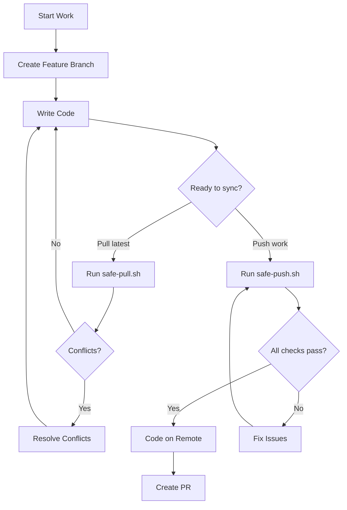
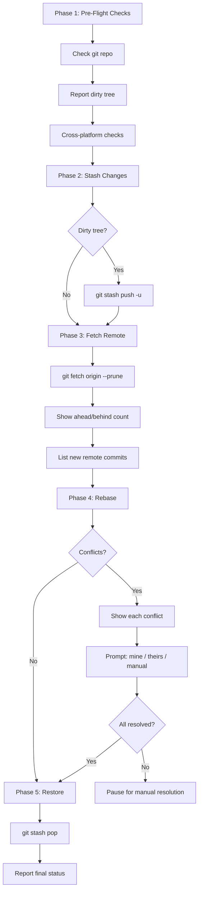
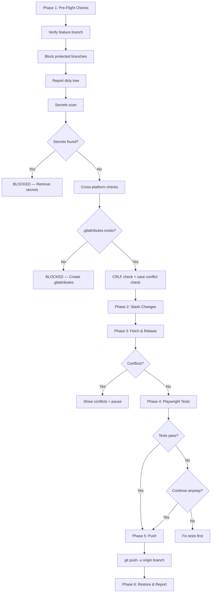
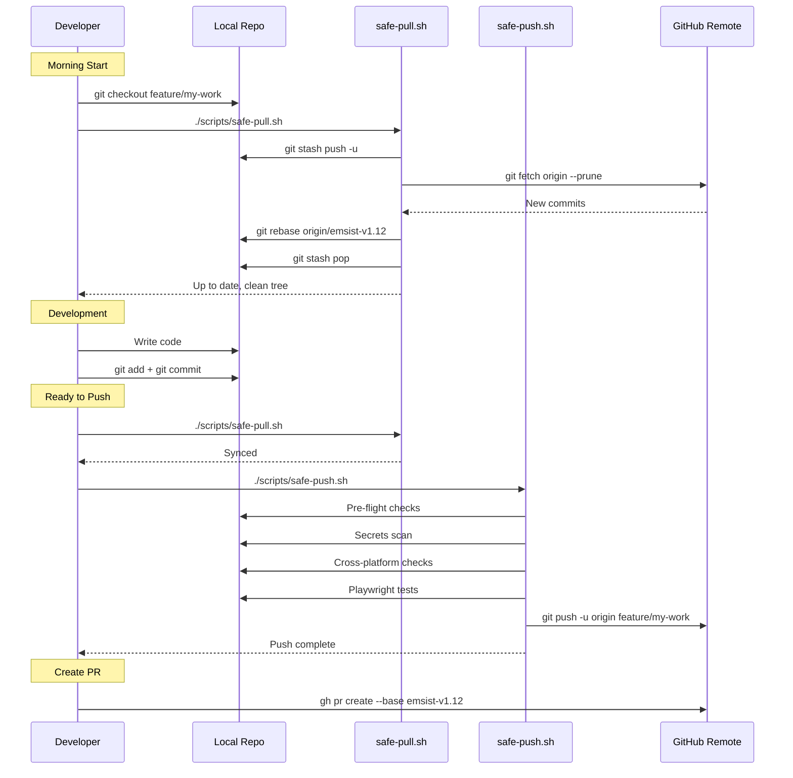
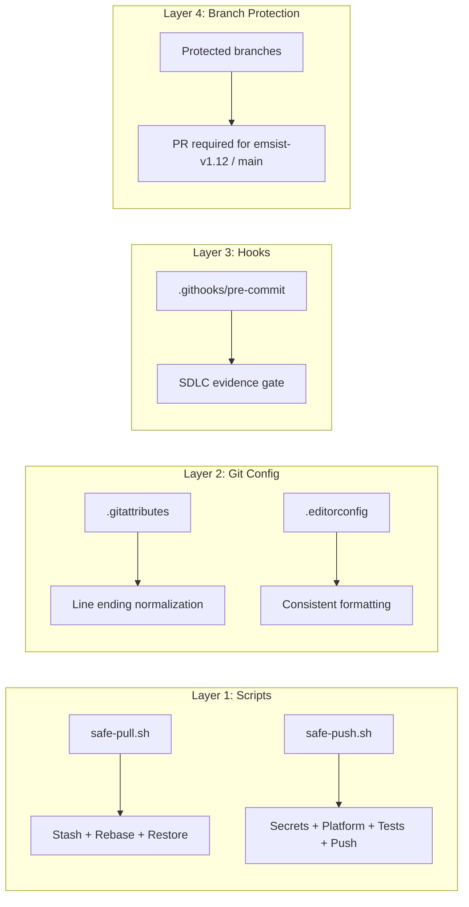

# Git Pull/Push Standard Operating Procedure (SoP)

**Document ID:** SOP-GIT-001
**Version:** 1.0.0
**Effective Date:** 2026-03-09
**Last Reviewed:** 2026-03-09
**Owner:** EMSIST Development Team
**Classification:** Internal

---

## 1. Purpose

This SoP defines the mandatory workflow for pulling remote changes and pushing local work to the EMSIST repository. It exists to:

- Prevent data loss from uncommitted work during sync operations
- Eliminate cross-platform divergence (macOS/Windows/Linux line-ending and case-sensitivity issues)
- Block accidental pushes to protected branches
- Catch secrets and sensitive files before they reach the remote
- Ensure quality gates (Playwright tests) run before code is shared

---Fetch and rebase onto the latest emsist-v1.12 branch without losing my local work. Stash any uncommitted changes      first, then rebase. If there are conflicts, list each one with the file name and what both sides changed, and ask me   whether to keep mine, take theirs, or manually merge before resolving. After rebase, pop the stash and report if   
  everything is clean. 
https://github.com/ThinkPlus-Consulting/Emsist-app

give this prompt to claude to pull the newest changes from the new github without losing any changes and when pushing, push to a branch

## 2. Scope

| Applies To | Details |
|------------|---------|
| **Repository** | `ThinkPlus-Consulting/Emsist-app` |
| **Branches** | All feature, bugfix, and personal branches |
| **Protected Branches** | `emsist-v1.12`, `main`, `master` — direct push forbidden |
| **Team Members** | All developers (macOS, Windows, Linux) |
| **Scripts** | `scripts/safe-pull.sh`, `scripts/safe-push.sh` |

---

## 3. Prerequisites

### 3.1 One-Time Setup (New Clone)

Every developer must run these after cloning:

```bash
# 1. Clone the repository
gh repo clone ThinkPlus-Consulting/Emsist-app
cd Emsist-app

# 2. Checkout the base branch
git checkout emsist-v1.12

# 3. Activate the pre-commit hook
git config core.hooksPath .githooks

# 4. Make scripts executable
chmod +x scripts/*.sh

# 5. Install frontend dependencies (for Playwright tests)
cd frontend && npm install && npx playwright install && cd ..
```

### 3.2 Required Files in Repository

| File | Purpose | Action if Missing |
|------|---------|-------------------|
| `.gitattributes` | Enforces LF line endings across all OSes | **BLOCKER** — safe-push.sh will refuse to proceed |
| `.editorconfig` | Consistent formatting across IDEs | Warning only |
| `.githooks/pre-commit` | SDLC evidence gate at commit time | Run `git config core.hooksPath .githooks` |
| `scripts/safe-pull.sh` | Safe pull script | Must exist and be executable |
| `scripts/safe-push.sh` | Safe push script | Must exist and be executable |

### 3.3 Required Tools

| Tool | Minimum Version | Check Command |
|------|----------------|---------------|
| Git | 2.30+ | `git --version` |
| GitHub CLI | 2.0+ | `gh --version` |
| Node.js | 18+ | `node --version` |
| npm | 9+ | `npm --version` |

---

## 4. Workflow Overview



---

## 5. Procedure: Pulling Changes (safe-pull.sh)

### 5.1 When to Pull

| Situation | Action |
|-----------|--------|
| Starting your work day | Pull first |
| Before pushing your work | Pull first |
| Teammate mentions they pushed changes | Pull |
| CI/CD shows your branch is behind | Pull |
| Before creating a Pull Request | Pull |

### 5.2 Standard Pull Command

```bash
./scripts/safe-pull.sh
```

### 5.3 Pull Options

| Command | Use When |
|---------|----------|
| `./scripts/safe-pull.sh` | Default — rebase onto `emsist-v1.12` |
| `./scripts/safe-pull.sh --base main` | Syncing with `main` instead |
| `./scripts/safe-pull.sh --merge` | You prefer merge commits over rebase |
| `./scripts/safe-pull.sh --dry-run` | Check what changed without integrating |
| `./scripts/safe-pull.sh --resolve-all ours` | Keep all your changes during conflicts |
| `./scripts/safe-pull.sh --resolve-all theirs` | Accept all remote changes during conflicts |

### 5.4 What safe-pull.sh Does (Phase by Phase)



### 5.5 Conflict Resolution Guide

When conflicts are detected, the script shows each conflicting file with diffs from both sides and prompts:

| Choice | What It Does | When to Use |
|--------|-------------|-------------|
| **1 — Keep mine** | `git checkout --ours <file>` | Your version is correct; remote changes to this file should be discarded |
| **2 — Take theirs** | `git checkout --theirs <file>` | Remote version is correct; your local changes to this file should be discarded |
| **3 — Manual merge** | Skips file; you edit manually | Both sides have important changes that need to be combined |

**After choosing "Manual merge":**

```bash
# 1. Open the file in your editor — look for conflict markers:
#    <<<<<<< HEAD
#    (your changes)
#    =======
#    (their changes)
#    >>>>>>> origin/emsist-v1.12

# 2. Edit the file to keep what you need, remove markers

# 3. Stage the resolved file
git add <file>

# 4. Continue the rebase
git rebase --continue
```

**If you want to abort entirely:**

```bash
git rebase --abort    # Undo the rebase
git stash pop         # Restore your stashed work (check: git stash list)
```

### 5.6 Post-Pull Verification

After a successful pull, verify:

```bash
# Check your branch is up to date
git log --oneline -5

# Confirm working tree is clean (or only has your expected changes)
git status

# Run a quick build to make sure nothing broke
cd frontend && npm run build && cd ..
```

---

## 6. Procedure: Pushing Changes (safe-push.sh)

### 6.1 Before You Push

| Checkpoint | How to Verify |
|------------|---------------|
| On a feature branch (not `emsist-v1.12` / `main`) | `git branch --show-current` |
| Pulled latest changes | Run `./scripts/safe-pull.sh` first |
| Code compiles | `cd frontend && npm run build` |
| Tests pass locally | `cd frontend && npm test` |
| No secrets in staged files | Script checks automatically |

### 6.2 Standard Push Command

```bash
./scripts/safe-push.sh
```

### 6.3 Push Options

| Command | Use When |
|---------|----------|
| `./scripts/safe-push.sh` | Default — push current branch, rebase onto `emsist-v1.12` |
| `./scripts/safe-push.sh -b my-branch` | Push to a specific remote branch name |
| `./scripts/safe-push.sh --skip-tests` | Skip Playwright tests (emergency only) |
| `./scripts/safe-push.sh --base main` | Rebase onto `main` instead |
| `./scripts/safe-push.sh --dry-run` | Do everything except the actual push |

### 6.4 What safe-push.sh Does (Phase by Phase)



### 6.5 Protected Branch Policy

The following branches are **protected** — direct push is forbidden:

| Branch | Protection | How to Contribute |
|--------|-----------|-------------------|
| `emsist-v1.12` | No direct push | Create a feature branch, then PR |
| `main` | No direct push | Create a feature branch, then PR |
| `master` | No direct push | Create a feature branch, then PR |

**If you accidentally try to push to a protected branch:**

```bash
# The script will block you. Create a feature branch instead:
git checkout -b feature/your-feature-name
./scripts/safe-push.sh
```

### 6.6 Secrets Scan Details

The push script scans for:

| Category | Patterns Detected |
|----------|-------------------|
| **Environment files** | `.env`, `.env.local`, `.env.production` |
| **Credential files** | `credentials.json`, `service-account.json` |
| **Certificates/Keys** | `*.pem`, `*.key`, `*.p12`, `*.jks` |
| **SSH keys** | `id_rsa`, `id_ed25519` |
| **Hardcoded secrets** | `password=`, `secret=`, `api_key=`, `token=`, `private_key=` in staged diffs |

**If secrets are detected:**

```bash
# Unstage the sensitive file
git reset HEAD <sensitive-file>

# Add it to .gitignore
echo "<sensitive-file>" >> .gitignore

# Re-run the push
./scripts/safe-push.sh
```

### 6.7 Quality Gate: Playwright Tests

The push script runs `playwright.quality.config.ts` which tests across:

| Browser/Device | Viewport |
|---------------|----------|
| Desktop Chrome | 1280x720 |
| Desktop Firefox | 1280x720 |
| Desktop Safari (WebKit) | 1280x720 |
| Mobile Chrome (Pixel 5) | 393x851 |
| Mobile Safari (iPhone 13) | 390x844 |

**If tests fail:**
- The script asks if you want to continue anyway
- Choose `N` to fix tests first (recommended)
- Choose `Y` only for emergency pushes (document reason in PR)
- Skip entirely with `--skip-tests` (emergency only)

---

## 7. Complete Daily Workflow

### 7.1 Morning Start

```bash
cd Emsist-app

# 1. Switch to your feature branch
git checkout feature/my-work

# 2. Pull latest changes
./scripts/safe-pull.sh

# 3. Start working
```

### 7.2 During Development

```bash
# Commit your work regularly
git add <specific-files>
git commit -m "feat: description of change"

# Pull periodically to stay in sync
./scripts/safe-pull.sh
```

### 7.3 Ready to Share

```bash
# 1. Pull latest one more time
./scripts/safe-pull.sh

# 2. Push your branch
./scripts/safe-push.sh

# 3. Create a Pull Request
gh pr create --base emsist-v1.12
```

### 7.4 Workflow Sequence Diagram



---

## 8. Cross-Platform Rules

### 8.1 Line Endings

| Rule | Enforcement |
|------|-------------|
| All text files stored as **LF** in the repository | `.gitattributes` (`* text=auto eol=lf`) |
| Shell scripts **must** be LF (CRLF breaks bash) | `.gitattributes` (`*.sh text eol=lf`) |
| Binary files never modified by Git | `.gitattributes` (`*.png binary`, etc.) |
| Windows developers must not override `core.autocrlf` | Enforced by `.gitattributes` taking precedence |

### 8.2 One-Time Line Ending Normalization

If you joined the team before `.gitattributes` existed:

```bash
git pull                         # Get the new .gitattributes
git add --renormalize .          # Re-stage all files with correct endings
git commit -m "chore: normalize line endings"
```

### 8.3 Case Sensitivity

| OS | Behavior | Risk |
|----|----------|------|
| **macOS** | Case-insensitive (`Foo.ts` = `foo.ts`) | Can create files that differ only by case without noticing |
| **Windows** | Case-insensitive | Same as macOS |
| **Linux / CI** | Case-sensitive | `Foo.ts` and `foo.ts` are two different files — breaks builds |

**Rule:** Never create files that differ only by case. The safe-push script detects this.

### 8.4 File Permissions

| OS | Behavior | Risk |
|----|----------|------|
| **macOS/Linux** | Tracks execute bit | Shell scripts need `chmod +x` |
| **Windows** | No execute bit | Scripts may lose `+x` after editing on Windows |

**Rule:** Always verify `chmod +x scripts/*.sh` before pushing. The safe-push script warns about this.

### 8.5 EditorConfig

All team members must have EditorConfig support in their IDE:

| IDE | Plugin Required? |
|-----|-----------------|
| VS Code | Install "EditorConfig for VS Code" extension |
| IntelliJ / WebStorm | Built-in (enabled by default) |
| Eclipse | Install "EditorConfig Eclipse" plugin |
| Vim | Install `editorconfig-vim` |

---

## 9. Troubleshooting

### 9.1 Common Issues

#### "Refusing to push directly to 'emsist-v1.12'"

```bash
# You're on the base branch. Create a feature branch:
git checkout -b feature/your-feature-name
./scripts/safe-push.sh
```

#### "REBASE CONFLICTS DETECTED" — what do I do?

```bash
# Option A: Let the script guide you (interactive per-file resolution)
# Option B: Abort and start over
git rebase --abort
git stash pop    # if stash was created

# Option C: Auto-resolve all conflicts
./scripts/safe-pull.sh --resolve-all theirs   # accept all remote
./scripts/safe-pull.sh --resolve-all ours     # keep all mine
```

#### Stash pop conflicts after pull

```bash
# Your stashed changes conflict with new code from remote
# 1. Check which files conflict
git status

# 2. Edit files to resolve conflict markers
# 3. Stage resolved files
git add <file>

# 4. Continue working — no rebase/merge to continue here
```

#### "SENSITIVE FILE DETECTED"

```bash
# Unstage the file
git reset HEAD <file>

# Add to .gitignore
echo "<file>" >> .gitignore
git add .gitignore

# Re-run
./scripts/safe-push.sh
```

#### "Missing .gitattributes"

```bash
# This file should already exist in the repo. If not:
git checkout origin/emsist-v1.12 -- .gitattributes
git add .gitattributes
git commit -m "chore: restore .gitattributes"
```

#### Playwright tests fail — should I skip?

| Situation | Action |
|-----------|--------|
| Test failure is related to your changes | Fix the tests first |
| Test failure is pre-existing / flaky | Push with `--skip-tests`, note in PR |
| Playwright not installed | Run `cd frontend && npm install && npx playwright install` |
| Emergency hotfix | Push with `--skip-tests`, document reason |

#### "Detached HEAD state"

```bash
# You're not on any branch
git branch --show-current    # (empty)

# Fix: checkout an existing branch or create one
git checkout emsist-v1.12
git checkout -b feature/my-work
```

### 9.2 Recovery Procedures

#### I accidentally committed to `emsist-v1.12`

```bash
# Save your commits to a new branch
git branch feature/rescue-work

# Reset emsist-v1.12 to match remote
git reset --hard origin/emsist-v1.12

# Switch to your feature branch
git checkout feature/rescue-work

# Push normally
./scripts/safe-push.sh
```

#### I lost my stash

```bash
# List all stashes
git stash list

# Find the right one (look for safe-pull-auto-stash or safe-push-auto-stash)
git stash show stash@{0}    # preview
git stash pop stash@{0}     # apply it

# If stash list is empty, check reflog (last resort)
git reflog | head -20
```

#### Rebase went wrong — I want my branch back as it was

```bash
# If rebase is still in progress
git rebase --abort

# If rebase completed but broke things
git reflog                        # Find the commit before rebase
git reset --hard HEAD@{N}         # Replace N with the reflog entry number
```

---

## 10. Script Reference Card

### safe-pull.sh

```
Usage: ./scripts/safe-pull.sh [OPTIONS]

Options:
  --base BRANCH       Base branch to rebase onto (default: emsist-v1.12)
  --merge             Use merge instead of rebase
  --dry-run           Fetch and report only, don't integrate
  --resolve-all MODE  Auto-resolve conflicts: 'ours' or 'theirs'
  -h, --help          Show help

Exit Codes:
  0  Success
  1  Error (missing repo, missing remote branch, user cancelled)
  2  Conflicts paused for manual resolution
```

### safe-push.sh

```
Usage: ./scripts/safe-push.sh [OPTIONS]

Options:
  -b, --branch NAME   Push to specific remote branch name
  --base BRANCH       Rebase onto this branch (default: emsist-v1.12)
  --skip-tests        Skip Playwright quality gate tests
  --dry-run           Do everything except the actual push
  -h, --help          Show help

Exit Codes:
  0  Success
  1  Error (secrets found, protected branch, tests failed, push rejected)
  2  Rebase conflicts paused for manual resolution
```

---

## 11. Enforcement Summary



| Layer | What | Blocks |
|-------|------|--------|
| **Scripts** | `safe-pull.sh` / `safe-push.sh` | Unsafe git operations, secrets, platform issues |
| **Git Config** | `.gitattributes` / `.editorconfig` | Line ending mismatches, formatting drift |
| **Pre-Commit Hook** | `.githooks/pre-commit` | Source code commits without SDLC evidence |
| **Branch Protection** | GitHub settings + script guards | Direct push to protected branches |

---

## 12. Revision History

| Version | Date | Author | Changes |
|---------|------|--------|---------|
| 1.0.0 | 2026-03-09 | EMSIST Team | Initial version |

---

## 13. Approval

| Role | Name | Date | Signature |
|------|------|------|-----------|
| Author | | 2026-03-09 | |
| Reviewer | | | |
| Approver | | | |
