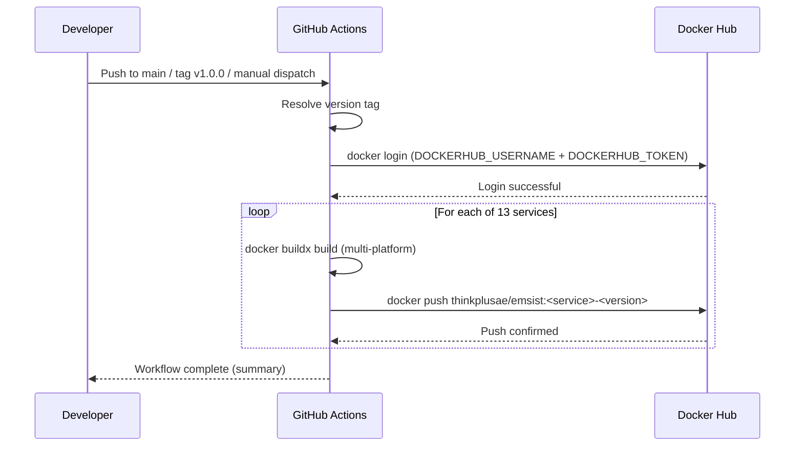
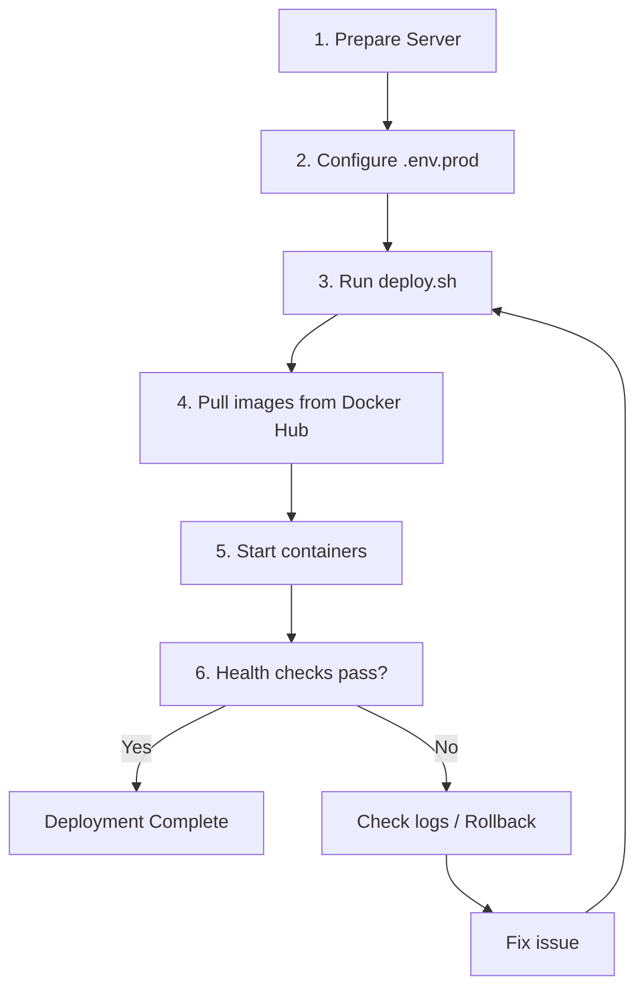
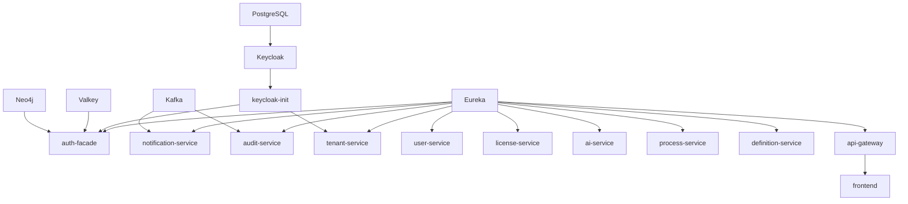
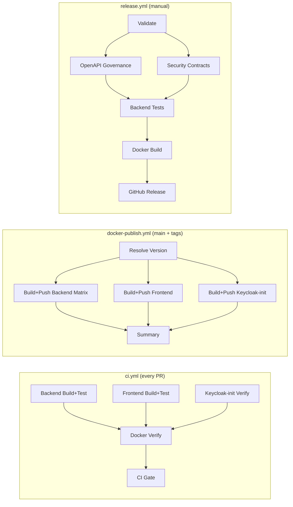

# SOP: EMSIST Docker Hub Deployment

**Version:** 1.0.0
**Last Updated:** 2026-03-10
**Owner:** DevOps Agent

## 1. Overview

This SOP covers building, publishing, and deploying all EMSIST services using Docker Hub as the container registry.

**Registry:** `docker.io/thinkplusae/emsist`
**Tag format:** `thinkplusae/emsist:<service>-<version>`

### Services (13 total)

| Service | Type | Build Context | Dockerfile |
|---------|------|---------------|------------|
| api-gateway | Backend | `backend/` | `backend/api-gateway/Dockerfile` |
| auth-facade | Backend | `backend/` | `backend/auth-facade/Dockerfile` |
| tenant-service | Backend | `backend/` | `backend/tenant-service/Dockerfile` |
| user-service | Backend | `backend/` | `backend/user-service/Dockerfile` |
| license-service | Backend | `backend/` | `backend/license-service/Dockerfile` |
| notification-service | Backend | `backend/` | `backend/notification-service/Dockerfile` |
| audit-service | Backend | `backend/` | `backend/audit-service/Dockerfile` |
| ai-service | Backend | `backend/` | `backend/ai-service/Dockerfile` |
| process-service | Backend | `backend/` | `backend/process-service/Dockerfile` |
| definition-service | Backend | `backend/` | `backend/definition-service/Dockerfile` |
| eureka-server | Backend | `backend/eureka-server/` | `backend/eureka-server/Dockerfile` |
| frontend | Frontend | `frontend/` | `frontend/Dockerfile` |
| keycloak-init | Infra | `infrastructure/keycloak/` | `infrastructure/keycloak/Dockerfile` |

---

## 2. Prerequisites

### Local Machine

- Docker Engine 24+ with Docker Compose v2
- Docker Buildx (for multi-platform builds)
- Git
- Access to the EMSIST repository

### Docker Hub Account

- Docker Hub account with push access to `thinkplusae/emsist`
- Docker Hub Access Token (not password) for CI/CD

### GitHub Repository

- Admin access to configure repository secrets
- GitHub Actions enabled

---

## 3. Setting Up Docker Hub Secrets in GitHub

This is a one-time setup step that connects your GitHub repository to Docker Hub so that CI/CD pipelines can push images automatically.

### Step 3.1: Create a Docker Hub Access Token

1. Log in to [Docker Hub](https://hub.docker.com)
2. Go to **Account Settings** > **Security** > **Access Tokens**
3. Click **New Access Token**
4. Name: `emsist-github-actions`
5. Permissions: **Read, Write, Delete**
6. Click **Generate**
7. **Copy the token immediately** -- it will not be shown again

### Step 3.2: Create the Docker Hub Repository

1. Log in to [Docker Hub](https://hub.docker.com)
2. Go to **Repositories** > **Create Repository**
3. Name: `emsist`
4. Namespace: `thinkplusae`
5. Visibility: Choose **Public** or **Private** as needed
6. Click **Create**

### Step 3.3: Add Secrets to GitHub

1. Go to your GitHub repository: `https://github.com/<org>/Emsist-app`
2. Navigate to **Settings** > **Secrets and variables** > **Actions**
3. Click **New repository secret** for each:

| Secret Name | Value | Description |
|-------------|-------|-------------|
| `DOCKERHUB_USERNAME` | `thinkplusae` | Docker Hub username or org |
| `DOCKERHUB_TOKEN` | (paste token from Step 3.1) | Docker Hub access token |

4. Verify both secrets appear in the secrets list

### Step 3.4: Verify the Connection

1. Go to **Actions** tab in GitHub
2. Select **Docker Publish** workflow
3. Click **Run workflow** (manual dispatch)
4. Enter version: `test-1`
5. Monitor the workflow -- it should:
   - Log in to Docker Hub successfully
   - Build all 13 images
   - Push to `thinkplusae/emsist:<service>-test-1`
6. Verify images appear at `https://hub.docker.com/r/thinkplusae/emsist/tags`
7. Clean up test images if desired



---

## 4. How Builds are Triggered

### Automatic Triggers

| Trigger | What Happens | Image Tag |
|---------|-------------|-----------|
| Push to `main` branch | Build + push all 13 services | `<service>-latest` |
| Git tag `v1.2.0` | Build + push all 13 services | `<service>-1.2.0` + `<service>-latest` |
| Pull request | Build only (no push) -- via `ci.yml` | Not pushed |

### Manual Trigger

1. Go to GitHub **Actions** > **Docker Publish**
2. Click **Run workflow**
3. Enter a version string (e.g., `1.2.0`, `rc-1`, `hotfix-123`)
4. Select target platforms (default: `linux/amd64,linux/arm64`)
5. Click **Run workflow**

### Local Build (without GitHub Actions)

```bash
# Build all services, push to Docker Hub
./scripts/build-push.sh --version 1.2.0

# Build a single service
./scripts/build-push.sh --service api-gateway --version 1.2.0

# Build only (no push), single platform
./scripts/build-push.sh --build-only --platform linux/amd64

# Dry run (print commands without executing)
./scripts/build-push.sh --dry-run --version 1.2.0
```

---

## 5. How to Deploy to a Server

### Step 5.1: Prepare the Server

```bash
# Install Docker and Docker Compose
# (see https://docs.docker.com/engine/install/ for your OS)

# Clone the repository (for compose files and configs)
git clone https://github.com/<org>/Emsist-app.git
cd Emsist-app
```

### Step 5.2: Configure Environment

```bash
# Copy the environment template
cp .env.example .env.prod

# Edit .env.prod -- change ALL [SECRET] values
# NEVER leave CHANGE_ME as a password in production
nano .env.prod
```

Critical variables to change:

| Variable | Why |
|----------|-----|
| `POSTGRES_PASSWORD` | Root database password |
| `SVC_*_PASSWORD` (7 values) | Per-service database passwords |
| `KC_DB_PASSWORD` | Keycloak database password |
| `NEO4J_AUTH` + `NEO4J_PASSWORD` | Graph database credentials |
| `KEYCLOAK_ADMIN_PASSWORD` | Keycloak admin console |
| `KEYCLOAK_CLIENT_SECRET` | OAuth2 client secret |
| `SERVICE_CLIENT_SECRET` | Service-to-service auth |
| `SUPERADMIN_PASSWORD` | Platform superadmin |
| `JASYPT_PASSWORD` | Encryption key |
| `FRONTEND_PUBLIC_URL` | Your actual frontend domain |
| `API_GATEWAY_PUBLIC_URL` | Your actual API domain |

### Step 5.3: Deploy

```bash
# Deploy latest version
./scripts/deploy.sh --version latest --env-file .env.prod

# Or deploy a specific version
./scripts/deploy.sh --version 1.2.0 --env-file .env.prod

# Or manually with docker compose
export IMAGE_TAG=1.2.0
docker compose -f docker-compose.prod.yml --env-file .env.prod pull
docker compose -f docker-compose.prod.yml --env-file .env.prod up -d
```

### Step 5.4: Verify Deployment

```bash
# Run health checks
./scripts/deploy.sh --health-check-only --env-file .env.prod

# Check individual service status
docker compose -f docker-compose.prod.yml --env-file .env.prod ps

# View logs
docker compose -f docker-compose.prod.yml --env-file .env.prod logs -f eureka
docker compose -f docker-compose.prod.yml --env-file .env.prod logs -f api-gateway
```



---

## 6. How to Rollback

### Automatic Rollback

The deploy script saves the previous version before deploying. To rollback:

```bash
./scripts/deploy.sh --rollback --env-file .env.prod
```

This will:
1. Read the previously deployed version from `.deploy-previous-version`
2. Pull that version's images
3. Redeploy with the previous version
4. Run health checks

### Manual Rollback

```bash
# Set the version to rollback to
export IMAGE_TAG=1.1.0

# Pull and restart
docker compose -f docker-compose.prod.yml --env-file .env.prod pull
docker compose -f docker-compose.prod.yml --env-file .env.prod up -d
```

### Rollback Decision Matrix

| Symptom | Action |
|---------|--------|
| All services unhealthy after deploy | Rollback immediately |
| One service unhealthy | Check logs, consider restarting that service |
| Database migration failure | Rollback, check Flyway migration scripts |
| Keycloak init failure | Check Keycloak logs, may need manual realm config |

---

## 7. Monitoring and Troubleshooting

### Health Check Endpoints

Every backend service exposes Spring Boot Actuator:

| Service | Health Endpoint |
|---------|----------------|
| Eureka | `http://localhost:8761/actuator/health` |
| API Gateway | `http://localhost:8080/actuator/health` |
| Auth Facade | `:8081/actuator/health` (internal only) |
| Tenant Service | `:8082/actuator/health` (internal only) |
| User Service | `:8083/actuator/health` (internal only) |
| License Service | `:8085/actuator/health` (internal only) |
| Notification Service | `:8086/actuator/health` (internal only) |
| Audit Service | `:8087/actuator/health` (internal only) |
| AI Service | `:8088/actuator/health` (internal only) |
| Process Service | `:8089/actuator/health` (internal only) |
| Definition Service | `:8090/actuator/health` (internal only) |
| Frontend (nginx) | `http://localhost:4200/` |

### Common Issues

| Issue | Diagnosis | Fix |
|-------|-----------|-----|
| Service fails to start | `docker compose logs <service>` | Check env vars, database connectivity |
| Database connection refused | PostgreSQL not healthy | Wait for health check, check `SVC_*_PASSWORD` |
| Keycloak init fails | Keycloak not ready | Check Keycloak health, increase `start_period` |
| Eureka registration fails | Eureka not healthy | Check Eureka logs, verify `EUREKA_URL` |
| Frontend shows blank page | API gateway unreachable | Check nginx.conf proxy, api-gateway health |
| Image pull fails | Auth or image not found | Verify `IMAGE_TAG`, Docker Hub credentials |
| Out of memory | Container OOM killed | Increase memory limits in compose |

### Viewing Logs

```bash
# All services
docker compose -f docker-compose.prod.yml --env-file .env.prod logs -f

# Specific service
docker compose -f docker-compose.prod.yml --env-file .env.prod logs -f auth-facade

# Last 100 lines
docker compose -f docker-compose.prod.yml --env-file .env.prod logs --tail 100 api-gateway

# Since a specific time
docker compose -f docker-compose.prod.yml --env-file .env.prod logs --since 2h api-gateway
```

### Service Startup Order

Services start in dependency order enforced by `depends_on` with health checks:



---

## 8. Environment Variable Reference

See `.env.example` in the repository root for the complete list of environment variables with descriptions.

### Variable Categories

| Category | Variables | Required |
|----------|-----------|----------|
| PostgreSQL | `POSTGRES_*`, `SVC_*_PASSWORD`, `KC_DB_PASSWORD` | Yes |
| Neo4j | `NEO4J_*` | Yes |
| Keycloak | `KEYCLOAK_*`, `SERVICE_*`, `SUPERADMIN_*` | Yes |
| Cache | `VALKEY_*` | No (has defaults) |
| Kafka | `KAFKA_*` | No (has defaults) |
| Mail | `MAIL_*` | No (has defaults) |
| AI | `OPENAI_API_KEY`, `ANTHROPIC_API_KEY`, `GEMINI_API_KEY` | No |
| Security | `JASYPT_PASSWORD` | Yes |
| Deployment | `IMAGE_TAG`, `COMPOSE_PROJECT_NAME` | No (has defaults) |
| URLs | `FRONTEND_PUBLIC_URL`, `API_GATEWAY_PUBLIC_URL` | Yes (for Keycloak redirects) |
| Backup | `BACKUP_RETENTION_DAYS`, `AGE_PUBLIC_KEY` | No |

---

## 9. CI/CD Pipeline Reference

### Workflow Files

| File | Purpose | Trigger |
|------|---------|---------|
| `.github/workflows/ci.yml` | Build + test + Docker verify (no push) | PR, push to main/develop |
| `.github/workflows/docker-publish.yml` | Build + push to Docker Hub | Push to main, tags `v*`, manual |
| `.github/workflows/release.yml` | Full release with tests + GitHub Release | Manual dispatch |

### Pipeline Architecture



### Required GitHub Secrets

| Secret | Used By | How to Get |
|--------|---------|------------|
| `DOCKERHUB_USERNAME` | `docker-publish.yml` | Docker Hub account name |
| `DOCKERHUB_TOKEN` | `docker-publish.yml` | Docker Hub > Settings > Security > Access Tokens |

### GitHub Actions Cache

The `docker-publish.yml` workflow uses GitHub Actions cache (`type=gha`) for Docker layers. Each service has its own cache scope to avoid evictions. Cache is automatically managed by GitHub (10 GB limit per repo).

---

## 10. Security Considerations

- **No secrets in images:** Dockerfiles never contain credentials. All secrets come from environment variables.
- **No secrets in compose files:** `docker-compose.prod.yml` references `${VARIABLE}` placeholders, never hardcoded values.
- **No secrets in CI/CD:** GitHub Secrets are used for Docker Hub credentials. They are masked in logs.
- **.env.prod is gitignored:** The production environment file must never be committed.
- **Non-root containers:** All application containers run as non-root users (`ems:ems` for backend, `nginx:nginx` for frontend).
- **Health checks:** Every service has a HEALTHCHECK instruction in its Dockerfile and health check configuration in compose.
- **Network segmentation:** Three-tier networks (`data`, `backend`, `frontend`) restrict container-to-container access.
- **Resource limits:** All containers have CPU and memory limits to prevent resource exhaustion.

---

## 11. Quick Reference Commands

```bash
# ---- BUILD ----
./scripts/build-push.sh --version 1.2.0              # Build + push all
./scripts/build-push.sh --service frontend --version 1.2.0  # Single service
./scripts/build-push.sh --build-only                  # Local build only

# ---- DEPLOY ----
./scripts/deploy.sh --version 1.2.0                   # Deploy specific version
./scripts/deploy.sh                                    # Deploy latest
./scripts/deploy.sh --rollback                         # Rollback to previous
./scripts/deploy.sh --health-check-only                # Check health

# ---- DOCKER COMPOSE (manual) ----
export IMAGE_TAG=1.2.0
docker compose -f docker-compose.prod.yml --env-file .env.prod pull
docker compose -f docker-compose.prod.yml --env-file .env.prod up -d
docker compose -f docker-compose.prod.yml --env-file .env.prod ps
docker compose -f docker-compose.prod.yml --env-file .env.prod logs -f
docker compose -f docker-compose.prod.yml --env-file .env.prod down

# ---- GITHUB ACTIONS ----
# Trigger Docker publish manually:
gh workflow run docker-publish.yml -f version=1.2.0
# Check workflow status:
gh run list --workflow=docker-publish.yml
```
