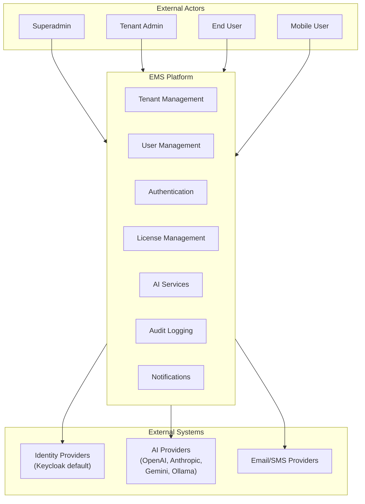
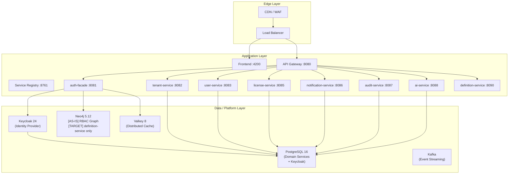
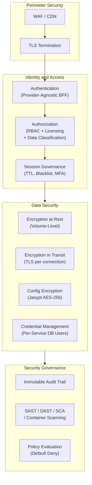
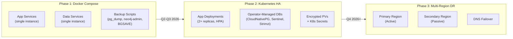

> **WP-ARCH-ALIGN (2026-03-24):** This document has been updated to reflect the frozen auth target model (Rev 2).
> See `Foundation/03-ownership-boundaries.md` FROZEN for the canonical decision.

# 01. Architecture Vision (ADM Phase A)

## 1. Document Control

| Field | Value |
|-------|-------|
| Status | Baselined |
| Owner | Architecture Team |
| Last Updated | 2026-03-05 |
| Scope | EMS enterprise architecture baseline and target increments |
| arc42 Alignment | [01-Introduction and Goals](../Architecture/01-introduction-goals.md), [02-Constraints](../Architecture/02-constraints.md), [03-Context and Scope](../Architecture/03-context-scope.md) |

## 2. Problem Statement

Enterprise organizations lack a unified platform for managing multi-tenant business transformation, identity governance, licensing, and AI-assisted workflows. Existing solutions are fragmented across multiple tools, lack strict tenant isolation, and do not support provider-agnostic authentication or fine-grained authorization models combining RBAC, licensing, and data classification.

## 3. Vision Statement

EMSIST delivers a secure, multi-tenant SaaS platform that unifies enterprise management, identity, licensing, audit, AI services, and process orchestration under a single architecture with strong tenant isolation, provider-agnostic authentication, polyglot persistence, and enterprise-grade security controls -- deployable from Docker Compose development environments through Kubernetes production clusters.

## 4. Stakeholders and Concerns

> **Persona Registry:** Full persona definitions are maintained in the centralized **[TX Persona Registry](../persona/PERSONA-REGISTRY.md)**.

| Stakeholder | Concern | Success Signal | Persona Registry Mapping |
|-------------|---------|----------------|--------------------------|
| Product Leadership | Delivery predictability, roadmap execution | Roadmap milestones achieved per quarter | -- |
| Tenant Administrators | Secure and reliable tenant operations, identity integration | Reduced support escalations, self-service provisioning | [PER-UX-003] Fiona Shaw |
| End Users | Fast, secure daily business workflows | API p95 < 200 ms, zero cross-tenant data leakage | [PER-UX-004] Lisa Harrison |
| Engineering Teams | Maintainable architecture boundaries, clear service ownership | Lower coupling, independent deployability, faster delivery | -- |
| Operations/SRE | Runtime reliability, observability, disaster recovery | 99.9% availability, MTTR < 30 min | [PER-EX-002] Oliver Kent |
| Security/Compliance | Identity, audit, policy control, encryption | Fewer high-severity findings, zero critical security gaps | [PER-EX-003] Joseph Hammond |

## 5. Architecture Scope

### In Scope

- Multi-tenant platform with domain-separated microservices (8 active runtime services + service registry + API gateway)
- Polyglot persistence: [AS-IS] Neo4j for auth-facade RBAC graph; [TARGET] RBAC/memberships migrate to tenant-service (PostgreSQL), Neo4j retained for definition-service only. PostgreSQL for 7 relational domain services + Keycloak
- Provider-agnostic authentication with Keycloak as default provider
- Composite authorization model (RBAC + licensing + data classification)
- Three-tier encryption strategy (volume, in-transit TLS, configuration)
- Infrastructure architecture: Docker Compose (dev/staging) to Kubernetes (production)
- High availability roadmap (3-phase: backups, K8s HA, multi-region DR)
- AI service with multi-provider support and RAG capabilities

### Out of Scope

- Graph-per-tenant runtime routing (designed in ADR-003/ADR-010, not implemented)
- Multi-database vendor support beyond current baseline (MySQL/SQL Server deferred)
- Tenant integration hub (deferred until explicit product requirement)
- `product-service`, `process-service`, `persona-service` as standalone runtime services

## 6. Business Outcomes and KPIs

| Outcome | KPI | Baseline | Target |
|---------|-----|----------|--------|
| Secure tenant isolation | Cross-tenant data leakage incidents | 0 | 0 |
| Responsive user experience | API response p95 | N/A | < 200 ms |
| High availability | Monthly uptime | N/A | >= 99.9% |
| Scalable growth | Concurrent user capacity | N/A | 10,000 users |
| Independent deployability | Service deployment without cascading redeploys | Partial | 100% |
| Security posture | Critical/high security findings (unresolved) | 5 critical + 7 high | 0 |

## 7. Architecture Context

### Business Context

### Technical Context

Canonical detail: [arc42/03 Context and Scope](../Architecture/03-context-scope.md).

## 8. Architecture Principles Applied

Reference: [Architecture Principles](./artifacts/principles/architecture-principles.md)

| Principle | Application in EMSIST |
|-----------|----------------------|
| Tenant-first isolation | All data queries enforce tenant predicates; UUID-first external contracts |
| Polyglot persistence | Right database for the right workload (Neo4j for graphs, PostgreSQL for relations) |
| Provider-agnostic auth | Strategy pattern for identity providers with Keycloak as default |
| Defense in depth | Three-tier encryption, per-service DB credentials, network segmentation |
| Fail-fast configuration | No hardcoded credential fallbacks; missing env vars cause startup failure |
| Docs-as-code | Architecture changes must update ADR + arc42 + TOGAF alignment |

## 9. Security Architecture Overview

Security is a cross-cutting concern spanning all ADM phases. Detailed controls are documented in [arc42/08-Crosscutting](../Architecture/08-crosscutting.md) and governed by ADRs.

| Security Domain | TOGAF Phase | Canonical Source |
|-----------------|-------------|-----------------|
| Authentication | Phase C (Application) | [arc42/08 Section 8.2](../Architecture/08-crosscutting.md), [ADR-004](../Architecture/09-architecture-decisions.md#931-keycloak-authentication-with-bff-pattern-adr-004), [ADR-007](../Architecture/09-architecture-decisions.md#932-provider-agnostic-auth-facade-adr-007) |
| Authorization | Phase C (Application) | [arc42/08 Section 8.3](../Architecture/08-crosscutting.md), [ADR-014](../Architecture/09-architecture-decisions.md#936-rbac-and-licensing-integration-adr-014), [ADR-017](../Architecture/09-architecture-decisions.md#914-data-classification-access-control-adr-017) |
| Encryption | Phase D (Technology) | [arc42/08 Sections 8.13-8.14](../Architecture/08-crosscutting.md), [ADR-019](../Architecture/09-architecture-decisions.md#952-encryption-at-rest-strategy-adr-019) |
| Credential management | Phase D (Technology) | [arc42/08 Section 8.16](../Architecture/08-crosscutting.md), [ADR-020](../Architecture/09-architecture-decisions.md#953-service-credential-management-adr-020) |
| Network segmentation | Phase D (Technology) | [arc42/07 Section 7.9](../Architecture/07-deployment-view.md) |
| Security governance | Phase G (Governance) | [Security Tier Boundary Audit](../governance/SECURITY-TIER-BOUNDARY-AUDIT.md), [ADR-022](../Architecture/09-architecture-decisions.md#951-production-parity-security-baseline-adr-022) |

## 10. Infrastructure Architecture Overview

Infrastructure architecture spans ADM Phase D (Technology) and Phase F (Migration). Detailed topology and HA roadmap are documented in [arc42/07-Deployment View](../Architecture/07-deployment-view.md).

| Infrastructure Domain | TOGAF Phase | Canonical Source |
|-----------------------|-------------|-----------------|
| Deployment topology | Phase D | [arc42/07 Sections 7.1-7.3](../Architecture/07-deployment-view.md) |
| Environment matrix | Phase D | [arc42/07 Section 7.3](../Architecture/07-deployment-view.md) |
| High availability | Phase D + E | [arc42/07 Section 7.8](../Architecture/07-deployment-view.md), [ADR-018](../Architecture/09-architecture-decisions.md#954-high-availability-and-multi-tier-architecture-adr-018) |
| Network segmentation | Phase D | [arc42/07 Section 7.9](../Architecture/07-deployment-view.md) |
| Secrets management | Phase D | [arc42/07 Section 7.10](../Architecture/07-deployment-view.md), [ADR-020](../Architecture/09-architecture-decisions.md#953-service-credential-management-adr-020) |
| Backup and recovery | Phase D + F | [arc42/07 Section 7.11](../Architecture/07-deployment-view.md), [ADR-018](../Architecture/09-architecture-decisions.md#954-high-availability-and-multi-tier-architecture-adr-018) |
| Migration roadmap | Phase F | [arc42/07 Section 7.8.5](../Architecture/07-deployment-view.md) |

## 11. Initial Risks and Assumptions

| Type | Description | Impact | Mitigation |
|------|-------------|--------|------------|
| Risk | Single-instance stateful services (no replication) | Critical -- data loss on container failure | Phased HA roadmap (ADR-018) |
| Risk | All services share postgres superuser | Critical -- compromised service can DROP ALL DATABASES | Per-service DB users (ADR-020) |
| Risk | No encryption at rest for any data store | Critical -- data exposure on storage breach | Volume-level encryption (ADR-019) |
| Risk | Flat Docker network (no tier segmentation) | Critical -- frontend can reach databases directly | Three-network topology (ISSUE-INF-001) |
| Risk | Insecure transport entries in allowlist | Critical -- production-parity drift | CI governance gate (ADR-022) |
| Assumption | Keycloak remains the default identity provider | Medium | Provider-agnostic abstraction in place |
| Assumption | Small cross-functional team delivers iteratively | Medium | Pragmatic solutions over speculative complexity |

Canonical risk register: [arc42/11-Risks and Technical Debt](../Architecture/11-risks-technical-debt.md).

## 12. Approval

| Role | Name | Decision | Date |
|------|------|----------|------|
| Architecture Board Chair | | Pending | |
