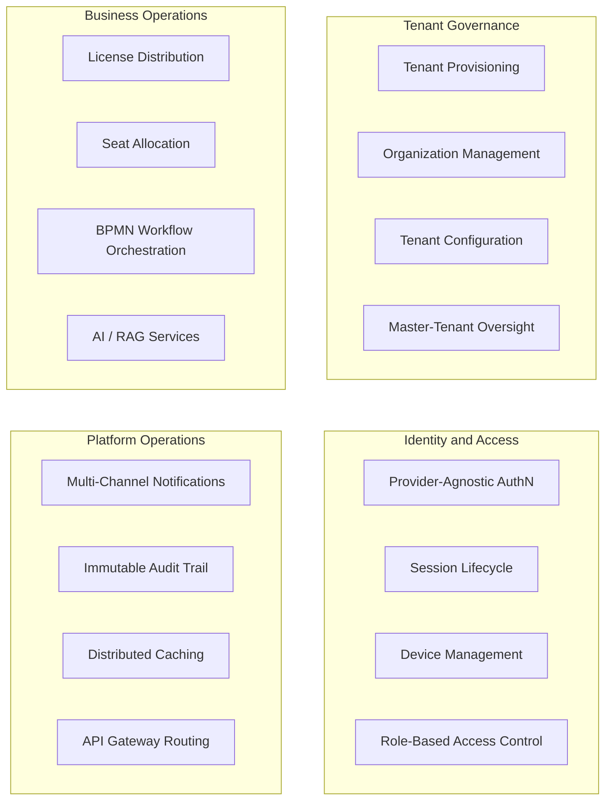
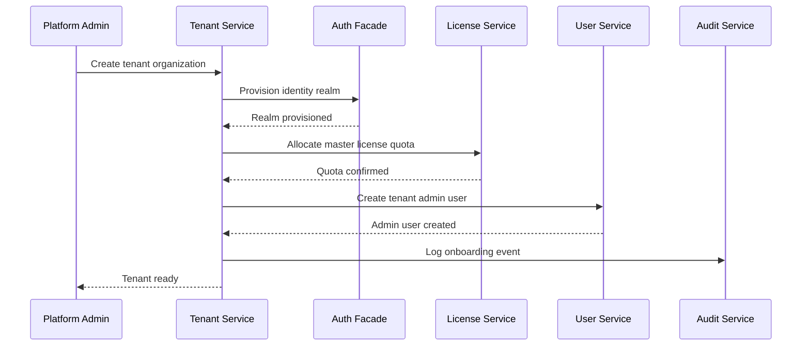
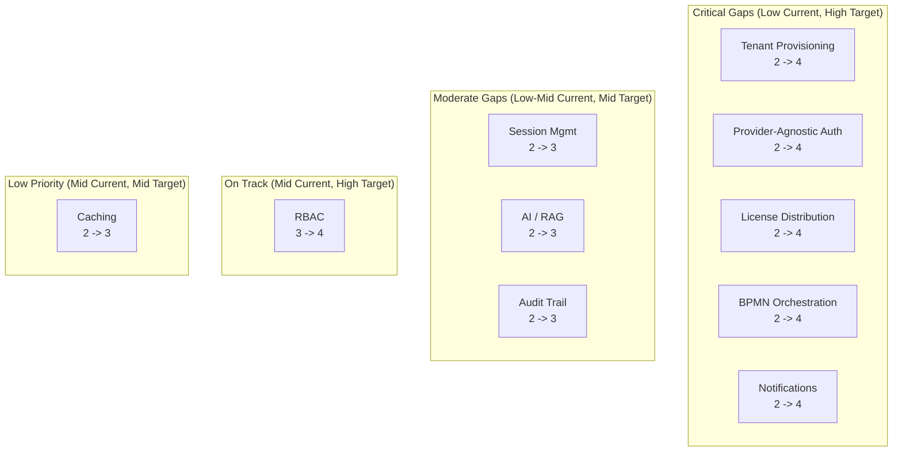
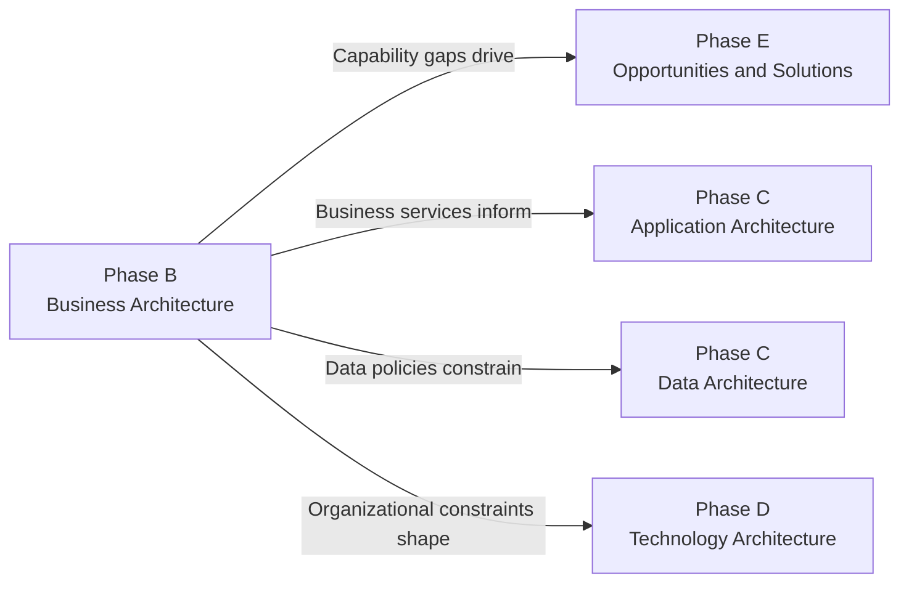

> **WP-ARCH-ALIGN (2026-03-24):** This document has been updated to reflect the frozen auth target model (Rev 2).
> See `Foundation/03-ownership-boundaries.md` FROZEN for the canonical decision.

# 02. Business Architecture (ADM Phase B)

## 1. Document Control

| Field | Value |
|-------|-------|
| Status | Baselined |
| Owner | Architecture + Product |
| Last Updated | 2026-03-05 |
| Arc42 Alignment | Summarizes capabilities from [arc42/01 Introduction and Goals](../Architecture/01-introduction-goals.md); constraints from [arc42/02 Constraints](../Architecture/02-constraints.md) |
| Catalog Reference | [Business Capability Catalog](./artifacts/catalogs/business-capability-catalog.md) |

---

## 2. Business Capability Map

The capability map organizes EMSIST platform capabilities into four domains. Each domain groups related capabilities that together fulfill a distinct area of business value. For the authoritative capability register with IDs and maturity scores, see the [Business Capability Catalog](./artifacts/catalogs/business-capability-catalog.md).

### Domain Descriptions

| Domain | Purpose | Key Stakeholders |
|--------|---------|------------------|
| Tenant Governance | Provisioning, configuring, and governing tenant organizations under a master-tenant model | Platform/Product Leadership, Tenant Administrators |
| Identity and Access | Provider-agnostic authentication (BFF pattern, zero-redirect), session management, and RBAC | End Users, Security/Compliance |
| Business Operations | Core value-generating capabilities -- licensing, workflow orchestration, AI augmentation | End Users, Tenant Administrators |
| Platform Operations | Cross-cutting infrastructure capabilities that support all domains -- notifications, audit, caching, routing | Operations/SRE, Engineering Teams |

---

## 3. Value Streams

Each value stream traces a business-critical flow from trigger to measurable outcome. The mapping to capability domains shows which areas of the capability map participate.

| Value Stream | Primary Actors | Trigger | Key Steps | Output | Capability Domains |
|--------------|----------------|---------|-----------|--------|-------------------|
| Tenant Onboarding | Platform Admin, Tenant Admin | New organization subscription request | 1. Provision tenant graph/schema 2. Configure identity provider realm 3. Assign master license quota 4. Create initial admin user | Fully operational tenant with admin access | Tenant Governance, Identity and Access, Business Operations |
| User Authentication | End User | Login attempt via BFF endpoint | 1. BFF receives credentials (zero-redirect) 2. Auth-facade delegates to configured provider 3. Session token issued 4. Device fingerprint recorded | Authenticated session with RBAC context | Identity and Access, Platform Operations |
| Business Workflow Execution | End User, Process Owner | User initiates a BPMN process | 1. Process engine loads tenant-scoped definition 2. Tasks assigned per RBAC roles 3. AI services augment decision points 4. Completion event triggers notifications | Completed workflow instance with audit trail | Business Operations, Platform Operations |
| License Distribution | Platform Admin, Tenant Admin | Master license pool allocation | 1. Master admin allocates license quota to tenant 2. Tenant admin distributes seats to users 3. License validation on feature access 4. Usage metrics captured for audit | Tenant users entitled to licensed capabilities | Tenant Governance, Business Operations, Platform Operations |

### Value Stream Flow -- Tenant Onboarding

---

## 4. Organizational Impacts

This section identifies how EMSIST adoption changes organizational structures, roles, and responsibilities for each stakeholder group. Stakeholder definitions originate from [arc42/01 Section 1.4](../Architecture/01-introduction-goals.md).

| Area | Current State | Target State | Change Required |
|------|---------------|--------------|-----------------|
| Tenant Administration | Manual provisioning via scripts or direct DB manipulation | Self-service tenant onboarding through admin portal with automated realm and schema setup | Train tenant admins on portal workflows; define SLAs for provisioning |
| Identity Management | Single Keycloak provider, manual realm configuration | Provider-agnostic identity with zero-redirect BFF; automated realm lifecycle | Ops team must manage provider abstraction layer; security team reviews provider integrations |
| License Operations | Ad-hoc license tracking in spreadsheets or external tools | Centralized master license pool with automated tenant caps and seat allocation | Finance/product must define license tiers; tenant admins self-manage seat assignment |
| Workflow Governance | Business processes managed informally or in siloed tools | BPMN-modeled processes executed by platform process engine with full audit trail | Process owners must formalize workflows as BPMN definitions; training on process designer |
| Observability and Compliance | Fragmented logging across services; manual audit preparation | Immutable audit trail, structured event logging, compliance-ready reports | SRE defines alerting thresholds; compliance team reviews audit schema |
| Engineering Practices | Monolithic or loosely defined service boundaries | Domain-separated microservices with clear API contracts and docs-as-code governance | Engineering teams adopt arc42/ADR documentation discipline; CI enforces quality gates |

---

## 5. Business Services

Business services represent externally visible units of business functionality. Each service is realized by one or more application components mapped in the [Capability-to-Service Matrix](./artifacts/matrices/capability-to-service-matrix.md).

| Business Service | Description | Capability Domain | Realizing Application Service(s) | Primary Stakeholders |
|------------------|-------------|-------------------|----------------------------------|---------------------|
| Tenant Lifecycle Management | Provision, configure, suspend, and decommission tenant organizations | Tenant Governance | tenant-service (Primary). [AS-IS] auth-facade (Supporting). [TARGET] auth-facade removed; tenant-service is sole owner. | Platform Admin, Tenant Admin |
| Identity and Authentication | Provider-agnostic login, session management, device tracking, RBAC enforcement | Identity and Access | [AS-IS] auth-facade (Primary), user-service (Supporting). [TARGET] Keycloak (authentication only), tenant-service (RBAC, memberships, session control), api-gateway (auth edge endpoints). auth-facade and user-service removed after migration. | End Users, Security/Compliance |
| User Profile Management | Create, update, and deactivate user profiles within a tenant scope | Identity and Access | [AS-IS] user-service (Primary). [TARGET] tenant-service (Primary) -- user entities migrate from user-service. user-service removed after migration. | Tenant Admin, End Users |
| License and Entitlement Management | Allocate master license quotas to tenants, manage per-user seat assignment, enforce feature gates | Business Operations | license-service (Primary), tenant-service (Supporting) | Platform Admin, Tenant Admin |
| Process Orchestration | Define, deploy, and execute BPMN workflows scoped to a tenant | Business Operations | process-service (Primary) | Process Owners, End Users |
| AI Augmentation | Provide multi-provider AI inference and RAG-powered knowledge retrieval | Business Operations | ai-service (Primary) | End Users, Engineering Teams |
| Notification Delivery | Dispatch email, SMS, and push notifications using master or tenant-specific templates | Platform Operations | notification-service (Primary) | Tenant Admin, End Users |
| Audit and Compliance Reporting | Capture immutable audit events for all state-changing operations across services | Platform Operations | audit-service (Primary) | Security/Compliance, Operations/SRE |

---

## 6. Business Policies and Constraints

Policies and constraints that govern the business architecture are sourced from [arc42/02 Constraints](../Architecture/02-constraints.md). This section summarizes their business-architecture impact without duplicating the canonical constraint definitions.

### 6.1 Technical Constraints Impacting Business Architecture

| Constraint (arc42 ID) | Summary | Business Architecture Impact |
|------------------------|---------|------------------------------|
| TC-01 Polyglot Persistence | [AS-IS] Neo4j for RBAC graph (auth-facade); PostgreSQL for all domain services. [TARGET] Neo4j for definition-service only (canonical object types); PostgreSQL for all domain services including tenant-service which becomes the authoritative RBAC/user store. Auth-facade is removed after migration. | Business services must respect data-store boundaries; cross-store joins are prohibited |
| TC-04 Provider-Agnostic Auth | Auth architecture supports multiple identity providers via auth-facade abstraction | Tenant onboarding must remain provider-neutral; switching providers must not disrupt tenants |
| TC-08 REST/JSON APIs | All service communication uses REST with JSON payloads | Business service contracts follow OpenAPI; no proprietary protocol lock-in |
| TC-09 Kafka Event Streaming | Asynchronous integration backbone | Audit logging, notifications, and cross-service events must be designed for eventual consistency |
| TC-10 Tenant UUID Identifier | External APIs use tenant UUID exclusively | All business services must resolve tenant context from UUID; no reliance on human-readable aliases |

### 6.2 Organizational Constraints Impacting Business Architecture

| Constraint (arc42 ID) | Summary | Business Architecture Impact |
|------------------------|---------|------------------------------|
| OC-01 Small Cross-Functional Team | Limited headcount across all disciplines | Capability scope per release must be realistic; automation and code generation preferred |
| OC-02 Delivery Speed | Pragmatic solutions over speculative complexity | Value streams should target MVP scope before extending; avoid premature generalization |
| OC-03 Open-Source Preference | Favor OSS tooling | Technology selections (Keycloak, Neo4j Community, Valkey) constrain available features to OSS editions |
| OC-04 Cloud-Native Target | Containers, observability, horizontal scale | Business services must be stateless and independently deployable |
| OC-05 Docs-as-Code | Architecture changes require arc42 + ADR updates | Business capability changes must flow through documentation governance before implementation |

### 6.3 Business Policies

| Policy | Description | Enforcement Mechanism |
|--------|-------------|----------------------|
| Tenant Data Isolation | No tenant may access another tenant's data under any circumstance | Tenant-scoped database schemas; API gateway injects `X-Tenant-ID`; services validate tenant context |
| Immutable Audit | All state-changing operations produce audit events that cannot be modified or deleted | Append-only audit-service persistence; no UPDATE/DELETE operations on audit tables |
| License Enforcement | Users may only access features covered by their allocated license seat | license-service validates entitlements; API gateway or service middleware enforces gates |
| Authentication Required | All API endpoints (except health checks) require an authenticated session | BFF token validation at API gateway; 401 returned for unauthenticated requests |
| RBAC Authorization | Access to resources is governed by role assignments within the tenant RBAC model | [AS-IS] auth-facade evaluates role graph in Neo4j; 403 returned for insufficient permissions. [TARGET] tenant-service owns RBAC data in PostgreSQL; role resolution is performed by tenant-service. Auth-facade is removed after migration. |

---

## 7. Gap Analysis

The gap analysis compares current implementation maturity against target maturity for each capability domain. Maturity levels follow a 1-5 scale (1 = Initial/Ad-hoc, 3 = Defined/Standardized, 5 = Optimized/Automated). Implementation status is cross-referenced with the [Known Documentation Discrepancies](../../CLAUDE.md) and verified ADR implementation percentages.

| Capability | Baseline Maturity | Target Maturity | Gap | Key Actions to Close Gap |
|------------|-------------------|-----------------|-----|--------------------------|
| Tenant Provisioning | 2 -- Basic CRUD exists (tenant-service) | 4 -- Automated provisioning with realm and schema setup | High | Implement automated identity realm creation; add tenant lifecycle state machine |
| Provider-Agnostic AuthN | 2 -- Keycloak-only provider implemented | 4 -- Multiple providers supported via facade abstraction | High | Implement Auth0/Okta/Azure AD providers per ADR-007 (currently 25%) |
| Session and Device Management | 2 -- Basic session via Keycloak tokens | 3 -- Platform-managed sessions with device fingerprinting | Medium | Add device tracking to user-service; implement session persistence |
| RBAC Enforcement | 3 -- [AS-IS] Neo4j role graph operational in auth-facade | 4 -- [TARGET] Fine-grained ABAC with policy engine; RBAC data migrated to tenant-service (PostgreSQL); auth-facade removed | Medium | Migrate RBAC data to tenant-service; extend RBAC model; evaluate policy engine integration |
| License Distribution | 2 -- License CRUD API exists | 4 -- Master pool allocation with tenant caps and seat tracking | High | Implement master-to-tenant quota workflow; add seat management (ADR-006 at 0%) |
| BPMN Workflow Orchestration | 2 -- Process service scaffolded | 4 -- Full BPMN execution with tenant-scoped definitions | High | Integrate BPMN engine; implement process designer frontend |
| AI / RAG Services | 2 -- AI service with basic endpoints | 3 -- Multi-provider AI with RAG pipeline | Medium | Add vector search (pgvector foundation exists); implement RAG retrieval chain |
| Multi-Channel Notifications | 2 -- Notification service with basic CRUD | 4 -- Template-driven delivery across email, SMS, push | High | Implement template engine; integrate email/SMS/push providers |
| Immutable Audit Trail | 2 -- Audit service with append operations | 3 -- Structured event capture from all services via Kafka | Medium | Implement Kafka event consumers (currently 0% Kafka integration); enforce append-only constraints |
| Distributed Caching | 2 -- Valkey L2 cache operational | 3 -- Two-tier caching with Caffeine L1 and Valkey L2 | Low | Add Caffeine L1 layer (currently single-tier Valkey only) |

### Gap Summary

---

## 8. Phase Deliverables

The following artifacts are produced or updated as part of ADM Phase B and feed into subsequent TOGAF phases.

| Deliverable | Description | Status | Location |
|-------------|-------------|--------|----------|
| Business Capability Map | Four-domain capability model with stakeholder mapping | Baselined | This document, Section 2 |
| Business Capability Catalog | Detailed capability register with IDs, owners, and maturity scores | Baselined | [business-capability-catalog.md](./artifacts/catalogs/business-capability-catalog.md) |
| Value Stream Model | Four primary value streams with actor, trigger, and output definitions | Baselined | This document, Section 3 |
| Capability-to-Service Matrix | Mapping of business capabilities to realizing application services | Baselined | [capability-to-service-matrix.md](./artifacts/matrices/capability-to-service-matrix.md) |
| Organizational Impact Assessment | Current-to-target state analysis for six organizational areas | Baselined | This document, Section 4 |
| Business Services Catalog | Eight business services with domain, stakeholder, and realization mapping | Baselined | This document, Section 5 |
| Business Policy Register | Five policies with enforcement mechanisms | Baselined | This document, Section 6 |
| Gap Analysis | Ten capability gaps with maturity scores and closure actions | Baselined | This document, Section 7 |

### Input to Subsequent Phases

---

**Previous Section:** [01. Architecture Vision (ADM Phase A)](./01-architecture-vision.md)
**Next Section:** [03. Data Architecture (ADM Phase C)](./03-data-architecture.md)
